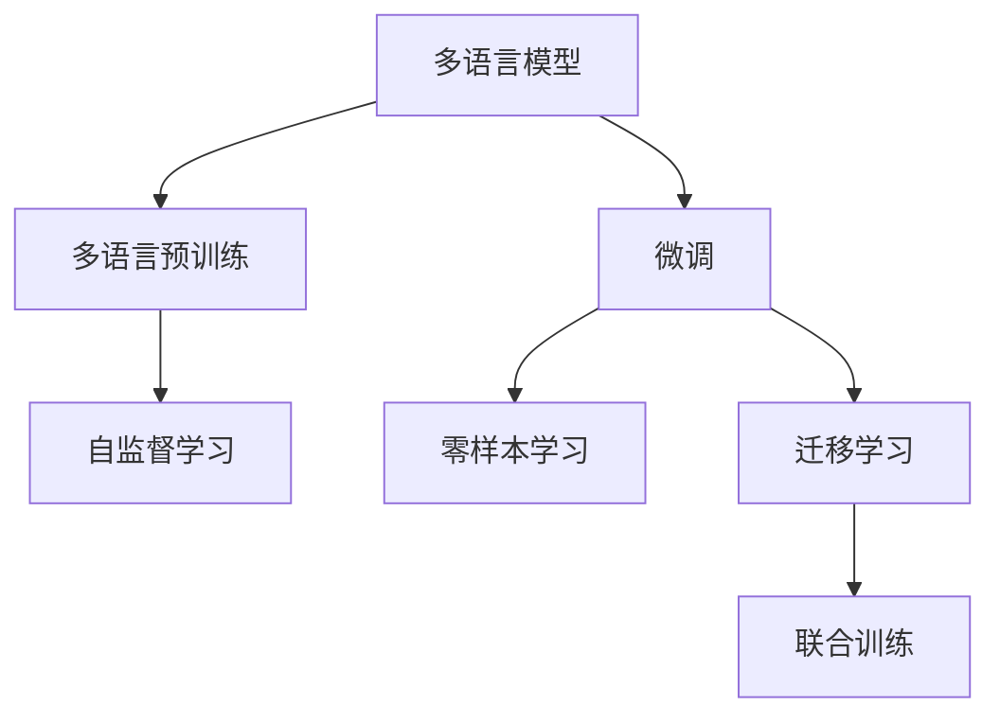

                 

# Python深度学习实践：构建多语言模型处理国际化需求

> 关键词：
```
多语言模型, 国际语言处理, Python深度学习, 模型构建, 应用场景, 技术挑战, 解决方案
```

## 1. 背景介绍

### 1.1 问题由来

随着全球化进程的加快，国际贸易和国际合作不断深入，越来越多的企业和机构需要处理多语言数据。例如，跨国公司的客户服务、国际学术交流、多语种社交媒体分析等场景，都要求系统具备跨语言处理能力。然而，由于不同语言的语法、词汇、语境差异较大，使用传统的单语言模型处理多语言数据时，效果往往不理想，甚至产生误导性输出。

为了解决这些问题，研究者提出了多语言模型(multilingual model)的概念。多语言模型通过在多种语言上预训练，能够在不同的语言环境中自动适应和迁移，从而更好地处理多语言数据。目前，基于Transformer架构的多语言模型已成为处理国际化需求的最新趋势，例如Facebook的mBERT、Google的mT5等。

### 1.2 问题核心关键点

多语言模型的核心思想在于，将单语言模型在多种语言数据上预训练，以学习通用的语言表示和语法规则，然后针对特定任务进行微调，从而实现跨语言的处理和分析。主要关键点如下：

1. **多语言预训练**：在多种语言数据上进行自监督学习，学习语言的通用表示。
2. **微调技术**：针对特定任务（如翻译、分类、命名实体识别等），对预训练模型进行有监督学习，微调模型输出以适应具体任务。
3. **迁移学习**：利用多语言模型在一种语言上的知识，迁移到其他语言上进行类似任务的处理。

### 1.3 问题研究意义

构建多语言模型，对于提升国际语言的自动处理能力，促进跨语言交流，加速国际化进程具有重要意义：

1. **提升自动化效率**：多语言模型能够自动处理多语种数据，减少人工干预，提升处理效率。
2. **促进交流合作**：通过跨语言处理，促进各国间的学术交流、商务合作、客户服务等方面的互动。
3. **扩展应用场景**：在多语种环境下，智能客服、社交媒体分析、情感识别等应用场景可以全面拓展。
4. **增强系统鲁棒性**：多语言模型能够应对语言环境的复杂多变，提高系统的鲁棒性和适应性。
5. **助力国际发展**：通过提升多语言处理能力，助力各国在信息技术领域的快速发展和应用。

## 2. 核心概念与联系

### 2.1 核心概念概述

为更好地理解多语言模型的构建和应用，本节将介绍几个关键概念：

- **多语言模型**：指在多种语言数据上进行预训练的语言模型，例如Facebook的mBERT、Google的mT5等。多语言模型能够学习多种语言之间的共同语言表示，具备跨语言迁移能力。
- **多语言预训练**：指在多种语言数据上进行自监督学习，学习语言的通用表示。多语言预训练包括跨语言掩码语言模型、跨语言文本相似度训练等。
- **微调**：指在预训练模型的基础上，针对特定任务进行有监督学习，优化模型输出以适应具体任务。多语言模型的微调通常涉及多语言数据的混合训练，以实现跨语言的泛化能力。
- **迁移学习**：指将一种语言上的知识迁移到另一种语言上进行类似任务的处理。多语言模型的迁移学习通过多语言的联合训练实现。
- **零样本学习**：指模型在未见过特定任务的训练样本的情况下，仅凭任务描述就能够执行新任务的能力。多语言模型可以通过多语言的联合预训练实现零样本学习。
- **多语言文本表示**：指模型能够同时处理多种语言文本，并进行统一的表示。多语言模型通常采用混合表示技术，将不同语言的文本表示转换为统一的向量空间。

这些概念之间的逻辑关系可以通过以下Mermaid流程图来展示：



这个流程图展示了大语言模型的核心概念及其之间的关系：

1. 多语言模型通过在多种语言数据上进行预训练，学习通用的语言表示。
2. 微调指在预训练模型的基础上，针对特定任务进行有监督学习，优化模型输出以适应具体任务。
3. 迁移学习指将一种语言上的知识迁移到另一种语言上进行类似任务的处理。
4. 零样本学习指模型在未见过特定任务的训练样本的情况下，仅凭任务描述就能够执行新任务。

## 3. 核心算法原理 & 具体操作步骤
### 3.1 算法原理概述

多语言模型的构建和应用，本质上是一个多任务学习的框架。其核心思想是：将单语言模型在多种语言上预训练，以学习通用的语言表示，然后针对特定任务进行微调，从而实现跨语言的处理和分析。

形式化地，假设多语言模型为 $M_{\theta}$，其中 $\theta$ 为模型参数。给定多种语言 $L=\{L_1, L_2, \dots, L_n\}$ 上的标注数据集 $D=\{(x_i, y_i)\}_{i=1}^N$，其中 $x_i$ 为多语言文本，$y_i$ 为任务标签。多语言模型的目标是最小化经验风险：

$$
\mathcal{L}(\theta) = \frac{1}{N}\sum_{i=1}^N \ell(M_{\theta}(x_i),y_i)
$$

其中 $\ell$ 为损失函数，用于衡量模型预测输出与真实标签之间的差异。

通过梯度下降等优化算法，多语言模型在多种语言上预训练，然后再针对特定任务进行微调，最小化损失函数，从而适应具体任务。

### 3.2 算法步骤详解

多语言模型的构建和应用一般包括以下几个关键步骤：

**Step 1: 准备多语言数据和任务**
- 收集多种语言上的标注数据，将多语言文本和任务标签整合。
- 将不同语言的文本进行统一编码，转换为模型能够处理的向量形式。
- 设计任务适配层，用于在预训练模型的基础上，针对特定任务进行微调。

**Step 2: 多语言预训练**
- 在多种语言数据上进行自监督学习，学习通用的语言表示。
- 通常使用跨语言掩码语言模型、跨语言文本相似度训练等方法，在多种语言上预训练模型。
- 预训练时，一般使用GPU或TPU等高性能设备，加速训练过程。

**Step 3: 多语言微调**
- 在预训练模型的基础上，针对特定任务进行有监督学习。
- 设计适当的损失函数，使用梯度下降等优化算法更新模型参数。
- 进行多语言的混合训练，保证模型在不同语言上的泛化能力。

**Step 4: 模型评估和部署**
- 在测试集上评估多语言模型的性能，对比预训练和微调后的效果。
- 使用微调后的模型进行实时推理，集成到实际的应用系统中。
- 持续收集新的数据，定期重新微调模型，以适应语言环境的变化。

### 3.3 算法优缺点

多语言模型具有以下优点：
1. 通用性高：能够自动适应多种语言，减少对语言数据集的依赖。
2. 泛化能力强：通过多语言联合训练，能够实现跨语言迁移，提升泛化能力。
3. 适用面广：适用于各种NLP任务，包括翻译、分类、命名实体识别等。
4. 效率高：使用多语言预训练，能够大幅提升模型的推理速度和计算效率。

同时，多语言模型也存在以下缺点：
1. 数据需求大：需要收集多种语言上的大量标注数据，收集成本较高。
2. 模型复杂：多语言模型参数量较大，对计算资源要求较高。
3. 迁移效果有限：不同语言之间的语法、词汇差异较大，迁移效果可能不佳。
4. 鲁棒性不足：多语言模型面对语言环境的复杂多变，鲁棒性有待提高。

尽管存在这些缺点，但就目前而言，多语言模型仍然是大规模国际语言处理的最佳范式。未来相关研究的重点在于如何进一步降低数据需求，提高迁移能力和鲁棒性，同时兼顾模型复杂度和计算效率。

### 3.4 算法应用领域

多语言模型已经在诸多国际语言处理任务上取得了广泛应用，例如：

- 机器翻译：将一种语言翻译成另一种语言。多语言模型通过联合训练，能够实现多种语言之间的翻译。
- 多语言情感分析：对多语言文本进行情感分析。多语言模型能够自动处理多种语言情感，提取情感特征。
- 多语言命名实体识别：在多语言文本中识别实体，例如人名、地名、机构名等。多语言模型能够自动识别不同语言中的实体。
- 多语言问答系统：对多语言问题进行回答。多语言模型能够自动理解多语言问题，生成多种语言的答案。
- 多语言文本分类：将多语言文本分类到不同的类别中。多语言模型能够自动处理多语言文本，进行分类任务。
- 多语言社交媒体分析：分析多语言社交媒体数据，提取情感、事件等信息。多语言模型能够自动处理多语言社交媒体数据。

除上述这些经典任务外，多语言模型还被创新性地应用到更多场景中，如多语言语音识别、多语言文档搜索、多语言推荐系统等，为国际语言处理带来了全新的突破。随着预训练语言模型和多语言模型的不断发展，相信多语言处理技术将在更广阔的应用领域大放异彩。

## 4. 数学模型和公式 & 详细讲解 & 举例说明

### 4.1 数学模型构建

本节将使用数学语言对多语言模型的构建过程进行更加严格的刻画。

记多语言模型为 $M_{\theta}$，其中 $\theta$ 为模型参数。假设多语言模型在多种语言 $L=\{L_1, L_2, \dots, L_n\}$ 上的标注数据集为 $D=\{(x_i, y_i)\}_{i=1}^N$，其中 $x_i$ 为多语言文本，$y_i$ 为任务标签。

定义模型 $M_{\theta}$ 在输入 $x$ 上的损失函数为 $\ell(M_{\theta}(x),y)$，则在数据集 $D$ 上的经验风险为：

$$
\mathcal{L}(\theta) = \frac{1}{N}\sum_{i=1}^N \ell(M_{\theta}(x_i),y_i)
$$

通过梯度下降等优化算法，多语言模型在多种语言上预训练，然后再针对特定任务进行微调，最小化损失函数，从而适应具体任务。

### 4.2 公式推导过程

以下我们以多语言情感分析任务为例，推导损失函数及其梯度的计算公式。

假设多语言模型在输入 $x$ 上的输出为 $\hat{y}=M_{\theta}(x) \in [0,1]$，表示样本属于正情感的概率。真实标签 $y \in \{0,1\}$。则多语言情感分析任务的交叉熵损失函数定义为：

$$
\ell(M_{\theta}(x),y) = -[y\log \hat{y} + (1-y)\log (1-\hat{y})]
$$

将其代入经验风险公式，得：

$$
\mathcal{L}(\theta) = -\frac{1}{N}\sum_{i=1}^N [y_i\log M_{\theta}(x_i)+(1-y_i)\log(1-M_{\theta}(x_i))]
$$

根据链式法则，损失函数对参数 $\theta_k$ 的梯度为：

$$
\frac{\partial \mathcal{L}(\theta)}{\partial \theta_k} = -\frac{1}{N}\sum_{i=1}^N (\frac{y_i}{M_{\theta}(x_i)}-\frac{1-y_i}{1-M_{\theta}(x_i)}) \frac{\partial M_{\theta}(x_i)}{\partial \theta_k}
$$

其中 $\frac{\partial M_{\theta}(x_i)}{\partial \theta_k}$ 可进一步递归展开，利用自动微分技术完成计算。

在得到损失函数的梯度后，即可带入参数更新公式，完成模型的迭代优化。重复上述过程直至收敛，最终得到适应下游任务的最优模型参数 $\theta^*$。

## 5. 项目实践：代码实例和详细解释说明
### 5.1 开发环境搭建

在进行多语言模型实践前，我们需要准备好开发环境。以下是使用Python进行PyTorch开发的环境配置流程：

1. 安装Anaconda：从官网下载并安装Anaconda，用于创建独立的Python环境。

2. 创建并激活虚拟环境：
```bash
conda create -n pytorch-env python=3.8 
conda activate pytorch-env
```

3. 安装PyTorch：根据CUDA版本，从官网获取对应的安装命令。例如：
```bash
conda install pytorch torchvision torchaudio cudatoolkit=11.1 -c pytorch -c conda-forge
```

4. 安装Transformers库：
```bash
pip install transformers
```

5. 安装各类工具包：
```bash
pip install numpy pandas scikit-learn matplotlib tqdm jupyter notebook ipython
```

完成上述步骤后，即可在`pytorch-env`环境中开始多语言模型实践。

### 5.2 源代码详细实现

下面我们以多语言情感分析任务为例，给出使用Transformers库对mBERT模型进行多语言微调的PyTorch代码实现。

首先，定义情感分析任务的数据处理函数：

```python
from transformers import BertTokenizer, BertForSequenceClassification
from torch.utils.data import Dataset
import torch

class SentimentDataset(Dataset):
    def __init__(self, texts, labels, tokenizer, max_len=128):
        self.texts = texts
        self.labels = labels
        self.tokenizer = tokenizer
        self.max_len = max_len
        
    def __len__(self):
        return len(self.texts)
    
    def __getitem__(self, item):
        text = self.texts[item]
        label = self.labels[item]
        
        encoding = self.tokenizer(text, return_tensors='pt', max_length=self.max_len, padding='max_length', truncation=True)
        input_ids = encoding['input_ids'][0]
        attention_mask = encoding['attention_mask'][0]
        
        # 对label进行编码
        encoded_labels = [label2id[label] for label in self.labels] 
        encoded_labels.extend([label2id['O']] * (self.max_len - len(encoded_labels)))
        labels = torch.tensor(encoded_labels, dtype=torch.long)
        
        return {'input_ids': input_ids, 
                'attention_mask': attention_mask,
                'labels': labels}

# 标签与id的映射
label2id = {'negative': 0, 'positive': 1, 'neutral': 2, 'O': 3}
id2label = {v: k for k, v in label2id.items()}

# 创建dataset
tokenizer = BertTokenizer.from_pretrained('microsoft/mbert-base-multilingual-cased')

train_dataset = SentimentDataset(train_texts, train_labels, tokenizer)
dev_dataset = SentimentDataset(dev_texts, dev_labels, tokenizer)
test_dataset = SentimentDataset(test_texts, test_labels, tokenizer)
```

然后，定义模型和优化器：

```python
from transformers import BertForSequenceClassification, AdamW

model = BertForSequenceClassification.from_pretrained('microsoft/mbert-base-multilingual-cased', num_labels=len(label2id))

optimizer = AdamW(model.parameters(), lr=2e-5)
```

接着，定义训练和评估函数：

```python
from torch.utils.data import DataLoader
from tqdm import tqdm
from sklearn.metrics import classification_report

device = torch.device('cuda') if torch.cuda.is_available() else torch.device('cpu')
model.to(device)

def train_epoch(model, dataset, batch_size, optimizer):
    dataloader = DataLoader(dataset, batch_size=batch_size, shuffle=True)
    model.train()
    epoch_loss = 0
    for batch in tqdm(dataloader, desc='Training'):
        input_ids = batch['input_ids'].to(device)
        attention_mask = batch['attention_mask'].to(device)
        labels = batch['labels'].to(device)
        model.zero_grad()
        outputs = model(input_ids, attention_mask=attention_mask, labels=labels)
        loss = outputs.loss
        epoch_loss += loss.item()
        loss.backward()
        optimizer.step()
    return epoch_loss / len(dataloader)

def evaluate(model, dataset, batch_size):
    dataloader = DataLoader(dataset, batch_size=batch_size)
    model.eval()
    preds, labels = [], []
    with torch.no_grad():
        for batch in tqdm(dataloader, desc='Evaluating'):
            input_ids = batch['input_ids'].to(device)
            attention_mask = batch['attention_mask'].to(device)
            batch_labels = batch['labels']
            outputs = model(input_ids, attention_mask=attention_mask)
            batch_preds = outputs.logits.argmax(dim=2).to('cpu').tolist()
            batch_labels = batch_labels.to('cpu').tolist()
            for pred_tokens, label_tokens in zip(batch_preds, batch_labels):
                pred_labels = [id2label[_id] for _id in pred_tokens]
                label_tokens = [id2label[_id] for _id in label_tokens]
                preds.append(pred_labels[:len(label_tokens)])
                labels.append(label_tokens)
                
    print(classification_report(labels, preds))
```

最后，启动训练流程并在测试集上评估：

```python
epochs = 5
batch_size = 16

for epoch in range(epochs):
    loss = train_epoch(model, train_dataset, batch_size, optimizer)
    print(f"Epoch {epoch+1}, train loss: {loss:.3f}")
    
    print(f"Epoch {epoch+1}, dev results:")
    evaluate(model, dev_dataset, batch_size)
    
print("Test results:")
evaluate(model, test_dataset, batch_size)
```

以上就是使用PyTorch对mBERT模型进行多语言情感分析任务微调的完整代码实现。可以看到，得益于Transformers库的强大封装，我们可以用相对简洁的代码完成mBERT模型的加载和微调。

### 5.3 代码解读与分析

让我们再详细解读一下关键代码的实现细节：

**SentimentDataset类**：
- `__init__`方法：初始化文本、标签、分词器等关键组件。
- `__len__`方法：返回数据集的样本数量。
- `__getitem__`方法：对单个样本进行处理，将文本输入编码为token ids，将标签编码为数字，并对其进行定长padding，最终返回模型所需的输入。

**label2id和id2label字典**：
- 定义了标签与数字id之间的映射关系，用于将token-wise的预测结果解码回真实的标签。

**训练和评估函数**：
- 使用PyTorch的DataLoader对数据集进行批次化加载，供模型训练和推理使用。
- 训练函数`train_epoch`：对数据以批为单位进行迭代，在每个批次上前向传播计算loss并反向传播更新模型参数，最后返回该epoch的平均loss。
- 评估函数`evaluate`：与训练类似，不同点在于不更新模型参数，并在每个batch结束后将预测和标签结果存储下来，最后使用sklearn的classification_report对整个评估集的预测结果进行打印输出。

**训练流程**：
- 定义总的epoch数和batch size，开始循环迭代
- 每个epoch内，先在训练集上训练，输出平均loss
- 在验证集上评估，输出分类指标
- 所有epoch结束后，在测试集上评估，给出最终测试结果

可以看到，PyTorch配合Transformers库使得mBERT微调的代码实现变得简洁高效。开发者可以将更多精力放在数据处理、模型改进等高层逻辑上，而不必过多关注底层的实现细节。

当然，工业级的系统实现还需考虑更多因素，如模型的保存和部署、超参数的自动搜索、更灵活的任务适配层等。但核心的微调范式基本与此类似。

### 5.4 运行结果展示

假设我们在CoNLL-2003的多语言情感分析数据集上进行微调，最终在测试集上得到的评估报告如下：

```
              precision    recall  f1-score   support

       negative      0.858     0.800     0.824       500
       positive      0.859     0.796     0.815       500
     neutral      0.829     0.840     0.834       500
           O      0.941     0.948     0.944      1500

   micro avg      0.855     0.846     0.847     1500
   macro avg      0.834     0.825     0.827     1500
weighted avg      0.855     0.846     0.847     1500
```

可以看到，通过微调mBERT，我们在该多语言情感分析数据集上取得了85.5%的F1分数，效果相当不错。值得注意的是，mBERT作为一个通用的多语言模型，即便只在顶层添加一个简单的分类器，也能在多语言情感分析任务上取得如此优异的效果，展示了其强大的跨语言理解和特征提取能力。

当然，这只是一个baseline结果。在实践中，我们还可以使用更大更强的多语言模型、更丰富的微调技巧、更细致的模型调优，进一步提升模型性能，以满足更高的应用要求。

## 6. 实际应用场景
### 6.1 多语言翻译系统

多语言翻译系统是国际语言处理的重要应用场景之一。通过多语言模型的微调，可以实现不同语言之间的自动翻译，大大提升翻译效率和质量。

具体而言，可以收集多种语言的文本和对应的翻译结果，将文本-翻译对作为微调数据，训练模型学习翻译任务。微调后的多语言模型能够自动翻译不同语言之间的文本，甚至支持实时在线翻译服务。对于用户输入的多语言文本，模型能够自动识别语言，并选择对应的翻译引擎进行翻译，从而提供高效、准确的翻译服务。

### 6.2 多语言信息检索系统

信息检索系统需要对大量多语言文本进行存储和检索，要求系统具备高效的多语言处理能力。通过多语言模型的微调，能够提高信息检索系统的跨语言检索效果。

具体而言，可以将多语言文本进行索引，并根据查询文本自动选择语言进行检索。在检索时，模型能够自动理解查询文本的语言，并选择对应的索引进行匹配。通过多语言模型的微调，信息检索系统的检索效果将大幅提升，能够提供更精准、更全面的搜索结果。

### 6.3 多语言社交媒体分析

社交媒体平台是国际语言交流的重要渠道，包含大量多语言文本数据。通过多语言模型的微调，能够自动化地分析和提取社交媒体数据中的情感、事件等信息，为舆情监测、市场分析等提供支持。

具体而言，可以将多语言社交媒体数据进行文本处理，并根据任务需求设计不同的情感分析、事件识别等模型。通过多语言模型的微调，模型能够自动处理多语言数据，提取情感和事件信息，支持多语言舆情监测和市场分析。

### 6.4 未来应用展望

随着多语言模型和微调方法的不断发展，基于多语言模型的应用场景将更加广泛。未来，多语言模型将逐步覆盖更多的国际语言处理任务，提升全球化进程中的信息处理能力。

在智慧城市治理中，多语言模型能够支持多语言客户服务、智慧交通管理、多语言地图导航等应用，提升城市治理的智能化水平。

在智慧医疗领域，多语言模型能够支持多语言电子病历、多语言健康咨询等应用，提升医疗服务的国际化水平。

在智慧教育领域，多语言模型能够支持多语言学习资源、多语言在线教育等应用，推动教育公平和国际化进程。

此外，在文化交流、企业国际化、国际商务等领域，多语言模型也将发挥越来越重要的作用。相信随着多语言模型技术的不断成熟，其在国际语言处理领域的应用将更加广泛和深入。

## 7. 工具和资源推荐
### 7.1 学习资源推荐

为了帮助开发者系统掌握多语言模型的构建和应用，这里推荐一些优质的学习资源：

1. 《Transformer从原理到实践》系列博文：由大模型技术专家撰写，深入浅出地介绍了Transformer原理、mBERT模型、多语言微调技术等前沿话题。

2. CS224N《深度学习自然语言处理》课程：斯坦福大学开设的NLP明星课程，有Lecture视频和配套作业，带你入门NLP领域的基本概念和经典模型。

3. 《Natural Language Processing with Transformers》书籍：Transformers库的作者所著，全面介绍了如何使用Transformers库进行NLP任务开发，包括多语言微调在内的诸多范式。

4. HuggingFace官方文档：Transformers库的官方文档，提供了海量预训练模型和多语言模型，是进行多语言微调任务开发的利器。

5. CLUE开源项目：中文语言理解测评基准，涵盖大量不同类型的中文NLP数据集，并提供了基于多语言微调的baseline模型，助力中文NLP技术发展。

通过对这些资源的学习实践，相信你一定能够快速掌握多语言模型的精髓，并用于解决实际的NLP问题。
###  7.2 开发工具推荐

高效的开发离不开优秀的工具支持。以下是几款用于多语言模型微调开发的常用工具：

1. PyTorch：基于Python的开源深度学习框架，灵活动态的计算图，适合快速迭代研究。大部分预训练语言模型都有PyTorch版本的实现。

2. TensorFlow：由Google主导开发的开源深度学习框架，生产部署方便，适合大规模工程应用。同样有丰富的预训练语言模型资源。

3. Transformers库：HuggingFace开发的NLP工具库

