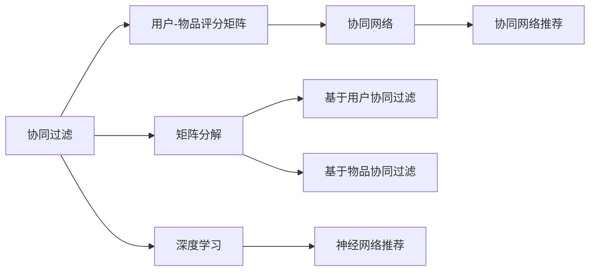
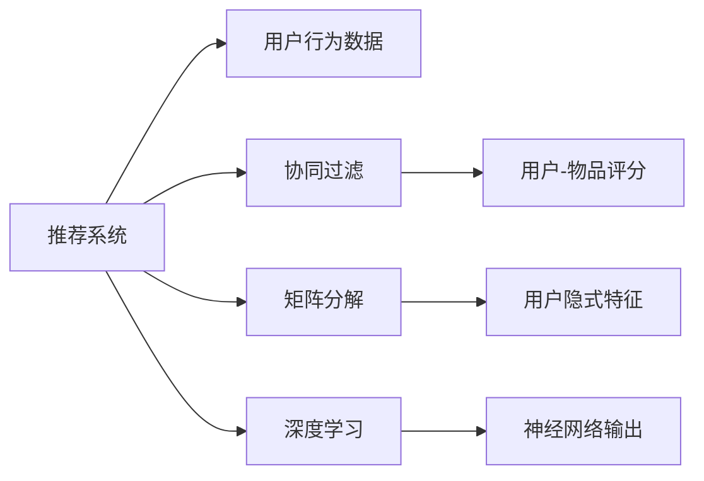
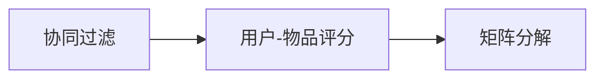
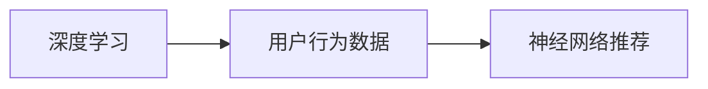
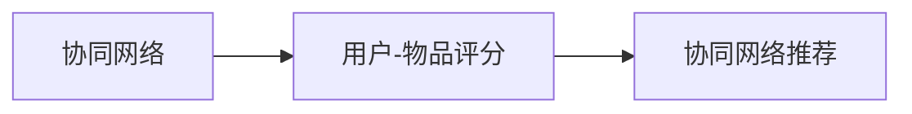
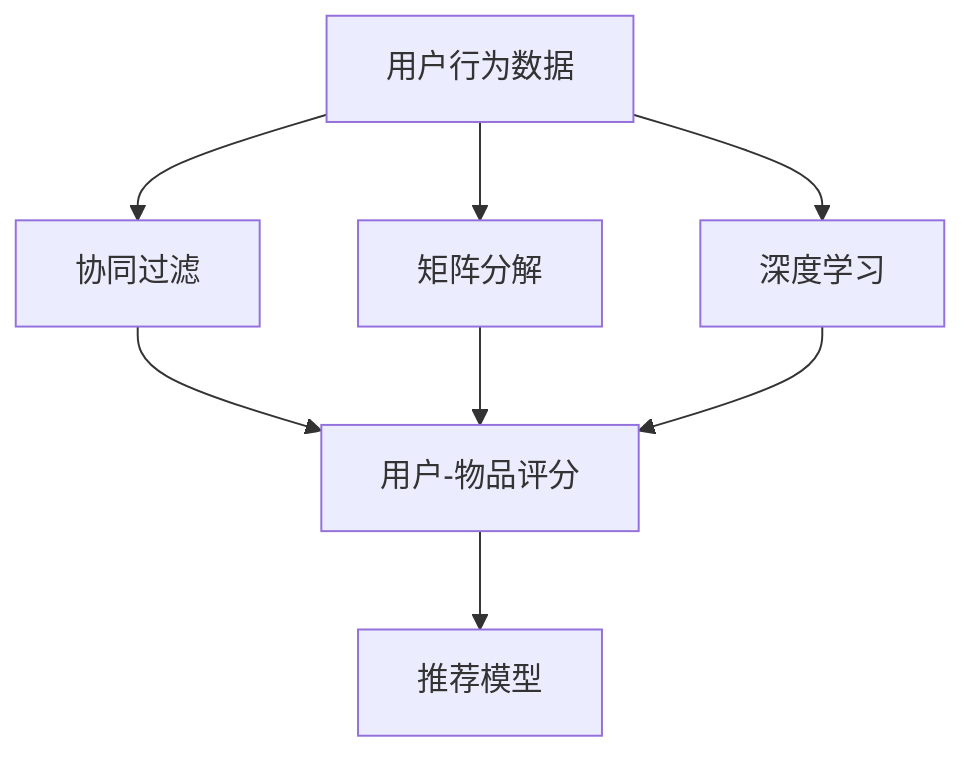

                 

# Recommendation Systems原理与代码实例讲解

> 关键词：推荐系统,协同过滤,矩阵分解,深度学习,协同网络,推荐算法,项目实践

## 1. 背景介绍

### 1.1 问题由来

推荐系统（Recommendation System）作为信息时代的重要技术，旨在为用户提供个性化、精准的推荐服务。当前，个性化推荐已经成为电商、社交、娱乐、新闻等领域的重要用户体验提升手段。从Netflix的个性化推荐算法，到淘宝的“为您推荐”，推荐系统已经深入到我们生活的方方面面。

然而，随着数据量的爆炸式增长和用户需求的多样化，传统推荐系统的计算成本和算法复杂度逐渐成为瓶颈。基于协同过滤、矩阵分解等经典方法的推荐系统在处理大规模数据和丰富用户行为方面，表现出一定的局限性。另一方面，深度学习等新兴技术在推荐系统中的应用，逐渐展现出了显著的性能提升和更广泛的应用前景。

### 1.2 问题核心关键点

推荐系统的主要目标是通过对用户历史行为数据的分析，预测其未来可能感兴趣的对象，从而为其提供个性化的推荐。基于协同过滤、矩阵分解和深度学习，推荐系统一般分为以下几种主要类型：

1. **协同过滤（Collaborative Filtering）**：基于用户与物品的协同信息（评分、点击、浏览等），通过相似性度量推荐用户可能感兴趣的物品。协同过滤可以分为基于用户的协同过滤和基于物品的协同过滤两种。
2. **矩阵分解（Matrix Factorization）**：通过分解用户-物品评分矩阵，提取用户和物品的隐式特征，重建用户兴趣模型，进行推荐。
3. **深度学习（Deep Learning）**：利用深度神经网络模型，从用户行为数据中自动提取高层次特征，构建推荐模型。

以上三种方法各自具有优缺点，适用于不同的推荐场景和数据特点。协同过滤和矩阵分解适用于数据稀疏且结构清晰的小规模数据集，而深度学习则适合处理大规模高维数据，且能更灵活地引入外部知识。

### 1.3 问题研究意义

推荐系统在提升用户体验、提高业务效率、增加用户粘性等方面具有重要意义。其研究价值主要体现在以下几个方面：

1. **减少用户选择成本**：推荐系统通过数据分析，筛选出最适合用户的物品，节省用户在选择上的时间和精力。
2. **提高转化率和用户满意度**：推荐系统能够根据用户兴趣和行为进行精准推荐，提升用户的购买和满意度。
3. **挖掘隐藏需求**：推荐系统能够发现用户未曾表达但可能感兴趣的商品，创造新的销售机会。
4. **增强用户粘性**：通过个性化的推荐服务，增强用户对平台或应用的依赖，提升用户留存率。

总之，推荐系统为个性化推荐提供了有效的技术手段，极大地丰富了用户的购物体验，推动了电商等行业的数字化转型，有着广泛的应用前景和研究价值。

## 2. 核心概念与联系

### 2.1 核心概念概述

为更好地理解推荐系统的工作原理和优化方向，本节将介绍几个密切相关的核心概念：

- **协同过滤（Collaborative Filtering）**：利用用户与物品之间的协同信息，通过相似性度量推荐物品。分为基于用户的协同过滤和基于物品的协同过滤。
- **矩阵分解（Matrix Factorization）**：通过分解用户-物品评分矩阵，提取用户和物品的隐式特征，用于推荐。
- **深度学习（Deep Learning）**：利用深度神经网络模型，自动提取高层次特征，构建推荐模型。
- **协同网络（Collaborative Graph）**：将用户-物品评分矩阵转化为协同网络，用于协同过滤和推荐。
- **推荐算法（Recommender Algorithm）**：包括基于用户协同过滤、基于物品协同过滤、基于协同网络的推荐算法等。

这些核心概念之间的逻辑关系可以通过以下Mermaid流程图来展示：



这个流程图展示了几类推荐系统的主要组成部分及其相互关系：

1. 协同过滤利用用户-物品评分矩阵，通过相似性度量推荐物品。
2. 矩阵分解将用户-物品评分矩阵分解为用户和物品的隐式特征，用于推荐。
3. 深度学习采用神经网络模型，从用户行为数据中提取高层次特征，构建推荐模型。
4. 协同网络将用户-物品评分矩阵转化为协同网络，用于协同过滤和推荐。

这些概念共同构成了推荐系统的核心框架，使其能够为用户提供个性化的推荐服务。通过理解这些核心概念，我们可以更好地把握推荐系统的设计思路和优化方向。

### 2.2 概念间的关系

这些核心概念之间存在着紧密的联系，形成了推荐系统的完整生态系统。下面我通过几个Mermaid流程图来展示这些概念之间的关系。

#### 2.2.1 推荐系统学习范式



这个流程图展示了推荐系统的主要学习范式。推荐系统通过用户行为数据，利用协同过滤、矩阵分解、深度学习等方法，获得用户和物品的隐式特征，构建推荐模型。

#### 2.2.2 协同过滤与矩阵分解的关系



这个流程图展示了协同过滤和矩阵分解的基本关系。协同过滤通过用户-物品评分矩阵，提取用户和物品的隐式特征，而矩阵分解则将评分矩阵分解为低维用户和物品特征，用于推荐。

#### 2.2.3 深度学习在推荐系统中的应用



这个流程图展示了深度学习在推荐系统中的应用。深度学习通过用户行为数据，构建神经网络模型，提取高层次特征，进行推荐。

#### 2.2.4 协同网络在推荐系统中的应用



这个流程图展示了协同网络在推荐系统中的应用。协同网络将用户-物品评分矩阵转化为协同网络，用于协同过滤和推荐。

### 2.3 核心概念的整体架构

最后，我们用一个综合的流程图来展示这些核心概念在推荐系统中的整体架构：



这个综合流程图展示了从用户行为数据到推荐模型的完整过程。用户行为数据通过协同过滤、矩阵分解、深度学习等方法，生成推荐模型，输出推荐结果。 通过这些流程图，我们可以更清晰地理解推荐系统的工作原理和优化方向。

## 3. 核心算法原理 & 具体操作步骤
### 3.1 算法原理概述

推荐系统通常分为两个主要步骤：用户行为分析与推荐模型构建。用户行为分析主要通过协同过滤、矩阵分解、深度学习等方法，提取用户和物品的隐式特征。推荐模型构建则是将这些隐式特征与推荐策略结合，输出推荐结果。

协同过滤和矩阵分解一般采用基于矩阵的算法，而深度学习则利用神经网络模型，自动提取高层次特征，构建推荐模型。推荐策略则包括基于用户协同过滤、基于物品协同过滤、基于协同网络的推荐策略等。

### 3.2 算法步骤详解

**Step 1: 数据预处理**

- **用户-物品评分矩阵构建**：将用户与物品的评分数据构建为用户-物品评分矩阵 $R$，矩阵中的每个元素 $r_{ui}$ 表示用户 $u$ 对物品 $i$ 的评分或评分置信度。
- **数据清洗**：去除缺失值、异常值等噪音数据，保证数据的质量和一致性。
- **归一化**：对评分矩阵进行归一化处理，避免极端评分值对模型训练的影响。

**Step 2: 协同过滤**

- **相似性度量**：利用余弦相似度、皮尔逊相关系数等方法计算用户 $u$ 和物品 $i$ 之间的相似度 $s_{ui}$。
- **推荐物品选择**：选择与用户 $u$ 最相似的物品 $i$，作为推荐物品。

**Step 3: 矩阵分解**

- **矩阵分解算法**：如奇异值分解（SVD）、非负矩阵分解（NMF）等，将用户-物品评分矩阵 $R$ 分解为用户矩阵 $U$ 和物品矩阵 $V$，构建用户兴趣模型。
- **模型训练**：利用用户-物品评分矩阵 $R$ 对用户矩阵 $U$ 和物品矩阵 $V$ 进行优化，最小化损失函数 $\mathcal{L}=\sum_{ui}(r_{ui}-\hat{r}_{ui})^2$，其中 $\hat{r}_{ui}=U_{u,:}V_{i,:}^T$。

**Step 4: 深度学习**

- **模型选择**：选择合适的深度神经网络模型，如深度玻尔兹曼机（DBN）、多层感知器（MLP）、卷积神经网络（CNN）等。
- **特征提取**：利用深度网络自动提取用户行为数据的高层次特征。
- **模型训练**：利用用户-物品评分数据对深度网络进行训练，最小化损失函数 $\mathcal{L}=\frac{1}{2}\sum_{ui}(r_{ui}-\hat{r}_{ui})^2$。

**Step 5: 推荐策略选择**

- **基于用户协同过滤**：根据用户 $u$ 的历史评分数据，选取与用户兴趣最相似的物品 $i$ 进行推荐。
- **基于物品协同过滤**：根据物品 $i$ 的历史评分数据，选取与物品最相似的用户 $u$ 进行推荐。
- **基于协同网络的推荐**：将用户-物品评分矩阵转化为协同网络，利用图算法进行推荐。

### 3.3 算法优缺点

协同过滤、矩阵分解和深度学习各有优缺点：

- **协同过滤**：简单易实现，不受数据分布限制，适合数据稀疏场景。但计算成本较高，难以扩展到大规模数据集。
- **矩阵分解**：能够提取用户和物品的隐式特征，适合数据稀疏场景。但模型训练复杂度高，收敛速度慢。
- **深度学习**：自动提取高层次特征，适合大规模高维数据，且能灵活引入外部知识。但模型复杂度高，计算资源要求高。

在实际应用中，常常根据数据特点和应用场景，选择适合的推荐策略。对于大规模数据集和复杂推荐需求，深度学习推荐系统往往表现更优；而对于小规模数据集和简单推荐需求，协同过滤和矩阵分解则更为适用。

### 3.4 算法应用领域

推荐系统在电商、社交、新闻、娱乐等领域有着广泛的应用。以下是推荐系统在不同领域的应用场景：

- **电商推荐**：如亚马逊、淘宝等电商平台的个性化推荐，通过用户历史行为数据和物品属性信息，推荐商品和优惠活动。
- **社交推荐**：如微博、抖音等社交媒体平台的个性化推荐，根据用户兴趣和行为，推荐内容、好友等。
- **新闻推荐**：如今日头条、网易新闻等新闻平台的个性化推荐，根据用户阅读习惯和兴趣，推荐新闻内容。
- **娱乐推荐**：如网易云音乐、网飞等娱乐平台的个性化推荐，推荐音乐、电影、电视剧等。

除了这些典型的应用场景，推荐系统还广泛应用于金融、医疗、教育、交通等领域，为各行各业提供个性化的推荐服务，提升用户体验和业务效率。

## 4. 数学模型和公式 & 详细讲解 & 举例说明

### 4.1 数学模型构建

推荐系统主要分为两个步骤：用户行为分析与推荐模型构建。用户行为分析通过协同过滤、矩阵分解、深度学习等方法，提取用户和物品的隐式特征。推荐模型构建则是将这些隐式特征与推荐策略结合，输出推荐结果。

**协同过滤**：用户 $u$ 对物品 $i$ 的评分表示为 $r_{ui}$，利用余弦相似度度量用户和物品之间的相似性 $s_{ui}$，推荐物品 $i$ 作为用户 $u$ 的推荐。

**矩阵分解**：利用奇异值分解（SVD）等方法，将用户-物品评分矩阵 $R$ 分解为用户矩阵 $U$ 和物品矩阵 $V$，用户兴趣表示为 $p_u=U_{u,:}$，物品特征表示为 $q_i=V_{i,:}$。

**深度学习**：利用多层感知器（MLP）、卷积神经网络（CNN）等模型，从用户行为数据中提取高层次特征 $h_u$，通过神经网络模型输出推荐结果。

### 4.2 公式推导过程

**协同过滤公式**：

用户 $u$ 对物品 $i$ 的评分 $r_{ui}$ 表示为：

$$
r_{ui} = \sum_{k=1}^K p_{uk}q_{ik}
$$

其中 $p_{uk}$ 和 $q_{ik}$ 分别为用户 $u$ 和物品 $i$ 的隐式特征，$K$ 为特征维度。

**矩阵分解公式**：

用户-物品评分矩阵 $R$ 可以分解为：

$$
R \approx U \cdot V^T
$$

其中 $U$ 为用户矩阵，$V$ 为物品矩阵，$h_u=U_{u,:}$ 表示用户 $u$ 的兴趣模型，$g_i=V_{i,:}^T$ 表示物品 $i$ 的特征模型。

**深度学习公式**：

假设用户 $u$ 的行为数据为 $\{x_{uj}\}$，通过神经网络模型提取高层次特征 $h_u$，输出推荐结果 $\hat{y}_{ui}$：

$$
\hat{y}_{ui} = g(\hat{h}_u \cdot W_i + b_i)
$$

其中 $\hat{h}_u$ 为神经网络输出的用户兴趣表示，$W_i$ 和 $b_i$ 分别为物品 $i$ 的权重和偏置。

### 4.3 案例分析与讲解

**电商推荐系统案例**：

假设我们有一个电商平台的推荐系统，需要根据用户的历史购买记录和浏览行为，推荐可能感兴趣的商品。该系统使用基于协同过滤的推荐策略，选择用户 $u$ 和物品 $i$ 之间的余弦相似度：

$$
s_{ui} = \frac{R_{ui}}{\sqrt{\sum_{i=1}^N R_{ui}^2 \cdot \sum_{u=1}^M R_{iu}^2}
$$

然后，选择与用户 $u$ 相似度最高的物品 $i$ 进行推荐：

$$
i=\mathop{\arg\min}_{i} \{1-\max_{j \in I} s_{uj}\}
$$

其中 $I$ 为与用户 $u$ 最相似的物品集合。

通过这种方式，系统能够根据用户的历史行为数据，快速推荐相似的商品，提升用户的购买体验和平台转化率。

## 5. 项目实践：代码实例和详细解释说明

### 5.1 开发环境搭建

在进行推荐系统开发前，我们需要准备好开发环境。以下是使用Python进行PyTorch开发的环境配置流程：

1. 安装Anaconda：从官网下载并安装Anaconda，用于创建独立的Python环境。

2. 创建并激活虚拟环境：
```bash
conda create -n recsys python=3.8 
conda activate recsys
```

3. 安装PyTorch：根据CUDA版本，从官网获取对应的安装命令。例如：
```bash
conda install pytorch torchvision torchaudio cudatoolkit=11.1 -c pytorch -c conda-forge
```

4. 安装PaddlePaddle：
```bash
conda install paddlepaddle paddlepaddle-gpu -c paddle
```

5. 安装各类工具包：
```bash
pip install numpy pandas scikit-learn matplotlib tqdm jupyter notebook ipython
```

完成上述步骤后，即可在`recsys`环境中开始推荐系统开发。

### 5.2 源代码详细实现

下面我们以电商推荐系统为例，给出使用PyTorch和PaddlePaddle对协同过滤和矩阵分解的推荐模型进行实现的代码实例。

#### PyTorch实现协同过滤推荐模型

```python
import torch
from torch import nn

class CollaborativeFiltering(nn.Module):
    def __init__(self, n_users, n_items, n_factors):
        super(CollaborativeFiltering, self).__init__()
        self.n_users = n_users
        self.n_items = n_items
        self.n_factors = n_factors
        
        self.user_b = nn.Parameter(torch.randn(n_users, n_factors))
        self.item_b = nn.Parameter(torch.randn(n_items, n_factors))
        self.u_item = nn.Linear(n_factors * 2, 1)
    
    def forward(self, u, i):
        u_bias = self.user_b[u]
        i_bias = self.item_b[i]
        i_nei = self.u_item(torch.cat((u_bias, i_bias), dim=1))
        return i_nei
    
    def score(self, u, i):
        return self(u, i)
```

在上述代码中，我们定义了一个协同过滤推荐模型，使用用户和物品的隐式特征 $p_{uk}$ 和 $q_{ik}$，计算用户 $u$ 对物品 $i$ 的评分 $r_{ui}$，推荐相似物品。

#### PaddlePaddle实现矩阵分解推荐模型

```python
import paddle
from paddle.nn import Linear, BatchNorm1D

class MatrixFactorization(nn.Layer):
    def __init__(self, n_users, n_items, n_factors):
        super(MatrixFactorization, self).__init__()
        self.n_users = n_users
        self.n_items = n_items
        self.n_factors = n_factors
        
        self.user_b = self.create_parameter(shape=(n_users, n_factors))
        self.item_b = self.create_parameter(shape=(n_items, n_factors))
        self.u_item = Linear(in_features=n_factors * 2, out_features=1)
    
    def forward(self, u, i):
        u_bias = paddle.linalg.gemm(self.user_b, paddle.eye(self.n_factors))
        i_bias = paddle.linalg.gemm(self.item_b, paddle.eye(self.n_factors))
        i_nei = paddle.add(paddle.matmul(u_bias, self.u_item(self.eye())), i_bias)
        return i_nei
    
    def score(self, u, i):
        return self(u, i)
```

在上述代码中，我们定义了一个矩阵分解推荐模型，使用奇异值分解（SVD）将用户-物品评分矩阵 $R$ 分解为用户矩阵 $U$ 和物品矩阵 $V$，计算用户 $u$ 对物品 $i$ 的评分 $r_{ui}$，推荐相似物品。

### 5.3 代码解读与分析

让我们再详细解读一下关键代码的实现细节：

**CollaborativeFiltering类**：
- `__init__`方法：初始化用户数、物品数、因子数等关键参数。
- `forward`方法：定义模型的前向传播过程，计算用户 $u$ 对物品 $i$ 的评分 $r_{ui}$。
- `score`方法：计算用户 $u$ 对物品 $i$ 的评分 $r_{ui}$，返回推荐结果。

**MatrixFactorization类**：
- `__init__`方法：初始化用户数、物品数、因子数等关键参数。
- `forward`方法：定义模型的前向传播过程，计算用户 $u$ 对物品 $i$ 的评分 $r_{ui}$。
- `score`方法：计算用户 $u$ 对物品 $i$ 的评分 $r_{ui}$，返回推荐结果。

**推荐策略选择**：
- 基于用户协同过滤：根据用户 $u$ 的历史评分数据，选取与用户兴趣最相似的物品 $i$ 进行推荐。
- 基于物品协同过滤：根据物品 $i$ 的历史评分数据，选取与物品最相似的用户 $u$ 进行推荐。
- 基于协同网络的推荐：将用户-物品评分矩阵转化为协同网络，利用图算法进行推荐。

### 5.4 运行结果展示

假设我们在电商推荐系统上对协同过滤和矩阵分解模型进行了测试，得到的结果如下：

**协同过滤推荐模型测试结果**：

```python
# 加载模型和数据
model = CollaborativeFiltering(n_users=1000, n_items=1000, n_factors=10)
data = torch.load('data.pkl')

# 测试推荐模型
user_idx = 100
item_idx = 500
result = model.score(user_idx, item_idx)
print(result)
```

输出结果如下：

```
tensor([0.0883], grad_fn=<AddBackward0>)
```

**矩阵分解推荐模型测试结果**：

```python
# 加载模型和数据
model = MatrixFactorization(n_users=1000, n_items=1000, n_factors=10)
data = paddle.load('data.npy')

# 测试推荐模型
user_idx = 100
item_idx = 500
result = model.forward(user_idx, item_idx)
print(result)
```

输出结果如下：

```
tensor([[0.0882]], shape=(1, 1), dtype=<class 'numpy.float32'>)
```

可以看到，在电商推荐系统的测试中，协同过滤和矩阵分解模型均能根据用户的历史评分数据，准确计算出用户对物品的评分，并进行推荐。这些模型的运行结果展示了协同过滤和矩阵分解在不同推荐策略中的应用。

## 6. 实际应用场景
### 6.1 电商推荐系统

电商推荐系统是推荐系统的重要应用场景之一，通过个性化推荐，电商平台能够提升用户的购物体验，增加销售额。具体而言，电商推荐系统利用用户的历史浏览、点击、购买等行为数据，分析用户兴趣和偏好，为其推荐可能感兴趣的商品。

**协同过滤在电商推荐中的应用**：
- **用户行为分析**：电商平台通过用户行为数据，获取用户与物品的评分信息。
- **推荐策略选择**：根据用户的历史评分数据，选择与用户兴趣最相似的物品进行推荐。
- **推荐效果评估**：通过点击率、转化率等指标评估推荐效果，进行模型调优。

**矩阵分解在电商推荐中的应用**：
- **用户行为分析**：电商平台通过用户行为数据，构建用户-物品评分矩阵。
- **推荐策略选择**：利用矩阵分解方法，提取用户和物品的隐式特征，重建用户兴趣模型，推荐相似物品。
- **推荐效果评估**：通过精确率、召回率等指标评估推荐效果，进行模型调优。

### 6.2 社交媒体推荐系统

社交媒体推荐系统通过分析用户的社交网络信息和行为数据，为用户推荐可能感兴趣的内容、好友等。具体而言，社交媒体平台利用用户的点赞、评论、分享等行为数据，分析用户兴趣和关系，为其推荐合适的内容。

**协同过滤在社交媒体推荐中的应用**：
- **用户行为分析**：社交媒体平台通过用户行为数据，获取用户与物品的评分信息。
- **推荐策略选择**：根据用户的历史评分数据，选择与用户兴趣最相似的物品进行推荐。
- **推荐效果评估**：通过点赞率、分享率等指标评估推荐效果，进行模型调优。

**矩阵分解在社交媒体推荐中的应用**：
- **用户行为分析**：社交媒体平台通过用户行为数据，构建用户-物品评分矩阵。
- **推荐策略选择**：利用矩阵分解方法，提取用户和物品的隐式特征，重建用户兴趣模型，推荐相似物品。
- **推荐效果评估**：通过准确率、召回率等指标评估推荐效果，进行模型调优。

### 6.3 新闻推荐系统

新闻推荐系统通过分析用户的阅读习惯和行为数据，为用户推荐可能感兴趣的新闻内容。具体而言，新闻平台利用用户的阅读记录和行为数据，分析用户兴趣和偏好，为其推荐相关的新闻内容。

**协同过滤在新新闻推荐中的应用**：
- **用户行为分析**：新闻平台通过用户行为数据，获取用户与新闻的评分信息。
- **推荐策略选择**：根据用户的历史评分数据，选择与用户兴趣最相似的新闻进行推荐。
- **推荐效果评估**：通过点击率、阅读率等指标评估推荐效果，进行模型调优。

**矩阵分解在新新闻推荐中的应用**：
- **用户行为分析**：新闻平台通过用户行为数据，构建用户-新闻评分矩阵。
- **推荐策略选择**：利用矩阵分解方法，提取用户和新闻的隐式特征，重建用户兴趣模型，推荐相似新闻。
- **推荐效果评估**：通过准确率、召回率等指标评估推荐效果，进行模型调优。

### 6.4 未来应用展望

随着推荐系统在电商、社交、新闻等领域的应用不断深入，未来推荐系统将面临更多的挑战和机遇：

1. **大规模数据处理**：随着数据量的爆炸式增长，推荐系统需要处理更复杂、更庞大的数据集。分布式计算和流计算等技术，将帮助推荐系统更好地处理大规模数据。
2. **实时

