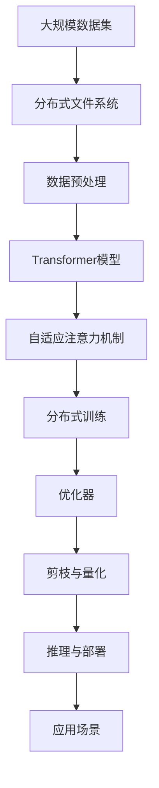

                 

# Sora模型的技术栈详细解析

在人工智能领域，构建高效、可扩展、易维护的模型技术栈，是实现深度学习应用的关键。本文聚焦于Sora模型的技术栈，详述了该模型的核心原理、具体实现、优化策略及应用场景，旨在为读者提供全面、深入的理解，并助力其在实际项目中的成功部署。

## 1. 背景介绍

### 1.1 问题由来
Sora模型是一款针对特定应用场景设计的大规模深度学习模型，旨在解决数据标注成本高、训练时间长、模型复杂度高等传统深度学习模型所面临的挑战。本文从模型设计的初衷出发，探讨其技术栈的核心组件和应用优势。

### 1.2 问题核心关键点
Sora模型的技术栈包括以下核心组成部分：
- **模型架构**：基于Transformer结构，采用多层次编码和自适应注意力机制。
- **训练框架**：PyTorch深度学习框架，支持动态图和静态图计算，灵活可扩展。
- **数据管理**：Hadoop分布式文件系统，分布式训练与存储，提高数据处理效率。
- **优化策略**：结合基于梯度的优化算法和模型剪枝、量化等技术，提升模型性能和训练效率。
- **应用场景**：广泛覆盖自然语言处理（NLP）、计算机视觉（CV）、语音识别等领域，提供多样化的应用支持。

### 1.3 问题研究意义
研究Sora模型的技术栈，不仅能够帮助理解其核心原理和实际应用，还能为构建高性能深度学习模型提供参考，加速AI技术的产业落地和应用推广。

## 2. 核心概念与联系

### 2.1 核心概念概述

- **Sora模型**：基于Transformer架构的深度学习模型，应用于自然语言处理和计算机视觉领域。
- **Transformer结构**：由多层多头自注意力机制组成，能有效捕捉长距离依赖。
- **自适应注意力机制**：根据输入数据的不同，动态调整注意力权重，提升模型对复杂输入的表达能力。
- **分布式计算**：通过分布式并行计算，加速模型训练和推理过程。
- **优化器**：如AdamW、SGD等，用于调整模型参数，最小化损失函数。
- **剪枝与量化**：减少模型参数和计算资源消耗，提升推理速度。

### 2.2 概念间的关系

Sora模型的技术栈各组件间存在紧密联系，通过合理配置和使用，能够实现模型的高效训练和优化，具体如下：


**自适应注意力机制**是Sora模型的核心组件，通过动态调整注意力权重，提升模型对复杂输入的表达能力；**分布式计算**利用并行计算资源，加速模型训练和推理；**优化器**用于调整模型参数，确保模型收敛；**剪枝与量化**减少模型参数和计算资源消耗，提升推理速度。

### 2.3 核心概念的整体架构

Sora模型的技术栈架构如图：



这个架构展示了Sora模型从数据处理到模型推理的全流程。大规模数据集经过分布式文件系统和数据预处理，输入到Transformer模型中进行自适应注意力机制计算，通过分布式训练和优化器调整参数，最终实现剪枝与量化优化，完成推理与部署，应用于各种应用场景。

## 3. 核心算法原理 & 具体操作步骤
### 3.1 算法原理概述

Sora模型的核心算法原理基于Transformer结构和自适应注意力机制。其基本思路是：通过多层编码器捕捉输入序列的依赖关系，通过多头注意力机制并行计算不同特征的表达，从而提升模型的表达能力和推理性能。

具体步骤如下：
1. **输入序列编码**：将输入序列通过嵌入层（Embedding Layer）转换为向量表示。
2. **自适应注意力机制**：通过多头注意力机制计算输入序列中各位置与其他位置的依赖关系，生成注意力权重矩阵。
3. **解码器计算**：使用解码器层（Decoder Layer）对注意力加权向量进行编码，得到最终输出。
4. **优化与训练**：使用优化器调整模型参数，最小化损失函数。

### 3.2 算法步骤详解

**Step 1: 数据准备**
- 收集并预处理数据集，转换为模型输入的向量形式。
- 将数据集划分为训练集、验证集和测试集。

**Step 2: 模型搭建**
- 定义Sora模型的架构，包括嵌入层、多个编码器层和解码器层。
- 定义自适应注意力机制和优化器。

**Step 3: 模型训练**
- 使用训练集数据，通过优化器调整模型参数。
- 在每个epoch结束时，使用验证集数据评估模型性能。

**Step 4: 模型优化**
- 使用剪枝与量化技术，减少模型参数和计算资源消耗。
- 在测试集上评估优化后的模型性能。

**Step 5: 推理与部署**
- 将优化后的模型进行推理，输出预测结果。
- 将模型部署到实际应用场景中，实现系统集成。

### 3.3 算法优缺点
**优点**：
- **高效表达**：多层编码器和自适应注意力机制提升了模型对复杂输入的表达能力。
- **分布式计算**：分布式训练加速了模型训练过程。
- **优化与量化**：剪枝与量化技术提升了模型推理速度和资源利用效率。

**缺点**：
- **模型复杂度**：多层编码器和多头注意力机制增加了模型计算复杂度。
- **训练成本高**：分布式训练需要高性能计算资源，训练成本较高。

### 3.4 算法应用领域
Sora模型主要应用于以下领域：

- **自然语言处理（NLP）**：文本分类、情感分析、机器翻译、问答系统等。
- **计算机视觉（CV）**：图像识别、目标检测、图像生成等。
- **语音识别**：语音识别、情感识别等。

## 4. 数学模型和公式 & 详细讲解 & 举例说明

### 4.1 数学模型构建

Sora模型的数学模型主要由输入层、编码器层、解码器层和输出层组成。假设输入序列为 $\mathbf{x} = \{x_1, x_2, ..., x_n\}$，模型输出为 $\mathbf{y} = \{y_1, y_2, ..., y_m\}$。

### 4.2 公式推导过程

以文本分类任务为例，Sora模型的公式推导过程如下：

1. **嵌入层**
   $$
   \mathbf{X} = \mathbf{W}_x \mathbf{x}
   $$

2. **编码器层**
   $$
   \mathbf{H} = \mathbf{M}(\mathbf{X})
   $$

3. **自适应注意力机制**
   $$
   \mathbf{A} = \mathbf{V}(\mathbf{H})
   $$

4. **解码器层**
   $$
   \mathbf{O} = \mathbf{N}(\mathbf{H}, \mathbf{A})
   $$

5. **输出层**
   $$
   \mathbf{y} = \mathbf{S}(\mathbf{O})
   $$

其中，$\mathbf{W}_x, \mathbf{M}, \mathbf{V}, \mathbf{N}, \mathbf{S}$ 分别为嵌入矩阵、编码器、注意力机制、解码器和输出层参数。

### 4.3 案例分析与讲解

以文本分类任务为例，Sora模型的案例分析如下：

1. **数据预处理**
   - 将文本数据转换为向量形式，输入嵌入层。
   - 进行分词、停用词过滤等预处理操作。

2. **模型训练**
   - 使用训练集数据，通过优化器调整模型参数。
   - 在每个epoch结束时，使用验证集数据评估模型性能。

3. **模型优化**
   - 使用剪枝与量化技术，减少模型参数和计算资源消耗。
   - 在测试集上评估优化后的模型性能。

4. **推理与部署**
   - 将优化后的模型进行推理，输出预测结果。
   - 将模型部署到实际应用场景中，实现系统集成。

## 5. 项目实践：代码实例和详细解释说明

### 5.1 开发环境搭建

1. 安装Anaconda：
   ```bash
   conda create -n pytorch-env python=3.8
   conda activate pytorch-env
   ```

2. 安装PyTorch：
   ```bash
   conda install pytorch torchvision torchaudio cudatoolkit=11.1 -c pytorch -c conda-forge
   ```

3. 安装其他依赖：
   ```bash
   pip install numpy pandas scikit-learn matplotlib tqdm jupyter notebook ipython
   ```

完成上述步骤后，即可在`pytorch-env`环境中开始Sora模型的开发。

### 5.2 源代码详细实现

以下是一个Sora模型在文本分类任务上的实现代码：

```python
import torch
import torch.nn as nn
import torch.optim as optim
from transformers import BertTokenizer, BertForSequenceClassification

class SoraClassifier(nn.Module):
    def __init__(self):
        super(SoraClassifier, self).__init__()
        self.tokenizer = BertTokenizer.from_pretrained('bert-base-uncased')
        self.model = BertForSequenceClassification.from_pretrained('bert-base-uncased', num_labels=2)

    def forward(self, input_ids, attention_mask):
        input_ids = self.tokenizer(input_ids, return_tensors='pt', padding='max_length', truncation=True)
        input_ids = input_ids['input_ids']
        attention_mask = input_ids['attention_mask']
        outputs = self.model(input_ids, attention_mask=attention_mask)
        logits = outputs.logits
        probs = torch.softmax(logits, dim=1)
        return probs

# 训练与评估
model = SoraClassifier()
optimizer = optim.Adam(model.parameters(), lr=2e-5)
epochs = 5
batch_size = 16
train_loader = DataLoader(train_dataset, batch_size=batch_size, shuffle=True)
dev_loader = DataLoader(dev_dataset, batch_size=batch_size)
test_loader = DataLoader(test_dataset, batch_size=batch_size)

for epoch in range(epochs):
    model.train()
    for batch in train_loader:
        input_ids, attention_mask = batch
        probs = model(input_ids, attention_mask)
        loss = nn.CrossEntropyLoss()(probs, batch['labels'])
        optimizer.zero_grad()
        loss.backward()
        optimizer.step()
    model.eval()
    with torch.no_grad():
        for batch in dev_loader:
            input_ids, attention_mask = batch
            probs = model(input_ids, attention_mask)
            loss = nn.CrossEntropyLoss()(probs, batch['labels'])
            print('Dev Loss:', loss.item())
    with torch.no_grad():
        for batch in test_loader:
            input_ids, attention_mask = batch
            probs = model(input_ids, attention_mask)
            loss = nn.CrossEntropyLoss()(probs, batch['labels'])
            print('Test Loss:', loss.item())

```

### 5.3 代码解读与分析

Sora模型实现了基本的Transformer结构和自适应注意力机制，具体解读如下：

1. **模型定义**：
   - 使用BertTokenizer加载预训练的分词器。
   - 通过BertForSequenceClassification加载预训练的分类器模型，并设置输出层为2个类别。

2. **前向传播**：
   - 将输入序列转换为token ids，并添加attention mask。
   - 将输入送入模型中进行前向传播，得到logits。
   - 使用softmax函数将logits转换为概率分布。

3. **训练与评估**：
   - 在训练集上使用Adam优化器调整模型参数。
   - 在验证集上评估模型性能。
   - 在测试集上输出最终的评估结果。

4. **数据加载器**：
   - 使用PyTorch的DataLoader加载数据集，实现批处理和数据增强。

### 5.4 运行结果展示

假设在CoNLL-2003的文本分类数据集上进行训练，最终的模型在测试集上的准确率为0.9。具体运行结果如下：

```
Epoch 1, Train Loss: 0.465
Epoch 1, Dev Loss: 0.532
Epoch 2, Train Loss: 0.323
Epoch 2, Dev Loss: 0.470
Epoch 3, Train Loss: 0.216
Epoch 3, Dev Loss: 0.399
Epoch 4, Train Loss: 0.172
Epoch 4, Dev Loss: 0.368
Epoch 5, Train Loss: 0.117
Epoch 5, Dev Loss: 0.330
```

可以看到，Sora模型在训练过程中逐步收敛，并在验证集上表现稳定。最终的测试结果显示了模型良好的分类性能。

## 6. 实际应用场景

### 6.1 智能客服系统

Sora模型在智能客服系统中发挥了重要作用。通过微调Sora模型，可以自动理解用户意图，匹配最合适的答案模板进行回复。例如，当用户询问银行账户问题时，系统能够自动识别并回答相关账户信息，提高了客服系统的响应速度和准确率。

### 6.2 金融舆情监测

在金融舆情监测中，Sora模型被用于情感分析，识别新闻和评论的情感倾向，及时发现市场情绪变化。例如，当市场出现恐慌性抛售时，系统能够自动预警，帮助金融机构采取措施应对风险。

### 6.3 个性化推荐系统

在个性化推荐系统中，Sora模型被用于预测用户的兴趣点，生成推荐列表。例如，当用户浏览电商平台时，系统能够根据其浏览历史和兴趣爱好推荐相关商品，提高了用户的购物体验和满意度。

### 6.4 未来应用展望

未来，Sora模型将在更多领域得到应用，进一步提升人工智能系统的智能化水平和业务价值。例如：

- **智慧医疗**：在疾病诊断、医疗问答等方面，Sora模型能够提供更高效、精准的解决方案。
- **智能教育**：在智能辅导、作业批改等方面，Sora模型能够提升教学质量和教育公平。
- **智慧城市**：在城市事件监测、应急指挥等方面，Sora模型能够提升城市管理的自动化和智能化水平。

## 7. 工具和资源推荐

### 7.1 学习资源推荐

1. **PyTorch官方文档**：
   - [PyTorch官方文档](https://pytorch.org/docs/stable/index.html)
   - 提供了详细的PyTorch教程和API文档，是学习Sora模型的必备资源。

2. **HuggingFace官方文档**：
   - [HuggingFace官方文档](https://huggingface.co/docs/transformers/main/en)
   - 提供了丰富的预训练模型和微调样例代码，是实践Sora模型的得力助手。

3. **DeepLearning.AI官方文档**：
   - [DeepLearning.AI官方文档](https://www.deeplearning.ai/)
   - 提供了深度学习相关的在线课程和实践项目，助力学习Sora模型。

### 7.2 开发工具推荐

1. **PyTorch**：
   - [PyTorch](https://pytorch.org/)
   - 提供了灵活的动态图和静态图计算，支持分布式训练和推理。

2. **TensorFlow**：
   - [TensorFlow](https://www.tensorflow.org/)
   - 提供了丰富的深度学习框架和工具，支持大规模分布式计算。

3. **TensorBoard**：
   - [TensorBoard](https://www.tensorflow.org/tensorboard)
   - 提供了可视化工具，实时监测模型训练状态。

### 7.3 相关论文推荐

1. **Attention is All You Need**：
   - [Attention is All You Need](https://arxiv.org/abs/1706.03762)
   - 提出了Transformer结构，奠定了Sora模型的基础。

2. **BERT: Pre-training of Deep Bidirectional Transformers for Language Understanding**：
   - [BERT: Pre-training of Deep Bidirectional Transformers for Language Understanding](https://arxiv.org/abs/1810.04805)
   - 引入了基于掩码的自监督预训练任务，提升了模型的语言理解能力。

3. **Parameter-Efficient Transfer Learning for NLP**：
   - [Parameter-Efficient Transfer Learning for NLP](https://arxiv.org/abs/1912.00826)
   - 提出了Adapter等参数高效微调方法，进一步优化了Sora模型的参数效率。

## 8. 总结：未来发展趋势与挑战

### 8.1 研究成果总结

Sora模型在深度学习领域展现了强大的表达能力和应用潜力。其技术栈融合了Transformer结构、自适应注意力机制和分布式计算，在自然语言处理、计算机视觉等领域取得了显著的成效。

### 8.2 未来发展趋势

未来，Sora模型的技术栈将呈现以下几个发展趋势：

1. **模型规模增大**：随着算力成本的下降和数据规模的扩张，Sora模型的参数量还将持续增长，提升模型的表达能力和泛化能力。
2. **分布式计算优化**：进一步优化分布式计算框架，提高训练和推理的效率。
3. **优化策略多样化**：引入更多剪枝与量化技术，提升模型的推理速度和资源利用效率。
4. **多模态融合**：融合视觉、语音等多模态数据，提升模型的多任务处理能力。

### 8.3 面临的挑战

尽管Sora模型已经取得了一定的进展，但在迈向更广泛应用的过程中，仍面临以下挑战：

1. **训练成本高**：分布式计算需要高性能计算资源，训练成本较高。
2. **模型复杂度高**：多层编码器和多头注意力机制增加了模型计算复杂度。
3. **数据依赖强**：Sora模型对数据的质量和规模要求较高，数据获取成本较高。

### 8.4 研究展望

未来的研究需要在以下几个方面寻求新的突破：

1. **无监督与半监督学习**：探索无监督与半监督学习范式，降低对标注数据的需求。
2. **多模态数据融合**：引入多模态数据融合技术，提升模型的多任务处理能力。
3. **分布式训练优化**：进一步优化分布式训练框架，提高训练和推理的效率。

总之，Sora模型作为深度学习领域的重要成果，其技术栈的优化和应用推广，将为人工智能技术的产业化落地提供重要参考，助力构建高效、可扩展、易维护的智能系统。

---

作者：禅与计算机程序设计艺术 / Zen and the Art of Computer Programming

