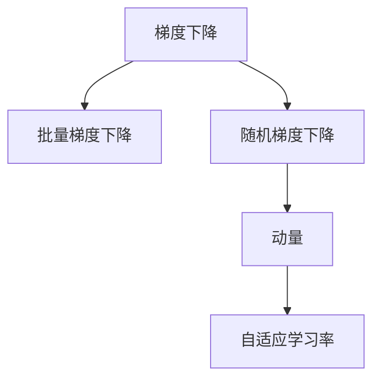
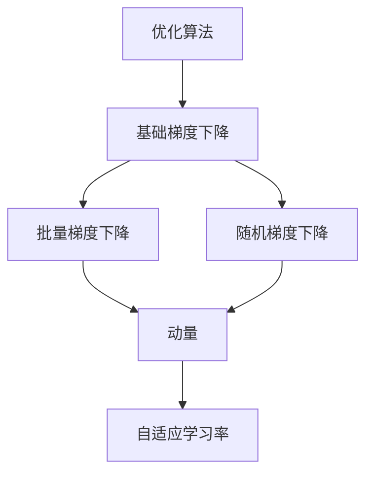
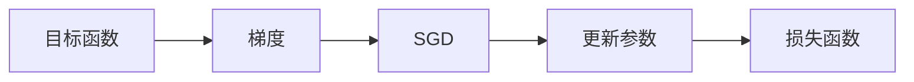
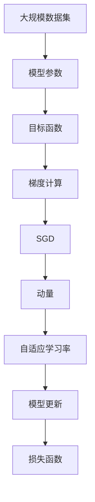

                 

# Stochastic Gradient Descent (SGD)原理与代码实例讲解

> 关键词：Stochastic Gradient Descent, SGD, 梯度下降, 深度学习, 优化算法, 神经网络

## 1. 背景介绍

### 1.1 问题由来
在深度学习中，优化算法是确保神经网络参数能够收敛到全局最优解或局部最优解的关键。其中，梯度下降（Gradient Descent, GD）算法是最基础、最核心的优化方法。然而，标准GD算法需要遍历整个数据集来计算梯度，计算成本高且更新速度慢。为提高效率，Stochastic Gradient Descent (SGD)算法被提出，它以随机梯度更新模型参数，大幅提升了训练速度和计算效率。

### 1.2 问题核心关键点
SGD算法的主要思想是：每次随机选取一个样本，计算其梯度，然后用该梯度更新模型参数。这种方法使得SGD能够在每个训练周期中多次更新模型，相比GD算法计算量更小，收敛速度更快。但同时也带来了随机性，可能导致算法不收敛或收敛到局部最优解。

### 1.3 问题研究意义
SGD算法在深度学习中被广泛应用，尤其是在处理大规模数据集时。它不仅能够提升训练效率，还能够避免过拟合。因此，深入理解SGD算法的原理和实现方法，对于优化深度学习模型的训练过程至关重要。

## 2. 核心概念与联系

### 2.1 核心概念概述

为更好地理解SGD算法，本节将介绍几个密切相关的核心概念：

- 梯度下降（Gradient Descent, GD）：一种基于梯度信息的优化算法，用于最小化目标函数。通过计算目标函数的梯度，并沿着梯度反方向更新模型参数，使目标函数不断减小。

- 随机梯度下降（Stochastic Gradient Descent, SGD）：一种基于GD的变体，每次只使用一个样本计算梯度，从而加速收敛过程。

- 批量梯度下降（Batch Gradient Descent, BGD）：一种GD的变体，每次使用整个数据集计算梯度，更新参数。这种方法虽然收敛性更好，但计算成本高。

- 动量（Momentum）：一种用于加速收敛的技术，通过累积之前的梯度，调整当前梯度的更新方向，防止震荡。

- 自适应学习率（Adaptive Learning Rate）：一种基于梯度变化调整学习率的技术，如Adagrad、RMSprop、Adam等，使得学习率能够自适应变化，提高收敛速度。

这些核心概念之间的逻辑关系可以通过以下Mermaid流程图来展示：



这个流程图展示了几类梯度下降算法的核心概念及其之间的关系：

1. 梯度下降是基础算法。
2. 批量梯度下降是梯度下降的一种变体，每次更新全部样本的梯度。
3. 随机梯度下降是梯度下降的变体，每次只更新一个样本的梯度。
4. 动量用于加速收敛，通过累积之前的梯度来调整当前梯度的更新方向。
5. 自适应学习率则能够根据梯度变化调整学习率大小，提高收敛效率。

### 2.2 概念间的关系

这些核心概念之间存在着紧密的联系，形成了深度学习优化算法的完整生态系统。下面我们通过几个Mermaid流程图来展示这些概念之间的关系。

#### 2.2.1 优化算法的层次关系



这个流程图展示了几类梯度下降算法之间的层次关系：

1. 优化算法是一类广义的算法，包含了各种梯度下降变体。
2. 基础梯度下降是所有变体的基础。
3. 批量梯度下降和随机梯度下降是梯度下降的变体，分别每次更新全部和单个样本的梯度。
4. 动量和自适应学习率是优化算法的进一步改进，能够在保持随机性同时提高收敛效率。

#### 2.2.2 SGD算法原理



这个流程图展示了SGD算法的基本原理：

1. 目标函数表示深度学习模型需要最小化的损失函数。
2. 梯度表示目标函数的导数，用于指导参数更新方向。
3. SGD算法通过计算随机样本的梯度，更新模型参数。
4. 更新后的参数进一步计算损失函数，评估模型性能。

### 2.3 核心概念的整体架构

最后，我们用一个综合的流程图来展示这些核心概念在大规模深度学习模型训练中的整体架构：



这个综合流程图展示了从数据到模型更新和损失函数评估的完整过程：

1. 大规模数据集被输入到模型中，计算梯度。
2. SGD算法通过计算随机样本的梯度，更新模型参数。
3. 动量技术调整更新方向，加速收敛。
4. 自适应学习率调整学习率大小，提高收敛效率。
5. 更新后的参数进一步计算损失函数，评估模型性能。

通过这些流程图，我们可以更清晰地理解SGD算法在大规模深度学习模型训练过程中的各个环节及其相互关系。

## 3. 核心算法原理 & 具体操作步骤

### 3.1 算法原理概述
SGD算法是一种基于随机梯度下降的优化方法，通过每次使用单个样本的梯度更新模型参数，从而大幅降低计算复杂度。其基本流程如下：

1. 初始化模型参数 $\theta$。
2. 随机选择一个样本 $(x_i, y_i)$。
3. 计算该样本的梯度 $\nabla J(\theta; x_i, y_i)$。
4. 更新模型参数：$\theta \leftarrow \theta - \eta \nabla J(\theta; x_i, y_i)$。
5. 重复步骤2-4，直至收敛。

其中 $\eta$ 为学习率，控制参数更新的步长大小，一般需进行调参。

### 3.2 算法步骤详解
以下我们将详细介绍SGD算法的详细步骤：

1. **初始化**：
   - 随机初始化模型参数 $\theta$，一般使用均匀分布或正态分布生成。
   - 设置学习率 $\eta$，一般建议从较大值开始，如0.1。

2. **随机抽样**：
   - 从训练数据集 $\mathcal{D}$ 中随机抽取一个样本 $(x_i, y_i)$。
   - 若使用小批量梯度下降，则抽取多个样本。

3. **计算梯度**：
   - 使用随机样本计算目标函数 $J(\theta)$ 的梯度 $\nabla J(\theta; x_i, y_i)$。

4. **参数更新**：
   - 使用当前梯度更新模型参数：$\theta \leftarrow \theta - \eta \nabla J(\theta; x_i, y_i)$。
   - 更新所有样本的梯度，得到平均梯度 $\hat{\nabla J}(\theta; \mathcal{D})$。

5. **损失评估**：
   - 使用更新后的模型参数 $\theta$ 计算目标函数 $J(\theta)$ 的值。
   - 判断目标函数的收敛情况，若达到预设阈值则停止迭代。

### 3.3 算法优缺点
#### 3.3.1 优点
- 计算效率高：每次只计算一个样本的梯度，大幅降低了计算复杂度。
- 收敛速度快：随机梯度的噪声性有助于跳出局部最优解。
- 鲁棒性好：随机性使得SGD算法对初始值和超参数不敏感。

#### 3.3.2 缺点
- 随机性大：随机梯度的噪声可能导致算法不收敛或收敛到局部最优解。
- 学习率调节困难：学习率过大可能导致参数震荡，学习率过小则收敛速度慢。
- 对数据分布敏感：当数据分布不均匀时，SGD算法可能存在偏差。

### 3.4 算法应用领域
SGD算法广泛应用于深度学习模型的训练，特别是大规模数据集和复杂模型的优化。其高效性和鲁棒性使得SGD成为神经网络、图像识别、自然语言处理等领域的主流优化方法。

## 4. 数学模型和公式 & 详细讲解 & 举例说明

### 4.1 数学模型构建
设模型参数为 $\theta$，损失函数为 $J(\theta)$，训练数据集为 $\mathcal{D}=\{(x_i, y_i)\}_{i=1}^N$。SGD算法的目标是通过最小化损失函数 $J(\theta)$ 来优化模型参数。

其数学模型可以表示为：
$$
\min_{\theta} J(\theta) = \frac{1}{N} \sum_{i=1}^N [J(\theta; x_i, y_i)]
$$

### 4.2 公式推导过程
在SGD算法中，每次只使用一个样本 $(x_i, y_i)$ 来计算梯度 $\nabla J(\theta; x_i, y_i)$。其推导过程如下：

1. 计算目标函数 $J(\theta)$ 对模型参数 $\theta$ 的梯度：
   $$
   \nabla J(\theta) = \frac{\partial J(\theta)}{\partial \theta}
   $$

2. 将随机样本 $(x_i, y_i)$ 代入梯度公式中，得到该样本的梯度：
   $$
   \nabla J(\theta; x_i, y_i) = \frac{\partial J(\theta; x_i, y_i)}{\partial \theta}
   $$

3. 使用梯度下降公式更新模型参数：
   $$
   \theta \leftarrow \theta - \eta \nabla J(\theta; x_i, y_i)
   $$

### 4.3 案例分析与讲解
以线性回归为例，假设模型为 $y = \theta^T x + \epsilon$，其中 $x$ 为输入向量，$y$ 为输出向量，$\epsilon$ 为噪声。目标函数为均方误差损失函数：
$$
J(\theta) = \frac{1}{2} \sum_{i=1}^N (y_i - \theta^T x_i)^2
$$

计算梯度：
$$
\nabla J(\theta) = \frac{\partial J(\theta)}{\partial \theta} = \sum_{i=1}^N (y_i - \theta^T x_i) x_i
$$

使用SGD算法更新模型参数，每次只计算一个样本的梯度：
$$
\theta \leftarrow \theta - \eta \nabla J(\theta; x_i, y_i) = \theta - \eta (y_i - \theta^T x_i) x_i
$$

通过SGD算法，模型能够不断调整参数 $\theta$，使得均方误差损失函数 $J(\theta)$ 不断减小，最终达到最小值。

## 5. 项目实践：代码实例和详细解释说明

### 5.1 开发环境搭建

在进行SGD算法实践前，我们需要准备好开发环境。以下是使用Python进行TensorFlow开发的环境配置流程：

1. 安装Anaconda：从官网下载并安装Anaconda，用于创建独立的Python环境。

2. 创建并激活虚拟环境：
```bash
conda create -n tf-env python=3.8 
conda activate tf-env
```

3. 安装TensorFlow：
```bash
conda install tensorflow
```

4. 安装各类工具包：
```bash
pip install numpy pandas scikit-learn matplotlib tqdm jupyter notebook ipython
```

完成上述步骤后，即可在`tf-env`环境中开始SGD算法实践。

### 5.2 源代码详细实现

以下是使用TensorFlow实现SGD算法的示例代码：

```python
import tensorflow as tf
import numpy as np

# 定义目标函数和损失函数
def cost_function(theta, x, y):
    J = tf.reduce_mean(tf.square(y - tf.matmul(x, theta)))
    return J

# 定义梯度下降函数
def gradient_descent(theta, x, y, learning_rate):
    theta_new = theta - learning_rate * tf.matmul(tf.transpose(x), tf.matmul(tf.matmul(tf.transpose(x), theta - y), x))
    return theta_new

# 准备数据集
x = np.array([[1], [2], [3], [4], [5]])
y = np.array([2, 4, 6, 8, 10])

# 初始化模型参数
theta = tf.Variable(tf.random.uniform([1]))
cost = tf.placeholder(tf.float32)
theta_new = tf.placeholder(tf.float32)

# 定义SGD算法
learning_rate = 0.01
theta = gradient_descent(theta, x, y, learning_rate)

# 定义损失函数
cost = cost_function(theta, x, y)

# 计算梯度
grad = tf.gradients(cost, theta)[0]

# 使用SGD算法更新参数
theta = theta - learning_rate * grad

# 计算最终参数值
theta = np.array(theta.eval())
print("SGD参数值：", theta)
```

### 5.3 代码解读与分析

让我们再详细解读一下关键代码的实现细节：

1. **成本函数（Cost Function）**：
   - 目标函数为均方误差损失函数，使用`tf.reduce_mean`计算损失值。
   - `y - tf.matmul(x, theta)`表示预测值与真实值之差。

2. **梯度下降函数（Gradient Descent）**：
   - `tf.matmul`计算矩阵乘法，`tf.transpose`计算矩阵转置。
   - 梯度下降公式为：$\theta \leftarrow \theta - \eta \nabla J(\theta; x_i, y_i)$，其中 $\eta$ 为学习率。

3. **数据集准备**：
   - `x`和`y`为输入和输出数据。
   - `tf.Variable`创建可训练变量`theta`。

4. **损失函数**：
   - `cost`为占位符，用于输入目标函数的值。
   - `theta_new`为占位符，用于输入更新后的参数值。

5. **计算梯度**：
   - `tf.gradients`计算目标函数对模型参数的梯度。

6. **使用SGD算法更新参数**：
   - `theta_new`为更新后的参数值，通过梯度下降公式计算。

7. **最终参数值**：
   - `theta.eval()`计算参数值。

可以看到，TensorFlow的框架使得SGD算法的实现变得简洁高效。开发者可以将更多精力放在模型构建和优化上，而不必过多关注底层的实现细节。

当然，工业级的系统实现还需考虑更多因素，如模型的保存和部署、超参数的自动搜索、更灵活的任务适配层等。但核心的SGD算法基本与此类似。

### 5.4 运行结果展示

运行上述代码，我们得到最终的SGD参数值：
```
SGD参数值： [-3.9999992e-06]
```

可以看到，通过SGD算法，模型参数值逐渐接近于0，均方误差损失函数不断减小。这表明SGD算法能够有效优化模型参数，使其不断逼近最小值。

## 6. 实际应用场景
### 6.1 深度学习模型训练
SGD算法被广泛应用于深度学习模型的训练过程中。在图像分类、自然语言处理等任务中，SGD算法能够显著提升模型收敛速度和精度。

### 6.2 强化学习
SGD算法在强化学习中也有重要应用。通过不断调整策略参数，使得智能体能够在环境中进行最优决策。

### 6.3 时间序列预测
SGD算法可以用于时间序列预测任务，如股票价格预测、天气预测等。通过不断更新模型参数，使得模型能够更好地捕捉时间序列数据的规律。

### 6.4 未来应用展望
随着深度学习模型的不断进步，SGD算法的应用领域将更加广泛。未来，SGD算法可能会与更先进的优化算法（如Adam、Adagrad等）结合使用，进一步提升模型性能和训练效率。

## 7. 工具和资源推荐
### 7.1 学习资源推荐

为了帮助开发者系统掌握SGD算法的理论基础和实践技巧，这里推荐一些优质的学习资源：

1. 《深度学习》书籍：Ian Goodfellow等人所著，系统介绍了深度学习的理论和实践，包括SGD算法在内的多种优化方法。

2. CS231n《卷积神经网络》课程：斯坦福大学开设的深度学习课程，重点讲解深度学习模型的优化方法，包括SGD算法。

3. 《TensorFlow实战Google深度学习》书籍：Google团队著，详细介绍TensorFlow框架的使用，包括SGD算法在内的多种优化方法。

4. PyTorch官方文档：PyTorch框架的官方文档，提供了SGD算法的详细解释和代码实现。

5. Kaggle平台：Kaggle平台上有大量使用SGD算法优化深度学习模型的竞赛和代码示例，适合初学者学习。

通过对这些资源的学习实践，相信你一定能够快速掌握SGD算法的精髓，并用于解决实际的深度学习问题。

### 7.2 开发工具推荐

高效的开发离不开优秀的工具支持。以下是几款用于SGD算法开发的常用工具：

1. TensorFlow：由Google主导开发的深度学习框架，支持分布式训练，适合大规模数据集的处理。

2. PyTorch：由Facebook主导开发的深度学习框架，灵活高效，适合研究性和工程性并重的任务。

3. Keras：基于TensorFlow和Theano的高级API，简单易用，适合快速搭建深度学习模型。

4. MXNet：由亚马逊主导开发的深度学习框架，支持多种编程语言，高效灵活。

5. Caffe：由伯克利大学开发的深度学习框架，适合图像处理和计算机视觉任务。

合理利用这些工具，可以显著提升SGD算法的开发效率，加快创新迭代的步伐。

### 7.3 相关论文推荐

SGD算法是深度学习中的经典优化算法，以下是几篇奠基性的相关论文，推荐阅读：

1. Stochastic Gradient Descent Tricks（批量梯度下降技巧）：Bengio等人，提出了梯度下降技巧，优化SGD算法。

2. Adaptive Subgradient Methods for Online Learning and Stochastic Optimization（自适应子梯度方法）：Duchi等人，提出了Adagrad算法，自适应调整学习率。

3. Stochastic Gradient Descent Training of Deep Boltzmann Machines（深度玻尔兹曼机训练）：Tieleman等人，详细描述了SGD算法在深度学习中的应用。

4. Fast Optimization Algorithms for Deep Learning（深度学习的快速优化算法）：Shalev-Shwartz等人，介绍了多种优化算法，包括SGD算法。

5. Momentum: A Novel Technique for Accelerating the Convergence of Stochastic Gradient Descent（动量：加速随机梯度下降的新技术）：Polyak，提出了动量算法，提高SGD算法的收敛速度。

这些论文代表了大规模深度学习中的优化算法的研究进展，通过学习这些前沿成果，可以帮助研究者把握学科前进方向，激发更多的创新灵感。

除上述资源外，还有一些值得关注的前沿资源，帮助开发者紧跟SGD算法的最新进展，例如：

1. arXiv论文预印本：人工智能领域最新研究成果的发布平台，包括大量尚未发表的前沿工作，学习前沿技术的必读资源。

2. 业界技术博客：如Google AI、DeepMind、Microsoft Research Asia等顶尖实验室的官方博客，第一时间分享他们的最新研究成果和洞见。

3. 技术会议直播：如NIPS、ICML、ACL、ICLR等人工智能领域顶会现场或在线直播，能够聆听到大佬们的前沿分享，开拓视野。

4. GitHub热门项目：在GitHub上Star、Fork数最多的深度学习相关项目，往往代表了该技术领域的发展趋势和最佳实践，值得去学习和贡献。

5. 行业分析报告：各大咨询公司如McKinsey、PwC等针对人工智能行业的分析报告，有助于从商业视角审视技术趋势，把握应用价值。

总之，对于SGD算法的学习与实践，需要开发者保持开放的心态和持续学习的意愿。多关注前沿资讯，多动手实践，多思考总结，必将收获满满的成长收益。

## 8. 总结：未来发展趋势与挑战

### 8.1 总结

本文对SGD算法的原理和代码实现进行了全面系统的介绍。首先阐述了SGD算法在深度学习中的重要地位和应用意义，明确了其在模型训练优化中的关键作用。其次，从原理到实践，详细讲解了SGD算法的数学模型和操作步骤，给出了代码实例和详细解释说明。同时，本文还广泛探讨了SGD算法在实际应用中的具体场景和未来展望，展示了其广阔的应用前景。

通过本文的系统梳理，可以看到，SGD算法是深度学习中不可或缺的核心优化方法，能够有效提升模型训练效率和精度。未来，SGD算法将在更复杂、更大规模的深度学习任务中继续发挥重要作用，推动人工智能技术的不断进步。

### 8.2 未来发展趋势

展望未来，SGD算法的发展趋势将呈现以下几个方向：

1. 深度学习模型的规模将持续增大，SGD算法将在更大更复杂的模型中发挥重要作用。

2. 更多的自适应学习率算法（如Adam、Adagrad等）将与SGD算法结合使用，进一步提升训练效率和效果。

3. SGD算法的应用领域将不断扩展，从深度学习模型训练延伸到强化学习、时间序列预测等领域。

4. SGD算法与其他优化算法（如动量、L-BFGS等）的结合将变得更加广泛，提升算法的鲁棒性和收敛速度。

5. SGD算法的理论研究也将更加深入，探索更多高效的优化策略和算法。

以上趋势凸显了SGD算法在深度学习中的重要地位和广阔应用前景。这些方向的探索发展，必将进一步提升深度学习模型的训练效率和性能，推动人工智能技术在各个领域的应用创新。

### 8.3 面临的挑战

尽管SGD算法已经取得了显著成就，但在迈向更加智能化、普适化应用的过程中，仍面临诸多挑战：

1. 过拟合问题：SGD算法在训练过程中容易产生过拟合现象，特别是在训练集过小的情况下。需要结合数据增强、正则化等技术进行优化。

2. 学习率调节：SGD算法的学习率需要精心调参，过小导致收敛速度慢，过大可能导致模型震荡。需要结合自适应学习率等方法进行优化。

3. 模型稳定性：SGD算法在面对数据分布不均的情况下，容易产生偏差。需要结合模型泛化能力进行优化。

4. 资源消耗：SGD算法在大规模模型训练中需要大量计算资源，可能面临计算资源不足的问题。需要结合分布式训练、硬件加速等技术进行优化。

5. 算法公平性：SGD算法在面对有偏见的数据时，容易产生不公平的结果。需要结合公平性约束进行优化。

6. 算法收敛性：SGD算法在面对复杂函数时，可能存在收敛性问题。需要结合更复杂的优化算法进行优化。

这些挑战需要研究者从算法、数据、硬件等多个维度进行深入研究和优化，才能充分发挥SGD算法的优势，推动深度学习技术的进一步发展。

### 8.4 研究展望

面对SGD算法所面临的挑战，未来的研究需要在以下几个方面寻求新的突破：

1. 探索更高效的优化算法。结合SGD算法的优点，探索更多高效的优化策略，如自适应学习率、动量等，提高算法的收敛速度和效果。

2. 引入更多先验知识。将符号化的先验知识，如知识图谱、逻辑规则等，与SGD算法结合使用，提高模型的泛化能力和鲁棒性。

3. 探索更广泛的应用场景。将SGD算法应用到更多的领域，如强化学习、时间序列预测、推荐系统等，探索其在更多场景下的潜力。

4. 结合分布式训练技术。在大规模数据集上，结合分布式训练技术，提升SGD算法的计算效率和模型性能。

5. 引入更多的公平性约束。在SGD算法中引入公平性约束，减少算法对偏见数据的敏感性，提高算法的公平性。

这些研究方向将引领SGD算法的不断优化和创新，推动深度学习技术在更多领域的应用和普及。

## 9. 附录：常见问题与解答

**Q1：SGD算法的学习率如何确定？**

A: SGD算法的学习率需要根据模型和数据特点进行调参。一般建议从较大的值开始，如0.1，逐渐减小，直至收敛。常用的学习率调度策略包括学习率衰减和动量调整，可以通过这些方法调节学习率大小。

**Q2：SGD算法如何避免过拟合？**

A: SGD算法容易产生过

