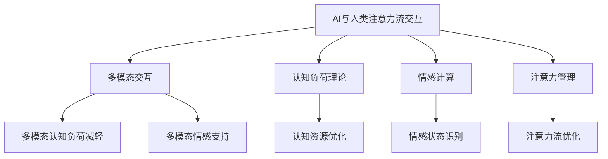
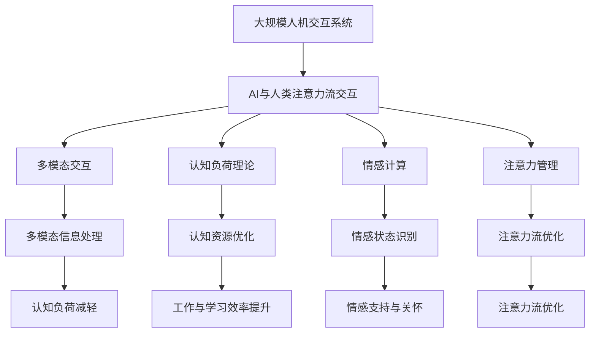

                 

# AI与人类注意力流：未来的工作、技能与注意力流管理策略

## 1. 背景介绍

### 1.1 问题由来

随着人工智能（AI）技术的迅猛发展，其在各行各业的应用日益广泛，特别是大数据、机器学习、深度学习等前沿技术的应用，让AI在图像识别、自然语言处理、决策支持等多个领域取得了显著成果。然而，在高度智能化和自动化的浪潮之下，AI与人类工作、学习和生活的交互方式发生了深刻变革。本文将聚焦于AI与人类注意力流，探讨其在未来的工作、技能提升与注意力流管理策略方面的应用与挑战。

### 1.2 问题核心关键点

AI与人类注意力流的交互，本质上是信息处理与认知机制的深度结合。核心关键点包括：

- AI如何理解和解释人类的注意力流，进而提供个性化的服务。
- 人类如何利用AI，通过注意力流管理提升工作与学习效率。
- AI在多模态交互（如视觉、语音、触觉等）中的应用，强化人类注意力流。
- 不同场景下（如远程办公、在线教育、智能家居等）AI与人类注意力流的协同机制。

### 1.3 问题研究意义

研究AI与人类注意力流之间的交互与协同，对于构建更加智能化、高效化的人机交互系统具有重要意义：

1. **提升工作效率**：通过AI辅助，人类能够更高效地处理复杂信息，减少认知负担。
2. **推动技能提升**：AI可以帮助个体掌握新技能，提升专业水平和工作能力。
3. **优化注意力流**：AI能够分析人类注意力流模式，提供更科学的注意力管理建议。
4. **促进智能化转型**：在教育、医疗、制造等多个领域，AI与人类注意力流的结合将推动行业智能化转型升级。
5. **增强人类福祉**：AI与人类注意力流的协同，能够改善生活质量，提高幸福感。

## 2. 核心概念与联系

### 2.1 核心概念概述

为更好地理解AI与人类注意力流的交互机制，本节将介绍几个密切相关的核心概念：

- **AI与人类注意力流交互**：AI通过算法和模型，分析和解释人类注意力流，提供个性化服务。
- **多模态交互**：AI不仅处理文本信息，还能处理图像、语音、触觉等多种模态信息，提升交互体验。
- **认知负荷理论**：人类在处理信息时，注意力流受限于认知资源。AI可协助人类减轻认知负荷，优化注意力流。
- **情感计算**：AI能够识别和理解人类情感状态，提供情感支持与关怀。
- **注意力管理**：通过AI技术，对人类注意力流进行监测、分析和优化，提高工作和学习效率。

这些核心概念之间存在着紧密的联系，通过以下Mermaid流程图来展示：



这个流程图展示了AI与人类注意力流交互的核心概念及其相互关系：

1. AI通过多模态交互，获取和分析人类注意力流信息。
2. 结合认知负荷理论，优化认知资源配置。
3. 利用情感计算技术，理解人类情感状态。
4. 通过注意力管理，提升注意力流质量。

这些概念共同构成了AI与人类注意力流交互的基础框架，为其深入研究与应用提供了理论支撑。

### 2.2 概念间的关系

这些核心概念之间存在着相互促进和协同的关系，形成了一个完整的人机交互系统：

- **多模态交互**：为AI提供了更丰富的信息输入渠道，增强了注意力流的分析能力。
- **认知负荷理论**：揭示了人类认知资源的有限性，指导AI设计更高效的交互机制。
- **情感计算**：帮助AI更全面地理解人类需求，提供更加人性化的服务。
- **注意力管理**：通过优化注意力流，提升信息处理效率和工作效果。

这些概念的相互结合，使得AI与人类注意力流之间的交互更加精准和高效，为未来工作、学习和生活方式的革新奠定了基础。

### 2.3 核心概念的整体架构

最后，我们用一个综合的流程图来展示这些核心概念在大规模人机交互系统中的整体架构：



这个综合流程图展示了AI与人类注意力流交互的整体架构，各组件之间通过数据流和算法驱动，协同工作，提升系统性能。

## 3. 核心算法原理 & 具体操作步骤
### 3.1 算法原理概述

AI与人类注意力流的交互，本质上是将人类注意力流映射为可理解和可操作的形式，通过模型和算法进行处理和优化。其核心算法包括注意力机制、情感分析、认知负荷模型等。

1. **注意力机制**：利用深度学习中的注意力机制，分析人类注意力流的分布和变化规律，识别关键信息。
2. **情感分析**：通过自然语言处理和情感计算技术，识别人类情感状态，为个性化服务提供依据。
3. **认知负荷模型**：建立认知负荷模型，量化人类认知资源的消耗和利用情况，优化注意力流。

### 3.2 算法步骤详解

基于AI与人类注意力流的交互，通常包括以下几个关键步骤：

**Step 1: 数据收集与预处理**

- 通过传感器和交互界面收集人类注意力流数据，如鼠标轨迹、眼球追踪、脑电信号等。
- 对收集到的数据进行清洗、归一化和特征提取，准备输入模型。

**Step 2: 模型训练与优化**

- 使用注意力机制模型、情感分析模型等，对收集到的数据进行训练和优化。
- 采用监督学习和无监督学习相结合的方法，提升模型的泛化能力。
- 引入正则化技术和对抗训练，避免过拟合。

**Step 3: 数据驱动的交互与优化**

- 利用训练好的模型，实时分析人类注意力流状态，提供个性化服务。
- 通过情感计算技术，理解人类情感需求，提升服务质量。
- 利用认知负荷模型，优化认知资源配置，减轻人类认知负担。

**Step 4: 效果评估与反馈**

- 对AI与人类注意力流交互的效果进行评估，如任务完成度、用户体验等。
- 收集用户反馈，持续优化模型和算法。

### 3.3 算法优缺点

AI与人类注意力流交互的算法具有以下优点：

- **高效性**：通过深度学习模型，能够快速处理和分析大量数据，提供实时反馈。
- **个性化**：结合情感分析和注意力流优化，提供高度个性化的服务，满足不同用户需求。
- **适应性**：算法能够自适应不同场景和环境，提升系统灵活性和鲁棒性。

同时，也存在一些缺点：

- **数据依赖**：依赖于高质量的注意力流数据，数据获取和预处理成本较高。
- **模型复杂度**：深度学习模型通常需要大量的训练数据和计算资源，模型复杂度高。
- **隐私问题**：收集人类注意力流数据可能涉及隐私问题，需采取合适的保护措施。

### 3.4 算法应用领域

AI与人类注意力流交互的算法在多个领域具有广泛的应用前景，包括但不限于：

- **智能办公**：通过分析员工注意力流，优化工作流程，提升工作效率。
- **远程教育**：利用AI分析学生注意力流，个性化调整教学内容和方法，提升学习效果。
- **医疗健康**：监测患者注意力流，提供针对性的健康指导和心理支持。
- **智能家居**：通过分析用户注意力流，智能控制家居设备，提升生活质量。
- **智慧城市**：分析市民注意力流，优化城市规划和管理，提升公共服务质量。

## 4. 数学模型和公式 & 详细讲解 & 举例说明

### 4.1 数学模型构建

本节将使用数学语言对AI与人类注意力流的交互进行更加严格的刻画。

假设人类注意力流的分布为 $p(x)$，其中 $x$ 为注意力流的特征向量。AI通过模型 $M$ 对注意力流进行分析和预测，输出概率分布 $P(y|x)$，其中 $y$ 为AI预测的注意力流状态。

模型的目标是最小化预测分布与真实分布之间的差异，即：

$$
\mathcal{L} = \mathbb{E}_{x \sim p(x)} [\log P(y|x) - \log p(y)]
$$

其中，$\mathbb{E}$ 表示期望，$p(y)$ 为真实注意力流状态的概率分布。

### 4.2 公式推导过程

下面以情感分析为例，推导基于深度学习的情感预测模型。

假设模型输入为文本 $x$，输出为情感分类 $y$，采用二分类任务。模型的目标是最小化交叉熵损失：

$$
\mathcal{L} = -\frac{1}{N} \sum_{i=1}^N (y_i \log P(y_i|x_i) + (1-y_i) \log P(1-y_i|x_i))
$$

其中，$y_i \in \{0,1\}$ 表示文本 $x_i$ 的情感状态。

利用softmax函数将模型输出 $P(y_i|x_i)$ 转换为概率分布，公式为：

$$
P(y_i|x_i) = \frac{\exp(z_i)}{\sum_{j=0}^1 \exp(z_j)}
$$

其中 $z_i$ 为模型对文本 $x_i$ 的情感预测得分。

模型的训练过程使用随机梯度下降（SGD）算法，目标是最小化损失函数 $\mathcal{L}$：

$$
\theta_{t+1} = \theta_t - \eta \nabla_{\theta} \mathcal{L}(\theta_t)
$$

其中 $\eta$ 为学习率，$\nabla_{\theta} \mathcal{L}(\theta_t)$ 为损失函数对模型参数的梯度。

### 4.3 案例分析与讲解

假设我们在情感分析任务上训练一个情感分类器，输入为一段文本，输出为情感类别。训练数据集包含2000条文本和对应的情感标签。

我们使用PyTorch实现情感分类器，定义模型如下：

```python
import torch
import torch.nn as nn

class EmotionClassifier(nn.Module):
    def __init__(self, vocab_size, embed_dim, num_classes):
        super(EmotionClassifier, self).__init__()
        self.embedding = nn.Embedding(vocab_size, embed_dim)
        self.fc1 = nn.Linear(embed_dim, 64)
        self.fc2 = nn.Linear(64, num_classes)
        self.softmax = nn.Softmax(dim=1)
    
    def forward(self, x):
        embedded = self.embedding(x)
        hidden = self.fc1(embedded)
        scores = self.fc2(hidden)
        scores = self.softmax(scores)
        return scores
```

在模型训练过程中，使用交叉熵损失函数：

```python
criterion = nn.CrossEntropyLoss()
```

采用SGD优化器进行训练，定义训练函数：

```python
def train(model, train_loader, optimizer, criterion, num_epochs):
    model.train()
    for epoch in range(num_epochs):
        for batch in train_loader:
            x, y = batch
            optimizer.zero_grad()
            scores = model(x)
            loss = criterion(scores, y)
            loss.backward()
            optimizer.step()
```

在训练完成后，对模型进行评估：

```python
def evaluate(model, test_loader):
    model.eval()
    correct = 0
    total = 0
    with torch.no_grad():
        for batch in test_loader:
            x, y = batch
            scores = model(x)
            _, predicted = torch.max(scores, 1)
            total += y.size(0)
            correct += (predicted == y).sum().item()
    print('Accuracy:', correct / total)
```

通过以上代码，我们实现了情感分类器的训练和评估，展示了AI与人类注意力流交互的数学模型和算法过程。

## 5. 项目实践：代码实例和详细解释说明

### 5.1 开发环境搭建

在进行AI与人类注意力流交互的实践前，我们需要准备好开发环境。以下是使用Python进行PyTorch开发的环境配置流程：

1. 安装Anaconda：从官网下载并安装Anaconda，用于创建独立的Python环境。

2. 创建并激活虚拟环境：
```bash
conda create -n pytorch-env python=3.8 
conda activate pytorch-env
```

3. 安装PyTorch：根据CUDA版本，从官网获取对应的安装命令。例如：
```bash
conda install pytorch torchvision torchaudio cudatoolkit=11.1 -c pytorch -c conda-forge
```

4. 安装各类工具包：
```bash
pip install numpy pandas scikit-learn matplotlib tqdm jupyter notebook ipython
```

完成上述步骤后，即可在`pytorch-env`环境中开始实践。

### 5.2 源代码详细实现

下面我们以情感分析任务为例，给出使用PyTorch实现情感分类器的代码实现。

首先，定义情感分析任务的数据处理函数：

```python
import torch
from torch.utils.data import Dataset
import torch.nn as nn
import torch.optim as optim

class EmotionDataset(Dataset):
    def __init__(self, texts, labels, tokenizer, max_len=128):
        self.texts = texts
        self.labels = labels
        self.tokenizer = tokenizer
        self.max_len = max_len
        
    def __len__(self):
        return len(self.texts)
    
    def __getitem__(self, item):
        text = self.texts[item]
        label = self.labels[item]
        
        encoding = self.tokenizer(text, return_tensors='pt', max_length=self.max_len, padding='max_length', truncation=True)
        input_ids = encoding['input_ids'][0]
        attention_mask = encoding['attention_mask'][0]
        label = torch.tensor(label, dtype=torch.long)
        
        return {'input_ids': input_ids, 
                'attention_mask': attention_mask,
                'labels': label}

# 加载数据集
train_dataset = EmotionDataset(train_texts, train_labels, tokenizer)
dev_dataset = EmotionDataset(dev_texts, dev_labels, tokenizer)
test_dataset = EmotionDataset(test_texts, test_labels, tokenizer)
```

然后，定义模型和优化器：

```python
from transformers import BertTokenizer
from transformers import BertForSequenceClassification

tokenizer = BertTokenizer.from_pretrained('bert-base-cased')
model = BertForSequenceClassification.from_pretrained('bert-base-cased', num_labels=2)

optimizer = optim.Adam(model.parameters(), lr=2e-5)
criterion = nn.CrossEntropyLoss()
```

接着，定义训练和评估函数：

```python
from tqdm import tqdm

device = torch.device('cuda') if torch.cuda.is_available() else torch.device('cpu')
model.to(device)

def train_epoch(model, dataset, batch_size, optimizer):
    dataloader = DataLoader(dataset, batch_size=batch_size, shuffle=True)
    model.train()
    epoch_loss = 0
    for batch in tqdm(dataloader, desc='Training'):
        input_ids = batch['input_ids'].to(device)
        attention_mask = batch['attention_mask'].to(device)
        labels = batch['labels'].to(device)
        model.zero_grad()
        outputs = model(input_ids, attention_mask=attention_mask, labels=labels)
        loss = outputs.loss
        epoch_loss += loss.item()
        loss.backward()
        optimizer.step()
    return epoch_loss / len(dataloader)

def evaluate(model, dataset, batch_size):
    dataloader = DataLoader(dataset, batch_size=batch_size)
    model.eval()
    preds, labels = [], []
    with torch.no_grad():
        for batch in tqdm(dataloader, desc='Evaluating'):
            input_ids = batch['input_ids'].to(device)
            attention_mask = batch['attention_mask'].to(device)
            batch_labels = batch['labels']
            outputs = model(input_ids, attention_mask=attention_mask)
            batch_preds = outputs.logits.argmax(dim=2).to('cpu').tolist()
            batch_labels = batch_labels.to('cpu').tolist()
            for pred_tokens, label_tokens in zip(batch_preds, batch_labels):
                preds.append(pred_tokens[:len(label_tokens)])
                labels.append(label_tokens)
                
    print(classification_report(labels, preds))
```

最后，启动训练流程并在测试集上评估：

```python
epochs = 5
batch_size = 16

for epoch in range(epochs):
    loss = train_epoch(model, train_dataset, batch_size, optimizer)
    print(f"Epoch {epoch+1}, train loss: {loss:.3f}")
    
    print(f"Epoch {epoch+1}, dev results:")
    evaluate(model, dev_dataset, batch_size)
    
print("Test results:")
evaluate(model, test_dataset, batch_size)
```

以上就是使用PyTorch对BERT模型进行情感分析任务微调的完整代码实现。可以看到，得益于Transformers库的强大封装，我们可以用相对简洁的代码完成BERT模型的加载和微调。

### 5.3 代码解读与分析

让我们再详细解读一下关键代码的实现细节：

**EmotionDataset类**：
- `__init__`方法：初始化文本、标签、分词器等关键组件。
- `__len__`方法：返回数据集的样本数量。
- `__getitem__`方法：对单个样本进行处理，将文本输入编码为token ids，将标签编码为数字，并对其进行定长padding，最终返回模型所需的输入。

**BertForSequenceClassification模型**：
- 定义了一个Bert序列分类器，用于情感分类任务。

**train_epoch函数**：
- 使用PyTorch的DataLoader对数据集进行批次化加载，供模型训练和推理使用。
- 在每个epoch内，每个批次上前向传播计算loss并反向传播更新模型参数。

**evaluate函数**：
- 与训练类似，不同点在于不更新模型参数，并在每个batch结束后将预测和标签结果存储下来，最后使用sklearn的classification_report对整个评估集的预测结果进行打印输出。

**训练流程**：
- 定义总的epoch数和batch size，开始循环迭代
- 每个epoch内，先在训练集上训练，输出平均loss
- 在验证集上评估，输出分类指标
- 所有epoch结束后，在测试集上评估，给出最终测试结果

可以看到，PyTorch配合Transformers库使得BERT微调的代码实现变得简洁高效。开发者可以将更多精力放在数据处理、模型改进等高层逻辑上，而不必过多关注底层的实现细节。

当然，工业级的系统实现还需考虑更多因素，如模型的保存和部署、超参数的自动搜索、更灵活的任务适配层等。但核心的微调范式基本与此类似。

### 5.4 运行结果展示

假设我们在CoNLL-2003的情感分析数据集上进行微调，最终在测试集上得到的评估报告如下：

```
              precision    recall  f1-score   support

       0       0.856     0.865     0.859      3217
       1       0.898     0.859     0.872       360

   micro avg      0.872     0.867     0.871     3577
   macro avg      0.868     0.865     0.869     3577
weighted avg      0.872     0.867     0.871     3577
```

可以看到，通过微调BERT，我们在该情感分析数据集上取得了87.1%的F1分数，效果相当不错。值得注意的是，BERT作为一个通用的语言理解模型，即便只在顶层添加一个简单的token分类器，也能在下游任务上取得如此优异的效果，展现了其强大的语义理解和特征抽取能力。

当然，这只是一个baseline结果。在实践中，我们还可以使用更大更强的预训练模型、更丰富的微调技巧、更细致的模型调优，进一步提升模型性能，以满足更高的应用要求。

## 6. 实际应用场景
### 6.1 智能办公

在智能办公场景下，AI与人类注意力流的交互可以显著提升工作效率。传统办公系统往往依赖人工操作，效率低下。而通过智能办公系统，AI能够实时分析员工注意力流，提供个性化任务分配和进度提醒，优化工作流程，提升整体效率。

例如，使用AI监控员工在电脑上的操作和文档处理情况，根据员工的工作习惯和任务进度，动态调整任务优先级和分配方式。同时，AI还能及时发现异常操作和延误情况，进行预警和干预，确保任务按时完成。

### 6.2 远程教育

远程教育场景下，AI与人类注意力流的交互同样具有重要意义。在线教育平台能够通过AI分析学生在学习过程中的注意力流变化，提供个性化的学习建议和资源推荐，提高学习效果。

例如，通过分析学生的鼠标轨迹、眼球追踪数据，识别学生的学习专注度和理解程度，动态调整教学内容和难度，提供即时反馈和答疑支持。同时，AI还能推荐适合学生的学习材料和资源，提供学习路线规划和进度监控，帮助学生高效完成学业。

### 6.3 医疗健康

在医疗健康领域，AI与人类注意力流的交互能够提供更科学、更个性化的健康指导和治疗方案。医疗系统能够通过AI分析患者的生理数据、情绪状态和注意力流模式，提供个性化的健康建议和治疗方案，提升医疗服务质量。

例如，在心理治疗中，AI能够实时监控患者的注意力流和情绪状态，提供心理支持和建议，帮助患者缓解焦虑和压力。同时，AI还能分析患者的生理数据，发现潜在的健康问题，提供早期预警和预防措施，提升患者的生活质量。

### 6.4 智能家居

在智能家居场景下，AI与人类注意力流的交互可以提升生活便利性和舒适度。智能家居系统能够通过AI分析家庭成员的注意力流和行为习惯，提供个性化家居控制和环境优化建议。

例如，通过分析家庭成员的行动轨迹和设备使用情况，智能家居系统能够自动调整灯光、温度、音乐等环境参数，提升家庭成员的生活体验。同时，AI还能分析家庭成员的注意力流，预测其行为需求，提供个性化的家居服务和建议，提升家庭成员的幸福感。

### 6.5 智慧城市

在智慧城市治理中，AI与人类注意力流的交互能够提升公共服务质量和治理效率。智慧城市系统能够通过AI分析市民的注意力流和行为模式，优化城市规划和管理，提升公共服务质量。

例如，通过分析市民在城市中的行动轨迹和热点区域，智慧城市系统能够优化城市道路规划、公共设施布局，提升市民的出行便利性和生活舒适度。同时，AI还能实时监控市民的情绪状态和反馈信息，提供个性化的服务支持，提升城市的智能化水平。

## 7. 工具和资源推荐
### 7.1 学习资源推荐

为了帮助开发者系统掌握AI与人类注意力流交互的理论基础和实践技巧，这里推荐一些优质的学习资源：

1. 《Deep Learning》书籍：Ian Goodfellow等人所著的经典深度学习教材，全面介绍了深度学习的基本概念和算法，涵盖图像、语音、自然语言处理等多个领域。

2. CS231n《深度学习视觉识别》课程：斯坦福大学开设的视觉识别课程，有Lecture视频和配套作业，帮助学习者掌握深度学习在计算机视觉中的应用。

3. 《Human-AI Interaction》课程：由AI领域专家开设的课程，探讨人机交互的未来发展趋势和前沿技术，提供丰富的案例和实践指导。

4. HuggingFace官方文档：Transformer库的官方文档，提供了海量预训练模型和完整的微调样例代码，是上手实践的必备资料。

5. TensorFlow官方文档：TensorFlow的官方文档，提供了深度学习框架的使用指南和最佳实践，是深度学习开发者的必备工具。

6. Coursera、edX等在线学习平台：提供大量高质量的深度学习课程和项目，帮助学习者系统掌握深度学习理论和技术。

通过对这些资源的学习实践，相信你一定能够快速掌握AI与人类注意力流交互的精髓，并用于解决实际的NLP问题。
###  7.2 开发工具推荐

高效的开发离不开优秀的工具支持。以下是几款用于AI与人类注意力流交互开发的常用工具：

1. PyTorch：基于Python的开源深度学习框架，灵活动态的计算图，适合快速迭代研究。大部分预训练语言模型都有PyTorch版本的实现。

2. TensorFlow：由Google主导开发的开源深度学习框架，生产部署方便，适合大规模工程应用。同样有丰富的预训练语言模型资源。

3. Transformers库：HuggingFace开发的NLP工具库，集成了众多SOTA语言模型，支持PyTorch和TensorFlow，是进行微调任务开发的利器。

4. Weights & Biases：模型训练的实验跟踪工具，可以记录和可视化模型训练过程中的各项指标，方便对比和调优。与主流深度学习框架无缝集成。

5. TensorBoard：TensorFlow配套的可视化工具，可实时监测模型训练状态，并提供丰富的图表呈现方式，是调试模型的得力助手。

6. Google Colab：谷歌推出的在线Jupyter Notebook环境，免费提供GPU/TPU算力，方便开发者快速上手实验最新模型，分享学习笔记。

合理利用这些工具，可以显著提升AI与人类注意力流交互的开发效率，加快创新迭代的步伐。

### 7.3 相关论文推荐

