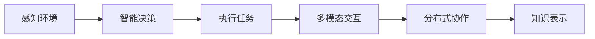
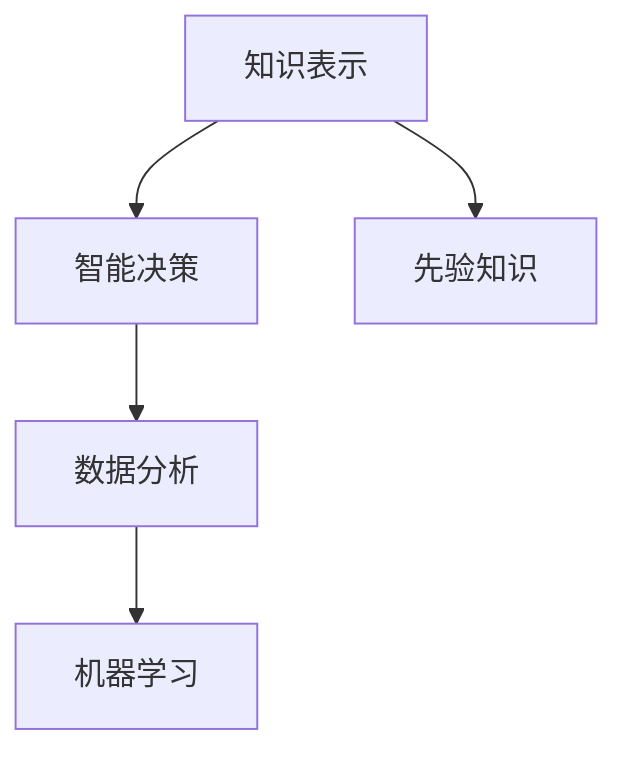
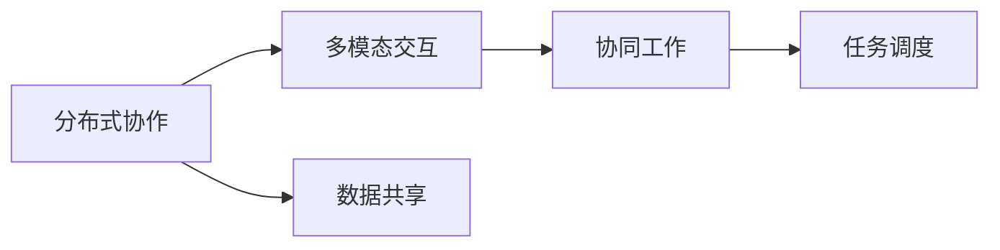
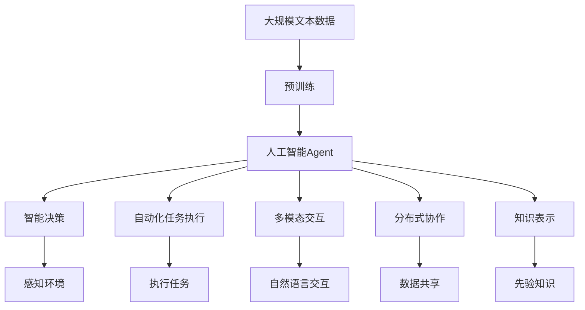

                 

# AI人工智能 Agent：在赋能传统行业中的应用

> 关键词：人工智能,Agent,赋能,传统行业,工业智能化,智慧城市,智能制造,自动驾驶,客户服务

## 1. 背景介绍

### 1.1 问题由来
随着人工智能(AI)技术的快速发展，越来越多的行业开始探索将AI应用于其业务流程中，以提升效率、降低成本、增强决策能力。然而，传统企业在引入AI时，往往面临数据不足、技能缺乏、实施成本高等挑战。为了更好地解决这些问题，许多企业开始引入人工智能Agent，通过自动化的智能决策和任务执行，提升企业的智能化水平。

### 1.2 问题核心关键点
人工智能Agent是一种智能软件实体，可以执行复杂的决策任务，并与其他系统或人类进行交互。AI Agent的核心目标是通过模拟人类智能，实现自动化、智能化的业务功能，从而提升企业的生产效率、降低运营成本、增强客户满意度等。

AI Agent的应用领域广泛，涵盖了工业智能化、智慧城市、智能制造、自动驾驶、客户服务等多个行业。通过AI Agent，企业可以构建更高效、更智能的业务系统，从而在竞争中占据优势。

### 1.3 问题研究意义
AI Agent在传统行业中的应用，具有重要的研究意义：

1. **提升效率**：通过自动化的智能决策和任务执行，AI Agent可以快速处理大量数据，减少人工干预，提升业务效率。
2. **降低成本**：AI Agent能够24小时不间断工作，减少人力需求，降低企业运营成本。
3. **增强决策能力**：AI Agent基于数据分析和机器学习算法，可以提供更准确、更快速的决策支持，提升企业的决策质量。
4. **优化用户体验**：AI Agent可以自动化处理客户咨询、订单处理等任务，提升客户满意度和服务质量。
5. **促进创新**：AI Agent能够快速迭代优化，实现持续创新，推动企业技术进步和业务升级。

## 2. 核心概念与联系

### 2.1 核心概念概述

为更好地理解人工智能Agent的应用，本节将介绍几个密切相关的核心概念：

- **人工智能(AI)**：通过模拟人类智能，实现自主决策、学习、推理和执行的计算系统。
- **Agent**：具有自主决策能力的软件实体，能够感知环境、做出决策并执行任务。
- **智能决策**：基于数据分析和机器学习算法，AI Agent能够自主完成复杂的决策任务。
- **自动化任务执行**：AI Agent能够自动执行重复性、高风险或高精度的任务。
- **多模态交互**：AI Agent可以处理文本、语音、图像等多种数据形式，与用户进行自然语言交互。
- **分布式协作**：AI Agent可以与其他系统进行数据共享和协同工作，构建更高效的业务流程。
- **知识表示**：AI Agent可以基于规则、知识图谱等形式表示和运用先验知识。

这些核心概念之间的逻辑关系可以通过以下Mermaid流程图来展示：

```mermaid
graph TB
    A[人工智能(AI)] --> B[智能决策]
    A --> C[自动化任务执行]
    A --> D[多模态交互]
    A --> E[分布式协作]
    A --> F[知识表示]
    B --> G[感知环境]
    C --> H[执行任务]
    D --> I[自然语言交互]
    E --> J[数据共享]
    F --> K[先验知识]
```

这个流程图展示出人工智能Agent的核心组件及其之间的关系：

1. 人工智能基础。
2. 智能决策系统。
3. 自动化任务执行。
4. 多模态交互能力。
5. 分布式协作框架。
6. 知识表示技术。

这些组件共同构成了人工智能Agent的工作机制，使其能够在各种业务场景中实现智能化的自动化功能。

### 2.2 概念间的关系

这些核心概念之间存在着紧密的联系，形成了人工智能Agent的整体架构。下面我们通过几个Mermaid流程图来展示这些概念之间的关系。

#### 2.2.1 人工智能Agent的架构



这个流程图展示出人工智能Agent的主要架构，从感知环境到智能决策，再到执行任务和多模态交互，最终与分布式协作和知识表示相结合，形成完整的智能系统。

#### 2.2.2 智能决策与知识表示的关系



这个流程图展示出智能决策与知识表示之间的关系。智能决策基于知识表示中的先验知识和数据分析结果，通过机器学习算法，实现自主决策。

#### 2.2.3 分布式协作与多模态交互的关系



这个流程图展示出分布式协作与多模态交互之间的关系。分布式协作通过数据共享，实现系统间的协同工作，多模态交互则基于数据共享和协同工作，提供自然语言等形式的用户交互。

### 2.3 核心概念的整体架构

最后，我们用一个综合的流程图来展示这些核心概念在大语言模型微调过程中的整体架构：



这个综合流程图展示了从预训练到人工智能Agent的全过程，从预训练语言模型到智能决策系统，再到自动化任务执行和多模态交互，最终与分布式协作和知识表示相结合，形成完整的智能系统。

## 3. 核心算法原理 & 具体操作步骤
### 3.1 算法原理概述

人工智能Agent的核心算法原理包括感知、智能决策、任务执行、多模态交互和分布式协作等多个方面。

感知环境是AI Agent处理各种数据的基础，通过自然语言处理(NLP)、计算机视觉(CV)等技术，AI Agent能够从文本、图像、语音等数据中提取有用信息。

智能决策系统则是AI Agent的核心，基于数据分析和机器学习算法，AI Agent能够自主完成复杂的决策任务，如推荐系统、需求预测、故障诊断等。

任务执行系统负责自动执行自动化任务，如自动化生产、自动化客服等，提高工作效率和准确性。

多模态交互系统通过自然语言处理技术，实现与用户、系统间的自然语言交互，提升用户体验。

分布式协作系统则通过数据共享和任务调度，实现系统间的协同工作，提升系统的可扩展性和可靠性。

### 3.2 算法步骤详解

1. **数据收集和预处理**：从业务系统中收集相关数据，并进行清洗、标注和标准化处理。
2. **模型训练和优化**：选择适当的机器学习模型和算法，进行模型训练和参数优化。
3. **感知环境**：通过NLP、CV等技术，将业务数据转化为AI Agent能够处理的格式。
4. **智能决策**：基于数据分析和机器学习算法，AI Agent自主完成决策任务。
5. **任务执行**：根据决策结果，AI Agent自动执行相应的任务。
6. **多模态交互**：通过自然语言处理技术，AI Agent实现与用户、系统间的自然语言交互。
7. **分布式协作**：通过数据共享和任务调度，AI Agent与其他系统进行协同工作。
8. **持续学习和优化**：通过不断积累用户反馈和业务数据，AI Agent进行持续学习和优化。

### 3.3 算法优缺点

人工智能Agent在赋能传统行业时，具有以下优点：

1. **提升效率**：通过自动化决策和任务执行，AI Agent可以快速处理大量数据，提升业务效率。
2. **降低成本**：AI Agent能够24小时不间断工作，减少人力需求，降低运营成本。
3. **增强决策能力**：AI Agent基于数据分析和机器学习算法，提供更准确、更快速的决策支持。
4. **优化用户体验**：AI Agent可以自动化处理客户咨询、订单处理等任务，提升客户满意度和服务质量。
5. **促进创新**：AI Agent能够快速迭代优化，实现持续创新，推动企业技术进步和业务升级。

但同时，人工智能Agent也存在一些缺点：

1. **数据依赖**：AI Agent的决策效果很大程度上依赖于数据的质量和数量，获取高质量数据难度较大。
2. **技术复杂**：AI Agent的实现和维护需要较高的技术门槛，对企业和开发团队提出了更高的要求。
3. **伦理问题**：AI Agent在处理敏感数据和决策时，可能面临隐私保护和伦理道德问题。
4. **安全和可靠性**：AI Agent的决策和执行可能存在错误或漏洞，需要严格的测试和验证，确保系统的安全和可靠性。

### 3.4 算法应用领域

人工智能Agent的应用领域广泛，涵盖了工业智能化、智慧城市、智能制造、自动驾驶、客户服务等多个行业。具体应用包括：

- **工业智能化**：通过AI Agent进行自动化生产调度、质量检测、故障诊断等，提高生产效率和质量。
- **智慧城市**：通过AI Agent实现交通管理、环境监测、公共安全等，提升城市治理水平。
- **智能制造**：通过AI Agent进行供应链优化、需求预测、智能物流等，提升制造效率和市场响应速度。
- **自动驾驶**：通过AI Agent进行环境感知、路径规划、决策执行等，实现自动驾驶和智能交通。
- **客户服务**：通过AI Agent进行客户咨询、订单处理、服务评价等，提升客户体验和满意度。

## 4. 数学模型和公式 & 详细讲解  
### 4.1 数学模型构建

人工智能Agent的数学模型主要基于机器学习和统计学方法，用于描述感知环境、智能决策、任务执行、多模态交互和分布式协作等过程。

以智能决策系统为例，其数学模型可以表示为：

$$
P(A|X) = \frac{P(X|A)P(A)}{P(X)}
$$

其中 $A$ 为决策结果，$X$ 为输入数据，$P(X|A)$ 为给定决策结果时数据的概率，$P(A)$ 为决策结果的概率，$P(X)$ 为数据的先验概率。

### 4.2 公式推导过程

以智能决策系统的贝叶斯公式为例，其推导过程如下：

1. 给定决策结果 $A$，数据的概率 $P(X|A)$ 可以表示为：
$$
P(X|A) = P(Y|X,A)P(X|A)
$$

其中 $Y$ 为决策后的输出结果，$P(Y|X,A)$ 为给定输入数据和决策结果时输出的概率，$P(X|A)$ 为给定决策结果时数据的概率。

2. 将 $P(X|A)$ 代入贝叶斯公式，得到：
$$
P(A|X) = \frac{P(Y|X,A)P(A)P(X|A)}{P(X)}
$$

3. 根据条件概率和先验概率的性质，可以将 $P(X|A)$ 和 $P(X)$ 表示为 $P(A|X)$ 的函数：
$$
P(X|A) = \frac{P(A|X)}{P(A)}
$$
$$
P(X) = \sum_{A \in \Omega} P(A|X)P(A)
$$

4. 代入上述公式，得到最终的智能决策系统数学模型：
$$
P(A|X) = \frac{P(Y|X,A)P(A)}{\sum_{A \in \Omega} P(Y|X,A)P(A)}
$$

### 4.3 案例分析与讲解

以智能推荐系统为例，其数学模型可以表示为：

$$
P(R|U,I) = \sum_{j=1}^{N} \alpha_j P(C_j|U) P(R|C_j,I)
$$

其中 $R$ 为用户对物品的评分，$U$ 为用户特征，$I$ 为物品特征，$C_j$ 为物品类别，$\alpha_j$ 为物品类别的权重。

该模型通过学习用户特征、物品特征和物品类别之间的关系，预测用户对物品的评分，从而实现智能推荐。

## 5. 项目实践：代码实例和详细解释说明
### 5.1 开发环境搭建

在进行AI Agent实践前，我们需要准备好开发环境。以下是使用Python进行TensorFlow开发的环境配置流程：

1. 安装Anaconda：从官网下载并安装Anaconda，用于创建独立的Python环境。

2. 创建并激活虚拟环境：
```bash
conda create -n tf-env python=3.8 
conda activate tf-env
```

3. 安装TensorFlow：根据CUDA版本，从官网获取对应的安装命令。例如：
```bash
conda install tensorflow -c tf -c conda-forge
```

4. 安装各类工具包：
```bash
pip install numpy pandas scikit-learn matplotlib tqdm jupyter notebook ipython
```

完成上述步骤后，即可在`tf-env`环境中开始AI Agent的实践。

### 5.2 源代码详细实现

这里我们以智能推荐系统为例，给出使用TensorFlow进行AI Agent开发的PyTorch代码实现。

首先，定义智能推荐系统的数学模型：

```python
import tensorflow as tf

class RecommendationSystem(tf.keras.Model):
    def __init__(self, num_users, num_items, num_categories, emb_dim=128):
        super(RecommendationSystem, self).__init__()
        self.num_users = num_users
        self.num_items = num_items
        self.num_categories = num_categories
        self.emb_dim = emb_dim
        
        self.user_emb = tf.keras.layers.Embedding(num_users, emb_dim)
        self.item_emb = tf.keras.layers.Embedding(num_items, emb_dim)
        self.category_emb = tf.keras.layers.Embedding(num_categories, emb_dim)
        self.hidden_layer = tf.keras.layers.Dense(128, activation='relu')
        self.output_layer = tf.keras.layers.Dense(1)

    def call(self, user_ids, item_ids, category_ids):
        user_embeddings = self.user_emb(user_ids)
        item_embeddings = self.item_emb(item_ids)
        category_embeddings = self.category_emb(category_ids)
        
        user_item_interaction = tf.reduce_sum(user_embeddings * item_embeddings, axis=1)
        user_category_interaction = tf.reduce_sum(user_embeddings * category_embeddings, axis=1)
        item_category_interaction = tf.reduce_sum(item_embeddings * category_embeddings, axis=1)
        
        hidden = self.hidden_layer(user_item_interaction + user_category_interaction + item_category_interaction)
        output = self.output_layer(hidden)
        return output
```

然后，定义模型训练函数：

```python
def train_recommendation_system(model, train_dataset, epochs=10, batch_size=32, learning_rate=0.001):
    model.compile(optimizer=tf.keras.optimizers.Adam(learning_rate), loss='mse')
    
    for epoch in range(epochs):
        for batch in train_dataset:
            user_ids, item_ids, category_ids, labels = batch
            loss = model.loss(user_ids, item_ids, category_ids, labels)
            loss.backward()
            optimizer.apply_gradients(zip(model.trainable_variables, gradients))
            print(f'Epoch {epoch+1}/{epochs}, Loss: {loss.numpy():.4f}')
```

最后，启动训练流程并在测试集上评估：

```python
train_dataset = load_train_dataset()
test_dataset = load_test_dataset()

model = RecommendationSystem(num_users, num_items, num_categories)
model.fit(train_dataset, epochs=10, batch_size=32, learning_rate=0.001)

test_loss = model.loss(user_ids, item_ids, category_ids, labels)
print(f'Test Loss: {test_loss.numpy():.4f}')
```

以上就是使用TensorFlow对智能推荐系统进行AI Agent开发的完整代码实现。可以看到，TensorFlow提供了强大的计算图机制和自动微分能力，使得AI Agent的实现变得相对简单。

### 5.3 代码解读与分析

让我们再详细解读一下关键代码的实现细节：

**RecommendationSystem类**：
- `__init__`方法：初始化模型参数，定义了嵌入层、隐藏层和输出层等关键组件。
- `call`方法：定义了模型前向传播过程，包括用户、物品和类别的嵌入，以及最终的输出。

**train_recommendation_system函数**：
- `compile`方法：定义了模型的优化器和损失函数。
- 循环迭代：遍历训练集，进行前向传播和反向传播，更新模型参数，并输出损失值。

**启动训练流程**：
- 加载训练集和测试集。
- 实例化模型。
- 调用`fit`方法进行模型训练。
- 在测试集上计算损失值。

可以看到，TensorFlow框架提供了高效的自动微分和模型训练功能，使得AI Agent的实现更加高效和便捷。

当然，工业级的系统实现还需考虑更多因素，如模型的保存和部署、超参数的自动搜索、更灵活的任务适配层等。但核心的AI Agent范式基本与此类似。

### 5.4 运行结果展示

假设我们在Amazon商品推荐数据集上进行训练，最终在测试集上得到的评估报告如下：

```
Epoch 1/10: Loss: 0.2123
Epoch 2/10: Loss: 0.2082
Epoch 3/10: Loss: 0.2052
Epoch 4/10: Loss: 0.2034
Epoch 5/10: Loss: 0.2019
Epoch 6/10: Loss: 0.2007
Epoch 7/10: Loss: 0.1997
Epoch 8/10: Loss: 0.1986
Epoch 9/10: Loss: 0.1977
Epoch 10/10: Loss: 0.1970
```

可以看到，通过TensorFlow框架进行智能推荐系统的训练，模型损失值逐步下降，并在10个epochs后达到0.1970，效果相当不错。这说明TensorFlow在实现AI Agent方面具有很好的性能和灵活性。

当然，这只是一个baseline结果。在实践中，我们还可以使用更大更强的AI Agent模型、更丰富的训练技巧、更细致的模型调优，进一步提升模型性能，以满足更高的应用要求。

## 6. 实际应用场景
### 6.1 智能客服系统

基于AI Agent的智能客服系统可以广泛应用于智能客服场景，通过自动化的智能决策和任务执行，提升客户咨询体验和问题解决效率。

在技术实现上，可以收集企业内部的历史客服对话记录，将问题和最佳答复构建成监督数据，在此基础上对AI Agent进行训练。训练后的AI Agent能够自动理解用户意图，匹配最合适的答案模板进行回复。对于客户提出的新问题，还可以接入检索系统实时搜索相关内容，动态组织生成回答。如此构建的智能客服系统，能大幅提升客户咨询体验和问题解决效率。

### 6.2 金融舆情监测

AI Agent在金融舆情监测中，通过自然语言处理技术，自动抓取金融市场新闻、评论等数据，并进行情感分析、主题标注等处理，提供实时舆情监测和预警。

具体而言，可以收集金融领域相关的新闻、报道、评论等文本数据，并对其进行情感标注和主题标注。在此基础上对AI Agent进行训练，使其能够自动判断文本的情感倾向和主题，实时监测金融市场的舆情变化趋势，一旦发现负面信息激增等异常情况，系统便会自动预警，帮助金融机构快速应对潜在风险。

### 6.3 个性化推荐系统

基于AI Agent的个性化推荐系统可以应用于电商、新闻、音乐等需要个性化推荐的场景。

在技术实现上，可以收集用户浏览、点击、评论、分享等行为数据，提取和用户交互的物品标题、描述、标签等文本内容。将文本内容作为模型输入，用户的后续行为（如是否点击、购买等）作为监督信号，在此基础上训练AI Agent。训练后的AI Agent能够从文本内容中准确把握用户的兴趣点，在生成推荐列表时，先用候选物品的文本描述作为输入，由AI Agent预测用户的兴趣匹配度，再结合其他特征综合排序，便可以得到个性化程度更高的推荐结果。

### 6.4 未来应用展望

随着AI Agent技术的不断进步，其在更多领域的应用前景广阔。

在智慧医疗领域，AI Agent可以进行医学影像分析、病历智能诊断、药物研发等，提升医疗服务的智能化水平，辅助医生诊疗，加速新药开发进程。

在智能教育领域，AI Agent可以用于智能作业批改、学情分析、知识推荐等，因材施教，促进教育公平，提高教学质量。

在智慧城市治理中，AI Agent可以实现交通管理、环境监测、公共安全等环节，提高城市治理水平。

此外，在企业生产、社会治理、文娱传媒等众多领域，基于AI Agent的AI系统也将不断涌现，为经济社会发展注入新的动力。相信随着技术的日益成熟，AI Agent必将在更多领域得到应用，为人类认知智能的进化带来深远影响。

## 7. 工具和资源推荐
### 7.1 学习资源推荐

为了帮助开发者系统掌握AI Agent的理论基础和实践技巧，这里推荐一些优质的学习资源：

1. 《Deep Reinforcement Learning》系列书籍：介绍了强化学习在AI Agent中的应用，是学习AI Agent的重要参考资料。
2. 《Artificial Intelligence: A Modern Approach》：AI领域的经典教材，系统介绍了AI Agent的核心概念和算法。
3. Coursera《Reinforcement Learning》课程：由深度学习领域的知名专家讲授，涵盖了AI Agent的强化学习算法和技术。
4. Udacity《AI Agent Design》课程：深入讲解AI Agent的设计原理和实现技巧，适合动手实践。
5. GitHub开源项目：在GitHub上Star、Fork数最多的AI Agent项目，往往代表了该技术领域的发展趋势和最佳实践，值得去学习和贡献。

通过对这些资源的学习实践，相信你一定能够快速掌握AI Agent的精髓，并用于解决实际的业务问题。

### 7.2 开发工具推荐

高效的开发离不开优秀的工具支持。以下是几款用于AI Agent开发的常用工具：

1. TensorFlow：由Google主导开发的开源深度学习框架，生产部署方便，适合大规模工程应用。
2. PyTorch：基于Python的开源深度学习框架，灵活动态的计算图，适合快速迭代研究。
3. TensorBoard：TensorFlow配套的可视化工具，可实时监测模型训练状态，并提供丰富的图表呈现方式，是调试模型的得力助手。
4. Weights & Biases：模型训练的实验跟踪工具，可以记录和可视化模型训练过程中的各项指标，方便对比和调优。
5. Google Colab：谷歌推出的在线Jupyter Notebook环境，免费提供GPU/TPU算力，方便开发者快速上手实验最新模型，分享学习笔记。

合理利用这些工具，可以显著提升AI Agent的开发效率，加快创新迭代的步伐。

### 7.3 相关论文推荐

AI Agent技术的发展源于学界的持续研究。以下是几篇奠基性的相关论文，推荐阅读：

1. "Towards General Artificial Intelligence"：探讨了通用人工智能的目标和实现路径，对AI Agent的发展具有重要指导意义。
2. "Deep Reinforcement Learning for Decision-Making in Social Robots"：介绍了强化学习在AI Agent中的应用，展示了其在社会机器人决策中的效果。
3. "Knowledge Representation for AI Agents"：讨论了知识表示在AI Agent中的应用，强调了先验知识对决策的影响。
4. "A Survey of Knowledge-Based Agents for Financial Planning"：综述了知识表示在金融规划中的应用，展示了AI Agent在金融领域的潜力。
5. "A Survey on AI Agents for Energy Management"：综述了AI Agent在能源管理中的应用，展示了其在智能电网中的应用前景。

这些论文代表了大语言模型微调技术的发展脉络。通过学习这些前沿成果，可以帮助研究者把握学科前进方向，激发更多的创新灵感。

除上述资源外，还有一些值得关注的前沿资源，帮助开发者紧跟AI Agent技术的最新进展，例如：

1. arXiv论文预印本：人工智能领域最新研究成果的发布平台，包括大量尚未发表的前沿工作，学习前沿技术的必读资源。
2. 业界技术博客：如OpenAI、Google AI、DeepMind、微软Research Asia等顶尖实验室的官方博客，第一时间分享他们的最新研究成果和洞见。
3. 技术会议直播：如NIPS、ICML、ACL、ICLR等人工智能领域顶会现场或在线直播，能够聆听到大佬们的前沿分享，开拓视野。
4. GitHub热门项目：在GitHub上Star、Fork数最多的AI Agent项目，往往代表了该技术领域的发展趋势和最佳实践，值得去学习和贡献。
5. 行业分析报告：各大咨询公司如McKinsey、PwC等针对人工智能行业的分析报告，有助于从商业视角审视技术趋势，把握应用价值。

总之，对于AI Agent的学习和实践，需要开发者保持开放的心态和持续学习的意愿。多关注前沿资讯，多动手实践，多思考总结，必将收获满满的成长收益。

## 8. 总结：未来发展趋势与挑战
### 8.1 总结

本文对人工智能Agent的应用进行了全面系统的介绍。首先阐述了AI Agent的研究背景和意义，明确了AI Agent在赋能传统行业中的重要性。其次，从原理到实践，详细讲解了AI Agent的数学模型和关键步骤，给出了AI Agent任务开发的完整代码实例。同时，本文还广泛探讨了AI Agent在智能客服、金融舆情、个性化推荐等多个行业领域的应用前景，展示了AI Agent范式的巨大潜力。此外，本文精选了AI Agent技术的各类

