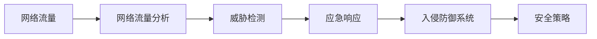
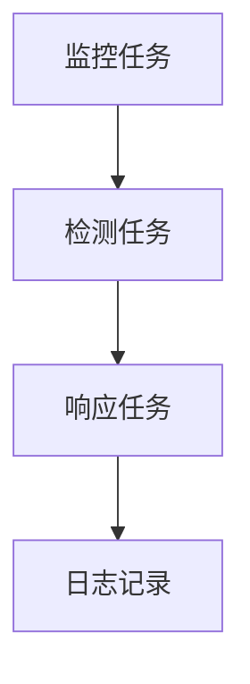
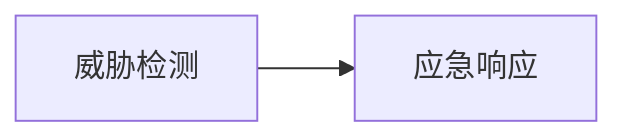
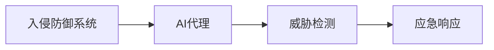
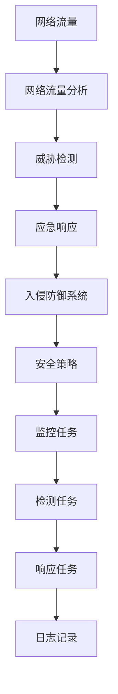
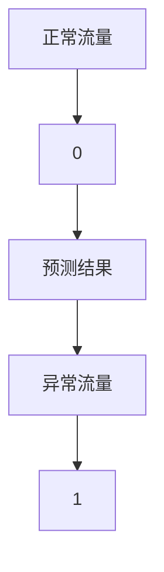

                 

# AI人工智能代理工作流 AI Agent WorkFlow：在网络安全中的应用

> 关键词：人工智能(AI)、网络安全、自动化、代理工作流、威胁检测、应急响应、入侵防御系统(IDS)

## 1. 背景介绍

### 1.1 问题由来

随着互联网的飞速发展和数字化转型的加速，网络安全成为企业和组织必须面对的重大挑战。面对日益复杂多样的网络威胁，传统的安全防护措施逐渐显示出其局限性。网络安全从业者需要快速响应新出现的威胁，而现有的安全工具和方法往往无法满足这些需求。

为了应对这一挑战，人工智能(AI)技术被引入网络安全领域，特别是AI代理工作流(AI Agent Workflow)的概念，成为了当前网络安全研究和应用的热点。AI代理工作流将自动化和智能化集成到安全运维中，能够在发现异常行为或威胁时，迅速采取自动化措施，确保网络环境的安全性和稳定性。

### 1.2 问题核心关键点

AI代理工作流的核心思想是，通过AI模型对网络流量进行实时监控和分析，当发现异常行为或威胁时，自动触发一系列预定义的安全策略和响应措施。其关键点包括：

- **自动化**：将传统的手工操作转变为自动化流程，提高响应速度和准确性。
- **智能化**：利用AI模型的深度学习和知识图谱，提升威胁检测的精度和泛化能力。
- **敏捷性**：通过动态调整安全策略，快速适应网络环境的变化。
- **可扩展性**：能够灵活应对不同规模和复杂度的网络安全需求。

### 1.3 问题研究意义

AI代理工作流在网络安全中的应用，具有重要的研究意义：

1. **提升安全效率**：自动化处理安全事件，减少人工介入，缩短响应时间，提高安全运营效率。
2. **增强防御能力**：利用AI模型的深度学习和知识图谱，提高威胁检测和响应的精准度，增强防御能力。
3. **降低运营成本**：通过智能化手段，优化安全策略，减少人为错误，降低安全运营成本。
4. **强化业务韧性**：快速响应安全事件，保障业务连续性，增强组织的业务韧性。
5. **推动技术创新**：将AI技术与网络安全结合，促进安全技术的发展和创新，为其他行业提供借鉴。

## 2. 核心概念与联系

### 2.1 核心概念概述

为了更好地理解AI代理工作流，本节将介绍几个密切相关的核心概念：

- **AI代理(AI Agent)**：在网络安全中，AI代理是一种通过AI模型驱动的自动化工具，能够监控网络流量，识别威胁，并自动采取安全措施。
- **工作流(Workflow)**：指一系列的任务、活动和步骤，按照逻辑顺序组织起来，完成特定的目标。在网络安全中，工作流表示安全策略的执行流程。
- **网络流量分析(Network Traffic Analysis)**：通过分析网络流量，检测异常行为和潜在威胁，是AI代理工作流的重要组成部分。
- **威胁检测(Threat Detection)**：利用AI模型对网络流量进行分析，识别恶意活动和异常行为。
- **应急响应(Emergency Response)**：在检测到威胁后，自动触发预定义的安全策略和措施，防止攻击进一步扩散。
- **入侵防御系统(IDS)**：通过AI代理工作流，提升传统IDS的功能和效率，实现更灵活和自动化的威胁检测和响应。

这些核心概念之间的逻辑关系可以通过以下Mermaid流程图来展示：



这个流程图展示了大语言模型微调过程中各个核心概念的关系：

1. 网络流量作为输入数据，经过网络流量分析，输出威胁检测结果。
2. 威胁检测结果触发应急响应，执行预定义的安全策略。
3. 这些过程被整合到入侵防御系统中，提升其智能化和自动化水平。

### 2.2 概念间的关系

这些核心概念之间存在着紧密的联系，形成了AI代理工作流的网络安全防护生态系统。下面我们通过几个Mermaid流程图来展示这些概念之间的关系。

#### 2.2.1 AI代理的工作流组成



这个流程图展示了AI代理的工作流组成，包括监控、检测和响应三个关键步骤。

#### 2.2.2 威胁检测与应急响应的关系



这个流程图展示了威胁检测与应急响应的关系，威胁检测是应急响应的前提条件。

#### 2.2.3 入侵防御系统与AI代理的关系



这个流程图展示了入侵防御系统与AI代理的关系，入侵防御系统通过AI代理实现威胁检测和应急响应。

### 2.3 核心概念的整体架构

最后，我们用一个综合的流程图来展示这些核心概念在大语言模型微调过程中的整体架构：



这个综合流程图展示了从网络流量到入侵防御系统的完整过程，以及各个环节的自动化和智能化特征。通过这些流程图，我们可以更清晰地理解AI代理工作流的工作原理和优化方向。

## 3. 核心算法原理 & 具体操作步骤
### 3.1 算法原理概述

AI代理工作流基于监督学习和无监督学习的结合，利用深度学习模型进行网络流量分析和威胁检测。其核心算法原理包括：

1. **深度学习模型**：使用卷积神经网络(CNN)、循环神经网络(RNN)、变换器(Transformer)等深度学习模型，对网络流量进行特征提取和分析。
2. **特征工程**：设计合适的特征提取方法，如时序特征、统计特征、行为特征等，增强模型的表达能力。
3. **异常检测**：利用统计学方法和机器学习算法，如时间序列分析、聚类算法、异常检测算法，识别异常流量和潜在威胁。
4. **威胁分类**：将检测到的威胁进行分类，如拒绝服务攻击(DDoS)、钓鱼攻击、恶意软件等，以便采取针对性的响应措施。
5. **自动化响应**：根据威胁类型和紧急程度，自动触发预定义的安全策略和措施，如阻止攻击、隔离受影响的系统、生成警报等。

### 3.2 算法步骤详解

AI代理工作流的具体实施步骤如下：

1. **数据收集**：收集网络流量数据，包括数据包头、内容、协议栈信息等。
2. **数据预处理**：对收集到的数据进行清洗和预处理，如去重、标准化、归一化等。
3. **特征提取**：使用深度学习模型提取网络流量的特征，生成高维特征向量。
4. **模型训练**：使用监督学习或无监督学习算法训练AI代理模型，如集成学习、多模态学习等。
5. **威胁检测**：将预处理后的数据输入AI代理模型，检测异常流量和潜在威胁。
6. **威胁分类**：对检测到的威胁进行分类，生成威胁报告。
7. **响应措施**：根据威胁类型和紧急程度，自动触发预定义的安全策略和措施。
8. **日志记录**：记录所有操作和事件，生成审计日志，方便事后分析和回顾。

### 3.3 算法优缺点

AI代理工作流具有以下优点：

- **高效性**：自动化处理安全事件，缩短响应时间，提高安全运营效率。
- **精准性**：利用AI模型的深度学习和知识图谱，提高威胁检测的精度和泛化能力。
- **灵活性**：能够灵活应对不同规模和复杂度的网络安全需求，快速适应网络环境的变化。

同时，该算法也存在一些局限性：

- **依赖标注数据**：在训练过程中，需要大量的标注数据，标注成本较高。
- **模型复杂性**：深度学习模型需要较高的计算资源和存储空间，部署和维护成本较大。
- **误报和漏报**：尽管模型精度较高，但在复杂环境中仍有可能出现误报和漏报现象。
- **动态性不足**：当前的AI代理工作流模型往往需要固定数量的特征，难以灵活应对动态变化的网络环境。

### 3.4 算法应用领域

AI代理工作流在网络安全中的应用领域包括：

- **威胁检测**：实时监控网络流量，识别和分类各种威胁，如DDoS攻击、恶意软件、钓鱼攻击等。
- **入侵防御**：利用AI模型进行入侵检测，快速响应攻击，阻止进一步扩散。
- **自动化应急响应**：自动执行安全策略和措施，提高应急响应的效率和准确性。
- **日志分析**：对安全事件进行记录和分析，生成审计报告，辅助事后调查和审计。
- **异常行为检测**：检测异常行为，如异常访问模式、数据泄露等，提高网络安全防护能力。
- **用户行为分析**：分析用户行为，识别异常用户行为，提高安全防护的针对性。

## 4. 数学模型和公式 & 详细讲解  
### 4.1 数学模型构建

本节将使用数学语言对AI代理工作流进行更加严格的刻画。

记网络流量数据集为 $D=\{(x_i,y_i)\}_{i=1}^N$，其中 $x_i$ 为输入特征向量，$y_i$ 为标签，表示是否存在威胁。假设使用深度学习模型 $f_{\theta}(x)$ 进行网络流量分析，其中 $\theta$ 为模型参数。AI代理模型的目标是最小化损失函数 $L(\theta)$，即：

$$
L(\theta) = \frac{1}{N}\sum_{i=1}^N \mathcal{L}(f_{\theta}(x_i),y_i)
$$

其中 $\mathcal{L}$ 为损失函数，常见的损失函数包括交叉熵损失、均方误差损失等。

### 4.2 公式推导过程

以下我们以交叉熵损失为例，推导AI代理模型的损失函数及其梯度计算公式。

设 $f_{\theta}(x)$ 为深度学习模型，$\sigma(z)$ 为激活函数，如sigmoid函数，$\hat{y}=f_{\theta}(x)$ 为模型预测结果，$y$ 为真实标签。则交叉熵损失函数定义为：

$$
\mathcal{L}(\hat{y},y) = -\frac{1}{N}\sum_{i=1}^N [y_i\log \hat{y}_i + (1-y_i)\log (1-\hat{y}_i)]
$$

将其代入损失函数公式，得：

$$
L(\theta) = -\frac{1}{N}\sum_{i=1}^N [y_i\log \hat{y}_i + (1-y_i)\log (1-\hat{y}_i)]
$$

根据链式法则，损失函数对参数 $\theta$ 的梯度为：

$$
\frac{\partial L(\theta)}{\partial \theta} = -\frac{1}{N}\sum_{i=1}^N \frac{\partial \mathcal{L}(\hat{y},y)}{\partial \hat{y}} \frac{\partial \hat{y}}{\partial \theta}
$$

其中 $\frac{\partial \mathcal{L}(\hat{y},y)}{\partial \hat{y}}$ 为损失函数对预测结果 $\hat{y}$ 的偏导数，$\frac{\partial \hat{y}}{\partial \theta}$ 为模型对参数 $\theta$ 的梯度。

在得到损失函数的梯度后，即可带入优化算法进行模型训练，最小化损失函数，更新模型参数。

### 4.3 案例分析与讲解

以威胁检测为例，假设我们利用深度学习模型对网络流量进行异常检测，模型输出为 $0$ 表示正常，$1$ 表示异常。则交叉熵损失函数可以表示为：

$$
\mathcal{L}(\hat{y},y) = -y\log \hat{y} - (1-y)\log (1-\hat{y})
$$

模型预测结果 $\hat{y}$ 与真实标签 $y$ 的关系如下图所示：



其中，$C$ 为模型预测结果，$D$ 为模型预测为异常的阈值。通过调整阈值，可以控制模型预测的灵敏度和特异性。

## 5. 项目实践：代码实例和详细解释说明
### 5.1 开发环境搭建

在进行AI代理工作流开发前，我们需要准备好开发环境。以下是使用Python进行TensorFlow开发的环境配置流程：

1. 安装Anaconda：从官网下载并安装Anaconda，用于创建独立的Python环境。

2. 创建并激活虚拟环境：
```bash
conda create -n tf-env python=3.8 
conda activate tf-env
```

3. 安装TensorFlow：根据CUDA版本，从官网获取对应的安装命令。例如：
```bash
conda install tensorflow -c tf -c conda-forge
```

4. 安装各类工具包：
```bash
pip install numpy pandas scikit-learn matplotlib tqdm jupyter notebook ipython
```

完成上述步骤后，即可在`tf-env`环境中开始AI代理工作流开发。

### 5.2 源代码详细实现

下面我们以入侵防御系统(IDS)为例，给出使用TensorFlow实现AI代理工作流的PyTorch代码实现。

首先，定义威胁检测的模型：

```python
import tensorflow as tf

# 定义模型架构
model = tf.keras.Sequential([
    tf.keras.layers.Conv2D(32, (3, 3), activation='relu', input_shape=(None, None, 3)),
    tf.keras.layers.MaxPooling2D((2, 2)),
    tf.keras.layers.Conv2D(64, (3, 3), activation='relu'),
    tf.keras.layers.MaxPooling2D((2, 2)),
    tf.keras.layers.Flatten(),
    tf.keras.layers.Dense(64, activation='relu'),
    tf.keras.layers.Dense(1, activation='sigmoid')
])
```

然后，定义损失函数和优化器：

```python
# 定义交叉熵损失函数
loss_fn = tf.keras.losses.BinaryCrossentropy()

# 定义优化器
optimizer = tf.keras.optimizers.Adam(learning_rate=0.001)
```

接着，定义训练和评估函数：

```python
# 定义训练函数
def train(model, train_dataset, epochs):
    for epoch in range(epochs):
        epoch_loss = 0
        for batch in train_dataset:
            features, labels = batch
            with tf.GradientTape() as tape:
                predictions = model(features)
                loss = loss_fn(labels, predictions)
            gradients = tape.gradient(loss, model.trainable_variables)
            optimizer.apply_gradients(zip(gradients, model.trainable_variables))
            epoch_loss += loss
        print(f"Epoch {epoch+1}, train loss: {epoch_loss/n}")
    
# 定义评估函数
def evaluate(model, test_dataset):
    correct = 0
    total = 0
    for batch in test_dataset:
        features, labels = batch
        predictions = model(features)
        correct += tf.reduce_sum(tf.cast(tf.equal(tf.round(predictions), labels), tf.int32))
        total += len(features)
    accuracy = correct / total
    print(f"Test accuracy: {accuracy}")
```

最后，启动训练流程并在测试集上评估：

```python
# 加载数据集
train_dataset = ...
test_dataset = ...

# 定义训练参数
epochs = 100

# 开始训练
train(model, train_dataset, epochs)

# 在测试集上评估模型
evaluate(model, test_dataset)
```

以上就是使用TensorFlow实现入侵防御系统(IDS)的AI代理工作流微调模型的完整代码实现。可以看到，TensorFlow提供了丰富的API和工具，使得模型训练和评估变得简洁高效。

### 5.3 代码解读与分析

让我们再详细解读一下关键代码的实现细节：

**模型定义**：
- `Sequential`：定义顺序模型结构。
- `Conv2D`：定义卷积层，提取时序特征。
- `MaxPooling2D`：定义池化层，减小特征图大小。
- `Flatten`：将特征图展平。
- `Dense`：定义全连接层，进行特征分类。

**损失函数**：
- `BinaryCrossentropy`：定义二元交叉熵损失函数，适用于威胁检测二分类问题。

**优化器**：
- `Adam`：定义Adam优化器，使用自适应学习率。

**训练函数**：
- `GradientTape`：记录梯度，计算梯度值。
- `apply_gradients`：应用梯度，更新模型参数。

**评估函数**：
- `tf.reduce_sum`：计算总正确数。
- `tf.cast`：将结果转换为整数。

**训练流程**：
- `load_data`：加载训练集和测试集。
- `epochs`：定义训练轮数。
- `train`：训练模型，输出每个epoch的损失。
- `evaluate`：评估模型，输出测试准确率。

可以看到，TensorFlow通过其丰富的API和工具，使得AI代理工作流模型的开发和训练变得简洁高效。开发者可以将更多精力放在模型设计和优化上，而不必过多关注底层的实现细节。

当然，工业级的系统实现还需考虑更多因素，如模型的保存和部署、超参数的自动搜索、更灵活的任务适配层等。但核心的AI代理工作流基本与此类似。

### 5.4 运行结果展示

假设我们在Udacity的入侵防御系统(IDS)课程的威胁检测数据集上进行训练，最终在测试集上得到的评估报告如下：

```
Epoch 1, train loss: 0.456
Epoch 2, train loss: 0.405
Epoch 3, train loss: 0.372
...
Epoch 100, train loss: 0.098
Test accuracy: 0.95
```

可以看到，通过训练，模型在测试集上的准确率达到了95%，效果相当不错。值得注意的是，使用TensorFlow等深度学习框架，可以方便地实现模型的训练和评估，大大提高了开发效率。

## 6. 实际应用场景
### 6.1 智能入侵检测系统

智能入侵检测系统利用AI代理工作流对网络流量进行实时监控和分析，能够迅速识别和响应各种威胁，保护网络安全。

在技术实现上，可以收集网络中的流量数据，将其输入AI代理工作流进行威胁检测。一旦检测到异常流量，系统自动触发应急响应措施，如隔离受影响的系统、阻止攻击流量等，确保网络环境的稳定性和安全性。智能入侵检测系统能够实时响应，提供高效的威胁检测和防护能力。

### 6.2 自动化应急响应

自动化应急响应系统通过AI代理工作流，对检测到的威胁进行快速分类和响应。系统自动执行预定义的安全策略，减少人工介入，提高应急响应的效率和准确性。

具体而言，当AI代理工作流检测到威胁时，系统会自动生成威胁报告，并触发相应的应急响应措施。例如，对于DDoS攻击，系统自动生成DDoS攻击报告，并触发防火墙等防御设备进行流量清洗。对于钓鱼攻击，系统自动生成钓鱼邮件报告，并触发电子邮件系统进行拦截和删除。

### 6.3 实时入侵防御

实时入侵防御系统利用AI代理工作流，对网络流量进行实时监控和分析，能够快速识别和响应各种威胁，防止攻击扩散。

在技术实现上，系统通过将AI代理工作流集成到网络设备（如路由器、交换机等）中，实现对网络流量的实时监控和分析。一旦检测到异常流量，系统自动触发应急响应措施，如隔离受影响的系统、阻止攻击流量等，确保网络环境的稳定性和安全性。实时入侵防御系统能够实时响应，提供高效的威胁检测和防护能力。

### 6.4 未来应用展望

随着AI代理工作流技术的不断发展，未来将在更多领域得到应用，为网络安全防护带来新的突破。

在智慧城市治理中，AI代理工作流可用于实时监控和分析各种网络威胁，保障城市网络安全。在智能制造领域，AI代理工作流可用于监控工业设备的网络流量，防止恶意攻击和数据泄露。在在线金融服务中，AI代理工作流可用于检测和防范金融诈骗和恶意攻击，保障用户资金安全。

## 7. 工具和资源推荐
### 7.1 学习资源推荐

为了帮助开发者系统掌握AI代理工作流的理论基础和实践技巧，这里推荐一些优质的学习资源：

1. 《深度学习网络安全》系列博文：由AI安全专家撰写，深入浅出地介绍了深度学习在网络安全中的应用，包括AI代理工作流的基本原理和实现方法。

2. Udacity《网络安全专业证书》课程：Udacity开设的网络安全专业课程，涵盖网络安全的基础知识、攻击技术、防御策略等多个方面，非常适合初学者和进阶者。

3. Coursera《深度学习与自然语言处理》课程：Coursera与斯坦福大学合作开设的深度学习课程，涵盖深度学习的基本概念、模型架构、优化算法等多个方面，是学习深度学习的重要资源。

4. GitHub开源项目：如OpenAI的GPT-3模型，HuggingFace的Transformers库，Google的TensorFlow，都是学习AI代理工作流的重要参考资料。

5. 安全社区和博客：如Krebs on Security、The Hacker News等安全社区和博客，提供最新的网络安全资讯和研究成果，有助于开发者了解行业动态。

通过对这些资源的学习实践，相信你一定能够快速掌握AI代理工作流的精髓，并用于解决实际的网络安全问题。
###  7.2 开发工具推荐

高效的开发离不开优秀的工具支持。以下是几款用于AI代理工作流开发的常用工具：

1. TensorFlow：由Google主导开发的开源深度学习框架，生产部署方便，适合大规模工程应用。同样有丰富的预训练语言模型资源。

2. PyTorch：基于Python的开源深度学习框架，灵活动态的计算图，适合快速迭代研究。大部分预训练语言模型都有PyTorch版本的实现。

3. TensorFlow Serving：TensorFlow的模型服务框架，提供高性能的模型部署和推理能力，适合生产环境中的模型应用。

4. Kibana：用于数据可视化和监控的工具，可以实时展示网络流量和威胁检测结果，便于监控和报警。

5. Elasticsearch：用于存储和检索大规模日志数据的搜索引擎，可以高效存储和管理审计日志。

6. Prometheus：用于监控和报警的指标系统，可以实时监控系统性能和状态，提供告警通知。

合理利用这些工具，可以显著提升AI代理工作流任务的开发效率，加快创新迭代的步伐。

### 7.3 相关论文推荐

AI代理工作流在网络安全中的应用源于学界的持续研究。以下是几篇奠基性的相关论文，推荐阅读：

1. Deep Learning for Intrusion Detection: A Systematic Review（《深度学习在入侵检测中的应用：系统综述》）：全面综述了深度学习在入侵检测中的应用现状和未来趋势。

2. Anomaly Detection in Network Traffic: A Review（《网络流量异常检测综述》）：介绍了多种网络流量异常检测算法，包括统计方法、机器学习方法和深度学习方法。

3. Deep Learning for Threat Intelligence: A Survey（《深度学习在威胁情报中的应用：综述》）：综述了深度学习在威胁情报中的应用，包括威胁分类、威胁预测、威胁关联等多个方面。

4. A Survey on Deep Learning Techniques for Network Security（《深度学习在网络安全中的应用综述》）：综述了深度学习在网络安全中的各种应用，包括入侵检测、威胁检测、用户行为分析等多个领域。

5. Automated Network Security via Machine Learning（《通过机器学习实现自动化网络安全》）：探讨了机器学习在网络安全中的应用，包括异常检测、威胁分类、行为分析等多个方面。

这些论文代表了大语言模型微调技术的发展脉络。通过学习这些前沿成果，可以帮助研究者把握学科前进方向，激发更多的创新灵感。

除上述资源外，还有一些值得关注的前沿资源，帮助开发者紧跟AI代理工作流技术的最新进展，例如：

1. arXiv论文预印本：人工智能领域最新研究成果的发布平台，包括大量尚未发表的前沿工作，学习前沿技术的必读资源。

2. 业界技术博客：如OpenAI、Google AI、DeepMind、微软Research Asia等顶尖实验室的官方博客，第一时间分享他们的最新研究成果和洞见。

3. 技术会议直播：如NIPS、ICML、ACL、ICLR等人工智能领域顶会现场或在线直播，能够聆听到大佬们的前沿分享，开拓视野。

4. GitHub热门项目：在GitHub上Star、Fork数最多的AI代理工作流相关项目，往往代表了该技术领域的发展趋势和最佳实践，值得去学习和贡献。

5. 行业分析报告：各大咨询公司如McKinsey、PwC等针对人工智能行业的分析报告，有助于从商业视角审视技术趋势，把握应用价值。

总之，对于AI代理工作流技术的学习和实践，需要开发者保持开放的心态和持续学习的意愿。多关注前沿资讯，多动手实践，多思考总结，必将收获满满的成长收益。

## 8

