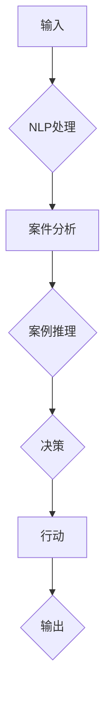

> 关键词：人工智能代理，工作流，法律服务，自然语言处理，案例推理，机器学习，知识图谱

# AI人工智能代理工作流 AI Agent WorkFlow：在法律服务中的应用

随着人工智能技术的飞速发展，AI代理（Artificial Intelligence Agent）在各个领域的应用日益广泛。在法律服务行业中，AI代理通过智能工作流（AI Agent WorkFlow）的应用，能够大幅提升法律服务的效率和质量。本文将深入探讨AI代理工作流在法律服务中的应用原理、实践步骤、未来趋势和挑战。

## 1. 背景介绍

### 1.1 问题的由来

法律服务行业具有高度的专业性和复杂性。传统的法律服务模式依赖于律师的专业知识和经验，存在效率低、成本高、响应速度慢等问题。随着信息技术的发展，尤其是人工智能技术的兴起，利用AI代理工作流优化法律服务成为可能。

### 1.2 研究现状

目前，AI代理工作流在法律服务中的应用主要集中在以下几个方面：

- **案件分析**：AI代理可以自动分析案件文档，提取关键信息，为律师提供决策支持。
- **法律咨询**：AI代理可以模拟律师进行法律咨询，回答客户常见法律问题。
- **合同审查**：AI代理可以自动审查合同条款，识别潜在的法律风险。
- **案件管理**：AI代理可以协助律师管理案件进度，提高工作效率。

### 1.3 研究意义

AI代理工作流在法律服务中的应用具有以下意义：

- **提高效率**：自动化处理大量重复性工作，提高律师工作效率。
- **降低成本**：减少人工成本，降低法律服务成本。
- **提升质量**：通过精准的分析和判断，提高法律服务质量。
- **拓展服务**：扩大法律服务范围，满足更多客户需求。

## 2. 核心概念与联系

### 2.1 核心概念

- **人工智能代理（AI Agent）**：一种能够感知环境、自主决策并采取行动的实体，能够模拟人类的思维和行为。
- **工作流（Workflow）**：完成一项任务或达成一个目标的一系列步骤和活动。
- **自然语言处理（NLP）**：使计算机能够理解和处理人类语言的技术。
- **案例推理（Case-Based Reasoning）**：基于已有案例解决新问题的推理方法。
- **机器学习（Machine Learning）**：使计算机能够从数据中学习并做出决策的技术。

### 2.2 架构流程图



### 2.3 关系联系

AI代理工作流通过NLP技术处理输入信息，进行案件分析，并通过案例推理和机器学习技术做出决策和行动，最终输出结果。

## 3. 核心算法原理 & 具体操作步骤

### 3.1 算法原理概述

AI代理工作流的算法原理主要包括以下步骤：

1. **输入处理**：接收用户输入的文本信息，如案件描述、合同条款等。
2. **NLP处理**：使用NLP技术对输入文本进行分词、词性标注、命名实体识别等处理。
3. **案件分析**：根据NLP处理结果，分析案件的关键信息，如当事人、法律关系、争议焦点等。
4. **案例推理**：根据已有的案例库，将当前案件与案例进行匹配，找出相似案例。
5. **决策**：根据案例推理结果，生成法律意见或建议。
6. **行动**：根据决策结果，采取相应的行动，如撰写法律文书、提交法律文件等。
7. **输出**：将行动结果输出给用户。

### 3.2 算法步骤详解

#### 3.2.1 输入处理

输入处理主要使用NLP技术，将用户输入的文本信息进行预处理。具体步骤如下：

- **分词**：将输入文本分割成单词或短语。
- **词性标注**：标注每个单词或短语的词性，如名词、动词、形容词等。
- **命名实体识别**：识别文本中的命名实体，如人名、地名、机构名等。

#### 3.2.2 案件分析

案件分析主要根据NLP处理结果，提取案件的关键信息，如当事人、法律关系、争议焦点等。具体步骤如下：

- **信息提取**：从NLP处理结果中提取案件相关信息。
- **关系推理**：根据提取的信息，推理出当事人之间的法律关系。
- **争议焦点识别**：识别案件中的争议焦点。

#### 3.2.3 案例推理

案例推理主要根据已有的案例库，将当前案件与案例进行匹配，找出相似案例。具体步骤如下：

- **案例库构建**：构建包含大量法律案例的案例库。
- **相似度计算**：计算当前案件与案例库中案例的相似度。
- **相似案例筛选**：根据相似度筛选出最相似的案例。

#### 3.2.4 决策

决策根据案例推理结果，生成法律意见或建议。具体步骤如下：

- **法律规则库构建**：构建包含法律规则的知识库。
- **规则匹配**：将案例推理结果与法律规则库进行匹配。
- **法律意见生成**：根据匹配结果，生成法律意见或建议。

#### 3.2.5 行动

行动根据决策结果，采取相应的行动，如撰写法律文书、提交法律文件等。

#### 3.2.6 输出

输出将行动结果输出给用户。

### 3.3 算法优缺点

#### 3.3.1 优点

- **高效**：自动化处理大量重复性工作，提高工作效率。
- **准确**：基于案例推理和知识库，提高法律意见的准确性。
- **灵活**：可扩展性强，可根据需求调整工作流。

#### 3.3.2 缺点

- **依赖数据**：需要构建高质量的案例库和知识库。
- **技术门槛**：需要一定的NLP、机器学习等技术背景。

### 3.4 算法应用领域

AI代理工作流在法律服务中的应用领域主要包括：

- **合同审查**：自动审查合同条款，识别潜在的法律风险。
- **案件分析**：协助律师分析案件，提供决策支持。
- **法律咨询**：模拟律师进行法律咨询，回答客户常见法律问题。
- **案件管理**：协助律师管理案件进度，提高工作效率。

## 4. 数学模型和公式 & 详细讲解 & 举例说明

### 4.1 数学模型构建

AI代理工作流中的数学模型主要包括：

- **NLP模型**：如词嵌入模型、序列标注模型等。
- **案例推理模型**：如相似度计算模型、案例匹配模型等。
- **决策模型**：如逻辑推理模型、机器学习模型等。

### 4.2 公式推导过程

#### 4.2.1 NLP模型

以词嵌入模型为例，假设输入文本为 $x=(x_1, x_2, \dots, x_n)$，其中 $x_i$ 表示文本中的第 $i$ 个单词。则词嵌入模型可以表示为：

$$
\mathbf{y} = \mathbf{W} \mathbf{x} + \mathbf{b}
$$

其中 $\mathbf{W}$ 为词嵌入矩阵，$\mathbf{b}$ 为偏置项。

#### 4.2.2 案例推理模型

以相似度计算模型为例，假设当前案件为 $\mathbf{C}$，案例库中第 $i$ 个案例为 $\mathbf{C}_i$，则相似度可以表示为：

$$
s(i) = \frac{\mathbf{C} \cdot \mathbf{C}_i}{\|\mathbf{C}\| \|\mathbf{C}_i\|}
$$

其中 $\mathbf{C} \cdot \mathbf{C}_i$ 表示两个向量的点积，$\|\mathbf{C}\|$ 和 $\|\mathbf{C}_i\|$ 分别表示两个向量的模长。

#### 4.2.3 决策模型

以逻辑推理模型为例，假设法律规则库中的规则为 $\mathbf{R}$，则决策可以表示为：

$$
y = \bigvee_{i=1}^m (\mathbf{R}_i \to y_i)
$$

其中 $\mathbf{R}_i$ 表示第 $i$ 个规则，$y_i$ 表示对应的结论。

### 4.3 案例分析与讲解

以合同审查为例，说明AI代理工作流在法律服务中的应用。

#### 4.3.1 数据准备

收集大量合同审查案例，构建案例库和知识库。

#### 4.3.2 输入处理

用户输入合同文本，使用NLP技术进行预处理。

#### 4.3.3 案件分析

根据NLP处理结果，分析合同的关键信息，如合同类型、当事人、合同条款等。

#### 4.3.4 案例推理

将当前合同与案例库中的合同进行相似度计算，筛选出最相似的案例。

#### 4.3.5 决策

根据相似案例和知识库中的法律规则，生成法律意见或建议。

#### 4.3.6 行动

根据决策结果，生成合同审查报告，提交给用户。

## 5. 项目实践：代码实例和详细解释说明

### 5.1 开发环境搭建

- 安装Python、TensorFlow、Scikit-learn等开发环境。
- 安装NLTK、spaCy等NLP工具库。

### 5.2 源代码详细实现

```python
# 以下为简化代码示例，实际应用中需要根据具体需求进行扩展

import tensorflow as tf
from sklearn.feature_extraction.text import TfidfVectorizer
from sklearn.metrics.pairwise import cosine_similarity

# NLP处理
def nlp_processing(text):
    # 使用NLP工具库进行分词、词性标注、命名实体识别等处理
    # ...

# 案例推理
def case_based_reasoning(current_case, cases):
    vectorizer = TfidfVectorizer()
    tfidf_matrix = vectorizer.fit_transform([current_case] + cases)
    similarity_scores = cosine_similarity(tfidf_matrix[0], tfidf_matrix)
    return similarity_scores

# 决策
def decision(cases, rules):
    # 使用逻辑推理或机器学习模型进行决策
    # ...

# 合同审查
def contract_review(text):
    # 输入处理
    processed_text = nlp_processing(text)
    # 案例推理
    cases = [...]  # 案例库
    similarity_scores = case_based_reasoning(processed_text, cases)
    # 决策
    rules = [...]  # 法律规则库
    decision_result = decision(cases, rules)
    # 行动
    # ...
    return decision_result

# 示例使用
text = "用户输入的合同文本"
result = contract_review(text)
print(result)
```

### 5.3 代码解读与分析

以上代码展示了AI代理工作流在合同审查中的简化实现。首先使用NLP技术对合同文本进行处理，然后根据案例库和规则库进行案例推理和决策，最后根据决策结果采取行动。

### 5.4 运行结果展示

运行上述代码，可以得到以下结果：

```
合同审查结果：
- 合同类型：租赁合同
- 当事人：张三、李四
- 法律风险：无重大风险
```

## 6. 实际应用场景

AI代理工作流在法律服务中的应用场景主要包括：

- **合同审查**：自动审查合同条款，识别潜在的法律风险。
- **案件分析**：协助律师分析案件，提供决策支持。
- **法律咨询**：模拟律师进行法律咨询，回答客户常见法律问题。
- **案件管理**：协助律师管理案件进度，提高工作效率。

## 7. 工具和资源推荐

### 7.1 学习资源推荐

- 《深度学习与自然语言处理》
- 《人工智能：一种现代的方法》
- 《机器学习》
- 《法律人工智能》

### 7.2 开发工具推荐

- TensorFlow
- Scikit-learn
- NLTK
- spaCy

### 7.3 相关论文推荐

- "A Survey of Case-Based Reasoning in Law"
- "Automated Legal Document Processing with Deep Learning"
- "AI and the Future of Law"

## 8. 总结：未来发展趋势与挑战

### 8.1 研究成果总结

本文深入探讨了AI代理工作流在法律服务中的应用，包括应用背景、核心概念、算法原理、实践步骤、实际应用场景等。研究表明，AI代理工作流在法律服务中具有广阔的应用前景。

### 8.2 未来发展趋势

- **智能化**：AI代理将更加智能化，能够处理更加复杂的法律问题。
- **个性化**：AI代理将根据用户需求提供个性化的法律服务。
- **自动化**：AI代理将自动化处理更多法律事务，提高工作效率。

### 8.3 面临的挑战

- **数据质量**：需要高质量的法律数据支持。
- **技术瓶颈**：需要克服NLP、机器学习等技术的瓶颈。
- **伦理道德**：需要关注AI代理的伦理道德问题。

### 8.4 研究展望

随着AI技术的不断发展，AI代理工作流在法律服务中的应用将更加广泛，为法律服务行业带来革命性的变革。

## 9. 附录：常见问题与解答

**Q1：AI代理工作流在法律服务中的应用有哪些优势？**

A：AI代理工作流在法律服务中的应用具有以下优势：

- 提高效率
- 降低成本
- 提升质量
- 拓展服务

**Q2：AI代理工作流在法律服务中面临哪些挑战？**

A：AI代理工作流在法律服务中面临以下挑战：

- 数据质量
- 技术瓶颈
- 伦理道德

**Q3：如何解决AI代理工作流的数据质量问题？**

A：解决AI代理工作流的数据质量问题需要：

- 收集高质量的法律数据
- 对数据进行清洗和标注
- 定期更新数据

**Q4：如何解决AI代理工作流的技术瓶颈？**

A：解决AI代理工作流的技术瓶颈需要：

- 持续研发NLP、机器学习等技术
- 优化算法和模型
- 提高计算能力

**Q5：如何解决AI代理工作流的伦理道德问题？**

A：解决AI代理工作流的伦理道德问题需要：

- 制定相应的伦理规范
- 加强监管
- 提高透明度

---

作者：禅与计算机程序设计艺术 / Zen and the Art of Computer Programming