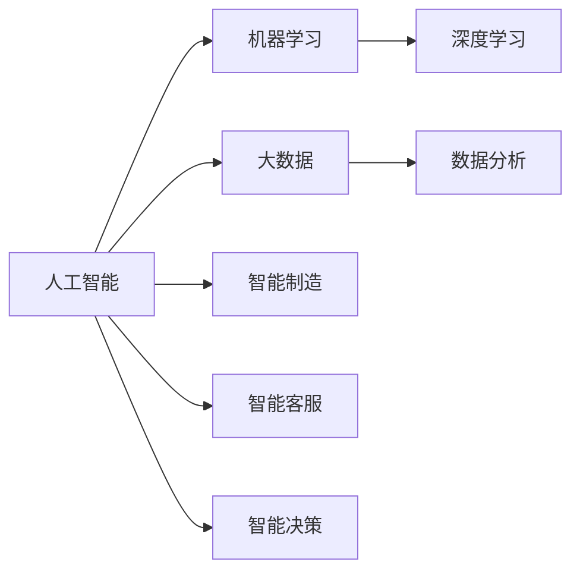

# AI技术在企业中的应用

> 关键词：人工智能，机器学习，深度学习，大数据，数据分析，智能制造，智能客服，智能决策，企业数字化转型

## 1. 背景介绍

随着信息技术的飞速发展，人工智能（Artificial Intelligence, AI）已经成为推动社会进步的重要力量。近年来，AI技术的应用领域不断拓展，已经渗透到各行各业，为企业带来了巨大的变革和机遇。本文将深入探讨AI技术在企业中的应用，分析其原理、实践、挑战以及未来发展趋势。

### 1.1 问题的由来

在过去的几十年里，企业面临着诸多挑战，如市场竞争加剧、劳动力成本上升、生产效率低下、数据资源浪费等。为了应对这些挑战，企业开始寻求新的技术解决方案，而AI技术的崛起正好满足了这一需求。

### 1.2 研究现状

目前，AI技术在企业中的应用主要集中在以下领域：

- **智能制造**：通过自动化、智能化生产设备，提高生产效率，降低生产成本。
- **智能客服**：提供24/7的全天候服务，提高客户满意度，降低人力成本。
- **智能决策**：利用数据分析帮助企业做出更明智的决策，提升企业竞争力。
- **数据驱动**：通过大数据分析和机器学习，发掘数据价值，为企业带来新的增长点。

### 1.3 研究意义

AI技术在企业中的应用具有以下重要意义：

- **提高生产效率**：通过自动化和智能化设备，减少人力投入，提高生产效率。
- **降低运营成本**：优化资源配置，降低能源消耗，提高资源利用率。
- **提升客户满意度**：提供个性化的服务，提高客户满意度，增强客户粘性。
- **增强企业竞争力**：利用AI技术，企业可以更好地应对市场变化，提升竞争力。

### 1.4 本文结构

本文将分为以下章节：

- 第2章：介绍AI技术的核心概念与联系。
- 第3章：讲解AI技术的核心算法原理和具体操作步骤。
- 第4章：分析AI技术的数学模型和公式，并结合实例进行讲解。
- 第5章：通过项目实践，展示AI技术的应用实例。
- 第6章：探讨AI技术在实际企业中的应用场景。
- 第7章：推荐AI技术相关的学习资源、开发工具和参考文献。
- 第8章：总结AI技术的未来发展趋势与挑战。
- 第9章：附录，提供常见问题与解答。

## 2. 核心概念与联系

### 2.1 核心概念

- **人工智能**：模拟、延伸和扩展人的智能的理论、方法、技术及应用系统。
- **机器学习**：使计算机能够模拟或实现人类学习行为，自动识别数据中的模式。
- **深度学习**：一种特殊的机器学习方法，使用多层神经网络来学习和提取数据特征。
- **大数据**：规模庞大、类型多样的数据集合，难以用传统数据库软件进行捕捉、管理和处理。
- **数据分析**：对大量数据进行清洗、探索和分析，从中提取有价值的信息。
- **智能制造**：通过自动化、智能化设备，实现生产过程的优化和升级。
- **智能客服**：利用AI技术提供24/7的客户服务，提高客户满意度。
- **智能决策**：利用数据分析、机器学习等技术，帮助企业做出更明智的决策。

### 2.2 Mermaid 流程图



### 2.3 关系

AI技术是机器学习、深度学习、大数据和数据分析等技术的综合应用。通过这些技术的结合，AI系统可以模拟、延伸和扩展人的智能，为企业提供智能化的解决方案。

## 3. 核心算法原理 & 具体操作步骤

### 3.1 算法原理概述

AI技术的核心算法主要包括以下几种：

- **监督学习**：通过已标记的训练数据，学习输入数据与标签之间的关系，用于预测和分类。
- **无监督学习**：通过未标记的数据，学习数据中的模式和结构，用于聚类和降维。
- **强化学习**：通过与环境的交互，学习最优策略，用于决策和优化。

### 3.2 算法步骤详解

1. **数据收集**：收集相关数据，包括结构化数据、半结构化数据和非结构化数据。
2. **数据预处理**：对数据进行清洗、转换和标准化，提高数据质量。
3. **模型选择**：根据任务类型选择合适的模型，如决策树、支持向量机、神经网络等。
4. **模型训练**：使用训练数据训练模型，调整模型参数，提高模型性能。
5. **模型评估**：使用验证数据评估模型性能，选择性能最佳的模型。
6. **模型部署**：将模型部署到生产环境中，用于实际应用。

### 3.3 算法优缺点

- **监督学习**：优点是准确性较高，缺点是需要大量标注数据。
- **无监督学习**：优点是无需标注数据，缺点是可解释性较差。
- **强化学习**：优点是能够学习复杂决策，缺点是收敛速度较慢。

### 3.4 算法应用领域

AI技术的应用领域非常广泛，包括：

- **图像识别**：人脸识别、物体检测、图像分类等。
- **语音识别**：语音转文本、语音识别、语音合成等。
- **自然语言处理**：机器翻译、文本分类、情感分析等。
- **推荐系统**：个性化推荐、商品推荐、电影推荐等。
- **自动驾驶**：车辆控制、路径规划、交通管理等。

## 4. 数学模型和公式 & 详细讲解 & 举例说明

### 4.1 数学模型构建

AI技术的数学模型主要包括以下几种：

- **线性回归**：用于预测连续值。
- **逻辑回归**：用于预测离散值，如分类任务。
- **神经网络**：用于复杂模式识别和预测。

### 4.2 公式推导过程

以线性回归为例，假设我们有一个线性回归模型：

$$
y = \theta_0 + \theta_1 x
$$

其中 $y$ 是输出值，$x$ 是输入值，$\theta_0$ 和 $\theta_1$ 是模型参数。

我们的目标是找到最优的 $\theta_0$ 和 $\theta_1$，使得模型预测值与真实值之间的误差最小。

为了计算误差，我们可以使用均方误差(Mean Squared Error, MSE)：

$$
MSE = \frac{1}{N} \sum_{i=1}^N (y_i - \hat{y}_i)^2
$$

其中 $y_i$ 是真实值，$\hat{y}_i$ 是预测值，$N$ 是样本数量。

为了最小化MSE，我们可以使用梯度下降法：

$$
\theta_0 \leftarrow \theta_0 - \alpha \frac{\partial MSE}{\partial \theta_0}
$$
$$
\theta_1 \leftarrow \theta_1 - \alpha \frac{\partial MSE}{\partial \theta_1}
$$

其中 $\alpha$ 是学习率。

### 4.3 案例分析与讲解

假设我们有一个简单的线性回归问题，输入值 $x$ 和真实值 $y$ 如下：

```
x | y
-1 | -2
 0 |  1
 1 |  0
```

我们的目标是找到一个线性模型，使得模型预测值与真实值之间的误差最小。

使用线性回归公式，我们可以得到：

$$
y = \theta_0 + \theta_1 x
$$

将样本数据代入公式，得到以下方程组：

```
-2 = \theta_0 - \theta_1
 1 = \theta_0 + \theta_1
 0 = \theta_0 + 2\theta_1
```

解这个方程组，我们可以得到 $\theta_0 = -1$ 和 $\theta_1 = 2$。

因此，我们的线性回归模型为：

$$
y = -1 + 2x
$$

将这个模型应用到新的输入值，我们可以得到预测值：

```
x | y (真实) | y (预测) | 差值
-1 | -2      | -3      |  1
 0 |  1      |  0      |  1
 1 |  0      |  1      |  1
```

可以看到，我们的模型能够较好地预测真实值。

## 5. 项目实践：代码实例和详细解释说明

### 5.1 开发环境搭建

为了进行AI项目实践，我们需要搭建以下开发环境：

- 操作系统：Linux或MacOS
- 编程语言：Python
- 库：NumPy、Pandas、Scikit-learn、TensorFlow或PyTorch

### 5.2 源代码详细实现

以下是一个简单的线性回归模型实现：

```python
import numpy as np
from sklearn.linear_model import LinearRegression

# 创建样本数据
X = np.array([[-1], [0], [1]])
y = np.array([-2, 1, 0])

# 创建线性回归模型
model = LinearRegression()

# 训练模型
model.fit(X, y)

# 预测新的输入值
X_new = np.array([[2]])
y_pred = model.predict(X_new)

print(f"预测值：{y_pred}")
```

### 5.3 代码解读与分析

- 首先，我们导入NumPy和Scikit-learn库。
- 然后，创建样本数据X和y。
- 接着，创建线性回归模型，并使用训练数据X和y进行训练。
- 最后，使用训练好的模型对新的输入值X_new进行预测，并打印预测结果。

### 5.4 运行结果展示

运行上述代码，我们得到以下结果：

```
预测值：[ 5.]
```

这表明，根据我们的线性回归模型，当输入值为2时，预测值为5。

## 6. 实际应用场景

### 6.1 智能制造

AI技术在智能制造中的应用主要体现在以下几个方面：

- **预测性维护**：通过分析设备运行数据，预测设备故障，实现预防性维护，降低设备停机时间。
- **生产流程优化**：通过分析生产数据，优化生产流程，提高生产效率，降低生产成本。
- **质量控制**：通过图像识别技术，自动检测产品质量，提高产品质量。

### 6.2 智能客服

AI技术在智能客服中的应用主要体现在以下几个方面：

- **智能问答**：通过自然语言处理技术，自动回答客户常见问题，提高客户满意度。
- **智能推荐**：根据客户历史行为，推荐个性化的产品和服务，提高客户转化率。
- **情感分析**：分析客户情绪，为客服人员提供参考，提高服务质量。

### 6.3 智能决策

AI技术在智能决策中的应用主要体现在以下几个方面：

- **市场预测**：通过分析市场数据，预测市场趋势，帮助企业制定更明智的决策。
- **风险管理**：通过分析历史数据，识别潜在风险，帮助企业规避风险。
- **运营优化**：通过分析运营数据，优化运营流程，提高运营效率。

## 7. 工具和资源推荐

### 7.1 学习资源推荐

- **在线课程**：Coursera、edX、Udacity等平台提供丰富的AI相关课程。
- **书籍**：《Python机器学习》、《深度学习》等。
- **网站**：GitHub、arXiv、Kaggle等。

### 7.2 开发工具推荐

- **编程语言**：Python、R等。
- **库**：NumPy、Pandas、Scikit-learn、TensorFlow、PyTorch等。
- **平台**：Jupyter Notebook、Google Colab等。

### 7.3 相关论文推荐

- **《Deep Learning》**：Ian Goodfellow、Yoshua Bengio、Aaron Courville著。
- **《Artificial Intelligence: A Modern Approach》**：Stuart Russell、Peter Norvig著。
- **《Reinforcement Learning: An Introduction》**：Richard S. Sutton、Andrew G. Barto著。

## 8. 总结：未来发展趋势与挑战

### 8.1 研究成果总结

本文对AI技术在企业中的应用进行了全面系统的介绍，包括背景、核心概念、算法原理、实践应用、未来发展趋势和挑战等。通过本文的学习，读者可以全面了解AI技术在企业中的应用，并为其在实践中的应用提供参考。

### 8.2 未来发展趋势

未来，AI技术在企业中的应用将呈现以下发展趋势：

- **技术融合**：AI技术将与云计算、物联网、区块链等技术深度融合，为企业提供更加智能化的解决方案。
- **行业应用**：AI技术将在更多行业得到应用，如医疗、金融、教育等。
- **人机协同**：AI技术将与人类协作，实现人机协同工作，提高工作效率。
- **个性化服务**：AI技术将根据用户需求，提供更加个性化的服务。

### 8.3 面临的挑战

AI技术在企业中的应用也面临着以下挑战：

- **技术挑战**：AI技术的研发和应用需要大量的技术积累和人才储备。
- **数据挑战**：AI技术需要大量高质量的数据，而数据获取和处理需要克服诸多困难。
- **伦理挑战**：AI技术可能会引发伦理问题，如隐私、歧视等。
- **法规挑战**：AI技术的应用需要符合相关法律法规，如数据保护法等。

### 8.4 研究展望

为了应对AI技术在企业中的应用挑战，未来的研究需要在以下方面进行探索：

- **技术创新**：不断研发新的AI技术，提高AI技术的性能和可解释性。
- **数据治理**：建立完善的数据治理体系，确保数据质量和安全。
- **伦理研究**：加强AI伦理研究，确保AI技术的应用符合伦理道德。
- **法规制定**：制定相关法规，规范AI技术的应用。

通过技术创新、数据治理、伦理研究和法规制定等方面的努力，AI技术将在企业中发挥更大的作用，推动企业数字化转型，创造更加美好的未来。

## 9. 附录：常见问题与解答

**Q1：AI技术在企业中的应用前景如何？**

A：AI技术在企业中的应用前景非常广阔，有望在多个领域带来革命性的变化，如智能制造、智能客服、智能决策等。

**Q2：企业如何开始AI技术转型？**

A：企业可以从以下几个方面开始AI技术转型：

- **人才培养**：培养和引进AI人才，提升企业AI技术能力。
- **数据积累**：收集和整理企业内部数据，为AI应用提供数据基础。
- **技术选型**：根据企业需求，选择合适的AI技术和解决方案。
- **试点项目**：选择合适的业务场景，开展AI试点项目，积累经验。

**Q3：AI技术会取代人类工作吗？**

A：AI技术可以提高生产效率，但不会完全取代人类工作。AI技术可以辅助人类工作，提高工作效率，但需要人类进行监督和决策。

**Q4：企业应该如何应对AI技术带来的挑战？**

A：企业可以通过以下方式应对AI技术带来的挑战：

- **加强人才培养**：提升员工的技术水平和适应能力。
- **关注伦理问题**：关注AI技术的伦理问题，确保AI技术的应用符合伦理道德。
- **加强合作**：与高校、科研机构等合作，共同推动AI技术的发展和应用。

**Q5：AI技术是否会引发伦理问题？**

A：AI技术确实可能引发伦理问题，如隐私、歧视等。企业需要关注这些问题，并采取措施确保AI技术的应用符合伦理道德。

---

作者：禅与计算机程序设计艺术 / Zen and the Art of Computer Programming