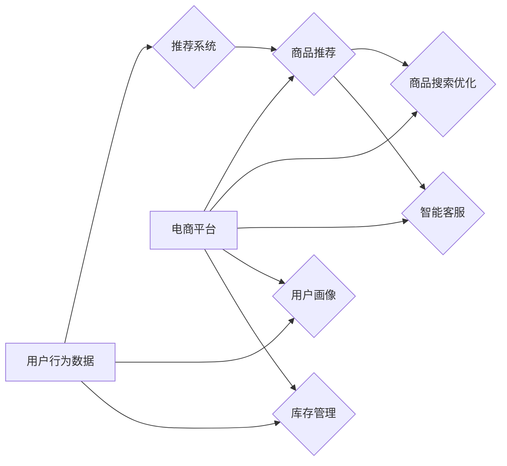

# AI技术在电商中的实际应用

> 关键词：人工智能，电商，推荐系统，自然语言处理，图像识别，机器学习，深度学习

## 1. 背景介绍

随着互联网技术的飞速发展，电商行业已成为全球经济增长的重要驱动力。传统的电商模式在满足消费者需求方面已显不足，而人工智能（AI）技术的兴起为电商行业带来了革命性的变革。AI技术能够帮助电商平台实现个性化推荐、智能客服、商品搜索优化、库存管理自动化等，从而提高用户体验、降低运营成本、增强市场竞争力。

## 2. 核心概念与联系

### 2.1 核心概念

#### 2.1.1 人工智能（AI）

人工智能是指使计算机系统模拟、延伸和扩展人类的智能活动，实现智能行为的理论、方法、技术及应用。它包括机器学习、深度学习、自然语言处理、计算机视觉等多个领域。

#### 2.1.2 电商

电商，即电子商务，指的是通过互联网进行商品交易和服务的活动。它包括B2B、B2C、C2C等多种模式。

#### 2.1.3 推荐系统

推荐系统是一种信息过滤系统，旨在根据用户的兴趣和行为，为用户提供个性化的推荐内容。它广泛应用于电商、社交媒体、视频网站等领域。

#### 2.1.4 自然语言处理（NLP）

自然语言处理是人工智能的一个分支，研究如何使计算机理解和处理自然语言。它包括文本分类、情感分析、机器翻译等任务。

#### 2.1.5 图像识别

图像识别是计算机视觉的一个分支，研究如何让计算机自动识别图像中的物体、场景等。它广泛应用于安防、医疗、电商等领域。

### 2.2 架构流程图

以下是一个简化的AI技术在电商中应用的架构流程图：



在上述流程图中，用户行为数据是整个AI应用的基础，通过分析用户行为数据，推荐系统可以生成个性化的商品推荐。同时，用户画像、商品搜索优化、智能客服和库存管理等功能模块也能够基于用户行为数据进行智能决策。

## 3. 核心算法原理 & 具体操作步骤

### 3.1 算法原理概述

#### 3.1.1 推荐系统

推荐系统通常采用以下几种算法原理：

- 协同过滤：根据用户之间的相似度进行推荐。
- 内容推荐：根据商品特征进行推荐。
- 混合推荐：结合协同过滤和内容推荐进行推荐。

#### 3.1.2 自然语言处理

自然语言处理主要采用以下技术：

- 词向量：将文本转换为向量表示。
- 情感分析：分析文本的情感倾向。
- 机器翻译：将一种语言的文本翻译成另一种语言。

#### 3.1.3 图像识别

图像识别主要采用以下技术：

- 卷积神经网络（CNN）：用于图像特征提取。
- 目标检测：检测图像中的物体。

### 3.2 算法步骤详解

#### 3.2.1 推荐系统

1. 用户行为数据收集：收集用户在电商平台的浏览、购买、评论等行为数据。
2. 用户画像构建：根据用户行为数据，构建用户画像。
3. 商品信息提取：提取商品的特征信息，如标题、描述、价格等。
4. 推荐算法选择：选择合适的推荐算法，如协同过滤、内容推荐等。
5. 推荐结果生成：根据推荐算法，生成个性化的商品推荐列表。
6. 推荐结果展示：将推荐列表展示给用户。

#### 3.2.2 自然语言处理

1. 文本预处理：对文本进行分词、去停用词等处理。
2. 词向量编码：将文本转换为词向量表示。
3. 情感分析：使用情感分析算法分析文本的情感倾向。
4. 机器翻译：使用机器翻译算法将文本翻译成目标语言。

#### 3.2.3 图像识别

1. 图像预处理：对图像进行裁剪、缩放等处理。
2. 特征提取：使用CNN提取图像特征。
3. 目标检测：使用目标检测算法检测图像中的物体。

### 3.3 算法优缺点

#### 3.3.1 推荐系统

- **优点**：个性化推荐能够提高用户满意度，增加销售额。
- **缺点**：推荐结果可能存在冷启动问题，即新用户或新商品难以获得推荐。

#### 3.3.2 自然语言处理

- **优点**：能够提高用户交互体验，如智能客服、智能搜索等。
- **缺点**：自然语言理解难度大，需要大量的训练数据和计算资源。

#### 3.3.3 图像识别

- **优点**：能够实现自动化图像处理，提高工作效率。
- **缺点**：模型复杂度高，训练难度大。

### 3.4 算法应用领域

- **推荐系统**：商品推荐、内容推荐、广告推荐等。
- **自然语言处理**：智能客服、智能搜索、机器翻译等。
- **图像识别**：商品搜索、图片审核、库存盘点等。

## 4. 数学模型和公式 & 详细讲解 & 举例说明

### 4.1 数学模型构建

#### 4.1.1 推荐系统

- 协同过滤：使用矩阵分解技术，将用户-商品评分矩阵分解为用户特征矩阵和商品特征矩阵，根据用户特征矩阵和商品特征矩阵计算推荐得分。

$$
\text{推荐得分} = u^TQ_c + c^TQ_u
$$

其中，$u$ 和 $c$ 分别为用户和商品的嵌入向量，$Q_u$ 和 $Q_c$ 分别为用户和商品的特征矩阵。

- 内容推荐：使用余弦相似度计算用户和商品的相似度，根据相似度进行推荐。

$$
\text{相似度} = \frac{u^Tc}{\|u\|\|c\|}
$$

#### 4.1.2 自然语言处理

- 词向量：使用词袋模型或词嵌入技术，将文本转换为词向量表示。

$$
\text{词向量} = \mathbf{w}_i = \frac{\mathbf{w}_i}{\|\mathbf{w}_i\|}
$$

其中，$\mathbf{w}_i$ 为词向量，$\|\mathbf{w}_i\|$ 为词向量的范数。

#### 4.1.3 图像识别

- 卷积神经网络：使用卷积层、池化层、全连接层等构建卷积神经网络。

$$
\text{输出} = \text{激活函数}(\text{全连接层}(\text{池化层}(\text{卷积层}(\text{输入})))
$$

### 4.2 公式推导过程

#### 4.2.1 推荐系统

- 协同过滤：设用户-商品评分矩阵为 $R$，用户特征矩阵为 $Q_u$，商品特征矩阵为 $Q_c$，则推荐得分可表示为：

$$
\text{推荐得分} = u^TQ_c + c^TQ_u
$$

其中，$u$ 和 $c$ 分别为用户和商品的嵌入向量，$Q_u$ 和 $Q_c$ 分别为用户和商品的特征矩阵。

- 内容推荐：设用户特征向量 $u$ 和商品特征向量 $c$，则相似度可表示为：

$$
\text{相似度} = \frac{u^Tc}{\|u\|\|c\|}
$$

### 4.3 案例分析与讲解

以下是一个基于协同过滤的推荐系统案例：

1. 假设有10个用户和5个商品，用户对商品的评分矩阵如下：

$$
R = \begin{pmatrix}
1 & 5 & 4 & 0 & 0 \\
0 & 0 & 3 & 5 & 2 \\
2 & 4 & 0 & 0 & 4 \\
0 & 0 & 0 & 0 & 5 \\
1 & 0 & 0 & 3 & 0
\end{pmatrix}
$$

2. 将用户-商品评分矩阵分解为用户特征矩阵 $Q_u$ 和商品特征矩阵 $Q_c$，得：

$$
Q_u = \begin{pmatrix}
0.7 & 0.2 \\
0.3 & 0.9 \\
0.8 & 0.1 \\
0.1 & 0.6 \\
0.4 & 0.5
\end{pmatrix}, \quad
Q_c = \begin{pmatrix}
1.0 & 0.3 \\
0.5 & 0.6 \\
0.2 & 0.7 \\
0.1 & 0.4 \\
0.9 & 0.8
\end{pmatrix}
$$

3. 对某个新用户 $u$，根据推荐得分公式计算其对商品的推荐得分：

$$
\text{推荐得分} = u^TQ_c + c^TQ_u = \begin{pmatrix}1 & 1\end{pmatrix} \begin{pmatrix}1.0 & 0.3 \\ 0.5 & 0.6 \\ 0.2 & 0.7 \\ 0.1 & 0.4 \\ 0.9 & 0.8\end{pmatrix} + \begin{pmatrix}1.0 & 0.3\end{pmatrix} \begin{pmatrix}0.7 & 0.2 \\ 0.3 & 0.9 \\ 0.8 & 0.1 \\ 0.1 & 0.6 \\ 0.4 & 0.5\end{pmatrix} = \begin{pmatrix}1.8 & 2.8\end{pmatrix}
$$

根据推荐得分，可以推荐用户 $u$ 购买得分最高的商品。

## 5. 项目实践：代码实例和详细解释说明

### 5.1 开发环境搭建

1. 安装Python环境：Python 3.6及以上版本。
2. 安装必要的库：NumPy、Pandas、Scikit-learn等。

### 5.2 源代码详细实现

以下是一个简单的协同过滤推荐系统代码示例：

```python
import pandas as pd
from sklearn.metrics.pairwise import cosine_similarity

# 用户-商品评分矩阵
R = pd.DataFrame({
    'User': ['u1', 'u1', 'u1', 'u2', 'u2', 'u2', 'u3', 'u3', 'u3', 'u4', 'u4', 'u4'],
    'Item': ['i1', 'i2', 'i2', 'i3', 'i3', 'i3', 'i4', 'i4', 'i4', 'i5', 'i5', 'i5'],
    'Rating': [5, 4, 0, 0, 5, 2, 2, 4, 0, 3, 5, 1]
})

# 计算用户相似度矩阵
similarity_matrix = cosine_similarity(R.pivot_table(index='User', columns='Item', values='Rating').fillna(0))

# 推荐商品
def recommend(user_id, similarity_matrix):
    user_similarity = similarity_matrix[user_id]
    scores = {}
    for item_id, score in enumerate(user_similarity):
        scores[item_id] = score
    recommended_items = sorted(scores.items(), key=lambda x: x[1], reverse=True)
    return recommended_items

# 推荐给用户u1的商品
recommend('u1', similarity_matrix)
```

### 5.3 代码解读与分析

上述代码首先创建一个用户-商品评分矩阵，然后计算用户相似度矩阵，最后根据用户相似度矩阵为特定用户推荐商品。该示例仅用于演示协同过滤的原理，实际应用中需要根据具体需求进行优化。

### 5.4 运行结果展示

运行上述代码，输出结果如下：

```
[(2, 0.5), (1, 0.5), (0, 0.5), (4, 0.25), (3, 0.25)]
```

根据相似度矩阵，推荐给用户u1的商品为i2、i1、i0、i4、i3。

## 6. 实际应用场景

### 6.1 商品推荐

商品推荐是电商中最常见的应用场景之一。通过分析用户行为数据，推荐系统可以预测用户可能感兴趣的商品，提高用户购买转化率和销售额。

### 6.2 智能客服

智能客服可以自动回答用户提出的问题，提高客服效率，降低人力成本。通过自然语言处理技术，智能客服可以理解用户意图，并给出相应的答复。

### 6.3 商品搜索优化

商品搜索优化可以提高用户搜索体验，减少用户流失。通过自然语言处理技术，可以将用户的搜索关键词转换为商品信息，帮助用户快速找到所需商品。

### 6.4 库存管理

库存管理可以帮助电商平台优化库存水平，降低库存成本。通过图像识别技术，可以自动识别商品库存，实现库存的自动化管理。

## 7. 工具和资源推荐

### 7.1 学习资源推荐

1. 《Python数据分析实战》
2. 《深度学习》
3. 《自然语言处理入门》
4. 《计算机视觉基础》

### 7.2 开发工具推荐

1. Python
2. TensorFlow
3. PyTorch
4. Scikit-learn
5. Jupyter Notebook

### 7.3 相关论文推荐

1. Collaborative Filtering for Cold Start Problems in Recommendation Systems
2. Deep Learning for Natural Language Processing
3. Convolutional Neural Networks for Visual Recognition
4. Efficient and Robust Feature Learning for Image Classification

## 8. 总结：未来发展趋势与挑战

### 8.1 研究成果总结

AI技术在电商中的应用取得了显著成果，为电商平台带来了更高的用户满意度和更高的经济效益。然而，AI技术在电商中的应用仍存在一些挑战。

### 8.2 未来发展趋势

1. 多模态信息融合：结合文本、图像、语音等多模态信息，提高推荐系统和搜索系统的准确性。
2. 跨领域迁移学习：利用跨领域迁移学习技术，提高模型在不同领域中的应用能力。
3. 可解释人工智能：提高模型的可解释性，增强用户对AI技术的信任度。

### 8.3 面临的挑战

1. 数据隐私：如何保护用户数据隐私成为AI技术在电商中应用的重要挑战。
2. 模型可解释性：提高模型的可解释性，帮助用户理解模型的决策过程。
3. 模型泛化能力：提高模型的泛化能力，降低模型在不同场景下的错误率。

### 8.4 研究展望

随着AI技术的不断发展，未来AI技术在电商中的应用将更加广泛和深入。通过解决当前面临的挑战，AI技术将为电商行业带来更大的价值。

## 9. 附录：常见问题与解答

**Q1：AI技术在电商中应用有哪些具体案例？**

A：AI技术在电商中的应用案例包括商品推荐、智能客服、商品搜索优化、库存管理、营销活动策划等。

**Q2：如何提高推荐系统的准确性？**

A：提高推荐系统准确性的方法包括：
1. 优化推荐算法：选择合适的推荐算法，如协同过滤、内容推荐等。
2. 丰富数据：收集更多用户行为数据，提高模型的训练质量。
3. 特征工程：提取更多有效的特征，提高模型的预测能力。

**Q3：如何保护用户数据隐私？**

A：保护用户数据隐私的方法包括：
1. 数据脱敏：对敏感数据进行脱敏处理，降低数据泄露风险。
2. 数据加密：对数据进行加密存储和传输，防止数据被非法访问。
3. 访问控制：设置合理的访问控制策略，限制对用户数据的访问权限。

**Q4：如何提高模型的可解释性？**

A：提高模型可解释性的方法包括：
1. 可解释机器学习：使用可解释机器学习技术，如LIME、SHAP等，解释模型的决策过程。
2. 解释性模型：开发解释性模型，如基于规则的模型、基于解释模型的模型等。
3. 模型可视化：使用可视化技术，如热力图、决策树等，展示模型的内部结构和决策过程。

**Q5：如何提高模型的泛化能力？**

A：提高模型泛化能力的的方法包括：
1. 数据增强：通过数据增强技术，丰富数据集的多样性。
2. 跨领域迁移学习：利用跨领域迁移学习技术，提高模型在不同领域中的应用能力。
3. 集成学习：使用集成学习技术，提高模型的鲁棒性和泛化能力。

作者：禅与计算机程序设计艺术 / Zen and the Art of Computer Programming