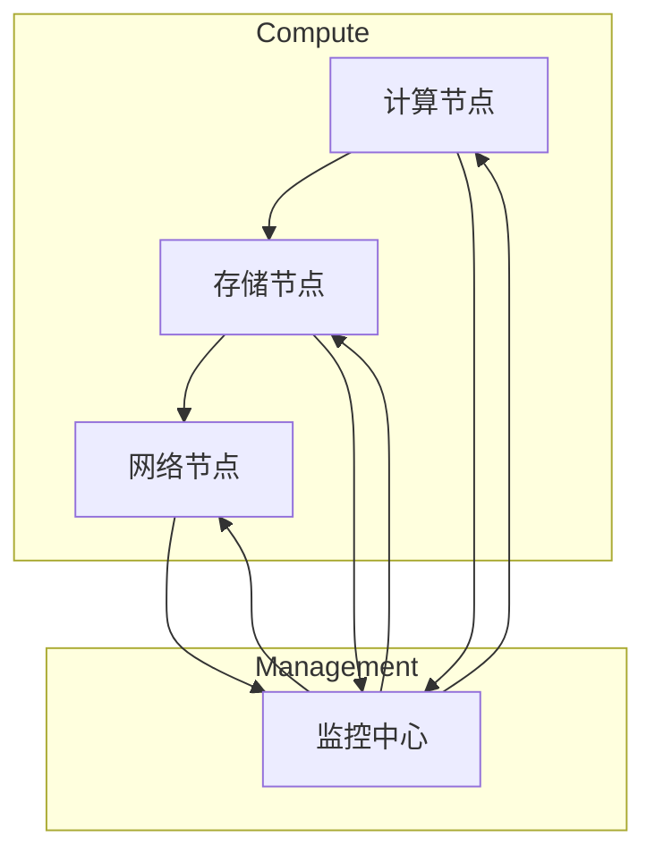

> - AI大模型
> - 数据中心建设
> - 投资策略
> - 技术架构
> - 能耗管理
> - 安全保障
> - 可扩展性

# AI 大模型应用数据中心建设：数据中心投资与建设

随着人工智能技术的飞速发展，AI大模型在自然语言处理、计算机视觉、机器学习等领域取得了显著的成果。这些大模型通常需要大量的计算资源和存储空间，因此，建设能够满足AI大模型应用需求的数据中心变得至关重要。本文将探讨AI大模型应用数据中心的建设，包括投资策略、技术架构、能耗管理、安全保障和可扩展性等方面。

## 1. 背景介绍

### 1.1 AI大模型的兴起

近年来，随着计算能力的提升和大数据的积累，AI大模型如BERT、GPT-3等在多个领域取得了突破性进展。这些大模型通常包含数十亿甚至上千亿个参数，需要大规模的计算资源和存储空间进行训练和推理。

### 1.2 数据中心的重要性

为了满足AI大模型的计算需求，建设高效、稳定的数据中心成为关键。数据中心不仅是AI大模型应用的基础设施，也是企业数字化转型的重要支撑。

### 1.3 数据中心建设面临的挑战

数据中心建设面临着诸多挑战，包括高昂的投资成本、高能耗、数据安全和可扩展性等。

## 2. 核心概念与联系

### 2.1 数据中心架构

以下是一个简单的数据中心架构图：



### 2.2 数据中心关键技术

- **计算节点**：提供高性能计算资源，如GPU、TPU等。
- **存储节点**：提供大容量、高速度的存储资源，如SSD、HDD等。
- **网络节点**：提供高速网络连接，实现数据传输和访问。
- **监控中心**：监控数据中心运行状态，确保稳定运行。

## 3. 核心算法原理 & 具体操作步骤

### 3.1 算法原理概述

数据中心建设涉及多个技术领域，包括：

- **云计算**：提供弹性、可扩展的计算资源。
- **虚拟化技术**：提高资源利用率，实现资源共享。
- **分布式存储**：提供高可用性和高可靠性的数据存储。
- **网络优化**：提高数据传输效率和网络稳定性。

### 3.2 算法步骤详解

数据中心建设的主要步骤如下：

1. **需求分析**：明确数据中心的应用场景、规模和性能要求。
2. **规划设计**：设计数据中心的技术架构、硬件配置和软件部署。
3. **建设实施**：采购硬件设备、搭建网络、部署软件系统。
4. **运维管理**：监控数据中心运行状态，确保稳定运行。
5. **安全保障**：保障数据中心的数据安全和系统安全。

### 3.3 算法优缺点

- **优点**：提高资源利用率，降低运维成本，提高数据安全和系统安全。
- **缺点**：初期投资成本高，能耗较大，技术复杂。

### 3.4 算法应用领域

数据中心广泛应用于以下领域：

- **AI大模型训练和推理**：提供高性能计算资源，满足AI大模型的计算需求。
- **云计算服务**：提供弹性、可扩展的云计算服务。
- **大数据处理**：处理和分析大规模数据，为企业提供数据洞察。
- **企业信息化建设**：为企业的信息化建设提供基础设施支撑。

## 4. 数学模型和公式 & 详细讲解 & 举例说明

### 4.1 数学模型构建

数据中心建设涉及多个数学模型，以下列举几个关键模型：

- **能耗模型**：用于评估数据中心的能耗情况。
- **性能模型**：用于评估数据中心的计算和存储性能。
- **可靠性模型**：用于评估数据中心的可靠性。

### 4.2 公式推导过程

以下以能耗模型为例进行讲解：

$$
E = P \times t
$$

其中，$E$ 表示能耗，$P$ 表示功率，$t$ 表示时间。

### 4.3 案例分析与讲解

以下以一个AI大模型训练场景为例，分析数据中心的建设和运营成本。

**场景**：某公司计划建设一个数据中心，用于训练GPT-3模型。

**需求**：

- 计算节点：100个GPU服务器
- 存储节点：100TB SSD存储
- 网络节点：100Gbps网络带宽

**成本**：

- 硬件成本：500万元
- 运维成本：每年200万元
- 能耗成本：每年300万元

**分析**：

数据中心建设成本较高，但通过合理的设计和运营，可以实现成本效益的最大化。

## 5. 项目实践：代码实例和详细解释说明

### 5.1 开发环境搭建

由于数据中心建设涉及多个技术领域，以下以Python代码为例，展示如何使用虚拟环境管理工具创建虚拟环境。

```python
import virtualenv

# 创建虚拟环境
venv = virtualenv.VirtualEnv('datacenter_env')
venv.create()

# 激活虚拟环境
activate = venv.activate()
```

### 5.2 源代码详细实现

以下以Python代码为例，展示如何使用Pandas库读取和计算数据中心的能耗数据。

```python
import pandas as pd

# 读取能耗数据
data = pd.read_csv('energy_consumption.csv')

# 计算能耗
data['total_energy'] = data['power'] * data['time']
```

### 5.3 代码解读与分析

以上代码首先使用Pandas库读取能耗数据，然后计算每个样本的能耗。

### 5.4 运行结果展示

运行结果将展示每个样本的能耗数据。

## 6. 实际应用场景

### 6.1 AI大模型训练

数据中心为AI大模型训练提供高性能计算资源，如GPU、TPU等，满足模型训练的实时性、高效性要求。

### 6.2 云计算服务

数据中心提供弹性、可扩展的云计算服务，满足企业对计算资源的需求。

### 6.3 大数据处理

数据中心提供大规模数据处理能力，为企业提供数据洞察。

## 7. 工具和资源推荐

### 7.1 学习资源推荐

- 《数据中心设计与管理》
- 《云计算与大数据技术》
- 《AI大模型原理与实现》

### 7.2 开发工具推荐

- Python虚拟环境管理工具：virtualenv、conda
- 数据分析工具：Pandas、NumPy
- 云计算平台：阿里云、腾讯云、华为云

### 7.3 相关论文推荐

- 《Energy-efficient Data Center Design: A Survey》
- 《Cloud Computing: Concepts, Technology & Architecture》
- 《Deep Learning for Natural Language Processing》

## 8. 总结：未来发展趋势与挑战

### 8.1 研究成果总结

数据中心建设在AI大模型应用中发挥着重要作用。通过合理的设计和运营，数据中心可以为AI大模型提供高性能、高可靠、安全稳定的运行环境。

### 8.2 未来发展趋势

- **绿色数据中心**：采用节能技术，降低数据中心能耗。
- **边缘计算**：将计算任务下沉到边缘设备，降低数据中心负载。
- **人工智能辅助设计**：利用AI技术优化数据中心设计和运营。

### 8.3 面临的挑战

- **高昂的投资成本**：数据中心建设需要大量的资金投入。
- **能源消耗**：数据中心能耗巨大，对环境造成一定影响。
- **数据安全**：数据中心需要保障数据安全和系统安全。

### 8.4 研究展望

未来，数据中心建设将朝着绿色、智能、安全的方向发展。通过技术创新和应用优化，数据中心将为AI大模型应用提供更加优质的运行环境。

## 9. 附录：常见问题与解答

**Q1：数据中心建设需要考虑哪些因素？**

A：数据中心建设需要考虑因素包括：需求分析、规划设计、建设实施、运维管理、安全保障等。

**Q2：如何降低数据中心的能耗？**

A：降低数据中心能耗的方法包括：采用节能设备、优化数据中心的散热系统、合理布局设备、使用虚拟化技术等。

**Q3：如何保障数据中心的数据安全？**

A：保障数据中心数据安全的方法包括：采用加密技术、建立访问控制机制、定期进行安全审计等。

**Q4：数据中心建设需要哪些技术支持？**

A：数据中心建设需要的技术支持包括：云计算、虚拟化、大数据、网络安全等。

作者：禅与计算机程序设计艺术 / Zen and the Art of Computer Programming