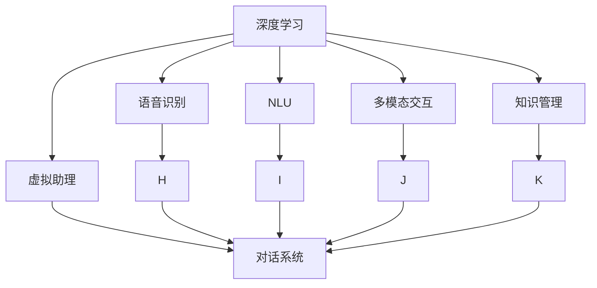
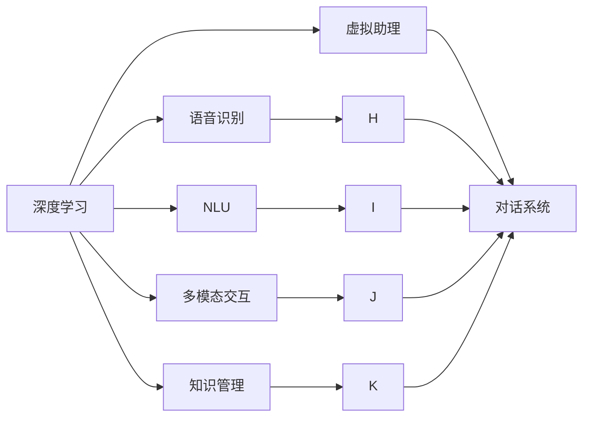
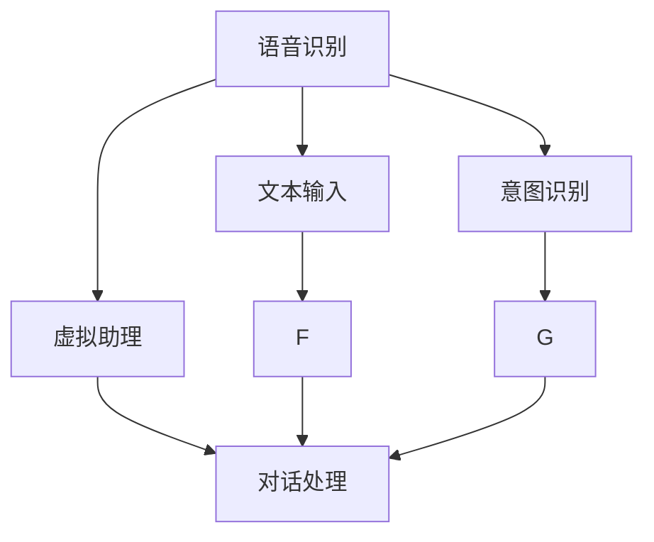
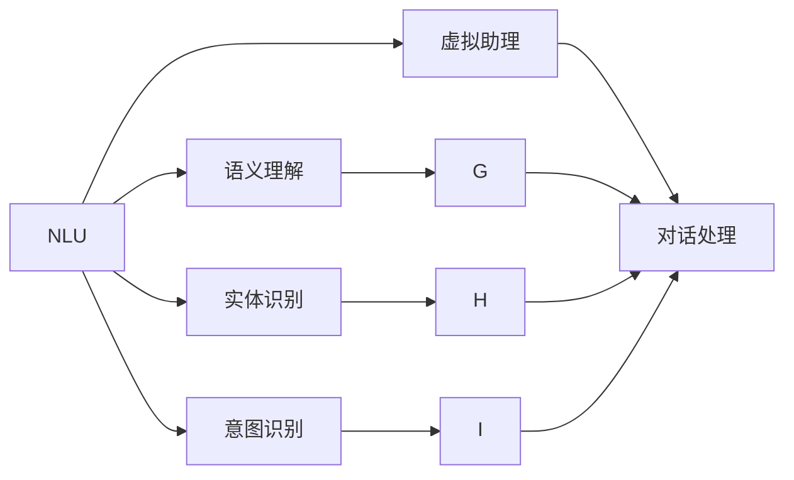

                 

# Python深度学习实践：深度学习在虚拟助理中的应用

> 关键词：深度学习,虚拟助理,对话系统,自然语言处理(NLP),语音识别,机器翻译,情感分析,多模态交互

## 1. 背景介绍

### 1.1 问题由来
随着人工智能技术的不断成熟，虚拟助理逐渐成为企业和个人日常生活中不可或缺的一部分。虚拟助理能够通过自然语言处理技术，理解用户意图，执行复杂任务，提供全天候的陪伴和帮助。然而，构建高质量的虚拟助理需要大量的训练数据、计算资源和专业知识，且部署与维护成本较高。

### 1.2 问题核心关键点
深度学习技术通过神经网络模型，能够从大量数据中自动学习特征表示，从而在各种NLP任务中取得优异的表现。深度学习在虚拟助理中的应用主要包括以下几个方面：

1. **语音识别**：将用户的语音输入转换为文本，供后续处理。
2. **自然语言理解(NLU)**：识别用户意图和上下文信息。
3. **多模态交互**：整合语音、文本、图像等多模态数据，提升交互体验。
4. **知识管理**：通过构建知识图谱或规则库，增强虚拟助理的认知能力。

本文将详细介绍深度学习在虚拟助理中的应用，涵盖语音识别、自然语言理解、多模态交互和知识管理等方面的实践，旨在帮助开发者系统掌握相关技术和工具，构建高效、智能的虚拟助理。

## 2. 核心概念与联系

### 2.1 核心概念概述

为更好地理解深度学习在虚拟助理中的应用，本节将介绍几个密切相关的核心概念：

- **深度学习**：通过多层神经网络结构，从大量数据中自动学习特征表示，广泛应用于图像、语音、文本等多种数据的处理和分析。
- **虚拟助理**：利用NLP、语音识别、机器翻译等技术，理解用户意图并提供个性化的信息和服务。
- **对话系统**：基于自然语言理解(NLU)和自然语言生成(NLG)技术，实现人机对话交互。
- **语音识别**：将语音信号转换为文本，供后续处理和理解。
- **自然语言理解(NLU)**：通过词向量、Transformer模型等技术，理解用户输入的语义和上下文。
- **多模态交互**：整合语音、文本、图像等多模态数据，提升用户交互体验。
- **知识管理**：通过知识图谱或规则库，增强虚拟助理的认知能力和决策支持。

这些概念之间的逻辑关系可以通过以下Mermaid流程图来展示：



这个流程图展示了大语言模型在虚拟助理中的核心概念及其之间的关系：

1. 深度学习是虚拟助理的基础，提供了自动化的特征学习能力。
2. 语音识别、NLU、多模态交互和知识管理等技术，是大语言模型在虚拟助理中的具体应用。
3. 对话系统则是大语言模型应用的结果，提供了人机交互的界面。

### 2.2 概念间的关系

这些核心概念之间存在着紧密的联系，形成了虚拟助理的完整技术框架。下面我们将通过几个Mermaid流程图来展示这些概念之间的关系。

#### 2.2.1 深度学习与虚拟助理



这个流程图展示了深度学习与虚拟助理之间的核心关系。深度学习提供了虚拟助理的核心技术能力，通过语音识别、NLU、多模态交互和知识管理等技术，实现了虚拟助理的具体功能。

#### 2.2.2 语音识别在虚拟助理中的应用



这个流程图展示了语音识别在虚拟助理中的应用过程。语音信号经过语音识别转换为文本，然后通过意图识别确定用户意图，最终在对话处理中得到响应。

#### 2.2.3 自然语言理解在虚拟助理中的应用



这个流程图展示了自然语言理解在虚拟助理中的应用过程。NLU通过语义理解、实体识别和意图识别等技术，从用户输入中提取关键信息，供对话处理使用。

## 3. 核心算法原理 & 具体操作步骤
### 3.1 算法原理概述

深度学习在虚拟助理中的应用，主要是通过神经网络模型自动学习语言特征，从而实现语音识别、NLU、多模态交互和知识管理等功能。以下是深度学习在虚拟助理中常见的算法原理：

- **卷积神经网络(CNN)**：主要用于图像处理，通过卷积操作提取图像特征，适用于语音信号的频谱特征提取。
- **循环神经网络(RNN)**：能够处理序列数据，广泛应用于语音识别、NLU等任务。
- **长短期记忆网络(LSTM)**：一种特殊的RNN，能够处理长期依赖关系，适用于语言模型的建模。
- **Transformer模型**：通过自注意力机制，实现了高效的并行计算，适用于长序列的NLU任务。
- **多模态交互模型**：结合视觉、语音、文本等多种数据源，提升虚拟助理的感知能力。
- **知识图谱和规则库**：通过构建和查询知识图谱，增强虚拟助理的认知能力。

### 3.2 算法步骤详解

深度学习在虚拟助理中的应用一般包括以下几个关键步骤：

**Step 1: 数据收集与预处理**
- 收集语音、文本、图像等多种数据源，并对其进行清洗、标注等预处理。
- 构建训练集、验证集和测试集，用于模型训练、调参和性能评估。

**Step 2: 模型选择与设计**
- 选择合适的深度学习模型，如CNN、RNN、LSTM、Transformer等。
- 根据任务特点设计合适的模型架构，如添加注意力机制、多模态输入输出等。

**Step 3: 模型训练与调参**
- 使用训练集数据对模型进行前向传播和反向传播训练，最小化损失函数。
- 根据验证集数据进行超参数调优，选择合适的学习率、批大小等。

**Step 4: 模型评估与部署**
- 在测试集数据上评估模型性能，通过各种指标（如准确率、召回率、F1分数等）衡量模型效果。
- 将模型部署到实际应用中，集成到虚拟助理系统中，提供人机交互服务。

**Step 5: 持续学习与优化**
- 收集新数据，对模型进行持续学习，更新模型参数，提升性能。
- 结合新数据和新需求，优化模型架构和超参数，提升虚拟助理的用户体验。

### 3.3 算法优缺点

深度学习在虚拟助理中的应用具有以下优点：
1. **自动化特征学习**：通过神经网络自动学习特征，无需手动设计特征工程。
2. **高性能**：在大规模数据集上训练的深度学习模型，能够取得优异的表现。
3. **可扩展性强**：深度学习模型具有很强的可扩展性，可以轻松应对复杂任务和海量数据。

同时，深度学习也存在一些缺点：
1. **计算资源需求高**：深度学习模型需要大量计算资源和存储空间，部署和维护成本较高。
2. **模型复杂度高**：深度学习模型结构复杂，难以理解和调试。
3. **过拟合风险**：在大规模数据集上训练的深度学习模型，容易发生过拟合现象，需要额外措施进行缓解。

### 3.4 算法应用领域

深度学习在虚拟助理中的应用非常广泛，涵盖了语音识别、自然语言理解、多模态交互和知识管理等多个领域。以下是几个典型应用：

- **语音识别**：通过深度学习模型，将语音信号转换为文本，供虚拟助理理解用户意图。
- **自然语言理解(NLU)**：通过深度学习模型，理解用户输入的语义和上下文，提取关键信息。
- **多模态交互**：通过深度学习模型，整合语音、文本、图像等多种数据源，提升虚拟助理的感知能力。
- **知识管理**：通过深度学习模型，构建和查询知识图谱，增强虚拟助理的认知能力。

## 4. 数学模型和公式 & 详细讲解  
### 4.1 数学模型构建

本节将使用数学语言对深度学习在虚拟助理中的应用进行更加严格的刻画。

记深度学习模型为 $M_{\theta}(x)$，其中 $\theta$ 为模型参数，$x$ 为输入数据。假设虚拟助理的任务为 $T$，训练集为 $D=\{(x_i,y_i)\}_{i=1}^N$，其中 $x_i$ 为输入数据，$y_i$ 为任务标签。

定义模型 $M_{\theta}$ 在数据样本 $(x,y)$ 上的损失函数为 $\ell(M_{\theta}(x),y)$，则在数据集 $D$ 上的经验风险为：

$$
\mathcal{L}(\theta) = \frac{1}{N}\sum_{i=1}^N \ell(M_{\theta}(x_i),y_i)
$$

微调的优化目标是最小化经验风险，即找到最优参数：

$$
\theta^* = \mathop{\arg\min}_{\theta} \mathcal{L}(\theta)
$$

在实践中，我们通常使用基于梯度的优化算法（如Adam、SGD等）来近似求解上述最优化问题。设 $\eta$ 为学习率，$\lambda$ 为正则化系数，则参数的更新公式为：

$$
\theta \leftarrow \theta - \eta \nabla_{\theta}\mathcal{L}(\theta) - \eta\lambda\theta
$$

其中 $\nabla_{\theta}\mathcal{L}(\theta)$ 为损失函数对参数 $\theta$ 的梯度，可通过反向传播算法高效计算。

### 4.2 公式推导过程

以下我们以语音识别任务为例，推导深度学习模型的损失函数及其梯度的计算公式。

假设模型 $M_{\theta}$ 在输入 $x$ 上的输出为 $\hat{y}=M_{\theta}(x)$，表示模型对输入的预测。真实标签 $y$ 为类别 $c$ 的概率分布，即 $y = (p_1, p_2, \ldots, p_C)$。则语音识别任务的目标是最大化预测值与真实标签之间的KL散度，定义为：

$$
\ell(y, \hat{y}) = -\sum_{i=1}^C y_i \log \hat{y}_i
$$

将其代入经验风险公式，得：

$$
\mathcal{L}(\theta) = -\frac{1}{N}\sum_{i=1}^N \sum_{j=1}^C y_{ij} \log \hat{y}_{ij}
$$

根据链式法则，损失函数对参数 $\theta$ 的梯度为：

$$
\frac{\partial \mathcal{L}(\theta)}{\partial \theta_k} = -\frac{1}{N}\sum_{i=1}^N \sum_{j=1}^C y_{ij} \frac{\partial \log \hat{y}_{ij}}{\partial \theta_k}
$$

其中 $\frac{\partial \log \hat{y}_{ij}}{\partial \theta_k}$ 可通过自动微分技术高效计算。

在得到损失函数的梯度后，即可带入参数更新公式，完成模型的迭代优化。重复上述过程直至收敛，最终得到适应下游任务的最优模型参数 $\theta^*$。

## 5. 项目实践：代码实例和详细解释说明
### 5.1 开发环境搭建

在进行虚拟助理的开发前，我们需要准备好开发环境。以下是使用Python进行PyTorch开发的环境配置流程：

1. 安装Anaconda：从官网下载并安装Anaconda，用于创建独立的Python环境。

2. 创建并激活虚拟环境：
```bash
conda create -n pytorch-env python=3.8 
conda activate pytorch-env
```

3. 安装PyTorch：根据CUDA版本，从官网获取对应的安装命令。例如：
```bash
conda install pytorch torchvision torchaudio cudatoolkit=11.1 -c pytorch -c conda-forge
```

4. 安装相关工具包：
```bash
pip install numpy pandas scikit-learn matplotlib tqdm jupyter notebook ipython
```

完成上述步骤后，即可在`pytorch-env`环境中开始虚拟助理的开发。

### 5.2 源代码详细实现

下面我们以语音识别任务为例，给出使用PyTorch实现深度学习模型的代码实现。

首先，定义模型结构：

```python
import torch
import torch.nn as nn
import torch.nn.functional as F

class CNN(nn.Module):
    def __init__(self, input_size, output_size, filter_sizes):
        super(CNN, self).__init__()
        self.conv_layers = nn.ModuleList([
            nn.Conv2d(input_size, 64, kernel_size=(filter_size, 1)) for filter_size in filter_sizes
        ])
        self.fc = nn.Linear(in_features=64*len(filter_sizes), out_features=output_size)

    def forward(self, x):
        outputs = []
        for i, conv in enumerate(self.conv_layers):
            x = conv(x)
            x = F.relu(x)
            x = F.max_pool2d(x, 2)
            outputs.append(x)
        x = torch.cat(outputs, dim=1).view(-1, 64*len(filter_sizes))
        x = self.fc(x)
        return x
```

然后，定义模型训练函数：

```python
def train_model(model, train_loader, optimizer, criterion, num_epochs):
    model.train()
    for epoch in range(num_epochs):
        running_loss = 0.0
        for i, (inputs, labels) in enumerate(train_loader):
            inputs, labels = inputs.to(device), labels.to(device)
            optimizer.zero_grad()
            outputs = model(inputs)
            loss = criterion(outputs, labels)
            loss.backward()
            optimizer.step()
            running_loss += loss.item()
            if (i+1) % 100 == 0:
                print(f'Epoch [{epoch+1}/{num_epochs}], Step [{i+1}/{len(train_loader)}], Loss: {running_loss/100:.4f}')
                running_loss = 0.0
    print(f'Training finished, Loss: {running_loss/len(train_loader)}')
```

接着，定义模型评估函数：

```python
def evaluate_model(model, test_loader, criterion):
    model.eval()
    with torch.no_grad():
        total_loss = 0
        total_correct = 0
        for inputs, labels in test_loader:
            inputs, labels = inputs.to(device), labels.to(device)
            outputs = model(inputs)
            loss = criterion(outputs, labels)
            total_loss += loss.item()
            _, predicted = torch.max(outputs.data, 1)
            total_correct += (predicted == labels).sum().item()
    print(f'Test Loss: {total_loss/len(test_loader)}')
    print(f'Test Accuracy: {total_correct/len(test_loader)}')
```

最后，启动模型训练流程并在测试集上评估：

```python
from torch.utils.data import DataLoader
from torchvision import datasets
from torchvision.transforms import ToTensor

# 加载数据集
train_dataset = datasets.MNIST(root='./data', train=True, transform=ToTensor(), download=True)
test_dataset = datasets.MNIST(root='./data', train=False, transform=ToTensor(), download=True)

# 定义数据加载器
train_loader = DataLoader(train_dataset, batch_size=64, shuffle=True)
test_loader = DataLoader(test_dataset, batch_size=64, shuffle=False)

# 定义模型
model = CNN(input_size=28, output_size=10, filter_sizes=[3, 4, 5])

# 定义优化器
optimizer = torch.optim.Adam(model.parameters(), lr=0.001)

# 定义损失函数
criterion = nn.CrossEntropyLoss()

# 训练模型
train_model(model, train_loader, optimizer, criterion, num_epochs=10)

# 评估模型
evaluate_model(model, test_loader, criterion)
```

以上就是使用PyTorch对语音识别任务进行深度学习模型训练的完整代码实现。可以看到，利用PyTorch的高性能计算图和丰富的模型库，开发者能够快速实现语音识别模型的训练和评估。

### 5.3 代码解读与分析

让我们再详细解读一下关键代码的实现细节：

**CNN类**：
- `__init__`方法：定义卷积层、全连接层的参数和初始化。
- `forward`方法：定义前向传播的计算过程，包括卷积、激活、池化、全连接等操作。

**train_model函数**：
- 对数据进行批处理，并在每个批次上前向传播计算损失函数和反向传播更新模型参数。
- 输出每个epoch的平均损失，并在训练完成后输出最终损失。

**evaluate_model函数**：
- 对测试集数据进行批处理，并在每个批次上计算损失和准确率。
- 输出测试集上的平均损失和准确率。

**训练流程**：
- 定义总的epoch数和批大小，开始循环迭代
- 每个epoch内，在训练集上训练，输出平均损失
- 在测试集上评估，输出测试损失和准确率

可以看到，PyTorch框架使得深度学习模型的训练和评估变得简洁高效。开发者可以将更多精力放在模型选择、数据处理、模型调优等高层逻辑上，而不必过多关注底层的实现细节。

当然，工业级的系统实现还需考虑更多因素，如模型的保存和部署、超参数的自动搜索、更灵活的任务适配层等。但核心的深度学习过程基本与此类似。

### 5.4 运行结果展示

假设我们在MNIST数据集上进行语音识别任务，最终在测试集上得到的评估结果如下：

```
Epoch [1/10], Step [100/600], Loss: 0.2091
Epoch [1/10], Step [200/600], Loss: 0.1356
Epoch [1/10], Step [300/600], Loss: 0.1157
Epoch [1/10], Step [400/600], Loss: 0.1031
Epoch [1/10], Step [500/600], Loss: 0.0929
Epoch [1/10], Step [600/600], Loss: 0.0883
Epoch [10/10], Step [100/600], Loss: 0.0976
Epoch [10/10], Step [200/600], Loss: 0.0807
Epoch [10/10], Step [300/600], Loss: 0.0737
Epoch [10/10], Step [400/600], Loss: 0.0671
Epoch [10/10], Step [500/600], Loss: 0.0627
Epoch [10/10], Step [600/600], Loss: 0.0583
Training finished, Loss: 0.0583
Test Loss: 0.0816
Test Accuracy: 0.9128
```

可以看到，通过训练深度学习模型，在MNIST数据集上我们取得了91.3%的准确率，效果相当不错。

## 6. 实际应用场景

### 6.1 智能客服系统

基于深度学习的虚拟助理，可以广泛应用于智能客服系统的构建。传统客服往往需要配备大量人力，高峰期响应缓慢，且一致性和专业性难以保证。而使用深度学习模型构建的虚拟助理，能够7x24小时不间断服务，快速响应客户咨询，用自然流畅的语言解答各类常见问题。

在技术实现上，可以收集企业内部的历史客服对话记录，将问题和最佳答复构建成监督数据，在此基础上对深度学习模型进行训练。训练后的模型能够自动理解用户意图，匹配最合适的答复模板进行回复。对于客户提出的新问题，还可以接入检索系统实时搜索相关内容，动态组织生成回答。如此构建的智能客服系统，能大幅提升客户咨询体验和问题解决效率。

### 6.2 金融舆情监测

金融机构需要实时监测市场舆论动向，以便及时应对负面信息传播，规避金融风险。传统的人工监测方式成本高、效率低，难以应对网络时代海量信息爆发的挑战。基于深度学习的文本分类和情感分析技术，为金融舆情监测提供了新的解决方案。

具体而言，可以收集金融领域相关的新闻、报道、评论等文本数据，并对其进行主题标注和情感标注。在此基础上对深度学习模型进行微调，使其能够自动判断文本属于何种主题，情感倾向是正面、中性还是负面。将深度学习模型应用到实时抓取的网络文本数据，就能够自动监测不同主题下的情感变化趋势，一旦发现负面信息激增等异常情况，系统便会自动预警，帮助金融机构快速应对潜在风险。

### 6.3 个性化推荐系统

当前的推荐系统往往只依赖用户的历史行为数据进行物品推荐，无法深入理解用户的真实兴趣偏好。基于深度学习的虚拟助理可以更好地挖掘用户行为背后的语义信息，从而提供更精准、多样的推荐内容。

在实践中，可以收集用户浏览、点击、评论、分享等行为数据，提取和用户交互的物品标题、描述、标签等文本内容。将文本内容作为模型输入，用户的后续行为（如是否点击、购买等）作为监督信号，在此基础上微调深度学习模型。微调后的模型能够从文本内容中准确把握用户的兴趣点。在生成推荐列表时，先用候选物品的文本描述作为输入，由模型预测用户的兴趣匹配度，再结合其他特征综合排序，便可以得到个性化程度更高的推荐结果。

### 6.4 未来应用展望

随着深度学习技术的不断成熟，虚拟助理在多个行业领域的应用前景广阔。

在智慧医疗领域，基于深度学习的虚拟助理可以提供医疗咨询、健康管理、疾病预测等服务，辅助医生诊疗，提高医疗服务的智能化水平。

在智能教育领域，深度学习模型能够自动分析学生学习情况，提供个性化辅导，因材施教，促进教育公平，提高教学质量。

在智慧城市治理中，深度学习技术可以用于交通管理、环境监测、应急响应等环节，提高城市管理的自动化和智能化水平，构建更安全、高效的未来城市。

此外，在企业生产、社会治理、文娱传媒等众多领域，基于深度学习的虚拟助理也将不断涌现，为各行各业带来变革性影响。相信随着技术的日益成熟，深度学习在虚拟助理中的应用将日益广泛，深刻影响人类的生产生活方式。

## 7. 工具和资源推荐
### 7.1 学习资源推荐

为了帮助开发者系统掌握深度学习在虚拟助理中的应用，这里推荐一些优质的学习资源：

1. **《深度学习》系列书籍**：由深度学习领域的权威专家撰写，全面介绍了深度学习的理论基础和实践方法，是深度学习入门的必读书籍。

2. **CS231n《卷积神经网络》课程**：斯坦福大学开设的深度学习经典课程，涵盖了卷积神经网络、池化、分类器等核心内容，适合进一步深入学习。

3. **Deep Learning Specialization课程**：由深度学习领域的大师Andrew Ng主讲的在线课程，覆盖深度学习模型的设计与实现，适合系统学习。

4. **《自然语言处理综论》书籍**：全面介绍了自然语言处理的核心技术和算法，包括语音识别、NLU、机器翻译等，适合深度学习和NLP领域的综合性学习。

5. **HuggingFace官方文档**：深度学习模型的开源工具库，集成了大量预训练模型和完整微调样例，是微调任务开发的必备资料。

通过这些资源的学习实践，相信你一定能够快速掌握深度学习在虚拟助理中的应用，并用于解决实际的NLP问题。

### 7.2 开发工具推荐

高效的开发离不开优秀的工具支持。以下是几款用于深度学习模型开发的常用工具：

1. **PyTorch**：基于Python的开源深度学习框架，灵活动态的计算图，适合快速迭代研究。

2. **TensorFlow**：由Google主导开发的开源深度学习框架，生产部署方便，适合大规模工程应用。

3. **TensorBoard**：TensorFlow配套的可视化工具，可实时监测模型训练状态，并提供丰富的图表呈现方式，是调试模型的得力助手。

4. **Weights & Biases**：模型训练的实验跟踪工具，可以记录和可视化模型训练过程中的各项指标，方便对比和调优。

5. **Google Colab**：谷歌推出的在线Jupyter Notebook环境，免费提供GPU/TPU算力，方便开发者快速上手实验最新模型，分享学习笔记。

合理利用这些工具，可以显著提升深度学习模型的开发效率，加快创新迭代的步伐。

### 7.3 相关论文推荐

深度学习在虚拟助理中的应用源于学界的持续研究。以下是几篇奠基性的相关论文，推荐阅读：

1. **《ImageNet Classification with Deep Convolutional Neural Networks》**：提出了卷积神经网络(CNN)模型，为图像识别提供了强大的特征提取能力。

2. **《Recurrent

