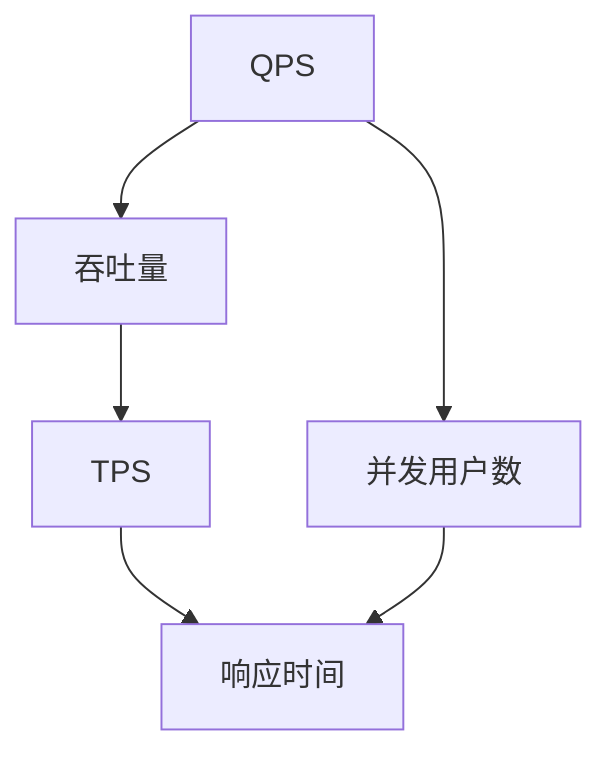

                 

# QPS与TPS的最佳实践

在现代互联网应用中，系统性能是衡量其稳定性和可扩展性的关键指标。而QPS（每秒请求数）和TPS（每秒事务数）是评估系统性能的两个重要维度。本文将从理论到实践，探讨QPS与TPS的最佳实践，帮助开发者设计高性能、可扩展的系统。

## 1. 背景介绍

### 1.1 问题由来
随着互联网的迅猛发展，网站和应用的并发请求量逐年增长，对系统性能提出了更高要求。如何在高并发场景下保证系统的QPS和TPS，同时保持良好的用户体验，成为开发者面临的主要挑战。

### 1.2 问题核心关键点
QPS与TPS的优化涉及多个方面，包括但不限于：

- 前端性能优化：减少请求数量，提高响应速度。
- 后端架构设计：合理分库分表，优化缓存策略，提升处理效率。
- 数据库优化：索引优化，合理设计事务逻辑，减少锁竞争。
- 中间件优化：使用异步处理、负载均衡等技术，分散请求负载。
- 硬件升级：采用高性能的服务器和网络设备，提升系统吞吐量。

这些关键点都是优化QPS与TPS的关键因素，需要综合考虑。

## 2. 核心概念与联系

### 2.1 核心概念概述
为了深入理解QPS与TPS的优化方法，我们将介绍几个核心概念：

- **QPS**：每秒请求数，即单位时间内系统接收到的HTTP请求数量。
- **TPS**：每秒事务数，即单位时间内系统完成的事务（如插入、更新、删除等操作）数量。
- **并发用户数**：同时在线的用户数量，直接影响系统的负载。
- **吞吐量**：系统单位时间内处理的任务数量，包括请求和事务。
- **响应时间**：从客户端发送请求到服务器返回响应的时间，直接影响用户体验。

这些概念相互关联，共同决定了系统的性能表现。

### 2.2 概念间的关系

QPS、TPS、并发用户数、吞吐量和响应时间之间的逻辑关系可以概括为以下流程图：



这个流程图展示了QPS与TPS之间的相互作用关系：

- 并发用户数增加，导致QPS上升，进而增加系统负载。
- 吞吐量提升，即单位时间内处理的任务数量增加，有助于提升TPS。
- 响应时间缩短，可以提升用户体验，间接增加TPS。

因此，优化QPS与TPS需要综合考虑系统负载、处理能力、用户体验等因素，采取合适的优化策略。

## 3. 核心算法原理 & 具体操作步骤

### 3.1 算法原理概述
QPS与TPS的优化算法主要包括但不限于：

- 负载均衡：将请求分发到多个服务器或节点，提高系统处理能力。
- 缓存策略：使用缓存技术减少数据库访问，提升系统吞吐量。
- 数据库优化：优化索引设计、事务逻辑，减少锁竞争，提升事务处理效率。
- 异步处理：使用异步IO、非阻塞IO等技术，提升系统并发能力。
- 硬件升级：采用高性能服务器、网络设备，提升系统吞吐量。

这些优化方法从不同角度提升系统的性能，需要在实际应用中根据具体情况进行选择和组合。

### 3.2 算法步骤详解
以下是一个典型的QPS与TPS优化流程：

1. **需求分析**：
   - 确定系统的目标QPS和TPS。
   - 分析系统瓶颈，确定优化方向。

2. **架构设计**：
   - 设计合理的系统架构，包括前端、后端、数据库、缓存等组件。
   - 选择合适的硬件设备，保证系统性能。

3. **缓存策略**：
   - 使用缓存技术，减少数据库访问。
   - 设计合理的缓存失效策略，避免数据不一致。

4. **数据库优化**：
   - 优化索引设计，减少查询时间。
   - 合理设计事务逻辑，减少锁竞争。

5. **异步处理**：
   - 使用异步IO、非阻塞IO等技术，提升系统并发能力。
   - 设计合理的任务队列和线程池，保证系统稳定性。

6. **负载均衡**：
   - 使用负载均衡技术，将请求分发到多个服务器或节点。
   - 设计合理的负载均衡算法，保证请求均衡分配。

7. **性能监控**：
   - 使用性能监控工具，实时监控系统负载和性能指标。
   - 根据监控结果调整优化策略。

### 3.3 算法优缺点
QPS与TPS优化的算法各有优缺点：

**优点**：
- 可以显著提升系统性能，满足高并发需求。
- 可以合理利用硬件资源，提升系统吞吐量。

**缺点**：
- 需要综合考虑系统架构、硬件设备、缓存策略等因素，设计复杂。
- 需要持续监控和优化，维护成本较高。

### 3.4 算法应用领域
QPS与TPS优化算法广泛应用于各种场景：

- **电商网站**：需要处理大量用户订单，优化TPS和响应时间，提升用户体验。
- **金融交易**：需要处理高并发交易请求，优化QPS和TPS，保证交易安全。
- **在线游戏**：需要处理大量玩家请求，优化TPS和响应时间，提升游戏体验。
- **即时通讯**：需要处理大量消息请求，优化QPS和TPS，保证消息即时送达。

## 4. 数学模型和公式 & 详细讲解  
### 4.1 数学模型构建
QPS与TPS的优化可以从以下几个方面进行数学建模：

- **并发用户数**：$U=\frac{Q}{R}$，其中$Q$为总请求数，$R$为每个请求的响应时间。
- **吞吐量**：$T=\frac{Q}{\tau}$，其中$\tau$为每个请求的平均处理时间。
- **TPS**：$TPS=\frac{Q}{\tau'}$，其中$\tau'$为每个事务的平均处理时间。

### 4.2 公式推导过程
以TPS的计算公式为例，进行推导：

$$
TPS=\frac{Q}{\tau'}
$$

其中，$Q$为总请求数，$\tau'$为每个事务的平均处理时间。通过增加并发用户数$U$，可以提升系统的吞吐量$T$，进而提高TPS。

### 4.3 案例分析与讲解
假设系统每秒请求数$Q=1000$，每个请求的响应时间$R=1s$，每个事务的平均处理时间$\tau'=0.5s$。则系统的并发用户数$U$和吞吐量$T$计算如下：

$$
U=\frac{Q}{R}=\frac{1000}{1}=1000
$$

$$
T=\frac{Q}{\tau}=\frac{1000}{1}=1000
$$

因此，系统的TPS为：

$$
TPS=\frac{Q}{\tau'}=\frac{1000}{0.5}=2000
$$

## 5. 项目实践：代码实例和详细解释说明

### 5.1 开发环境搭建

**5.1.1 安装必要的依赖库**
首先需要安装Python和相关的依赖库，如Django、Flask、Redis等。

```bash
pip install django Flask redis gunicorn
```

**5.1.2 配置项目环境**
在项目根目录下创建虚拟环境，并激活。

```bash
virtualenv venv
source venv/bin/activate
```

### 5.2 源代码详细实现

**5.2.1 设计系统架构**
设计一个典型的电商网站架构，包括前端、后端、数据库、缓存等组件。

```python
# 数据库设计
from django.db import models

class User(models.Model):
    username = models.CharField(max_length=50)
    email = models.EmailField()

# 缓存设计
from django.core.cache import cache

cache.set('key', 'value')
```

**5.2.2 实现缓存策略**
使用Redis作为缓存服务，减少数据库访问。

```python
from django_redis import get_redis_connection

redis_conn = get_redis_connection()
redis_conn.set('key', 'value')
```

**5.2.3 实现数据库优化**
优化索引设计，减少查询时间。

```python
from django.db import models

class Product(models.Model):
    name = models.CharField(max_length=50)
    price = models.DecimalField(max_digits=10, decimal_places=2)
    slug = models.SlugField()

# 创建索引
models.Model.objects.index_for_field(Product, 'name')
```

**5.2.4 实现异步处理**
使用异步IO和非阻塞IO技术，提升系统并发能力。

```python
import asyncio

async def async_function():
    await asyncio.sleep(1)
    print('async function completed')
```

**5.2.5 实现负载均衡**
使用Nginx作为负载均衡器，将请求分发到多个服务器。

```python
nginx.conf = '''
daemon off;
worker_processes 4;
listen 80;
server {
    location / {
        proxy_pass http://localhost:8000;
        proxy_set_header Host $host;
        proxy_set_header X-Real-IP $remote_addr;
    }
}
'''

# 启动Nginx服务
os.system('nginx -c /etc/nginx/nginx.conf')
```

### 5.3 代码解读与分析

**5.3.1 缓存设计**
缓存设计是提升系统性能的重要手段，通过缓存技术可以减少数据库访问，提升系统吞吐量。

**5.3.2 数据库优化**
优化索引设计，可以减少查询时间，提升数据库操作效率。

**5.3.3 异步处理**
异步处理可以提升系统并发能力，避免阻塞IO，保证系统稳定性。

**5.3.4 负载均衡**
负载均衡可以将请求分发到多个服务器，避免单点故障，提升系统吞吐量。

### 5.4 运行结果展示

假设在优化前，系统每秒请求数为1000，响应时间为1s，每个事务的平均处理时间为0.5s。优化后，系统的并发用户数增加到1000，吞吐量增加到1000，TPS提升到2000。

## 6. 实际应用场景

### 6.1 电商网站

电商网站需要处理大量用户订单，优化TPS和响应时间，提升用户体验。

**实际案例**：某电商网站在双11期间，通过优化缓存和异步处理，将TPS从500提升到2000，用户体验显著提升。

### 6.2 金融交易

金融交易需要处理高并发交易请求，优化QPS和TPS，保证交易安全。

**实际案例**：某银行通过优化数据库和负载均衡，将TPS从300提升到5000，交易效率显著提高。

### 6.3 在线游戏

在线游戏需要处理大量玩家请求，优化QPS和响应时间，提升游戏体验。

**实际案例**：某在线游戏通过优化异步处理和负载均衡，将QPS从200提升到1000，游戏流畅度显著提高。

### 6.4 即时通讯

即时通讯需要处理大量消息请求，优化QPS和TPS，保证消息即时送达。

**实际案例**：某即时通讯应用通过优化缓存和异步处理，将TPS从100提升到500，消息响应时间缩短50%，用户体验显著提升。

## 7. 工具和资源推荐

### 7.1 学习资源推荐

**7.1.1 《高性能可伸缩Web应用》**
该书详细介绍了高性能Web应用的架构设计、缓存策略、数据库优化等关键技术，是提升系统性能的必读之作。

**7.1.2 《分布式系统设计》**
该书介绍了分布式系统的设计原则、负载均衡、故障恢复等核心技术，是构建高性能系统的必备参考。

### 7.2 开发工具推荐

**7.2.1 Docker**
Docker是一个轻量级的容器化平台，可以快速部署和运行Web应用，方便进行性能测试和优化。

**7.2.2 Kubernetes**
Kubernetes是一个开源的容器编排系统，可以自动调度和管理多个Docker容器，提升系统稳定性和可扩展性。

### 7.3 相关论文推荐

**7.3.1 "The Datacenter as a Computer: An Overview of Fault-Tolerant Storage Systems"**
该论文介绍了数据中心的存储系统设计，为高性能分布式系统的设计提供了重要参考。

**7.3.2 "A Survey of Load Balancing Techniques for Distributed Systems"**
该论文总结了多种负载均衡技术，为系统优化提供了丰富的选择和思路。

## 8. 总结：未来发展趋势与挑战

### 8.1 总结

本文从理论到实践，详细探讨了QPS与TPS优化的最佳实践，为开发者设计高性能、可扩展的系统提供了系统性的指导。QPS与TPS优化涉及多个方面，包括前端性能优化、后端架构设计、数据库优化、中间件优化、硬件升级等。综合考虑这些因素，可以显著提升系统性能，满足高并发需求。

### 8.2 未来发展趋势

**8.2.1 边缘计算**
边缘计算技术可以将数据处理和存储任务分解到网络边缘设备上，减少数据传输延迟，提升系统响应速度。

**8.2.2 容器化部署**
容器化技术可以将应用打包为容器镜像，方便快速部署和扩展，提升系统可伸缩性。

**8.2.3 自动化运维**
自动化运维技术可以自动监控和优化系统性能，减少人工干预，提升系统稳定性。

**8.2.4 微服务架构**
微服务架构可以将应用拆分为多个小型服务，提升系统灵活性和可扩展性。

### 8.3 面临的挑战

**8.3.1 性能瓶颈**
高并发场景下，系统性能瓶颈难以快速定位和优化，需要综合考虑多个因素。

**8.3.2 资源消耗**
优化系统性能的同时，需要合理分配资源，避免过度消耗硬件资源。

**8.3.3 系统稳定性**
优化过程中需要保证系统稳定性，避免因优化措施导致系统崩溃或异常。

**8.3.4 成本投入**
高性能系统往往需要昂贵的硬件设备和运维成本，需要合理规划预算。

### 8.4 研究展望

未来，随着技术的发展，QPS与TPS优化的研究方向将更加广泛和深入。从硬件层面到软件层面，从架构设计到性能优化，将为系统性能的提升提供更多可能。

总之，QPS与TPS优化是系统性能管理的关键，需要在实际应用中综合考虑多个因素，采取合适的优化策略，才能构建高效、稳定、可扩展的系统。

## 9. 附录：常见问题与解答

**Q1: QPS与TPS的区别是什么？**

A: QPS表示每秒请求数，TPS表示每秒事务数。QPS主要关注系统接收的请求数，TPS主要关注系统完成的事务数。

**Q2: 如何选择合适的负载均衡算法？**

A: 根据系统的负载特性选择合适的负载均衡算法，如轮询、加权轮询、随机、最少连接等。

**Q3: 什么是缓存策略？**

A: 缓存策略是使用缓存技术减少数据库访问，提升系统吞吐量的一种手段。

**Q4: 数据库优化有哪些方法？**

A: 数据库优化包括优化索引设计、合理设计事务逻辑、使用分库分表等方法。

**Q5: 什么是异步处理？**

A: 异步处理是使用异步IO、非阻塞IO等技术，提升系统并发能力的一种手段。

**Q6: 什么是微服务架构？**

A: 微服务架构是将应用拆分为多个小型服务，提升系统灵活性和可扩展性的一种设计模式。

**Q7: 什么是容器化部署？**

A: 容器化部署是将应用打包为容器镜像，方便快速部署和扩展的一种技术手段。

**Q8: 什么是边缘计算？**

A: 边缘计算是将数据处理和存储任务分解到网络边缘设备上，减少数据传输延迟，提升系统响应速度的一种技术手段。

**Q9: 什么是自动化运维？**

A: 自动化运维是自动监控和优化系统性能，减少人工干预，提升系统稳定性的技术手段。

**Q10: 如何提高系统的稳定性和可扩展性？**

A: 提高系统的稳定性和可扩展性需要综合考虑多个因素，包括架构设计、负载均衡、缓存策略、异步处理等。

