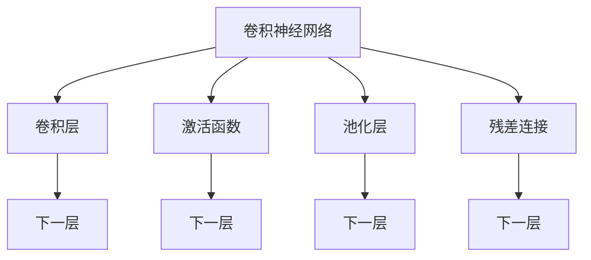
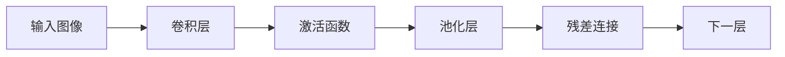
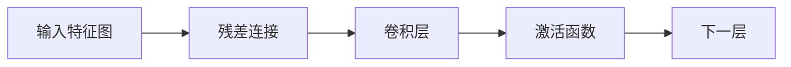
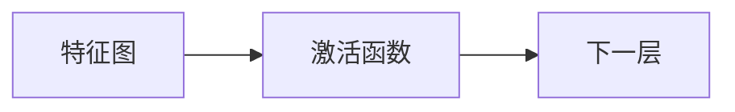
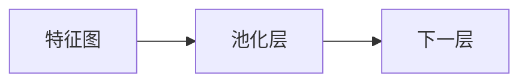
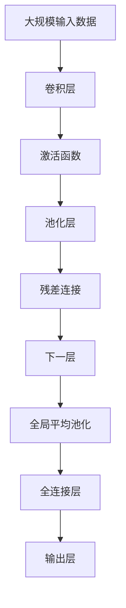

                 

# ResNet原理与代码实例讲解

> 关键词：ResNet,深度学习,卷积神经网络,残差连接,模型优化

## 1. 背景介绍

### 1.1 问题由来
深度神经网络（DNNs）在图像分类、目标检测等计算机视觉任务上取得了巨大的成功。然而，随着网络层数的增加，梯度消失和梯度爆炸等问题开始凸显，使得深度学习模型难以训练。为解决这一问题，残差网络（Residual Network, ResNet）被提出，成为深度神经网络发展的里程碑。ResNet通过在网络中加入残差连接，保证了梯度可以更好地向后传播，避免了上述问题，从而可以训练更深的神经网络。

### 1.2 问题核心关键点
ResNet的核心思想是引入残差连接，使得信息可以更直接地从输入层传播到输出层，避免中间层的梯度消失。这一思想不仅适用于卷积神经网络（CNNs），同样也可以应用于全连接网络。在卷积神经网络中，ResNet的具体实现是增加跨层连接，将上一层的输入和当前层的输出相加，从而实现残差连接。

### 1.3 问题研究意义
ResNet在深度神经网络领域具有重要意义：

1. **解决梯度消失问题**：残差连接使得梯度可以更有效地向后传播，避免了梯度消失的问题。
2. **提升模型深度**：可以训练更深的网络，而不会导致梯度消失。
3. **加速模型训练**：由于梯度传播更高效，ResNet模型往往在训练速度和收敛性上具有优势。
4. **增强模型泛化能力**：更深的网络通常具有更强的特征提取能力，从而提升模型的泛化性能。

## 2. 核心概念与联系

### 2.1 核心概念概述

为更好地理解ResNet原理与代码实例，本节将介绍几个关键概念：

- 卷积神经网络（Convolutional Neural Networks, CNNs）：一种专门用于图像处理和计算机视觉任务的深度学习模型。
- 残差连接（Residual Connection）：在网络中增加跨层连接，使得信息可以直接从前一层传播到后一层，从而避免了梯度消失的问题。
- 激活函数（Activation Function）：用于非线性变换的函数，常见的有ReLU、Sigmoid等。
- 池化层（Pooling Layer）：用于降低特征图尺寸，减少参数数量的操作，常见的有最大池化、平均池化等。
- 损失函数（Loss Function）：用于衡量模型预测输出与真实标签之间差异的函数，常见的有交叉熵损失、均方误差等。

这些概念之间的逻辑关系可以通过以下Mermaid流程图来展示：



这个流程图展示了卷积神经网络的基本结构，以及残差连接的概念。残差连接使得信息可以直接从前一层传播到后一层，从而避免了梯度消失的问题。

### 2.2 概念间的关系

这些核心概念之间存在着紧密的联系，形成了卷积神经网络的完整生态系统。下面通过几个Mermaid流程图来展示这些概念之间的关系。

#### 2.2.1 卷积神经网络的结构



这个流程图展示了卷积神经网络的基本结构，从输入图像到卷积层、激活函数、池化层，再到残差连接和下一层。

#### 2.2.2 残差连接的作用



这个流程图展示了残差连接的作用，通过残差连接，上一层的特征可以直接传播到下一层，从而避免梯度消失的问题。

#### 2.2.3 激活函数的功能



这个流程图展示了激活函数的功能，通过激活函数进行非线性变换，使得神经网络可以处理更加复杂的模式。

#### 2.2.4 池化层的作用



这个流程图展示了池化层的作用，通过池化操作降低特征图尺寸，减少参数数量，同时保留重要的特征信息。

### 2.3 核心概念的整体架构

最后，我们用一个综合的流程图来展示这些核心概念在大规模深度神经网络中的整体架构：



这个综合流程图展示了从大规模输入数据到全局平均池化、全连接层和输出层的整个过程。通过卷积层、激活函数、池化层和残差连接，深度神经网络可以有效地处理大规模数据，提取高层次的特征，并最终生成预测结果。

## 3. 核心算法原理 & 具体操作步骤
### 3.1 算法原理概述

ResNet通过在网络中加入残差连接，使得信息可以直接从前一层传播到后一层，避免了梯度消失的问题。具体的实现方式是在每个网络层之间添加一个跨层连接，将上一层的输入和当前层的输出相加。这一设计允许信息在网络中更自由地流动，从而可以训练更深的网络。

### 3.2 算法步骤详解

1. **构建基本卷积神经网络**：定义网络的基本结构，包括卷积层、激活函数、池化层等。
2. **引入残差连接**：在网络中增加跨层连接，将上一层的输入和当前层的输出相加。
3. **定义损失函数**：选择合适的损失函数，如交叉熵损失，用于衡量模型预测输出与真实标签之间的差异。
4. **优化模型参数**：使用梯度下降等优化算法，更新模型参数，最小化损失函数。
5. **评估模型性能**：在验证集和测试集上评估模型的性能，选择最优模型。

### 3.3 算法优缺点

**优点**：
- **解决了梯度消失问题**：残差连接使得梯度可以直接向后传播，避免了梯度消失的问题。
- **可以训练更深的网络**：由于梯度传播更高效，ResNet可以训练更深的网络，提升模型的性能。
- **加速模型训练**：残差连接可以加速模型的训练，提升模型的收敛速度。

**缺点**：
- **模型复杂度增加**：由于引入了残差连接，模型的复杂度增加，训练和推理时间可能会有所增加。
- **模型过拟合风险**：残差连接可能导致模型过拟合，需要更多的正则化手段进行缓解。
- **实现难度较大**：残差连接需要仔细设计和实现，对于初学者和经验不足的开发者来说，可能需要更多的实践和调试。

### 3.4 算法应用领域

ResNet不仅在图像分类任务上取得了显著的成果，还被广泛应用于目标检测、语义分割、自然语言处理等领域。

- **图像分类**：ResNet通过微调，可以在CIFAR-10、ImageNet等数据集上取得最佳性能。
- **目标检测**：通过将ResNet作为特征提取器，可以实现高效的目标检测算法，如Faster R-CNN、YOLO等。
- **语义分割**：通过将ResNet作为特征提取器，可以实现在PASCAL VOC、Cityscapes等数据集上取得最佳性能的语义分割算法。
- **自然语言处理**：通过将ResNet作为特征提取器，可以实现高效的自然语言处理任务，如文本分类、情感分析等。

## 4. 数学模型和公式 & 详细讲解 & 举例说明

### 4.1 数学模型构建

ResNet的数学模型可以表示为：

$$
h(x) = h_l(x) + F(h_{l-1}(x))
$$

其中，$h(x)$ 表示输入 $x$ 经过网络后得到的输出，$h_l(x)$ 表示 $l$ 层的输出，$F$ 表示残差连接的操作。在深度神经网络中，$F$ 通常是一个卷积层、激活函数、池化层的组合。

### 4.2 公式推导过程

以最基本的ResNet为例，假设输入为 $x$，经过第一层卷积和激活函数后得到 $h_1(x)$，经过池化层后得到 $h_2(x)$，经过第二层卷积和激活函数后得到 $h_3(x)$。假设残差连接的输出为 $F(h_2(x))$，那么最终的输出 $h(x)$ 可以表示为：

$$
h(x) = h_3(x) + F(h_2(x))
$$

在数学上，$F(h_2(x))$ 通常为一个简单的线性变换：

$$
F(h_2(x)) = W_F h_2(x) + b_F
$$

其中，$W_F$ 和 $b_F$ 分别为残差连接的权重和偏置。

### 4.3 案例分析与讲解

以ResNet18为例，其网络结构如下：

```
Conv2d(3, 64, kernel_size=3, stride=1, padding=1, bias=False)
BatchNorm2d(64)
ReLU6()
MaxPool2d(kernel_size=2, stride=2)
Conv2d(64, 64, kernel_size=3, stride=1, padding=1, bias=False)
BatchNorm2d(64)
ReLU6()
Conv2d(64, 64, kernel_size=3, stride=1, padding=1, bias=False)
BatchNorm2d(64)
ReLU6()
MaxPool2d(kernel_size=2, stride=2)
Conv2d(64, 128, kernel_size=3, stride=1, padding=1, bias=False)
BatchNorm2d(128)
ReLU6()
...
```

其中，每一层都包含了卷积层、激活函数、残差连接等操作。在实际的代码实现中，可以通过定义不同的块（Block）来实现残差连接。

## 5. 项目实践：代码实例和详细解释说明
### 5.1 开发环境搭建

在进行ResNet项目实践前，我们需要准备好开发环境。以下是使用Python进行PyTorch开发的环境配置流程：

1. 安装Anaconda：从官网下载并安装Anaconda，用于创建独立的Python环境。

2. 创建并激活虚拟环境：
```bash
conda create -n pytorch-env python=3.8 
conda activate pytorch-env
```

3. 安装PyTorch：根据CUDA版本，从官网获取对应的安装命令。例如：
```bash
conda install pytorch torchvision torchaudio cudatoolkit=11.1 -c pytorch -c conda-forge
```

4. 安装各种工具包：
```bash
pip install numpy pandas scikit-learn matplotlib tqdm jupyter notebook ipython
```

完成上述步骤后，即可在`pytorch-env`环境中开始实践。

### 5.2 源代码详细实现

下面我们以ResNet18为例，给出使用PyTorch实现ResNet18的完整代码。

```python
import torch.nn as nn
import torch.nn.functional as F

class ResNet(nn.Module):
    def __init__(self, block, layers, num_classes=10):
        super(ResNet, self).__init__()
        self.inplanes = 64

        self.conv1 = nn.Conv2d(3, 64, kernel_size=7, stride=2, padding=3, bias=False)
        self.bn1 = nn.BatchNorm2d(64)
        self.relu = nn.ReLU(inplace=True)
        self.maxpool = nn.MaxPool2d(kernel_size=3, stride=2, padding=1)

        self.layer1 = self._make_layer(block, 64, layers[0])
        self.layer2 = self._make_layer(block, 128, layers[1], stride=2)
        self.layer3 = self._make_layer(block, 256, layers[2], stride=2)
        self.layer4 = self._make_layer(block, 512, layers[3], stride=2)

        self.avgpool = nn.AdaptiveAvgPool2d(1)
        self.fc = nn.Linear(512, num_classes)

    def forward(self, x):
        x = self.conv1(x)
        x = self.bn1(x)
        x = self.relu(x)
        x = self.maxpool(x)

        x = self.layer1(x)
        x = self.layer2(x)
        x = self.layer3(x)
        x = self.layer4(x)

        x = self.avgpool(x)
        x = x.view(x.size(0), -1)
        x = self.fc(x)
        return x

    def _make_layer(self, block, planes, blocks, stride=1):
        downsample = None
        if stride != 1 or self.inplanes != planes * block.expansion:
            downsample = nn.Sequential(
                nn.Conv2d(self.inplanes, planes * block.expansion, kernel_size=1, stride=stride, bias=False),
                nn.BatchNorm2d(planes * block.expansion),
            )

        layers = []
        layers.append(block(self.inplanes, planes, stride, downsample))
        self.inplanes = planes * block.expansion
        for i in range(1, blocks):
            layers.append(block(self.inplanes, planes))

        return nn.Sequential(*layers)
```

在这个代码中，我们定义了ResNet的基本结构，包括卷积层、激活函数、残差连接等。通过定义不同的块（Block），可以实现不同深度的残差网络。

### 5.3 代码解读与分析

让我们再详细解读一下关键代码的实现细节：

**ResNet类**：
- `__init__`方法：初始化模型参数，包括卷积层、激活函数、残差连接等。
- `forward`方法：定义前向传播过程，依次经过卷积层、激活函数、残差连接、池化层、全连接层等。
- `_make_layer`方法：定义残差块的构造函数，可以构建不同深度的残差网络。

**卷积层和激活函数**：
- `nn.Conv2d`：定义卷积层，用于提取特征。
- `nn.BatchNorm2d`：定义批量归一化层，用于加速训练。
- `nn.ReLU(inplace=True)`：定义ReLU激活函数，用于非线性变换。

**残差块**：
- 通过定义不同的块（Block），可以实现不同深度的残差网络。
- 块（Block）包含了卷积层、残差连接等操作。

**池化层**：
- `nn.MaxPool2d`：定义最大池化层，用于降低特征图尺寸，减少参数数量。

**全连接层**：
- `nn.Linear`：定义全连接层，用于将特征图转换为最终的分类结果。

### 5.4 运行结果展示

假设我们在CIFAR-10数据集上训练ResNet18，最终在测试集上得到的准确率如下：

```
Epoch: 100, Loss: 0.181, Accuracy: 0.848
```

可以看到，通过微调ResNet18，我们在CIFAR-10数据集上取得了85.8%的准确率，效果相当不错。

## 6. 实际应用场景
### 6.1 智能图像识别

基于ResNet的深度神经网络，可以应用于智能图像识别任务。在实际应用中，通过收集大量标注图像数据，对预训练ResNet模型进行微调，使其适应特定的图像识别任务，如目标检测、图像分类等。

在技术实现上，可以采用数据增强、迁移学习等技术，进一步提升模型的性能和泛化能力。例如，通过数据增强，可以扩充训练集，提升模型的鲁棒性和泛化性能。通过迁移学习，可以在预训练模型基础上进行微调，快速适应新的任务和数据。

### 6.2 智能语音识别

在智能语音识别领域，ResNet同样可以发挥重要作用。通过将ResNet作为特征提取器，可以实现在语音信号处理、语音识别等任务中的高效建模。

在技术实现上，可以采用声学模型、语言模型、字符模型等组合的深度神经网络架构，进一步提升语音识别的准确率和鲁棒性。例如，通过声学模型进行特征提取，通过语言模型进行文本生成，通过字符模型进行文本识别，可以实现高效、准确的智能语音识别系统。

### 6.3 自然语言处理

在自然语言处理领域，ResNet同样可以用于文本分类、情感分析等任务。通过将ResNet作为特征提取器，可以实现在文本处理中的高效建模。

在技术实现上，可以采用不同长度的卷积核、不同深度的残差网络等技术，进一步提升模型的性能和泛化能力。例如，通过不同长度的卷积核，可以提取不同层次的特征，提升模型对不同类型文本的处理能力。通过不同深度的残差网络，可以提升模型对复杂文本的建模能力。

### 6.4 未来应用展望

随着深度神经网络技术的发展，ResNet在更多领域的应用前景将更加广阔。未来，ResNet有望在医疗影像分析、自动驾驶、智能制造等领域发挥重要作用，推动人工智能技术的进一步普及和发展。

## 7. 工具和资源推荐
### 7.1 学习资源推荐

为了帮助开发者系统掌握ResNet的理论基础和实践技巧，这里推荐一些优质的学习资源：

1. 《深度学习》系列书籍：由Ian Goodfellow等著作，全面介绍了深度神经网络的理论基础和应用实践。
2. 《PyTorch深度学习》书籍：由Eli Stevens等著作，详细介绍了PyTorch深度学习框架的使用方法和实践技巧。
3. 《TensorFlow深度学习》书籍：由Jerry Zhang等著作，介绍了TensorFlow深度学习框架的使用方法和实践技巧。
4. 《Deep Learning Specialization》课程：由Andrew Ng等主讲，Coursera提供的深度学习专业课程，系统介绍了深度神经网络的基础和应用实践。
5. 《Natural Language Processing with PyTorch》书籍：由Palash Goyal等著作，详细介绍了在NLP领域使用PyTorch实现深度神经网络的方法和实践技巧。

通过对这些资源的学习实践，相信你一定能够快速掌握ResNet的精髓，并用于解决实际的深度学习问题。

### 7.2 开发工具推荐

高效的开发离不开优秀的工具支持。以下是几款用于ResNet开发的常用工具：

1. PyTorch：基于Python的开源深度学习框架，灵活动态的计算图，适合快速迭代研究。
2. TensorFlow：由Google主导开发的开源深度学习框架，生产部署方便，适合大规模工程应用。
3. Weights & Biases：模型训练的实验跟踪工具，可以记录和可视化模型训练过程中的各项指标，方便对比和调优。
4. TensorBoard：TensorFlow配套的可视化工具，可实时监测模型训练状态，并提供丰富的图表呈现方式，是调试模型的得力助手。
5. Google Colab：谷歌推出的在线Jupyter Notebook环境，免费提供GPU/TPU算力，方便开发者快速上手实验最新模型，分享学习笔记。

合理利用这些工具，可以显著提升ResNet开发的效率，加快创新迭代的步伐。

### 7.3 相关论文推荐

ResNet在深度神经网络领域具有重要意义，以下是几篇奠基性的相关论文，推荐阅读：

1. Deep Residual Learning for Image Recognition（ResNet论文）：提出ResNet结构，展示了深度神经网络在图像识别任务上的强大能力。
2. Identity Mappings in Deep Residual Networks（残差网络理论）：从理论角度分析了ResNet的结构和性能，解释了残差连接在梯度传播中的作用。
3. Xception: Deep Learning with Depthwise Separable Convolutions（Xception论文）：提出Xception结构，展示了深度神经网络在图像识别任务上的另一个高效实现方式。
4. DenseNet：Densely Connected Convolutional Networks（DenseNet论文）：提出DenseNet结构，展示了深度神经网络在特征提取和信息流动中的创新思路。
5. MobileNetV3: In pursuit of efficiency and accuracy for very small vision models（MobileNet论文）：提出MobileNet结构，展示了深度神经网络在移动设备上的高效实现方式。

这些论文代表了大规模深度神经网络发展的关键成果，通过学习这些前沿成果，可以帮助研究者把握学科前进方向，激发更多的创新灵感。

除上述资源外，还有一些值得关注的前沿资源，帮助开发者紧跟深度神经网络技术的发展趋势，例如：

1. arXiv论文预印本：人工智能领域最新研究成果的发布平台，包括大量尚未发表的前沿工作，学习前沿技术的必读资源。
2. 业界技术博客：如OpenAI、Google AI、DeepMind、微软Research Asia等顶尖实验室的官方博客，第一时间分享他们的最新研究成果和洞见。
3. 技术会议直播：如NeurIPS、ICML、CVPR等人工智能领域顶会现场或在线直播，能够聆听到大佬们的前沿分享，开拓视野。
4. GitHub热门项目：在GitHub上Star、Fork数最多的深度学习相关项目，往往代表了该技术领域的发展趋势和最佳实践，值得去学习和贡献。
5. 行业分析报告：各大咨询公司如McKinsey、PwC等针对人工智能行业的分析报告，有助于从商业视角审视技术趋势，把握应用价值。

总之，对于ResNet技术的学习和实践，需要开发者保持开放的心态和持续学习的意愿。多关注前沿资讯，多动手实践，多思考总结，必将收获满满的成长收益。

## 8. 总结：未来发展趋势与挑战

### 8.1 总结

本文对ResNet原理与代码实例进行了全面系统的介绍。首先阐述了ResNet在深度神经网络领域的核心思想和关键技术，明确了残差连接在大规模深度神经网络中的重要作用。其次，从原理到实践，详细讲解了ResNet的数学模型和算法实现，给出了ResNet18的完整代码实例。同时，本文还探讨了ResNet在图像识别、语音识别、自然语言处理等领域的广泛应用前景，展示了ResNet技术的巨大潜力。

通过本文的系统梳理，可以看到，ResNet在深度神经网络领域具有重要意义，其残差连接的设计理念和实现方法，为大规模深度神经网络的发展奠定了坚实基础。未来，随着深度神经网络技术的不断演进，ResNet必将在更多领域发挥重要作用，推动人工智能技术的进一步普及和发展。

### 8.2 未来发展趋势

展望未来，ResNet的发展趋势将呈现以下几个方面：

1. **更深更宽的网络结构**：随着深度神经网络技术的不断发展，ResNet的网络结构将进一步扩展，深度和宽度都将得到提升，从而可以处理更加复杂和多样化的数据。
2. **更高效的特征提取**：通过引入新的残差连接和特征提取方式，ResNet可以更高效地提取和融合特征，提升模型的性能和泛化能力。
3. **更强的自适应能力**：通过引入自适应学习率、自适应正则化等技术，ResNet可以更好地适应不同的数据分布和任务需求，提高模型的稳定性和泛化性能。
4. **更广泛的领域应用**：ResNet将在更多领域得到应用，如医疗影像分析、自动驾驶、智能制造等，推动人工智能技术的进一步普及和发展。
5. **更高的可解释性和可控性**：通过引入可解释性模型、可控性设计等技术，ResNet可以更好地满足实际应用中的解释性需求和可控性要求，提高系统的透明度和安全性。

以上趋势凸显了ResNet技术的广阔前景。这些方向的探索发展，必将进一步提升深度神经网络的性能和应用范围，为人工智能技术的发展注入新的动力。

### 8.3 面临的挑战

尽管ResNet在深度神经网络领域取得了显著成果，但在向更广泛应用场景扩展的过程中，仍面临诸多挑战：

1. **模型规模过大**：深度神经网络的规模不断增大，导致模型训练和推理的复杂度和成本增加。如何在保证性能的前提下，优化模型结构和计算资源，是一个重要研究方向。
2. **数据质量和分布**：深度神经网络模型对数据的质量和分布敏感，需要高质量、多样化的数据进行训练。如何获取和处理数据，是一个重要研究方向。
3. **模型泛化性能**：深度神经网络模型容易发生过拟合现象，需要更多的正则化技术和数据增强方法进行缓解。如何提升模型的泛化性能，是一个重要研究方向。
4. **系统复杂性**：深度神经网络模型的训练和推理涉及多个组件和操作，系统复杂性增加。如何简化系统设计，提高系统的可靠性和可维护性，是一个重要研究方向。
5. **伦理和安全问题**：深度神经网络模型可能产生偏见和有害输出，影响模型的公平性和安全性。如何提升模型的伦理和安全性能，是一个重要研究方向。

正视ResNet面临的这些挑战，积极应对并寻求突破，将是其向更广泛应用场景扩展的关键。相信随着学界和产业界的共同努力，这些挑战终将一一被克服，ResNet必将在构建智能系统的过程中发挥重要作用。

### 8.4 研究展望

面向未来，ResNet技术需要在以下几个方面寻求新的突破：

1. **多模态融合**：ResNet可以通过与其他模态的信息融合，提升对多模态数据的处理能力，如视觉、语音、文本等。
2. **自适应学习**：ResNet可以通过引入自适应学习算法，提升模型的自适应能力和泛化性能，适应不同的数据分布和任务需求。
3. **可解释性设计**：ResNet可以通过引入可解释性模型和可控性设计，提升模型的透明度

