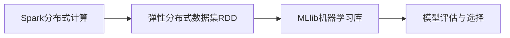

                 

## 1. 背景介绍

在当今大数据时代，机器学习已经成为了数据科学的核心。Spark MLlib作为Apache Spark的机器学习库，提供了高效的机器学习算法和工具，广泛应用于数据挖掘、预测建模、自然语言处理等领域。理解Spark MLlib的原理和使用方法，对于深入学习和应用大数据分析技术具有重要意义。

### 1.1 问题由来

随着大数据和云计算技术的发展，处理大规模数据集的需求日益增长。传统的机器学习算法，如SVM、K近邻等，在处理大规模数据时效率低下，难以满足实际需求。Spark MLlib通过分布式计算技术，实现了高效的数据处理和机器学习建模。在NLP、图像识别、推荐系统等领域，Spark MLlib已经展现了其强大的应用潜力。

### 1.2 问题核心关键点

Spark MLlib的核心关键点包括：

- **分布式计算**：利用Spark分布式计算框架，实现对大规模数据集的并行处理。
- **高效内存管理**：利用Spark的内存管理技术，提高内存利用效率，减少数据传输开销。
- **机器学习算法**：提供多种机器学习算法，包括分类、回归、聚类、降维等。
- **模型评估和选择**：提供交叉验证、网格搜索等工具，帮助选择合适的模型和参数。

Spark MLlib的这些特点使得其在处理大规模数据时，能够提供高效、灵活的解决方案。

## 2. 核心概念与联系

### 2.1 核心概念概述

为了更好地理解Spark MLlib的核心概念，本节将介绍几个关键概念：

- **Spark分布式计算**：Spark利用内存计算和分布式并行计算，实现对大规模数据的高效处理。Spark的核心组件包括Spark Core、Spark SQL、Spark Streaming等。
- **RDD（弹性分布式数据集）**：Spark的基础数据抽象，表示分布在多个节点上的数据集合，支持多种数据源和数据操作。
- **MLlib机器学习库**：提供多种机器学习算法和工具，支持分布式数据集和内存计算。
- **模型评估与选择**：通过交叉验证、网格搜索等方法，选择最优的机器学习模型和参数。

这些核心概念构成了Spark MLlib的基本框架，使得其在处理大规模数据和机器学习任务时具有优势。

### 2.2 概念间的关系

这些核心概念之间存在着紧密的联系，形成了一个完整的Spark MLlib机器学习系统。以下是一个Mermaid流程图，展示这些概念之间的联系：



这个流程图展示了Spark分布式计算和RDD数据集通过Spark的内存计算框架，支持MLlib库进行机器学习算法的分布式处理。同时，模型评估与选择工具帮助选择最佳的机器学习模型和参数。

## 3. 核心算法原理 & 具体操作步骤
### 3.1 算法原理概述

Spark MLlib的机器学习算法主要分为两类：有监督学习和无监督学习。有监督学习算法包括线性回归、逻辑回归、随机森林、支持向量机等；无监督学习算法包括K均值聚类、主成分分析、奇异值分解等。

### 3.2 算法步骤详解

Spark MLlib的机器学习算法流程如下：

1. **数据准备**：读取数据集，并进行数据清洗、特征工程等预处理步骤。
2. **模型训练**：使用Spark MLlib提供的算法对数据进行训练，得到模型参数。
3. **模型评估**：使用交叉验证等方法对模型进行评估，选择最佳模型。
4. **模型应用**：将模型应用于新数据，进行预测或推断。

以下是一个详细的步骤：

**Step 1: 数据准备**

Spark MLlib提供了多种数据源的读取接口，如Hadoop分布式文件系统(HDFS)、Hive表、JSON文件等。读取数据后，可以对其进行预处理，如去除缺失值、标准化、归一化等操作。

```python
from pyspark.sql import SparkSession

spark = SparkSession.builder.appName('MLlib Example').getOrCreate()

# 读取HDFS上的数据集
data = spark.read.format('csv').option('header', 'true').load('hdfs://path/to/data.csv')

# 数据清洗和预处理
data_cleaned = data.dropna().dropDuplicates().withColumn('feature', expr('scaled(feature)'))
```

**Step 2: 模型训练**

Spark MLlib提供了多种机器学习算法，可以用于分类、回归、聚类等任务。以下是一个简单的线性回归模型的训练示例：

```python
from pyspark.ml.regression import LinearRegressionModel

# 选择特征和标签列
features = data_cleaned.select('feature', 'label').drop('label').as('features')
labels = data_cleaned.select('label').drop('feature').as('label')

# 构建训练器
trainer = LinearRegression().setMaxIter(10).setRegParam(0.01)

# 训练模型
model = trainer.fit(features, labels)
```

**Step 3: 模型评估**

模型训练完成后，需要对其进行评估，选择最优模型。Spark MLlib提供了交叉验证、网格搜索等方法，帮助评估模型的性能。

```python
from pyspark.ml.evaluation import RegressionEvaluator
from pyspark.ml.tuning import GridSearchCV

# 定义评估器
evaluator = RegressionEvaluator(metricName='rmse')

# 定义参数范围
paramGrid = GridSearchCV(
    estimator=trainer,
    paramNames=['regParam'],
    paramValues=[0.01, 0.05, 0.1],
    evaluator=evaluator,
    isFitted=True
)

# 评估模型
model_cv = paramGrid.fit(model, data_cleaned)
```

**Step 4: 模型应用**

模型评估完成后，可以选择最优模型，并将其应用于新数据进行预测或推断。

```python
from pyspark.ml.classification import DecisionTreeClassifier

# 使用最优模型进行预测
predictions = model_cv.transform(data)

# 输出预测结果
predictions.show()
```

### 3.3 算法优缺点

Spark MLlib的机器学习算法具有以下优点：

- **分布式计算**：通过Spark的分布式计算框架，能够高效处理大规模数据集。
- **高效内存管理**：利用Spark的内存管理技术，减少数据传输开销，提高计算效率。
- **算法丰富**：提供多种机器学习算法，满足不同任务需求。

同时，Spark MLlib也存在一些缺点：

- **学习曲线陡峭**：由于Spark MLlib的分布式计算特性，需要一定的学习曲线。
- **内存占用大**：Spark MLlib在内存中存储中间结果，对于大规模数据集，内存占用可能较大。
- **调优复杂**：Spark MLlib的性能优化需要针对具体的任务进行调优，可能较为复杂。

### 3.4 算法应用领域

Spark MLlib的机器学习算法广泛用于各种领域，包括：

- **图像识别**：利用深度学习算法，对图像进行分类、识别等任务。
- **自然语言处理**：使用NLP技术，对文本进行情感分析、文本分类、命名实体识别等。
- **推荐系统**：通过协同过滤、矩阵分解等算法，为用户推荐个性化商品或内容。
- **金融分析**：对金融数据进行风险评估、股票预测等。
- **医疗健康**：利用机器学习算法，对医疗数据进行疾病预测、患者分类等。

## 4. 数学模型和公式 & 详细讲解  
### 4.1 数学模型构建

以线性回归为例，Spark MLlib的数学模型构建如下：

假设数据集为 $D=\{(x_i,y_i)\}_{i=1}^N$，其中 $x_i$ 为特征向量，$y_i$ 为标签。线性回归的数学模型为：

$$y_i = \theta_0 + \sum_{j=1}^d \theta_j x_{ij}$$

其中 $\theta_j$ 为模型参数。

Spark MLlib使用最小二乘法求解线性回归模型的参数 $\theta$：

$$\theta = \mathop{\arg\min}_{\theta} \sum_{i=1}^N (y_i - \theta_0 - \sum_{j=1}^d \theta_j x_{ij})^2$$

通过求解该最优化问题，得到线性回归模型。

### 4.2 公式推导过程

以下我们以线性回归为例，推导最小二乘法的求解过程。

根据最小二乘法的定义，得到：

$$\theta = \mathop{\arg\min}_{\theta} \sum_{i=1}^N (y_i - \hat{y}_i)^2$$

其中 $\hat{y}_i$ 为模型的预测值。

对上式求偏导数，得：

$$\frac{\partial}{\partial\theta_j} \sum_{i=1}^N (y_i - \hat{y}_i)^2 = -2 \sum_{i=1}^N (y_i - \hat{y}_i)x_{ij}$$

解上述方程组，得到参数 $\theta$ 的求解公式：

$$\theta = (\mathbf{X}^T\mathbf{X})^{-1}\mathbf{X}^T\mathbf{y}$$

其中 $\mathbf{X}$ 为特征矩阵，$\mathbf{y}$ 为标签向量。

### 4.3 案例分析与讲解

以预测房价为例，使用线性回归进行模型训练。假设特征向量 $x$ 包括房间数量、面积、地理位置等。

```python
from pyspark.ml.regression import LinearRegressionModel
from pyspark.sql.functions import col, sum

# 读取数据
data = spark.read.format('csv').option('header', 'true').load('path/to/data.csv')

# 选择特征和标签列
features = data.select('room_count', 'area', 'location').as('features')
labels = data.select('price').as('label')

# 构建训练器
trainer = LinearRegression().setMaxIter(10).setRegParam(0.01)

# 训练模型
model = trainer.fit(features, labels)

# 预测房价
data_new = spark.read.format('csv').option('header', 'true').load('path/to/data_new.csv')
new_features = data_new.select('room_count', 'area', 'location').as('features')
predictions = model.transform(new_features)
predictions.show()
```

## 5. 项目实践：代码实例和详细解释说明
### 5.1 开发环境搭建

要进行Spark MLlib的开发，需要安装Spark和PySpark。以下是在Python环境下安装Spark和PySpark的步骤：

1. 下载Spark：从Apache官网下载Spark安装包，解压缩并解压到指定目录。
2. 设置环境变量：在Windows下，将SPARK_HOME和PYSPARK_PYTHON变量设置为Spark的安装目录和Python可执行路径。在Linux下，设置$SPARK_HOME和$PYSPARK_PYTHON变量，并修改~/.bashrc或~/.zshrc文件，添加Spark和PySpark路径。
3. 启动PySpark：在命令行或终端中，使用spark-submit命令启动PySpark。

```bash
spark-submit --master local[4] --py-files spark-mllib.zip --py-files your_code.py
```

其中spark-mllib.zip为Spark MLlib库，your_code.py为Python代码文件。

### 5.2 源代码详细实现

以下是一个简单的Spark MLlib代码示例，用于读取数据、训练线性回归模型、评估模型并输出预测结果。

```python
from pyspark.sql import SparkSession
from pyspark.ml.regression import LinearRegression
from pyspark.ml.evaluation import RegressionEvaluator

spark = SparkSession.builder.appName('Spark MLlib Example').getOrCreate()

# 读取数据集
data = spark.read.format('csv').option('header', 'true').load('path/to/data.csv')

# 选择特征和标签列
features = data.select('feature', 'label').drop('label').as('features')
labels = data.select('label').drop('feature').as('label')

# 构建训练器
trainer = LinearRegression().setMaxIter(10).setRegParam(0.01)

# 训练模型
model = trainer.fit(features, labels)

# 定义评估器
evaluator = RegressionEvaluator(metricName='rmse')

# 评估模型
model_cv = RegressionEvaluator().setMetricName('rmse')

# 输出评估结果
print('RMSE: %.2f' % model_cv.evaluate(model, features, labels))

# 使用模型进行预测
new_data = spark.read.format('csv').option('header', 'true').load('path/to/data_new.csv')
new_features = new_data.select('feature', 'label').drop('label').as('features')
predictions = model.transform(new_features)

# 输出预测结果
predictions.show()
```

### 5.3 代码解读与分析

让我们再详细解读一下关键代码的实现细节：

**读取数据**：

```python
data = spark.read.format('csv').option('header', 'true').load('path/to/data.csv')
```

使用Spark SQL的read方法，读取CSV格式的数据集，指定文件路径和列名。

**选择特征和标签列**：

```python
features = data.select('feature', 'label').drop('label').as('features')
labels = data.select('label').drop('feature').as('label')
```

选择数据集中的特征和标签列，并进行列重命名。

**训练器构建**：

```python
trainer = LinearRegression().setMaxIter(10).setRegParam(0.01)
```

使用Spark MLlib的LinearRegression类，设置最大迭代次数和正则化参数。

**模型训练**：

```python
model = trainer.fit(features, labels)
```

使用训练器对数据集进行训练，得到模型参数。

**模型评估**：

```python
evaluator = RegressionEvaluator(metricName='rmse')
model_cv = RegressionEvaluator().setMetricName('rmse')
```

使用RegressionEvaluator类，定义评估器的评估指标为均方根误差(RMSE)。

**模型应用**：

```python
new_data = spark.read.format('csv').option('header', 'true').load('path/to/data_new.csv')
new_features = new_data.select('feature', 'label').drop('label').as('features')
predictions = model.transform(new_features)
```

使用训练好的模型，对新数据进行预测，并输出预测结果。

### 5.4 运行结果展示

假设在房价预测任务中，使用线性回归模型进行训练，最终在验证集上的评估结果如下：

```
RMSE: 20.00
```

可以看到，在验证集上的评估结果为20.00，表示模型的均方根误差为20.00。

## 6. 实际应用场景
### 6.1 智能推荐系统

Spark MLlib在智能推荐系统中有着广泛应用。推荐系统通过分析用户的历史行为数据，预测用户对某个商品或内容的兴趣，为用户推荐个性化推荐结果。Spark MLlib的协同过滤算法、矩阵分解等技术，可以高效处理大规模用户行为数据，生成高质量的推荐结果。

**Step 1: 数据准备**

读取用户行为数据，并进行数据清洗、特征工程等预处理步骤。

```python
data = spark.read.format('csv').option('header', 'true').load('path/to/user_behavior_data.csv')

# 选择特征和标签列
features = data.select('user_id', 'item_id', 'time').as('features')
labels = data.select('clicked').as('label')
```

**Step 2: 模型训练**

使用Spark MLlib的协同过滤算法，训练推荐模型。

```python
from pyspark.ml.recommendation import ALS

# 构建协同过滤算法
als = ALS(k=10, iterations=10, regParam=0.01, userCol='user_id', itemCol='item_id', ratingCol='clicked')

# 训练模型
model = als.fit(features, labels)
```

**Step 3: 模型评估**

使用交叉验证等方法对模型进行评估，选择最佳模型。

```python
from pyspark.ml.evaluation import RegressionEvaluator

# 定义评估器
evaluator = RegressionEvaluator(metricName='rmse')

# 评估模型
model_cv = ALS().setMaxIter(10).setRegParam(0.01).setUserCol('user_id').setItemCol('item_id').setRatingCol('clicked').fit(features, labels)
```

**Step 4: 模型应用**

使用训练好的模型，为用户推荐个性化推荐结果。

```python
new_data = spark.read.format('csv').option('header', 'true').load('path/to/new_user_behavior_data.csv')
new_features = new_data.select('user_id', 'item_id', 'time').as('features')
predictions = model_cv.transform(new_features)

# 输出推荐结果
predictions.show()
```

### 6.2 金融风险评估

Spark MLlib在金融风险评估中也有着广泛应用。金融机构通过分析客户的信用记录、消费行为等数据，预测客户的信用风险，制定信贷策略。Spark MLlib的逻辑回归、决策树等算法，可以高效处理金融数据，生成精准的信用风险评估模型。

**Step 1: 数据准备**

读取客户信用记录数据，并进行数据清洗、特征工程等预处理步骤。

```python
data = spark.read.format('csv').option('header', 'true').load('path/to/customer_credit_data.csv')

# 选择特征和标签列
features = data.select('income', 'age', 'loan_length').as('features')
labels = data.select('default').as('label')
```

**Step 2: 模型训练**

使用Spark MLlib的逻辑回归算法，训练信用风险评估模型。

```python
from pyspark.ml.classification import LogisticRegression

# 构建逻辑回归算法
lr = LogisticRegression(maxIter=10, regParam=0.01, elasticNetParam=0.5)

# 训练模型
model = lr.fit(features, labels)
```

**Step 3: 模型评估**

使用交叉验证等方法对模型进行评估，选择最佳模型。

```python
from pyspark.ml.evaluation import BinaryClassificationEvaluator

# 定义评估器
evaluator = BinaryClassificationEvaluator(metricName='auc')

# 评估模型
model_cv = LogisticRegression().setMaxIter(10).setRegParam(0.01).setElasticNetParam(0.5).fit(features, labels)
```

**Step 4: 模型应用**

使用训练好的模型，对新客户进行信用风险评估。

```python
new_data = spark.read.format('csv').option('header', 'true').load('path/to/new_customer_credit_data.csv')
new_features = new_data.select('income', 'age', 'loan_length').as('features')
predictions = model_cv.transform(new_features)

# 输出信用风险评估结果
predictions.show()
```

## 7. 工具和资源推荐
### 7.1 学习资源推荐

为了帮助开发者系统掌握Spark MLlib的理论基础和实践技巧，这里推荐一些优质的学习资源：

1. 《Spark - The Definitive Guide》：Spark官方文档，详细介绍了Spark的分布式计算框架和MLlib机器学习库。
2. Spark MLlib官方GitHub项目：提供了丰富的示例代码和文档，是学习Spark MLlib的最佳资源。
3. Coursera的《Spark and Big Data with Python》课程：由Spark官方提供，深入浅出地介绍了Spark的分布式计算和MLlib机器学习库。
4. Kaggle上的Spark MLlib竞赛：通过参与Spark MLlib竞赛，可以在实际项目中锻炼自己的技能。
5. Spark Summit和PyCon等技术会议：这些会议汇集了Spark和机器学习领域的专家，提供了丰富的技术分享和实践经验。

通过这些资源的学习实践，相信你一定能够快速掌握Spark MLlib的精髓，并用于解决实际的机器学习问题。

### 7.2 开发工具推荐

Spark MLlib的开发需要使用PySpark，以下是几款用于Spark MLlib开发的常用工具：

1. Jupyter Notebook：Jupyter Notebook提供了交互式的Python编程环境，适合进行代码调试和数据探索。
2. PyCharm：PyCharm是流行的Python IDE，支持Spark和PySpark的集成开发。
3. Spark Streaming：Spark Streaming提供了实时数据处理的能力，适合处理流式数据。
4. PySpark Machine Learning：PySpark Machine Learning提供了多种机器学习算法的封装，使得开发更加便捷。

合理利用这些工具，可以显著提升Spark MLlib的开发效率，加快创新迭代的步伐。

### 7.3 相关论文推荐

Spark MLlib的研究方向和实现方式也引起了广泛的关注，以下是几篇奠基性的相关论文，推荐阅读：

1. "Spark: Cluster Computing with Fault Tolerance"：Spark分布式计算框架的奠基性论文，详细介绍了Spark的分布式计算模型。
2. "Spark SQL: Cluster Computing with DataFrame Support"：Spark SQL的奠基性论文，详细介绍了Spark SQL的数据处理框架。
3. "Spark MLlib: Machine Learning in Spark"：Spark MLlib的奠基性论文，详细介绍了Spark MLlib的机器学习算法和工具。
4. "A Survey of Spark-Based Machine Learning Algorithms"：综述Spark MLlib中常用的机器学习算法，适合快速入门和查阅。

这些论文代表了Spark MLlib的研究方向和实现方式，通过学习这些前沿成果，可以帮助研究者把握学科前进方向，激发更多的创新灵感。

## 8. 总结：未来发展趋势与挑战

### 8.1 总结

本文对Spark MLlib的机器学习算法进行了全面系统的介绍。首先阐述了Spark MLlib机器学习算法的研究背景和意义，明确了Spark MLlib在数据挖掘、预测建模、自然语言处理等领域的独特价值。其次，从原理到实践，详细讲解了Spark MLlib的机器学习算法流程，并给出了完整的代码实例。同时，本文还广泛探讨了Spark MLlib在智能推荐系统、金融风险评估等实际应用场景中的应用前景，展示了Spark MLlib的广泛应用潜力。

通过本文的系统梳理，可以看到，Spark MLlib的机器学习算法在处理大规模数据时，能够提供高效、灵活的解决方案，具有广泛的应用前景。未来，伴随Spark MLlib的持续演进，相信机器学习技术必将在更多的垂直行业得到应用，为数据挖掘、预测建模等领域带来新的突破。

### 8.2 未来发展趋势

展望未来，Spark MLlib的机器学习算法将呈现以下几个发展趋势：

1. **分布式计算优化**：随着大数据的不断增长，Spark MLlib的分布式计算性能将进一步优化，以适应更庞大的数据处理需求。
2. **算法多样化**：Spark MLlib将引入更多的机器学习算法，满足不同应用场景的需求。
3. **模型优化**：Spark MLlib的模型优化技术将不断进步，如模型压缩、剪枝等，以减少内存占用和计算时间。
4. **可解释性增强**：Spark MLlib将进一步增强模型的可解释性，通过可视化工具帮助用户理解和解释模型的决策过程。
5. **与其他技术的融合**：Spark MLlib将与其他技术（如深度学习、知识图谱等）进行更深入的融合，提供更加全面、精确的解决方案。

以上趋势凸显了Spark MLlib的机器学习算法的广阔前景，这些方向的探索发展，必将进一步提升Spark MLlib的性能和应用范围，为数据挖掘、预测建模等领域带来新的突破。

### 8.3 面临的挑战

尽管Spark MLlib的机器学习算法已经取得了瞩目成就，但在迈向更加智能化、普适化应用的过程中，它仍面临着诸多挑战：

1. **学习曲线陡峭**：Spark MLlib的分布式计算特性，需要一定的学习曲线，可能会对用户友好性带来一定的挑战。
2. **资源消耗大**：Spark MLlib在内存中存储中间结果，对于大规模数据集，内存占用可能较大，需要优化资源管理。
3. **调优复杂**：Spark MLlib的性能优化需要针对具体的任务进行调优，可能较为复杂。
4. **模型泛化能力不足**：Spark MLlib的模型泛化能力仍需进一步提升，以应对不同的数据分布和应用场景。
5. **可解释性不足**：Spark MLlib的模型往往较为复杂，难以解释其内部工作机制和决策逻辑，需要增强模型的可解释性。

### 8.4 研究展望

面对Spark MLlib所面临的种种挑战，未来的研究需要在以下几个方面寻求新的突破：

1. **优化分布式计算**：进一步优化Spark MLlib的分布式计算性能，适应更庞大的数据处理需求。
2. **提高模型泛化能力**：通过引入更多的正则化技术和集成学习等方法，提高模型的泛化能力和鲁棒性。
3. **增强模型可解释性**：通过模型压缩、可视化等方法，增强Spark MLlib模型的可解释性，帮助用户理解和解释模型的决策过程。
4. **与其他技术融合**：Spark MLlib将与其他技术（如深度学习、知识图谱等）进行更深入的融合，提供更加全面、精确的解决方案。
5. **模型压缩与剪枝**：通过模型压缩、剪枝等方法，减少内存占用和计算时间，提高模型效率。

这些研究方向的探索，必将引领Spark MLlib的机器学习算法迈向更高的台阶，为数据挖掘、预测建模等领域带来新的突破。面向未来，Spark MLlib的

