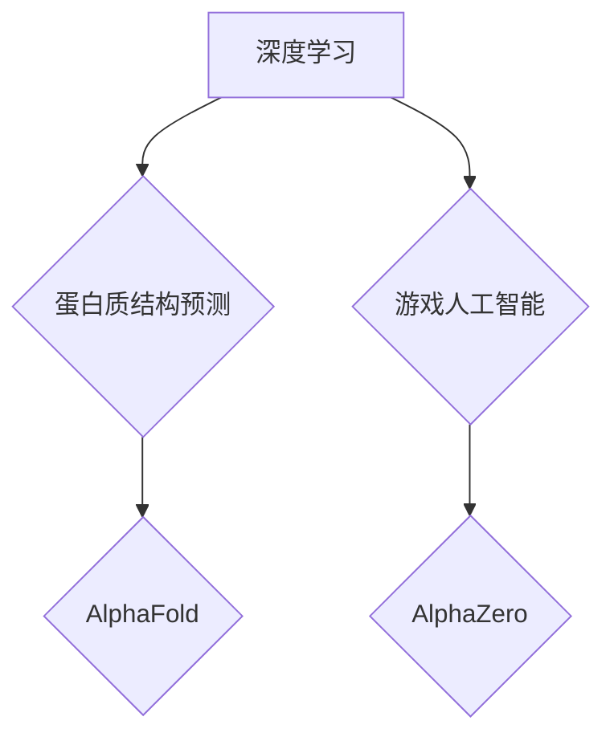

## AI在专业领域的成就：AlphaFold与AlphaZero

> 关键词：AlphaFold, AlphaZero, 深度学习, 蛋白质结构预测, 游戏人工智能, 强化学习, 决策树, 神经网络

### 1. 背景介绍

人工智能（AI）近年来取得了令人瞩目的进展，从语音识别到图像识别，再到自然语言处理，AI技术已经渗透到我们生活的方方面面。然而，AI在专业领域的应用仍然是一个充满挑战和机遇的领域。

AlphaFold和AlphaZero是DeepMind公司开发的两款具有里程碑意义的AI系统，它们分别在蛋白质结构预测和游戏人工智能领域取得了突破性的成就，展现了AI在专业领域应用的巨大潜力。

**1.1 AlphaFold：蛋白质结构预测的革命**

蛋白质是生命活动的基石，其三维结构决定了其功能。然而，预测蛋白质的结构一直是生物学和化学领域的一项艰巨任务。传统方法耗时费力，难以应对蛋白质结构的复杂性。

AlphaFold利用深度学习技术，通过分析蛋白质序列信息，预测其三维结构。在2020年举办的蛋白质结构预测竞赛（CASP）中，AlphaFold的表现远远超过了其他参赛者，其预测精度达到了前所未有的水平。

**1.2 AlphaZero：超越人类的游戏人工智能**

AlphaZero是一个强大的游戏人工智能系统，它能够学习并掌握各种棋类游戏，包括围棋、国际象棋和 Schach。AlphaZero通过强化学习算法，与自己进行无休止的游戏，不断提升自己的策略和技巧。

在围棋领域，AlphaZero仅经过几天的训练，就达到了人类世界冠军的水平，并最终战胜了当时的世界冠军。在国际象棋和 Schach 领域，AlphaZero也取得了令人瞩目的成就，展现了其强大的学习和决策能力。

### 2. 核心概念与联系

AlphaFold和AlphaZero都基于深度学习和强化学习算法，但它们在应用场景和具体实现方式上有所不同。

**2.1 深度学习**

深度学习是一种机器学习的子领域，它利用多层神经网络来模拟人类大脑的学习过程。深度学习算法能够从海量数据中自动提取特征，并进行复杂的模式识别和预测。

**2.2 强化学习**

强化学习是一种机器学习的算法，它通过奖励和惩罚机制来训练智能体，使其在特定环境中做出最优决策。强化学习算法能够学习解决复杂的任务，例如游戏、机器人控制和自动驾驶。

**2.3 AlphaFold与AlphaZero的联系**

AlphaFold和AlphaZero都利用了深度学习和强化学习算法，但它们在应用场景和具体实现方式上有所不同。AlphaFold主要应用于蛋白质结构预测，它利用深度学习算法分析蛋白质序列信息，预测其三维结构。而AlphaZero则应用于游戏人工智能，它利用强化学习算法与自己进行无休止的游戏，不断提升自己的策略和技巧。

**Mermaid 流程图**



### 3. 核心算法原理 & 具体操作步骤

**3.1 算法原理概述**

AlphaFold和AlphaZero都基于深度学习和强化学习算法，但它们在具体实现方式上有所不同。

**AlphaFold**

AlphaFold的核心算法是基于Transformer网络的深度学习模型。Transformer网络是一种能够处理序列数据的强大神经网络架构，它能够捕捉蛋白质序列中长距离依赖关系。AlphaFold模型通过训练大量的蛋白质序列数据，学习预测蛋白质三维结构的映射关系。

**AlphaZero**

AlphaZero的核心算法是基于蒙特卡罗树搜索和深度神经网络的强化学习模型。蒙特卡罗树搜索是一种用于决策问题的搜索算法，它通过模拟多个可能的决策路径，选择最优的决策。深度神经网络则用于评估每个决策路径的价值，并指导蒙特卡罗树搜索的决策过程。

**3.2 算法步骤详解**

**AlphaFold**

1. **数据预处理:** 将蛋白质序列数据转换为数字表示，并进行必要的清洗和转换。
2. **模型训练:** 使用Transformer网络模型训练蛋白质序列数据，学习预测蛋白质三维结构的映射关系。
3. **结构预测:** 将新的蛋白质序列数据输入到训练好的模型中，预测其三维结构。

**AlphaZero**

1. **环境搭建:** 建立一个模拟游戏环境，其中包含游戏规则、棋盘状态和玩家行动。
2. **策略网络训练:** 使用深度神经网络训练一个策略网络，该网络能够评估每个棋步的价值，并选择最优的棋步。
3. **蒙特卡罗树搜索:** 使用蒙特卡罗树搜索算法，根据策略网络的评估结果，探索多个可能的决策路径，并选择最优的决策路径。
4. **奖励机制:** 根据游戏结果，为策略网络提供奖励或惩罚，以指导其学习过程。

**3.3 算法优缺点**

**AlphaFold**

* **优点:** 预测精度高，能够预测蛋白质的复杂三维结构。
* **缺点:** 需要大量的训练数据，训练时间较长。

**AlphaZero**

* **优点:** 学习能力强，能够掌握各种棋类游戏的策略。
* **缺点:** 训练成本高，需要大量的计算资源。

**3.4 算法应用领域**

**AlphaFold**

* 蛋白质结构预测
* 药物设计
* 疾病诊断

**AlphaZero**

* 游戏人工智能
* 策略决策
* 自动驾驶

### 4. 数学模型和公式 & 详细讲解 & 举例说明

**4.1 数学模型构建**

AlphaFold和AlphaZero都基于复杂的数学模型，这些模型利用矩阵运算、线性代数和概率论等数学工具来实现其功能。

**AlphaFold**

AlphaFold模型的核心是Transformer网络，它利用注意力机制来捕捉蛋白质序列中长距离依赖关系。注意力机制可以理解为一种加权平均操作，它根据序列元素之间的相关性，赋予不同的权重，从而突出重要的信息。

**AlphaZero**

AlphaZero模型的核心是蒙特卡罗树搜索算法和深度神经网络。蒙特卡罗树搜索算法利用树形结构来表示决策路径，并通过模拟多个可能的决策路径，选择最优的决策路径。深度神经网络则用于评估每个决策路径的价值，并指导蒙特卡罗树搜索的决策过程。

**4.2 公式推导过程**

由于篇幅限制，这里只列举一些关键公式，并进行简要的解释。

**Transformer网络中的注意力机制公式:**

$$
Attention(Q, K, V) = softmax(\frac{QK^T}{\sqrt{d_k}})V
$$

其中，Q、K、V分别代表查询矩阵、键矩阵和值矩阵，$d_k$代表键向量的维度。

**蒙特卡罗树搜索算法中的节点价值评估公式:**

$$
V(s) = \sum_{a \in A(s)} \pi(a) Q(s, a)
$$

其中，$V(s)$代表节点$s$的价值，$A(s)$代表节点$s$可执行的动作集合，$\pi(a)$代表动作$a$的选择概率，$Q(s, a)$代表动作$a$在节点$s$的价值估计。

**4.3 案例分析与讲解**

AlphaFold在CASP竞赛中预测蛋白质结构的案例分析可以说明其算法的强大之处。AlphaFold能够准确预测蛋白质的折叠方式和相互作用，为药物设计和疾病诊断提供了重要的参考依据。

AlphaZero在围棋领域战胜人类世界冠军的案例分析可以说明其算法的学习能力和决策能力。AlphaZero通过与自己进行无休止的游戏，不断提升自己的策略和技巧，最终超越了人类的水平。

### 5. 项目实践：代码实例和详细解释说明

**5.1 开发环境搭建**

AlphaFold和AlphaZero的代码实现通常基于Python语言，并使用深度学习框架如TensorFlow或PyTorch进行开发。

**5.2 源代码详细实现**

由于篇幅限制，这里只提供一些简单的代码示例，并进行简要的解释。

**AlphaFold代码示例:**

```python
import tensorflow as tf

# 定义Transformer网络模型
model = tf.keras.Sequential([
    #... Transformer网络层...
])

# 加载蛋白质序列数据
data =...

# 训练模型
model.compile(optimizer='adam', loss='mse')
model.fit(data,...)

# 预测蛋白质结构
prediction = model.predict(...)
```

**AlphaZero代码示例:**

```python
import numpy as np
import random

# 定义游戏环境
class GameEnvironment:
    #... 游戏规则和状态表示...

# 定义策略网络
class PolicyNetwork:
    #... 深度神经网络结构...

# 定义蒙特卡罗树搜索算法
def monte_carlo_tree_search(env, policy_network):
    #... 算法实现...

# 训练AlphaZero
env = GameEnvironment()
policy_network = PolicyNetwork()
monte_carlo_tree_search(env, policy_network)
```

**5.3 代码解读与分析**

以上代码示例仅展示了AlphaFold和AlphaZero的简单实现框架，实际的代码实现更加复杂，涉及到大量的数学运算、数据处理和模型训练过程。

**5.4 运行结果展示**

AlphaFold和AlphaZero的运行结果通常以预测的蛋白质结构或游戏策略的形式展示。

### 6. 实际应用场景

**6.1 AlphaFold的应用场景**

* **药物设计:** AlphaFold可以帮助科学家预测蛋白质与药物的相互作用，从而加速药物研发过程。
* **疾病诊断:** AlphaFold可以帮助医生识别疾病相关的蛋白质结构异常，从而提高疾病诊断的准确性。
* **生物学研究:** AlphaFold可以帮助生物学家研究蛋白质的功能和结构变化，从而深入了解生命活动机制。

**6.2 AlphaZero的应用场景**

* **游戏人工智能:** AlphaZero可以用于开发更智能的游戏人工智能，提供更具挑战性和趣味性的游戏体验。
* **策略决策:** AlphaZero的决策算法可以应用于各种策略决策问题，例如金融投资、资源分配和军事策略。
* **自动驾驶:** AlphaZero的强化学习算法可以用于训练自动驾驶系统，使其能够在复杂环境中做出更安全和高效的决策。

**6.4 未来应用展望**

AlphaFold和AlphaZero的应用场景还在不断扩展，未来它们将可能应用于更多领域，例如材料科学、人工智能安全和个性化医疗。

### 7. 工具和资源推荐

**7.1 学习资源推荐**

* **DeepMind官网:** https://deepmind.com/
* **AlphaFold论文:** https://www.nature.com/articles/s41586-021-03819-2
* **AlphaZero论文:** https://www.nature.com/articles/nature24270

**7.2 开发工具推荐**

* **TensorFlow:** https://www.tensorflow.org/
* **PyTorch:** https://pytorch.org/

**7.3 相关论文推荐**

* **Attention Is All You Need:** https://arxiv.org/abs/1706.03762
* **Mastering the Game of Go with Deep Neural Networks and Tree Search:** https://arxiv.org/abs/1611.02850

### 8. 总结：未来发展趋势与挑战

**8.1 研究成果总结**

AlphaFold和AlphaZero的成功应用证明了深度学习和强化学习算法在专业领域应用的巨大潜力。它们在蛋白质结构预测和游戏人工智能领域取得了突破性的成就，为科学研究和技术创新提供了新的思路和方法。

**8.2 未来发展趋势**

未来，AlphaFold和AlphaZero的算法将继续发展和完善，应用场景也将更加广泛。

* **更准确的蛋白质结构预测:** 研究人员将继续改进AlphaFold的算法，提高其预测蛋白质结构的准确性。
* **更强大的游戏人工智能:** 研究人员将继续探索AlphaZero的算法，使其能够掌握更多复杂的游戏，并提高其决策