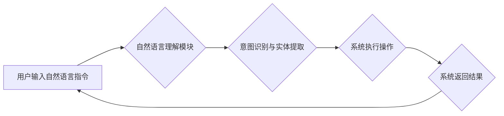

## LUI在CUI中的核心作用

> 关键词：LUI, CUI, 用户界面, 交互体验, 自然语言处理, 人机交互, 智能化, 认知计算

## 1. 背景介绍

随着科技的飞速发展，计算机技术已经渗透到生活的方方面面。用户界面（UI）作为人与计算机交互的桥梁，其设计和优化至关重要。传统的命令行界面（CUI）虽然功能强大，但操作复杂，学习成本高，难以满足现代用户对便捷、直观、智能化的交互体验的需求。

近年来，基于自然语言处理（NLP）的图形用户界面（GUI）逐渐成为主流，但GUI仍然存在一些局限性，例如：

* **学习曲线陡峭:** GUI需要用户学习大量的图标、菜单和按钮，对于新手用户来说，操作起来较为困难。
* **交互方式单一:** GUI主要依赖鼠标和键盘操作，缺乏更自然、更直观的交互方式。
* **可扩展性有限:** GUI的结构相对固定，难以适应不断变化的用户需求和应用场景。

为了解决这些问题，基于语言的UI（LUI）应运而生。LUI旨在通过自然语言进行交互，提供更直观、更便捷、更智能的用户体验。

## 2. 核心概念与联系

LUI的核心概念是将自然语言作为用户与计算机交互的主要方式。用户可以使用熟悉的语言进行指令、提问和对话，而系统则会理解用户的意图，并提供相应的响应。

LUI与CUI的关系可以概括为：

* **CUI是基于命令的交互方式，需要用户输入特定的命令才能完成操作。**
* **LUI是基于自然语言的交互方式，用户可以使用更接近日常语言的表达方式与系统进行交互。**

LUI可以看作是CUI的升级版，它继承了CUI的强大功能，同时克服了CUI的局限性，提供了更人性化的交互体验。

**Mermaid 流程图**



## 3. 核心算法原理 & 具体操作步骤

### 3.1  算法原理概述

LUI的核心算法主要包括自然语言处理（NLP）技术，例如：

* **词法分析:** 将自然语言文本分解成单词或词组。
* **语法分析:** 分析文本的语法结构，识别句子成分和关系。
* **语义分析:** 理解文本的含义，识别实体、关系和事件。
* **意图识别:** 识别用户在自然语言文本中表达的意图。
* **实体提取:** 从自然语言文本中提取关键信息，例如人名、地名、时间等。

### 3.2  算法步骤详解

LUI系统的工作流程可以概括为以下步骤：

1. **用户输入:** 用户输入自然语言指令。
2. **文本预处理:** 对用户输入的文本进行预处理，例如去除停用词、规范化词汇等。
3. **词法分析:** 将预处理后的文本分解成单词或词组。
4. **语法分析:** 分析文本的语法结构，识别句子成分和关系。
5. **语义分析:** 理解文本的含义，识别实体、关系和事件。
6. **意图识别:** 识别用户在自然语言文本中表达的意图。
7. **实体提取:** 从自然语言文本中提取关键信息，例如人名、地名、时间等。
8. **系统执行:** 根据识别的意图和实体，系统执行相应的操作。
9. **结果返回:** 系统将执行结果以自然语言形式返回给用户。

### 3.3  算法优缺点

**优点:**

* **更自然、更直观:** 用户可以使用熟悉的语言与系统交互，操作更加便捷。
* **更智能化:** LUI系统可以理解用户的意图，并提供更精准、更个性化的服务。
* **更易于学习:** LUI的学习曲线相对较低，即使是新手用户也能快速上手。

**缺点:**

* **技术难度高:** LUI的开发需要复杂的NLP技术，技术门槛较高。
* **数据依赖性强:** LUI系统需要大量的语料数据进行训练，数据质量直接影响系统的性能。
* **理解歧义性:** 自然语言具有高度的歧义性，LUI系统需要能够有效识别和处理语义歧义。

### 3.4  算法应用领域

LUI技术在各个领域都有广泛的应用前景，例如：

* **智能客服:** LUI可以用于构建智能客服系统，提供24小时不间断的客户服务。
* **语音助手:** LUI可以用于开发语音助手，例如Siri、Alexa等，帮助用户完成各种任务。
* **教育领域:** LUI可以用于开发智能教育系统，提供个性化的学习体验。
* **医疗领域:** LUI可以用于辅助医生诊断疾病、提供医疗咨询等。

## 4. 数学模型和公式 & 详细讲解 & 举例说明

### 4.1  数学模型构建

LUI系统中常用的数学模型包括：

* **词向量模型:** 将单词映射到向量空间，捕捉单词之间的语义关系。例如Word2Vec、GloVe等模型。
* **循环神经网络（RNN）:** 用于处理序列数据，例如文本序列，能够捕捉文本中的上下文信息。
* **Transformer:** 基于注意力机制的深度学习模型，能够更有效地处理长文本序列。

### 4.2  公式推导过程

例如，Word2Vec模型使用负采样方法训练词向量。负采样目标函数可以表示为：

$$
J(\theta) = -\frac{1}{T} \sum_{t=1}^{T} \sum_{-i \in N(w_t)} \log \sigma(v_{w_t}^T v_{w_{-i}})
$$

其中：

* $\theta$ 是模型参数。
* $T$ 是训练样本的数量。
* $w_t$ 是目标词。
* $N(w_t)$ 是目标词的上下文词集合。
* $v_{w_t}$ 和 $v_{w_{-i}}$ 分别是目标词和上下文词的词向量。
* $\sigma$ 是sigmoid函数。

### 4.3  案例分析与讲解

例如，使用Word2Vec模型训练词向量，可以发现“国王”和“皇后”之间的语义关系较近，而“国王”和“苹果”之间的语义关系较远。

## 5. 项目实践：代码实例和详细解释说明

### 5.1  开发环境搭建

LUI系统的开发环境通常包括：

* **操作系统:** Linux、macOS或Windows。
* **编程语言:** Python、Java或C++。
* **深度学习框架:** TensorFlow、PyTorch或Keras。
* **NLP库:** NLTK、spaCy或Gensim。

### 5.2  源代码详细实现

以下是一个简单的LUI系统代码示例，使用Python和NLTK库实现：

```python
import nltk

# 下载NLTK数据
nltk.download('punkt')
nltk.download('averaged_perceptron_tagger')

def process_text(text):
    # 词法分析
    tokens = nltk.word_tokenize(text)
    # 语法分析
    pos_tags = nltk.pos_tag(tokens)
    #... 其他语义分析步骤

def recognize_intent(text):
    #... 意图识别算法

def execute_action(intent, entities):
    #... 系统执行操作

# 用户输入
user_input = input("请输入您的指令: ")

# 处理用户输入
processed_text = process_text(user_input)
intent = recognize_intent(processed_text)
entities = extract_entities(processed_text)

# 执行操作
execute_action(intent, entities)
```

### 5.3  代码解读与分析

这段代码演示了LUI系统的基本流程：

1. **处理用户输入:** 使用NLTK库对用户输入的文本进行词法分析和语法分析。
2. **识别意图:** 使用意图识别算法识别用户表达的意图。
3. **提取实体:** 从文本中提取关键信息，例如人名、地名、时间等。
4. **执行操作:** 根据识别的意图和实体，系统执行相应的操作。

### 5.4  运行结果展示

运行该代码后，系统会根据用户的输入指令执行相应的操作，并返回结果。例如，如果用户输入“今天的天气怎么样”，系统会识别出用户的意图是查询天气，并返回当天的天气预报。

## 6. 实际应用场景

LUI技术已经在多个领域得到实际应用，例如：

* **智能客服:** 许多企业已经使用LUI技术构建智能客服系统，例如阿里巴巴的“小客服”，腾讯的“企微客服”等。
* **语音助手:** 语音助手，例如Siri、Alexa、Google Assistant等，都使用了LUI技术，能够理解用户的语音指令并提供相应的服务。
* **教育领域:** 一些教育平台使用LUI技术开发智能辅导系统，能够根据学生的学习情况提供个性化的学习建议和帮助。

### 6.4  未来应用展望

随着NLP技术的不断发展，LUI技术将在未来得到更广泛的应用，例如：

* **医疗领域:** LUI可以用于辅助医生诊断疾病、提供医疗咨询等，提高医疗效率和质量。
* **金融领域:** LUI可以用于提供个性化的金融服务，例如理财建议、投资咨询等。
* **娱乐领域:** LUI可以用于开发更智能、更交互性的游戏和娱乐应用。

## 7. 工具和资源推荐

### 7.1  学习资源推荐

* **书籍:**
    * 《深度学习》
    * 《自然语言处理》
    * 《机器学习》
* **在线课程:**
    * Coursera
    * edX
    * Udacity

### 7.2  开发工具推荐

* **编程语言:** Python
* **深度学习框架:** TensorFlow、PyTorch
* **NLP库:** NLTK、spaCy、Gensim

### 7.3  相关论文推荐

* **BERT: Pre-training of Deep Bidirectional Transformers for Language Understanding**
* **GPT-3: Language Models are Few-Shot Learners**
* **XLNet: Generalized Autoregressive Pretraining for Language Understanding**

## 8. 总结：未来发展趋势与挑战

### 8.1  研究成果总结

LUI技术在近年来取得了显著进展，例如：

* **模型性能提升:** 深度学习模型的不断发展，使得LUI系统的理解能力和响应能力得到大幅提升。
* **应用场景拓展:** LUI技术已经应用于越来越多的领域，例如智能客服、语音助手、教育领域等。

### 8.2  未来发展趋势

LUI技术未来的发展趋势包括：

* **更智能化:** LUI系统将更加智能，能够理解更复杂的语言表达，并提供更个性化的服务。
* **更跨模态:** LUI系统将融合多模态信息，例如文本、语音、图像等，提供更丰富的交互体验。
* **更安全可靠:** LUI系统将更加安全可靠，能够有效防止恶意攻击和数据泄露。

### 8.3  面临的挑战

LUI技术仍然面临一些挑战，例如：

* **数据标注:** LUI系统的训练需要大量的标注数据，数据标注成本较高。
* **语义理解:** 自然语言具有高度的歧义性，LUI系统需要能够更有效地理解语义。
* **个性化定制:** LUI系统需要能够根据用户的个性化需求进行定制，提供更个性化的服务。

### 8.4  研究展望

未来，LUI技术的研究将更加注重以下方面：

* **低资源语种支持:** 研究如何构建能够处理低资源语种的LUI系统。
* **跨语言理解:** 研究如何使LUI系统能够理解不同语言的文本。
* **伦理问题:** 研究LUI技术的伦理问题，例如数据隐私、算法偏见等。

## 9. 附录：常见问题与解答

### 9.1  Q