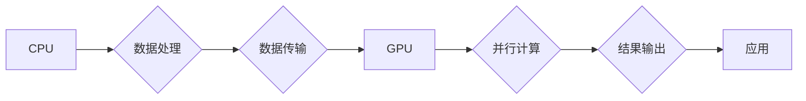

## Nvidia的GPU与AI发展的关系

> 关键词：GPU, CUDA, 深度学习, 计算机视觉, 自然语言处理, 训练加速, AI芯片

## 1. 背景介绍

人工智能（AI）近年来发展迅速，成为科技领域最热门的话题之一。深度学习作为AI的重要分支，在图像识别、自然语言处理、语音识别等领域取得了突破性进展。然而，深度学习模型的训练需要大量的计算资源和时间，这成为AI发展面临的瓶颈之一。

Nvidia作为全球领先的GPU厂商，凭借其强大的计算能力和丰富的软件生态系统，在AI发展中扮演着至关重要的角色。从早期用于游戏渲染的GPU，到如今成为深度学习训练的加速器，Nvidia的GPU技术推动了AI的快速发展。

## 2. 核心概念与联系

### 2.1 GPU架构

传统CPU采用串行处理架构，一次只能处理一个指令。而GPU采用并行处理架构，拥有大量并行计算单元，可以同时处理多个指令。这种并行处理能力使得GPU在处理海量数据和进行大量计算时具有显著优势。

### 2.2 CUDA架构

Nvidia开发的CUDA（Compute Unified Device Architecture）是专门为GPU编程设计的并行计算平台。CUDA提供了丰富的API和工具，允许开发者将程序移植到GPU上进行加速计算。

### 2.3 AI算法与GPU加速

深度学习算法的核心是神经网络，其训练过程需要大量的矩阵运算和数据处理。GPU的并行处理能力和CUDA平台的强大功能使得其成为深度学习训练的理想平台。

**Mermaid 流程图**



## 3. 核心算法原理 & 具体操作步骤

### 3.1 算法原理概述

深度学习算法的核心是神经网络，它由多个层级的神经元组成。每个神经元接收输入信号，经过激活函数处理后输出信号。神经网络通过训练学习不同层级神经元的权重，从而实现对数据的学习和预测。

### 3.2 算法步骤详解

1. **数据预处理:** 将原始数据转换为深度学习算法可以处理的格式，例如归一化、编码等。
2. **网络结构设计:** 根据任务需求设计神经网络的层数、神经元数量等结构参数。
3. **权重初始化:** 为神经网络中的权重赋予初始值。
4. **前向传播:** 将输入数据通过神经网络传递，计算输出结果。
5. **反向传播:** 计算输出结果与真实值的误差，并根据误差调整神经网络的权重。
6. **迭代训练:** 重复前向传播和反向传播步骤，直到模型达到预设的精度。

### 3.3 算法优缺点

**优点:**

* 能够学习复杂的数据模式。
* 性能优于传统机器学习算法。
* 在图像识别、自然语言处理等领域取得了突破性进展。

**缺点:**

* 训练数据量要求高。
* 训练时间长，计算资源消耗大。
* 模型解释性差，难以理解模型的决策过程。

### 3.4 算法应用领域

* **计算机视觉:** 图像识别、物体检测、图像分割、人脸识别等。
* **自然语言处理:** 文本分类、情感分析、机器翻译、对话系统等。
* **语音识别:** 语音转文本、语音助手等。
* **推荐系统:** 商品推荐、内容推荐等。
* **医疗诊断:** 病理图像分析、疾病预测等。

## 4. 数学模型和公式 & 详细讲解 & 举例说明

### 4.1 数学模型构建

深度学习模型的核心是神经网络，其数学模型可以表示为多层感知机（MLP）。MLP由输入层、隐藏层和输出层组成，每个层级的神经元之间通过权重连接。

**输入层:** 接收原始数据，每个神经元对应一个输入特征。

**隐藏层:** 对输入数据进行特征提取和转换，可以有多个隐藏层。

**输出层:** 输出最终预测结果，每个神经元对应一个输出类别。

### 4.2 公式推导过程

神经网络的输出结果可以通过以下公式计算：

$$
y = f(W_3 * a_2 + b_3)
$$

其中：

* $y$ 是输出结果。
* $W_3$ 是隐藏层到输出层的权重矩阵。
* $a_2$ 是隐藏层的激活输出。
* $b_3$ 是输出层的偏置向量。
* $f$ 是激活函数，例如ReLU、Sigmoid等。

### 4.3 案例分析与讲解

**举例说明:**

假设我们有一个简单的图像分类模型，用于识别猫和狗的图片。输入层接收图像像素数据，隐藏层进行特征提取，输出层输出猫和狗的概率。

训练过程中，模型会根据输入图像和真实标签调整权重，使得输出结果与真实标签越接近。

## 5. 项目实践：代码实例和详细解释说明

### 5.1 开发环境搭建

* 操作系统: Ubuntu 20.04
* CUDA Toolkit: 11.7
* cuDNN: 8.4.0
* Python: 3.8
* 深度学习框架: PyTorch

### 5.2 源代码详细实现

```python
import torch
import torch.nn as nn

class SimpleCNN(nn.Module):
    def __init__(self):
        super(SimpleCNN, self).__init__()
        self.conv1 = nn.Conv2d(3, 16, kernel_size=3, padding=1)
        self.relu = nn.ReLU()
        self.pool = nn.MaxPool2d(kernel_size=2, stride=2)
        self.conv2 = nn.Conv2d(16, 32, kernel_size=3, padding=1)
        self.fc1 = nn.Linear(32 * 7 * 7, 128)
        self.fc2 = nn.Linear(128, 2)

    def forward(self, x):
        x = self.pool(self.relu(self.conv1(x)))
        x = self.pool(self.relu(self.conv2(x)))
        x = x.view(-1, 32 * 7 * 7)
        x = self.relu(self.fc1(x))
        x = self.fc2(x)
        return x

model = SimpleCNN()
```

### 5.3 代码解读与分析

* **模型定义:** 代码定义了一个简单的卷积神经网络模型 `SimpleCNN`，包含卷积层、激活函数、池化层和全连接层。
* **前向传播:** `forward()` 方法定义了模型的计算流程，将输入数据通过各层进行处理，最终输出预测结果。
* **参数初始化:** 模型创建时，会自动初始化权重和偏置。

### 5.4 运行结果展示

训练模型后，可以将模型应用于新的图像数据进行预测。

## 6. 实际应用场景

### 6.1 图像识别

Nvidia GPU加速的深度学习模型在图像识别领域取得了突破性进展，例如：

* **自动驾驶:** 用于识别道路标志、车辆、行人等。
* **医疗诊断:** 用于识别病变区域、辅助诊断疾病。
* **安防监控:** 用于人脸识别、行为分析。

### 6.2 自然语言处理

Nvidia GPU也加速了自然语言处理任务的训练，例如：

* **机器翻译:** 将文本从一种语言翻译成另一种语言。
* **文本摘要:** 自动生成文本的简要概述。
* **对话系统:** 创建能够与人类进行自然对话的智能助手。

### 6.3 其他应用场景

* **语音识别:** 将语音转换为文本。
* **推荐系统:** 根据用户行为推荐相关商品或内容。
* **金融分析:** 分析金融数据，预测市场趋势。

### 6.4 未来应用展望

随着AI技术的不断发展，Nvidia GPU在未来将应用于更多领域，例如：

* **科学研究:** 加速药物研发、材料科学研究等。
* **艺术创作:** 生成艺术作品、音乐等。
* **个性化教育:** 提供个性化的学习方案。

## 7. 工具和资源推荐

### 7.1 学习资源推荐

* **Nvidia官网:** https://developer.nvidia.com/
* **CUDA官网:** https://developer.nvidia.com/cuda-zone
* **PyTorch官网:** https://pytorch.org/
* **DeepLearning.AI:** https://www.deeplearning.ai/

### 7.2 开发工具推荐

* **VS Code:** https://code.visualstudio.com/
* **Jupyter Notebook:** https://jupyter.org/

### 7.3 相关论文推荐

* **ImageNet Classification with Deep Convolutional Neural Networks:** https://arxiv.org/abs/1202.1938
* **Attention Is All You Need:** https://arxiv.org/abs/1706.03762

## 8. 总结：未来发展趋势与挑战

### 8.1 研究成果总结

Nvidia GPU在AI发展中发挥了至关重要的作用，加速了深度学习算法的训练，推动了AI技术的快速发展。

### 8.2 未来发展趋势

* **更高效的GPU架构:** 继续提高GPU的计算能力和能效比。
* **更强大的AI芯片:** 开发专门用于AI计算的芯片，例如Tensor Core。
* **边缘计算:** 将AI模型部署到边缘设备，实现实时推理。

### 8.3 面临的挑战

* **数据隐私和安全:** AI模型的训练需要大量数据，如何保护数据隐私和安全是一个重要挑战。
* **算法可解释性:** 深度学习模型的决策过程难以理解，如何提高算法的可解释性是一个关键问题。
* **伦理问题:** AI技术的应用可能带来伦理问题，例如算法偏见、就业影响等，需要认真思考和解决。

### 8.4 研究展望

未来，AI技术将继续发展，Nvidia GPU也将继续扮演着重要的角色。研究者们将继续探索新的GPU架构、AI算法和应用场景，推动AI技术向更智能、更安全、更可持续的方向发展。

## 9. 附录：常见问题与解答

**Q1: CUDA是什么？**

A1: CUDA（Compute Unified Device Architecture）是Nvidia开发的并行计算平台，专门为GPU编程设计。

**Q2: 如何使用GPU加速深度学习训练？**

A2: 可以使用深度学习框架，例如PyTorch和TensorFlow，将模型移植到GPU上进行训练。

**Q3: Nvidia有哪些AI芯片？**

A3: Nvidia主要有以下AI芯片：

* **Tesla:** 用于数据中心训练和推理。
* **Jetson:** 用于边缘计算和嵌入式应用。
* **DGX:** 用于大型AI模型训练的超级计算机平台。


作者：禅与计算机程序设计艺术 / Zen and the Art of Computer Programming 
