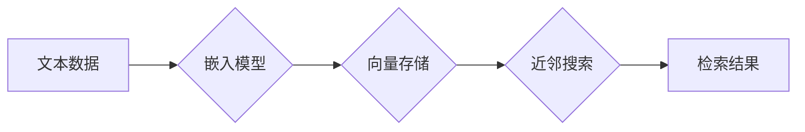

## 【LangChain编程：从入门到实践】向量存储

> 关键词：LangChain, 向量存储, Embedding, 近邻搜索, Faiss, Pinecone, Milvus, 应用场景

### 1. 背景介绍

随着大语言模型 (LLM) 的快速发展，其强大的文本理解和生成能力在各个领域展现出巨大的潜力。然而，LLM 的核心在于其庞大的参数量和海量文本数据训练。如何高效地存储和检索这些文本数据成为了一个关键问题。

向量存储技术应运而生，它将文本转换为高维向量，并通过高效的算法实现快速检索。LangChain 作为一款强大的开源LLM工具链，提供了丰富的向量存储组件，帮助开发者轻松地将文本数据嵌入到向量空间，并进行高效的检索和查询。

### 2. 核心概念与联系

#### 2.1 向量嵌入

向量嵌入 (Embedding) 是将文本转换为稠密向量的一种技术。每个词语或句子都对应一个唯一的向量，向量之间的距离反映了文本之间的语义相似度。常见的嵌入模型包括 Word2Vec, GloVe, BERT 等。

#### 2.2 近邻搜索

近邻搜索 (Nearest Neighbor Search) 是在高维向量空间中找到与给定向量最相似的向量的方法。它在向量存储中扮演着至关重要的角色，用于快速检索与查询文本语义相似的文档或信息。

#### 2.3 LangChain 向量存储组件

LangChain 提供了多种向量存储组件，例如 Faiss, Pinecone, Milvus 等，开发者可以根据自己的需求选择合适的组件。这些组件提供了高效的向量存储和检索功能，并支持多种数据格式和查询方式。

**向量存储架构图**



### 3. 核心算法原理 & 具体操作步骤

#### 3.1 算法原理概述

常见的向量存储算法包括：

* **KD-Tree:** 将向量空间划分成树形结构，通过遍历树结构进行快速检索。
* **Ball Tree:** 将向量空间划分成球形结构，通过遍历球形结构进行快速检索。
* **Annoy:** 基于层次聚类算法，构建索引树，实现快速检索。
* **Faiss:** Facebook AI Similarity Search，提供多种高效的近邻搜索算法，包括 IndexFlatL2, IndexIVFFlat, IndexHNSW 等。

#### 3.2 算法步骤详解

以 Faiss 的 IndexFlatL2 算法为例，其步骤如下：

1. **数据预处理:** 将文本数据转换为向量嵌入。
2. **索引构建:** 使用 Faiss 的 IndexFlatL2 函数构建索引，将向量数据存储在索引中。
3. **查询:** 提供查询向量，使用 Faiss 的 search 函数进行近邻搜索，返回与查询向量最相似的向量及其距离。

#### 3.3 算法优缺点

| 算法 | 优点 | 缺点 |
|---|---|---|
| KD-Tree | 简单易实现 | 高维空间性能下降 |
| Ball Tree | 性能优于 KD-Tree | 空间复杂度较高 |
| Annoy | 性能优于 KD-Tree 和 Ball Tree | 需要预先设置聚类数量 |
| Faiss | 高效、灵活、支持多种算法 | 需要一定的学习成本 |

#### 3.4 算法应用领域

向量存储技术广泛应用于：

* **搜索引擎:** 基于语义相似度进行文本搜索。
* **推荐系统:** 基于用户行为和物品特征进行推荐。
* **问答系统:** 基于知识图谱和文本语义进行问答。
* **聊天机器人:** 基于对话历史进行上下文理解和回复。

### 4. 数学模型和公式 & 详细讲解 & 举例说明

#### 4.1 数学模型构建

向量嵌入模型通常使用神经网络进行训练，其目标是学习一个映射函数，将文本转换为低维稠密向量。

假设文本数据为 $x = (x_1, x_2,..., x_n)$，其中 $x_i$ 为文本中的第 i 个词语。嵌入模型的目标是学习一个向量空间 $V$，并将每个词语 $x_i$ 映射到 $V$ 中的向量 $v_i$。

#### 4.2 公式推导过程

常用的嵌入模型包括 Word2Vec 和 GloVe。

* **Word2Vec:** 使用神经网络训练，目标是预测上下文词语。其损失函数为交叉熵损失函数。

* **GloVe:** 使用全局词语共现矩阵训练，目标是学习词语之间的语义关系。其损失函数为最大似然估计损失函数。

#### 4.3 案例分析与讲解

假设我们使用 Word2Vec 模型训练了一个词语嵌入模型，并将词语 "king" 映射到向量 $v_{king}$，词语 "queen" 映射到向量 $v_{queen}$。

根据向量嵌入模型的学习结果，我们可以发现 $v_{king}$ 和 $v_{queen}$ 之间的距离较小，因为 "king" 和 "queen" 在语义上是相似的。

### 5. 项目实践：代码实例和详细解释说明

#### 5.1 开发环境搭建

* Python 3.7+
* LangChain 0.0.20+
* Faiss 1.7.0+
* Pinecone 0.10.0+

#### 5.2 源代码详细实现

```python
from langchain.embeddings import OpenAIEmbeddings
from langchain.vectorstores import Pinecone

# 连接 Pinecone
pinecone.init(api_key="YOUR_PINECONE_API_KEY", environment="YOUR_PINECONE_ENVIRONMENT")

# 创建 OpenAI Embeddings 对象
embeddings = OpenAIEmbeddings()

# 创建 Pinecone 向量存储对象
vectorstore = Pinecone.from_documents(
    documents=[
        {"text": "This is a sample document."},
        {"text": "This is another sample document."},
    ],
    embedding=embeddings,
    index_name="my_index",
)

# 查询向量存储
query = "What is the meaning of life?"
query_embedding = embeddings.embed_query(query)
results = vectorstore.similarity_search(query_embedding, k=3)

# 打印结果
for result in results:
    print(result.page_content)
```

#### 5.3 代码解读与分析

* 首先，我们连接 Pinecone 向量存储服务，并初始化 OpenAI Embeddings 对象。
* 然后，我们使用 `from_documents` 方法创建 Pinecone 向量存储对象，并将文本数据嵌入到向量空间。
* 接着，我们使用 `similarity_search` 方法查询向量存储，并返回与查询向量最相似的文档。
* 最后，我们打印查询结果。

#### 5.4 运行结果展示

运行代码后，会返回与查询向量 "What is the meaning of life?" 最相似的文档。

### 6. 实际应用场景

#### 6.1 文本相似度搜索

在搜索引擎中，可以使用向量存储技术实现基于语义相似度的文本搜索。例如，用户搜索 "苹果手机"，系统可以返回与 "iPhone"、"苹果产品" 等词语语义相似的文档。

#### 6.2 文本分类

可以使用向量存储技术将文本数据分类。例如，可以将新闻文章分类为体育、财经、娱乐等类别。

#### 6.3 文本聚类

可以使用向量存储技术将文本数据聚类。例如，可以将用户评论聚类为正面、负面、中性等类别。

#### 6.4 文本生成

可以使用向量存储技术辅助文本生成。例如，可以根据给定的文本提示，从向量空间中检索与提示语义相似的文本，并将其作为生成文本的参考。

#### 6.5 未来应用展望

随着大语言模型和向量存储技术的不断发展，其应用场景将会更加广泛。例如，可以用于个性化推荐、智能问答、机器翻译、代码生成等领域。

### 7. 工具和资源推荐

#### 7.1 学习资源推荐

* **LangChain 文档:** https://python.langchain.com/docs/
* **Faiss 文档:** https://github.com/facebookresearch/faiss
* **Pinecone 文档:** https://www.pinecone.io/docs/

#### 7.2 开发工具推荐

* **Python:** https://www.python.org/
* **Jupyter Notebook:** https://jupyter.org/

#### 7.3 相关论文推荐

* **BERT: Pre-training of Deep Bidirectional Transformers for Language Understanding:** https://arxiv.org/abs/1810.04805
* **Annoy: Approximate Nearest Neighbors Oh Yeah:** https://arxiv.org/abs/1606.07243

### 8. 总结：未来发展趋势与挑战

#### 8.1 研究成果总结

向量存储技术在 LLMs 应用中发挥着重要作用，其高效的存储和检索能力为 LLMs 的发展提供了强有力的支撑。

#### 8.2 未来发展趋势

* **更高效的算法:** 研究更快速、更准确的近邻搜索算法。
* **更强大的嵌入模型:** 开发更强大的嵌入模型，能够更好地捕捉文本语义。
* **更灵活的向量存储:** 支持多种数据格式和查询方式的向量存储系统。

#### 8.3 面临的挑战

* **数据规模:** 随着文本数据的不断增长，向量存储系统的存储和检索能力面临挑战。
* **计算资源:** 高效的向量存储算法需要大量的计算资源。
* **模型复杂度:** 训练更强大的嵌入模型需要更复杂的模型架构和更大的训练数据。

#### 8.4 研究展望

未来，向量存储技术将继续朝着更高效、更强大、更灵活的方向发展，为 LLMs 的应用提供更强大的支持。

### 9. 附录：常见问题与解答

#### 9.1 如何选择合适的向量存储组件？

选择合适的向量存储组件需要根据实际应用场景和需求进行考虑。例如，如果需要高性能的近邻搜索，可以选择 Faiss 或 Milvus；如果需要易于使用的云端服务，可以选择 Pinecone。

#### 9.2 如何优化向量存储性能？

可以采用以下方法优化向量存储性能：

* 使用更有效的近邻搜索算法。
* 减少向量维度。
* 使用分片存储技术。
* 优化硬件配置。


作者：禅与计算机程序设计艺术 / Zen and the Art of Computer Programming 
