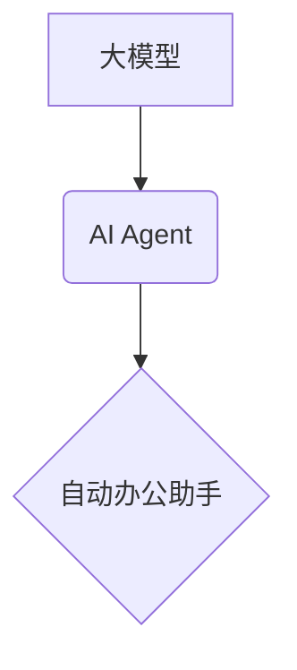

## 【大模型应用开发 动手做AI Agent】自动办公好助手

> 关键词：大模型、AI Agent、自动办公、自然语言处理、对话系统、应用开发、Python、Llama2

## 1. 背景介绍

随着人工智能技术的飞速发展，大模型已经成为推动科技进步的强大引擎。这些拥有海量参数的模型能够理解和生成人类语言，并完成各种复杂的任务，例如文本生成、翻译、问答等。然而，将大模型的强大能力转化为实际应用，并将其融入到人们的工作和生活中，仍然是一个重要的挑战。

自动办公助手作为一种应用场景，正逐渐受到人们的关注。它可以帮助人们自动化重复性工作，提高工作效率，并解放人力用于更具创造性和战略性的任务。传统的自动办公工具通常基于规则引擎，难以应对复杂、多变的工作场景。而大模型的出现为自动办公助手带来了新的可能性。

## 2. 核心概念与联系

### 2.1  大模型

大模型是指参数量达到数百万甚至数十亿的深度学习模型。它们通过训练海量文本数据，学习语言的结构和语义，从而能够理解和生成人类语言。常见的代表性大模型包括GPT-3、BERT、LaMDA等。

### 2.2  AI Agent

AI Agent是指能够感知环境、做出决策并执行行动的智能体。它可以是软件程序、机器人或其他智能系统。AI Agent的目标是通过学习和推理，自动完成特定的任务，并与环境进行交互。

### 2.3  自动办公助手

自动办公助手是一种基于AI Agent的智能工具，旨在帮助人们自动化办公任务，提高工作效率。它可以理解自然语言指令，并执行相应的操作，例如发送邮件、安排会议、整理文档等。

**核心概念关系图:**



## 3. 核心算法原理 & 具体操作步骤

### 3.1  算法原理概述

自动办公好助手的核心算法原理是基于大模型的自然语言理解和生成技术。它主要包括以下几个步骤：

1. **自然语言输入:** 用户使用自然语言输入指令或问题。
2. **文本预处理:** 对用户输入进行清洗、分词、词性标注等预处理，以便大模型理解。
3. **语义理解:** 利用大模型的语义理解能力，解析用户输入的意图和需求。
4. **任务执行:** 根据语义理解的结果，调用相应的API或执行代码，完成用户的指令或任务。
5. **自然语言输出:** 将执行结果以自然语言的形式反馈给用户。

### 3.2  算法步骤详解

1. **自然语言输入:** 用户可以通过文本框、语音输入等方式向自动办公助手输入指令或问题。例如，用户可以输入“发送一封邮件给张三，主题是会议通知，内容是……”。

2. **文本预处理:** 系统会对用户输入进行以下处理：
    * **清洗:** 去除标点符号、空格等无关字符。
    * **分词:** 将文本分割成一个个独立的词语或短语。
    * **词性标注:** 为每个词语标注其词性，例如名词、动词、形容词等。

3. **语义理解:** 利用大模型的语义理解能力，解析用户输入的意图和需求。例如，对于“发送一封邮件给张三，主题是会议通知，内容是……”的输入，系统可以理解用户的意图是发送邮件，邮件的收件人、主题和内容分别对应张三、会议通知和后面的文本内容。

4. **任务执行:** 根据语义理解的结果，系统调用相应的API或执行代码，完成用户的指令或任务。例如，系统会调用邮件发送API，将邮件发送给张三。

5. **自然语言输出:** 系统将执行结果以自然语言的形式反馈给用户。例如，系统会回复“邮件已发送成功”。

### 3.3  算法优缺点

**优点:**

* **自然语言交互:** 用户可以使用自然语言与系统进行交互，更加方便直观。
* **灵活可扩展:** 可以根据不同的需求，添加新的功能和指令。
* **智能化程度高:** 大模型的语义理解能力能够处理更复杂、更灵活的指令。

**缺点:**

* **模型训练成本高:** 大模型的训练需要大量的计算资源和数据。
* **推理速度慢:** 大模型的推理速度相对较慢，可能导致用户体验不佳。
* **安全性和隐私性问题:** 大模型可能存在安全性和隐私性问题，需要进行相应的防护措施。

### 3.4  算法应用领域

大模型驱动的自动办公助手具有广泛的应用领域，例如：

* **企业办公:** 自动化邮件发送、日程安排、文档处理等任务。
* **个人助理:** 帮助用户管理日程、提醒事项、查找信息等。
* **客服机器人:** 自动回复用户咨询，提供快速便捷的服务。
* **教育领域:** 自动批改作业、提供个性化学习辅导等。

## 4. 数学模型和公式 & 详细讲解 & 举例说明

### 4.1  数学模型构建

大模型的训练通常基于Transformer模型架构，其核心是自注意力机制。自注意力机制允许模型在处理文本序列时，关注不同位置的词语之间的关系，从而更好地理解上下文信息。

**公式:**

$$
Attention(Q, K, V) = \frac{exp(Q \cdot K^T / \sqrt{d_k})}{exp(Q \cdot K^T / \sqrt{d_k})} \cdot V
$$

其中：

* $Q$：查询矩阵
* $K$：键矩阵
* $V$：值矩阵
* $d_k$：键向量的维度

**讲解:**

自注意力机制通过计算查询向量与键向量的点积，并将其进行softmax归一化，得到每个词语对其他词语的注意力权重。然后，将注意力权重与值向量进行加权求和，得到最终的输出向量。

**举例说明:**

假设我们有一个句子“我爱吃苹果”，其词语向量分别为：

* 我：$Q_1$
* 爱：$K_1$
* 吃：$V_1$
* 苹果：$Q_2$

通过自注意力机制，模型可以计算出每个词语对其他词语的注意力权重，例如，“我”对“爱”的注意力权重可能较高，因为它们在语义上紧密相关。最终，模型会得到每个词语的上下文向量，从而更好地理解句子的整体含义。

### 4.2  公式推导过程

自注意力机制的公式推导过程较为复杂，涉及到线性变换、矩阵乘法、softmax函数等操作。详细的推导过程可以参考相关文献，例如Vaswani et al. (2017)的论文《Attention Is All You Need》。

### 4.3  案例分析与讲解

在实际应用中，大模型驱动的自动办公助手可以根据用户的指令，执行各种复杂的任务。例如，用户可以输入“帮我总结一下这篇会议纪要”，系统会利用大模型的文本理解和生成能力，自动总结会议纪要的主要内容。

## 5. 项目实践：代码实例和详细解释说明

### 5.1  开发环境搭建

为了开发大模型驱动的自动办公助手，需要搭建相应的开发环境。常用的开发环境包括：

* **Python:** 大模型开发通常使用Python语言。
* **深度学习框架:** TensorFlow、PyTorch等深度学习框架可以用于训练和部署大模型。
* **自然语言处理库:** NLTK、spaCy等自然语言处理库可以用于文本预处理、语义理解等任务。

### 5.2  源代码详细实现

以下是一个简单的自动办公助手代码示例，使用Python和Llama2模型：

```python
from llama_index import SimpleDirectoryReader, VectorStoreIndex
from llama_index.llms import Llama2Index

# 加载数据
reader = SimpleDirectoryReader("data")
index = VectorStoreIndex.from_documents(reader.load_data(), llm=Llama2Index(model_path="path/to/llama2"))

# 用户输入
user_input = input("请输入指令: ")

# 查询模型
response = index.query(user_input)

# 输出结果
print(response)
```

**代码解读与分析:**

1. **导入库:** 导入必要的库，例如llama_index用于管理大模型索引，Llama2Index用于加载Llama2模型。
2. **加载数据:** 使用SimpleDirectoryReader加载数据，并将其索引到VectorStoreIndex中。
3. **用户输入:** 获取用户的指令输入。
4. **查询模型:** 使用index.query()方法查询模型，并获取响应结果。
5. **输出结果:** 将响应结果打印到屏幕上。

### 5.3  代码运行结果展示

当用户输入“你好”时，模型可能会输出“你好！很高兴见到你”。

## 6. 实际应用场景

### 6.1  企业办公场景

* **邮件自动化:** 自动回复邮件、发送会议通知、整理邮件收件箱等。
* **日程安排:** 自动安排会议、提醒重要事项、生成日程表等。
* **文档处理:** 自动提取文本信息、总结文档内容、翻译文档等。

### 6.2  个人助理场景

* **日程管理:** 自动提醒待办事项、安排约会、生成待办事项清单等。
* **信息查找:** 自动搜索网络信息、查找文件、整理笔记等。
* **娱乐休闲:** 自动推荐电影、音乐、书籍等。

### 6.3  客服机器人场景

* **自动回复:** 自动回复常见问题、提供产品信息、引导用户操作等。
* **情绪识别:** 识别用户的语气和情绪，提供更精准的回复。
* **对话流管理:** 管理对话流程，引导用户完成特定任务。

### 6.4  未来应用展望

随着大模型技术的不断发展，自动办公助手将拥有更强大的功能和更广泛的应用场景。例如：

* **更智能的自然语言理解:** 能够理解更复杂、更模糊的自然语言指令。
* **更个性化的服务:** 根据用户的习惯和偏好，提供个性化的服务。
* **跨平台协作:** 支持跨平台、跨设备的协作办公。

## 7. 工具和资源推荐

### 7.1  学习资源推荐

* **书籍:**
    * 《深度学习》
    * 《自然语言处理》
    * 《Transformer模型》
* **在线课程:**
    * Coursera
    * edX
    * fast.ai

### 7.2  开发工具推荐

* **Python:** 
* **TensorFlow:** 
* **PyTorch:** 
* **llama_index:** 

### 7.3  相关论文推荐

* **Attention Is All You Need:** https://arxiv.org/abs/1706.03762
* **BERT: Pre-training of Deep Bidirectional Transformers for Language Understanding:** https://arxiv.org/abs/1810.04805
* **GPT-3: Language Models are Few-Shot Learners:** https://arxiv.org/abs/2005.14165

## 8. 总结：未来发展趋势与挑战

### 8.1  研究成果总结

大模型驱动的自动办公助手已经取得了显著的成果，能够完成各种复杂的任务，并提高工作效率。

### 8.2  未来发展趋势

未来，自动办公助手将朝着以下方向发展：

* **更强大的模型能力:** 模型参数量将继续增加，模型能力将进一步提升。
* **更智能的交互方式:** 支持语音、图像、视频等多模态交互。
* **更个性化的服务:** 根据用户的习惯和偏好，提供个性化的服务。
* **更广泛的应用场景:** 应用场景将扩展到更多领域，例如教育、医疗、金融等。

### 8.3  面临的挑战

大模型驱动的自动办公助手也面临着一些挑战：

* **模型训练成本高:** 训练大模型