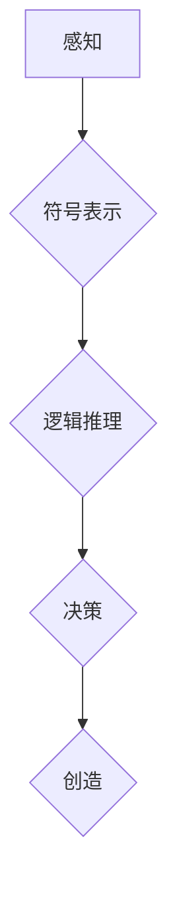

## 从简单到深刻的认知发展

> 关键词：人工智能、认知科学、深度学习、神经网络、知识表示、推理、决策、自然语言处理

## 1. 背景介绍

人工智能（AI）的发展日新月异，从简单的规则系统到如今的深度学习模型，我们不断朝着更智能、更接近人类认知的目标迈进。然而，人工智能的本质是什么？它如何学习和理解世界？这些问题一直是人工智能领域的核心议题。

认知科学致力于理解人类思维、学习、记忆和决策等认知过程。近年来，认知科学与人工智能的交叉融合，催生了新的研究方向，旨在构建能够像人类一样思考、学习和解决问题的智能系统。

## 2. 核心概念与联系

**2.1 认知发展阶段**

认知发展是一个从简单到深刻的渐进过程，可以分为以下几个阶段：

* **感知阶段:**  智能体通过感官获取信息，对周围环境进行基本的感知和识别。
* **符号阶段:** 智能体开始使用符号来表示和理解信息，例如语言、图像和数学符号。
* **推理阶段:** 智能体能够进行逻辑推理，从已知信息推导出新的知识。
* **决策阶段:** 智能体能够根据目标和环境信息做出决策。
* **创造阶段:** 智能体能够产生新的想法、概念和解决方案。

**2.2 人工智能与认知科学的联系**

人工智能借鉴了认知科学的理论和方法，试图构建能够模拟人类认知过程的智能系统。例如：

* **深度学习:** 深度学习模型通过多层神经网络学习复杂的特征表示，类似于人类大脑的神经元网络。
* **知识图谱:** 知识图谱是一种结构化的知识表示形式，可以存储和推理关于实体和关系的信息，类似于人类的知识库。
* **自然语言处理:** 自然语言处理旨在使计算机能够理解和生成人类语言，类似于人类的语言理解和生成能力。

**2.3  Mermaid 流程图**



## 3. 核心算法原理 & 具体操作步骤

**3.1 算法原理概述**

深度学习算法是人工智能领域的核心算法之一，它通过多层神经网络学习复杂的特征表示，从而实现对数据的理解和预测。

**3.2 算法步骤详解**

1. **数据预处理:** 将原始数据转换为深度学习模型可以理解的形式，例如归一化、编码等。
2. **网络结构设计:** 根据任务需求设计神经网络的结构，包括层数、节点数、激活函数等。
3. **参数初始化:** 为神经网络中的参数进行随机初始化。
4. **前向传播:** 将输入数据通过神经网络传递，计算输出结果。
5. **损失函数计算:** 计算模型输出与真实值的差异，即损失值。
6. **反向传播:** 根据损失值，调整神经网络参数，使模型输出更接近真实值。
7. **迭代训练:** 重复前向传播、损失函数计算和反向传播的过程，直到模型达到预设的性能指标。

**3.3 算法优缺点**

**优点:**

* 能够学习复杂的非线性关系。
* 具有强大的泛化能力。
* 在图像识别、自然语言处理等领域取得了突破性进展。

**缺点:**

* 需要大量的训练数据。
* 训练过程耗时且资源消耗大。
* 模型解释性较差。

**3.4 算法应用领域**

* **图像识别:** 人脸识别、物体检测、图像分类等。
* **自然语言处理:** 机器翻译、文本摘要、情感分析等。
* **语音识别:** 语音转文本、语音助手等。
* **推荐系统:** 商品推荐、内容推荐等。
* **医疗诊断:** 病情预测、疾病诊断等。

## 4. 数学模型和公式 & 详细讲解 & 举例说明

**4.1 数学模型构建**

深度学习模型可以看作是一个复杂的数学函数，其输入是数据，输出是预测结果。

**4.2 公式推导过程**

深度学习模型的训练过程基于梯度下降算法，其核心公式为：

$$
\theta = \theta - \alpha \nabla L(\theta)
$$

其中：

* $\theta$ 是模型参数。
* $\alpha$ 是学习率。
* $L(\theta)$ 是损失函数。
* $\nabla L(\theta)$ 是损失函数对参数的梯度。

**4.3 案例分析与讲解**

假设我们训练一个简单的线性回归模型，其目标是预测房价。模型的输入是房屋面积，输出是房价。

损失函数可以定义为均方误差：

$$
L(\theta) = \frac{1}{n} \sum_{i=1}^{n} (y_i - \hat{y}_i)^2
$$

其中：

* $n$ 是样本数量。
* $y_i$ 是第 $i$ 个样本的真实房价。
* $\hat{y}_i$ 是模型预测的第 $i$ 个样本的房价。

梯度下降算法会迭代更新模型参数，使损失函数最小化。

## 5. 项目实践：代码实例和详细解释说明

**5.1 开发环境搭建**

使用 Python 语言和 TensorFlow 或 PyTorch 深度学习框架进行开发。

**5.2 源代码详细实现**

```python
import tensorflow as tf

# 定义模型
model = tf.keras.models.Sequential([
    tf.keras.layers.Dense(units=64, activation='relu', input_shape=(1,)),
    tf.keras.layers.Dense(units=1)
])

# 编译模型
model.compile(optimizer='adam', loss='mse')

# 训练模型
model.fit(x_train, y_train, epochs=10)

# 评估模型
loss = model.evaluate(x_test, y_test)
```

**5.3 代码解读与分析**

* 使用 TensorFlow 框架构建一个简单的线性回归模型。
* 模型包含两层全连接神经网络，第一层有 64 个神经元，使用 ReLU 激活函数，输入维度为 1。
* 第二层只有一个神经元，输出房价。
* 使用 Adam 优化器和均方误差损失函数进行训练。
* 训练模型 10 个 epochs。
* 使用测试数据评估模型性能。

**5.4 运行结果展示**

训练完成后，可以查看模型的损失值和预测结果，评估模型的性能。

## 6. 实际应用场景

深度学习算法在各个领域都有广泛的应用，例如：

* **医疗诊断:** 深度学习模型可以用于分析医学图像，辅助医生诊断疾病。
* **金融风险控制:** 深度学习模型可以用于识别欺诈交易和评估风险。
* **自动驾驶:** 深度学习模型可以用于感知周围环境、规划路径和控制车辆。

**6.4 未来应用展望**

随着人工智能技术的不断发展，深度学习算法将在更多领域得到应用，例如：

* **个性化教育:** 深度学习模型可以根据学生的学习情况提供个性化的学习方案。
* **智能客服:** 深度学习模型可以用于构建智能客服系统，提供更便捷的客户服务。
* **科学研究:** 深度学习模型可以用于加速科学研究，例如药物研发和材料设计。

## 7. 工具和资源推荐

**7.1 学习资源推荐**

* **书籍:**
    * 深度学习
    * 人工智能：一种现代方法
* **在线课程:**
    * Coursera 深度学习课程
    * Udacity 深度学习工程师 Nanodegree

**7.2 开发工具推荐**

* **TensorFlow:** 开源深度学习框架
* **PyTorch:** 开源深度学习框架
* **Keras:** 高级深度学习 API

**7.3 相关论文推荐**

* **ImageNet Classification with Deep Convolutional Neural Networks**
* **Attention Is All You Need**
* **BERT: Pre-training of Deep Bidirectional Transformers for Language Understanding**

## 8. 总结：未来发展趋势与挑战

**8.1 研究成果总结**

深度学习算法取得了显著的成果，在图像识别、自然语言处理等领域取得了突破性进展。

**8.2 未来发展趋势**

* **模型效率提升:** 研究更轻量级、更高效的深度学习模型。
* **数据安全与隐私保护:** 研究如何保护数据安全和隐私，在深度学习模型训练和应用中。
* **模型解释性增强:** 研究如何提高深度学习模型的解释性，使模型决策更加透明。

**8.3 面临的挑战**

* **数据获取和标注:** 深度学习模型需要大量的训练数据，数据获取和标注成本高昂。
* **模型泛化能力:** 深度学习模型容易过拟合，泛化能力不足。
* **伦理问题:** 深度学习模型的应用可能带来伦理问题，例如算法偏见和责任归属。

**8.4 研究展望**

未来，人工智能研究将继续朝着更智能、更安全、更可解释的方向发展。深度学习算法将继续发挥重要作用，并与其他人工智能技术融合，构建更强大的智能系统。

## 9. 附录：常见问题与解答

**9.1 什么是深度学习？**

深度学习是一种机器学习的子领域，它使用多层神经网络学习复杂的特征表示。

**9.2 深度学习的优势是什么？**

深度学习能够学习复杂的非线性关系，具有强大的泛化能力。

**9.3 深度学习的应用领域有哪些？**

深度学习在图像识别、自然语言处理、语音识别、推荐系统等领域都有广泛的应用。


作者：禅与计算机程序设计艺术 / Zen and the Art of Computer Programming 
