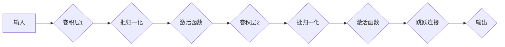

## 从零开始大模型开发与微调：ResNet网络的实现

> 关键词：ResNet, 深度学习, 计算机视觉, 卷积神经网络, 残差连接, 迁移学习, 模型微调

## 1. 背景介绍

深度学习近年来在计算机视觉领域取得了突破性的进展，卷积神经网络（CNN）作为深度学习的核心模型，在图像分类、目标检测、图像分割等任务中展现出强大的性能。然而，随着网络深度的增加，训练过程会面临梯度消失和梯度爆炸等问题，限制了网络的进一步发展。

为了解决这些问题，微软研究人员于2015年提出了ResNet（Residual Network），一种具有残差连接的深度卷积神经网络架构。ResNet的引入标志着深度学习的又一次飞跃，其在ImageNet图像分类任务上的表现远远超过了当时最先进的模型，并开启了深度网络的快速发展。

## 2. 核心概念与联系

ResNet的核心思想是通过残差连接来缓解梯度消失和梯度爆炸问题，使得网络能够更有效地训练更深的网络结构。

**2.1 残差连接（Residual Connection）**

残差连接是一种特殊的连接方式，它将网络的输入直接连接到网络的输出，形成一个跳跃连接。残差连接的引入使得网络能够学习残差映射，即学习输入到输出之间的差异。

**2.2 ResNet架构**

ResNet的架构由多个残差块（Residual Block）组成，每个残差块包含两个或多个卷积层和一个跳跃连接。

**2.3 Mermaid 流程图**



## 3. 核心算法原理 & 具体操作步骤

### 3.1 算法原理概述

ResNet的核心算法原理是利用残差连接来学习残差映射，从而缓解梯度消失和梯度爆炸问题。

残差连接的引入使得网络能够学习输入到输出之间的差异，而不是直接学习输入到输出的映射。这种学习方式使得网络能够更有效地训练更深的网络结构。

### 3.2 算法步骤详解

1. **输入数据预处理:** 将输入图像进行尺寸调整、归一化等预处理操作。
2. **构建残差块:** 将多个卷积层和一个跳跃连接组合成一个残差块。
3. **堆叠残差块:** 将多个残差块堆叠在一起，形成整个ResNet网络结构。
4. **训练网络:** 使用训练数据训练ResNet网络，通过反向传播算法更新网络参数。
5. **评估网络性能:** 使用测试数据评估ResNet网络的性能，例如准确率、召回率等。

### 3.3 算法优缺点

**优点:**

* 缓解梯度消失和梯度爆炸问题，使得网络能够训练更深。
* 表现优异，在ImageNet图像分类任务上取得了突破性进展。
* 具有良好的可迁移性，可以应用于其他计算机视觉任务。

**缺点:**

* 训练时间较长，需要大量的计算资源。
* 模型参数量较大，部署成本较高。

### 3.4 算法应用领域

ResNet在计算机视觉领域有着广泛的应用，例如：

* **图像分类:** ResNet可以用于识别图像中的物体类别。
* **目标检测:** ResNet可以用于定位图像中的目标物体。
* **图像分割:** ResNet可以用于将图像分割成不同的区域。
* **图像生成:** ResNet可以用于生成新的图像。

## 4. 数学模型和公式 & 详细讲解 & 举例说明

### 4.1 数学模型构建

ResNet的数学模型可以表示为一个多层卷积神经网络，其中每个残差块可以表示为一个函数：

$$F(x) = H(x) + x$$

其中：

* $x$ 是残差块的输入。
* $H(x)$ 是残差块的输出，由多个卷积层和激活函数组成。

### 4.2 公式推导过程

残差连接的引入使得网络能够学习残差映射，即学习输入到输出之间的差异。

$$
\begin{aligned}
F(x) &= H(x) + x \\
&= (W_1 * x + b_1) + ReLU(W_2 * x + b_2) + x \\
&= (W_1 * x + b_1) + ReLU(W_2 * x + b_2) + x
\end{aligned}
$$

其中：

* $W_1$ 和 $W_2$ 是卷积核。
* $b_1$ 和 $b_2$ 是偏置项。
* $ReLU$ 是激活函数。

### 4.3 案例分析与讲解

假设输入图像为 $x$，经过一个残差块后，输出为 $F(x)$。

如果 $H(x)$ 为零，则 $F(x) = x$，表示网络没有学习到任何特征。

如果 $H(x)$ 不为零，则 $F(x)$ 与 $x$ 的差异代表了网络学习到的特征。

## 5. 项目实践：代码实例和详细解释说明

### 5.1 开发环境搭建

ResNet的开发环境搭建需要以下软件：

* Python 3.x
* TensorFlow 或 PyTorch 深度学习框架
* CUDA 和 cuDNN GPU加速库

### 5.2 源代码详细实现

ResNet的源代码实现可以使用TensorFlow或PyTorch框架进行编写。

以下是一个使用TensorFlow实现ResNet-18网络结构的代码示例：

```python
import tensorflow as tf

def residual_block(input_tensor, filters):
  # 实现残差块的逻辑
  #...

def ResNet18(input_shape):
  # 实现ResNet-18网络结构
  #...

# 实例化ResNet-18网络
model = ResNet18(input_shape=(224, 224, 3))

# 打印网络结构
model.summary()
```

### 5.3 代码解读与分析

代码示例中，`residual_block`函数实现了一个残差块的逻辑，`ResNet18`函数实现了一个ResNet-18网络结构。

ResNet-18网络结构由多个残差块堆叠而成，每个残差块包含两个或多个卷积层和一个跳跃连接。

### 5.4 运行结果展示

训练ResNet-18网络后，可以使用测试数据评估网络的性能，例如准确率、召回率等。

## 6. 实际应用场景

ResNet在实际应用场景中有着广泛的应用，例如：

* **图像分类:** ResNet可以用于识别图像中的物体类别，例如在自动驾驶汽车中识别道路标志、在医疗领域识别病灶等。
* **目标检测:** ResNet可以用于定位图像中的目标物体，例如在视频监控中检测入侵者、在零售领域识别商品等。
* **图像分割:** ResNet可以用于将图像分割成不同的区域，例如在医学影像分析中分割器官、在遥感图像分析中分割土地类型等。

### 6.4 未来应用展望

随着深度学习技术的不断发展，ResNet的应用场景将会更加广泛，例如：

* **生成式对抗网络 (GAN):** ResNet可以作为GAN的生成器或判别器，用于生成高质量的图像。
* **视频分析:** ResNet可以用于分析视频内容，例如识别视频中的动作、检测视频中的异常事件等。
* **自然语言处理:** ResNet可以用于处理自然语言文本，例如文本分类、情感分析等。

## 7. 工具和资源推荐

### 7.1 学习资源推荐

* **书籍:**
    * Deep Learning by Ian Goodfellow, Yoshua Bengio, and Aaron Courville
    * Deep Learning with Python by Francois Chollet
* **在线课程:**
    * Coursera: Deep Learning Specialization
    * Udacity: Deep Learning Nanodegree
* **博客:**
    * https://blog.openai.com/
    * https://www.tensorflow.org/blog

### 7.2 开发工具推荐

* **TensorFlow:** https://www.tensorflow.org/
* **PyTorch:** https://pytorch.org/
* **Keras:** https://keras.io/

### 7.3 相关论文推荐

* **Deep Residual Learning for Image Recognition** by Kaiming He et al. (2015)

## 8. 总结：未来发展趋势与挑战

### 8.1 研究成果总结

ResNet的提出标志着深度学习的又一次飞跃，其在计算机视觉领域取得了突破性的进展，并开启了深度网络的快速发展。

### 8.2 未来发展趋势

ResNet的未来发展趋势包括：

* **更深的网络结构:** 研究更深的ResNet网络结构，以提高网络的表达能力。
* **新的残差连接方式:** 研究新的残差连接方式，以进一步缓解梯度消失和梯度爆炸问题。
* **高效的训练方法:** 研究更有效的训练方法，以降低ResNet的训练时间和计算资源消耗。

### 8.3 面临的挑战

ResNet的发展也面临着一些挑战，例如：

* **过拟合:** 深度网络容易过拟合，需要采用正则化技术和数据增强等方法来缓解。
* **计算资源消耗:** 训练深度网络需要大量的计算资源，这对于资源有限的场景是一个挑战。
* **可解释性:** 深度网络的决策过程难以解释，这对于一些安全关键的应用场景是一个挑战。

### 8.4 研究展望

未来，ResNet的研究将继续朝着更深、更广、更强、更智能的方向发展，并将在更多领域得到应用。


## 9. 附录：常见问题与解答

**Q1: ResNet的残差连接有什么作用？**

**A1:** 残差连接可以缓解梯度消失和梯度爆炸问题，使得网络能够训练更深。

**Q2: ResNet的网络结构有哪些？**

**A2:** ResNet有不同的网络结构，例如ResNet-18、ResNet-34、ResNet-50、ResNet-101、ResNet-152等。

**Q3: 如何训练ResNet网络？**

**A3:** 使用训练数据训练ResNet网络，通过反向传播算法更新网络参数。

**Q4: ResNet的应用场景有哪些？**

**A4:** ResNet在图像分类、目标检测、图像分割等计算机视觉任务中有着广泛的应用。


作者：禅与计算机程序设计艺术 / Zen and the Art of Computer Programming 
