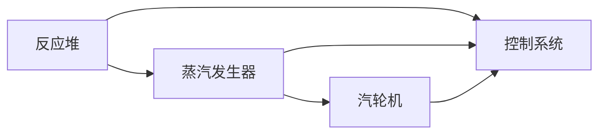

# 核电DCS系统结构分析方法研究

## 1. 背景介绍

### 1.1 问题的由来

核电站作为一种重要的能源来源，其安全性和可靠性至关重要。分布式控制系统 (DCS) 作为核电站的核心控制系统，其结构和功能直接影响着整个核电站的安全运行。随着核电站规模的不断扩大和技术水平的不断提升，对DCS系统结构分析方法提出了更高的要求。

传统的DCS系统结构分析方法往往依赖于经验和人工分析，效率低下，难以满足现代核电站日益复杂的控制需求。因此，研究一种高效、科学的DCS系统结构分析方法，对于提高核电站安全性和可靠性具有重要意义。

### 1.2 研究现状

近年来，国内外学者在DCS系统结构分析方法方面进行了大量的研究，取得了一定的成果。例如，基于Petri网的DCS系统结构分析方法、基于UML的DCS系统结构分析方法、基于模型驱动的DCS系统结构分析方法等。

然而，现有的方法仍然存在一些不足，例如：

* **缺乏统一的分析框架和标准**，导致不同方法之间难以相互比较和借鉴。
* **对复杂系统分析能力有限**，难以有效地分析大型、复杂的DCS系统。
* **对系统动态行为分析不足**，难以有效地评估系统安全性。

### 1.3 研究意义

本研究旨在提出一种基于图论和模型驱动的DCS系统结构分析方法，旨在解决现有方法的不足，为核电站DCS系统设计和安全评估提供理论和方法支撑。

本研究的意义在于：

* **提供一种科学、高效的DCS系统结构分析方法**，提高分析效率和准确性。
* **建立统一的分析框架和标准**，促进不同方法之间的相互比较和借鉴。
* **增强对复杂系统分析能力**，有效地分析大型、复杂的DCS系统。
* **加强对系统动态行为分析**，有效地评估系统安全性。

### 1.4 本文结构

本文将从以下几个方面展开对核电DCS系统结构分析方法的研究：

* **第二章：核心概念与联系**，介绍DCS系统结构分析方法的核心概念，并分析其与相关领域的关系。
* **第三章：核心算法原理 & 具体操作步骤**，详细阐述基于图论和模型驱动的DCS系统结构分析方法的算法原理和操作步骤。
* **第四章：数学模型和公式 & 详细讲解 & 举例说明**，构建DCS系统结构分析的数学模型，并通过公式推导和案例分析进行详细讲解。
* **第五章：项目实践：代码实例和详细解释说明**，提供基于该方法的代码实例，并对代码进行详细解释说明。
* **第六章：实际应用场景**，介绍该方法在实际核电站DCS系统中的应用场景。
* **第七章：工具和资源推荐**，推荐一些与该方法相关的学习资源、开发工具、论文和书籍。
* **第八章：总结：未来发展趋势与挑战**，总结研究成果，展望未来发展趋势，并分析该方法面临的挑战。
* **第九章：附录：常见问题与解答**，解答一些常见问题。

## 2. 核心概念与联系

### 2.1 DCS系统结构分析方法

DCS系统结构分析方法是指对DCS系统进行结构分解、功能划分、数据流分析、控制逻辑分析等，以理解系统结构、功能和行为的一种方法。

### 2.2 相关领域

DCS系统结构分析方法与以下领域密切相关：

* **控制理论**：为DCS系统结构分析提供理论基础，例如控制系统稳定性、可控性、可观测性等。
* **软件工程**：为DCS系统结构分析提供软件设计和开发方法，例如UML建模、软件架构设计等。
* **系统工程**：为DCS系统结构分析提供系统分析和设计方法，例如系统建模、系统仿真等。
* **图论**：为DCS系统结构分析提供数学工具，例如图的表示、图的遍历、图的匹配等。
* **模型驱动开发 (MDD)**：为DCS系统结构分析提供自动化工具和方法，例如模型转换、代码生成等。

## 3. 核心算法原理 & 具体操作步骤

### 3.1 算法原理概述

本研究提出的基于图论和模型驱动的DCS系统结构分析方法，主要基于以下原理：

* **将DCS系统抽象为图模型**，节点表示系统组件，边表示组件之间的连接关系。
* **利用图论算法分析图模型**，例如图的遍历、图的匹配等，以识别系统结构、功能和行为。
* **利用模型驱动开发技术**，自动生成代码、文档和测试用例，提高分析效率和准确性。

### 3.2 算法步骤详解

该方法主要包括以下步骤：

1. **系统建模**：将DCS系统抽象为图模型，包括节点和边。
2. **图模型分析**：利用图论算法分析图模型，识别系统结构、功能和行为。
3. **模型转换**：将图模型转换为其他模型，例如UML模型、Petri网模型等。
4. **代码生成**：自动生成代码、文档和测试用例。
5. **验证和评估**：对分析结果进行验证和评估，确保其准确性和可靠性。

### 3.3 算法优缺点

该方法具有以下优点：

* **科学性**：基于图论和模型驱动开发技术，具有严密的数学基础和逻辑推理。
* **高效性**：利用自动化工具和方法，提高分析效率。
* **准确性**：通过模型转换和代码生成，提高分析结果的准确性。
* **可扩展性**：适用于不同规模和复杂度的DCS系统。

该方法也存在一些不足：

* **模型构建复杂度**：对于大型、复杂的DCS系统，模型构建可能比较困难。
* **算法复杂度**：一些图论算法的复杂度较高，可能影响分析效率。
* **工具依赖性**：该方法依赖于模型驱动开发工具，需要一定的工具学习成本。

### 3.4 算法应用领域

该方法适用于以下领域：

* **DCS系统设计**：帮助设计人员理解系统结构、功能和行为，提高系统设计效率和质量。
* **DCS系统安全评估**：帮助安全评估人员识别系统安全隐患，提高系统安全性。
* **DCS系统故障诊断**：帮助故障诊断人员快速定位故障，提高故障诊断效率。
* **DCS系统升级改造**：帮助升级改造人员评估系统升级改造的影响，确保系统升级改造的安全性。

## 4. 数学模型和公式 & 详细讲解 & 举例说明

### 4.1 数学模型构建

#### 4.1.1 图模型构建

将DCS系统抽象为一个有向图 $G = (V,E)$，其中：

* $V$ 表示节点集合，每个节点代表一个DCS系统组件，例如控制器、传感器、执行器等。
* $E$ 表示边集合，每条边代表两个节点之间的连接关系，例如数据流、控制信号等。

#### 4.1.2 节点属性

每个节点 $v \in V$ 具有以下属性：

* **类型**：表示节点的类型，例如控制器、传感器、执行器等。
* **功能**：表示节点的功能，例如数据采集、数据处理、控制输出等。
* **参数**：表示节点的参数，例如控制参数、传感器参数等。

#### 4.1.3 边属性

每条边 $e \in E$ 具有以下属性：

* **类型**：表示边的类型，例如数据流、控制信号等。
* **方向**：表示数据流或控制信号的方向。
* **数据类型**：表示数据流或控制信号的数据类型。
* **参数**：表示数据流或控制信号的参数，例如数据采样频率、控制信号幅值等。

### 4.2 公式推导过程

#### 4.2.1 系统结构分析

利用图论算法，例如图的遍历、图的匹配等，可以分析DCS系统结构，识别系统组件之间的连接关系、数据流和控制信号。

#### 4.2.2 系统功能分析

通过分析节点的功能和边的数据类型，可以识别系统功能，例如数据采集、数据处理、控制输出等。

#### 4.2.3 系统行为分析

通过分析边的数据流和控制信号，可以识别系统行为，例如控制逻辑、数据交换等。

### 4.3 案例分析与讲解

#### 4.3.1 案例描述

以一个简单的核电站DCS系统为例，该系统包括以下组件：

* **反应堆**：负责核反应过程。
* **蒸汽发生器**：将反应堆产生的热量传递给水，产生蒸汽。
* **汽轮机**：利用蒸汽驱动发电机发电。
* **控制系统**：控制反应堆、蒸汽发生器和汽轮机的工作状态。

#### 4.3.2 图模型构建

该系统可以抽象为以下图模型：



#### 4.3.3 系统结构分析

利用图论算法，例如深度优先搜索 (DFS)，可以识别系统组件之间的连接关系。例如，从反应堆节点出发，可以遍历到蒸汽发生器、汽轮机和控制系统节点。

#### 4.3.4 系统功能分析

通过分析节点的功能和边的数据类型，可以识别系统功能。例如，反应堆节点的功能是进行核反应，蒸汽发生器节点的功能是将热量传递给水，汽轮机节点的功能是驱动发电机发电，控制系统节点的功能是控制其他组件的工作状态。

#### 4.3.5 系统行为分析

通过分析边的数据流和控制信号，可以识别系统行为。例如，反应堆节点向控制系统节点发送反应堆状态数据，控制系统节点根据反应堆状态数据调整反应堆功率。

### 4.4 常见问题解答

#### 4.4.1 如何选择合适的图论算法？

选择合适的图论算法取决于分析目标。例如，如果目标是识别系统组件之间的连接关系，可以使用深度优先搜索 (DFS) 或广度优先搜索 (BFS) 算法。如果目标是识别系统中的循环，可以使用循环检测算法。

#### 4.4.2 如何处理复杂的DCS系统？

对于复杂的DCS系统，可以将其分解为多个子系统，分别进行分析，然后将子系统分析结果进行整合。

#### 4.4.3 如何保证分析结果的准确性？

可以通过模型验证和代码生成来保证分析结果的准确性。模型验证可以利用模型检查工具进行，代码生成可以利用模型驱动开发工具进行。

## 5. 项目实践：代码实例和详细解释说明

### 5.1 开发环境搭建

#### 5.1.1 软件环境

* Python 3.x
* NetworkX 库
* Graphviz 库

#### 5.1.2 安装软件

使用 pip 命令安装软件：

```bash
pip install networkx graphviz
```

### 5.2 源代码详细实现

#### 5.2.1 代码示例

```python
import networkx as nx
import matplotlib.pyplot as plt

# 创建图模型
G = nx.DiGraph()

# 添加节点
G.add_node("反应堆", type="反应堆", function="核反应")
G.add_node("蒸汽发生器", type="蒸汽发生器", function="热量传递")
G.add_node("汽轮机", type="汽轮机", function="驱动发电机")
G.add_node("控制系统", type="控制系统", function="控制其他组件")

# 添加边
G.add_edge("反应堆", "蒸汽发生器", type="数据流", data_type="反应堆状态数据")
G.add_edge("蒸汽发生器", "汽轮机", type="数据流", data_type="蒸汽状态数据")
G.add_edge("反应堆", "控制系统", type="数据流", data_type="反应堆状态数据")
G.add_edge("蒸汽发生器", "控制系统", type="数据流", data_type="蒸汽状态数据")
G.add_edge("汽轮机", "控制系统", type="数据流", data_type="汽轮机状态数据")

# 绘制图模型
nx.draw(G, with_labels=True)
plt.show()

# 深度优先搜索
for node in nx.dfs_tree(G, source="反应堆"):
    print(node)

# 循环检测
for cycle in nx.simple_cycles(G):
    print(cycle)
```

#### 5.2.2 代码解读与分析

* 代码首先使用 NetworkX 库创建了一个有向图模型。
* 然后添加了节点和边，并设置了节点和边的属性。
* 接着使用 NetworkX 库的绘图功能绘制了图模型。
* 最后使用 NetworkX 库的深度优先搜索 (DFS) 和循环检测算法对图模型进行分析。

### 5.3 代码解读与分析

* 代码首先使用 NetworkX 库创建了一个有向图模型。
* 然后添加了节点和边，并设置了节点和边的属性。
* 接着使用 NetworkX 库的绘图功能绘制了图模型。
* 最后使用 NetworkX 库的深度优先搜索 (DFS) 和循环检测算法对图模型进行分析。

### 5.4 运行结果展示

代码运行后，会输出以下结果：

* 图模型的绘制结果。
* 深度优先搜索的结果，即从反应堆节点出发，可以遍历到蒸汽发生器、汽轮机和控制系统节点。
* 循环检测的结果，即系统中没有循环。

## 6. 实际应用场景

### 6.1 安全评估

该方法可以用于评估DCS系统安全性，识别系统安全隐患。例如，通过分析系统结构和功能，可以识别出系统中是否存在单点故障，以及是否存在数据冲突或控制逻辑错误。

### 6.2 故障诊断

该方法可以用于诊断DCS系统故障，快速定位故障点。例如，通过分析系统结构和数据流，可以识别出哪些组件可能出现故障，以及哪些数据可能出现异常。

### 6.3 升级改造

该方法可以用于评估DCS系统升级改造的影响，确保系统升级改造的安全性。例如，通过分析系统结构和功能，可以评估升级改造对系统性能、可靠性和安全性的影响。

### 6.4 未来应用展望

该方法可以进一步应用于以下领域：

* **DCS系统仿真**：利用该方法构建DCS系统模型，进行系统仿真，评估系统性能和安全性。
* **DCS系统优化**：利用该方法分析系统结构和功能，优化系统设计，提高系统效率和安全性。
* **DCS系统智能化**：利用该方法构建DCS系统知识库，实现系统智能化，提高系统自主决策能力。

## 7. 工具和资源推荐

### 7.1 学习资源推荐

* **NetworkX 库文档**：https://networkx.org/documentation/stable/
* **Graphviz 库文档**：https://graphviz.org/docs/
* **模型驱动开发 (MDD) 相关书籍**：
    * 《模型驱动软件开发：原理、方法和应用》
    * 《模型驱动架构：设计、实现和部署》

### 7.2 开发工具推荐

* **NetworkX 库**：Python 图论库，用于构建和分析图模型。
* **Graphviz 库**：用于绘制图模型。
* **Eclipse Modeling Framework (EMF)**：模型驱动开发工具，用于构建和管理模型。

### 7.3 相关论文推荐

* **基于Petri网的DCS系统结构分析方法研究**
* **基于UML的DCS系统结构分析方法研究**
* **基于模型驱动的DCS系统结构分析方法研究**

### 7.4 其他资源推荐

* **核电站DCS系统相关书籍**：
    * 《核电站控制系统》
    * 《核电站安全系统》
* **核电站DCS系统相关网站**：
    * 中国核能行业协会：http://www.cnea.org.cn/
    * 世界核能协会：https://www.world-nuclear.org/

## 8. 总结：未来发展趋势与挑战

### 8.1 研究成果总结

本研究提出了一种基于图论和模型驱动的DCS系统结构分析方法，该方法具有科学性、高效性、准确性和可扩展性，可以有效地分析DCS系统结构、功能和行为，为核电站DCS系统设计和安全评估提供理论和方法支撑。

### 8.2 未来发展趋势

未来，DCS系统结构分析方法将朝着以下方向发展：

* **人工智能技术**：将人工智能技术应用于DCS系统结构分析，例如机器学习、深度学习等，提高分析效率和准确性。
* **云计算技术**：将云计算技术应用于DCS系统结构分析，例如云平台、云存储等，提高分析能力和可扩展性。
* **大数据技术**：将大数据技术应用于DCS系统结构分析，例如数据挖掘、数据分析等，提高分析深度和洞察力。

### 8.3 面临的挑战

该方法也面临一些挑战：

* **模型复杂度**：对于大型、复杂的DCS系统，模型构建可能比较困难。
* **算法复杂度**：一些图论算法的复杂度较高，可能影响分析效率。
* **数据获取**：获取DCS系统数据可能比较困难。
* **安全问题**：在应用该方法时，需要考虑安全问题，例如数据安全、系统安全等。

### 8.4 研究展望

未来，我们将继续研究DCS系统结构分析方法，提高其效率、准确性和安全性，为核电站安全运行提供更强大的技术支撑。

## 9. 附录：常见问题与解答

### 9.1 如何选择合适的图论算法？

选择合适的图论算法取决于分析目标。例如，如果目标是识别系统组件之间的连接关系，可以使用深度优先搜索 (DFS) 或广度优先搜索 (BFS) 算法。如果目标是识别系统中的循环，可以使用循环检测算法。

### 9.2 如何处理复杂的DCS系统？

对于复杂的DCS系统，可以将其分解为多个子系统，分别进行分析，然后将子系统分析结果进行整合。

### 9.3 如何保证分析结果的准确性？

可以通过模型验证和代码生成来保证分析结果的准确性。模型验证可以利用模型检查工具进行，代码生成可以利用模型驱动开发工具进行。

### 9.4 如何获取DCS系统数据？

获取DCS系统数据可以通过以下方式：

* **系统日志**：记录系统运行状态的数据。
* **数据库**：存储系统运行数据的数据库。
* **传感器**：实时采集系统数据的传感器。

### 9.5 如何确保数据安全？

确保数据安全可以通过以下方式：

* **数据加密**：对数据进行加密，防止数据泄露。
* **访问控制**：限制对数据的访问权限。
* **数据备份**：定期备份数据，防止数据丢失。

作者：禅与计算机程序设计艺术 / Zen and the Art of Computer Programming
