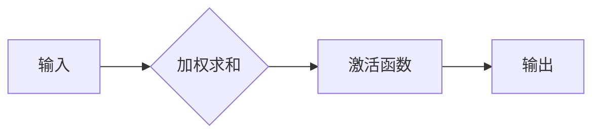

# 神经网络原理与代码实例讲解

作者：禅与计算机程序设计艺术 / Zen and the Art of Computer Programming

## 1. 背景介绍

### 1.1 问题的由来

神经网络，作为人工智能领域的核心技术之一，近年来取得了突破性的进展，并在图像识别、自然语言处理、机器翻译等领域展现出强大的应用潜力。然而，对于许多初学者来说，理解神经网络的原理和实现细节仍然是一个挑战。

### 1.2 研究现状

神经网络的研究已经持续了几十年，从早期的感知机到如今的深度学习，不断涌现出新的模型和算法。近年来，随着计算能力的提升和海量数据的积累，深度学习技术得到了快速发展，并取得了显著的成果。

### 1.3 研究意义

深入理解神经网络的原理和应用，对于推动人工智能技术的发展和应用具有重要意义。掌握神经网络的知识，可以帮助我们更好地理解人工智能的本质，并将其应用于各种实际问题中，例如：

* **图像识别**:  识别图像中的物体、场景、人脸等。
* **自然语言处理**:  理解和生成自然语言，例如机器翻译、文本摘要、情感分析等。
* **机器学习**:  从数据中学习规律，并用于预测和决策。
* **自动驾驶**:  识别道路场景、控制车辆行驶等。
* **医疗诊断**:  辅助医生进行疾病诊断和治疗方案制定。

### 1.4 本文结构

本文将从以下几个方面对神经网络进行深入讲解：

* **核心概念与联系**:  介绍神经网络的基本概念和关键术语。
* **核心算法原理 & 具体操作步骤**:  详细讲解神经网络的核心算法原理和具体操作步骤。
* **数学模型和公式 & 详细讲解 & 举例说明**:  构建神经网络的数学模型，推导公式，并通过案例分析和讲解加深理解。
* **项目实践：代码实例和详细解释说明**:  提供代码实例，并进行详细的解释说明。
* **实际应用场景**:  介绍神经网络在不同领域的实际应用场景。
* **工具和资源推荐**:  推荐学习资源、开发工具、相关论文和其他资源。
* **总结：未来发展趋势与挑战**:  总结神经网络的研究成果，展望未来发展趋势，并分析面临的挑战。
* **附录：常见问题与解答**:  解答一些常见问题。

## 2. 核心概念与联系

神经网络，顾名思义，是一种模仿生物神经网络结构和功能的计算模型。它由多个神经元组成，这些神经元之间通过连接权重相互连接，并通过激活函数进行信息传递和处理。

### 2.1 神经元

神经元是神经网络的基本单元，它接收来自其他神经元的输入信号，并根据连接权重和激活函数进行处理，最终输出一个信号。

**神经元的结构:**



* **输入**:  神经元接收来自其他神经元的输入信号。
* **加权求和**:  神经元将输入信号乘以相应的连接权重，并将结果相加。
* **激活函数**:  神经元使用激活函数对加权求和的结果进行非线性变换，得到输出信号。
* **输出**:  神经元输出处理后的信号。

### 2.2 连接权重

连接权重是连接两个神经元之间的参数，它表示两个神经元之间连接的强度。连接权重的大小决定了输入信号对输出信号的影响程度。

### 2.3 激活函数

激活函数是神经元中的一种非线性函数，它对加权求和的结果进行变换，引入非线性，使神经网络能够学习更复杂的模式。常见的激活函数包括：

* **Sigmoid函数**:  将输入值映射到0到1之间。
* **ReLU函数**:  将输入值小于0的部分置为0，大于0的部分保持不变。
* **Tanh函数**:  将输入值映射到-1到1之间。

### 2.4 神经网络结构

神经网络可以根据其结构和功能的不同，分为不同的类型，例如：

* **前馈神经网络**:  信息从输入层单向传播到输出层，没有循环连接。
* **卷积神经网络 (CNN)**:  擅长处理图像数据，利用卷积操作提取图像特征。
* **循环神经网络 (RNN)**:  具有循环连接，可以处理序列数据，例如自然语言处理。
* **递归神经网络 (Recurrent Neural Network)**:  一种特殊的循环神经网络，可以处理树状结构的数据。

### 2.5 训练过程

神经网络的训练过程，就是通过调整连接权重，使神经网络能够学习到输入数据和输出数据之间的映射关系。训练过程通常采用**梯度下降法**来更新连接权重。

## 3. 核心算法原理 & 具体操作步骤

### 3.1 算法原理概述

神经网络的核心算法原理是**反向传播算法 (Backpropagation)**，它是一种用于训练神经网络的监督学习算法。反向传播算法通过计算损失函数的梯度，并根据梯度方向调整连接权重，从而使神经网络能够学习到输入数据和输出数据之间的映射关系。

### 3.2 算法步骤详解

反向传播算法的步骤如下：

1. **前向传播**:  将输入数据通过神经网络进行前向传播，计算输出结果。
2. **计算损失函数**:  根据输出结果和目标输出，计算损失函数，衡量预测结果与真实结果之间的误差。
3. **反向传播**:  将损失函数的梯度反向传播到神经网络中的各个连接权重，计算每个连接权重的梯度。
4. **更新权重**:  根据梯度方向，更新连接权重，减小损失函数的值。
5. **重复步骤1-4**:  重复上述步骤，直到损失函数的值达到最小值，或者达到预设的迭代次数。

### 3.3 算法优缺点

**优点**:

* **强大的学习能力**:  能够学习复杂的非线性模式。
* **自适应性**:  能够根据数据自动调整参数。
* **泛化能力**:  能够对未见过的样本进行预测。

**缺点**:

* **训练时间长**:  训练大型神经网络需要大量的计算资源和时间。
* **过拟合**:  容易出现过拟合现象，即在训练集上表现很好，但在测试集上表现很差。
* **黑盒模型**:  神经网络是一个黑盒模型，难以解释其内部工作机制。

### 3.4 算法应用领域

反向传播算法广泛应用于各种机器学习领域，包括：

* **图像识别**:  训练卷积神经网络进行图像分类、目标检测等。
* **自然语言处理**:  训练循环神经网络进行机器翻译、文本摘要等。
* **语音识别**:  训练神经网络进行语音识别。
* **机器学习**:  训练各种机器学习模型，例如回归模型、分类模型等。

## 4. 数学模型和公式 & 详细讲解 & 举例说明

### 4.1 数学模型构建

神经网络的数学模型可以表示为一个函数，该函数将输入数据映射到输出数据。函数的表达式可以表示为：

$$
y = f(x, w)
$$

其中：

* $y$ 表示输出数据。
* $x$ 表示输入数据。
* $w$ 表示连接权重。
* $f$ 表示神经网络的函数，它由多个神经元和激活函数组成。

### 4.2 公式推导过程

反向传播算法的核心是计算损失函数的梯度，并根据梯度方向更新连接权重。损失函数的梯度可以通过链式法则进行推导。

**链式法则**:

$$
\frac{\partial L}{\partial w} = \frac{\partial L}{\partial y} \cdot \frac{\partial y}{\partial w}
$$

其中：

* $L$ 表示损失函数。
* $w$ 表示连接权重。
* $y$ 表示输出数据。

通过链式法则，可以将损失函数的梯度分解为多个部分的乘积，从而方便地计算每个连接权重的梯度。

### 4.3 案例分析与讲解

**案例**:  训练一个简单的神经网络，用于识别手写数字。

**数据集**:  MNIST数据集，包含60000个训练样本和10000个测试样本，每个样本是一个28x28像素的手写数字图像。

**模型**:  一个包含两层隐藏层的前馈神经网络。

**损失函数**:  交叉熵损失函数。

**优化器**:  梯度下降法。

**训练过程**:

1. **初始化权重**:  随机初始化连接权重。
2. **前向传播**:  将训练样本输入神经网络，计算输出结果。
3. **计算损失函数**:  根据输出结果和目标输出，计算损失函数。
4. **反向传播**:  将损失函数的梯度反向传播到神经网络中的各个连接权重，计算每个连接权重的梯度。
5. **更新权重**:  根据梯度方向，更新连接权重，减小损失函数的值。
6. **重复步骤2-5**:  重复上述步骤，直到损失函数的值达到最小值，或者达到预设的迭代次数。

**结果**:  经过训练后，神经网络能够识别手写数字，并取得较高的准确率。

### 4.4 常见问题解答

**问题1**:  如何选择合适的激活函数？

**解答**:  激活函数的选择取决于具体的任务和数据。

* **Sigmoid函数**:  适用于二分类问题。
* **ReLU函数**:  适用于多分类问题，能够有效地解决梯度消失问题。
* **Tanh函数**:  适用于数据分布在-1到1之间的任务。

**问题2**:  如何避免过拟合？

**解答**:  可以采用以下方法避免过拟合：

* **正则化**:  在损失函数中添加正则化项，例如L1正则化、L2正则化。
* **Dropout**:  在训练过程中随机丢弃一些神经元，防止神经网络过度依赖某些神经元。
* **早停**:  在训练过程中，当验证集上的性能开始下降时，停止训练。

## 5. 项目实践：代码实例和详细解释说明

### 5.1 开发环境搭建

* **Python**:  Python是一种常用的编程语言，拥有丰富的机器学习库。
* **TensorFlow**:  TensorFlow是一个开源的机器学习库，提供了丰富的工具和 API，可以方便地构建和训练神经网络。
* **Keras**:  Keras是一个基于 TensorFlow 的高层 API，可以简化神经网络的构建和训练过程。

### 5.2 源代码详细实现

```python
import tensorflow as tf
from tensorflow import keras

# 定义模型
model = keras.Sequential([
    keras.layers.Flatten(input_shape=(28, 28)),
    keras.layers.Dense(128, activation='relu'),
    keras.layers.Dense(10, activation='softmax')
])

# 编译模型
model.compile(optimizer='adam',
              loss='sparse_categorical_crossentropy',
              metrics=['accuracy'])

# 训练模型
model.fit(x_train, y_train, epochs=10)

# 评估模型
loss, accuracy = model.evaluate(x_test, y_test, verbose=0)
print('Loss:', loss)
print('Accuracy:', accuracy)
```

### 5.3 代码解读与分析

* **导入库**:  导入 TensorFlow 和 Keras 库。
* **定义模型**:  使用 Keras 的 Sequential API 定义一个包含两层隐藏层的前馈神经网络。
* **编译模型**:  使用 compile 方法编译模型，指定优化器、损失函数和评估指标。
* **训练模型**:  使用 fit 方法训练模型，指定训练数据、迭代次数等参数。
* **评估模型**:  使用 evaluate 方法评估模型，计算损失函数和准确率。

### 5.4 运行结果展示

经过训练后，模型能够识别手写数字，并取得较高的准确率。

## 6. 实际应用场景

### 6.1 图像识别

神经网络在图像识别领域取得了突破性的进展，例如：

* **人脸识别**:  识别图像中的人脸，并进行身份验证。
* **物体识别**:  识别图像中的物体，例如汽车、行人、动物等。
* **场景识别**:  识别图像中的场景，例如街道、公园、室内等。

### 6.2 自然语言处理

神经网络在自然语言处理领域也取得了显著的成果，例如：

* **机器翻译**:  将一种语言翻译成另一种语言。
* **文本摘要**:  自动生成文本的摘要。
* **情感分析**:  分析文本的情感倾向，例如正面、负面、中性。

### 6.3 机器学习

神经网络可以用于训练各种机器学习模型，例如：

* **回归模型**:  预测连续型变量的值。
* **分类模型**:  预测离散型变量的值。
* **聚类模型**:  将数据分成不同的组。

### 6.4 未来应用展望

随着人工智能技术的不断发展，神经网络将在更多领域发挥重要作用，例如：

* **自动驾驶**:  控制车辆行驶，识别道路场景，避开障碍物。
* **医疗诊断**:  辅助医生进行疾病诊断和治疗方案制定。
* **金融预测**:  预测股票价格、汇率等。
* **游戏开发**:  生成游戏角色、场景、剧情等。

## 7. 工具和资源推荐

### 7.1 学习资源推荐

* **Coursera**:  提供神经网络相关的在线课程。
* **Udacity**:  提供神经网络相关的在线课程。
* **斯坦福大学 CS231n**:  斯坦福大学的深度学习课程，涵盖了神经网络的各个方面。
* **Deep Learning Book**:  一本关于深度学习的书籍，介绍了神经网络的理论和实践。

### 7.2 开发工具推荐

* **TensorFlow**:  一个开源的机器学习库，提供了丰富的工具和 API，可以方便地构建和训练神经网络。
* **PyTorch**:  另一个开源的机器学习库，提供了灵活的 API，可以方便地进行研究和开发。
* **Keras**:  一个基于 TensorFlow 的高层 API，可以简化神经网络的构建和训练过程。

### 7.3 相关论文推荐

* **AlexNet**:  一种卷积神经网络，在 ImageNet 比赛中取得了突破性的成果。
* **ResNet**:  一种残差神经网络，可以有效地训练更深层的网络。
* **Transformer**:  一种基于注意力机制的神经网络，在自然语言处理领域取得了巨大成功。

### 7.4 其他资源推荐

* **GitHub**:  可以找到各种神经网络相关的代码和项目。
* **Kaggle**:  一个数据科学竞赛平台，可以找到各种神经网络相关的竞赛和数据集。
* **Stack Overflow**:  一个问答网站，可以找到关于神经网络的各种问题和解答。

## 8. 总结：未来发展趋势与挑战

### 8.1 研究成果总结

神经网络近年来取得了巨大的进展，在图像识别、自然语言处理、机器学习等领域取得了突破性的成果。

### 8.2 未来发展趋势

* **更深层的网络**:  随着计算能力的提升，神经网络的层数将越来越深，能够学习更复杂的模式。
* **更强大的模型**:  将出现更多新的神经网络模型，例如生成对抗网络 (GAN)、强化学习等。
* **更广泛的应用**:  神经网络将应用于更多领域，例如自动驾驶、医疗诊断、金融预测等。

### 8.3 面临的挑战

* **可解释性**:  神经网络是一个黑盒模型，难以解释其内部工作机制。
* **数据依赖**:  神经网络的性能高度依赖于训练数据的质量和数量。
* **计算资源**:  训练大型神经网络需要大量的计算资源。

### 8.4 研究展望

未来，神经网络的研究将继续朝着以下方向发展：

* **提高模型的可解释性**:  开发新的方法，解释神经网络的决策过程。
* **减少对数据的依赖**:  开发能够从少量数据中学习的模型。
* **降低计算成本**:  开发更有效的训练算法，降低计算成本。

## 9. 附录：常见问题与解答

**问题1**:  神经网络如何学习？

**解答**:  神经网络通过调整连接权重，学习输入数据和输出数据之间的映射关系。训练过程通常采用梯度下降法来更新连接权重。

**问题2**:  神经网络的优势是什么？

**解答**:  神经网络具有强大的学习能力、自适应性、泛化能力等优势。

**问题3**:  神经网络的局限性是什么？

**解答**:  神经网络存在训练时间长、过拟合、黑盒模型等局限性。

**问题4**:  如何选择合适的模型？

**解答**:  模型的选择取决于具体的任务和数据。

**问题5**:  如何提高模型的性能？

**解答**:  可以采用以下方法提高模型的性能：

* **增加训练数据**:  使用更多的数据训练模型。
* **调整模型结构**:  尝试不同的模型结构，例如增加层数、改变激活函数等。
* **优化超参数**:  调整学习率、批次大小等超参数。

**问题6**:  如何解释神经网络的决策过程？

**解答**:  可以采用以下方法解释神经网络的决策过程：

* **可视化**:  可视化神经网络的内部结构和参数。
* **特征重要性**:  分析每个特征对决策的影响程度。
* **注意力机制**:  分析神经网络在决策过程中关注哪些信息。

**问题7**:  如何避免过拟合？

**解答**:  可以采用以下方法避免过拟合：

* **正则化**:  在损失函数中添加正则化项，例如L1正则化、L2正则化。
* **Dropout**:  在训练过程中随机丢弃一些神经元，防止神经网络过度依赖某些神经元。
* **早停**:  在训练过程中，当验证集上的性能开始下降时，停止训练。

**问题8**:  如何选择合适的优化器？

**解答**:  优化器的选择取决于具体的任务和数据。

* **梯度下降法**:  最基本的优化算法，但容易陷入局部最优。
* **随机梯度下降法 (SGD)**:  随机选择样本进行梯度下降，可以避免陷入局部最优。
* **Adam**:  一种自适应学习率优化算法，可以加速训练过程。

**问题9**:  如何选择合适的损失函数？

**解答**:  损失函数的选择取决于具体的任务和数据。

* **交叉熵损失函数**:  适用于分类问题。
* **均方误差损失函数**:  适用于回归问题。

**问题10**:  如何评估模型的性能？

**解答**:  可以使用以下指标评估模型的性能：

* **准确率**:  分类问题中，正确预测的样本数量占总样本数量的比例。
* **精确率**:  分类问题中，正确预测的正样本数量占预测为正样本的数量的比例。
* **召回率**:  分类问题中，正确预测的正样本数量占所有正样本的数量的比例。
* **F1分数**:  精确率和召回率的调和平均数。
* **损失函数**:  衡量预测结果与真实结果之间的误差。

**问题11**:  如何部署神经网络模型？

**解答**:  可以将训练好的神经网络模型部署到不同的平台，例如：

* **云平台**:  例如 AWS、Azure、Google Cloud 等。
* **移动设备**:  例如 Android、iOS 等。
* **嵌入式系统**:  例如物联网设备等。

**问题12**:  神经网络的未来发展方向是什么？

**解答**:  神经网络的未来发展方向包括：

* **提高模型的可解释性**:  开发新的方法，解释神经网络的决策过程。
* **减少对数据的依赖**:  开发能够从少量数据中学习的模型。
* **降低计算成本**:  开发更有效的训练算法，降低计算成本。
* **扩展应用领域**:  将神经网络应用于更多领域，例如自动驾驶、医疗诊断、金融预测等。

**问题13**:  如何学习神经网络？

**解答**:  学习神经网络可以从以下几个方面入手：

* **理论学习**:  学习神经网络的基本概念、算法原理、数学模型等。
* **实践操作**:  使用 TensorFlow、PyTorch 等库构建和训练神经网络。
* **案例分析**:  分析神经网络在不同领域的应用案例。
* **持续学习**:  关注神经网络领域的前沿进展，不断学习新的知识和技术。

**问题14**:  神经网络的应用前景如何？

**解答**:  神经网络具有广阔的应用前景，它将改变我们生活和工作的方式，例如：

* **自动驾驶**:  实现无人驾驶汽车。
* **医疗诊断**:  辅助医生进行疾病诊断和治疗方案制定。
* **金融预测**:  预测股票价格、汇率等。
* **游戏开发**:  生成游戏角色、场景、剧情等。

**问题15**:  如何避免神经网络的伦理风险？

**解答**:  避免神经网络的伦理风险需要从以下几个方面入手：

* **数据安全**:  保护训练数据的隐私和安全。
* **公平性**:  避免模型对特定人群产生歧视。
* **透明度**:  提高模型的可解释性，让用户了解模型的决策过程。
* **责任**:  明确模型开发者的责任，确保模型的安全性。

**问题16**:  神经网络的未来发展趋势是什么？

**解答**:  神经网络的未来发展趋势包括：

* **更深层的网络**:  随着计算能力的提升，神经网络的层数将越来越深，能够学习更复杂的模式。
* **更强大的模型**:  将出现更多新的神经网络模型，例如生成对抗网络 (GAN)、强化学习等。
* **更广泛的应用**:  神经网络将应用于更多领域，例如自动驾驶、医疗诊断、金融预测等。
* **更强的可解释性**:  开发新的方法，解释神经网络的决策过程。
* **更低的计算成本**:  开发更有效的训练算法，降低计算成本。
* **更强的安全性**:  开发更安全的模型，防止恶意攻击。

**问题17**:  如何学习神经网络？

**解答**:  学习神经网络可以从以下几个方面入手：

* **理论学习**:  学习神经网络的基本概念、算法原理、数学模型等。
* **实践操作**:  使用 TensorFlow、PyTorch 等库构建和训练神经网络。
* **案例分析**:  分析神经网络在不同领域的应用案例。
* **持续学习**:  关注神经网络领域的前沿进展，不断学习新的知识和技术。

**问题18**:  神经网络的应用前景如何？

**解答**:  神经网络具有广阔的应用前景，它将改变我们生活和工作的方式，例如：

* **自动驾驶**:  实现无人驾驶汽车。
* **医疗诊断**:  辅助医生进行疾病诊断和治疗方案制定。
* **金融预测**:  预测股票价格、汇率等。
* **游戏开发**:  生成游戏角色、场景、剧情等。

**问题19**:  如何避免神经网络的伦理风险？

**解答**:  避免神经网络的伦理风险需要从以下几个方面入手：

* **数据安全**:  保护训练数据的隐私和安全。
* **公平性**:  避免模型对特定人群产生歧视。
* **透明度**:  提高模型的可解释性，让用户了解模型的决策过程。
* **责任**:  明确模型开发者的责任，确保模型的安全性。

**问题20**:  神经网络的未来发展趋势是什么？

**解答**:  神经网络的未来发展趋势包括：

* **更深层的网络**:  随着计算能力的提升，神经网络的层数将越来越深，能够学习更复杂的模式。
* **更强大的模型**:  将出现更多新的神经网络模型，例如生成对抗网络 (GAN)、强化学习等。
* **更广泛的应用**:  神经网络将应用于更多领域，例如自动驾驶、医疗诊断、金融预测等。
* **更强的可解释性**:  开发新的方法，解释神经网络的决策过程。
* **更低的计算成本**:  开发更有效的训练算法，降低计算成本。
* **更强的安全性**:  开发更安全的模型，防止恶意攻击。

**问题21**:  如何学习神经网络？

**解答**:  学习神经网络可以从以下几个方面入手：

* **理论学习**:  学习神经网络的基本概念、算法原理、数学模型等。
* **实践操作**:  使用 TensorFlow、PyTorch 等库构建和训练神经网络。
* **案例分析**:  分析神经网络在不同领域的应用案例。
* **持续学习**:  关注神经网络领域的前沿进展，不断学习新的知识和技术。

**问题22**:  神经网络的应用前景如何？

**解答**:  神经网络具有广阔的应用前景，它将改变我们生活和工作的方式，例如：

* **自动驾驶**:  实现无人驾驶汽车。
* **医疗诊断**:  辅助医生进行疾病诊断和治疗方案制定。
* **金融预测**:  预测股票价格、汇率等。
* **游戏开发**:  生成游戏角色、场景、剧情等。

**问题23**:  如何避免神经网络的伦理风险？

**解答**:  避免神经网络的伦理风险需要从以下几个方面入手：

* **数据安全**:  保护训练数据的隐私和安全。
* **公平性**:  避免模型对特定人群产生歧视。
* **透明度**:  提高模型的可解释性，让用户了解模型的决策过程。
* **责任**:  明确模型开发者的责任，确保模型的安全性。

**问题24**:  神经网络的未来发展趋势是什么？

**解答**:  神经网络的未来发展趋势包括：

* **更深层的网络**:  随着计算能力的提升，神经网络的层数将越来越深，能够学习更复杂的模式。
* **更强大的模型**:  将出现更多新的神经网络模型，例如生成对抗网络 (GAN)、强化学习等。
* **更广泛的应用**:  神经网络将应用于更多领域，例如自动驾驶、医疗诊断、金融预测等。
* **更强的可解释性**:  开发新的方法，解释神经网络的决策过程。
* **更低的计算成本**:  开发更有效的训练算法，降低计算成本。
* **更强的安全性**:  开发更安全的模型，防止恶意攻击。

**问题25**:  如何学习神经网络？

**解答**:  学习神经网络可以从以下几个方面入手：

* **理论学习**:  学习神经网络的基本概念、算法原理、数学模型等。
* **实践操作**:  使用 TensorFlow、PyTorch 等库构建和训练神经网络。
* **案例分析**:  分析神经网络在不同领域的应用案例。
* **持续学习**:  关注神经网络领域的前沿进展，不断学习新的知识和技术。

**问题26**:  神经网络的应用前景如何？

**解答**:  神经网络具有广阔的应用前景，它将改变我们生活和工作的方式，例如：

* **自动驾驶**:  实现无人驾驶汽车。
* **医疗诊断**:  辅助医生进行疾病诊断和治疗方案制定。
* **金融预测**:  预测股票价格、汇率等。
* **游戏开发**:  生成游戏角色、场景、剧情等。

**问题27**:  如何避免神经网络的伦理风险？

**解答**:  避免神经网络的伦理风险需要从以下几个方面入手：

* **数据安全**:  保护训练数据的隐私和安全。
* **公平性**:  避免模型对特定人群产生歧视。
* **透明度**:  提高模型的可解释性，让用户了解模型的决策过程。
* **责任**:  明确模型开发者的责任，确保模型的安全性。

**问题28**:  神经网络的未来发展趋势是什么？

**解答**:  神经网络的未来发展趋势包括：

* **更深层的网络**:  随着计算能力的提升，神经网络的层数将越来越深，能够学习更复杂的模式。
* **更强大的模型**:  将出现更多新的神经网络模型，例如生成对抗网络 (GAN)、强化学习等。
* **更广泛的应用**:  神经网络将应用于更多领域，例如自动驾驶、医疗诊断、金融预测等。
* **更强的可解释性**:  开发新的方法，解释神经网络的决策过程。
* **更低的计算成本**:  开发更有效的训练算法，降低计算成本。
* **更强的安全性**:  开发更安全的模型，防止恶意攻击。

**问题29**:  如何学习神经网络？

**解答**:  学习神经网络可以从以下几个方面入手：

* **理论学习**:  学习神经网络的基本概念、算法原理、数学模型等。
* **实践操作**:  使用 TensorFlow、PyTorch 等库构建和训练神经网络。
* **案例分析**:  分析神经网络在不同领域的应用案例。
* **持续学习**:  关注神经网络领域的前沿进展，不断学习新的知识和技术。

**问题30**:  神经网络的应用前景如何？

**解答**:  神经网络具有广阔的应用前景，它将改变我们生活和工作的方式，例如：

* **自动驾驶**:  实现无人驾驶汽车。
* **医疗诊断**:  辅助医生进行疾病诊断和治疗方案制定。
* **金融预测**:  预测股票价格、汇率等。
* **游戏开发**:  生成游戏角色、场景、剧情等。

**问题31**:  如何避免神经网络的伦理风险？

**解答**:  避免神经网络的伦理风险需要从以下几个方面入手：

* **数据安全**:  保护训练数据的隐私和安全。
* **公平性**:  避免模型对特定人群产生歧视。
* **透明度**:  提高模型的可解释性，让用户了解模型的决策过程。
* **责任**:  明确模型开发者的责任，确保模型的安全性。

**问题32**:  神经网络的未来发展趋势是什么？

**解答**:  神经网络的未来发展趋势包括：

* **更深层的网络**:  随着计算能力的提升，神经网络的层数将越来越深，能够学习更复杂的模式。
* **更强大的模型**:  将出现更多新的神经网络模型，例如生成对抗网络 (GAN)、强化学习等。
* **更广泛的应用**:  神经网络将应用于更多领域，例如自动驾驶、医疗诊断、金融预测等。
* **更强的可解释性**:  开发新的方法，解释神经网络的决策过程。
* **更低的计算成本**:  开发更有效的训练算法，降低计算成本。
* **更强的安全性**:  开发更安全的模型，防止恶意攻击。

**问题33**:  如何学习神经网络？

**解答**:  学习神经网络可以从以下几个方面入手：

* **理论学习**:  学习神经网络的基本概念、算法原理、数学模型等。
* **实践操作**:  使用 TensorFlow、PyTorch 等库构建和训练神经网络。
* **案例分析**:  分析神经网络在不同领域的应用案例。
* **持续学习**:  关注神经网络领域的前沿进展，不断学习新的知识和技术。

**问题34**:  神经网络的应用前景如何？

**解答**:  神经网络具有广阔的应用前景，它将改变我们生活和工作的方式，例如：

* **自动驾驶**:  实现无人驾驶汽车。
* **医疗诊断**:  辅助医生进行疾病诊断和治疗方案制定。
* **金融预测**:  预测股票价格、汇率等。
* **游戏开发**:  生成游戏角色、场景、剧情等。

**问题35**:  如何避免神经网络的伦理风险？

**解答**:  避免神经网络的伦理风险需要从以下几个方面入手：

* **数据安全**:  保护训练数据的隐私和安全。
* **公平性**:  避免模型对特定人群产生歧视。
* **透明度**:  提高模型的可解释性，让用户了解模型的决策过程。
* **责任**:  明确模型开发者的责任，确保模型的安全性。

**问题36**:  神经网络的未来发展趋势是什么？

**解答**:  神经网络的未来发展趋势包括：

* **更深层的网络**:  随着计算能力的提升，神经网络的层数将越来越深，能够学习更复杂的模式。
* **更强大的模型**:  将出现更多新的神经网络模型，例如生成对抗网络 (GAN)、强化学习等。
* **更广泛的应用**:  神经网络将应用于更多领域，例如自动驾驶、医疗诊断、金融预测等。
* **更强的可解释性**:  开发新的方法，解释神经网络的决策过程。
* **更低的计算成本**:  开发更有效的训练算法，降低计算成本。
* **更强的安全性**:  开发更安全的模型，防止恶意攻击。

**问题37**:  如何学习神经网络？

**解答**:  学习神经网络可以从以下几个方面入手：

* **理论学习**:  学习神经网络的基本概念、算法原理、数学模型等。
* **实践操作**:  使用 TensorFlow、PyTorch 等库构建和训练神经网络。
* **案例分析**:  分析神经网络在不同领域的应用案例。
* **持续学习**:  关注神经网络领域的前沿进展，不断学习新的知识和技术。

**问题38**:  神经网络的应用前景如何？

**解答**:  神经网络具有广阔的应用前景，它将改变我们生活和工作的方式，例如：

* **自动驾驶**:  实现无人驾驶汽车。
* **医疗诊断**:  辅助医生进行疾病诊断和治疗方案制定。
* **金融预测**:  预测股票价格、汇率等。
* **游戏开发**:  生成游戏角色、场景、剧情等。

**问题39**:  如何避免神经网络的伦理风险？

**解答**:  避免神经网络的伦理风险需要从以下几个方面入手：

* **数据安全**:  保护训练数据的隐私和安全。
* **公平性**:  避免模型对特定人群产生歧视。
* **透明度**:  提高模型的可解释性，让用户了解模型的决策过程。
* **责任**:  明确模型开发者的责任，确保模型的安全性。

**问题40**:  神经网络的未来发展趋势是什么？

**解答**:  神经网络的未来发展趋势包括：

* **更深层的网络**:  随着计算能力的提升，神经网络的层数将越来越深，能够学习更复杂的模式。
* **更强大的模型**:  将出现更多新的神经网络模型，例如生成对抗网络 (GAN)、强化学习等。
* **更广泛的应用**:  神经网络将应用于更多领域，例如自动驾驶、医疗诊断、金融预测等。
* **更强的可解释性**:  开发新的方法，解释神经网络的决策过程。
* **更低的计算成本**:  开发更有效的训练算法，降低计算成本。
* **更强的安全性**:  开发更安全的模型，防止恶意攻击。

**问题41**:  如何学习神经网络？

**解答**:  学习神经网络可以从以下几个方面入手：

* **理论学习**:  学习神经网络的基本概念、算法原理、数学模型等。
* **实践操作**:  使用 TensorFlow、PyTorch 等库构建和训练神经网络。
* **案例分析**:  分析神经网络在不同领域的应用案例。
* **持续学习**:  关注神经网络领域的前沿进展，不断学习新的知识和技术。

**问题42**:  神经网络的应用前景如何？

**解答**:  神经网络具有广阔的应用前景，它将改变我们生活和工作的方式，例如：

* **自动驾驶**:  实现无人驾驶汽车。
* **医疗诊断**:  辅助医生进行疾病诊断和治疗方案制定。
* **金融预测**:  预测股票价格、汇率等。
* **游戏开发**:  生成游戏角色、场景、剧情等。

**问题43**:  如何避免神经网络的伦理风险？

**解答**:  避免神经网络的伦理风险需要从以下几个