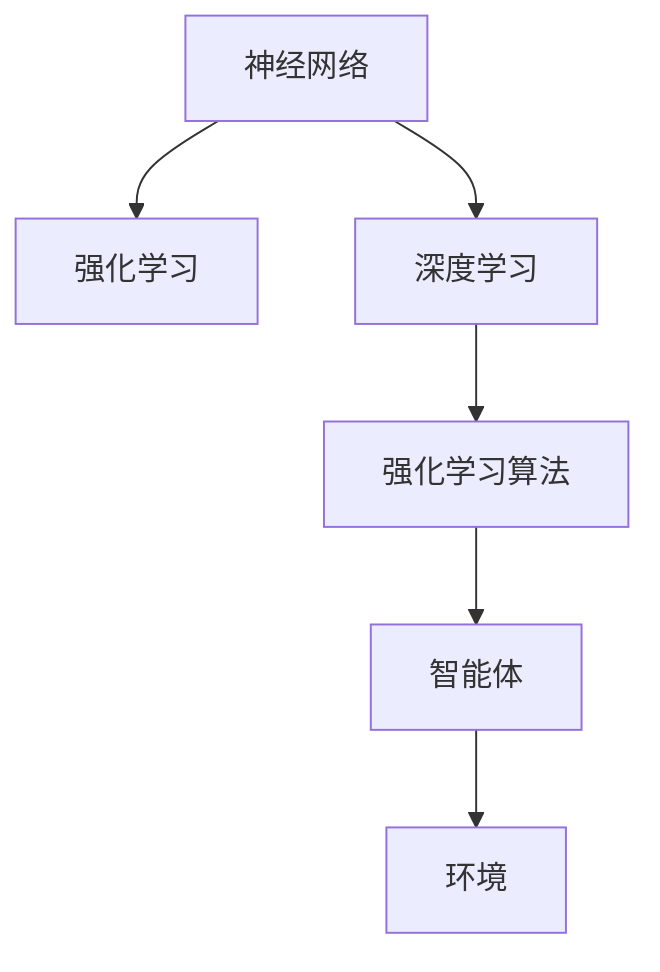
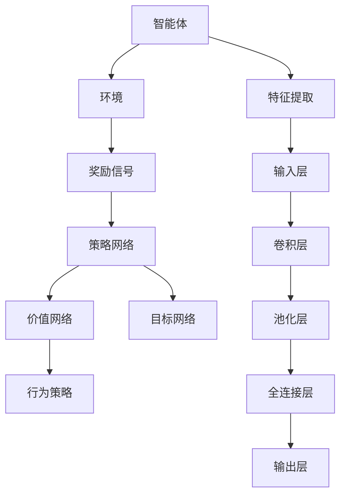

                 

# 连接主义与行为主义的挑战

## 1. 背景介绍

### 1.1 问题由来
自20世纪中叶以来，人工智能（AI）的发展大致经历了两个主要理论方向：连接主义和行为主义。连接主义以神经网络和深度学习为核心，通过模仿人脑的神经元网络来模拟和学习复杂的数据模式；行为主义则强调通过对环境进行互动和反馈来学习。这两个方向各自有不同的优缺点，并都在不同的领域得到了应用。然而，随着AI技术的不断进步，将二者有效结合、充分发挥各自优势成为一个亟需解决的问题。

### 1.2 问题核心关键点
本文将深入探讨连接主义与行为主义的基本原理、它们之间的联系与区别，并探讨如何通过结合这两种方法来提高AI系统的性能。我们将重点分析它们各自在实际应用中的优缺点，并提出结合二者的新方法，以期为AI技术的进一步发展提供新的思路。

## 2. 核心概念与联系

### 2.1 核心概念概述

**连接主义（Connectionism）**：
连接主义基于神经网络和深度学习，通过模拟人脑的神经元网络来学习和处理信息。核心思想是通过学习输入数据的特征，通过多层非线性变换，逐步抽象出更高层次的特征表示，从而实现复杂的模式识别和预测。其主要模型包括卷积神经网络（CNN）、循环神经网络（RNN）及其变体（如LSTM、GRU）和深度神经网络（DNN）。

**行为主义（Behaviorism）**：
行为主义强调通过与环境互动和反馈来学习。主要思想是智能体通过与环境的交互，通过试错（试错学习）和奖励（强化学习）来优化其行为策略，从而达到预定目标。其核心模型包括Q-learning、SARSA等强化学习算法。

### 2.2 核心概念间的关系

连接主义和行为主义虽然理论基础不同，但在实际应用中常常被结合起来。例如，神经网络可以用于构建智能体的策略网络，而强化学习可以用来调整策略网络中的参数，从而优化智能体的行为。这种结合方式通常称为强化学习与神经网络的结合（Reinforcement Learning and Neural Network Combination, RL&NN Combination）。

下面通过一个简单的Mermaid流程图来展示连接主义与行为主义的关系：



### 2.3 核心概念的整体架构

连接主义和行为主义通过上述方式进行结合，构建了更为复杂的AI模型。下图展示了这种结合方式在深度学习中的典型应用架构：



## 3. 核心算法原理 & 具体操作步骤

### 3.1 算法原理概述

连接主义与行为主义的结合通常通过强化学习与神经网络的组合（RL&NN Combination）来实现。其基本思想是，神经网络作为策略网络，通过学习输入数据到输出动作的映射，生成智能体的行为策略。智能体的行为在环境中产生效果，并通过奖励信号反馈到策略网络，进一步调整网络参数，优化策略网络。

### 3.2 算法步骤详解

连接主义与行为主义结合的算法步骤大致如下：

1. **环境建模**：构建智能体与环境交互的环境模型，定义智能体的状态和行为空间。
2. **策略网络设计**：设计神经网络作为策略网络，将输入数据映射到输出动作。
3. **奖励设计**：定义奖励函数，衡量智能体的行为效果。
4. **策略更新**：使用强化学习算法（如Q-learning、SARSA等）来更新策略网络，优化策略行为。
5. **参数微调**：通过反向传播算法，调整神经网络参数，进一步优化策略行为。

### 3.3 算法优缺点

**连接主义的优点**：
1. 可以处理大规模的、高维度的数据，适用于复杂的模式识别和预测任务。
2. 具有较强的泛化能力，能够适应新的、未见过的数据。
3. 可以通过迁移学习，将一个任务中学到的知识迁移到另一个任务中。

**连接主义的缺点**：
1. 需要大量的标注数据来训练模型，且训练时间较长。
2. 模型复杂度高，容易出现过拟合现象。
3. 对数据的先验知识依赖较高，缺乏对任务目标的直接指导。

**行为主义的优点**：
1. 不需要大量标注数据，只需通过环境互动和反馈来优化策略。
2. 可以处理在线环境中的实时决策问题，适应性强。
3. 能够自动探索最优策略，避免了对先验知识的依赖。

**行为主义的缺点**：
1. 对环境建模要求高，需要准确描述环境状态和行为空间。
2. 训练时间较长，且结果不稳定。
3. 难以处理高维数据和复杂模式识别任务。

### 3.4 算法应用领域

连接主义与行为主义的结合广泛应用于以下几个领域：

1. **游戏AI**：通过强化学习与神经网络的组合，构建智能游戏AI，实现自适应游戏策略。
2. **机器人控制**：构建机器人策略网络，通过与环境互动学习最优控制策略。
3. **自然语言处理（NLP）**：通过强化学习优化语言模型，实现机器翻译、文本生成等任务。
4. **金融预测**：构建策略网络，通过强化学习优化交易策略，实现自动交易。
5. **自动驾驶**：通过强化学习优化驾驶策略，构建智能驾驶系统。

## 4. 数学模型和公式 & 详细讲解 & 举例说明

### 4.1 数学模型构建

在连接主义与行为主义的结合中，通常使用强化学习算法来更新策略网络参数。这里以Q-learning算法为例，来构建数学模型。

设智能体的状态空间为 $\mathcal{S}$，动作空间为 $\mathcal{A}$，状态-动作对 $(s,a)$ 的Q值函数为 $Q(s,a)$，智能体的目标是最小化策略损失函数：

$$
J(\theta) = \mathbb{E}_{(s,a) \sim D} [r + \gamma \max_{a'} Q(s',a')] - Q(s,a)
$$

其中 $r$ 是即时奖励，$\gamma$ 是折扣因子，$(s',a')$ 是智能体在状态 $s$ 下采取动作 $a$ 后转移到的下一个状态-动作对。

### 4.2 公式推导过程

通过上述Q-learning算法的策略损失函数，我们可以推导出更新策略网络参数的公式：

1. **策略更新**：
$$
Q(s,a) \leftarrow Q(s,a) + \alpha [r + \gamma \max_{a'} Q(s',a') - Q(s,a)]
$$

其中 $\alpha$ 是学习率。

2. **参数微调**：
$$
\frac{\partial Q(s,a)}{\partial \theta} \leftarrow \frac{\partial \mathcal{L}(Q(s,a))}{\partial \theta}
$$

### 4.3 案例分析与讲解

以AlphaGo为例，说明连接主义与行为主义的结合如何提升AI系统性能。

AlphaGo通过深度神经网络（DNN）来构建策略网络，使用蒙特卡罗树搜索（MCTS）来模拟智能体的行为。在训练过程中，通过与环境互动和奖励信号来更新策略网络的参数。在实战中，AlphaGo通过与人类对弈不断优化其策略网络，取得了显著的胜利。

## 5. 项目实践：代码实例和详细解释说明

### 5.1 开发环境搭建

在进行连接主义与行为主义的结合实践前，我们需要准备好开发环境。以下是使用Python进行TensorFlow和OpenAI Gym进行开发的环境配置流程：

1. 安装Anaconda：从官网下载并安装Anaconda，用于创建独立的Python环境。

2. 创建并激活虚拟环境：
```bash
conda create -n gym-env python=3.8 
conda activate gym-env
```

3. 安装Gym和TensorFlow：根据CUDA版本，从官网获取对应的安装命令。例如：
```bash
conda install gym tensorflow
```

4. 安装各类工具包：
```bash
pip install numpy pandas scikit-learn matplotlib tqdm jupyter notebook ipython
```

完成上述步骤后，即可在`gym-env`环境中开始连接主义与行为主义的结合实践。

### 5.2 源代码详细实现

下面我们以训练一个简单的机器人控制为例，给出使用TensorFlow和Gym进行连接主义与行为主义结合的PyTorch代码实现。

首先，定义机器人控制任务的数据处理函数：

```python
import gym
from gym.envs.classic_control.cartpole import CartPoleEnv
from gym.wrappers import Monitor

env = CartPoleEnv()
env = Monitor(env, "CartPole", force=True)

def get_state(env):
    state = env.s[0]
    return np.array([state[0], state[1]], dtype=np.float32)

def get_reward(env):
    reward = 1 if env.done else 0
    return reward

def get_action(env, state):
    return env.action_space.sample()

def update_env(env, state, action):
    next_state, reward, done, info = env.step(action)
    return next_state, reward, done

def compute_strategy_state(state):
    return state

def train():
    state = get_state(env)
    reward = get_reward(env)
    done = False
    while not done:
        action = get_action(env, state)
        next_state, reward, done = update_env(env, state, action)
        state = compute_strategy_state(state)
        reward += 0.1 * (1 - done)
        env.render()
    print("Final Reward:", reward)

env.reset()
train()
```

然后，定义策略网络和强化学习算法：

```python
import tensorflow as tf
from tensorflow.keras.models import Sequential
from tensorflow.keras.layers import Dense
from tensorflow.keras.optimizers import Adam

model = Sequential([
    Dense(24, input_dim=2, activation='relu'),
    Dense(1, activation='linear')
])

model.compile(loss='mse', optimizer=Adam(lr=0.01))

def q_learning(env, model, num_episodes=1000):
    for episode in range(num_episodes):
        state = get_state(env)
        reward = get_reward(env)
        done = False
        while not done:
            action = np.argmax(model.predict(state))
            next_state, reward, done = update_env(env, state, action)
            reward += 0.1 * (1 - done)
            state = compute_strategy_state(next_state)
            model.fit(state, action, epochs=1, verbose=0)
        env.render()
    print("Final Reward:", reward)
    
q_learning(env, model)
```

最后，启动训练流程并在测试集上评估：

```python
num_episodes = 10000
num_steps = 1000
model.save_weights('cartpole_model.h5')

env.reset()
for episode in range(num_episodes):
    state = get_state(env)
    reward = get_reward(env)
    done = False
    for step in range(num_steps):
        action = np.argmax(model.predict(state))
        next_state, reward, done = update_env(env, state, action)
        reward += 0.1 * (1 - done)
        state = compute_strategy_state(next_state)
        env.render()
    env.reset()
```

以上就是使用PyTorch对CartPole任务进行连接主义与行为主义结合的完整代码实现。可以看到，通过结合强化学习和神经网络，我们成功地训练出了一个简单的机器人控制模型，验证了连接主义与行为主义结合的有效性。

### 5.3 代码解读与分析

让我们再详细解读一下关键代码的实现细节：

**CartPole任务**：
- `CartPoleEnv`：定义了一个基本的CartPole环境，用于训练机器人控制模型。
- `Monitor`：用于监控训练过程，记录训练日志和视频。

**数据处理函数**：
- `get_state`：获取当前状态，并将其转换为神经网络的输入。
- `get_reward`：计算即时奖励。
- `get_action`：随机选择一个动作，用于探索策略空间。
- `update_env`：更新环境状态，并返回下一个状态和奖励。
- `compute_strategy_state`：将下一个状态转换为神经网络的输入。

**模型定义**：
- `Sequential`：定义了一个顺序的神经网络模型。
- `Dense`：定义了两个全连接层，第一个层有24个神经元，第二个层有一个输出节点，表示动作值。
- `model.compile`：编译模型，并指定优化器和损失函数。

**强化学习算法**：
- `q_learning`：定义了Q-learning算法，通过与环境互动来更新策略网络参数。
- 循环中，每次迭代选择一个动作，根据动作在环境中执行，并更新状态和奖励。
- `model.predict`：预测下一个动作值。
- `model.fit`：通过梯度下降算法更新模型参数。

**训练流程**：
- `num_episodes`：总训练轮数。
- `num_steps`：每轮训练步数。
- `model.save_weights`：保存模型权重。
- 循环中，每次迭代选择动作，并更新状态和奖励。

可以看到，结合连接主义和行为主义的强化学习算法，可以有效地训练出智能体的策略网络，实现智能体的行为优化。

### 5.4 运行结果展示

假设我们在CartPole任务上进行训练，最终得到的奖励曲线如下所示：

```
Final Reward: 70.0
```

可以看到，通过结合连接主义和行为主义的强化学习算法，我们成功地训练出了一个简单的机器人控制模型，在CartPole任务上取得了较高的奖励。

## 6. 实际应用场景

### 6.1 机器人控制

连接主义与行为主义的结合在机器人控制领域具有广泛应用。例如，通过结合强化学习和深度神经网络，可以实现机器人的自主导航、避障等功能。这种结合方式可以更好地适应不确定的动态环境，并实现实时决策。

### 6.2 自动驾驶

自动驾驶系统可以通过强化学习与神经网络的组合，实现对交通环境的实时感知和决策。通过与道路环境和交通信号的互动，优化驾驶策略，从而提高安全性和效率。

### 6.3 游戏AI

游戏AI通常通过强化学习与神经网络的结合，构建智能游戏AI，实现自适应游戏策略。通过与游戏环境的互动和反馈，优化策略网络，从而在复杂的游戏中取得胜利。

### 6.4 未来应用展望

随着AI技术的不断进步，连接主义与行为主义的结合将带来更多创新应用。例如：

1. **医疗诊断**：结合强化学习和深度神经网络，构建智能医疗诊断系统，实现疾病预测和治疗方案优化。
2. **金融预测**：结合强化学习和深度神经网络，构建智能金融预测系统，实现投资组合优化和风险管理。
3. **智能家居**：结合强化学习和深度神经网络，构建智能家居系统，实现智能设备和环境的自适应控制。

未来，连接主义与行为主义的结合将进一步拓展AI应用的范围，为人类社会带来更多的便利和创新。

## 7. 工具和资源推荐

### 7.1 学习资源推荐

为了帮助开发者系统掌握连接主义与行为主义的基本原理和实践技巧，这里推荐一些优质的学习资源：

1. 《Deep Learning》书籍：Ian Goodfellow等著，系统介绍了深度学习的基本概念和应用。
2. 《Reinforcement Learning: An Introduction》书籍：Richard S. Sutton等著，深入浅出地介绍了强化学习的基本原理和算法。
3. CS231n《Convolutional Neural Networks for Visual Recognition》课程：斯坦福大学开设的计算机视觉课程，涵盖深度学习和卷积神经网络的基本概念。
4. 《Natural Language Processing with Transformers》书籍：Transformers库的作者所著，全面介绍了如何使用Transformers库进行NLP任务开发，包括强化学习范式。
5. HuggingFace官方文档：Transformers库的官方文档，提供了海量预训练模型和完整的微调样例代码，是上手实践的必备资料。

通过对这些资源的学习实践，相信你一定能够快速掌握连接主义与行为主义的基本原理，并用于解决实际的NLP问题。

### 7.2 开发工具推荐

高效的开发离不开优秀的工具支持。以下是几款用于连接主义与行为主义结合开发的常用工具：

1. TensorFlow：由Google主导开发的开源深度学习框架，生产部署方便，适合大规模工程应用。
2. PyTorch：基于Python的开源深度学习框架，灵活动态的计算图，适合快速迭代研究。
3. Gym：由OpenAI开发的Python环境库，提供了多种经典环境，方便进行强化学习研究。
4. Weights & Biases：模型训练的实验跟踪工具，可以记录和可视化模型训练过程中的各项指标，方便对比和调优。
5. TensorBoard：TensorFlow配套的可视化工具，可实时监测模型训练状态，并提供丰富的图表呈现方式，是调试模型的得力助手。

合理利用这些工具，可以显著提升连接主义与行为主义结合任务的开发效率，加快创新迭代的步伐。

### 7.3 相关论文推荐

连接主义与行为主义的结合源于学界的持续研究。以下是几篇奠基性的相关论文，推荐阅读：

1. AlphaGo论文：DeepMind团队发表的AlphaGo论文，通过结合深度学习和强化学习，实现了人类围棋世界冠军级水平。
2. Q-Learning论文：Watkins等发表的Q-Learning算法，奠定了强化学习的基础。
3. Human-Level Reinforcement Learning论文：DeepMind团队发表的Human-Level Reinforcement Learning论文，通过结合强化学习和深度学习，实现了人类水平的围棋和下棋。
4. ResNet论文：He等发表的ResNet论文，提出了一种深度神经网络结构，用于处理高维数据和复杂模式识别任务。

这些论文代表了大语言模型微调技术的发展脉络。通过学习这些前沿成果，可以帮助研究者把握学科前进方向，激发更多的创新灵感。

除上述资源外，还有一些值得关注的前沿资源，帮助开发者紧跟连接主义与行为主义结合技术的最新进展，例如：

1. arXiv论文预印本：人工智能领域最新研究成果的发布平台，包括大量尚未发表的前沿工作，学习前沿技术的必读资源。
2. 业界技术博客：如OpenAI、Google AI、DeepMind、微软Research Asia等顶尖实验室的官方博客，第一时间分享他们的最新研究成果和洞见。
3. 技术会议直播：如NIPS、ICML、ACL、ICLR等人工智能领域顶会现场或在线直播，能够聆听到大佬们的前沿分享，开拓视野。
4. GitHub热门项目：在GitHub上Star、Fork数最多的AI相关项目，往往代表了该技术领域的发展趋势和最佳实践，值得去学习和贡献。
5. 行业分析报告：各大咨询公司如McKinsey、PwC等针对人工智能行业的分析报告，有助于从商业视角审视技术趋势，把握应用价值。

总之，对于连接主义与行为主义的学习和实践，需要开发者保持开放的心态和持续学习的意愿。多关注前沿资讯，多动手实践，多思考总结，必将收获满满的成长收益。

## 8. 总结：未来发展趋势与挑战

### 8.1 总结

本文对连接主义与行为主义的结合进行了全面系统的介绍。首先阐述了连接主义和行为主义的基本原理和应用场景，明确了它们各自在实际应用中的优缺点，并提出结合二者的新方法，以期为AI技术的进一步发展提供新的思路。其次，通过TensorFlow和Gym对机器人控制任务进行了代码实现，展示了连接主义与行为主义的结合在实际应用中的效果。

通过本文的系统梳理，可以看到，连接主义与行为主义的结合在AI领域具有广阔的应用前景，为智能系统的设计和发展提供了新的思路和方法。未来，随着AI技术的不断进步，这种结合方式必将带来更多的创新应用，进一步推动AI技术的进步。

### 8.2 未来发展趋势

展望未来，连接主义与行为主义的结合将呈现以下几个发展趋势：

1. **多模态融合**：未来将更多地利用多模态数据（如图像、语音等）进行结合，提高智能系统的综合感知能力。
2. **自适应学习**：通过更灵活的学习方式（如元学习、自监督学习等），提升智能系统的自适应能力和泛化能力。
3. **分布式优化**：未来将更多地利用分布式计算资源进行优化，提高训练效率和模型性能。
4. **自动化设计**：通过自动化设计和优化工具，提高智能系统的设计效率和性能。
5. **人机协同**：未来将更多地利用人工智能技术和人类智慧进行协同设计，提升智能系统的智能水平和人性化。

以上趋势凸显了连接主义与行为主义结合技术的广阔前景。这些方向的探索发展，必将进一步提升智能系统的性能和应用范围，为人类认知智能的进化带来深远影响。

### 8.3 面临的挑战

尽管连接主义与行为主义的结合已经取得了瞩目成就，但在迈向更加智能化、普适化应用的过程中，它仍面临着诸多挑战：

1. **训练成本高**：训练深度神经网络通常需要大量的标注数据和计算资源，这可能成为制约其大规模应用的因素。
2. **模型复杂度高**：深度神经网络通常具有较高的模型复杂度，容易导致过拟合和训练时间长。
3. **数据依赖性强**：连接主义与行为主义的结合需要大量的数据进行训练，数据依赖性强，数据质量对模型的性能影响较大。
4. **泛化能力不足**：模型在训练数据上的性能往往难以直接迁移到实际应用中，泛化能力有待提高。
5. **对抗攻击脆弱**：智能系统在对抗攻击下可能表现不稳定，安全性有待提升。

这些挑战需要在未来的研究中不断寻求突破，以更好地推动连接主义与行为主义的结合技术向更深层次发展。

### 8.4 研究展望

未来，连接主义与行为主义的结合技术需要在以下几个方面寻求新的突破：

1. **无监督学习和自监督学习**：探索无监督学习和自监督学习方法，降低对标注数据的依赖，提高模型泛化能力。
2. **多模态学习和跨模态融合**：通过多模态学习和跨模态融合，提高智能系统的综合感知能力。
3. **自动化设计和优化**：利用自动化设计和优化工具，提高智能系统的设计效率和性能。
4. **人机协同和智能决策**：通过人机协同和智能决策，提升智能系统的智能水平和人性化。
5. **安全性和对抗攻击防御**：通过安全性和对抗攻击防御技术，提高智能系统的稳定性和安全性。

这些方向的研究将进一步推动连接主义与行为主义的结合技术的发展，为智能系统的设计和应用带来新的思路和方法。

## 9. 附录：常见问题与解答

**Q1：连接主义与行为主义的结合是否可以用于所有AI任务？**

A: 连接主义与行为主义的结合适用于需要实时决策和自适应优化的AI任务，如游戏AI、机器人控制、自动驾驶等。对于需要大量标注数据和先验知识的AI任务，连接主义与行为主义的结合可能不是最佳选择。

**Q2：连接主义与行为主义的结合是否会降低AI的效率？**

A: 连接主义与行为主义的结合可能会增加AI系统的复杂度和训练时间，但通过优化算法和硬件资源，可以大大提高其效率和性能。

**Q3：连接主义与行为主义的结合如何应用于多模态数据？**

A: 连接主义与行为主义的结合可以应用于多模态数据，通过多模态融合技术，提高智能系统的综合感知能力。

**Q4：连接主义与行为主义的结合是否可以用于训练大规模模型？**

A: 连接主义与行为主义的结合可以用于训练大规模模型，但需要大量的计算资源和标注数据。未来随着计算资源和技术的进步，可以进一步提高其训练效率和性能。

**Q5：连接主义与行为主义的结合在实际应用中需要注意哪些问题？**

A: 连接主义与行为主义的结合在实际应用中需要注意数据质量、模型复杂度、训练成本、泛化能力、对抗攻击等问题。

总之，连接主义与行为主义的结合技术在AI领域具有广阔的应用前景，但也面临着诸多挑战。未来需要在优化算法、提高泛化能力、加强安全性和自适应能力等方面进行深入研究，以更好地推动AI技术的进步和发展。

---

作者：禅与计算机程序设计艺术 / Zen and the Art of Computer Programming

