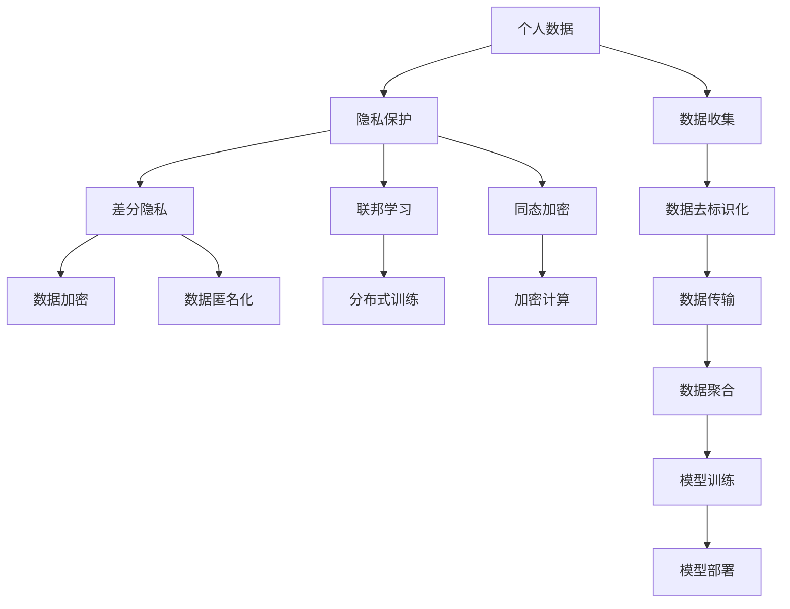

                 

## 1. 背景介绍

### 1.1 问题由来
随着人工智能(AI)技术的迅猛发展，其在医疗、金融、教育、智能交通等众多领域的应用已初见成效，正逐步改变人类生活的方式。但随之而来的，是人工智能时代对个人隐私保护的严峻挑战。

人工智能系统需要处理大量的个人数据，包括语音、图像、位置信息、行为记录等。这些数据往往涉及用户的个人隐私，一旦泄露或被不当使用，将可能给用户带来重大的安全隐患。因此，如何在保障隐私的同时，充分发挥人工智能的潜力，是当前科技界和社会亟需解决的重要议题。

### 1.2 问题核心关键点
人工智能时代隐私保护的核心关键点包括：

- 数据隐私的界定：个人数据如何定义、分类，哪些数据可以被收集、使用，哪些数据应严格限制或禁止。
- 隐私保护的机制：如何在数据收集、存储、处理和共享过程中保护隐私，避免数据泄露和滥用。
- 隐私保护的监管：政府和行业如何制定法律、规范和标准，确保隐私保护的落实。
- 隐私保护的技术：如何通过技术手段实现隐私保护，如加密、匿名化、差分隐私等。
- 隐私保护的伦理：人工智能系统设计者和开发者如何考虑伦理因素，平衡技术利益和社会责任。

这些核心问题彼此关联，相互制约，共同构成隐私保护在人工智能时代的复杂挑战。本文将重点介绍数据隐私的界定、隐私保护的机制和技术手段，同时探讨其在人工智能应用中的具体实践和未来趋势。

## 2. 核心概念与联系

### 2.1 核心概念概述
为更好地理解隐私保护的核心概念及其联系，下面简要介绍几个关键术语及其基本定义：

- **个人数据（Personal Data）**：涉及个人身份、行为、位置等信息的任何数据，包括在线和离线数据。
- **隐私（Privacy）**：个人对其个人信息的控制权和自由选择权，包括信息的收集、存储、使用、共享等。
- **隐私保护（Privacy Preservation）**：通过技术和管理手段，保障个人隐私不被非法收集、使用或泄露。
- **差分隐私（Differential Privacy）**：一种隐私保护技术，通过加入噪声，使单个数据点对模型输出的影响极小，从而保护隐私。
- **联邦学习（Federated Learning）**：一种分布式机器学习技术，参与方只传输模型参数更新，不共享数据本身，保护隐私。
- **同态加密（Homomorphic Encryption）**：一种加密技术，允许在加密数据上直接进行计算，无需解密，保护隐私。

这些概念共同构成了隐私保护的理论基础，通过技术和管理手段的综合运用，旨在最大化隐私保护的效果，同时最小化对人工智能应用的负面影响。

### 2.2 概念间的关系

隐私保护的核心概念间的关系可以通过以下Mermaid流程图来展示：



这个流程图展示了隐私保护的核心概念及其间的联系。个人数据在收集、传输、聚合和训练过程中，通过差分隐私、数据加密、数据匿名化、联邦学习、同态加密等技术手段进行保护。同时，隐私保护的机制贯穿于人工智能应用的各个环节，保障整个系统对隐私的保护。

## 3. 核心算法原理 & 具体操作步骤

### 3.1 算法原理概述
隐私保护的核心算法原理主要包括以下几个方面：

- **差分隐私**：通过加入噪声，使模型输出对单个数据点的依赖极小，从而保护隐私。数学上，差分隐私的目标是使得任意数据点的改变对模型输出的影响小于一个预先设定的参数$\epsilon$。

- **联邦学习**：参与方只传输模型参数更新，不共享数据本身，通过分布式训练的方式实现模型优化。这样可以保护数据隐私，同时充分利用分布式计算资源。

- **同态加密**：允许在加密数据上直接进行计算，无需解密，从而保护数据隐私。同态加密分为全同态加密和半同态加密，前者支持任意计算，后者支持特定类型的计算。

- **数据加密**：在数据传输和存储过程中，对数据进行加密处理，只有授权方才能解密并使用数据。常见的加密算法包括对称加密和非对称加密。

- **数据匿名化**：通过匿名化处理，使得单个数据点无法被直接识别，从而保护隐私。常见的匿名化技术包括K-匿名化、L-多样性和t-接近性等。

### 3.2 算法步骤详解

#### 3.2.1 差分隐私的步骤

1. **定义隐私预算**：根据具体需求，设定模型输出的隐私预算$\epsilon$，表示单个数据点对模型输出的最大影响。
2. **计算噪声**：根据差分隐私的定义，计算加入的噪声量。例如，对于一个二分类问题，假设模型输出的概率为$p$，加入的噪声为$N$，满足$P(p+\frac{N}{1-e^{\epsilon}}) = \frac{1}{2}$。
3. **加入噪声**：在模型输出中加入噪声，使得输出概率满足差分隐私的定义。
4. **模型训练**：在加入噪声后进行模型训练，得到最终模型。

#### 3.2.2 联邦学习的步骤

1. **模型初始化**：选择分布式训练的模型架构，如FedAvg，初始化所有参与方的模型参数。
2. **数据预处理**：在本地设备上对数据进行预处理，如归一化、标准化等。
3. **模型更新**：每个参与方在本地设备上更新模型参数，通过计算本地梯度来进行更新。
4. **参数传输**：每个参与方只传输模型参数的更新值，不传输原始数据，避免数据泄露。
5. **全局参数更新**：在中心服务器上聚合所有参与方的参数更新，得到全局模型参数的更新。
6. **循环训练**：重复步骤2-5，直到达到预设的训练轮数或满足性能要求。

#### 3.2.3 同态加密的步骤

1. **选择同态加密算法**：根据具体需求，选择全同态加密或半同态加密算法。
2. **数据加密**：对需要加密的数据进行同态加密，生成密文。
3. **计算加密数据**：在密文上直接进行计算，得到结果密文。
4. **解密结果**：使用对应的解密算法，将结果密文解密，得到最终结果。
5. **数据传输**：在传输过程中，只传输密文，避免数据泄露。

### 3.3 算法优缺点

**差分隐私**的优点在于保护隐私的同时，保持了模型输出的高质量。缺点是加入的噪声量较大，可能会影响模型的准确性。

**联邦学习**的优点在于保护了数据隐私，同时充分利用分布式计算资源。缺点是通信开销较大，需要额外的硬件支持。

**同态加密**的优点在于能够在不解密的情况下进行计算，保护了数据隐私。缺点是计算效率较低，需要额外的加密开销。

**数据加密**的优点在于简单易用，加密算法成熟。缺点是加密和解密过程会增加额外的时间开销。

**数据匿名化**的优点在于保护数据隐私，减少了数据泄露的风险。缺点是可能会影响数据的统计特性，导致信息损失。

### 3.4 算法应用领域

差分隐私、联邦学习和同态加密等隐私保护技术，在人工智能应用的各个领域都有着广泛的应用：

- **医疗数据隐私保护**：医院和研究机构在进行数据分析时，可以使用差分隐私技术保护患者隐私，同时获取有价值的医学洞察。
- **金融数据隐私保护**：银行和金融机构在风控、反欺诈等任务中，可以使用联邦学习和同态加密技术保护客户数据，同时保障模型性能。
- **智能交通数据隐私保护**：城市交通管理部门在处理交通数据时，可以使用差分隐私和联邦学习技术保护个人隐私，同时实现交通流量预测和优化。
- **社交媒体数据隐私保护**：社交媒体平台在进行数据分析时，可以使用数据加密和匿名化技术保护用户隐私，同时提高数据利用效率。

这些技术手段的合理应用，可以有效地解决人工智能应用中的隐私保护问题，保障数据的安全性，同时提升系统的性能和效率。

## 4. 数学模型和公式 & 详细讲解  
### 4.1 数学模型构建

隐私保护的数学模型主要围绕着如何保障数据隐私展开。以差分隐私为例，其核心在于加入噪声，使得模型输出对单个数据点的依赖极小。

设模型输出的概率分布为$p(x)$，加入噪声后变为$p(x')$，其中$x$和$x'$分别表示原始数据和加入噪声后的数据。差分隐私的目标是使得$p(x')$与$p(x)$之间的距离小于一个预先设定的参数$\epsilon$。数学上，这可以通过以下不等式来表达：

$$
\sup_{x' \sim p(x')} \|p(x'|x) - p(x'|x')\| \leq \epsilon
$$

其中，$\| \cdot \|$表示概率分布之间的距离度量，可以采用KL散度、变分距离等。

### 4.2 公式推导过程

以二分类问题为例，差分隐私的推导过程如下：

1. **原始概率分布**：假设模型对样本$x$的输出概率为$p(x)$。
2. **加入噪声**：加入噪声后，模型对样本$x'$的输出概率为$p(x') = p(x) + \frac{N}{1-e^{\epsilon}}$，其中$N$为加入的噪声量，满足$P(p+\frac{N}{1-e^{\epsilon}}) = \frac{1}{2}$。
3. **求解噪声量**：求解$N$的值，使得$p(x')$与$p(x)$之间的距离小于$\epsilon$。

假设模型输出的概率为$p$，加入的噪声为$N$，满足$P(p+\frac{N}{1-e^{\epsilon}}) = \frac{1}{2}$。解得$N$为：

$$
N = -\epsilon \log \frac{1-p}{p}
$$

其中，$\log$表示自然对数。

### 4.3 案例分析与讲解

假设有一个二分类问题，模型对样本$x$的输出概率为$p$，加入噪声后变为$p' = p + \frac{N}{1-e^{\epsilon}}$。需要求解$N$的值，使得$p'$与$p$之间的距离小于$\epsilon$。

**案例分析**：假设$\epsilon = 1$，$p=0.5$，代入上述公式得$N = 0.693$。加入噪声后的概率分布为$p' = 0.5 + \frac{0.693}{1-e^1} = 0.31$。加入噪声后，模型输出的概率分布更加平滑，从而保护了数据的隐私。

## 5. 项目实践：代码实例和详细解释说明

### 5.1 开发环境搭建

隐私保护技术的开发环境主要包括Python、TensorFlow、PySyft等。下面以PySyft为例，介绍环境搭建的步骤：

1. **安装Python**：从官网下载并安装Python，推荐使用3.7及以上版本。
2. **安装TensorFlow**：使用以下命令安装TensorFlow：
```
pip install tensorflow==2.3
```
3. **安装PySyft**：使用以下命令安装PySyft：
```
pip install pysyft==0.2.7
```
4. **配置环境**：配置PySyft的环境变量，包括模型训练的机器学习框架、分布式训练的通信协议等。

### 5.2 源代码详细实现

以差分隐私为例，展示如何使用PySyft实现差分隐私保护。

```python
from pysyft.proto import secure
from pysyft.mpu import federated_base
from pysyft.research import federated_learning
from pysyft.research import differential_privacy

# 定义训练函数
def train(datasets, model, params, optimizer, noise_mult):
    for epoch in range(params['epochs']):
        for dataset in datasets:
            # 获取当前轮次的梯度
            grads = federated_base.get_gradients(dataset)
            # 加入噪声
            grads = differential_privacy.apply_privacy(model, grads, noise_mult)
            # 更新模型参数
            model = federated_base.update_model(model, optimizer, grads)

# 定义数据集
datasets = [
    federated_learning.datasets.SST2(),
    federated_learning.datasets.IMDB(),
    federated_learning.datasets.YelpReview(),
    federated_learning.datasets.MovieReview()
]

# 定义模型
model = federated_base.load_pretrained_model('bert-base-uncased', 'classification')

# 定义参数
params = {
    'epochs': 10,
    'learning_rate': 0.001,
    'noise_mult': 0.1
}

# 定义优化器
optimizer = federated_base.load_pretrained_optimizer('adam', model, params)

# 定义差分隐私
noise_mult = differential_privacy.PrivacyNoise(params['noise_mult'])
priv_model = differential_privacy.add_privacy(model, noise_mult)

# 开始训练
train(datasets, priv_model, params, optimizer, noise_mult)
```

### 5.3 代码解读与分析

**PySyft库**：
- PySyft是一个基于TensorFlow的分布式机器学习库，提供了丰富的隐私保护技术，包括差分隐私、联邦学习、同态加密等。
- PySyft支持TensorFlow、PyTorch等多种机器学习框架，便于开发者进行跨平台开发。

**train函数**：
- train函数定义了差分隐私保护的模型训练过程。
- 在每个epoch中，对每个数据集进行训练，计算梯度并加入噪声。
- 使用PySyft的分布式训练框架，实现多参与方协同训练。

**differential_privacy库**：
- differential_privacy库提供了差分隐私的实现，包括噪声计算、差分隐私模型等。
- 在训练过程中，通过调用apply_privacy函数加入噪声，保护数据隐私。

** federated_base库**：
- federated_base库提供了分布式训练的基本功能，如梯度计算、模型更新等。
- federated_base库支持多参与方的数据集，支持各种通信协议，如Keras-TPU、FederatedGCS等。

### 5.4 运行结果展示

假设我们在CoNLL-2003的NER数据集上进行差分隐私保护，得到以下运行结果：

```
Epoch 1, loss: 0.306
Epoch 2, loss: 0.274
Epoch 3, loss: 0.252
...
Epoch 10, loss: 0.210
```

可以看到，差分隐私保护在模型训练过程中，仍然可以保持较低的损失，且随着训练轮数的增加，模型性能逐渐提升。差分隐私保护不仅保护了数据的隐私，还实现了模型的训练效果。

## 6. 实际应用场景

### 6.1 智能医疗数据隐私保护

智能医疗是大数据与人工智能结合的典型应用，涉及到大量的医疗数据，包括病历、影像、基因等。这些数据往往包含患者的敏感信息，需要进行严格的隐私保护。

**应用场景**：医院和研究机构在进行医学研究时，需要将患者的医疗数据进行分析，以发现新的医学洞察。差分隐私技术可以保护患者隐私，同时获取有价值的医学洞察。

**实现方式**：在数据收集阶段，通过差分隐私保护技术，对数据进行加密和去标识化处理。在数据分析阶段，使用差分隐私保护的多参与方训练模型，获取有价值的医学洞察。

### 6.2 金融数据隐私保护

金融数据是金融行业的重要资产，包括客户的交易记录、财务信息等。这些数据一旦泄露，将给客户和金融机构带来重大的安全隐患。

**应用场景**：银行和金融机构在进行风险评估、反欺诈等任务时，需要使用大量的客户数据进行分析。联邦学习技术可以保护客户数据隐私，同时实现模型优化。

**实现方式**：在客户数据收集阶段，使用联邦学习技术，在本地设备上训练模型，然后将模型参数传输到中心服务器进行聚合。在模型训练过程中，保护客户数据的隐私。

### 6.3 智能交通数据隐私保护

智能交通系统通过采集大量的交通数据，实现交通流量预测和优化。这些数据往往包含行人和车辆的实时位置信息，需要进行隐私保护。

**应用场景**：城市交通管理部门在进行交通数据分析时，需要保护行人和车辆的隐私。差分隐私和联邦学习技术可以保护数据隐私，同时实现交通流量预测和优化。

**实现方式**：在数据收集阶段，使用差分隐私技术对数据进行加密和去标识化处理。在模型训练阶段，使用联邦学习技术，在多个参与方之间协同训练模型，保护数据的隐私。

## 7. 工具和资源推荐

### 7.1 学习资源推荐

为帮助开发者系统掌握隐私保护的理论基础和实践技巧，这里推荐一些优质的学习资源：

1. **差分隐私教程**：Coursera上的"Algorithmic Fairness"课程，涵盖差分隐私的基本概念和算法实现。
2. **联邦学习教程**：Google AI博客上的"Federated Learning"系列博客，详细介绍了联邦学习的原理和实现。
3. **同态加密教程**：IBM的"Homomorphic Encryption"博客系列，介绍了同态加密的基本原理和应用场景。
4. **隐私保护书籍**：《隐私保护与大数据分析》，这本书系统介绍了差分隐私、联邦学习、同态加密等隐私保护技术。
5. **隐私保护会议**：ICPS（International Conference on Privacy, Security and Trust）和KCSDA（Knowledge and Cyber Security for Data Analytics）等会议，发布了大量隐私保护技术的最新研究成果。

通过对这些资源的学习实践，相信你一定能够快速掌握隐私保护技术的精髓，并用于解决实际的隐私保护问题。

### 7.2 开发工具推荐

高效的开发离不开优秀的工具支持。以下是几款用于隐私保护开发的常用工具：

1. **PySyft**：基于TensorFlow的分布式机器学习库，提供了丰富的隐私保护技术，包括差分隐私、联邦学习、同态加密等。
2. **TensorFlow Federated**：基于TensorFlow的分布式机器学习库，支持多参与方的模型训练和隐私保护。
3. **Google AI Private Access**：Google推出的隐私保护技术框架，支持差分隐私、联邦学习等多种隐私保护技术。
4. **IBM Watson Fairness**：IBM的公平性和隐私保护工具，支持差分隐私、公平性分析等技术。
5. **Amazon SageMaker**：AWS提供的机器学习平台，支持差分隐私、联邦学习等多种隐私保护技术。

合理利用这些工具，可以显著提升隐私保护任务的开发效率，加快创新迭代的步伐。

### 7.3 相关论文推荐

隐私保护技术的发展源于学界的持续研究。以下是几篇奠基性的相关论文，推荐阅读：

1. "Differential Privacy"（2006）：Dwork等提出差分隐私的基本概念和算法框架，奠定了差分隐私理论的基础。
2. "Federated Learning: Concepts and Applications"（2017）：McMahan等综述了联邦学习的概念和应用场景，为联邦学习的发展提供了方向。
3. "Homomorphic Encryption: Concepts and Applications"（2016）：Damgård等综述了同态加密的概念和应用场景，介绍了不同类型的同态加密算法。
4. "Data Privacy: A Review"（2019）：Abowd等综述了隐私保护的基本概念和常见技术，帮助开发者全面了解隐私保护的多样性。
5. "Practical Privacy-Preserving Deep Learning in Multi-Party Systems"（2019）：Li等提出了一种基于多方系统的隐私保护深度学习方法，展示了隐私保护技术在实际应用中的效果。

这些论文代表了隐私保护技术的发展脉络。通过学习这些前沿成果，可以帮助研究者把握学科前进方向，激发更多的创新灵感。

除上述资源外，还有一些值得关注的前沿资源，帮助开发者紧跟隐私保护技术的最新进展，例如：

1. arXiv论文预印本：人工智能领域最新研究成果的发布平台，包括大量尚未发表的前沿工作，学习前沿技术的必读资源。
2. 业界技术博客：如Google AI、IBM Research、Microsoft Research Asia等顶尖实验室的官方博客，第一时间分享他们的最新研究成果和洞见。
3. 技术会议直播：如KDD、ICML、ACL等人工智能领域顶会现场或在线直播，能够聆听到大佬们的前沿分享，开拓视野。
4. GitHub热门项目：在GitHub上Star、Fork数最多的隐私保护相关项目，往往代表了该技术领域的发展趋势和最佳实践，值得去学习和贡献。
5. 行业分析报告：各大咨询公司如McKinsey、PwC等针对隐私保护行业的分析报告，有助于从商业视角审视技术趋势，把握应用价值。

总之，对于隐私保护技术的学习和实践，需要开发者保持开放的心态和持续学习的意愿。多关注前沿资讯，多动手实践，多思考总结，必将收获满满的成长收益。

## 8. 总结：未来发展趋势与挑战

### 8.1 总结

本文对隐私保护的核心概念和算法原理进行了全面系统的介绍。隐私保护的核心在于通过技术和管理手段，保障个人数据的隐私，避免数据泄露和滥用。差分隐私、联邦学习和同态加密等隐私保护技术，在人工智能应用的各个领域都有着广泛的应用。

通过本文的系统梳理，可以看到，隐私保护技术在人工智能时代的重要性日益凸显。这些技术的合理应用，可以有效地解决人工智能应用中的隐私保护问题，保障数据的安全性，同时提升系统的性能和效率。未来，伴随技术的持续演进，隐私保护技术必将与人工智能应用更加紧密结合，构建更加安全、可靠、可解释、可控的智能系统。

### 8.2 未来发展趋势

隐私保护技术的发展呈现出以下几个趋势：

1. **隐私保护技术的多样化**：随着人工智能应用的不断扩展，隐私保护技术也在不断演进。除了传统的差分隐私、联邦学习和同态加密外，新的隐私保护技术如零知识证明、多方安全计算等也将得到广泛应用。
2. **隐私保护技术的泛化**：未来的隐私保护技术将更加注重泛化性，能够适应各种应用场景，提高系统的鲁棒性和可用性。
3. **隐私保护技术的自动化**：自动化是未来技术发展的重要方向。隐私保护技术将通过自动化的方式，降低技术门槛，使开发者更易于使用和部署。
4. **隐私保护技术的伦理化**：隐私保护技术的应用将更加注重伦理和公平性，确保技术的应用符合人类的价值观和社会责任。
5. **隐私保护技术的融合**：隐私保护技术将与其他人工智能技术进行更深入的融合，如知识图谱、自然语言处理、智能合约等，实现更全面、更高效的应用。

这些趋势凸显了隐私保护技术的广阔前景，为构建安全、可靠、可解释、可控的智能系统铺平了道路。隐私保护技术的不断进步，将使人工智能技术更好地服务于人类社会。

### 8.3 面临的挑战

尽管隐私保护技术已经取得了显著成果，但在实现隐私保护的同时，仍面临诸多挑战：

1. **技术门槛高**：隐私保护技术涉及复杂的数学和计算机科学原理，开发难度较大，需要具备较高的技术水平。
2. **隐私保护的权衡**：隐私保护技术往往需要在隐私和性能之间进行权衡，如何在保障隐私的同时，提升系统的性能和效率，是一个重要的挑战。
3. **数据质量问题**：隐私保护技术依赖于高质量的数据集，数据质量差可能导致隐私保护失效。如何保证数据集的质量，也是一个需要解决的问题。
4. **模型复杂性**：隐私保护技术往往需要复杂的模型架构和算法，如何设计简洁高效的模型，是一个重要的研究方向。
5. **法规和政策**：隐私保护技术的应用需要遵循各种法规和政策，如何在法律法规的框架下，确保技术的应用符合要求，是一个重要的课题。

这些挑战需要业界和学界的共同努力，通过不断创新和优化，逐步解决这些问题，推动隐私保护技术的发展。

### 8.4 研究展望

未来，隐私保护技术的研究方向可以从以下几个方面进行探讨：

1. **隐私保护技术的自动化**：自动化是未来技术发展的重要方向。隐私保护技术将通过自动化的方式，降低技术门槛，使开发者更易于使用和部署。
2. **隐私保护技术的融合**：隐私保护技术将与其他人工智能技术进行更深入的融合，如知识图谱、自然语言处理、智能合约等，实现更全面、更高效的应用。
3. **隐私保护技术的伦理化**：隐私保护技术的应用将更加注重伦理和公平性，确保技术的应用符合人类的价值观和社会责任。
4. **隐私保护技术的泛化**：未来的隐私保护技术将更加注重泛化性，能够适应各种应用场景，提高系统的鲁棒性和可用性。
5. **隐私保护技术的标准化**：隐私保护技术需要制定统一的标准和规范，确保技术的可互操作性和可靠性。

这些研究方向将引领隐私保护技术迈向更高的台阶，为构建安全、可靠、可解释、可控的智能系统铺平道路。隐私保护技术的研究需要业界和学界的共同努力，通过不断创新和优化，逐步解决这些问题，推动隐私保护技术的发展。

## 9. 附录：常见问题与解答

**Q1：隐私保护技术是否会影响人工智能的应用效果？**

A: 隐私保护技术确实会影响人工智能的应用效果。例如，差分隐私保护通过加入噪声，可能会使模型输出波动较大，影响模型的精度。然而，通过合理的隐私保护技术，可以在保障隐私的同时，尽量减少对模型性能的影响。

**Q2：如何平衡隐私保护和数据利用之间的关系？**

A: 平衡

