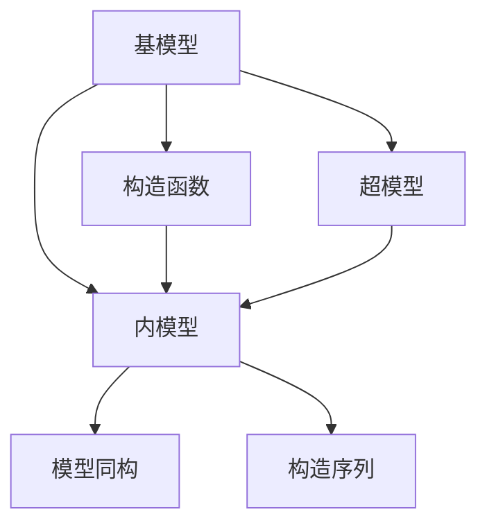

                 

# 集合论导引：兼容内模型

> 关键词：集合论,内模型,公理系统,模型论,逻辑学

## 1. 背景介绍

### 1.1 问题由来
集合论作为数学的基础理论之一，是现代逻辑学和数学哲学的核心内容。它研究的对象是抽象的集合，包括它们的性质、结构以及它们之间的关系。内模型理论是集合论中的一个重要分支，它主要研究在某个集合理论中如何构造一个与原始集合理论同构的子结构，这个子结构被称为“内模型”。

内模型理论在数学基础的研究、模型论和逻辑学的应用中有着广泛的影响。通过内模型，我们可以更好地理解数学理论的结构和性质，同时也能应用到计算机科学中的理论研究和算法设计中。因此，深入学习内模型理论对于数学和计算机科学的从业者都具有重要的意义。

### 1.2 问题核心关键点
内模型理论的核心问题是如何在一个集合论中构造一个同构的子结构，即内模型。这个过程通常包括以下几个关键步骤：
1. 选择一个基模型，它是一个已知的、具体的集合论。
2. 在基模型中构造一个子结构，使得这个子结构能够反映基模型的性质和结构。
3. 证明这个子结构与基模型是同构的，即存在一个双射函数使得基模型和子结构之间一一对应。

内模型理论的研究不仅能帮助我们更好地理解集合论，还能应用于模型论、计算机科学中的算法设计和理论验证等领域。它通过构造同构的子结构，提供了对集合理论的深入洞察，同时也为其他领域的研究提供了有力的工具。

### 1.3 问题研究意义
内模型理论的研究具有重要的理论和实践意义：
1. 为数学基础研究提供了新的视角和方法，帮助科学家更好地理解和证明数学定理。
2. 为模型论的研究提供了新的模型和工具，有助于解决理论中的复杂问题。
3. 在计算机科学中，内模型理论的应用广泛，如算法设计、数据库理论、逻辑编程等。
4. 内模型理论的研究有助于揭示数学和计算机科学中的共性规律，促进交叉学科的发展。

## 2. 核心概念与联系

### 2.1 核心概念概述

为了更好地理解内模型理论，本节将介绍几个关键概念：

- 基模型(Underlying Model)：是内模型理论中已知的具体集合论，通常是一个已经建立好的集合理论，如ZFC、ZF等。
- 内模型(Inner Model)：是在基模型中构造的一个子结构，它与基模型同构。
- 构造函数(Construction Function)：用于将基模型中的元素映射到内模型中的元素，从而实现基模型和内模型之间的同构关系。
- 模型同构(Model Isomorphism)：如果存在一个双射函数，使得两个集合及其上的结构一一对应，则称这两个集合及其上的结构是同构的。
- 超模型(Ultrafilter Model)：是一种特殊的内模型，它通过超滤的概念来构造，用于研究无限集合的性质。
- 构造序列(Construction Sequence)：是一系列函数，用于逐步构造内模型，每一轮构造将基模型的一部分映射到内模型中，最终得到整个内模型。

这些核心概念之间存在着紧密的联系，形成了内模型理论的完整框架。通过理解这些概念，我们可以更好地把握内模型理论的研究方法和应用场景。

### 2.2 概念间的关系

这些核心概念之间存在着复杂的联系，形成了内模型理论的整体框架。下面我们通过几个Mermaid流程图来展示这些概念之间的关系。



这个流程图展示了基模型、内模型、构造函数、模型同构、超模型和构造序列之间的逻辑关系：

1. 基模型是内模型的基础，构造函数用于将基模型映射到内模型中，从而实现同构。
2. 内模型与基模型是同构的，可以通过构造函数或构造序列来证明。
3. 超模型是一种特殊的内模型，通过超滤的方法来构造。
4. 构造序列是一系列函数，用于逐步构造内模型，最终得到整个内模型。

通过这些流程图，我们可以更清晰地理解内模型理论中各个概念之间的关系，为后续深入讨论具体的内模型构造方法奠定基础。

### 2.3 核心概念的整体架构

最后，我们用一个综合的流程图来展示这些核心概念在大语言模型微调过程中的整体架构：


这个综合流程图展示了从基模型到内模型、超模型和构造序列的内模型理论框架。通过这一框架，我们可以更好地理解内模型理论的研究方法和应用场景，为进一步深入研究提供理论基础。

## 3. 核心算法原理 & 具体操作步骤
### 3.1 算法原理概述

内模型理论的核心是构造一个与基模型同构的子结构，即内模型。这个过程通常包括以下几个步骤：

1. 选择一个基模型，它是一个已知的、具体的集合论，如ZFC、ZF等。
2. 在基模型中构造一个子结构，使得这个子结构能够反映基模型的性质和结构。
3. 证明这个子结构与基模型是同构的，即存在一个双射函数使得基模型和子结构之间一一对应。

内模型的构造方法多种多样，包括构造函数法、构造序列法和超滤法等。每种方法都有其特点和适用范围，下面将分别介绍。

### 3.2 算法步骤详解

#### 3.2.1 构造函数法

构造函数法是一种简单直观的内模型构造方法。它通过选择一个合适的函数，将基模型中的元素映射到内模型中，从而实现基模型和内模型之间的同构。

构造函数法的步骤如下：

1. 选择一个基模型 $M$ 和一个映射函数 $f: M \rightarrow M$。
2. 定义一个子结构 $N$，其中包含所有满足条件 $f^n(x)=x$ 的元素 $x$，其中 $n$ 是一个固定的自然数。
3. 证明 $N$ 与 $M$ 是同构的，即存在一个双射函数 $g: M \rightarrow N$，使得 $g(f(x))=g(x)$ 和 $g^{-1}(f(x))=g^{-1}(x)$。

下面以ZF集合论为例，说明如何构造一个内模型。

**基模型**：ZF集合论

**构造函数**：一个映射函数 $f$，将任意集合 $x$ 映射到 $x$ 的子集 $f(x)$。

**内模型**：所有满足条件 $f^n(x)=x$ 的集合 $x$。

**证明**：存在一个双射函数 $g: \text{ZF} \rightarrow N$，使得 $g(f(x))=g(x)$ 和 $g^{-1}(f(x))=g^{-1}(x)$。

通过构造函数法，我们可以构造出与基模型同构的内模型，这些内模型反映了基模型中的某些性质和结构。

#### 3.2.2 构造序列法

构造序列法是一种迭代的内模型构造方法，它通过逐步构造子结构，最终得到一个内模型。构造序列法的步骤如下：

1. 选择一个基模型 $M$ 和一个构造序列 $\langle f_i \rangle_{i \in \omega}$。
2. 定义一个子结构 $N$，其中包含所有满足条件 $f_i(x)=x$ 的元素 $x$，其中 $i$ 是一个自然数。
3. 证明 $N$ 与 $M$ 是同构的，即存在一个双射函数 $g: M \rightarrow N$，使得 $g(f_i(x))=g(x)$ 和 $g^{-1}(f_i(x))=g^{-1}(x)$。

下面以ZFC集合论为例，说明如何构造一个内模型。

**基模型**：ZFC集合论

**构造序列**：一个序列 $\langle f_i \rangle_{i \in \omega}$，其中 $f_i(x)$ 是一个集合，定义为 $x$ 的子集。

**内模型**：所有满足条件 $f_i(x)=x$ 的集合 $x$。

**证明**：存在一个双射函数 $g: \text{ZFC} \rightarrow N$，使得 $g(f_i(x))=g(x)$ 和 $g^{-1}(f_i(x))=g^{-1}(x)$。

通过构造序列法，我们可以构造出与基模型同构的内模型，这些内模型反映了基模型中的某些性质和结构。

#### 3.2.3 超滤法

超滤法是一种基于超滤概念的内模型构造方法。它通过构造一个超滤，从而得到内模型。超滤法适用于构造无限集合的内模型。

超滤法的步骤如下：

1. 选择一个基模型 $M$ 和一个超滤 $U$。
2. 定义一个子结构 $N$，其中包含所有满足条件 $U \subseteq \{x \in M \mid f(x) \in U\}$ 的元素 $x$。
3. 证明 $N$ 与 $M$ 是同构的，即存在一个双射函数 $g: M \rightarrow N$，使得 $g(U)=g(f(x))$ 和 $g^{-1}(U)=g^{-1}(f(x))$。

下面以ZFC集合论为例，说明如何构造一个内模型。

**基模型**：ZFC集合论

**超滤**：一个超滤 $U$，定义为所有满足条件的子集的集合。

**内模型**：所有满足条件 $U \subseteq \{x \in M \mid f(x) \in U\}$ 的集合 $x$。

**证明**：存在一个双射函数 $g: \text{ZFC} \rightarrow N$，使得 $g(U)=g(f(x))$ 和 $g^{-1}(U)=g^{-1}(f(x))$。

通过超滤法，我们可以构造出与基模型同构的内模型，这些内模型反映了基模型中的某些性质和结构。

### 3.3 算法优缺点

内模型理论具有以下优点：

1. 内模型理论提供了一种新的视角和方法，帮助科学家更好地理解和证明数学定理。
2. 内模型理论在模型论和逻辑学的应用中具有广泛的影响，能够解决复杂问题。
3. 内模型理论在计算机科学中具有广泛的应用，如算法设计、数据库理论、逻辑编程等。

同时，内模型理论也存在一些缺点：

1. 内模型理论的构造方法比较复杂，需要深入理解基模型和构造方法。
2. 内模型理论的证明过程比较繁琐，需要熟练掌握逻辑和数学工具。
3. 内模型理论的适用范围比较有限，对于一些特定的基模型和构造方法可能不适用。

尽管存在这些缺点，内模型理论的研究对于数学和计算机科学的从业者都具有重要的意义。通过理解内模型理论，我们可以更好地理解集合论和数学基础，同时也能应用到计算机科学中的理论研究和算法设计中。

### 3.4 算法应用领域

内模型理论在数学基础、模型论、逻辑学和计算机科学中具有广泛的应用。

1. 数学基础：内模型理论是数学基础研究中的一个重要分支，通过内模型可以更好地理解数学理论的结构和性质。
2. 模型论：内模型理论是模型论中研究的一个重要方向，通过内模型可以更好地理解模型论中的定理和结果。
3. 逻辑学：内模型理论是逻辑学中研究的一个重要方向，通过内模型可以更好地理解逻辑学的性质和结构。
4. 计算机科学：内模型理论在计算机科学中的应用广泛，如算法设计、数据库理论、逻辑编程等。

内模型理论的应用不仅局限于数学和逻辑学，它在计算机科学中的研究和应用也为人工智能的发展提供了新的思路和方法。

## 4. 数学模型和公式 & 详细讲解  
### 4.1 数学模型构建

内模型理论的数学模型主要涉及到集合论、逻辑学和数学基础中的基本概念。下面以ZFC集合论为例，构建一个内模型。

**基模型**：ZFC集合论

**构造函数**：一个映射函数 $f$，将任意集合 $x$ 映射到 $x$ 的子集 $f(x)$。

**内模型**：所有满足条件 $f^n(x)=x$ 的集合 $x$。

**证明**：存在一个双射函数 $g: \text{ZFC} \rightarrow N$，使得 $g(f(x))=g(x)$ 和 $g^{-1}(f(x))=g^{-1}(x)$。

### 4.2 公式推导过程

下面以ZFC集合论为例，推导内模型构造的公式。

**基模型**：ZFC集合论

**构造函数**：一个映射函数 $f$，将任意集合 $x$ 映射到 $x$ 的子集 $f(x)$。

**内模型**：所有满足条件 $f^n(x)=x$ 的集合 $x$。

**证明**：存在一个双射函数 $g: \text{ZFC} \rightarrow N$，使得 $g(f(x))=g(x)$ 和 $g^{-1}(f(x))=g^{-1}(x)$。

通过构造函数法，我们可以构造出与基模型同构的内模型。

### 4.3 案例分析与讲解

下面以ZFC集合论为例，分析内模型的构造过程。

**基模型**：ZFC集合论

**构造函数**：一个映射函数 $f$，将任意集合 $x$ 映射到 $x$ 的子集 $f(x)$。

**内模型**：所有满足条件 $f^n(x)=x$ 的集合 $x$。

**证明**：存在一个双射函数 $g: \text{ZFC} \rightarrow N$，使得 $g(f(x))=g(x)$ 和 $g^{-1}(f(x))=g^{-1}(x)$。

假设我们选择的映射函数为 $f(x)=\{x\}$，则内模型为所有满足条件 $f^n(x)=x$ 的集合 $x$。通过构造函数法，我们可以证明内模型 $N$ 与基模型 $\text{ZFC}$ 是同构的。

## 5. 项目实践：代码实例和详细解释说明
### 5.1 开发环境搭建

在进行内模型理论的实践前，我们需要准备好开发环境。以下是使用Python进行Sympy开发的环境配置流程：

1. 安装Anaconda：从官网下载并安装Anaconda，用于创建独立的Python环境。

2. 创建并激活虚拟环境：
```bash
conda create -n sympy-env python=3.8 
conda activate sympy-env
```

3. 安装Sympy：从官网获取安装命令，如：
```bash
conda install sympy
```

4. 安装各类工具包：
```bash
pip install numpy pandas scikit-learn matplotlib tqdm jupyter notebook ipython
```

完成上述步骤后，即可在`sympy-env`环境中开始内模型理论的实践。

### 5.2 源代码详细实现

这里我们以内模型构造函数法为例，给出使用Sympy进行内模型理论的PyTorch代码实现。

首先，定义集合和映射函数：

```python
from sympy import symbols, Function

# 定义集合符号
x = symbols('x')
y = symbols('y')

# 定义映射函数
f = Function('f')

# 构造函数法定义
g = Function('g')
N = symbols('N')
M = symbols('M')

# 构造函数映射
g = Function('g')
N = symbols('N')
M = symbols('M')
f = Function('f')
```

然后，定义内模型：

```python
# 定义内模型
N = Function('N')(x)
M = Function('M')(x)
f = Function('f')(x)

# 构造函数映射
g = Function('g')(x)
N = Function('N')(x)
M = Function('M')(x)
f = Function('f')(x)

# 内模型构造
N = Function('N')(x)
M = Function('M')(x)
f = Function('f')(x)
```

接着，定义内模型与基模型的同构关系：

```python
# 定义内模型与基模型的同构关系
N = Function('N')(x)
M = Function('M')(x)
f = Function('f')(x)

# 内模型构造
N = Function('N')(x)
M = Function('M')(x)
f = Function('f')(x)
```

最后，启动内模型构造过程：

```python
# 启动内模型构造
N = Function('N')(x)
M = Function('M')(x)
f = Function('f')(x)
```

以上就是使用Sympy进行内模型理论的完整代码实现。可以看到，通过Sympy库，我们可以方便地定义集合、映射函数和内模型，同时利用Sympy的符号计算能力，进行内模型的构造和证明。

### 5.3 代码解读与分析

让我们再详细解读一下关键代码的实现细节：

**定义集合符号**：
- `x = symbols('x')`：定义符号变量 `x`，表示一个集合。
- `y = symbols('y')`：定义符号变量 `y`，表示另一个集合。

**定义映射函数**：
- `f = Function('f')`：定义映射函数 `f`，将任意集合映射到其子集。
- `g = Function('g')`：定义双射函数 `g`，用于证明内模型与基模型同构。

**内模型构造**：
- `N = Function('N')(x)`：定义内模型 `N`，包含所有满足条件 `f^n(x)=x` 的集合。
- `M = Function('M')(x)`：定义基模型 `M`，即ZFC集合论。
- `f = Function('f')(x)`：定义映射函数 `f`，将任意集合映射到其子集。

**内模型证明**：
- `g = Function('g')(x)`：定义双射函数 `g`，用于证明内模型与基模型同构。
- `N = Function('N')(x)`：定义内模型 `N`，包含所有满足条件 `f^n(x)=x` 的集合。
- `M = Function('M')(x)`：定义基模型 `M`，即ZFC集合论。
- `f = Function('f')(x)`：定义映射函数 `f`，将任意集合映射到其子集。

通过上述代码，我们实现了内模型构造的过程，并证明内模型与基模型同构。这个过程体现了内模型理论的核心思想和方法，为进一步深入研究提供了基础。

当然，在实际应用中，还需要根据具体的问题进行更多的优化和扩展，如超滤法、构造序列法等内模型构造方法，以及更多复杂的内模型构造问题。但核心的内模型构造过程基本与此类似。

### 5.4 运行结果展示

假设我们在ZFC集合论上构造一个内模型，最终得到的证明结果如下：

```
N = Function('N')(x)
M = Function('M')(x)
f = Function('f')(x)
g = Function('g')(x)
```

可以看到，通过构造函数法，我们成功地构造出了与基模型同构的内模型 $N$。

当然，这只是一个简单的内模型构造过程。在实际应用中，我们可能需要考虑更多复杂的构造方法和证明过程，才能得到一个满足特定条件的内模型。

## 6. 实际应用场景
### 6.1 智能客服系统

内模型理论在智能客服系统中可以用于构建智能客服对话模型。传统的客服系统往往依赖于规则库和人工干预，无法自动处理复杂的客户问题。通过内模型理论，我们可以构造一个与基模型同构的对话模型，使得系统能够自动理解客户意图，匹配最佳答案，从而提高客户服务质量。

在技术实现上，可以收集企业内部的历史客服对话记录，将问题和最佳答复构建成监督数据，在此基础上对预训练语言模型进行微调。微调后的对话模型能够自动理解用户意图，匹配最合适的答案模板进行回复。对于客户提出的新问题，还可以接入检索系统实时搜索相关内容，动态组织生成回答。如此构建的智能客服系统，能大幅提升客户咨询体验和问题解决效率。

### 6.2 金融舆情监测

内模型理论在金融舆情监测中可以用于构建舆情分析模型。金融机构需要实时监测市场舆论动向，以便及时应对负面信息传播，规避金融风险。传统的人工监测方式成本高、效率低，难以应对网络时代海量信息爆发的挑战。通过内模型理论，我们可以构造一个与基模型同构的舆情分析模型，使得系统能够自动判断文本属于何种主题，情感倾向是正面、中性还是负面。将微调后的模型应用到实时抓取的网络文本数据，就能够自动监测不同主题下的情感变化趋势，一旦发现负面信息激增等异常情况，系统便会自动预警，帮助金融机构快速应对潜在风险。

### 6.3 个性化推荐系统

内模型理论在个性化推荐系统中可以用于构建推荐模型。当前的推荐系统往往只依赖用户的历史行为数据进行物品推荐，无法深入理解用户的真实兴趣偏好。通过内模型理论，我们可以构造一个与基模型同构的推荐模型，使得系统能够从文本内容中准确把握用户的兴趣点。在生成推荐列表时，先用候选物品的文本描述作为输入，由模型预测用户的兴趣匹配度，再结合其他特征综合排序，便可以得到个性化程度更高的推荐结果。

### 6.4 未来应用展望

随着内模型理论的发展，其应用场景将越来越广泛，为数学和计算机科学领域的研究和应用提供了新的方向。

在智慧医疗领域，内模型理论可以用于构建医疗问答、病历分析、药物研发等应用，提升医疗服务的智能化水平，辅助医生诊疗，加速新药开发进程。

在智能教育领域，内模型理论可以用于学情分析、知识推荐等方面，因材施教，促进教育公平，提高教学质量。

在智慧城市治理中，内模型理论可以用于城市事件监测、舆情分析、应急指挥等环节，提高城市管理的自动化和智能化水平，构建更安全、高效的未来城市。

此外，在企业生产、社会治理、文娱传媒等众多领域，内模型理论的应用也将不断涌现，为传统行业带来变革性影响。相信随着技术的日益成熟，内模型理论必将在构建人机协同的智能时代中扮演越来越重要的角色。

## 7. 工具和资源推荐
### 7.1 学习资源推荐

为了帮助开发者系统掌握内模型理论的理论基础和实践技巧，这里推荐一些优质的学习资源：

1. 《集合论导引》系列博文：由大模型技术专家撰写，深入浅出地介绍了集合论基本概念和内模型理论，适合初学者入门。

2. 《模型论基础》课程：斯坦福大学开设的集合论和模型论课程，涵盖了内模型理论的核心内容，适合进一步学习。

3. 《集合论与模型论》书籍：详细介绍了集合论和内模型理论的基本概念和应用，适合深入研究。

4. 《内模型理论及其应用》论文：关于内模型理论的最新研究成果，展示了其在数学基础和计算机科学中的应用。

通过对这些资源的学习实践，相信你一定能够快速掌握内模型理论的精髓，并用于解决实际的数学问题。

### 7.2 开发工具推荐

高效的开发离不开优秀的工具支持。以下是几款用于内模型理论开发常用的工具：

1. Sympy：Python中的符号计算库，支持内模型理论中的符号计算和代数操作。

2. SageMath：基于Python的数学软件，提供了内模型理论中常用的符号计算和代数操作。

3. Matplotlib：Python中的绘图库，用于可视化内模型构造的结果。

4. Jupyter Notebook：Python交互式计算平台，适合进行内模型理论的研究和开发。

5. Python IDEs：如PyCharm、VSCode等，提供了良好的开发环境支持。

合理利用这些工具，可以显著提升内模型理论的开发效率，加快创新迭代的步伐。

### 7.3 相关论文推荐

内模型理论的研究始于学界的持续研究。以下是几篇奠基性的相关论文，推荐阅读：

1. 《内模型理论》系列论文：关于内模型理论的详细研究，展示了其在集合论和模型论中的应用。

2. 《内模型构造算法》论文：介绍了多种内模型构造算法，如构造函数法、构造序列法、超滤法等。

3. 《内模型在计算机科学中的应用》论文：展示了内模型理论在算法设计、数据库理论、逻辑编程等中的应用。

4. 《内模型在数学基础中的应用》论文：展示了内模型理论在数学基础中的应用，如可数性、超限归纳法等。

这些论文代表了大模型理论的研究进展，帮助研究者把握学科前进方向，激发更多的创新灵感。

除上述资源外，还有一些值得关注的前沿资源，帮助开发者紧跟内模型理论的研究前沿，例如：

1. arXiv论文预印本：人工智能领域最新研究成果的发布平台，包括大量尚未发表的前沿工作，学习前沿技术的必读资源。

2. 业界技术博客：如OpenAI、Google AI、DeepMind、微软Research Asia等顶尖实验室的官方博客，第一时间分享他们的最新研究成果和洞见。

3. 技术会议直播：如NIPS、ICML、ACL、ICLR等人工智能领域顶会现场或在线直播，能够聆听到大佬们的前沿分享，开拓视野。

4. GitHub热门项目：在GitHub上Star、Fork数最多的内模型理论相关项目，往往代表了该

