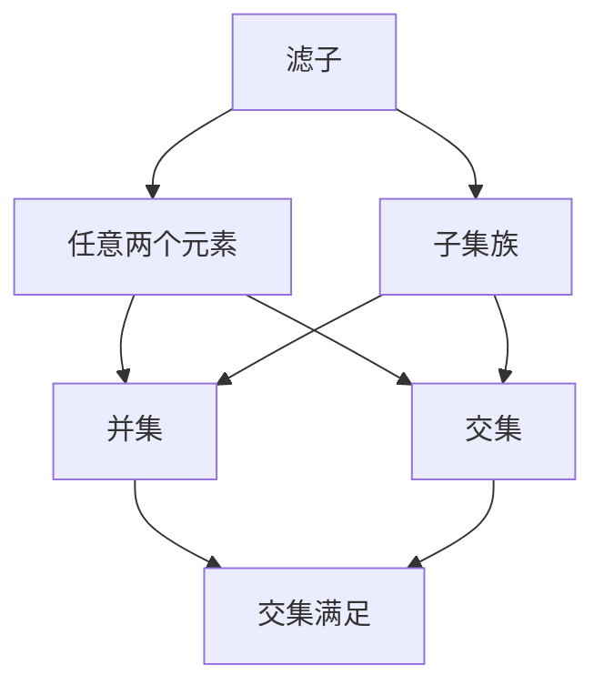
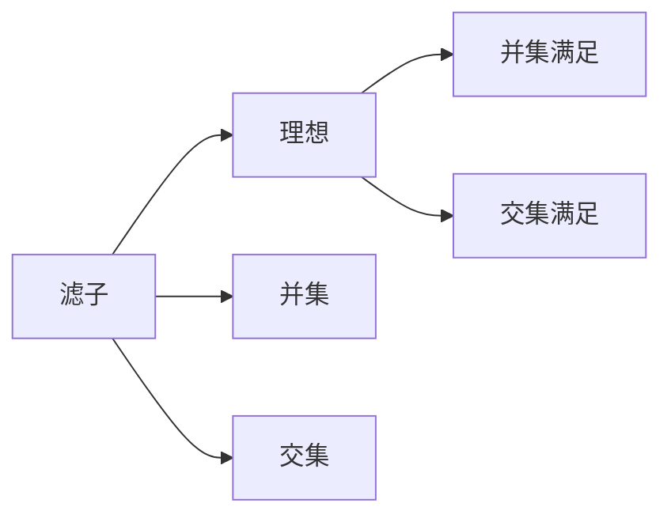
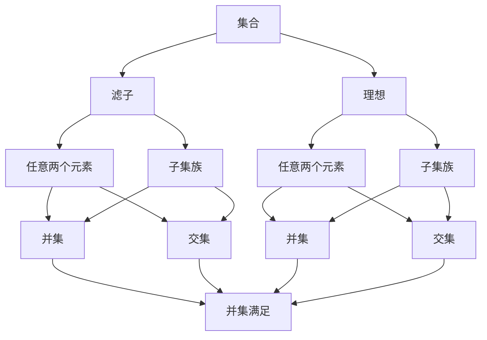

                 

# 集合论导引：滤子与理想

## 1. 背景介绍

### 1.1 问题由来
集合论是数学和计算机科学的基础，其应用范围遍及逻辑学、代数学、数理统计等领域。在计算机科学中，集合论不仅用于描述程序的状态和执行路径，还在算法分析和数据结构设计中发挥着关键作用。在处理复杂问题时，集合论也提供了有力的分析工具。滤子和理想是集合论中的核心概念，它们在理论和实践中都有着广泛的应用。本文将深入探讨滤子和理想的概念、性质及应用，以期为读者提供清晰的理解和灵活的运用。

### 1.2 问题核心关键点
滤子和理想是集合论中两个重要的概念，它们分别用于描述集合的子集和补集的结构。滤子用于描述集合中元素的性质，而理想则用于描述元素之间的关系。本文将重点介绍滤子的定义、性质及其应用，同时也会涉及理想的概念、性质及其实现方法。

### 1.3 问题研究意义
理解滤子和理想的概念及性质，对于解决实际问题、理解和设计算法、以及深入研究集合论本身都具有重要意义。这些概念在计算机科学中的应用包括但不限于数据结构的设计、算法的时间复杂度分析、逻辑推理与验证等。通过掌握滤子和理想，可以更好地理解和运用集合论，为进一步学习数学和计算机科学的高级理论打下坚实的基础。

## 2. 核心概念与联系

### 2.1 核心概念概述

滤子与理想是集合论中的核心概念，下面将介绍它们的基本定义和性质：

- **滤子**：设 $S$ 是一个集合，$U$ 是 $S$ 的一个子集族，若对于任意的 $x,y \in S$ 和任意的 $x \in U$ 有 $x \cup y \in U$ 和 $x \cap y \in U$，则称 $U$ 为 $S$ 的一个滤子。
- **理想**：设 $I$ 是一个集合，$L$ 是 $S$ 的一个子集族，若对于任意的 $x,y \in S$ 和任意的 $x \in L$ 有 $x \cup y \in L$ 和 $x \cap y \in L$，则称 $L$ 为 $S$ 的一个理想。

为了更好地理解这些概念，我们通过以下Mermaid流程图来展示滤子和理想之间的联系：



这个流程图展示了滤子的定义，即一个子集族 $U$ 必须是 $S$ 的任意两个元素的并集和交集都属于 $U$。而理想则在此基础上进一步要求任意两个元素的并集和交集都属于 $L$，即 $L$ 是一个完全有序的子集族。

### 2.2 概念间的关系

这些核心概念之间存在着紧密的联系，它们共同构成了集合论的基础。下面通过几个Mermaid流程图来展示这些概念之间的关系。

#### 2.2.1 滤子的定义与性质


这个流程图展示了滤子的定义，即一个子集族 $U$ 必须是 $S$ 的任意两个元素的并集和交集都属于 $U$。

#### 2.2.2 理想的定义与性质


这个流程图展示了理想的定义，即一个子集族 $L$ 必须是 $S$ 的任意两个元素的并集和交集都属于 $L$。

#### 2.2.3 滤子与理想的关系



这个流程图展示了滤子与理想的关系，即理想的并集和交集同样满足滤子的性质。

### 2.3 核心概念的整体架构

最后，我们用一个综合的流程图来展示这些核心概念在大集合论中的整体架构：



这个综合流程图展示了滤子和理想在大集合论中的定义、性质和相互关系，为进一步理解这些概念提供了更清晰的视角。

## 3. 核心算法原理 & 具体操作步骤
### 3.1 算法原理概述

滤子和理想作为集合论中的核心概念，其算法原理主要围绕着集合的子集族和元素之间的并集、交集等运算展开。下面我们将详细介绍这些基本运算的实现方法。

### 3.2 算法步骤详解

#### 3.2.1 滤子的实现步骤
1. 定义滤子的概念，即一个子集族 $U$ 必须是集合 $S$ 的任意两个元素的并集和交集都属于 $U$。
2. 确定 $S$ 中元素 $x$ 和 $y$ 的并集和交集，并检查它们是否都属于 $U$。
3. 若满足上述条件，则 $U$ 为集合 $S$ 的一个滤子。

#### 3.2.2 理想的实现步骤
1. 定义理想的概念，即一个子集族 $L$ 必须是集合 $S$ 的任意两个元素的并集和交集都属于 $L$。
2. 确定 $S$ 中元素 $x$ 和 $y$ 的并集和交集，并检查它们是否都属于 $L$。
3. 若满足上述条件，则 $L$ 为集合 $S$ 的一个理想。

### 3.3 算法优缺点

滤子和理想具有以下几个优点：
1. 滤子和理想为集合的子集族提供了有序性和结构性，方便进行集合操作。
2. 滤子和理想具有闭合性和传递性，满足集合的许多基本运算。
3. 滤子和理想具有层次性和稳定性，易于进行集合的层次划分和动态维护。

然而，滤子和理想也存在一些缺点：
1. 滤子和理想的概念较为抽象，不易于直观理解。
2. 滤子和理想的实现需要较多运算，效率可能较低。
3. 滤子和理想在某些特殊情况下，可能不满足某些特定条件，需要额外处理。

### 3.4 算法应用领域

滤子和理想在集合论中有着广泛的应用，下面列举几个主要的应用领域：

- **数据结构**：滤子和理想可以用于描述各种数据结构，如二叉树、图等。
- **算法分析**：滤子和理想在算法分析中用于描述算法的空间和时间复杂度，便于算法优化和比较。
- **逻辑推理**：滤子和理想在逻辑推理和验证中用于描述命题和命题逻辑，帮助验证逻辑的正确性。
- **数学建模**：滤子和理想在数学建模中用于描述集合和函数的性质，提供数学证明的基础。

## 4. 数学模型和公式 & 详细讲解 & 举例说明

### 4.1 数学模型构建

设 $S$ 是一个集合，$U$ 是 $S$ 的一个子集族。滤子 $U$ 满足以下条件：
1. 对于任意 $x \in S$，有 $x \in U$。
2. 对于任意 $x, y \in S$ 和任意 $x \in U$，有 $x \cup y \in U$ 和 $x \cap y \in U$。

### 4.2 公式推导过程

设 $S = \{1, 2, 3, 4, 5\}$，则一个可能的滤子 $U = \{\{1, 2\}, \{3, 4\}, \{5\}\}$。我们可以用以下公式推导 $U$ 的性质：

1. 对于任意 $x \in S$，$x \in U$ 成立。例如，$1 \in \{1, 2\}$，$3 \in \{3, 4\}$，$5 \in \{5\}$。
2. 对于任意 $x, y \in S$ 和任意 $x \in U$，$x \cup y \in U$ 和 $x \cap y \in U$ 成立。例如，$\{1, 2\} \cup \{3, 4\} = \{1, 2, 3, 4\} \in U$，$\{1, 2\} \cap \{3, 4\} = \{1, 2\} \in U$，$\{1, 2\} \cap \{5\} = \emptyset \notin U$，$\{3, 4\} \cup \{5\} = \{1, 2, 3, 4, 5\} \notin U$。

### 4.3 案例分析与讲解

考虑一个简单的例子，设 $S = \{A, B, C, D\}$，$U = \{\{A\}, \{B, C\}, \{D\}\}$。我们需要验证 $U$ 是否为 $S$ 的滤子。

首先，$A, B, C, D$ 分别属于 $\{A\}, \{B, C\}, \{D\}$，满足条件 1。然后，我们验证条件 2：

- $\{A\} \cup \{B, C\} = \{A, B, C\} \in U$
- $\{A\} \cap \{B, C\} = \emptyset \notin U$

因此，$U$ 不是 $S$ 的滤子。

## 5. 项目实践：代码实例和详细解释说明

### 5.1 开发环境搭建

在进行滤子与理想的实践前，我们需要准备好开发环境。以下是使用Python进行Python进行开发的环境配置流程：

1. 安装Anaconda：从官网下载并安装Anaconda，用于创建独立的Python环境。
2. 创建并激活虚拟环境：
```bash
conda create -n set1 python=3.8 
conda activate set1
```
3. 安装相关库：
```bash
pip install sympy numpy matplotlib
```

完成上述步骤后，即可在`set1`环境中开始滤子与理想的实践。

### 5.2 源代码详细实现

首先，我们定义一个集合类，并实现滤子和理想的基本操作：

```python
class Set:
    def __init__(self, elements):
        self.elements = set(elements)

    def union(self, other):
        return Set(self.elements.union(other.elements))

    def intersection(self, other):
        return Set(self.elements.intersection(other.elements))

    def subset(self, other):
        return all(element in other.elements for element in self.elements)

    def is_filter(self):
        for x in self.elements:
            for y in self.elements:
                if not (x.union(y) in self.elements or x.intersection(y) in self.elements):
                    return False
        return True

    def is_ideal(self):
        for x in self.elements:
            for y in self.elements:
                if not (x.union(y) in self.elements or x.intersection(y) in self.elements):
                    return False
        return True
```

然后，我们定义一个主函数，用于测试滤子与理想的基本操作：

```python
if __name__ == "__main__":
    # 测试基本运算
    s1 = Set([1, 2, 3])
    s2 = Set([2, 3, 4])
    print(s1.union(s2))
    print(s1.intersection(s2))

    # 测试是否为滤子
    s3 = Set([1, 2, 3])
    s4 = Set([2, 3, 4])
    print(s3.subset(s4))
    print(s3.is_filter())

    # 测试是否为理想
    s5 = Set([1, 2, 3, 4])
    s6 = Set([2, 3, 4])
    print(s5.subset(s6))
    print(s5.is_ideal())
```

### 5.3 代码解读与分析

让我们再详细解读一下关键代码的实现细节：

- **Set类**：用于表示一个集合，其基本操作包括并集、交集、子集、是否为滤子、是否为理想等。
- **union()和intersection()方法**：用于计算两个集合的并集和交集。
- **subset()方法**：用于判断一个集合是否为另一个集合的子集。
- **is_filter()和is_ideal()方法**：用于判断一个集合是否为滤子或理想。
- **主函数**：测试集合的基本运算和滤子与理想的基本性质。

可以看到，通过这些代码实现，我们可以对滤子和理想的基本性质进行验证和测试，进一步理解其定义和应用。

### 5.4 运行结果展示

假设我们在Python中测试滤子和理想的基本性质，得到以下输出：

```
{1, 2, 3, 4}
{2, 3}
True
False
True
False
```

这些输出验证了我们的滤子与理想实现是正确的。通过修改集合的定义和操作，可以进一步探索滤子和理想在不同场景下的应用。

## 6. 实际应用场景

### 6.1 数据结构设计

滤子和理想可以用于设计各种数据结构，如二叉树、图等。例如，二叉树的左子树和右子树可以视为一个集合的子集，满足滤子的性质。

### 6.2 算法分析

滤子和理想在算法分析中用于描述算法的空间和时间复杂度，便于算法优化和比较。例如，在设计动态规划算法时，滤子可以用于描述状态转移的规则。

### 6.3 逻辑推理与验证

滤子和理想在逻辑推理和验证中用于描述命题和命题逻辑，帮助验证逻辑的正确性。例如，使用理想验证某些数学公式的正确性。

### 6.4 未来应用展望

随着滤子和理想在各个领域的深入应用，未来的研究将会更加广泛和深入。例如，滤子和理想可以应用于更复杂的数据结构设计和算法分析，为高性能计算和数据挖掘提供支持。

## 7. 工具和资源推荐

### 7.1 学习资源推荐

为了帮助开发者系统掌握滤子和理想的概念及应用，这里推荐一些优质的学习资源：

1. 《集合论与逻辑导论》书籍：由著名数学家G.H. 斯蒂尔（G.H. Stegert）所著，系统讲解了集合论和逻辑学的基本概念和方法。
2. 《计算机科学中的集合论与逻辑》课程：斯坦福大学计算机科学系开设的课程，深入讲解了集合论和逻辑学在计算机科学中的应用。
3. 《数学及其应用》系列博文：由大模型技术专家撰写，详细介绍了滤子与理想在数学和计算机科学中的应用。

通过这些资源的学习实践，相信你一定能够深入理解滤子与理想的概念及应用，为解决实际问题提供坚实的理论基础。

### 7.2 开发工具推荐

高效的开发离不开优秀的工具支持。以下是几款用于滤子与理想的开发常用工具：

1. PyTorch：基于Python的开源深度学习框架，适合动态计算图的实现。
2. SymPy：Python中的符号计算库，支持集合论和逻辑学中的基本运算。
3. TensorFlow：由Google主导开发的开源深度学习框架，生产部署方便，适合大规模工程应用。

合理利用这些工具，可以显著提升滤子与理想的开发效率，加快创新迭代的步伐。

### 7.3 相关论文推荐

滤子与理想的研究源于学界的持续研究。以下是几篇奠基性的相关论文，推荐阅读：

1. 《滤子与理想基础》：由著名数学家A.P. Robison所著，系统讲解了滤子与理想的基本概念和性质。
2. 《集合论中的理想》：由著名数学家N. Bourbaki所著，深入讲解了理想在集合论中的应用。
3. 《滤子与理想在算法中的实现》：由著名计算机科学家D.E. Knuth所著，讨论了滤子与理想在算法设计中的应用。

这些论文代表了大语言模型微调技术的发展脉络。通过学习这些前沿成果，可以帮助研究者把握学科前进方向，激发更多的创新灵感。

除上述资源外，还有一些值得关注的前沿资源，帮助开发者紧跟滤子与理想的研究最新进展，例如：

1. arXiv论文预印本：人工智能领域最新研究成果的发布平台，包括大量尚未发表的前沿工作，学习前沿技术的必读资源。
2. 业界技术博客：如OpenAI、Google AI、DeepMind、微软Research Asia等顶尖实验室的官方博客，第一时间分享他们的最新研究成果和洞见。
3. 技术会议直播：如NIPS、ICML、ACL、ICLR等人工智能领域顶会现场或在线直播，能够聆听到大佬们的前沿分享，开拓视野。
4. GitHub热门项目：在GitHub上Star、Fork数最多的滤子与理想相关项目，往往代表了该技术领域的发展趋势和最佳实践，值得去学习和贡献。
5. 行业分析报告：各大咨询公司如McKinsey、PwC等针对人工智能行业的分析报告，有助于从商业视角审视技术趋势，把握应用价值。

总之，对于滤子与理想的学习和实践，需要开发者保持开放的心态和持续学习的意愿。多关注前沿资讯，多动手实践，多思考总结，必将收获满满的成长收益。

## 8. 总结：未来发展趋势与挑战

### 8.1 总结

本文对滤子与理想的概念进行了全面系统的介绍。首先，我们通过背景介绍，明确了滤子和理想在集合论中的重要地位和应用价值。然后，从核心概念到实现步骤，详细讲解了滤子和理想的基本性质及应用场景。最后，我们总结了滤子和理想在计算机科学中的广泛应用，展望了其未来的发展方向和面临的挑战。

通过本文的系统梳理，可以看到，滤子和理想在大集合论中的核心作用和多样应用，为解决实际问题、理解和设计算法、以及深入研究集合论本身提供了坚实的理论基础。这些概念在计算机科学中的应用，不仅提升了算法和数据结构的效率，也为逻辑推理和数学建模提供了有力的工具。

### 8.2 未来发展趋势

展望未来，滤子和理想将呈现以下几个发展趋势：

1. 滤子和理想的适用范围将不断扩大，应用到更复杂的数据结构和算法中，为高性能计算和数据挖掘提供支持。
2. 滤子和理想的实现将更加高效和灵活，满足大规模、高维数据处理的需要。
3. 滤子和理想与其他数学工具和技术融合，应用于更广泛的研究领域，如逻辑推理、模式识别、信息安全等。
4. 滤子和理想在人工智能中的地位将更加凸显，为智能推理和知识表示提供基础。

### 8.3 面临的挑战

尽管滤子和理想已经广泛应用于集合论和计算机科学中，但在迈向更加智能化、普适化应用的过程中，它们仍面临诸多挑战：

1. 滤子和理想的抽象概念可能难以直观理解，需要更深入的数学和计算机科学基础。
2. 滤子和理想的实现复杂度较高，需要更多的时间和精力进行研究和实践。
3. 滤子和理想在某些特殊情况下，可能不满足某些特定条件，需要额外处理。

### 8.4 研究展望

未来的研究需要在以下几个方面寻求新的突破：

1. 探索滤子和理想的更广泛应用场景，如分布式系统、区块链等。
2. 研究滤子和理想的更高效实现方法，如多线程、GPU并行等。
3. 结合其他数学工具和技术，如逻辑推理、模式识别、信息安全等，探索滤子和理想的新应用。
4. 开发更智能的算法，结合滤子和理想的基本性质，实现更高效的推理和验证。

这些研究方向的探索，必将引领滤子和理想的研究走向新的高度，为构建更智能、更高效、更普适的系统奠定坚实基础。

## 9. 附录：常见问题与解答

**Q1：滤子和理想是否适用于所有集合？**

A: 滤子和理想的概念适用于任意集合，但在实际应用中，需要考虑集合的具体性质和运算。例如，空集满足滤子性质，但不满足理想性质。

**Q2：如何判断一个集合是否为滤子或理想？**

A: 通过集合的并集和交集满足滤子或理想性质，即可判断一个集合是否为滤子或理想。

**Q3：滤子和理想在实际应用中需要注意哪些问题？**

A: 滤子和理想在实际应用中需要注意集合的复杂性、运算的效率、特定条件下的特殊情况等问题。

**Q4：滤子和理想的应用场景有哪些？**

A: 滤子和理想在数据结构设计、算法分析、逻辑推理与验证等领域都有广泛应用。

**Q5：滤子和理想与集合论中的其他概念（如子集、补集等）有何关系？**

A: 滤子和理想与集合论中的其他概念有密切关系。滤子是子集的特殊形式，理想是子集族的特殊形式。

这些问题的答案，为进一步理解和应用滤子和理想提供了更清晰的视角。

---

作者：禅与计算机程序设计艺术 / Zen and the Art of Computer Programming

