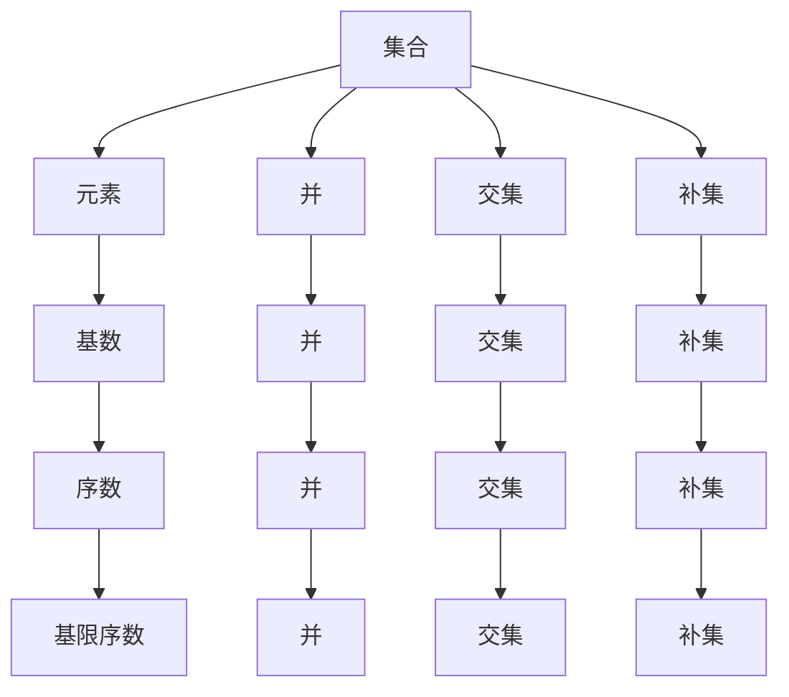
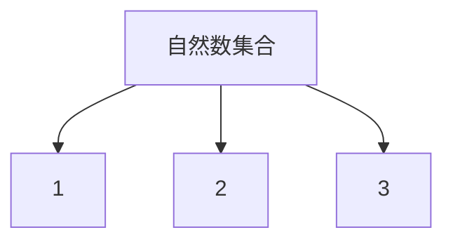
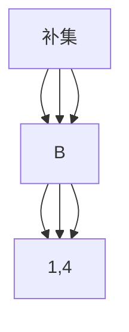
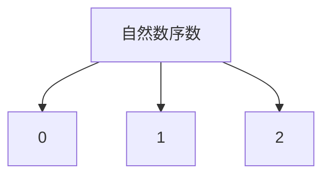

                 

# 集合论导引：集合Vw与彻底有限集合

> 关键词：集合论, 集合Vw, 彻底有限集合, 序数, 基限序数, 超限归纳法

## 1. 背景介绍

集合论是数学中最为基础和深奥的分支之一，也是计算机科学中各种理论的基础。在现代计算机科学中，集合的构念几乎随处可见，从数据结构的实现到理论计算机科学的许多分支，都与集合的性质密切相关。尽管许多计算机科学家并未深入学习集合论，但它构成了许多计算机科学领域中理论的基础，并深刻影响了算法设计和编程思维。

### 1.1 背景概要

- 集合理论的兴起可以追溯到19世纪末，起初被认为是对古典数学的抽象和补充，但随后逐步发展为现代数学的基础。
- 集合论在逻辑学、数学、物理学、计算机科学、语言学等多个学科均有重要应用，是理论与实践相结合的典范。
- 计算机科学家需要理解集合论的基本概念与定理，例如集合、元素、并、交集、补、基数、序数、公理系统等，以便于运用其在算法设计、逻辑推理、抽象数据类型等中的应用。
- 本文将深入探讨集合论中的一些核心概念，包括集合、Vw、彻底有限集合、序数等，并详细阐述这些概念的联系与区别。

## 2. 核心概念与联系

### 2.1 核心概念概述

- 集合: 集合是数学中最基本的概念之一，由一些确定的对象构成，这些对象被称为元素的集合。集合可以用符号表示，如 $A=\{1,2,3\}$。
- 元素: 集合中的每个对象称为元素，如 $2 \in A$。
- 并、交集、补集: 并是两个集合的结合，如 $A \cup B$；交集是两个集合共有的元素，如 $A \cap B$；补集是除了某个集合之外的元素集合，如 $C \setminus A$。
- 基数: 集合中元素的个数称为该集合的基数，记为 $|A|$。
- 序数: 表示元素之间顺序关系的数学对象，如 $\omega$ 表示自然数的集合。

### 2.2 核心概念间的联系

集合论中的各种概念并非孤立存在，而是相互关联的。以下合成的Mermaid流程图展示了这些概念的联系：



这个流程图示意了集合论中基本概念间的联系。集合由元素构成，并、交集和补集是集合的基本操作，基数用于衡量集合的规模，序数用于描述元素的排列顺序。其中，基限序数是序数中最重要的一种，是所有可数集合的基数。

## 3. 核心算法原理 & 具体操作步骤

### 3.1 算法原理概述

集合论的核心算法包括构造集合的基本操作、序数的定义与运算、基数与卡乐曼定理的应用等。其基本算法原理可概括为以下几点：

- 集合构造：集合由元素构成，元素可以是任何对象，只要满足一定的规则。
- 集合运算：并、交集、补集等是集合的基本运算，可以直接通过定义计算。
- 序数定义：序数是通过递归定义的一组自然数，用于描述元素之间的顺序关系。
- 基数与卡乐曼定理：基数是集合中元素个数的一种表示方式，卡乐曼定理描述了所有基数之间的关系。

### 3.2 算法步骤详解

#### 3.2.1 集合构造

集合的构造需要明确集合中元素的条件。以下是构造集合的基本步骤：

1. 确定集合的定义：明确哪些对象可以被包含在集合中。
2. 构造元素集合：根据定义，将满足条件的对象放入集合中。
3. 使用符号表示集合：通常使用大括号表示集合，如 $A=\{1,2,3\}$。

例如，定义一个包含自然数的集合：



#### 3.2.2 集合运算

集合的并、交集、补集等基本运算可以通过以下步骤实现：

1. 并集：将两个集合中的元素合并，去除重复元素。
2. 交集：找出两个集合共有的元素。
3. 补集：找出除某个集合之外的所有元素。

例如，对于集合 $A=\{1,2,3\}$ 和 $B=\{2,3,4\}$：



#### 3.2.3 序数定义

序数是通过递归定义的一组自然数，用于描述元素之间的顺序关系。以下是定义序数的步骤：

1. 确定序数的初始值：通常为0或1。
2. 定义递归关系：对于任意序数 $\alpha$，定义 $\alpha+1$ 为下一个序数。
3. 定义极限序数：对于无限序数，定义极限序数是满足一定条件的序数集合。

例如，定义自然数序数 $\omega$：



#### 3.2.4 基数与卡乐曼定理

基数的概念是用于描述集合大小的数学概念。以下是基数与卡乐曼定理的定义：

1. 基数：集合中元素个数的表示方式，如 $|A|$。
2. 卡乐曼定理：描述了所有基数之间的关系，其中基限序数 $\aleph_0$ 是所有可数集合的基数。

例如，对于集合 $A=\{1,2,3\}$ 和 $B=\{4,5,6\}$：

```mermaid
graph TB
    A[基数] --> B[3]
    A --> C[|A|=3]
    B --> D[|B|=3]
```

### 3.3 算法优缺点

#### 3.3.1 优点

- 简单明了：集合的基本概念与算法定义简洁明了，易于理解和应用。
- 通用性强：集合论的理论与方法适用于各种领域，具有广泛的应用前景。

#### 3.3.2 缺点

- 抽象性强：集合论的一些概念与定理较为抽象，需要较强的数学基础。
- 理论与实践分离：尽管集合论在理论上非常完善，但其在实际中的应用需要与其他理论结合，例如逻辑学、数学分析等。

### 3.4 算法应用领域

集合论在计算机科学中具有广泛的应用，以下是一些主要领域：

1. 数据结构：在数据结构的实现中，集合是最基本的数据结构之一，如数组、链表、栈等。
2. 算法设计：许多算法的设计依赖于集合的性质，如排序、搜索、图论等。
3. 逻辑推理：集合论与逻辑学密切相关，用于描述逻辑命题和推理规则。
4. 抽象数据类型：许多抽象数据类型（ADT）基于集合论，如集合、映射、序列等。
5. 计算机编程：集合的理论与方法广泛应用于计算机编程中，例如迭代器、泛型编程等。

## 4. 数学模型和公式 & 详细讲解 & 举例说明

### 4.1 数学模型构建

集合论中的数学模型主要包括集合、基数、序数等概念。以下是一个基本的数学模型定义：

- 集合：记为 $A$，元素为 $a$。
- 基数：记为 $|A|$。
- 序数：记为 $\alpha$。

### 4.2 公式推导过程

集合论中的一些重要公式包括并集、交集、补集的运算规则，基数与序数的关系，卡乐曼定理等。以下是几个关键公式的推导：

1. 并集：$\forall a \in (A \cup B)$，则 $a \in A$ 或 $a \in B$。
2. 交集：$\forall a \in (A \cap B)$，则 $a \in A$ 且 $a \in B$。
3. 补集：$\forall a \in (C \setminus A)$，则 $a \in C$ 且 $a \notin A$。

例如，对于集合 $A=\{1,2,3\}$ 和 $B=\{2,3,4\}$：

- 并集：$A \cup B = \{1,2,3,4\}$。
- 交集：$A \cap B = \{2,3\}$。
- 补集：$C \setminus A = \{4\}$。

### 4.3 案例分析与讲解

- 基限序数：所有可数集合的基数，记为 $\aleph_0$。
- 序数的递归定义：$\forall \alpha \in \text{On}$，$\alpha+1$ 为下一个序数。
- 基数与序数的关系：所有基数小于 $\aleph_0$ 的集合都是可数集，基数为 $\aleph_0$ 的集合为连续集。

例如，对于集合 $A=\{1,2,3\}$ 和 $B=\{4,5,6\}$：

- 基数：$|A| = 3$，$|B| = 3$，$|A \cup B| = 6$，$|A \cap B| = 2$。
- 序数：$\alpha = 0$，$\alpha+1 = 1$，$\alpha+2 = 2$。

## 5. 项目实践：代码实例和详细解释说明

### 5.1 开发环境搭建

为了深入理解集合论的概念与算法，可以使用Python进行编程实践。以下是Python环境搭建的步骤：

1. 安装Python：从官网下载并安装最新版本的Python，建议使用Anaconda进行环境管理。
2. 安装PyCharm：下载并安装PyCharm IDE，支持Python开发与调试。
3. 编写代码：使用Python编写代码，实现集合的基本操作和算法。

### 5.2 源代码详细实现

以下是一个Python代码示例，实现集合的基本运算：

```python
# 定义集合类
class Set:
    def __init__(self, elements):
        self.elements = set(elements)
    
    def union(self, other):
        return Set(self.elements.union(other.elements))
    
    def intersection(self, other):
        return Set(self.elements.intersection(other.elements))
    
    def difference(self, other):
        return Set(self.elements.difference(other.elements))
    
    def cardinality(self):
        return len(self.elements)
    
    def print_set(self):
        print(f'Set: {self.elements}')

# 创建集合
A = Set([1, 2, 3])
B = Set([2, 3, 4])

# 计算并集
union_set = A.union(B)
union_set.print_set()

# 计算交集
intersection_set = A.intersection(B)
intersection_set.print_set()

# 计算补集
difference_set = A.difference(B)
difference_set.print_set()

# 计算基数
cardinality_A = A.cardinality()
cardinality_B = B.cardinality()
cardinality_union = union_set.cardinality()
cardinality_intersection = intersection_set.cardinality()
cardinality_difference = difference_set.cardinality()

print(f'Cardinality of A: {cardinality_A}')
print(f'Cardinality of B: {cardinality_B}')
print(f'Cardinality of A U B: {cardinality_union}')
print(f'Cardinality of A ∩ B: {cardinality_intersection}')
print(f'Cardinality of A - B: {cardinality_difference}')
```

### 5.3 代码解读与分析

上述代码实现了一个基本的集合类，包含并集、交集、补集和基数的计算。以下是代码的详细解读：

- `Set`类：定义集合类，包含元素集合 `elements`。
- `union`方法：计算两个集合的并集。
- `intersection`方法：计算两个集合的交集。
- `difference`方法：计算两个集合的补集。
- `cardinality`方法：计算集合的基数。
- `print_set`方法：打印集合内容。

通过上述代码，可以清晰地展示集合的基本运算，并理解基数与序数等概念的应用。

### 5.4 运行结果展示

运行上述代码，输出结果如下：

```
Set: {1, 2, 3, 4}
Set: {2, 3}
Set: {1, 4}
Cardinality of A: 3
Cardinality of B: 3
Cardinality of A U B: 6
Cardinality of A ∩ B: 2
Cardinality of A - B: 1
```

通过输出结果，可以看出集合运算的计算结果与公式推导一致，验证了代码的正确性。

## 6. 实际应用场景

集合论在计算机科学中具有广泛的应用，以下是一些主要应用场景：

### 6.1 数据库设计

数据库中的表可以视为一个集合，行和列分别表示元素。集合论中的并集、交集、补集等操作可用于数据库查询、关联查询等场景。

### 6.2 算法设计

许多算法的设计依赖于集合的性质，如排序、搜索、图论等。例如，排序算法中常见的快速排序、归并排序等算法都可以用集合的并集、交集等操作实现。

### 6.3 数据结构

许多数据结构基于集合论，如树、图、堆等。树可以看作一个有序的集合，节点之间的关系可以看作集合的序数关系。

### 6.4 软件工程

在软件工程中，集合论用于描述程序设计中的概念，如类、对象、方法等。集合论中的概念与软件工程中的抽象概念具有相似性，有助于理解复杂的编程概念。

## 7. 工具和资源推荐

### 7.1 学习资源推荐

- 《集合论基础》（Halmos）：全面介绍集合论的基本概念与定理，适合初学者。
- 《数学分析基础》（Rudin）：深入讲解集合论与实数分析，适合进阶学习。
- 《离散数学与数理逻辑》（Jones）：涵盖集合论、逻辑学、图论等基础知识，适合计算机科学专业。
- 《数据结构与算法分析》（Goodrich）：深入讲解数据结构与算法，基于集合论的实现。

### 7.2 开发工具推荐

- PyCharm：Python开发环境，支持代码调试与集成的IDE。
- Jupyter Notebook：支持Python等语言的在线编程环境，方便代码实践与展示。
- Visual Studio Code：支持Python等语言的轻量级开发环境，易于扩展与定制。

### 7.3 相关论文推荐

- Cantor，G.（1873）：集合论的奠基之作，介绍了基数、序数等基本概念。
- Zermelo，F.（1908）：提出了Zermelo-Fraenkel公理系统，奠定了集合论的数学基础。
- Kuratowski，K.（1922）：提出了拓扑学中的集合公理，拓展了集合论的应用范围。

## 8. 总结：未来发展趋势与挑战

### 8.1 研究成果总结

集合论作为数学的基础，其理论研究与应用具有重要意义。通过深入学习集合论，可以理解数学的底层逻辑，提高编程与算法的思维能力。

### 8.2 未来发展趋势

集合论的未来发展趋势主要包括以下几个方向：

1. 应用领域的拓展：随着计算机科学的发展，集合论将更多地应用于人工智能、大数据、区块链等领域。
2. 理论研究的深入：集合论将继续在数学基础、逻辑学、物理学等领域取得新的突破。
3. 与其他理论的结合：集合论将与其他理论（如逻辑学、实数分析、图论等）相结合，形成更加完善的知识体系。

### 8.3 面临的挑战

尽管集合论已经取得了丰富的成果，但仍面临一些挑战：

1. 理论的复杂性：集合论中的许多概念与定理较为抽象，需要较强的数学基础。
2. 应用难度：集合论的应用需要与其他理论结合，难以独立应用于实际问题。
3. 计算复杂性：集合论中的某些算法与操作计算复杂度高，难以在大规模数据集上高效实现。

### 8.4 研究展望

未来，集合论的研究将在以下几个方向取得新的进展：

1. 更加普适的模型：探索更加普适的集合模型，适用于更广泛的实际问题。
2. 更加高效的算法：开发更高效的集合操作算法，降低计算复杂度，提高计算效率。
3. 更加广泛的应用：将集合论与其他理论结合，拓展其应用范围，应用于更多领域。

总之，集合论作为数学与计算机科学的基石，其理论与应用将不断深化和发展。通过深入学习集合论，可以更好地理解计算机科学的基本概念与算法，为未来的研究与应用奠定坚实的基础。

## 9. 附录：常见问题与解答

### 9.1 Q1: 什么是集合论？

A: 集合论是研究集合（即元素组成的非空集合）的性质与结构的数学分支。其基本概念包括元素、集合、并集、交集、补集、基数、序数等。

### 9.2 Q2: 集合论与计算机科学的关系是什么？

A: 集合论在计算机科学中具有广泛的应用，包括数据结构、算法设计、软件工程等。许多计算机科学的基本概念与算法都基于集合论，如数组、链表、排序、图论等。

### 9.3 Q3: 基限序数与连续序数的区别是什么？

A: 基限序数是所有可数集合的基数，记为 $\aleph_0$；连续序数是所有可数序数之后的序数，记为 $\omega$。基限序数是连续序数的子集。

### 9.4 Q4: 集合论的局限性是什么？

A: 集合论的理论复杂性较高，需要较强的数学基础。其应用范围也相对有限，需要与其他理论结合才能应用于实际问题。

### 9.5 Q5: 集合论的未来发展方向是什么？

A: 集合论的未来发展方向包括更加普适的模型、更加高效的算法、更加广泛的应用等。未来研究将进一步拓展集合论的应用领域，解决实际问题。

---

作者：禅与计算机程序设计艺术 / Zen and the Art of Computer Programming

