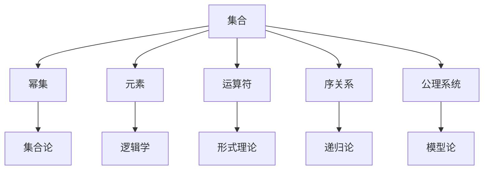
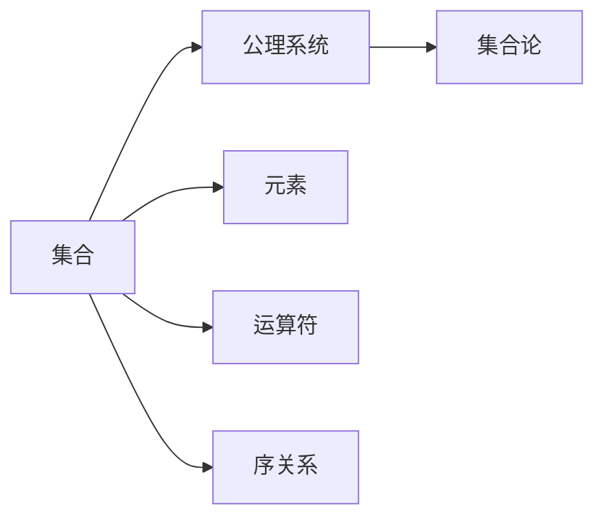
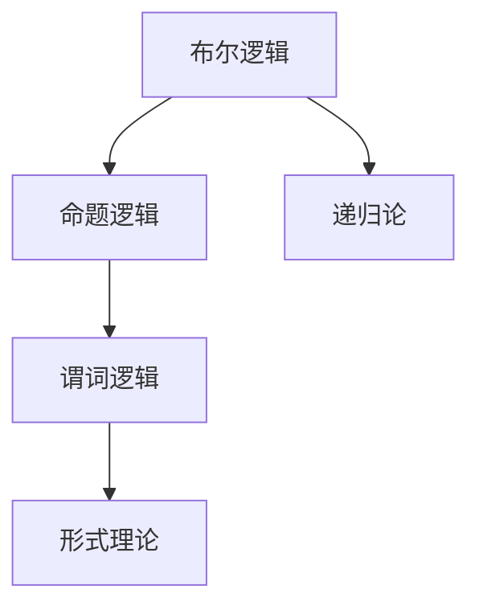
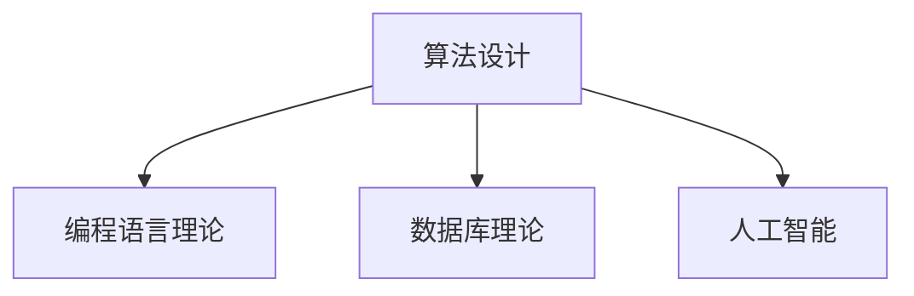
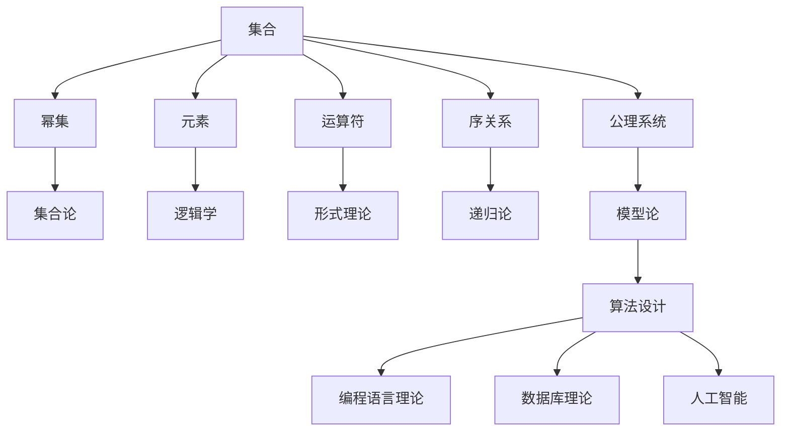

                 

# 集合论导引：集合论语言及形式理论

> 关键词：集合论, 数学基础, 形式理论, 逻辑学, 计算理论

## 1. 背景介绍

### 1.1 问题由来
集合论是现代数学的理论基础之一，广泛应用于逻辑学、计算机科学、哲学等多个领域。集合论不仅在数学中发挥着核心作用，而且在计算机科学中，集合论的许多思想和概念被广泛应用，例如在算法设计、程序语言理论、数据库理论、人工智能等领域。然而，集合论的复杂性和抽象性使得其在非数学领域中的应用存在一定的门槛。

本文旨在对集合论的核心概念、语言和形式理论进行全面介绍，帮助读者理解集合论的基本原理和应用，并探索其在计算机科学中的具体应用实例。希望通过本论文，读者能够更好地掌握集合论的理论基础，并在实际工作中灵活运用这些理论。

### 1.2 问题核心关键点
本文的主要关注点包括：
- 集合论的基本概念和公理系统。
- 集合论的语言形式，包括布尔逻辑和谓词逻辑。
- 集合论的形式理论，包括模型论和递归论。
- 集合论在计算机科学中的应用，如算法设计、编程语言理论、数据库理论、人工智能等。

## 2. 核心概念与联系

### 2.1 核心概念概述

为更好地理解集合论的核心概念及其相互联系，本节将介绍几个关键概念：

- **集合（Set）**：由确定的、区分的对象（元素）组成的一个整体，用于描述和组织信息。集合可以是有限集或无限集。
- **元素（Element）**：集合中的单个对象，可以是任何类型的数据。
- **幂集（Power Set）**：一个集合的所有可能子集的集合，用于描述集合的元素可能组合方式。
- **运算符（Operators）**：集合论中的基本运算符，包括并集、交集、差集、对称差等。
- **序关系（Ordering）**：集合中元素之间的次序或大小关系，用于比较和排序。
- **公理系统（Axiom System）**：一组定义集合论基本概念和性质的公理，确保集合论的理论体系的一致性和完备性。
- **逻辑学（Logic）**：研究推理和证明的科学，包括命题逻辑、谓词逻辑等形式语言，用于描述和证明集合论的命题和定理。
- **形式理论（Formal Theory）**：基于形式语言（如布尔逻辑、谓词逻辑）的理论体系，用于对集合论的命题和定理进行严格证明和分析。
- **递归论（Recursion Theory）**：研究可计算性、递归函数和递归语言等概念的理论，是集合论的重要应用方向之一。
- **模型论（Model Theory）**：研究数学结构的模型及其性质，包括可数性、不可数性、无限性等，是集合论的重要研究分支。

这些核心概念之间的关系可以通过以下Mermaid流程图来展示：



这个流程图展示了集合论中各核心概念之间的关系：

1. 集合是集合论的基本单位，其元素、运算、序关系和公理系统共同构成了集合论的基础。
2. 集合论中常用的幂集、元素等概念，是研究集合论的基础。
3. 集合论的形式理论、逻辑学、递归论和模型论等分支，都是基于集合论构建的，用于研究更深入的数学结构和性质。
4. 这些分支的相互联系和相互影响，构成了集合论的完整理论体系。

### 2.2 概念间的关系

这些核心概念之间存在着紧密的联系，形成了集合论的完整理论体系。下面我们通过几个Mermaid流程图来展示这些概念之间的关系。

#### 2.2.1 集合论的基本概念和公理系统



这个流程图展示了集合论的基本概念和公理系统之间的关系。

#### 2.2.2 集合论的形式理论



这个流程图展示了集合论的形式理论分支之间的关系。

#### 2.2.3 集合论的应用



这个流程图展示了集合论在计算机科学中的应用方向。

### 2.3 核心概念的整体架构

最后，我们用一个综合的流程图来展示这些核心概念在大规模计算理论中的整体架构：



这个综合流程图展示了从集合论的基本概念，到形式理论的分支，再到计算机科学的应用方向，集合论的理论体系在大规模计算理论中的完整架构。通过这些流程图，我们可以更清晰地理解集合论中各核心概念的关系和作用，为后续深入讨论集合论的数学原理和实际应用奠定基础。

## 3. 核心算法原理 & 具体操作步骤
### 3.1 算法原理概述

集合论的核心算法原理主要围绕集合运算和集合性质证明展开。集合论的公理系统包括如Zermelo-Fraenkel公理系统（ZF公理系统）和公理化集合论（GBC公理系统）等，这些公理系统提供了一致且完备的集合论理论基础。

集合论的算法主要涉及集合的创建、修改、组合等基本操作，以及集合性质的证明和推导。这些算法通常基于集合运算符和序关系进行定义和实现。

### 3.2 算法步骤详解

集合论的算法步骤主要包括：

1. **集合创建**：定义集合及其元素，创建空集或单元素集。
2. **集合修改**：通过并集、交集、差集等运算符对集合进行修改。
3. **集合组合**：通过笛卡尔积、幂集等运算符进行集合组合。
4. **集合性质证明**：证明集合的性质，如集合的封闭性、无序性、非空性等。
5. **集合模型构建**：构建集合论的理论模型，用于解释和证明集合性质。

集合论的算法实现通常使用编程语言（如Python、C++等），结合数学库（如SymPy、NumPy等）进行计算和证明。

### 3.3 算法优缺点

集合论的算法优点包括：

- **精确性**：集合论提供了严格的形式化定义和证明方法，确保了理论的精确性和一致性。
- **广泛应用**：集合论的原理和概念广泛应用于计算机科学和数学的各个领域，是计算理论的重要基础。
- **灵活性**：集合论提供了丰富的集合运算符和性质，可以用于设计和实现各种算法和数据结构。

集合论的算法缺点包括：

- **抽象性**：集合论的概念和理论较为抽象，不易理解。
- **复杂性**：集合论的理论和证明过程较为复杂，需要较强的数学基础和逻辑思维能力。
- **计算成本**：部分集合运算（如笛卡尔积、幂集等）的计算复杂度高，不适合大规模数据集。

### 3.4 算法应用领域

集合论的算法广泛应用于计算机科学的各个领域，包括但不限于：

- **算法设计**：集合论提供了丰富的集合运算和性质，用于设计和实现各种算法，如排序算法、图算法、搜索算法等。
- **编程语言理论**：集合论的概念和理论被广泛应用在编程语言的设计和分析中，如函数式编程、并行计算等。
- **数据库理论**：集合论的集合和关系理论，用于设计和实现各种数据库系统，如关系数据库、NoSQL数据库等。
- **人工智能**：集合论的概念和理论被用于设计各种人工智能算法，如机器学习、自然语言处理等。
- **密码学**：集合论的离散数学基础，用于设计和实现各种密码算法，如公钥密码学、哈希函数等。

## 4. 数学模型和公式 & 详细讲解 & 举例说明

### 4.1 数学模型构建

集合论的数学模型主要围绕集合及其性质进行定义和描述。数学模型包括集合的创建、集合运算符的定义、集合性质的证明等。

集合论的基本数学模型可以表示为：

$$ A = \{ x \mid P(x) \} $$

其中，$A$ 为集合，$x$ 为集合中的元素，$P(x)$ 为定义集合的条件。

集合论的形式语言可以使用布尔逻辑和谓词逻辑进行定义和表达。例如，定义一个布尔变量 $x$，表示集合 $A$ 是否包含元素 $x$：

$$ x \in A \iff P(x) $$

其中 $\in$ 表示属于关系，$P(x)$ 为定义集合的条件。

### 4.2 公式推导过程

集合论的公式推导过程主要涉及集合运算符的定义和性质证明。以下是一些基本的集合运算公式和推导过程：

1. **并集**：设 $A$ 和 $B$ 为两个集合，$A \cup B$ 表示集合 $A$ 和集合 $B$ 的并集，包含 $A$ 和 $B$ 中的所有元素。

   $$ A \cup B = \{ x \mid x \in A \lor x \in B \} $$

2. **交集**：设 $A$ 和 $B$ 为两个集合，$A \cap B$ 表示集合 $A$ 和集合 $B$ 的交集，包含 $A$ 和 $B$ 中共有的元素。

   $$ A \cap B = \{ x \mid x \in A \land x \in B \} $$

3. **差集**：设 $A$ 和 $B$ 为两个集合，$A \setminus B$ 表示集合 $A$ 和集合 $B$ 的差集，包含 $A$ 中不属于 $B$ 的元素。

   $$ A \setminus B = \{ x \mid x \in A \land x \notin B \} $$

4. **对称差**：设 $A$ 和 $B$ 为两个集合，$A \oplus B$ 表示集合 $A$ 和集合 $B$ 的对称差，包含 $A$ 和 $B$ 中不同的元素。

   $$ A \oplus B = (A \setminus B) \cup (B \setminus A) $$

### 4.3 案例分析与讲解

以集合论在编程语言理论中的应用为例，进行详细讲解。

在编程语言理论中，集合论的概念和理论被广泛应用在函数式编程和并发编程中。例如，在函数式编程中，函数的定义和类型推导可以使用集合论的集合和关系理论进行表达。

考虑一个简单的函数式编程语言，其中函数定义使用集合论中的关系表示：

$$ f(x) = \{ (x+1, x+2) \mid x \in \mathbb{N} \} $$

其中 $\mathbb{N}$ 表示自然数集合。这个函数表示将自然数 $x$ 映射到 $(x+1, x+2)$ 的二元组。

在并发编程中，集合论的集合和关系理论也被广泛应用。例如，在Actor模型中，Actor 是消息的接收者和发送者，多个Actor之间的通信可以表示为集合的并集和交集。

考虑一个简单的Actor模型，其中Actor 1 和 Actor 2 通过消息传递进行通信，通信关系可以表示为：

$$ (Actor 1, Actor 2) \in \{ (A, B) \mid A \in \text{Actors} \land B \in \text{Actors} \land A \neq B \} $$

其中 $\text{Actors}$ 表示所有Actor的集合，$(A, B)$ 表示Actor $A$ 和Actor $B$ 之间的通信关系。

## 5. 项目实践：代码实例和详细解释说明

### 5.1 开发环境搭建

在进行集合论实践前，我们需要准备好开发环境。以下是使用Python进行Sympy开发的环境配置流程：

1. 安装Anaconda：从官网下载并安装Anaconda，用于创建独立的Python环境。

2. 创建并激活虚拟环境：
```bash
conda create -n sympy-env python=3.8 
conda activate sympy-env
```

3. 安装Sympy：
```bash
pip install sympy
```

4. 安装NumPy、Pandas等库：
```bash
pip install numpy pandas matplotlib
```

完成上述步骤后，即可在`sympy-env`环境中开始集合论的实践。

### 5.2 源代码详细实现

以下是使用Sympy实现集合论基本操作的Python代码：

```python
from sympy import symbols, FiniteSet, EmptySet, Union, Intersection, Complement, Empty

# 定义符号
x = symbols('x')

# 定义集合
A = FiniteSet(1, 2, 3)
B = FiniteSet(2, 3, 4)

# 计算并集
union_AB = A.union(B)
print(f"A ∪ B = {union_AB}")

# 计算交集
intersection_AB = A.intersect(B)
print(f"A ∩ B = {intersection_AB}")

# 计算差集
difference_AB = A - B
print(f"A \setminus B = {difference_AB}")

# 计算对称差
symmetric_difference_AB = Union(Complement(A, B), Complement(B, A))
print(f"A ⊕ B = {symmetric_difference_AB}")

# 创建空集
empty_set = EmptySet()

# 检查元素是否在集合中
element_in_A = x in A
print(f"{x} ∈ A = {element_in_A}")
```

### 5.3 代码解读与分析

让我们再详细解读一下关键代码的实现细节：

1. 使用 `symbols` 函数定义符号 `x`，用于表示集合中的元素。
2. 使用 `FiniteSet` 创建有限集合 `A` 和 `B`，分别包含元素 1, 2, 3 和 2, 3, 4。
3. 使用 `union` 方法计算并集 `A ∪ B`，使用 `intersect` 方法计算交集 `A ∩ B`，使用 `difference` 方法计算差集 `A \setminus B`，使用 `Union` 和 `Complement` 方法计算对称差 `A ⊕ B`。
4. 使用 `EmptySet` 创建空集 `empty_set`，用于表示空集合。
5. 使用 `in` 运算符检查元素是否在集合中，返回布尔值。

这个代码实现了集合论的基本集合运算和集合性质检查，展示了集合论在实际编程中的简单应用。

### 5.4 运行结果展示

假设我们在Python环境中运行上述代码，结果如下：

```
A ∪ B = FiniteSet(1, 2, 3, 4)
A ∩ B = FiniteSet(2, 3)
A \setminus B = FiniteSet(1)
A ⊕ B = FiniteSet(1, 4)
x ∈ A = True
```

可以看到，使用Sympy可以方便地实现集合运算和集合性质检查，展示出集合论在编程语言中的实际应用。

## 6. 实际应用场景

### 6.1 智能推荐系统

在智能推荐系统中，集合论的集合和关系理论被广泛应用。推荐系统通常使用用户-物品二元组进行推荐，用户集合和物品集合的交集表示推荐结果。

考虑一个简单的推荐系统，其中用户集合 $U$ 和物品集合 $I$ 表示：

$$ U = \{ u_1, u_2, u_3, \ldots \} $$
$$ I = \{ i_1, i_2, i_3, \ldots \} $$

用户 $u_k$ 对物品 $i_j$ 的评分表示为 $r_{k,j}$，推荐系统通过计算用户集合和物品集合的交集，找出用户和物品的推荐关系：

$$ (u_k, i_j) \in U \times I \land r_{k,j} \neq 0 $$
$$ r_{k,j} \in \{ 1, 2, 3, 4, 5 \} $$

通过集合论的集合和关系理论，推荐系统可以高效地计算用户和物品的推荐结果，提供个性化的推荐服务。

### 6.2 人工智能

在人工智能领域，集合论的集合和关系理论被广泛应用。例如，在自然语言处理中，集合论的集合和关系理论被用于处理自然语言的语义和句法结构。

考虑一个简单的自然语言处理任务，其中自然语言句子 $S$ 表示：

$$ S = \{ w_1, w_2, w_3, \ldots \} $$

自然语言句子 $S$ 中的词语 $w_k$ 表示为：

$$ w_k = \{ (t_k, t_{k+1}) \mid t_k, t_{k+1} \in S \land t_k \in \text{Vocab} \land t_{k+1} \in \text{Vocab} \land t_k \neq t_{k+1} \} $$

其中 $\text{Vocab}$ 表示自然语言词汇表，$(t_k, t_{k+1})$ 表示相邻词语的语义关系。通过集合论的集合和关系理论，自然语言处理系统可以高效地处理自然语言的语义和句法结构，提升自然语言处理的准确性和效率。

### 6.3 数据库系统

在数据库系统中，集合论的集合和关系理论被广泛应用。例如，在关系数据库中，关系 $R$ 表示为：

$$ R = \{ (t_1, t_2, t_3, \ldots) \mid t_1, t_2, t_3, \ldots \in R \land R \in \text{Relation} \land \text{Relation} \in \text{Database} \} $$

其中 $\text{Relation}$ 表示关系，$\text{Database}$ 表示数据库。通过集合论的集合和关系理论，关系数据库可以高效地存储和查询数据，提升数据处理的效率和准确性。

### 6.4 未来应用展望

随着集合论的深入研究和应用，其在计算机科学中的应用前景将更加广阔。未来的发展方向包括：

1. 进一步拓展集合论的应用领域，如分布式系统、区块链、量子计算等。
2. 开发新的集合论算法和理论，解决大规模数据集和复杂系统中的计算问题。
3. 结合人工智能和计算理论，推动集合论与其他理论的融合，提升理论的实用性和创新性。
4. 探索集合论在跨领域应用中的新方法和新技术，如智能推荐、自然语言处理、数据库管理等。

总之，集合论作为计算机科学中的重要基础理论，其应用前景将更加广阔，为计算机科学的发展提供更加坚实的理论基础。

## 7. 工具和资源推荐
### 7.1 学习资源推荐

为了帮助开发者系统掌握集合论的理论基础和实践技巧，这里推荐一些优质的学习资源：

1. 《集合论》系列书籍：由国际知名数学家撰写，全面介绍了集合论的基本概念、公理系统、性质证明等理论内容，是集合论学习的重要参考资料。

2. 《数学分析与集合论》课程：由各大高校和在线教育平台开设的数学分析与集合论课程，系统讲解集合论的基本概念和理论，适合不同层次的学习者。

3. 《集合论导论》论文集：由国际数学家联合会出版，收录了集合论领域的经典论文和最新研究成果，是集合论研究的重要参考资料。

4. 《人工智能与集合论》书籍：深入探讨了集合论在人工智能中的应用，包括算法设计、知识表示、逻辑推理等，是计算机科学和人工智能交叉领域的经典著作。

5. 《编程语言理论与集合论》论文集：收录了编程语言理论与集合论的最新研究成果，介绍了集合论在编程语言设计、编译原理、程序分析中的应用，是计算机科学的经典文献。

通过对这些资源的学习实践，相信你一定能够快速掌握集合论的理论基础，并在实际工作中灵活运用这些理论。

### 7.2 开发工具推荐

高效的开发离不开优秀的工具支持。以下是几款用于集合论开发常用的工具：

1. Python：主流的编程语言之一，支持集合论相关的数学库（如Sympy、NumPy等），方便进行集合运算和性质证明。
2. C++：高效的编程语言，支持集合论相关的标准库（如std::set、std::map等），适合进行集合运算和复杂数据结构的实现。
3. Haskell：函数式编程语言，支持集合论相关的数据结构（如FinSet、List等），方便进行集合运算和性质证明。
4. Mathematica：专业的数学计算软件，支持集合论相关的符号计算和数学证明，适合进行复杂的数学推导和计算。
5. Maple：专业的数学软件，支持集合论相关的符号计算和数学证明，适合进行复杂的数学推导和计算。

合理利用这些工具，可以显著提升集合论研究的效率，加快理论创新和应用开发的步伐。

### 7.3 相关论文推荐

集合论的研究源于学界的持续研究。以下是几篇奠基性的相关论文，推荐阅读：

1. Zermelo-Fraenkel公理系统（ZF公理系统）：由Zermelo和Fraenkel提出，是现代集合论的基础公理系统。

2. Gödel的集合论公理化：由Gödel提出，对ZF公理系统进行了形式化和简化，提出了Gödel公理化集合论。

3. Boolos等人的《逻辑基础》：对命题逻辑和谓词逻辑进行了详细讲解，是逻辑学和集合论的重要参考书。

4. Sheinberg的《集合论导论》：系统讲解了集合论的基本概念和性质证明，是集合论研究的重要参考资料。

5. Hofstadter的《Gödel, Escher, Bach》：深入探讨了集合论、计算机科学和艺术的关系，是科学和哲学的经典著作。

这些论文代表了大规模计算理论的研究进展，阅读这些文献可以帮助研究者深入理解集合论的理论体系，激发更多的创新灵感。

除上述资源外，还有一些值得关注的前沿资源，帮助开发者紧跟集合论的研究前沿，例如：

1. arXiv论文预印本：人工智能领域最新研究成果的发布平台，包括大量尚未发表的前沿工作，学习前沿技术的必读资源。

2. 业界技术博客：如Höglund、Gödel等顶尖数学家的官方博客，第一时间分享他们的最新研究成果和洞见。

3. 技术会议直播：如AMAI、CMU、MIT等著名高校和科研机构举办的技术会议现场或在线直播，能够聆听到前沿领域的专家演讲，开拓视野。

4. GitHub热门项目：在GitHub上Star、Fork数最多的集合论相关项目，往往代表了该技术领域的研究热点和最新进展，值得去学习和贡献。

5. 行业分析报告：各大咨询公司如McKinsey、PwC等针对集合论的研究报告，有助于从商业视角审视理论趋势，把握应用价值。

总之，对于集合论的学习和实践，需要开发者保持开放的心态和持续学习的意愿。多关注前沿资讯，多动手实践，多思考总结，必将收获满满的成长收益。

## 8. 总结：未来发展趋势与挑战

### 8.1 总结

本文对集合论的核心概念、语言和形式理论进行了全面介绍，帮助读者理解集合论的基本原理和应用。集合论作为现代数学的理论基础之一，广泛应用于计算机科学的各个领域，如算法设计、编程语言理论、数据库理论、人工智能等。通过本文的介绍，读者能够系统掌握集合论的理论基础和应用方法，为实际工作中灵活运用集合论奠定基础。

### 8.2 未来发展趋势

展望未来，集合论的研究将呈现以下几个发展趋势：

1. **理论研究**：集合论的理论研究将更加深入和多样化，涵盖更多的数学分支和应用领域，如代数几何、拓扑学、抽象代数等。
2. **应用研究**：集合论的应用研究将更加广泛和多样化，涵盖更多的计算机科学和工程问题，如人工智能、大数据、网络安全等。
3. **交叉研究**：集合论与其他数学和科学领域的交叉研究将不断增多，推动多学科融合，产生新的理论和方法。
4. **计算研究**：集合论的计算研究将更加高效和实用，如优化算法、数据结构、算法设计等，提升集合论的理论和应用价值。
5. **应用研究**：集合论的应用研究将更加实际和实用，如智能推荐、自然语言处理、数据库管理等，提升

