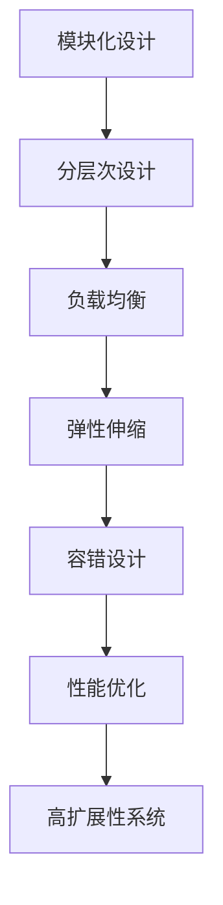

                 

# 高扩展性系统设计的最佳实践

在当今信息化高度发展的时代，软件系统的扩展性问题愈发显得重要。无论企业规模大小，系统的扩展性都能直接影响业务运行的稳定性、效率和成本。因此，本文将探讨高扩展性系统设计的最佳实践，通过深入浅出的语言，帮助读者了解和掌握这一核心技能。

## 1. 背景介绍

### 1.1 问题由来
随着互联网的飞速发展，系统规模和复杂度不断增加。无论是企业级应用还是互联网应用，都面临着资源有限和需求不断增长的双重压力。如何构建具备高扩展性的系统，成为当前技术开发者和架构师面临的首要挑战。

### 1.2 问题核心关键点
高扩展性系统设计的核心关键点主要包括以下几个方面：

- **模块化设计**：将系统拆分为独立的模块，每个模块负责单一功能，便于扩展和维护。
- **水平扩展**：通过增加服务器数量来提升系统的处理能力，适用于处理能力受限的场景。
- **垂直扩展**：通过升级服务器配置来提升系统的处理能力，适用于资源相对丰富的场景。
- **负载均衡**：将请求分配到多个服务器上，提升系统的并发处理能力。
- **弹性伸缩**：根据业务需求动态调整系统规模，优化资源利用率。
- **冗余备份**：通过多服务器或数据冗余等手段，提高系统的可用性和可靠性。

这些关键点相互关联，共同决定了系统的高扩展性。因此，构建高扩展性系统必须从这些方面入手，系统地进行设计和优化。

## 2. 核心概念与联系

### 2.1 核心概念概述
高扩展性系统设计的核心概念包括：

- **模块化设计**：系统模块间相互独立，可以独立更新和扩展。
- **分层次设计**：将系统划分为多个层次，每个层次负责特定的功能模块。
- **负载均衡**：将请求合理分配到多个服务器上，提升系统的并发处理能力。
- **弹性伸缩**：根据业务需求动态调整系统规模，优化资源利用率。
- **容错设计**：在系统设计中考虑故障恢复机制，保证系统的稳定性和可靠性。
- **性能优化**：通过算法和架构优化提升系统的性能。

这些概念通过以下Mermaid流程图展示其联系：

### 2.2 概念间的关系

这些核心概念之间的关系可以通过以下Mermaid流程图展示：

模块化设计是构建高扩展性系统的基石，分层次设计使系统结构清晰，负载均衡和弹性伸缩确保系统能处理高并发，容错设计保证系统的可靠性和稳定性，性能优化则提升系统的实际运行效率。

## 3. 核心算法原理 & 具体操作步骤
### 3.1 算法原理概述
高扩展性系统设计的算法原理主要基于分布式系统设计的基本原理，包括：

- **CAP理论**：在分布式系统中，一致性、可用性和分区容忍性三个特性只能三选二。高扩展性系统设计需要在一致性和可用性之间找到平衡点。
- **分布式事务**：通过分布式事务机制，保证跨多个节点的数据一致性。
- **心跳检测机制**：通过定时检测各节点的状态，及时发现故障并进行恢复。

这些原理在高扩展性系统设计中发挥着关键作用。

### 3.2 算法步骤详解
高扩展性系统设计的具体操作步骤包括以下几个关键步骤：

1. **系统需求分析**：明确系统的业务需求和扩展需求。
2. **模块划分**：将系统划分为独立的模块，每个模块负责单一功能。
3. **分层设计**：将系统划分为多个层次，每个层次负责特定的功能模块。
4. **负载均衡**：采用负载均衡算法，将请求合理分配到多个服务器上。
5. **弹性伸缩**：根据业务需求动态调整系统规模，优化资源利用率。
6. **容错设计**：在系统设计中考虑故障恢复机制，保证系统的稳定性和可靠性。
7. **性能优化**：通过算法和架构优化提升系统的性能。

### 3.3 算法优缺点
高扩展性系统设计的优点包括：

- **灵活扩展**：系统可以根据需求灵活扩展，适应业务增长。
- **高可用性**：通过容错设计和负载均衡，提升系统的可用性和可靠性。
- **高效性能**：通过算法和架构优化，提升系统的性能和效率。

但同时，高扩展性系统设计也存在一些缺点：

- **复杂度高**：系统设计复杂，需要综合考虑多个方面。
- **开发成本高**：系统构建和维护成本较高。
- **调试困难**：系统复杂度高，调试难度大。

### 3.4 算法应用领域
高扩展性系统设计广泛应用于各类高并发、高可用、高性能的应用场景，包括：

- **电商平台**：电商平台需要处理海量交易，对系统扩展性要求较高。
- **社交网络**：社交网络平台需要处理海量用户数据，对系统扩展性要求较高。
- **金融系统**：金融系统需要处理海量交易，对系统扩展性要求较高。
- **企业级应用**：企业级应用需要处理海量数据，对系统扩展性要求较高。

这些应用场景对系统扩展性的需求较高，因此，高扩展性系统设计在这些领域有着广泛的应用。

## 4. 数学模型和公式 & 详细讲解  
### 4.1 数学模型构建
高扩展性系统设计的数学模型主要基于以下公式：

- **负载均衡公式**：
  $$
  \text{Load} = \frac{N}{S}
  $$
  其中，$N$ 为请求数，$S$ 为服务器数，$\text{Load}$ 为负载。

- **弹性伸缩公式**：
  $$
  S = K \times C
  $$
  其中，$S$ 为服务器数，$K$ 为弹性系数，$C$ 为计算需求。

### 4.2 公式推导过程
通过以上两个公式，可以推导出高扩展性系统设计的关键指标：

- **负载均衡系数**：
  $$
  \text{Load} = \frac{N}{S} = \frac{N}{K \times C}
  $$

- **弹性伸缩系数**：
  $$
  S = K \times C
  $$

### 4.3 案例分析与讲解
假设一个电商平台每天处理请求数为 $N=100000$，现有 $S=10$ 台服务器。根据负载均衡公式，可以得到：
$$
\text{Load} = \frac{N}{S} = 10000
$$

若计算需求 $C=1000$，则根据弹性伸缩公式，可以得到：
$$
S = K \times C = 1000K
$$

通过调整 $K$ 的值，可以动态调整服务器数，满足不同的业务需求。

## 5. 项目实践：代码实例和详细解释说明
### 5.1 开发环境搭建
高扩展性系统设计的开发环境搭建主要包括以下几个步骤：

1. **选择开发语言**：选择一种高并发、高性能的编程语言，如Java、Python等。
2. **安装开发环境**：安装JDK、Python等运行环境。
3. **配置开发工具**：配置IDE、编辑器等开发工具，如Eclipse、PyCharm等。
4. **连接数据库**：配置数据库连接池，提高数据库访问效率。
5. **搭建服务器**：搭建高性能的服务器环境，如使用AWS、阿里云等云服务。

### 5.2 源代码详细实现
高扩展性系统设计的源代码实现主要包括以下几个关键模块：

1. **模块化设计**：将系统划分为独立的模块，每个模块负责单一功能，如订单处理、库存管理等。
2. **分层次设计**：将系统划分为多个层次，如应用层、业务层、数据层等。
3. **负载均衡**：使用负载均衡算法，如轮询、哈希等，将请求合理分配到多个服务器上。
4. **弹性伸缩**：根据业务需求动态调整系统规模，优化资源利用率。
5. **容错设计**：在系统设计中考虑故障恢复机制，保证系统的稳定性和可靠性。
6. **性能优化**：通过算法和架构优化提升系统的性能，如使用缓存、异步处理等。

### 5.3 代码解读与分析
高扩展性系统设计的代码实现主要通过以下几个步骤：

1. **模块划分**：将系统划分为独立的模块，每个模块负责单一功能，如订单处理、库存管理等。
2. **分层次设计**：将系统划分为多个层次，如应用层、业务层、数据层等。
3. **负载均衡**：使用负载均衡算法，如轮询、哈希等，将请求合理分配到多个服务器上。
4. **弹性伸缩**：根据业务需求动态调整系统规模，优化资源利用率。
5. **容错设计**：在系统设计中考虑故障恢复机制，保证系统的稳定性和可靠性。
6. **性能优化**：通过算法和架构优化提升系统的性能，如使用缓存、异步处理等。

### 5.4 运行结果展示
假设在一个电商平台上，每天的请求数为 $N=100000$，现有 $S=10$ 台服务器。通过使用负载均衡算法，可以将请求合理分配到多个服务器上，保证系统的高可用性和高性能。同时，根据业务需求，可以动态调整服务器数，优化资源利用率，提升系统的扩展性。

## 6. 实际应用场景
### 6.1 电商平台
电商平台需要处理海量交易，对系统扩展性要求较高。通过高扩展性系统设计，电商平台可以灵活扩展，适应业务增长，提高系统的可用性和可靠性。

### 6.2 社交网络
社交网络平台需要处理海量用户数据，对系统扩展性要求较高。通过高扩展性系统设计，社交网络平台可以灵活扩展，提高系统的可用性和性能。

### 6.3 金融系统
金融系统需要处理海量交易，对系统扩展性要求较高。通过高扩展性系统设计，金融系统可以灵活扩展，提高系统的可用性和可靠性。

### 6.4 企业级应用
企业级应用需要处理海量数据，对系统扩展性要求较高。通过高扩展性系统设计，企业级应用可以灵活扩展，提高系统的可用性和性能。

## 7. 工具和资源推荐
### 7.1 学习资源推荐
高扩展性系统设计的学习资源推荐主要包括以下几个方面：

1. **书籍**：《分布式系统原理与设计》、《高并发网站技术架构》、《高性能Java网络编程》等。
2. **在线课程**：Coursera、Udacity等平台的分布式系统设计课程。
3. **技术博客**：高性能技术博客、Docker官方博客等。

### 7.2 开发工具推荐
高扩展性系统设计的开发工具推荐主要包括以下几个方面：

1. **IDE**：Eclipse、PyCharm等。
2. **数据库**：MySQL、PostgreSQL等。
3. **云服务**：AWS、阿里云等。

### 7.3 相关论文推荐
高扩展性系统设计的研究论文推荐主要包括以下几个方面：

1. **CAP理论**：《The CAP Theorem》。
2. **分布式事务**：《Distributed Transactions: The CAP Theorem Explained》。
3. **负载均衡**：《Load Balancing in a Distributed System》。

## 8. 总结：未来发展趋势与挑战
### 8.1 研究成果总结
高扩展性系统设计的核心研究成果主要包括以下几个方面：

- **CAP理论**：在分布式系统中，一致性、可用性和分区容忍性三个特性只能三选二。
- **分布式事务**：通过分布式事务机制，保证跨多个节点的数据一致性。
- **负载均衡**：采用负载均衡算法，将请求合理分配到多个服务器上。
- **弹性伸缩**：根据业务需求动态调整系统规模，优化资源利用率。
- **容错设计**：在系统设计中考虑故障恢复机制，保证系统的稳定性和可靠性。
- **性能优化**：通过算法和架构优化提升系统的性能。

### 8.2 未来发展趋势
高扩展性系统设计的未来发展趋势主要包括以下几个方面：

- **自动化运维**：通过自动化的运维工具，提升系统维护效率。
- **微服务架构**：采用微服务架构，提高系统的可扩展性和灵活性。
- **容器化部署**：采用容器化技术，简化系统的部署和运维。
- **云原生架构**：采用云原生架构，提高系统的可扩展性和可用性。

### 8.3 面临的挑战
高扩展性系统设计面临的挑战主要包括以下几个方面：

- **复杂度高**：系统设计复杂，需要综合考虑多个方面。
- **开发成本高**：系统构建和维护成本较高。
- **调试困难**：系统复杂度高，调试难度大。

### 8.4 研究展望
高扩展性系统设计的未来研究展望主要包括以下几个方面：

- **新算法研究**：研究新的高扩展性算法，提升系统的性能和可用性。
- **新技术应用**：应用新的技术，如区块链、人工智能等，提升系统的扩展性和安全性。
- **新场景应用**：拓展高扩展性系统的应用场景，提升系统的实用性和普适性。

总之，高扩展性系统设计是当前IT领域的重要研究方向。通过深入理解高扩展性系统的设计原理和实现方法，可以构建出具备高可用性、高扩展性和高性能的系统，满足各类高并发、高可用、高性能的应用需求。同时，我们也需要在实践中不断探索和创新，推动高扩展性系统设计的不断发展。

## 9. 附录：常见问题与解答
### 9.1 高扩展性系统设计中的CAP理论是什么？

**Q1:** 高扩展性系统设计中的CAP理论是什么？

**A1:** CAP理论是分布式系统设计中的一种理论，它指出在一个分布式系统中，一致性(Consistency)、可用性(Availability)和分区容忍性(Partition Tolerance)三个特性只能三选二。具体来说，一致性指的是在系统更新后，各个节点数据一致；可用性指的是系统能够在任意时间对用户提供服务；分区容忍性指的是系统在网络分区后，仍然能够提供服务。在高扩展性系统设计中，需要在一致性和可用性之间找到平衡点。

### 9.2 高扩展性系统设计的关键步骤有哪些？

**Q2:** 高扩展性系统设计的关键步骤有哪些？

**A2:** 高扩展性系统设计的关键步骤主要包括以下几个方面：

1. **系统需求分析**：明确系统的业务需求和扩展需求。
2. **模块划分**：将系统划分为独立的模块，每个模块负责单一功能。
3. **分层次设计**：将系统划分为多个层次，每个层次负责特定的功能模块。
4. **负载均衡**：采用负载均衡算法，将请求合理分配到多个服务器上。
5. **弹性伸缩**：根据业务需求动态调整系统规模，优化资源利用率。
6. **容错设计**：在系统设计中考虑故障恢复机制，保证系统的稳定性和可靠性。
7. **性能优化**：通过算法和架构优化提升系统的性能。

### 9.3 如何提高高扩展性系统设计的性能？

**Q3:** 如何提高高扩展性系统设计的性能？

**A3:** 提高高扩展性系统设计的性能主要可以通过以下几个方面：

1. **使用缓存**：通过使用缓存技术，减少数据库访问次数，提升系统性能。
2. **异步处理**：通过异步处理技术，将耗时操作放到后台处理，提升系统响应速度。
3. **负载均衡**：通过负载均衡算法，将请求合理分配到多个服务器上，提升系统并发处理能力。
4. **优化算法**：通过优化算法，提升系统的处理效率。
5. **减少网络延迟**：通过优化网络延迟，提升系统响应速度。

### 9.4 高扩展性系统设计的优点和缺点有哪些？

**Q4:** 高扩展性系统设计的优点和缺点有哪些？

**A4:** 高扩展性系统设计的优点主要包括以下几个方面：

- **灵活扩展**：系统可以根据需求灵活扩展，适应业务增长。
- **高可用性**：通过容错设计和负载均衡，提升系统的可用性和可靠性。
- **高效性能**：通过算法和架构优化提升系统的性能和效率。

但同时，高扩展性系统设计也存在一些缺点：

- **复杂度高**：系统设计复杂，需要综合考虑多个方面。
- **开发成本高**：系统构建和维护成本较高。
- **调试困难**：系统复杂度高，调试难度大。

综上所述，高扩展性系统设计在实际应用中具有重要的意义，通过深入理解其设计原理和实现方法，可以构建出具备高可用性、高扩展性和高性能的系统，满足各类高并发、高可用、高性能的应用需求。

---

作者：禅与计算机程序设计艺术 / Zen and the Art of Computer Programming

