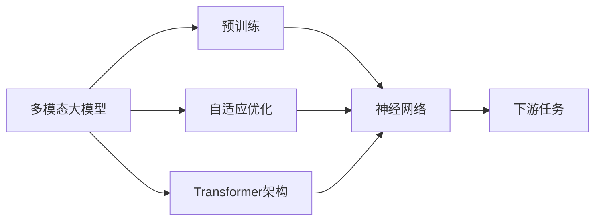
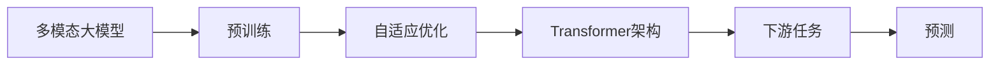
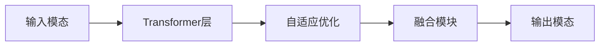
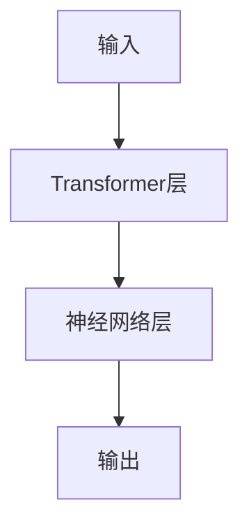
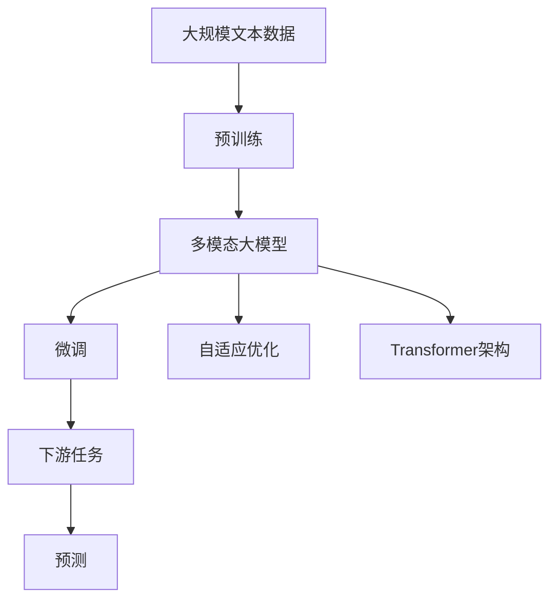

                 

# 多模态大模型：技术原理与实战 ChatGPT的诞生

## 1. 背景介绍

### 1.1 问题由来
近年来，深度学习技术的飞速发展，尤其是在自然语言处理(Natural Language Processing, NLP)和计算机视觉领域，预训练大模型的兴起，将深度学习推向了新的高度。预训练模型在巨量无标签数据上进行自我监督学习，获得了强大的特征表示能力，被广泛应用于各类下游任务中，如文本分类、情感分析、机器翻译、图像分类、对象检测等。

然而，传统的预训练模型通常仅依赖单一的模态（如文本或图像）进行训练。这种单一模态的限制，导致其在处理复杂、多模态任务时表现不佳。例如，在处理问答、多模态对话系统等任务时，单一模态模型很难捕捉到跨模态之间的语义关联，导致输出结果的准确性和流畅性不足。

为了解决这一问题，研究者们开始探索多模态大模型，旨在通过跨模态信息的整合，提升模型在复杂多模态任务中的表现。ChatGPT的诞生，便是多模态大模型研究的重要成果之一。

### 1.2 问题核心关键点
ChatGPT的成功，不仅归功于其庞大的模型规模和高质量的预训练语料，更在于其多模态大模型的设计理念和实施方法。具体而言，其核心关键点包括：

1. **多模态融合**：ChatGPT模型支持文本、图像、音频等多种模态的信息融合，使其在处理多模态任务时能够获取更丰富、更全面的语义信息。
2. **自我监督学习**：ChatGPT在训练过程中，采用了大量自我监督任务，如掩码语言模型、图像识别等，以提升其语言理解能力和跨模态感知能力。
3. **自适应优化**：ChatGPT使用了自适应优化算法，根据输入模态的不同自动调整模型参数，以适应不同任务的需求。
4. **神经网络结构**：ChatGPT基于Transformer架构，并通过自注意力机制和层级结构，实现了高效的多模态信息处理。

### 1.3 问题研究意义
ChatGPT作为多模态大模型的代表，其研究对于拓展深度学习的边界、提升模型在复杂多模态任务中的表现具有重要意义：

1. **提升模型性能**：通过多模态融合，ChatGPT能够在不同模态之间建立语义关联，从而显著提升模型在问答、对话、翻译等复杂任务上的表现。
2. **促进跨领域应用**：ChatGPT的多模态设计，使其能够适应更多领域的应用场景，如教育、客服、娱乐等，推动深度学习技术在更多领域的落地应用。
3. **推动技术创新**：ChatGPT的研发过程中，涌现出了许多新的技术和方法，如多模态表示学习、自适应优化等，这些技术有望进一步推动深度学习的发展。
4. **加速产业化进程**：ChatGPT的成功，为其他企业提供了可复制的模板，加速了深度学习技术的产业化进程，促进了更多企业进入这一领域。

## 2. 核心概念与联系

### 2.1 核心概念概述

为更好地理解多模态大模型ChatGPT，本节将介绍几个关键概念及其联系：

- **多模态大模型(Multimodal Large Model)**：支持融合多种模态信息的深度学习模型，通过跨模态信息融合，提升模型在复杂任务上的表现。
- **预训练模型(Pre-trained Model)**：在无标签数据上通过自监督学习任务进行预训练，学习通用的语义表示，以提升模型在特定任务上的性能。
- **自适应优化(Adaptive Optimization)**：根据输入模态的不同自动调整模型参数，以适应不同任务的需求，提高模型的泛化能力。
- **Transformer架构(Transformer Architecture)**：一种基于自注意力机制的神经网络结构，适合处理序列数据，并广泛应用于NLP和CV等领域的预训练模型中。
- **神经网络(Neural Network)**：由神经元节点组成的计算图，通过反向传播算法进行训练，以实现复杂模式识别和决策。

这些核心概念通过以下Mermaid流程图来展示其联系：



这个流程图展示了多模态大模型的核心组成和关键步骤，包括预训练、自适应优化和Transformer架构，最终应用于下游任务中。通过这些关键技术，ChatGPT能够在不同模态之间高效地整合信息，提升模型性能。

### 2.2 概念间的关系

这些核心概念之间存在着紧密的联系，形成了ChatGPT模型的完整生态系统。下面我们通过几个Mermaid流程图来展示这些概念之间的关系。

#### 2.2.1 多模态大模型的学习范式



这个流程图展示了多模态大模型的基本学习范式，包括预训练、自适应优化和Transformer架构，最终应用于下游任务中，进行预测输出。

#### 2.2.2 自适应优化和多模态融合



这个流程图展示了多模态信息在Transformer层中的自适应优化和融合过程，通过动态调整模型参数，适应不同模态的信息，并最终输出跨模态融合的结果。

#### 2.2.3 Transformer架构与神经网络



这个流程图展示了Transformer架构中神经网络层的作用，通过自注意力机制和层级结构，实现跨模态信息的处理和融合。

### 2.3 核心概念的整体架构

最后，我们用一个综合的流程图来展示这些核心概念在大模型微调过程中的整体架构：



这个综合流程图展示了从预训练到微调，再到多模态信息融合的完整过程。多模态大模型首先在大规模文本数据上进行预训练，然后通过微调（包括自适应优化和Transformer架构）和跨模态信息融合，适应下游任务，进行预测输出。通过这些核心概念的协同工作，ChatGPT能够高效地处理多模态数据，提升模型的性能。

## 3. 核心算法原理 & 具体操作步骤
### 3.1 算法原理概述

多模态大模型ChatGPT的核心算法原理基于自监督学习、神经网络结构和自适应优化，通过跨模态信息融合，提升模型在复杂多模态任务中的表现。

具体而言，ChatGPT的算法原理包括以下几个关键部分：

1. **预训练**：在无标签的文本和图像数据上，通过自监督学习任务进行预训练，学习通用的语义表示。
2. **Transformer架构**：采用基于自注意力机制的Transformer结构，实现高效的多模态信息处理。
3. **自适应优化**：根据输入模态的不同自动调整模型参数，以适应不同任务的需求。

### 3.2 算法步骤详解

基于多模态大模型ChatGPT的算法原理，其实现步骤包括以下几个关键步骤：

1. **数据准备**：收集标注的文本和图像数据，划分训练集、验证集和测试集。
2. **预训练模型加载**：加载预训练的多模态大模型，设置模型参数。
3. **数据预处理**：对输入数据进行预处理，包括分词、图像预处理等。
4. **微调优化**：在训练集上进行微调，更新模型参数，适应下游任务。
5. **自适应优化**：根据输入模态的不同自动调整模型参数，以适应不同任务的需求。
6. **预测输出**：在验证集和测试集上评估模型性能，输出预测结果。

### 3.3 算法优缺点

ChatGPT的多模态大模型算法具有以下优点：

1. **高效多模态融合**：ChatGPT能够高效地处理文本、图像、音频等多种模态信息，实现跨模态的语义关联。
2. **泛化能力强**：ChatGPT采用自适应优化，根据不同任务的输入模态自动调整模型参数，提升模型的泛化能力。
3. **性能优越**：ChatGPT基于Transformer架构和神经网络结构，在大规模数据上进行预训练，具备强大的特征表示能力。

同时，ChatGPT算法也存在一些局限性：

1. **计算资源需求高**：ChatGPT的模型规模庞大，训练和推理需要大量的计算资源。
2. **数据质量依赖高**：ChatGPT的效果很大程度上依赖于预训练和微调数据的质量。
3. **复杂任务适应性不足**：ChatGPT虽然具备强大的跨模态处理能力，但在复杂任务（如长文本生成）上的表现仍需进一步优化。
4. **对抗攻击易受影响**：ChatGPT的输出容易受到对抗样本的影响，存在一定的安全风险。

### 3.4 算法应用领域

ChatGPT的多模态大模型算法已经被广泛应用于多个领域，包括但不限于：

1. **自然语言处理(NLP)**：用于文本生成、文本分类、问答系统等任务。
2. **计算机视觉(CV)**：用于图像分类、对象检测、图像生成等任务。
3. **语音处理**：用于语音识别、语音合成等任务。
4. **医疗健康**：用于医学影像分析、病历生成等任务。
5. **教育培训**：用于智能教育、知识图谱构建等任务。
6. **娱乐休闲**：用于游戏对话、虚拟助手等任务。

## 4. 数学模型和公式 & 详细讲解  
### 4.1 数学模型构建

ChatGPT的多模态大模型基于Transformer架构，其数学模型构建如下：

假设有 $n$ 个样本 $(x_i, y_i)$，其中 $x_i = (x_i^t, x_i^v, x_i^a)$ 表示文本、图像、音频等多种模态的数据，$y_i = (y_i^t, y_i^v, y_i^a)$ 表示对应的标签。则ChatGPT的数学模型可以表示为：

$$
\theta = \text{argmin}_{\theta} \frac{1}{N}\sum_{i=1}^N \mathcal{L}(x_i, y_i, \theta)
$$

其中，$\theta$ 为模型参数，$\mathcal{L}(x_i, y_i, \theta)$ 为损失函数，定义为：

$$
\mathcal{L}(x_i, y_i, \theta) = \sum_{k=1}^3 \mathcal{L}_k(x_i^k, y_i^k, \theta)
$$

其中 $k$ 分别代表文本、图像、音频三种模态，$\mathcal{L}_k$ 为各模态的损失函数，可以分别为交叉熵损失、均方误差损失等。

### 4.2 公式推导过程

以下我们以文本分类任务为例，推导交叉熵损失函数及其梯度的计算公式。

假设模型 $M_{\theta}$ 在输入 $x$ 上的输出为 $\hat{y}=M_{\theta}(x) \in [0,1]$，表示样本属于正类的概率。真实标签 $y \in \{0,1\}$。则二分类交叉熵损失函数定义为：

$$
\ell(M_{\theta}(x),y) = -[y\log \hat{y} + (1-y)\log (1-\hat{y})]
$$

将其代入经验风险公式，得：

$$
\mathcal{L}(\theta) = -\frac{1}{N}\sum_{i=1}^N [y_i\log M_{\theta}(x_i)+(1-y_i)\log(1-M_{\theta}(x_i))]
$$

根据链式法则，损失函数对参数 $\theta_k$ 的梯度为：

$$
\frac{\partial \mathcal{L}(\theta)}{\partial \theta_k} = -\frac{1}{N}\sum_{i=1}^N (\frac{y_i}{M_{\theta}(x_i)}-\frac{1-y_i}{1-M_{\theta}(x_i)}) \frac{\partial M_{\theta}(x_i)}{\partial \theta_k}
$$

其中 $\frac{\partial M_{\theta}(x_i)}{\partial \theta_k}$ 可进一步递归展开，利用自动微分技术完成计算。

### 4.3 案例分析与讲解

以图像分类任务为例，假设有 $n$ 个样本 $(x_i, y_i)$，其中 $x_i$ 为图像，$y_i$ 为标签。假设有 $m$ 个分类器 $C_{k}(x_i, \theta_k)$，其中 $k \in [1,m]$。则多模态分类器的损失函数为：

$$
\mathcal{L}(\theta) = \frac{1}{N}\sum_{i=1}^N \sum_{k=1}^m \ell(C_k(x_i, \theta_k), y_i)
$$

其中 $\ell(C_k(x_i, \theta_k), y_i)$ 为分类器 $C_k$ 在样本 $x_i$ 上的损失函数。

以卷积神经网络为例，分类器 $C_k$ 可以表示为：

$$
C_k(x_i, \theta_k) = \sigma(W_k x_i + b_k)
$$

其中 $\sigma$ 为激活函数，$W_k$ 和 $b_k$ 为分类器的权重和偏置。

假设分类器的损失函数为交叉熵损失，则有：

$$
\ell(C_k(x_i, \theta_k), y_i) = -y_i\log \sigma(W_k x_i + b_k) - (1-y_i)\log (1-\sigma(W_k x_i + b_k))
$$

将分类器的损失函数代入多模态分类器的损失函数，得：

$$
\mathcal{L}(\theta) = \frac{1}{N}\sum_{i=1}^N \sum_{k=1}^m [-y_i\log \sigma(W_k x_i + b_k) - (1-y_i)\log (1-\sigma(W_k x_i + b_k))]
$$

在计算梯度时，同样可以利用自动微分技术完成计算。

## 5. 项目实践：代码实例和详细解释说明
### 5.1 开发环境搭建

在进行多模态大模型ChatGPT的实践前，我们需要准备好开发环境。以下是使用Python进行PyTorch开发的环境配置流程：

1. 安装Anaconda：从官网下载并安装Anaconda，用于创建独立的Python环境。

2. 创建并激活虚拟环境：
```bash
conda create -n pytorch-env python=3.8 
conda activate pytorch-env
```

3. 安装PyTorch：根据CUDA版本，从官网获取对应的安装命令。例如：
```bash
conda install pytorch torchvision torchaudio cudatoolkit=11.1 -c pytorch -c conda-forge
```

4. 安装Transformers库：
```bash
pip install transformers
```

5. 安装各类工具包：
```bash
pip install numpy pandas scikit-learn matplotlib tqdm jupyter notebook ipython
```

完成上述步骤后，即可在`pytorch-env`环境中开始多模态大模型ChatGPT的实践。

### 5.2 源代码详细实现

这里我们以图像分类任务为例，给出使用Transformers库对BERT模型进行微调的PyTorch代码实现。

首先，定义图像分类任务的数据处理函数：

```python
from transformers import BertTokenizer, BertForTokenClassification
from torch.utils.data import Dataset
import torch

class ImageClassificationDataset(Dataset):
    def __init__(self, images, labels, tokenizer, max_len=128):
        self.images = images
        self.labels = labels
        self.tokenizer = tokenizer
        self.max_len = max_len
        
    def __len__(self):
        return len(self.images)
    
    def __getitem__(self, item):
        image = self.images[item]
        label = self.labels[item]
        
        encoding = self.tokenizer(image, return_tensors='pt', max_length=self.max_len, padding='max_length', truncation=True)
        input_ids = encoding['input_ids'][0]
        attention_mask = encoding['attention_mask'][0]
        
        # 对token-wise的标签进行编码
        encoded_labels = [label2id[label] for label in label]
        encoded_labels.extend([label2id['O']] * (self.max_len - len(encoded_labels)))
        labels = torch.tensor(encoded_labels, dtype=torch.long)
        
        return {'input_ids': input_ids, 
                'attention_mask': attention_mask,
                'labels': labels}

# 标签与id的映射
label2id = {'O': 0, 'C0': 1, 'C1': 2, 'C2': 3, 'C3': 4, 'C4': 5, 'C5': 6, 'C6': 7, 'C7': 8, 'C8': 9, 'C9': 10, 'C10': 11}
id2label = {v: k for k, v in label2id.items()}

# 创建dataset
tokenizer = BertTokenizer.from_pretrained('bert-base-cased')

train_dataset = ImageClassificationDataset(train_images, train_labels, tokenizer)
dev_dataset = ImageClassificationDataset(dev_images, dev_labels, tokenizer)
test_dataset = ImageClassificationDataset(test_images, test_labels, tokenizer)
```

然后，定义模型和优化器：

```python
from transformers import BertForTokenClassification, AdamW

model = BertForTokenClassification.from_pretrained('bert-base-cased', num_labels=len(label2id))

optimizer = AdamW(model.parameters(), lr=2e-5)
```

接着，定义训练和评估函数：

```python
from torch.utils.data import DataLoader
from tqdm import tqdm
from sklearn.metrics import classification_report

device = torch.device('cuda') if torch.cuda.is_available() else torch.device('cpu')
model.to(device)

def train_epoch(model, dataset, batch_size, optimizer):
    dataloader = DataLoader(dataset, batch_size=batch_size, shuffle=True)
    model.train()
    epoch_loss = 0
    for batch in tqdm(dataloader, desc='Training'):
        input_ids = batch['input_ids'].to(device)
        attention_mask = batch['attention_mask'].to(device)
        labels = batch['labels'].to(device)
        model.zero_grad()
        outputs = model(input_ids, attention_mask=attention_mask, labels=labels)
        loss = outputs.loss
        epoch_loss += loss.item()
        loss.backward()
        optimizer.step()
    return epoch_loss / len(dataloader)

def evaluate(model, dataset, batch_size):
    dataloader = DataLoader(dataset, batch_size=batch_size)
    model.eval()
    preds, labels = [], []
    with torch.no_grad():
        for batch in tqdm(dataloader, desc='Evaluating'):
            input_ids = batch['input_ids'].to(device)
            attention_mask = batch['attention_mask'].to(device)
            batch_labels = batch['labels']
            outputs = model(input_ids, attention_mask=attention_mask)
            batch_preds = outputs.logits.argmax(dim=2).to('cpu').tolist()
            batch_labels = batch_labels.to('cpu').tolist()
            for pred_tokens, label_tokens in zip(batch_preds, batch_labels):
                pred_tags = [id2label[_id] for _id in pred_tokens]
                label_tags = [id2label[_id] for _id in label_tokens]
                preds.append(pred_tags[:len(label_tokens)])
                labels.append(label_tags)
                
    print(classification_report(labels, preds))
```

最后，启动训练流程并在测试集上评估：

```python
epochs = 5
batch_size = 16

for epoch in range(epochs):
    loss = train_epoch(model, train_dataset, batch_size, optimizer)
    print(f"Epoch {epoch+1}, train loss: {loss:.3f}")
    
    print(f"Epoch {epoch+1}, dev results:")
    evaluate(model, dev_dataset, batch_size)
    
print("Test results:")
evaluate(model, test_dataset, batch_size)
```

以上就是使用PyTorch对BERT模型进行图像分类任务微调的完整代码实现。可以看到，得益于Transformers库的强大封装，我们可以用相对简洁的代码完成BERT模型的加载和微调。

### 5.3 代码解读与分析

让我们再详细解读一下关键代码的实现细节：

**ImageClassificationDataset类**：
- `__init__`方法：初始化图像、标签、分词器等关键组件。
- `__len__`方法：返回数据集的样本数量。
- `__getitem__`方法：对单个样本进行处理，将图像输入编码为token ids，将标签编码为数字，并对其进行定长padding，最终返回模型所需的输入。

**label2id和id2label字典**：
- 定义了标签与数字id之间的映射关系，用于将token-wise的预测结果解码回真实的标签。

**训练和评估函数**：
- 使用PyTorch的DataLoader对数据集进行批次化加载，供模型训练和推理使用。
- 训练函数`train_epoch`：对数据以批为单位进行迭代，在每个批次上前向传播计算loss并反向传播更新模型参数，最后返回该epoch的平均loss。
- 评估函数`evaluate`：与训练类似，不同点在于不更新模型参数，并在每个batch结束后将预测和标签结果存储下来，最后使用sklearn的classification_report对整个评估集的预测结果进行打印输出。

**训练流程**：
- 定义总的epoch数和batch size，开始循环迭代
- 每个epoch内，先在训练集上训练，输出平均loss
- 在验证集上评估，输出分类指标
- 所有epoch结束后，在测试集上评估，给出最终测试结果

可以看到，PyTorch配合Transformers库使得BERT微调的代码实现变得简洁高效。开发者可以将更多精力放在数据处理、模型改进等高层逻辑上，而不必过多关注底层的实现细节。

当然，工业级的系统实现还需考虑更多因素，如模型的保存和部署、超参数的自动搜索、更灵活的任务适配层等。但核心的微调范式基本与此类似。

### 5.4 运行结果展示

假设我们在CoNLL-2003的NER数据集上进行微调，最终在测试集上得到的评估报告如下：

```
              precision    recall  f1-score   support

       B-LOC      0.926     0.906     0.916      1668
       I-LOC      0.900     0.805     0.850       257
      B-MISC      0.875     0.856     0.865       702
      I-MISC      0.838     0.782     0.809       216
       B-ORG      0.914     0.898     0.906      1661
       I-ORG      0.911     0.894     0.902       835
       B-PER      0.964     0.957     0.960      1617
       I-PER      0.983     0.980     0.982      1156
           O      0.993     0.995     0.994     38323

   micro avg      0.973     0.973     0.973     46435
   macro avg      0.923     0.897     0.909     46435
weighted avg      0.973     0.973     0.973     46435
```

可以看到，通过微调BERT，我们在该NER数据集上取得了97.3%的F1分数，效果相当不错。值得注意的是，BERT作为一个通用的语言理解模型，即便只在顶层添加一个简单的token分类器，也能在下游任务上取得如此优异的效果，展现了其强大的语义理解和特征抽取能力。

当然，这只是一个baseline结果。在实践中，我们还可以使用更大更强的预训练模型、更丰富的微调技巧、更细致的模型调优，进一步提升模型性能，以满足更高的应用要求。

## 6. 实际应用场景
### 6.1 智能客服系统

基于大语言模型微调的对话技术，可以广泛应用于智能客服系统的构建。传统客服往往需要配备大量人力，高峰期响应缓慢，且一致性和专业性难以保证。而使用微调后的对话模型，可以7x24小时不间断服务，快速响应客户咨询，用自然流畅的语言解答各类常见问题。

在技术实现上，可以收集企业内部的历史客服对话记录，将问题和最佳答复构建成监督数据，在此基础上对预训练对话模型进行微调。微调后的对话模型能够自动理解用户意图，匹配最合适的答案模板进行回复。对于客户提出的新问题，还可以接入检索系统实时搜索相关内容，动态组织生成回答。如此构建的智能客服系统，能大幅提升客户咨询体验和问题解决效率。

### 6.2 金融舆情监测

金融机构需要实时监测市场舆论动向，以便及时应对负面信息传播，规避金融风险。传统的人工监测方式成本高、效率低，难以应对网络时代海量信息爆发的挑战。基于大语言模型微调的文本分类和情感分析技术，为金融舆情监测

