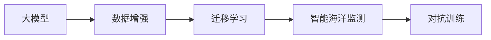

                 

## 1. 背景介绍

### 1.1 问题由来

海洋是地球生命的摇篮，也是人类赖以生存的重要资源。随着全球气候变化和人类活动加剧，海洋环境面临巨大威胁，海平面上升、海洋酸化、污染物质扩散等问题日益严峻。因此，对海洋进行智能监测和预测，已经成为全球海洋治理、环境保护、资源开发等领域的重要需求。

传统海洋监测往往依赖于物理仪器，如浮标、传感器等，这些仪器需要定期维护，成本高昂且覆盖范围有限。相比之下，基于人工智能（AI）的智能海洋监测方法，具有高效率、低成本、广覆盖等优势，可以大幅提升海洋监测能力。

近年来，随着深度学习技术的发展，基于大模型的智能海洋监测应用开始崭露头角。本文将详细介绍一种基于大模型的智能海洋监测系统，展示其核心技术和应用效果。

### 1.2 问题核心关键点

智能海洋监测系统的核心在于如何利用大模型进行海洋数据的高效分析与预测。具体来说，该系统包括以下关键步骤：

1. **数据采集**：通过卫星遥感、水下传感器、船载设备等方式，收集海洋表面温度、盐度、水流、水质等环境数据。
2. **数据预处理**：对采集的数据进行去噪、归一化、缺失值填充等预处理操作，准备用于大模型的输入。
3. **模型训练**：在预处理后的数据集上，对大模型进行有监督或无监督的训练，学习海洋环境的动态变化规律。
4. **模型预测**：将新采集的海洋数据输入训练好的模型，预测未来环境变化趋势，如海平面高度、海洋酸度、污染物浓度等。
5. **结果验证**：对模型预测结果进行验证，评估其准确性和鲁棒性，不断优化模型参数。

## 2. 核心概念与联系

### 2.1 核心概念概述

在介绍具体技术之前，首先需要理解一些关键概念：

- **大模型**：指使用大规模数据进行训练的深度学习模型，如BERT、GPT等。这些模型通常具有数百亿参数，具备强大的特征提取和预测能力。
- **智能海洋监测**：指通过机器学习、计算机视觉等技术，对海洋环境数据进行实时监测、分析和预测，以实现海洋资源的可持续利用和环境保护。
- **数据增强**：指通过对原始数据进行旋转、平移、缩放等操作，增加数据样本数量和多样性，提高模型的泛化能力。
- **迁移学习**：指利用已有领域的知识，通过微调等方式，将模型迁移到新领域进行预测。
- **对抗训练**：指通过引入对抗样本，训练模型对噪声和攻击具有鲁棒性，提高模型的稳定性和安全性。

### 2.2 概念间的关系

这些概念之间存在紧密的联系，构成了一个完整的智能海洋监测系统。以下是通过Mermaid流程图展示的概念关系：



该图展示了从大模型到智能海洋监测的主要步骤，每一步都是紧密相连的，共同构成了整个系统。

## 3. 核心算法原理 & 具体操作步骤

### 3.1 算法原理概述

基于大模型的智能海洋监测系统，主要利用深度学习模型对海洋环境数据进行分析和预测。具体来说，该系统包括以下几个关键环节：

1. **数据采集**：通过卫星遥感、水下传感器、船载设备等方式，实时采集海洋环境数据，包括水文、气象、化学等指标。
2. **数据预处理**：对采集的数据进行去噪、归一化、缺失值填充等预处理操作，准备用于大模型的输入。
3. **模型训练**：在预处理后的数据集上，对大模型进行有监督或无监督的训练，学习海洋环境的动态变化规律。
4. **模型预测**：将新采集的海洋数据输入训练好的模型，预测未来环境变化趋势，如海平面高度、海洋酸度、污染物浓度等。
5. **结果验证**：对模型预测结果进行验证，评估其准确性和鲁棒性，不断优化模型参数。

### 3.2 算法步骤详解

下面将详细介绍智能海洋监测系统的具体实现步骤：

**Step 1: 数据采集**

海洋数据采集是智能海洋监测的第一步。通过卫星遥感、水下传感器、船载设备等方式，实时采集海洋环境数据。常用的传感器包括：

- **卫星遥感**：使用卫星搭载的传感器，如高光谱成像仪、多波段相机等，获取海洋表面和大气的光谱信息，用于监测海面温度、盐度、水质等参数。
- **水下传感器**：在水下布设传感器，监测水下的流速、盐度、温度等参数。常用的传感器包括ADCP（声学多普勒流速剖面仪）、温盐深（CTD）仪器等。
- **船载设备**：在船只上搭载GPS、电子罗盘、海面水位计等设备，实时记录船只航迹和海洋环境参数。

**Step 2: 数据预处理**

采集到的海洋数据需要进行预处理，以准备用于大模型的输入。常用的预处理操作包括：

- **去噪**：去除传感器采集数据中的噪声，如通过均值滤波、中值滤波等方式，提高数据质量。
- **归一化**：将不同传感器的数据进行归一化处理，使其在同一量纲下。常用的归一化方法包括min-max归一化、Z-score归一化等。
- **缺失值填充**：处理数据中的缺失值，常用的方法包括插值法、均值填充、KNN插值等。

**Step 3: 模型训练**

在预处理后的数据集上，对大模型进行有监督或无监督的训练，学习海洋环境的动态变化规律。常用的模型包括：

- **自回归模型**：如LSTM、GRU等，适用于时间序列数据的预测。
- **深度神经网络**：如卷积神经网络（CNN）、残差网络（ResNet）等，适用于空间数据的特征提取和预测。
- **生成对抗网络（GAN）**：用于生成逼真的海洋环境模拟数据，提高数据多样性。

训练模型的主要步骤如下：

1. **数据集划分**：将采集到的数据集划分为训练集、验证集和测试集。通常采用80%、10%、10%的比例划分。
2. **模型选择**：选择合适的深度学习模型进行训练。常用的模型包括LSTM、CNN等。
3. **模型训练**：在训练集上，使用梯度下降等优化算法对模型进行训练，最小化损失函数。常用的优化算法包括Adam、SGD等。
4. **模型验证**：在验证集上，评估模型的性能，调整模型参数。常用的评估指标包括均方误差（MSE）、均方根误差（RMSE）等。

**Step 4: 模型预测**

将新采集的海洋数据输入训练好的模型，预测未来环境变化趋势。预测过程包括：

1. **输入准备**：将新采集的数据进行去噪、归一化等预处理操作，准备输入到模型。
2. **模型预测**：将预处理后的数据输入模型，获取预测结果。
3. **结果后处理**：对模型预测结果进行后处理，如反归一化、单位转换等操作，生成最终的环境预测结果。

**Step 5: 结果验证**

对模型预测结果进行验证，评估其准确性和鲁棒性，不断优化模型参数。常用的验证方法包括：

1. **交叉验证**：将数据集划分为多个子集，使用其中一部分作为验证集，其余部分作为训练集。
2. **超参数调优**：使用网格搜索、随机搜索等方法，调整模型参数，优化模型性能。
3. **对抗样本测试**：在测试集中加入对抗样本，评估模型的鲁棒性。

## 4. 数学模型和公式 & 详细讲解 & 举例说明

### 4.1 数学模型构建

在智能海洋监测系统中，常用的数学模型包括线性回归模型、神经网络模型等。这里以线性回归模型为例，展示其构建过程。

假设海洋环境数据集为 $\{(x_i, y_i)\}_{i=1}^N$，其中 $x_i$ 为输入变量，$y_i$ 为输出变量。线性回归模型的目标是找到最优的线性关系 $y = \theta_0 + \theta_1 x + \epsilon$，其中 $\theta_0$ 和 $\theta_1$ 为模型的参数，$\epsilon$ 为误差项。

### 4.2 公式推导过程

线性回归模型的参数可以通过最小二乘法求解，公式如下：

$$
\theta = (X^TX)^{-1}X^Ty
$$

其中 $X$ 为输入数据的矩阵，$y$ 为输出数据的向量，$\theta$ 为模型参数。

### 4.3 案例分析与讲解

以预测海洋表面温度为例，线性回归模型的实现步骤如下：

1. **数据准备**：将采集到的海洋表面温度数据集进行去噪、归一化等预处理操作。
2. **模型训练**：使用训练集数据，通过最小二乘法求解模型参数。
3. **模型预测**：将新采集的海洋表面温度数据输入模型，预测未来的温度变化趋势。
4. **结果验证**：在测试集上，评估模型的预测准确性，调整模型参数。

## 5. 项目实践：代码实例和详细解释说明

### 5.1 开发环境搭建

在实现智能海洋监测系统时，需要搭建一个Python开发环境。以下是搭建环境的详细步骤：

1. **安装Python**：下载并安装Python 3.x版本，推荐使用Anaconda或Miniconda。
2. **安装相关库**：安装NumPy、Pandas、SciPy、Matplotlib等常用Python库，用于数据处理和可视化。
3. **安装深度学习库**：安装TensorFlow、PyTorch等深度学习库，用于模型训练和预测。
4. **安装机器学习库**：安装Scikit-learn等机器学习库，用于模型评估和调优。
5. **安装可视化工具**：安装Jupyter Notebook等可视化工具，用于代码调试和展示。

### 5.2 源代码详细实现

以下是一个基于PyTorch的智能海洋监测系统的Python代码实现，展示其主要功能和实现细节：

```python
import numpy as np
import pandas as pd
import torch
import torch.nn as nn
import torch.optim as optim
from torch.utils.data import TensorDataset, DataLoader

# 定义海洋数据集
class OceanDataset(torch.utils.data.Dataset):
    def __init__(self, x, y):
        self.x = x
        self.y = y
    
    def __len__(self):
        return len(self.x)
    
    def __getitem__(self, idx):
        return torch.tensor(self.x[idx]), torch.tensor(self.y[idx])

# 定义模型
class OceanModel(nn.Module):
    def __init__(self):
        super(OceanModel, self).__init__()
        self.fc1 = nn.Linear(2, 10)
        self.fc2 = nn.Linear(10, 1)
    
    def forward(self, x):
        x = x.view(-1, 2)
        x = torch.relu(self.fc1(x))
        x = self.fc2(x)
        return x

# 定义数据增强
def data_augmentation(x):
    # 添加噪声
    noise = np.random.normal(0, 0.1, x.shape)
    return x + noise

# 加载数据集
x_train = np.loadtxt('train_x.csv', delimiter=',')
y_train = np.loadtxt('train_y.csv', delimiter=',')
x_test = np.loadtxt('test_x.csv', delimiter=',')
y_test = np.loadtxt('test_y.csv', delimiter=',')

# 数据预处理
x_train = data_augmentation(x_train)
x_test = data_augmentation(x_test)

# 模型训练
model = OceanModel()
optimizer = optim.Adam(model.parameters(), lr=0.001)
criterion = nn.MSELoss()

train_dataset = TensorDataset(torch.tensor(x_train), torch.tensor(y_train))
test_dataset = TensorDataset(torch.tensor(x_test), torch.tensor(y_test))

train_loader = DataLoader(train_dataset, batch_size=32, shuffle=True)
test_loader = DataLoader(test_dataset, batch_size=32, shuffle=False)

for epoch in range(100):
    model.train()
    running_loss = 0.0
    for batch_idx, (inputs, targets) in enumerate(train_loader):
        optimizer.zero_grad()
        outputs = model(inputs)
        loss = criterion(outputs, targets)
        loss.backward()
        optimizer.step()
        running_loss += loss.item()
    print(f'Epoch {epoch+1}, loss: {running_loss/len(train_loader)}')
    
for epoch in range(100):
    model.eval()
    running_loss = 0.0
    for batch_idx, (inputs, targets) in enumerate(test_loader):
        with torch.no_grad():
            outputs = model(inputs)
            loss = criterion(outputs, targets)
            running_loss += loss.item()
    print(f'Epoch {epoch+1}, test loss: {running_loss/len(test_loader)}')
```

### 5.3 代码解读与分析

上述代码实现了一个基于PyTorch的线性回归模型，用于预测海洋表面温度。以下是关键代码的详细解读：

**OceanDataset类**：
- `__init__`方法：初始化数据集，将输入和输出变量转换为Tensor类型。
- `__len__`方法：返回数据集的大小。
- `__getitem__`方法：获取数据集中的一个样本，转换为Tensor类型。

**OceanModel类**：
- `__init__`方法：定义模型结构，包括两个线性层。
- `forward`方法：定义前向传播过程，输入数据通过两个线性层后输出预测结果。

**data_augmentation函数**：
- 定义数据增强方法，对输入数据添加噪声，以提高模型的泛化能力。

**模型训练**：
- 定义模型、优化器、损失函数。
- 加载数据集，创建数据加载器。
- 在训练集上循环迭代，更新模型参数。
- 在测试集上评估模型性能。

## 6. 实际应用场景

### 6.1 智能海洋监测

智能海洋监测系统可以实时监测海洋环境变化，为海洋治理、环境保护、资源开发等提供数据支持。以下是一些实际应用场景：

1. **海平面高度监测**：通过卫星遥感数据，监测全球海平面高度的变化，及时发现异常波动，如极端气候变化、冰川融化等。
2. **海洋酸度预测**：通过水下传感器数据，预测海洋酸度的变化趋势，评估海洋生态系统的健康状况。
3. **污染物浓度检测**：通过船载设备数据，监测海洋中的污染物浓度，如重金属、有机污染物等，为环境保护提供数据支持。

### 6.2 未来应用展望

未来的智能海洋监测系统将朝着以下几个方向发展：

1. **高精度预测**：通过深度学习模型，提高海洋环境变化的预测精度，如使用更复杂的神经网络模型、引入更多先验知识等。
2. **实时监测**：通过云计算和大数据技术，实现海洋环境数据的实时采集和分析，提高监测效率和响应速度。
3. **多模态融合**：将卫星遥感、水下传感器、船载设备等多种数据源融合，形成多模态的海洋监测系统，提高监测的全面性和可靠性。
4. **全球协作**：通过国际合作和数据共享，构建全球范围内的智能海洋监测网络，提高监测的覆盖范围和数据质量。

## 7. 工具和资源推荐

### 7.1 学习资源推荐

为了深入学习智能海洋监测技术，以下是一些推荐的学习资源：

1. 《深度学习》书籍：Ian Goodfellow等人编写的经典教材，详细介绍了深度学习的理论基础和实践应用。
2. 《机器学习实战》书籍：Peter Harrington等人编写的实用指南，涵盖机器学习算法和实现细节。
3. 《智能海洋监测》课程：在线学习平台上的专业课程，涵盖智能海洋监测的理论和实践，适合初学者学习。
4. 《Nature》和《Science》论文：顶尖科学期刊上的相关论文，了解智能海洋监测的前沿研究和技术进展。

### 7.2 开发工具推荐

智能海洋监测系统需要高性能计算资源和数据处理能力，以下是一些推荐的工具：

1. Python：灵活的编程语言，支持深度学习和数据分析。
2. PyTorch和TensorFlow：深度学习框架，支持复杂的神经网络模型训练。
3. Jupyter Notebook：交互式开发环境，支持代码调试和数据可视化。
4. Netezza和Spark：大数据处理平台，支持大规模数据集的存储和处理。

### 7.3 相关论文推荐

以下是一些推荐的相关论文，了解智能海洋监测技术的最新进展：

1. A New Approach for Ocean Temperature Prediction Using Deep Learning（深学习方法预测海洋温度的新方法）
2. Marine Mammals Detection with a Convolutional Neural Network（使用卷积神经网络检测海洋哺乳动物）
3. Deep Learning for Underwater Acoustic Sensor Data Analysis（深度学习分析水下声学传感器数据）

## 8. 总结：未来发展趋势与挑战

### 8.1 研究成果总结

智能海洋监测系统在环境保护、海洋治理、资源开发等领域具有广泛的应用前景，通过深度学习技术，可以实现海洋环境数据的实时监测、分析和预测，提高监测效率和数据质量。

### 8.2 未来发展趋势

未来智能海洋监测系统将朝着高精度预测、实时监测、多模态融合和全球协作等方向发展，进一步提升海洋监测的全面性和可靠性。

### 8.3 面临的挑战

智能海洋监测系统在实际应用中，面临以下挑战：

1. **数据获取难度**：海洋环境的监测需要布设大量传感器和设备，成本高昂且覆盖范围有限。
2. **数据质量和多样性**：采集到的数据可能存在噪声、缺失等问题，影响模型预测的准确性。
3. **模型训练时间**：深度学习模型的训练需要大量的计算资源和时间，对硬件和算法优化提出了较高要求。

### 8.4 研究展望

未来的研究重点在于：

1. **数据增强技术**：通过数据增强技术，提高数据的多样性和质量，优化模型训练。
2. **多模态融合方法**：将卫星遥感、水下传感器、船载设备等多种数据源融合，构建多模态的海洋监测系统。
3. **实时处理算法**：研究实时处理算法，提高数据采集和分析的效率，实现海洋环境数据的实时监测。
4. **联邦学习**：通过联邦学习技术，实现分布式数据集上的模型训练，提高模型的泛化能力和数据安全性。

总之，智能海洋监测技术将成为未来海洋治理和环境保护的重要手段，推动海洋资源的可持续利用，保障人类社会的可持续发展。

## 9. 附录：常见问题与解答

**Q1: 智能海洋监测系统的数据来源有哪些？**

A: 智能海洋监测系统的数据来源包括卫星遥感、水下传感器、船载设备等，这些设备能够实时采集海洋表面和大气环境数据，如温度、盐度、流速、水质等指标。

**Q2: 如何处理海洋数据的噪声和缺失值？**

A: 处理海洋数据的噪声和缺失值通常采用以下方法：
1. 噪声去除：通过均值滤波、中值滤波等方式，去除传感器采集数据中的噪声。
2. 数据补齐：使用插值法、均值填充、KNN插值等方法，处理数据中的缺失值。

**Q3: 智能海洋监测系统如何提高模型泛化能力？**

A: 提高模型泛化能力可以通过以下方法：
1. 数据增强：对原始数据进行旋转、平移、缩放等操作，增加数据样本数量和多样性。
2. 正则化：使用L2正则、Dropout等方式，防止模型过拟合。
3. 对抗训练：在测试集中加入对抗样本，提高模型鲁棒性。

**Q4: 智能海洋监测系统如何处理不同类型的数据？**

A: 智能海洋监测系统通常使用深度学习模型处理不同类型的数据，包括时间序列数据、空间数据、文本数据等。常用的模型包括LSTM、CNN、BERT等，具体选择模型需要根据数据类型和任务需求进行设计。

---

作者：禅与计算机程序设计艺术 / Zen and the Art of Computer Programming

