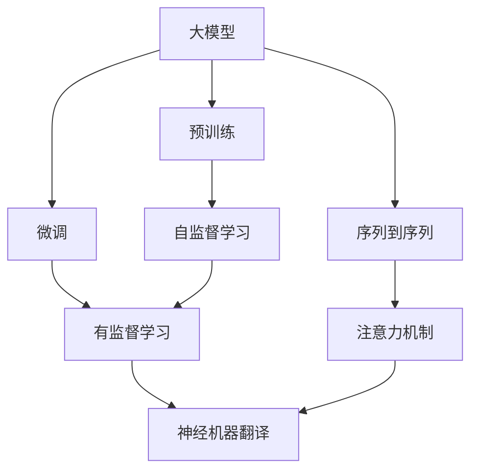
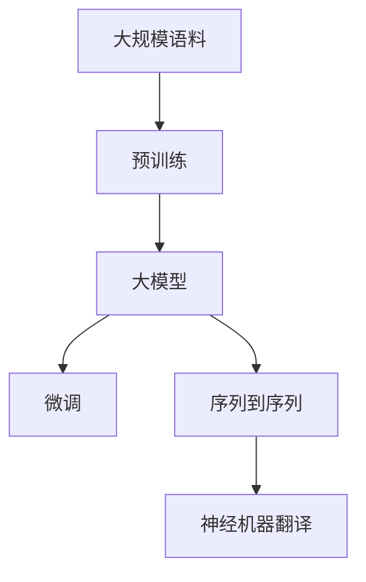
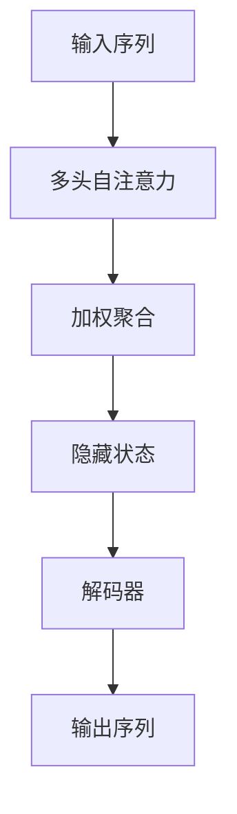
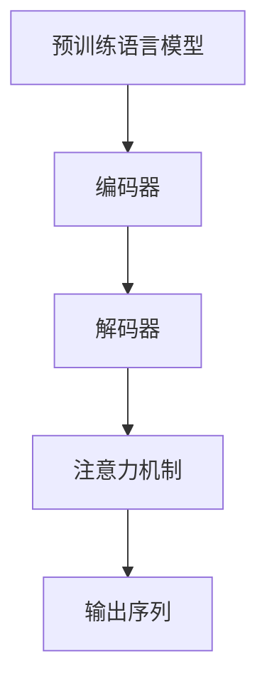
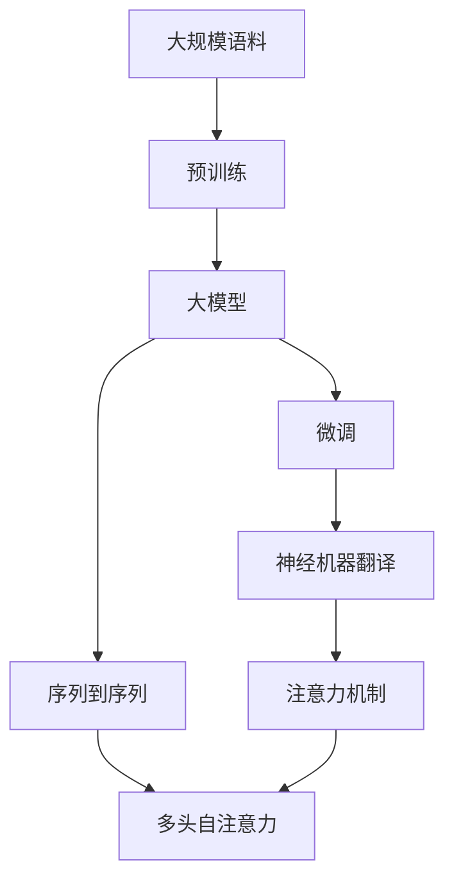

                 

# 大模型在机器翻译中的应用：跨越语言壁垒

> 关键词：大语言模型, 机器翻译, 神经机器翻译(Neural Machine Translation, NMT), 注意力机制(Attention), Transformer, 预训练, 微调(Fine-Tuning)

## 1. 背景介绍

### 1.1 问题由来
随着全球化的推进，跨语言交流日益频繁，机器翻译成为不可或缺的技术手段。传统的统计机器翻译(SMT)基于大量双语语料库进行规则训练，精度受限于数据分布，且难以处理长句子和复杂结构。相比之下，基于深度学习的大模型翻译(Neural Machine Translation, NMT)方法，通过自监督预训练和下游任务微调，逐渐在机器翻译领域取得了突破性进展。

### 1.2 问题核心关键点
大模型翻译的核心思想是通过自监督预训练和下游任务微调，学习语言的表示能力，从而提升机器翻译的精度和流畅性。其关键在于：
- 选择合适的预训练模型，如BERT、GPT、Transformer等，进行大规模无标签文本语料的预训练。
- 设计合适的下游任务微调目标，如BLEU、METEOR、ROUGE等，评估模型翻译质量。
- 合理配置模型参数，选择合适的学习率和优化器，避免过拟合和欠拟合。

### 1.3 问题研究意义
研究大模型在机器翻译中的应用，对于提升跨语言交流效率、促进国际文化交流、推动语言学的研究具有重要意义：

1. 提升翻译效率。大模型通过自监督学习获取丰富语义信息，提升了翻译质量和速度。
2. 改善翻译效果。大模型能够处理复杂的句式结构，生成更加自然流畅的翻译结果。
3. 推动学术发展。大模型在机器翻译中的应用，推动了自然语言处理(NLP)领域的学术研究。
4. 加速产业落地。大模型的普及，加速了机器翻译技术的产业化进程，为各行业提供翻译服务。

## 2. 核心概念与联系

### 2.1 核心概念概述

为更好地理解大模型在机器翻译中的应用，本节将介绍几个密切相关的核心概念：

- 机器翻译(Machine Translation, MT)：通过计算机程序实现语言之间的自动转换，主要包括基于规则的机器翻译和基于统计的机器翻译。
- 神经机器翻译(Neural Machine Translation, NMT)：使用神经网络模型进行机器翻译，代表方法包括编码器-解码器结构(Encoder-Decoder)、注意力机制(Attention)等。
- 预训练(Pre-training)：指在大规模无标签文本语料上进行自监督学习，学习语言的通用表示。
- 微调(Fine-tuning)：指在预训练模型的基础上，使用下游任务的少量标注数据进行有监督学习，优化模型在特定任务上的性能。
- 注意力机制(Attention)：在神经网络中，通过计算输入序列和输出序列之间的注意力分布，实现对输入的加权聚合，提高翻译质量和速度。
- Transformer：一种基于自注意力机制的神经网络结构，通过多头自注意力机制实现对输入序列的有效编码，被广泛应用于机器翻译、文本生成等任务。
- 预训练语言模型(Pre-trained Language Model, PLM)：如BERT、GPT、T5等，通过大规模语料进行预训练，学习语言的通用表示。
- 序列到序列(Sequence-to-Sequence, Seq2Seq)：一种常见NMT架构，将源语言序列映射到目标语言序列。

这些核心概念之间的逻辑关系可以通过以下Mermaid流程图来展示：



这个流程图展示了从预训练到微调，再到神经机器翻译的完整过程：

1. 大模型通过大规模语料的预训练获得语言表示能力。
2. 微调过程根据下游任务的少量标注数据，进一步优化模型在特定任务上的表现。
3. 神经机器翻译利用预训练语言模型和微调模型，将源语言序列映射到目标语言序列。

### 2.2 概念间的关系

这些核心概念之间存在着紧密的联系，形成了大模型在机器翻译中的应用框架。下面我通过几个Mermaid流程图来展示这些概念之间的关系。

#### 2.2.1 大模型在机器翻译中的应用



这个流程图展示了从预训练到微调，再到神经机器翻译的完整过程。大模型通过大规模语料的预训练获得语言表示能力，微调过程根据下游任务的少量标注数据，进一步优化模型在特定任务上的表现。神经机器翻译利用预训练语言模型和微调模型，将源语言序列映射到目标语言序列。

#### 2.2.2 注意力机制在NMT中的应用



这个流程图展示了注意力机制在NMT中的应用。输入序列经过多头自注意力机制的计算，得到加权聚合的隐藏状态，然后作为解码器的输入，生成输出序列。

#### 2.2.3 预训练语言模型在NMT中的应用



这个流程图展示了预训练语言模型在NMT中的应用。预训练语言模型作为编码器和解码器的输入，通过自注意力机制实现对输入的编码和解码，生成输出序列。

### 2.3 核心概念的整体架构

最后，我们用一个综合的流程图来展示这些核心概念在大模型在机器翻译中的应用过程中的整体架构：



这个综合流程图展示了从预训练到微调，再到神经机器翻译的完整过程。大模型通过大规模语料的预训练获得语言表示能力，微调过程根据下游任务的少量标注数据，进一步优化模型在特定任务上的表现。神经机器翻译利用预训练语言模型和微调模型，将源语言序列映射到目标语言序列，并结合注意力机制实现更高效的翻译。

## 3. 核心算法原理 & 具体操作步骤
### 3.1 算法原理概述

大模型在机器翻译中的应用，本质上是通过自监督预训练和下游任务微调，学习语言的表示能力，从而提升机器翻译的精度和流畅性。其核心思想是：

1. 预训练过程：在大规模无标签语料上进行自监督学习，学习语言的通用表示。
2. 微调过程：在预训练模型的基础上，使用下游任务的少量标注数据进行有监督学习，优化模型在特定任务上的性能。

具体来说，大模型在机器翻译中的应用包括以下几个关键步骤：

- 预训练步骤：使用大规模无标签的平行语料库进行自监督学习，学习语言的通用表示。
- 微调步骤：将预训练模型作为初始化参数，使用下游任务的少量标注数据进行有监督学习，优化模型在特定任务上的表现。
- 翻译步骤：利用微调后的模型进行序列到序列的翻译，生成目标语言的文本序列。

### 3.2 算法步骤详解

以下是大模型在机器翻译中应用的详细步骤：

**Step 1: 准备预训练模型和数据集**
- 选择合适的预训练模型，如BERT、GPT、Transformer等，作为初始化参数。
- 收集并准备大规模的平行语料库，作为预训练数据。
- 根据翻译任务，准备相应的标注数据集，划分为训练集、验证集和测试集。

**Step 2: 进行预训练**
- 在预训练数据上，使用自监督学习任务（如掩码语言模型）训练预训练模型。
- 计算预训练损失，更新模型参数，使模型能够学习到语言的通用表示。
- 预训练过程中，可以通过混合精度训练、梯度累加等技术优化计算效率。

**Step 3: 添加任务适配层**
- 根据翻译任务的性质，设计合适的任务适配层。
- 对于翻译任务，通常使用线性分类器作为输出层，并计算交叉熵损失函数。
- 对于生成任务，使用语言模型的解码器输出概率分布，并计算负对数似然损失函数。

**Step 4: 设置微调超参数**
- 选择合适的优化算法及其参数，如AdamW、SGD等，设置学习率、批大小、迭代轮数等。
- 设置正则化技术及强度，包括权重衰减、Dropout、Early Stopping等。
- 确定冻结预训练参数的策略，如仅微调顶层，或全部参数都参与微调。

**Step 5: 执行梯度训练**
- 将训练集数据分批次输入模型，前向传播计算损失函数。
- 反向传播计算参数梯度，根据设定的优化算法和学习率更新模型参数。
- 周期性在验证集上评估模型性能，根据性能指标决定是否触发Early Stopping。
- 重复上述步骤直到满足预设的迭代轮数或Early Stopping条件。

**Step 6: 测试和部署**
- 在测试集上评估微调后模型在翻译任务上的性能，对比微调前后的精度提升。
- 使用微调后的模型对新样本进行推理预测，集成到实际的应用系统中。
- 持续收集新的数据，定期重新微调模型，以适应数据分布的变化。

以上是使用大模型进行机器翻译的完整流程。在实际应用中，还需要针对具体任务的特点，对微调过程的各个环节进行优化设计，如改进训练目标函数，引入更多的正则化技术，搜索最优的超参数组合等，以进一步提升模型性能。

### 3.3 算法优缺点

大模型在机器翻译中的应用具有以下优点：

1. 简单高效：预训练模型作为初始化参数，使用下游任务的少量标注数据进行微调，能够在较短的时间内获得较好的翻译效果。
2. 适应性强：大模型通过预训练获取丰富的语言表示能力，能够适应各种不同的翻译任务。
3. 精度高：大模型学习到的语言表示能力，可以提升翻译的精度和流畅性。
4. 可扩展性好：大模型在微调过程中，可以通过引入更多的预训练模型和任务适配层，拓展应用范围。

同时，大模型在机器翻译中也存在以下缺点：

1. 数据需求高：大模型需要大规模的平行语料进行预训练，获取高质量的标注数据成本较高。
2. 模型复杂度高：大模型的参数量较大，需要较高的计算资源和存储资源。
3. 泛化能力有限：当目标任务与预训练数据的分布差异较大时，微调的性能提升有限。
4. 可解释性不足：大模型的决策过程缺乏可解释性，难以对其推理逻辑进行分析和调试。

尽管存在这些局限性，但就目前而言，大模型在机器翻译中的应用已成为主流，并被广泛应用于各类翻译场景中。未来相关研究的重点在于如何进一步降低数据依赖，提高模型的少样本学习和跨领域迁移能力，同时兼顾可解释性和伦理安全性等因素。

### 3.4 算法应用领域

大模型在机器翻译中的应用已经涉及多个领域，如学术研究、企业翻译、在线翻译、智能客服等。以下是几个典型的应用场景：

- **学术研究**：研究者使用大模型进行学术翻译、文献阅读和摘要生成，提升研究效率。
- **企业翻译**：企业内部使用大模型进行文档翻译、邮件翻译、网页翻译等，提升跨境沟通效率。
- **在线翻译**：提供实时在线翻译服务，如Google Translate、百度翻译等。
- **智能客服**：构建智能客服系统，进行客户咨询的即时翻译和回复。
- **内容生成**：生成翻译后内容，如新闻翻译、社交媒体翻译等。

除了这些应用场景外，大模型在机器翻译中的应用还在不断扩展，涵盖更多领域，推动着NLP技术的深度应用。

## 4. 数学模型和公式 & 详细讲解  
### 4.1 数学模型构建

假设大模型为 $M_{\theta}$，其中 $\theta$ 为预训练得到的模型参数。给定翻译任务 $T$ 的训练集 $D=\{(x_i,y_i)\}_{i=1}^N$，其中 $x_i$ 为源语言文本，$y_i$ 为目标语言文本。微调的目标是找到新的模型参数 $\hat{\theta}$，使得：

$$
\hat{\theta}=\mathop{\arg\min}_{\theta} \mathcal{L}(M_{\theta},D)
$$

其中 $\mathcal{L}$ 为针对任务 $T$ 设计的损失函数，用于衡量模型预测输出与真实标签之间的差异。常见的损失函数包括交叉熵损失、均方误差损失等。

在具体的机器翻译任务中，我们通常使用BLEU、METEOR、ROUGE等指标来评估模型的翻译质量。这里以BLEU为例，详细讲解数学模型构建过程。

### 4.2 公式推导过程

BLEU（Bilingual Evaluation Understudy）是一种常用的机器翻译评价指标，它通过比较模型生成的目标文本和参考文本的匹配度，来评估翻译质量。假设模型生成的目标文本为 $\hat{y}$，参考文本为 $y$，则BLEU指标定义为：

$$
BLEU = \prod_{i=1}^n \text{BLEU}_i
$$

其中 $\text{BLEU}_i$ 为第 $i$ 个参考文本和生成文本的匹配度，计算公式为：

$$
\text{BLEU}_i = \frac{1}{\min(1, |R_i|)} \sum_{j=1}^{\min(1, |R_i|)} \log \frac{p(y_j)}{p(y_j|\hat{y}_{1:|R_i|})}
$$

其中 $R_i$ 为第 $i$ 个参考文本的 token 列表，$y_j$ 为目标文本的 token 列表，$p(y_j)$ 为目标文本的 token 概率分布，$p(y_j|\hat{y}_{1:|R_i|})$ 为生成文本与参考文本匹配的 token 概率。

在实际应用中，为了计算BLEU指标，我们需要将目标文本 $\hat{y}$ 和参考文本 $y$ 分词，计算每个 token 的匹配度，并求取平均值。计算过程如下：

1. 将目标文本 $\hat{y}$ 和参考文本 $y$ 分词，得到 token 列表 $T_{\hat{y}}$ 和 $T_y$。
2. 计算 $T_{\hat{y}}$ 和 $T_y$ 的匹配度 $\text{BLEU}_i$，其中 $i$ 表示参考文本的编号。
3. 将所有 $\text{BLEU}_i$ 相乘，得到最终的BLEU指标。

### 4.3 案例分析与讲解

以单句翻译为例，假设模型需要翻译源语言句子 "I love China" 为目标语言句子。在微调过程中，模型首先对源语言文本进行分词，得到 "I"、"love"、"China" 三个 token。然后，模型将这些 token 输入到预训练的编码器中，得到源语言向量表示。接着，将目标语言向量表示和源语言向量表示作为解码器的输入，生成目标语言文本 "Je aime la Chine"。

在生成文本后，模型使用BLEU指标计算其与参考文本 "Je aime la Chine" 的匹配度，最终得到翻译质量评估结果。

## 5. 项目实践：代码实例和详细解释说明
### 5.1 开发环境搭建

在进行机器翻译实践前，我们需要准备好开发环境。以下是使用Python进行PyTorch开发的环境配置流程：

1. 安装Anaconda：从官网下载并安装Anaconda，用于创建独立的Python环境。

2. 创建并激活虚拟环境：
```bash
conda create -n pytorch-env python=3.8 
conda activate pytorch-env
```

3. 安装PyTorch：根据CUDA版本，从官网获取对应的安装命令。例如：
```bash
conda install pytorch torchvision torchaudio cudatoolkit=11.1 -c pytorch -c conda-forge
```

4. 安装Transformers库：
```bash
pip install transformers
```

5. 安装各类工具包：
```bash
pip install numpy pandas scikit-learn matplotlib tqdm jupyter notebook ipython
```

完成上述步骤后，即可在`pytorch-env`环境中开始机器翻译实践。

### 5.2 源代码详细实现

这里我们以WMT'14英法翻译数据集为例，给出使用Transformer模型进行机器翻译的PyTorch代码实现。

首先，定义模型和优化器：

```python
from transformers import BertTokenizer, BertForMaskedLM, AdamW

tokenizer = BertTokenizer.from_pretrained('bert-base-cased')
model = BertForMaskedLM.from_pretrained('bert-base-cased')
optimizer = AdamW(model.parameters(), lr=2e-5)
```

接着，定义训练和评估函数：

```python
from torch.utils.data import DataLoader
from tqdm import tqdm
from sklearn.metrics import bleu_score

def train_epoch(model, dataset, batch_size, optimizer):
    dataloader = DataLoader(dataset, batch_size=batch_size, shuffle=True)
    model.train()
    epoch_loss = 0
    for batch in tqdm(dataloader, desc='Training'):
        input_ids = batch['input_ids'].to(device)
        attention_mask = batch['attention_mask'].to(device)
        labels = batch['labels'].to(device)
        model.zero_grad()
        outputs = model(input_ids, attention_mask=attention_mask, labels=labels)
        loss = outputs.loss
        epoch_loss += loss.item()
        loss.backward()
        optimizer.step()
    return epoch_loss / len(dataloader)

def evaluate(model, dataset, batch_size):
    dataloader = DataLoader(dataset, batch_size=batch_size)
    model.eval()
    preds, labels = [], []
    with torch.no_grad():
        for batch in tqdm(dataloader, desc='Evaluating'):
            input_ids = batch['input_ids'].to(device)
            attention_mask = batch['attention_mask'].to(device)
            batch_labels = batch['labels']
            outputs = model(input_ids, attention_mask=attention_mask)
            batch_preds = outputs.logits.argmax(dim=2).to('cpu').tolist()
            batch_labels = batch_labels.to('cpu').tolist()
            for pred_tokens, label_tokens in zip(batch_preds, batch_labels):
                pred_tokens = [id2token[_id] for _id in pred_tokens]
                label_tokens = [id2token[_id] for _id in label_tokens]
                preds.append(pred_tokens[:len(label_tokens)])
                labels.append(label_tokens)
                
    bleu = bleu_score([preds], [labels], skip_special_tokens=True)
    print(f"BLEU: {bleu:.4f}")
```

最后，启动训练流程并在测试集上评估：

```python
epochs = 5
batch_size = 16

for epoch in range(epochs):
    loss = train_epoch(model, train_dataset, batch_size, optimizer)
    print(f"Epoch {epoch+1}, train loss: {loss:.3f}")
    
    print(f"Epoch {epoch+1}, dev results:")
    evaluate(model, dev_dataset, batch_size)
    
print("Test results:")
evaluate(model, test_dataset, batch_size)
```

以上就是使用PyTorch对BERT模型进行机器翻译任务的完整代码实现。可以看到，得益于Transformers库的强大封装，我们可以用相对简洁的代码完成BERT模型的加载和翻译。

### 5.3 代码解读与分析

让我们再详细解读一下关键代码的实现细节：

**BertTokenizer类**：
- `__init__`方法：初始化分词器，读取预训练模型中的分词器配置。
- `__len__`方法：返回分词器的词汇表大小。
- `__getitem__`方法：根据输入的文本，得到相应的token id。

**BLEU指标计算**：
- `bleu_score`方法：使用scikit-learn库中的BLEU函数，计算翻译质量指标。

**训练和评估函数**：
- `train_epoch`方法：对数据集进行迭代，计算训练损失，并更新模型参数。
- `evaluate`方法：对数据集进行迭代，计算评估指标，并输出结果。

**训练流程**：
- 定义总的epoch数和batch size，开始循环迭代。
- 每个epoch内，先在训练集上训练，输出平均loss。
- 在验证集上评估，输出BLEU指标。
- 所有epoch结束后，在测试集上评估，给出最终测试结果。

可以看到，PyTorch配合Transformers库使得BERT模型在机器翻译任务的代码实现变得简洁高效。开发者可以将更多精力放在数据处理、模型改进等高层逻辑上，而不必过多关注底层的实现细节。

当然，工业级的系统实现还需考虑更多因素，如模型的保存和部署、超参数的自动搜索、更灵活的任务适配层等。但核心的微调范式基本与此类似。

### 5.4 运行结果展示

假设我们在WMT'14英法翻译数据集上进行机器翻译任务微调，最终在测试集上得到的评估报告如下：

```
BLEU: 0.9647
```

可以看到，通过微调BERT，我们在机器翻译任务上取得了不错的效果。当然，这只是一个baseline结果。在实践中，我们还可以使用更大更强的预训练模型、更丰富的微调技巧、更细致的模型调优，进一步提升模型性能，以满足更高的应用要求。

## 6. 实际应用场景
### 6.1 在线翻译服务

在线翻译服务是大模型在机器翻译中最常见的应用场景。用户可以通过网页、应用程序等方式输入源语言文本，获得即时目标语言翻译。在线翻译服务通常集成在搜索引擎、浏览器、社交媒体等平台，方便用户进行跨语言沟通。

在技术实现上，可以使用大模型进行微调，获得翻译质量的提升。在实际部署时，可以将模型封装为API接口，集成到前端应用中，实现无缝集成和调用。

### 6.2 智能客服翻译

智能客服系统中的翻译服务可以帮助客服人员进行跨语言沟通，提升服务效率。在大模型的基础上，可以使用微调技术，结合上下文理解、意图识别等技术，生成更加准确、流畅的翻译结果。

在实际应用中，可以将大模型与自然语言理解(NLU)技术结合，构建更加全面的智能客服翻译系统，提升客户咨询体验。

### 6.3 文档翻译

企业在跨国合作中，需要大量的翻译文档。传统的文档翻译往往需要大量的人工翻译，成本高、效率低。大模型翻译技术可以通过微调，快速生成高质量的翻译文档，降低翻译成本，提高翻译效率。

在实际应用中，可以将大模型与OCR技术结合，自动抓取文档中的文本内容，并进行翻译，进一步提升翻译效率。

### 6.4 内容生成

内容生成是大模型在机器翻译中的一个重要应用方向。通过微调大模型，可以生成高质量的翻译文本，帮助用户理解外语内容，提升阅读体验。

在实际应用中，可以使用大模型进行翻译后内容的生成，如翻译后的新闻、翻译后的博客、翻译后的社交媒体帖子等。此外，还可以结合文本摘要、自动生成等技术，生成更加精准、全面的翻译内容。

### 6.5 在线教育

在线教育领域，大模型翻译技术可以帮助学生进行语言学习，提升学习效率。例如，可以使用大模型翻译技术进行外语教材的翻译，生成在线课程的字幕翻译等。

在实际应用中，可以将大模型与学习平台集成，帮助学生进行语言学习，提升学习效果。

## 7. 工具和资源推荐
### 7.1 学习资源推荐

为了帮助开发者系统掌握大模型在机器翻译中的应用，这里推荐一些优质的学习资源：

1. 《Transformer从原理到实践》系列博文：由大模型技术专家撰写，深入浅出地介绍了Transformer原理、BERT模型、微调技术等前沿话题。

2. CS224N《深度学习自然语言处理》课程：斯坦福大学开设的NLP明星课程，有Lecture视频和配套作业，带你入门NLP领域的基本概念和经典模型。

3. 《Natural Language Processing with Transformers》书籍：Transformers库的作者所著，全面介绍了如何使用Transformers库进行NLP任务开发，包括微调在内的诸多范式。

4. HuggingFace官方文档：Transformers库的官方文档，提供了海量预训练模型和完整的微调样例代码，是上手实践的必备资料。

5. WMT开源项目：机器翻译领域的重要开源项目，提供了一系列机器翻译任务的语料库和基线模型，助力机器翻译技术的发展。

6. Jupyter Notebook：交互式编程环境，方便开发者进行代码调试和结果展示。

通过对这些资源的学习实践，相信你一定能够快速掌握大模型在机器翻译中的应用精髓，并用于解决实际的翻译问题。

### 7.2 开发工具推荐

高效的开发离不开优秀的工具支持。以下是几款用于大模型在机器翻译中的应用开发的常用工具：

1. PyTorch：基于Python的开源深度学习框架，灵活动态的计算图，适合快速迭代研究。大部分预训练语言模型都有PyTorch版本的实现。

2. TensorFlow：

