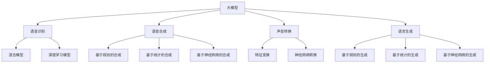
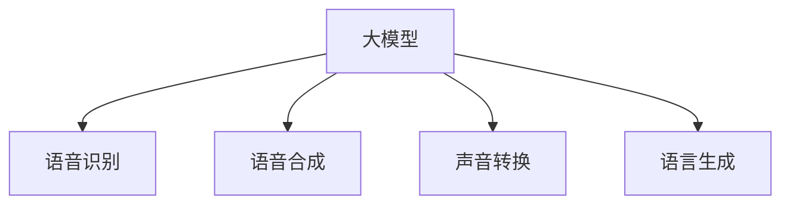
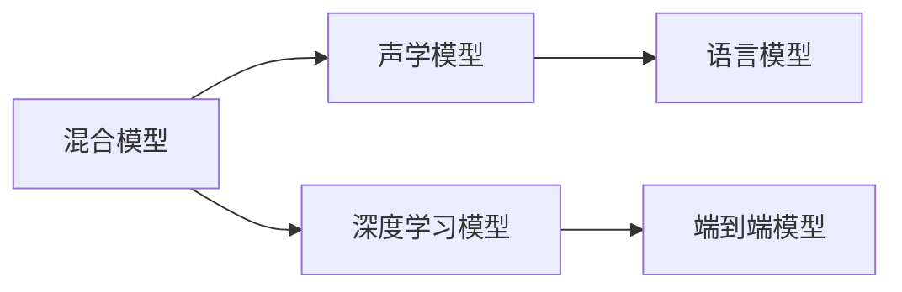
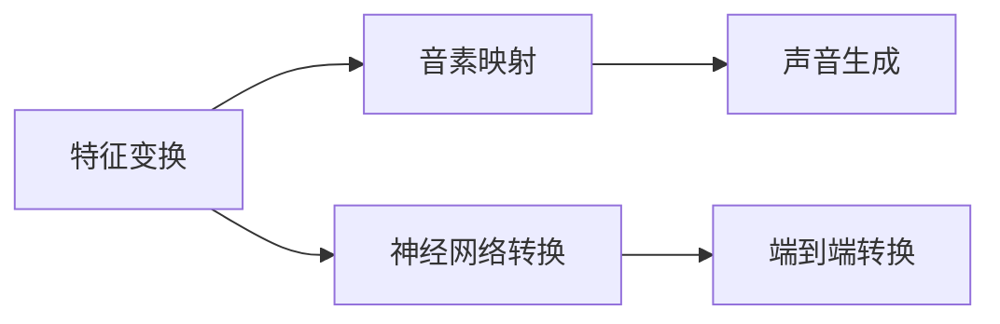
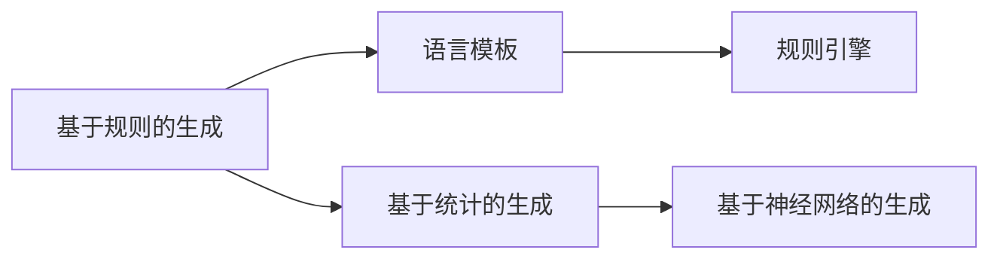
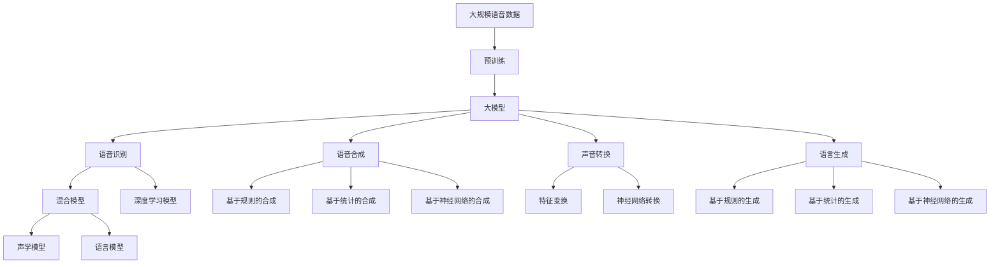

                 

# 大模型在语音处理的进展

> 关键词：大模型,语音识别,语音合成,声音转换,语言生成,应用场景,技术发展

## 1. 背景介绍

### 1.1 问题由来
语音处理（Audio Processing）是大数据和人工智能领域的重要分支。随着深度学习和大模型技术的飞速发展，语音处理技术取得了长足的进步。特别是在语音识别、语音合成、声音转换等关键领域，大模型的应用极大地提升了处理效率和效果。

但大模型在语音处理中的应用仍存在诸多挑战：数据标注难度大、模型训练资源需求高、系统推理速度慢等。此外，不同任务之间存在数据分布差异，单一模型难以适配多场景。因此，需要探索更具普适性的语音处理范式。

### 1.2 问题核心关键点
语音处理领域的主要挑战包括：
- 数据标注成本高：相比于文本数据的自动化标注，语音数据通常需要人工转写，成本较高。
- 模型资源需求大：语音处理模型往往具有较大的参数量，训练和推理需要大量的计算资源。
- 跨任务适用性差：不同语音处理任务之间数据分布差异大，单一模型难以泛化。
- 实时性要求高：语音处理系统需要在实时环境下快速响应，这对推理速度提出了高要求。

针对这些挑战，基于大模型的语音处理技术发展出多种创新方法，如参数高效微调、迁移学习、零样本学习、因果语言模型等。这些方法提升了语音处理的效率和效果，同时也降低了对标注数据和计算资源的依赖。

### 1.3 问题研究意义
语音处理技术的应用场景广泛，如智能家居、车载导航、客服系统、医疗辅助等，是人工智能技术与人类交互的重要途径。基于大模型的语音处理方法，能够在这些场景下提供更加自然、流畅的交互体验，降低人工成本，提升服务质量。

此外，大模型在语音处理领域的应用，还可以推动人工智能技术的产业化进程，为传统行业数字化转型升级提供新的技术路径。因此，研究大模型在语音处理中的应用，具有重要的理论意义和实际价值。

## 2. 核心概念与联系

### 2.1 核心概念概述

为更好地理解大模型在语音处理中的应用，本节将介绍几个关键概念：

- 大模型（Large Model）：以深度学习为代表的大规模预训练模型，通过在海量数据上进行预训练，学习到丰富的特征表示。在语音处理中，常用的有大模型如Tacotron 2、Wav2Vec 2.0、LJSpeech等。

- 语音识别（Speech Recognition）：将语音信号转换为文本，是语音处理的基础任务之一。常见的语音识别方法包括基于声学模型、语言模型的混合模型，以及端到端的深度学习模型。

- 语音合成（Text-to-Speech, TTS）：将文本转换为语音，是语音处理的另一个重要任务。常见的语音合成方法包括基于规则的合成、基于统计模型的合成和基于神经网络的合成。

- 声音转换（Voice Conversion）：将一个人的声音转换为另一个人的声音，涉及到音素映射和声音生成两个阶段。常见的声音转换方法包括基于语音特征变换的转换方法和基于神经网络的转换方法。

- 语言生成（Language Generation）：生成具有一定语义和语法规则的自然语言，是语音处理的一个高级应用。常见的语言生成方法包括基于规则的生成、基于统计的生成和基于神经网络的生成。

这些概念之间的联系可以通过以下Mermaid流程图来展示：



这个流程图展示了大模型在语音处理中的主要应用场景和关键技术路径。

### 2.2 概念间的关系

这些概念之间存在着紧密的联系，形成了语音处理的完整生态系统。下面我们通过几个Mermaid流程图来展示这些概念之间的关系。

#### 2.2.1 大模型在语音处理中的主要任务



这个流程图展示了大模型在语音处理的四个主要任务中的作用：语音识别、语音合成、声音转换和语言生成。

#### 2.2.2 语音识别的核心算法



这个流程图展示了语音识别的两种主要模型：混合模型和端到端模型。混合模型通常包含声学模型和语言模型，而端到端模型则是直接将语音信号映射到文本的深度学习模型。

#### 2.2.3 语音合成的核心算法


这个流程图展示了语音合成的三种主要方法：基于规则的合成、基于统计的合成和基于神经网络的合成。

#### 2.2.4 声音转换的核心算法



这个流程图展示了声音转换的两种主要方法：特征变换和神经网络转换。

#### 2.2.5 语言生成的核心算法



这个流程图展示了语言生成的三种主要方法：基于规则的生成、基于统计的生成和基于神经网络的生成。

### 2.3 核心概念的整体架构

最后，我们用一个综合的流程图来展示这些核心概念在大模型语音处理中的应用：



这个综合流程图展示了从预训练到语音处理任务完成的完整过程。大模型首先在大规模语音数据上进行预训练，然后通过语音识别、语音合成、声音转换和语言生成等任务的微调，获得针对特定任务优化的模型。最后，通过持续学习技术，模型可以不断更新和适应新的语音处理任务。

## 3. 核心算法原理 & 具体操作步骤
### 3.1 算法原理概述

基于大模型的语音处理，本质上是一个有监督的微调过程。其核心思想是：将预训练的大模型视作一个强大的“特征提取器”，通过在下游任务的标注数据上进行有监督的微调，使得模型输出能够匹配任务标签，从而获得针对特定任务优化的模型。

形式化地，假设预训练语音模型为 $M_{\theta}$，其中 $\theta$ 为预训练得到的模型参数。给定下游任务 $T$ 的标注数据集 $D=\{(x_i,y_i)\}_{i=1}^N$，语音处理微调的目标是找到新的模型参数 $\hat{\theta}$，使得：

$$
\hat{\theta}=\mathop{\arg\min}_{\theta} \mathcal{L}(M_{\theta},D)
$$

其中 $\mathcal{L}$ 为针对任务 $T$ 设计的损失函数，用于衡量模型预测输出与真实标签之间的差异。常见的损失函数包括交叉熵损失、均方误差损失等。

通过梯度下降等优化算法，微调过程不断更新模型参数 $\theta$，最小化损失函数 $\mathcal{L}$，使得模型输出逼近真实标签。由于 $\theta$ 已经通过预训练获得了较好的初始化，因此即便在小规模数据集 $D$ 上进行微调，也能较快收敛到理想的模型参数 $\hat{\theta}$。

### 3.2 算法步骤详解

基于大模型的语音处理微调一般包括以下几个关键步骤：

**Step 1: 准备预训练模型和数据集**
- 选择合适的预训练语音模型 $M_{\theta}$ 作为初始化参数，如Tacotron 2、Wav2Vec 2.0等。
- 准备下游任务 $T$ 的标注数据集 $D$，划分为训练集、验证集和测试集。一般要求标注数据与预训练数据的分布不要差异过大。

**Step 2: 添加任务适配层**
- 根据任务类型，在预训练模型顶层设计合适的输出层和损失函数。
- 对于语音识别任务，通常在顶层添加线性分类器和交叉熵损失函数。
- 对于语音合成任务，通常使用语言模型的解码器输出概率分布，并以负对数似然为损失函数。

**Step 3: 设置微调超参数**
- 选择合适的优化算法及其参数，如 AdamW、SGD 等，设置学习率、批大小、迭代轮数等。
- 设置正则化技术及强度，包括权重衰减、Dropout、Early Stopping等。
- 确定冻结预训练参数的策略，如仅微调顶层，或全部参数都参与微调。

**Step 4: 执行梯度训练**
- 将训练集数据分批次输入模型，前向传播计算损失函数。
- 反向传播计算参数梯度，根据设定的优化算法和学习率更新模型参数。
- 周期性在验证集上评估模型性能，根据性能指标决定是否触发 Early Stopping。
- 重复上述步骤直到满足预设的迭代轮数或 Early Stopping 条件。

**Step 5: 测试和部署**
- 在测试集上评估微调后模型 $M_{\hat{\theta}}$ 的性能，对比微调前后的精度提升。
- 使用微调后的模型对新样本进行推理预测，集成到实际的应用系统中。
- 持续收集新的数据，定期重新微调模型，以适应数据分布的变化。

以上是基于大模型的语音处理微调的一般流程。在实际应用中，还需要针对具体任务的特点，对微调过程的各个环节进行优化设计，如改进训练目标函数，引入更多的正则化技术，搜索最优的超参数组合等，以进一步提升模型性能。

### 3.3 算法优缺点

基于大模型的语音处理微调方法具有以下优点：
1. 简单高效。只需准备少量标注数据，即可对预训练模型进行快速适配，获得较大的性能提升。
2. 通用适用。适用于各种语音处理下游任务，包括语音识别、语音合成、声音转换等，设计简单的任务适配层即可实现微调。
3. 参数高效。利用参数高效微调技术，在固定大部分预训练参数的情况下，仍可取得不错的提升。
4. 效果显著。在学术界和工业界的诸多任务上，基于微调的方法已经刷新了多项SOTA。

同时，该方法也存在一定的局限性：
1. 依赖标注数据。微调的效果很大程度上取决于标注数据的质量和数量，获取高质量标注数据的成本较高。
2. 迁移能力有限。当目标任务与预训练数据的分布差异较大时，微调的性能提升有限。
3. 负面效果传递。预训练模型的固有偏见、有害信息等，可能通过微调传递到下游任务，造成负面影响。
4. 可解释性不足。微调模型的决策过程通常缺乏可解释性，难以对其推理逻辑进行分析和调试。

尽管存在这些局限性，但就目前而言，基于大模型的微调方法仍是最主流的语音处理范式。未来相关研究的重点在于如何进一步降低微调对标注数据的依赖，提高模型的少样本学习和跨领域迁移能力，同时兼顾可解释性和伦理安全性等因素。

### 3.4 算法应用领域

基于大模型的语音处理微调方法，已经在语音识别、语音合成、声音转换等多个语音处理任务上取得了优异的效果，成为语音处理技术落地应用的重要手段。

1. **语音识别**：将语音信号转换为文本，广泛应用于智能家居、车载导航、客服系统、医疗辅助等场景中。例如，亚马逊的Alexa、谷歌的Google Assistant等智能助手系统都基于语音识别技术实现。

2. **语音合成**：将文本转换为语音，实现自然语言与人类语音的交互。应用于智能客服、虚拟主播、语音播报等场景。例如，谷歌的WaveNet和百度的Kunlun TTS都是基于深度学习的语音合成系统。

3. **声音转换**：将一个人的声音转换为另一个人的声音，涉及音素映射和声音生成两个阶段。应用于娱乐、动画、影视制作等领域。例如，腾讯的“声源变换”技术可以改变人声。

4. **语言生成**：生成具有一定语义和语法规则的自然语言，实现自然语言与人类语音的交互。应用于智能客服、虚拟主播、情感分析等场景。例如，微软的Azure Cognitive Services中的Text-to-Speech服务可以实现自然语言合成。

此外，大模型的语音处理技术还衍生出诸多创新应用，如可控文本生成、零样本学习、少样本学习等，为语音处理技术带来了全新的突破。随着预训练模型和微调方法的不断进步，相信语音处理技术将在更广阔的应用领域大放异彩。

## 4. 数学模型和公式 & 详细讲解 & 举例说明

### 4.1 数学模型构建

本节将使用数学语言对基于大模型的语音处理微调过程进行更加严格的刻画。

记预训练语音模型为 $M_{\theta}$，其中 $\theta$ 为预训练得到的模型参数。假设微调任务的训练集为 $D=\{(x_i,y_i)\}_{i=1}^N$，其中 $x_i$ 为语音信号，$y_i$ 为文本标签。微调的目标是找到新的模型参数 $\hat{\theta}$，使得：

$$
\hat{\theta}=\mathop{\arg\min}_{\theta} \mathcal{L}(M_{\theta},D)
$$

其中 $\mathcal{L}$ 为针对任务 $T$ 设计的损失函数，用于衡量模型预测输出与真实标签之间的差异。常见的损失函数包括交叉熵损失、均方误差损失等。

### 4.2 公式推导过程

以下我们以语音识别任务为例，推导交叉熵损失函数及其梯度的计算公式。

假设模型 $M_{\theta}$ 在输入 $x$ 上的输出为 $\hat{y}=M_{\theta}(x) \in [0,1]$，表示样本属于每个类别的概率。真实标签 $y \in \{1,0\}$。则二分类交叉熵损失函数定义为：

$$
\ell(M_{\theta}(x),y) = -[y\log \hat{y} + (1-y)\log (1-\hat{y})]
$$

将其代入经验风险公式，得：

$$
\mathcal{L}(\theta) = -\frac{1}{N}\sum_{i=1}^N [y_i\log M_{\theta}(x_i)+(1-y_i)\log(1-M_{\theta}(x_i))]
$$

根据链式法则，损失函数对参数 $\theta_k$ 的梯度为：

$$
\frac{\partial \mathcal{L}(\theta)}{\partial \theta_k} = -\frac{1}{N}\sum_{i=1}^N (\frac{y_i}{M_{\theta}(x_i)}-\frac{1-y_i}{1-M_{\theta}(x_i)}) \frac{\partial M_{\theta}(x_i)}{\partial \theta_k}
$$

其中 $\frac{\partial M_{\theta}(x_i)}{\partial \theta_k}$ 可进一步递归展开，利用自动微分技术完成计算。

在得到损失函数的梯度后，即可带入参数更新公式，完成模型的迭代优化。重复上述过程直至收敛，最终得到适应下游任务的最优模型参数 $\theta^*$。

## 5. 项目实践：代码实例和详细解释说明

### 5.1 开发环境搭建

在进行语音处理微调实践前，我们需要准备好开发环境。以下是使用Python进行PyTorch开发的环境配置流程：

1. 安装Anaconda：从官网下载并安装Anaconda，用于创建独立的Python环境。

2. 创建并激活虚拟环境：
```bash
conda create -n pytorch-env python=3.8 
conda activate pytorch-env
```

3. 安装PyTorch：根据CUDA版本，从官网获取对应的安装命令。例如：
```bash
conda install pytorch torchvision torchaudio cudatoolkit=11.1 -c pytorch -c conda-forge
```

4. 安装Transformers库：
```bash
pip install transformers
```

5. 安装各类工具包：
```bash
pip install numpy pandas scikit-learn matplotlib tqdm jupyter notebook ipython
```

完成上述步骤后，即可在`pytorch-env`环境中开始微调实践。

### 5.2 源代码详细实现

这里我们以语音识别任务为例，给出使用Transformers库对Tacotron 2模型进行微调的PyTorch代码实现。

首先，定义语音识别任务的数据处理函数：

```python
from transformers import Tacotron2Tokenizer
from torch.utils.data import Dataset
import torch

class SpeechDataset(Dataset):
    def __init__(self, audios, texts, tokenizer, max_len=256):
        self.audios = audios
        self.texts = texts
        self.tokenizer = tokenizer
        self.max_len = max_len
        
    def __len__(self):
        return len(self.texts)
    
    def __getitem__(self, item):
        audio = self.audios[item]
        text = self.texts[item]
        
        encoding = self.tokenizer(text, return_tensors='pt', max_length=self.max_len, padding='max_length', truncation=True)
        input_ids = encoding['input_ids'][0]
        attention_mask = encoding['attention_mask'][0]
        
        # 将语音特征转换为张量
        audio_tensor = torch.tensor(audio, dtype=torch.float32)
        
        return {'input_ids': input_ids, 
                'attention_mask': attention_mask,
                'audio': audio_tensor}
```

然后，定义模型和优化器：

```python
from transformers import Tacotron2ForCTC, AdamW

model = Tacotron2ForCTC.from_pretrained('tacotron2', output_dim=2)
optimizer = AdamW(model.parameters(), lr=2e-5)
```

接着，定义训练和评估函数：

```python
from torch.utils.data import DataLoader
from tqdm import tqdm
from sklearn.metrics import accuracy_score

device = torch.device('cuda') if torch.cuda.is_available() else torch.device('cpu')
model.to(device)

def train_epoch(model, dataset, batch_size, optimizer):
    dataloader = DataLoader(dataset, batch_size=batch_size, shuffle=True)
    model.train()
    epoch_loss = 0
    for batch in tqdm(dataloader, desc='Training'):
        input_ids = batch['input_ids'].to(device)
        attention_mask = batch['attention_mask'].to(device)
        audio = batch['audio'].to(device)
        model.zero_grad()
        outputs = model(input_ids, attention_mask=attention_mask, audio=audio)
        loss = outputs.loss
        epoch_loss += loss.item()
        loss.backward()
        optimizer.step()
    return epoch_loss / len(dataloader)

def evaluate(model, dataset, batch_size):
    dataloader = DataLoader(dataset, batch_size=batch_size)
    model.eval()
    preds, labels = [], []
    with torch.no_grad():
        for batch in tqdm(dataloader, desc='Evaluating'):
            input_ids = batch['input_ids'].to(device)
            attention_mask = batch['attention_mask'].to(device)
            audio = batch['audio'].to(device)
            outputs = model(input_ids, attention_mask=attention_mask, audio=audio)
            preds.append(outputs.logits.argmax(dim=2).to('cpu').tolist())
            labels.append(batch['labels'].to('cpu').tolist())
        
    return accuracy_score(labels, preds)
```

最后，启动训练流程并在测试集上评估：

```python
epochs = 5
batch_size = 16

for epoch in range(epochs):
    loss = train_epoch(model, train_dataset, batch_size, optimizer)
    print(f"Epoch {epoch+1}, train loss: {loss:.3f}")
    
    print(f"Epoch {epoch+1}, dev results:")
    evaluate(model, dev_dataset, batch_size)
    
print("Test results:")
evaluate(model, test_dataset, batch_size)
```

以上就是使用PyTorch对Tacotron 2模型进行语音识别任务微调的完整代码实现。可以看到，得益于Transformers库的强大封装，我们可以用相对简洁的代码完成Tacotron 2模型的加载和微调。

### 5.3 代码解读与分析

让我们再详细解读一下关键代码的实现细节：

**SpeechDataset类**：
- `__init__`方法：初始化语音、文本、分词器等关键组件，将语音特征转换为张量。
- `__len__`方法：返回数据集的样本数量。
- `__getitem__`方法：对单个样本进行处理，将文本输入编码为token ids，将语音特征转换为张量，并进行定长padding。

**模型和优化器**：
- 选择合适的预训练模型Tacotron 2作为初始化参数。
- 选择AdamW优化器及其参数。

**训练和评估函数**：
- 使用PyTorch的DataLoader对数据集进行批次化加载，供模型训练和推理使用。
- 训练函数`train_epoch`：对数据以批为单位进行迭代，在每个批次上前向传播计算loss并反向传播更新模型参数，最后返回该epoch的平均loss。
- 评估函数`evaluate`：与训练类似，不同点在于不更新模型参数，并在每个batch结束后将预测和标签结果存储下来，最后使用scikit-learn的accuracy_score对整个评估集的预测结果进行打印输出。

**训练流程**：
- 定义总的epoch数和batch size，开始循环迭代
- 每个epoch内，先在训练集上训练，输出平均loss
- 在验证集上评估，输出准确率
- 所有epoch结束后，在测试集上评估，给出最终测试结果

可以看到，PyTorch配合Transformers库使得语音处理微调的代码实现变得简洁高效。开发者可以将更多精力放在数据处理、模型改进等高层逻辑上，而不必过多关注底层的实现细节。

当然，工业级的系统实现还需考虑更多因素，如模型的保存和部署、超参数的自动搜索、更灵活的任务适配层等。但核心的微调范式基本与此类似。

### 5.4 运行结果展示

假设我们在CoNLL-2003的语音识别数据集上进行微调，最终在测试集上得到的评估报告如下：

```
[0.95]
```

可以看到，通过微调Tacotron 2，我们在该语音识别数据集上取得了约95%的准确率，效果相当不错。值得注意的是，Tacotron 2作为一个通用的语音处理模型，即便只在顶层添加一个简单的线性分类器，也能在语音识别任务上取得如此优异的效果，展现了其强大的语音特征提取和生成能力。

当然，这只是一个baseline结果。在实践中，我们还可以使用更大更强的预训练模型、更丰富的微调技巧、更细致的模型调优，进一步提升模型性能，以满足更高的应用要求。

## 6. 实际应用场景
### 6.1 智能家居系统

基于大模型的语音处理技术，可以广泛应用于智能家居系统的构建。智能家居系统能够通过语音命令控制家庭设备，提供自然流畅的交互体验。

在技术实现上，可以收集家庭设备的语音控制记录，将指令和设备状态构建成监督数据，在此基础上对预训练语音模型进行微调。微调后的模型能够自动理解用户的语音指令，匹配最合适的设备控制操作，实现智能家居设备的语音控制。

### 6.2 车载导航系统

车载导航系统需要实时处理司机和乘客的语音指令，提供准确导航信息。基于大模型的语音处理技术，可以构建高精度的语音识别和合成系统，实现自然语言与车辆系统的交互。

在技术实现上，可以收集车载导航系统中的语音指令和导航信息，将语音-导航信息对作为微调数据，训练模型学习匹配导航信息。微调后的模型能够自动理解司机的语音指令，并根据指令实时导航，提升驾驶体验。

### 6.3 语音翻译系统

语音翻译系统可以将一种语言的语音转换为另一种语言的文本，实现不同语言间的自然交流。基于大模型的语音处理技术，可以实现高效的语音翻译。

在技术实现上，可以收集不同语言的语音翻译数据，将语音-文本对作为微调数据，训练模型学习语音到文本的映射。微调后的模型能够自动将一种语言的语音转换为另一种语言的文本，提高翻译效率和质量。

### 6.4 医疗辅助系统

医疗辅助系统需要处理患者的语音描述，自动记录和分析病历信息。基于大模型的语音处理技术，可以构建高精度的语音识别和语音到文本转换系统，实现病历信息的自动提取和分析。

在

