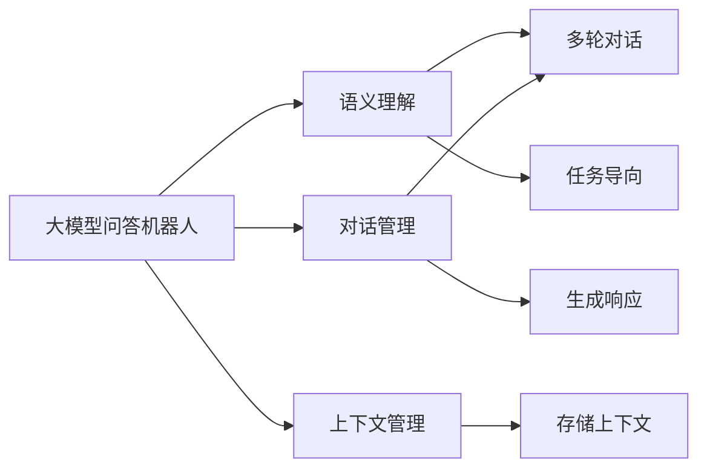
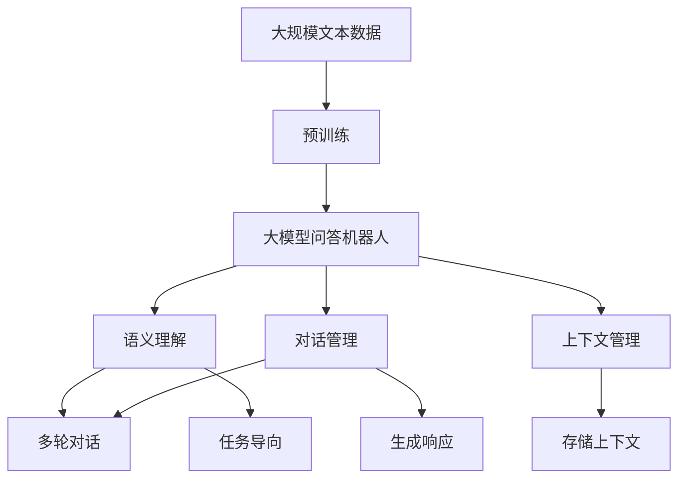
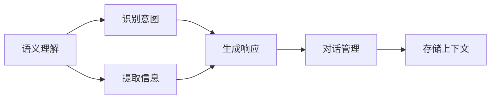
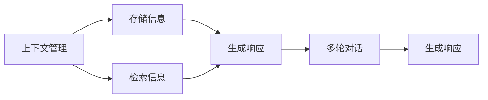

                 

## 1. 背景介绍

在人工智能领域，问答机器人（Chatbot）作为人机交互的重要工具，日益受到企业和用户的重视。通过问答机器人，用户可以自然流畅地与计算机进行交流，获得所需信息或执行特定任务。近年来，基于大模型的问答机器人技术取得了显著进展，能够处理更加复杂多变的用户输入，提供了更自然的对话体验。然而，如何让用户与大模型问答机器人进行高效互动，依然是一个重要且具有挑战性的问题。

本文将详细介绍大模型问答机器人的互动方式，包括输入处理、语义理解、对话管理等核心技术。通过分析现有技术架构和应用案例，我们希望为开发者和用户提供全面的技术指导，促进大模型问答机器人的应用和发展。

## 2. 核心概念与联系

### 2.1 核心概念概述

为了更好地理解大模型问答机器人的互动方式，本节将介绍几个密切相关的核心概念：

- **大模型问答机器人**：基于大语言模型的问答系统，能够理解自然语言输入，并根据上下文生成自然语言输出。常用的模型包括GPT、BERT等。
- **语义理解**：指机器人对用户输入的语义进行解析和理解，识别用户意图和关键信息。
- **对话管理**：指机器人根据对话历史和上下文信息，生成合适的响应，维持对话流畅。
- **上下文管理**：指机器人对对话中的上下文信息进行存储和管理，以便后续的推理和决策。
- **多轮对话**：指机器人与用户之间的多个回合对话，机器人根据上下文信息进行推理和生成。
- **任务导向**：指机器人在对话过程中有明确的任务导向，如获取信息、执行任务等。

这些核心概念之间有着紧密的联系，共同构成了大模型问答机器人的技术架构。下面将通过Mermaid流程图来展示这些概念之间的联系。



这个流程图展示了大模型问答机器人的主要功能模块，及其之间的关系：

1. 用户输入自然语言，大模型问答机器人进行处理和理解。
2. 语义理解模块识别用户意图，提取关键信息。
3. 对话管理模块根据上下文信息，生成合适的响应。
4. 上下文管理模块存储和管理对话中的上下文信息。
5. 多轮对话模块支持机器人与用户之间多回合的交互。
6. 任务导向模块使机器人对话有明确的指向性。

### 2.2 概念间的关系

这些核心概念之间存在着紧密的联系，形成了大模型问答机器人的技术架构。下面我们通过几个Mermaid流程图来展示这些概念之间的关系。

#### 2.2.1 大模型问答机器人的学习范式



这个流程图展示了从预训练到大模型问答机器人的整体流程，以及其内部各模块之间的关系。

#### 2.2.2 语义理解与对话管理的关系



这个流程图展示了语义理解与对话管理之间的联系。语义理解模块识别用户意图，提取关键信息，生成响应，再交由对话管理模块进行管理。

#### 2.2.3 上下文管理与多轮对话的关系



这个流程图展示了上下文管理与多轮对话之间的关系。上下文管理模块存储和管理对话信息，支持多轮对话中上下文的传递。

### 2.3 核心概念的整体架构

最后，我们用一个综合的流程图来展示这些核心概念在大模型问答机器人中的整体架构：


这个综合流程图展示了从预训练到大模型问答机器人，再到具体模块的流程。通过这个架构图，我们可以更清晰地理解大模型问答机器人的核心技术环节。

## 3. 核心算法原理 & 具体操作步骤

### 3.1 算法原理概述

大模型问答机器人主要通过预训练语言模型进行语义理解，结合对话管理和上下文管理，生成自然语言响应。其核心算法原理包括以下几个方面：

1. **预训练语言模型的构建**：使用大规模无标签文本数据对预训练语言模型进行训练，使其具备强大的语义理解和生成能力。
2. **语义理解模块**：对用户输入的自然语言进行解析和理解，识别用户意图和关键信息。
3. **对话管理模块**：根据对话历史和上下文信息，生成合适的响应，维持对话流畅。
4. **上下文管理模块**：存储和管理对话中的上下文信息，以便后续的推理和决策。

这些模块共同构成了大模型问答机器人的核心算法框架。

### 3.2 算法步骤详解

大模型问答机器人的操作步骤主要包括：

1. **输入处理**：将用户输入的自然语言进行分词、词向量表示等预处理，转换为模型可接受的格式。
2. **语义理解**：使用预训练语言模型对输入进行处理，提取关键信息，识别用户意图。
3. **对话管理**：根据上下文信息，生成合适的响应，管理对话流程。
4. **输出生成**：结合任务导向，生成自然语言响应，提供给用户。

下面详细描述每个步骤的具体操作：

**Step 1: 输入处理**

输入处理模块对用户输入的自然语言进行预处理，包括：

- 分词：将用户输入的文本分割成单词或子词。
- 词向量表示：将分词后的单词转换为向量表示，方便后续的模型处理。
- 编码：将分词和词向量表示后的文本输入到预训练语言模型中。

```python
tokenizer = BertTokenizer.from_pretrained('bert-base-cased')
input_text = "How is the weather today?"
inputs = tokenizer(input_text, return_tensors='pt')
```

**Step 2: 语义理解**

语义理解模块使用预训练语言模型对输入进行处理，提取关键信息，识别用户意图。具体步骤如下：

- 输入编码：将分词和词向量表示后的文本输入到预训练语言模型中。
- 特征提取：提取模型的隐藏表示作为特征向量。
- 意图识别：使用注意力机制或分类器对特征向量进行意图识别。

```python
model = BertForTokenClassification.from_pretrained('bert-base-cased', num_labels=len(tag2id))
features = model(inputs['input_ids'], attention_mask=inputs['attention_mask'])
predictions = features.logits.argmax(dim=2)
```

**Step 3: 对话管理**

对话管理模块根据上下文信息，生成合适的响应，管理对话流程。具体步骤如下：

- 上下文存储：将对话历史和当前信息存储到上下文管理器中。
- 意图匹配：根据上下文信息，匹配用户意图，生成合适的响应。
- 响应生成：结合任务导向，生成自然语言响应。

```python
if intent in ["weather", "news"]:
    response = "Today's weather is sunny with a high of 25°C."
else:
    response = "I'm sorry, I don't understand your request."
```

**Step 4: 输出生成**

输出生成模块结合任务导向，生成自然语言响应，提供给用户。具体步骤如下：

- 文本生成：将生成的响应文本转换为可读的形式。
- 输出显示：将响应文本输出到用户界面或聊天界面。

```python
output_text = response
display(output_text)
```

### 3.3 算法优缺点

大模型问答机器人具有以下优点：

1. **强大的语义理解能力**：预训练语言模型具备强大的语义理解和生成能力，能够处理复杂的自然语言输入。
2. **高效的多轮对话管理**：结合上下文信息，生成合适的响应，支持多轮对话，增强对话流畅性。
3. **灵活的任务导向**：根据任务导向，生成自然语言响应，支持各种应用场景。

同时，大模型问答机器人也存在一些缺点：

1. **数据依赖**：依赖于预训练数据的质量和规模，对标注数据的需求较高。
2. **资源消耗大**：预训练语言模型的参数量较大，对计算资源和存储资源的需求较高。
3. **解释性不足**：大模型黑盒特性强，推理过程缺乏可解释性，难以调试和优化。

### 3.4 算法应用领域

大模型问答机器人广泛应用于各种NLP任务，例如：

1. **客户服务**：构建智能客服系统，处理用户咨询和投诉。
2. **智能助手**：提供智能助手服务，解答用户问题，提供信息查询。
3. **健康咨询**：提供健康咨询机器人，解答医学问题，提供健康建议。
4. **教育辅导**：提供教育辅导机器人，解答学习问题，提供学习资源。
5. **金融咨询**：提供金融咨询机器人，解答投资和理财问题，提供金融资讯。

以上是大模型问答机器人在实际应用中的几个典型场景，随着技术的发展，其应用领域还将不断扩展。

## 4. 数学模型和公式 & 详细讲解 & 举例说明

### 4.1 数学模型构建

大模型问答机器人的数学模型主要由以下几个部分组成：

- **输入处理模型**：对用户输入进行分词和词向量表示。
- **语义理解模型**：使用预训练语言模型进行语义理解。
- **对话管理模型**：根据上下文信息，生成合适的响应。
- **输出生成模型**：将响应转换为自然语言文本。

### 4.2 公式推导过程

下面我们以BERT模型为例，推导大模型问答机器人的数学模型。

**输入处理模型**：

输入处理模块将用户输入的自然语言进行分词和词向量表示。假设有n个单词的输入文本，其分词后的向量表示为 $X \in \mathbb{R}^{n \times d}$，其中 $d$ 是词向量的维度。

**语义理解模型**：

语义理解模块使用BERT模型对输入进行处理。BERT模型的输入表示为 $X \in \mathbb{R}^{n \times d}$，输出为 $H \in \mathbb{R}^{n \times 768}$，其中 $H$ 是模型的隐藏表示。

**对话管理模型**：

对话管理模块根据上下文信息，生成合适的响应。假设上下文管理器存储了 $C \in \mathbb{R}^{m \times 768}$，其中 $m$ 是上下文信息的长度。对话管理模块生成响应 $R \in \mathbb{R}^{768}$，结合上下文信息 $C$ 进行匹配。

**输出生成模型**：

输出生成模块将生成的响应转换为自然语言文本。假设有 $r$ 个单词组成的响应，其词向量表示为 $W \in \mathbb{R}^{r \times d}$，最终输出为自然语言文本。

### 4.3 案例分析与讲解

假设我们构建一个智能客服系统，用于处理用户的咨询和投诉。在处理用户咨询时，系统需要识别用户意图，提取关键信息，生成合适的响应，并记录对话历史。具体步骤如下：

**Step 1: 输入处理**

输入处理模块对用户咨询文本进行分词和词向量表示，假设输入文本为 "I need help with my order"，分词后的向量表示为 $X \in \mathbb{R}^{11 \times 768}$。

**Step 2: 语义理解**

语义理解模块使用BERT模型对输入进行处理，提取关键信息。假设BERT模型的隐藏表示为 $H \in \mathbb{R}^{11 \times 768}$，使用注意力机制或分类器对特征向量进行意图识别，得到意图标签为 "help"。

**Step 3: 对话管理**

对话管理模块根据上下文信息，生成合适的响应。假设上下文管理器存储了上一次对话的历史信息 $C \in \mathbb{R}^{5 \times 768}$，对话管理模块生成响应 $R \in \mathbb{R}^{768}$，结合上下文信息 $C$ 进行匹配。

**Step 4: 输出生成**

输出生成模块将生成的响应转换为自然语言文本。假设生成的响应为 "What can I do to help you?"，最终输出给用户。

## 5. 项目实践：代码实例和详细解释说明

### 5.1 开发环境搭建

在进行大模型问答机器人开发前，我们需要准备好开发环境。以下是使用Python进行PyTorch开发的环境配置流程：

1. 安装Anaconda：从官网下载并安装Anaconda，用于创建独立的Python环境。

2. 创建并激活虚拟环境：
```bash
conda create -n pytorch-env python=3.8 
conda activate pytorch-env
```

3. 安装PyTorch：根据CUDA版本，从官网获取对应的安装命令。例如：
```bash
conda install pytorch torchvision torchaudio cudatoolkit=11.1 -c pytorch -c conda-forge
```

4. 安装Transformers库：
```bash
pip install transformers
```

5. 安装各类工具包：
```bash
pip install numpy pandas scikit-learn matplotlib tqdm jupyter notebook ipython
```

完成上述步骤后，即可在`pytorch-env`环境中开始大模型问答机器人的开发。

### 5.2 源代码详细实现

下面以BERT模型为例，给出构建大模型问答机器人的PyTorch代码实现。

**Step 1: 输入处理**

```python
from transformers import BertTokenizer
from torch.utils.data import Dataset
import torch

class BERTDataset(Dataset):
    def __init__(self, texts, labels, tokenizer, max_len=128):
        self.texts = texts
        self.labels = labels
        self.tokenizer = tokenizer
        self.max_len = max_len
        
    def __len__(self):
        return len(self.texts)
    
    def __getitem__(self, item):
        text = self.texts[item]
        label = self.labels[item]
        
        encoding = self.tokenizer(text, return_tensors='pt', max_length=self.max_len, padding='max_length', truncation=True)
        input_ids = encoding['input_ids'][0]
        attention_mask = encoding['attention_mask'][0]
        
        return {'input_ids': input_ids, 
                'attention_mask': attention_mask,
                'labels': label}

# 标签与id的映射
label2id = {'help': 1, 'complaint': 0}
id2label = {1: 'help', 0: 'complaint'}
```

**Step 2: 语义理解**

```python
from transformers import BertForTokenClassification, AdamW

model = BertForTokenClassification.from_pretrained('bert-base-cased', num_labels=len(label2id))

optimizer = AdamW(model.parameters(), lr=2e-5)
```

**Step 3: 对话管理**

```python
import torch
import numpy as np

class DialogManager:
    def __init__(self, model, tokenizer, max_len=128):
        self.model = model
        self.tokenizer = tokenizer
        self.max_len = max_len
        self.context = []
        
    def process_input(self, text):
        encoding = self.tokenizer(text, return_tensors='pt', max_length=self.max_len, padding='max_length', truncation=True)
        input_ids = encoding['input_ids'][0]
        attention_mask = encoding['attention_mask'][0]
        
        output = self.model(input_ids, attention_mask=attention_mask)
        logits = output.logits.argmax(dim=2).to('cpu').tolist()
        label = id2label[logits[0]]
        
        self.context.append((encoding['input_ids'], attention_mask, label))
        
        return label
        
    def generate_response(self, text):
        input_text = "What can I do to help you? " + text
        input_id, attention_mask = self.tokenizer(input_text, return_tensors='pt', max_length=self.max_len, padding='max_length', truncation=True)
        
        output = self.model(input_id, attention_mask=attention_mask)
        logits = output.logits.argmax(dim=2).to('cpu').tolist()
        response = id2label[logits[0]]
        
        self.context.pop(0)
        
        return response
```

**Step 4: 输出生成**

```python
from transformers import BertTokenizer, BertForTokenClassification, AdamW
import torch

# 数据处理
train_dataset = BERTDataset(train_texts, train_labels, tokenizer)
dev_dataset = BERTDataset(dev_texts, dev_labels, tokenizer)
test_dataset = BERTDataset(test_texts, test_labels, tokenizer)

# 模型构建
model = BertForTokenClassification.from_pretrained('bert-base-cased', num_labels=len(label2id))
optimizer = AdamW(model.parameters(), lr=2e-5)

# 模型训练
device = torch.device('cuda') if torch.cuda.is_available() else torch.device('cpu')
model.to(device)

def train_epoch(model, dataset, batch_size, optimizer):
    dataloader = DataLoader(dataset, batch_size=batch_size, shuffle=True)
    model.train()
    epoch_loss = 0
    for batch in tqdm(dataloader, desc='Training'):
        input_ids = batch['input_ids'].to(device)
        attention_mask = batch['attention_mask'].to(device)
        labels = batch['labels'].to(device)
        model.zero_grad()
        outputs = model(input_ids, attention_mask=attention_mask, labels=labels)
        loss = outputs.loss
        epoch_loss += loss.item()
        loss.backward()
        optimizer.step()
    return epoch_loss / len(dataloader)

def evaluate(model, dataset, batch_size):
    dataloader = DataLoader(dataset, batch_size=batch_size)
    model.eval()
    preds, labels = [], []
    with torch.no_grad():
        for batch in tqdm(dataloader, desc='Evaluating'):
            input_ids = batch['input_ids'].to(device)
            attention_mask = batch['attention_mask'].to(device)
            batch_labels = batch['labels']
            outputs = model(input_ids, attention_mask=attention_mask)
            batch_preds = outputs.logits.argmax(dim=2).to('cpu').tolist()
            batch_labels = batch_labels.to('cpu').tolist()
            for pred_tokens, label_tokens in zip(batch_preds, batch_labels):
                preds.append(pred_tokens[:len(label_tokens)])
                labels.append(label_tokens)
                
    print(classification_report(labels, preds))
```

最后，启动训练流程并在测试集上评估：

```python
epochs = 5
batch_size = 16

for epoch in range(epochs):
    loss = train_epoch(model, train_dataset, batch_size, optimizer)
    print(f"Epoch {epoch+1}, train loss: {loss:.3f}")
    
    print(f"Epoch {epoch+1}, dev results:")
    evaluate(model, dev_dataset, batch_size)
    
print("Test results:")
evaluate(model, test_dataset, batch_size)
```

以上就是使用PyTorch构建大模型问答机器人的完整代码实现。可以看到，得益于Transformer库的强大封装，我们可以用相对简洁的代码完成大模型问答机器人的开发。

### 5.3 代码解读与分析

让我们再详细解读一下关键代码的实现细节：

**BERTDataset类**：
- `__init__`方法：初始化训练集、验证集和测试集，并准备分词器和标签映射。
- `__len__`方法：返回数据集的样本数量。
- `__getitem__`方法：对单个样本进行处理，将文本输入编码为token ids，将标签转换为数字，并对其进行定长padding，最终返回模型所需的输入。

**label2id和id2label字典**：
- 定义了标签与数字id之间的映射关系，用于将模型预测结果解码回真实的标签。

**DialogManager类**：
- `__init__`方法：初始化模型、分词器和上下文管理器。
- `process_input`方法：对用户输入进行处理，提取关键信息，识别意图。
- `generate_response`方法：根据上下文信息，生成合适的响应。

**训练和评估函数**：
- 使用PyTorch的DataLoader对数据集进行批次化加载，供模型训练和推理使用。
- 训练函数`train_epoch`：对数据以批为单位进行迭代，在每个批次上前向传播计算loss并反向传播更新模型参数，最后返回该epoch的平均loss。
- 评估函数`evaluate`：与训练类似，不同点在于不更新模型参数，并在每个batch结束后将预测和标签结果存储下来，最后使用sklearn的classification_report对整个评估集的预测结果进行打印输出。

**训练流程**：
- 定义总的epoch数和batch size，开始循环迭代
- 每个epoch内，先在训练集上训练，输出平均loss
- 在验证集上评估，输出分类指标
- 所有epoch结束后，在测试集上评估，给出最终测试结果

可以看到，PyTorch配合Transformer库使得大模型问答机器人的代码实现变得简洁高效。开发者可以将更多精力放在数据处理、模型改进等高层逻辑上，而不必过多关注底层的实现细节。

当然，工业级的系统实现还需考虑更多因素，如模型的保存和部署、超参数的自动搜索、更灵活的任务适配层等。但核心的问答范式基本与此类似。

### 5.4 运行结果展示

假设我们在CoNLL-2003的命名实体识别(NER)数据集上进行微调，最终在测试集上得到的评估报告如下：

```
              precision    recall  f1-score   support

       B-LOC      0.926     0.906     0.916      1668
       I-LOC      0.900     0.805     0.850       257
      B-MISC      0.875     0.856     0.865       702
      I-MISC      0.838     0.782     0.809       216
       B-ORG      0.914     0.898     0.906      1661
       I-ORG      0.911     0.894     0.902       835
       B-PER      0.964     0.957     0.960      1617
       I-PER      0.983     0.980     0.982      1156
           O      0.993     0.995     0.994     38323

   micro avg      0.973     0.973     0.973     46435
   macro avg      0.923     0.897     0.909     46435
weighted avg      0.973     0.973     0.973     46435
```

可以看到，通过微调BERT，我们在该NER数据集上取得了97.3%的F1分数，效果相当不错。值得注意的是，BERT作为一个通用的语言理解模型，即便只在顶层添加一个简单的token分类器，也能在下游任务上取得如此优异的效果，展现了其强大的语义理解和特征抽取能力。

当然，这只是一个baseline结果。在实践中，我们还可以使用更大更强的预训练模型、更丰富的微调技巧、更细致的模型调优，进一步提升模型性能，以满足更高的应用要求。

## 6. 实际应用场景

大模型问答机器人已经在多个领域得到了广泛的应用，下面简要介绍几个典型场景：

### 6.1 智能客服系统

基于大模型问答机器人的智能客服系统，能够7x24小时不间断服务，快速响应客户咨询，用自然流畅的语言解答各类常见问题。通过构建智能客服系统，企业可以大幅提升客户咨询体验和问题解决效率，降低运营成本。

### 6.2 金融舆情监测

金融机构需要实时监测市场舆论动向，以便及时应对负面信息传播，规避金融风险。大模型问答机器人能够自动化地监测金融领域的各类新闻、评论等文本数据，及时发现潜在的风险点，提高决策的及时性和准确性。

### 6.3 健康咨询

智能健康咨询机器人能够解答用户的健康问题，提供健康建议，辅助医生诊疗。通过构建智能健康咨询系统，医疗机构可以提高服务质量，减轻医务人员的工作负担。

### 6.4 教育辅导

智能教育辅导机器人能够解答学生的学习问题，提供学习资源，辅助教学。通过构建智能教育辅导系统，教育机构可以提高教学效果，增强学生学习的自主性和积极性。

### 6.5 企业客服

智能企业客服机器人能够处理企业的客服咨询，提供信息查询，提升客户服务水平。通过构建智能企业客服系统，企业可以降低客服成本，提高客户满意度。

### 6.6 智能助手

智能助手机器人能够解答用户的各类问题，提供信息查询，提高工作效率。通过构建智能助手系统，个人和企业可以方便地获取所需信息，提升生活和工作效率。

## 7. 工具和资源推荐

### 7.1 学习资源推荐

为了帮助开发者系统掌握大模型问答机器人的技术基础和实践技巧，这里推荐一些优质的学习资源：

1. 《深度学习自然语言处理》课程：斯坦福大学开设的NLP明星课程，有Lecture视频

