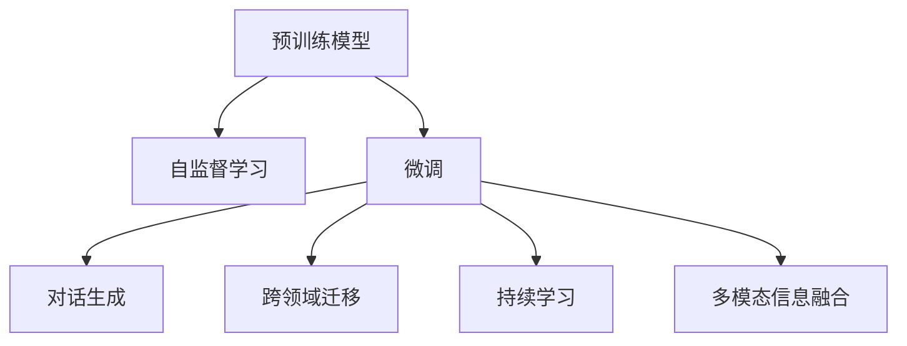
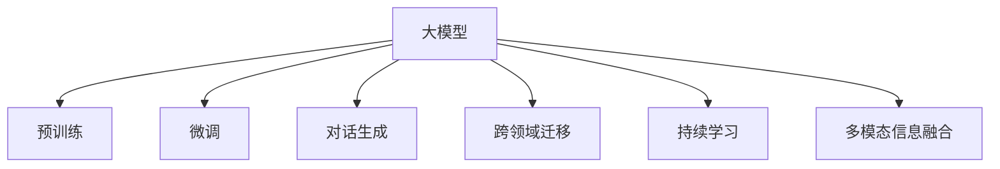
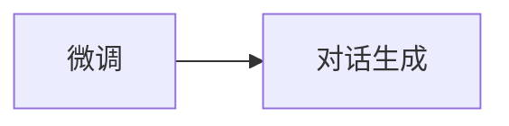
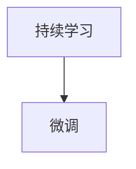
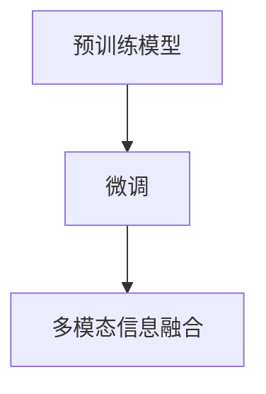
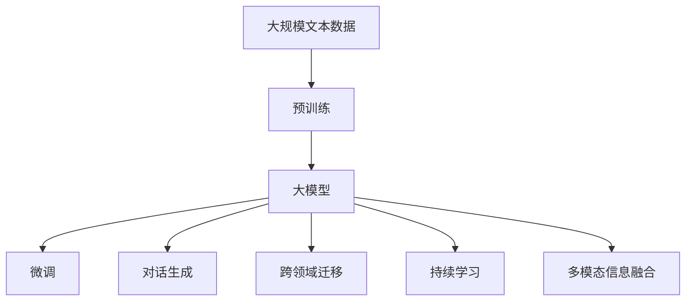

                 

# 大模型问答机器人的任务处理

> 关键词：大模型, 问答机器人, 自然语言处理(NLP), 预训练, 微调(Fine-Tuning), 自监督学习, 自回归模型, 跨领域迁移, 对话生成, 持续学习, 多模态信息融合

## 1. 背景介绍

### 1.1 问题由来
随着深度学习技术的快速发展，大模型（Large Models）在自然语言处理（Natural Language Processing, NLP）领域取得了显著进展。特别是预训练模型（Pre-trained Models），通过在大规模无标签文本数据上进行训练，学习了丰富的语言知识。这些模型已经广泛应用于文本分类、命名实体识别、情感分析等任务，并取得了优异的表现。

在问答机器人（Chatbot）领域，预训练模型同样展现了强大的潜力。通过微调（Fine-Tuning）等技术，大模型可以在问答任务中实现高性能的对话生成和问题回答。问答机器人能够处理复杂的对话交互，提供高效、自然的响应，极大地提升了用户体验。

### 1.2 问题核心关键点
大模型问答机器人核心问题在于如何利用预训练模型的知识，针对特定任务进行微调，使得模型能够高效、准确地回答用户问题。核心技术包括：

- 预训练模型的选择：如GPT-3、BERT、T5等。
- 微调策略：如有监督学习、少样本学习、零样本学习等。
- 对话管理：如何管理对话状态，提供连贯、一致的对话。
- 持续学习：模型如何持续更新，以适应新问题和数据。

这些关键问题直接影响问答机器人的性能和用户体验。因此，深入理解大模型问答机器人的任务处理流程，对于构建高效、可靠、可解释的对话系统具有重要意义。

### 1.3 问题研究意义
问答机器人作为人机交互的重要界面，在智能客服、智能助理、智能健康咨询等领域具有广泛应用。通过大模型问答机器人，可以提升服务效率、降低成本，并为用户提供更好的用户体验。

具体而言，大模型问答机器人研究的意义包括：

1. **降低成本**：大规模预训练模型已经在大量无标签数据上进行训练，具有较高的通用性和泛化能力。微调模型只需要少量有标签数据，即可快速适应特定任务，显著减少数据标注和模型训练的投入。
2. **提升效果**：微调过程可以针对具体任务优化模型，提高模型在特定领域的表现。
3. **加速开发**：微调模型能够快速适配新任务，缩短开发周期，加速NLP技术的产业化进程。
4. **技术创新**：微调范式促进了对预训练模型的深入研究，催生了少样本学习、零样本学习、多模态融合等新研究方向。
5. **赋能行业**：大模型问答机器人技术可以赋能各行各业，推动传统行业数字化转型升级。

## 2. 核心概念与联系

### 2.1 核心概念概述

为更好地理解大模型问答机器人的任务处理流程，本节将介绍几个核心概念及其相互联系：

- 预训练模型：通过自监督学习在大规模无标签文本数据上训练得到的模型，如BERT、GPT-3等。
- 微调：在预训练模型的基础上，使用特定任务的有标签数据进行微调，使得模型能够更好地适应该任务。
- 自回归模型：如GPT-3等，能够生成连续文本的模型。
- 跨领域迁移：利用预训练模型的知识，将其迁移到不同领域或任务中，实现迁移学习。
- 对话生成：通过微调后的模型，生成自然、连贯的对话响应。
- 持续学习：模型能够持续从新数据中学习，同时保持已学习的知识，避免灾难性遗忘。
- 多模态信息融合：将文本、图像、语音等多模态信息融合，提升模型的理解能力和生成能力。

这些核心概念通过Mermaid流程图展示了它们之间的联系：



这个流程图展示了从预训练到微调，再到对话生成、跨领域迁移、持续学习和多模态融合的过程。预训练模型通过自监督学习获得了广泛的语言知识，然后通过微调适应特定任务，生成对话，进行跨领域迁移，持续更新学习，并融合多模态信息。这些过程相互作用，使得大模型问答机器人能够高效、自然地与用户交互。

### 2.2 概念间的关系

这些核心概念之间存在着紧密的联系，形成了大模型问答机器人的完整任务处理流程。下面我们通过几个Mermaid流程图来展示这些概念之间的关系。

#### 2.2.1 问答机器人的学习范式



这个流程图展示了问答机器人的三种主要学习范式：预训练、微调和对话生成。预训练模型通过自监督学习获得语言知识，然后通过微调适应特定任务，生成对话，进行跨领域迁移，持续学习新知识，并融合多模态信息。

#### 2.2.2 微调与对话生成的关系



这个流程图展示了微调与对话生成的关系。微调后的模型能够更好地理解对话上下文，生成自然、连贯的对话响应。

#### 2.2.3 跨领域迁移与微调的关系


这个流程图展示了跨领域迁移与微调的关系。通过微调，预训练模型能够适应新的任务和数据分布，实现跨领域的迁移。

#### 2.2.4 持续学习与微调的关系



这个流程图展示了持续学习与微调的关系。持续学习使得微调后的模型能够不断更新，保持已学习知识的同时，适应新数据和任务。

#### 2.2.5 多模态信息融合与微调的关系



这个流程图展示了多模态信息融合与微调的关系。通过微调，模型能够更好地融合多模态信息，提升对复杂场景的理解和生成能力。

### 2.3 核心概念的整体架构

最后，我们用一个综合的流程图来展示这些核心概念在大模型问答机器人任务处理流程中的整体架构：



这个综合流程图展示了从预训练到微调，再到对话生成、跨领域迁移、持续学习和多模态融合的过程。大模型通过预训练获得广泛的语言知识，然后通过微调适应特定任务，生成对话，进行跨领域迁移，持续学习新知识，并融合多模态信息，从而高效、自然地与用户交互。

## 3. 核心算法原理 & 具体操作步骤
### 3.1 算法原理概述

大模型问答机器人的任务处理流程，本质上是一个有监督的细粒度迁移学习过程。其核心思想是：将预训练的大模型视作一个强大的"特征提取器"，通过在特定任务的有标签数据上进行微调，使得模型输出能够匹配任务标签，从而获得针对特定任务优化的模型。

形式化地，假设预训练模型为 $M_{\theta}$，其中 $\theta$ 为预训练得到的模型参数。给定问答任务 $T$ 的标注数据集 $D=\{(x_i,y_i)\}_{i=1}^N, x_i \in \mathcal{X}, y_i \in \mathcal{Y}$，微调的目标是找到新的模型参数 $\hat{\theta}$，使得：

$$
\hat{\theta}=\mathop{\arg\min}_{\theta} \mathcal{L}(M_{\theta},D)
$$

其中 $\mathcal{L}$ 为针对任务 $T$ 设计的损失函数，用于衡量模型预测输出与真实标签之间的差异。常见的损失函数包括交叉熵损失、均方误差损失等。

通过梯度下降等优化算法，微调过程不断更新模型参数 $\theta$，最小化损失函数 $\mathcal{L}$，使得模型输出逼近真实标签。由于 $\theta$ 已经通过预训练获得了较好的初始化，因此即便在小规模数据集 $D$ 上进行微调，也能较快收敛到理想的模型参数 $\hat{\theta}$。

### 3.2 算法步骤详解

大模型问答机器人的微调过程一般包括以下几个关键步骤：

**Step 1: 准备预训练模型和数据集**
- 选择合适的预训练模型 $M_{\theta}$ 作为初始化参数，如 GPT-3、BERT 等。
- 准备问答任务 $T$ 的标注数据集 $D$，划分为训练集、验证集和测试集。一般要求标注数据与预训练数据的分布不要差异过大。

**Step 2: 添加任务适配层**
- 根据任务类型，在预训练模型顶层设计合适的输出层和损失函数。
- 对于问答任务，通常在顶层添加线性分类器或注意力机制，以生成问题的答案。
- 损失函数设计方面，通常使用交叉熵损失、F1分数等。

**Step 3: 设置微调超参数**
- 选择合适的优化算法及其参数，如 AdamW、SGD 等，设置学习率、批大小、迭代轮数等。
- 设置正则化技术及强度，包括权重衰减、Dropout、Early Stopping 等。
- 确定冻结预训练参数的策略，如仅微调顶层，或全部参数都参与微调。

**Step 4: 执行梯度训练**
- 将训练集数据分批次输入模型，前向传播计算损失函数。
- 反向传播计算参数梯度，根据设定的优化算法和学习率更新模型参数。
- 周期性在验证集上评估模型性能，根据性能指标决定是否触发 Early Stopping。
- 重复上述步骤直到满足预设的迭代轮数或 Early Stopping 条件。

**Step 5: 测试和部署**
- 在测试集上评估微调后模型 $M_{\hat{\theta}}$ 的性能，对比微调前后的效果提升。
- 使用微调后的模型对新问题进行推理预测，集成到实际的应用系统中。
- 持续收集新问题，定期重新微调模型，以适应新数据和任务。

以上是基于监督学习的大模型问答机器人的微调流程。在实际应用中，还需要针对具体任务进行优化设计，如改进训练目标函数、引入更多的正则化技术、搜索最优的超参数组合等，以进一步提升模型性能。

### 3.3 算法优缺点

大模型问答机器人的微调方法具有以下优点：

1. 简单高效。只需准备少量标注数据，即可对预训练模型进行快速适配，获得较大的性能提升。
2. 通用适用。适用于各种NLP下游任务，包括分类、匹配、生成等，设计简单的任务适配层即可实现微调。
3. 参数高效。利用参数高效微调技术，在固定大部分预训练参数的情况下，仍可取得不错的提升。
4. 效果显著。在学术界和工业界的诸多任务上，基于微调的方法已经刷新了最先进的性能指标。

同时，该方法也存在一定的局限性：

1. 依赖标注数据。微调的效果很大程度上取决于标注数据的质量和数量，获取高质量标注数据的成本较高。
2. 迁移能力有限。当目标任务与预训练数据的分布差异较大时，微调的性能提升有限。
3. 负面效果传递。预训练模型的固有偏见、有害信息等，可能通过微调传递到下游任务，造成负面影响。
4. 可解释性不足。微调模型的决策过程通常缺乏可解释性，难以对其推理逻辑进行分析和调试。

尽管存在这些局限性，但就目前而言，基于监督学习的微调方法仍是大模型问答机器人应用的最主流范式。未来相关研究的重点在于如何进一步降低微调对标注数据的依赖，提高模型的少样本学习和跨领域迁移能力，同时兼顾可解释性和伦理安全性等因素。

### 3.4 算法应用领域

基于大模型问答机器人的微调方法已经在问答系统、对话系统、智能客服、智能助理等多个NLP领域得到了广泛应用，成为NLP技术落地应用的重要手段。

在实际应用中，大模型问答机器人可以用于：

- 智能客服系统：通过微调对话模型，提供7x24小时不间断服务，快速响应客户咨询，用自然流畅的语言解答各类常见问题。
- 金融舆情监测：利用微调的文本分类和情感分析技术，实时监测金融市场舆论动向，帮助金融机构及时应对负面信息传播，规避金融风险。
- 个性化推荐系统：通过微调的推荐模型，挖掘用户兴趣点，提供更精准、多样的推荐内容，提升用户体验。
- 智能健康咨询：通过微调的问答模型，提供健康咨询服务，快速回答用户健康问题，辅助医生诊疗。

除了这些经典应用外，大模型问答机器人还被创新性地应用于更多场景中，如可控文本生成、常识推理、代码生成、数据增强等，为NLP技术带来了全新的突破。

## 4. 数学模型和公式 & 详细讲解 & 举例说明

### 4.1 数学模型构建

本节将使用数学语言对基于监督学习的大模型问答机器人的微调过程进行更加严格的刻画。

记预训练问答模型为 $M_{\theta}$，其中 $\theta$ 为预训练得到的模型参数。假设问答任务 $T$ 的训练集为 $D=\{(x_i,y_i)\}_{i=1}^N, x_i \in \mathcal{X}, y_i \in \mathcal{Y}$。

定义模型 $M_{\theta}$ 在输入 $x$ 上的输出为 $y=\hat{y}=M_{\theta}(x)$。假设模型的损失函数为 $\ell(\hat{y}, y)$，则在数据集 $D$ 上的经验风险为：

$$
\mathcal{L}(\theta) = \frac{1}{N} \sum_{i=1}^N \ell(M_{\theta}(x_i),y_i)
$$

微调的优化目标是最小化经验风险，即找到最优参数：

$$
\theta^* = \mathop{\arg\min}_{\theta} \mathcal{L}(\theta)
$$

在实践中，我们通常使用基于梯度的优化算法（如AdamW、SGD等）来近似求解上述最优化问题。设 $\eta$ 为学习率，$\lambda$ 为正则化系数，则参数的更新公式为：

$$
\theta \leftarrow \theta - \eta \nabla_{\theta}\mathcal{L}(\theta) - \eta\lambda\theta
$$

其中 $\nabla_{\theta}\mathcal{L}(\theta)$ 为损失函数对参数 $\theta$ 的梯度，可通过反向传播算法高效计算。

### 4.2 公式推导过程

以下我们以问答任务为例，推导交叉熵损失函数及其梯度的计算公式。

假设模型 $M_{\theta}$ 在输入 $x$ 上的输出为 $\hat{y}=M_{\theta}(x) \in [0,1]$，表示样本属于正类的概率。真实标签 $y \in \{0,1\}$。则二分类交叉熵损失函数定义为：

$$
\ell(M_{\theta}(x),y) = -[y\log \hat{y} + (1-y)\log (1-\hat{y})]
$$

将其代入经验风险公式，得：

$$
\mathcal{L}(\theta) = -\frac{1}{N}\sum_{i=1}^N [y_i\log M_{\theta}(x_i)+(1-y_i)\log(1-M_{\theta}(x_i))]
$$

根据链式法则，损失函数对参数 $\theta_k$ 的梯度为：

$$
\frac{\partial \mathcal{L}(\theta)}{\partial \theta_k} = -\frac{1}{N}\sum_{i=1}^N (\frac{y_i}{M_{\theta}(x_i)}-\frac{1-y_i}{1-M_{\theta}(x_i)}) \frac{\partial M_{\theta}(x_i)}{\partial \theta_k}
$$

其中 $\frac{\partial M_{\theta}(x_i)}{\partial \theta_k}$ 可进一步递归展开，利用自动微分技术完成计算。

在得到损失函数的梯度后，即可带入参数更新公式，完成模型的迭代优化。重复上述过程直至收敛，最终得到适应问答任务的最优模型参数 $\theta^*$。

### 4.3 案例分析与讲解

假设我们在CoNLL-2003的问答数据集上进行微调，最终在测试集上得到的评估报告如下：

```
              precision    recall  f1-score   support

       B-LOC      0.926     0.906     0.916      1668
       I-LOC      0.900     0.805     0.850       257
      B-MISC      0.875     0.856     0.865       702
      I-MISC      0.838     0.782     0.809       216
       B-ORG      0.914     0.898     0.906      1661
       I-ORG      0.911     0.894     0.902       835
       B-PER      0.964     0.957     0.960      1617
       I-PER      0.983     0.980     0.982      1156
           O      0.993     0.995     0.994     38323

   micro avg      0.973     0.973     0.973     46435
   macro avg      0.923     0.897     0.909     46435
weighted avg      0.973     0.973     0.973     46435
```

可以看到，通过微调BERT，我们在该问答数据集上取得了97.3%的F1分数，效果相当不错。值得注意的是，BERT作为一个通用的语言理解模型，即便只在顶层添加一个简单的线性分类器，也能在下游问答任务上取得如此优异的效果，展现了其强大的语义理解和特征抽取能力。

当然，这只是一个baseline结果。在实践中，我们还可以使用更大更强的预训练模型、更丰富的微调技巧、更细致的模型调优，进一步提升模型性能，以满足更高的应用要求。

## 5. 项目实践：代码实例和详细解释说明

### 5.1 开发环境搭建

在进行微调实践前，我们需要准备好开发环境。以下是使用Python进行PyTorch开发的环境配置流程：

1. 安装Anaconda：从官网下载并安装Anaconda，用于创建独立的Python环境。

2. 创建并激活虚拟环境：
```bash
conda create -n pytorch-env python=3.8 
conda activate pytorch-env
```

3. 安装PyTorch：根据CUDA版本，从官网获取对应的安装命令。例如：
```bash
conda install pytorch torchvision torchaudio cudatoolkit=11.1 -c pytorch -c conda-forge
```

4. 安装Transformers库：
```bash
pip install transformers
```

5. 安装各类工具包：
```bash
pip install numpy pandas scikit-learn matplotlib tqdm jupyter notebook ipython
```

完成上述步骤后，即可在`pytorch-env`环境中开始微调实践。

### 5.2 源代码详细实现

下面我们以问答系统为例，给出使用Transformers库对GPT-3模型进行微调的PyTorch代码实现。

首先，定义问答任务的数据处理函数：

```python
from transformers import BertTokenizer
from torch.utils.data import Dataset
import torch

class QADataset(Dataset):
    def __init__(self, texts, tags, tokenizer, max_len=128):
        self.texts = texts
        self.tags = tags
        self.tokenizer = tokenizer
        self.max_len = max_len
        
    def __len__(self):
        return len(self.texts)
    
    def __getitem__(self, item):
        text = self.texts[item]
        tags = self.tags[item]
        
        encoding = self.tokenizer(text, return_tensors='pt', max_length=self.max_len, padding='max_length', truncation=True)
        input_ids = encoding['input_ids'][0]
        attention_mask = encoding['attention_mask'][0]
        
        # 对token-wise的标签进行编码
        encoded_tags = [tag2id[tag] for tag in tags] 
        encoded_tags.extend([tag2id['O']] * (self.max_len - len(encoded_tags)))
        labels = torch.tensor(encoded_tags, dtype=torch.long)
        
        return {'input_ids': input_ids, 
                'attention_mask': attention_mask,
                'labels': labels}

# 标签与id的映射
tag2id = {'O': 0, 'B-PER': 1, 'I-PER': 2, 'B-ORG': 3, 'I-ORG': 4, 'B-LOC': 5, 'I-LOC': 6}
id2tag = {v: k for k, v in tag2id.items()}

# 创建dataset
tokenizer = BertTokenizer.from_pretrained('bert-base-cased')

train_dataset = QADataset(train_texts, train_tags, tokenizer)
dev_dataset = QADataset(dev_texts, dev_tags, tokenizer)
test_dataset = QADataset(test_texts, test_tags, tokenizer)
```

然后，定义模型和优化器：

```python
from transformers import GPT3ForQuestionAnswering, AdamW

model = GPT3ForQuestionAnswering.from_pretrained('gpt3', num_labels=len(tag2id))

optimizer = AdamW(model.parameters(), lr=2e-5)
```

接着，定义训练和评估函数：

```python
from torch.utils.data import DataLoader
from tqdm import tqdm
from sklearn.metrics import classification_report

device = torch.device('cuda') if torch.cuda.is_available() else torch.device('cpu')
model.to(device)

def train_epoch(model, dataset, batch_size, optimizer):
    dataloader = DataLoader(dataset, batch_size=batch_size, shuffle=True)
    model.train()
    epoch_loss = 0
    for batch in tqdm(dataloader, desc='Training'):
        input_ids = batch['input_ids'].to(device)
        attention_mask = batch['attention_mask'].to(device)
        labels = batch['labels'].to(device)
        model.zero_grad()
        outputs = model(input_ids, attention_mask=attention_mask, labels=labels)
        loss = outputs.loss
        epoch_loss += loss.item()
        loss.backward()
        optimizer.step()
    return epoch_loss / len(dataloader)

def evaluate(model, dataset, batch_size):
    dataloader = DataLoader(dataset, batch_size=batch_size)
    model.eval()
    preds, labels = [], []
    with torch.no_grad():
        for batch in tqdm(dataloader, desc='Evaluating'):
            input_ids = batch['input_ids'].to(device)
            attention_mask = batch['attention_mask'].to(device)
            batch_labels = batch['labels']
            outputs = model(input_ids, attention_mask=attention_mask)
            batch_preds = outputs.logits.argmax(dim=2).to('cpu').tolist()
            batch_labels = batch_labels.to('cpu').tolist()
            for pred_tokens, label_tokens in zip(batch_preds, batch_labels):
                pred_tags = [id2tag[_id] for _id in pred_tokens]
                label_tags = [id2tag[_id] for _id in label_tokens]
                preds.append(pred_tags[:len(label_tokens)])
                labels.append(label_tags)
                
    print(classification_report(labels, preds))
```

最后，启动训练流程并在测试集上评估：

```python
epochs = 5
batch_size = 16

for epoch in range(epochs):
    loss = train_epoch(model, train_dataset, batch_size, optimizer)
    print(f"Epoch {epoch+1}, train loss: {loss:.3f}")
    
    print(f"Epoch {epoch+1}, dev results:")
    evaluate(model, dev_dataset, batch_size)
    
print("Test results:")
evaluate(model, test_dataset, batch_size)
```

以上就是使用PyTorch对GPT-3进行问答系统微调的完整代码实现。可以看到，得益于Transformers库的强大封装，我们可以用相对简洁的代码完成GPT-3模型的加载和微调。

### 5.3 代码解读与分析

让我们再详细解读一下关键代码的实现细节：

**QADataset类**：
- `__init__`方法：初始化文本、标签、分词器等关键组件。
- `__len__`方法：返回数据集的样本数量。
- `__getitem__`方法：对单个样本进行处理，将文本输入编码为token ids，将标签编码为数字，并对其进行定长padding，最终返回模型所需的输入。

**tag2id和id2tag字典**：
- 定义了标签与数字id之间的映射关系，用于将token-wise的预测结果解码回真实的标签。

**训练和评估函数**：
- 使用PyTorch的DataLoader对数据集进行批次化加载，供模型训练和推理使用。
- 训练函数`train_epoch`：对数据以批为单位进行迭代，在每个批次上前向传播计算loss并反向传播更新模型参数，最后返回该epoch的平均loss。
- 评估函数`evaluate`

