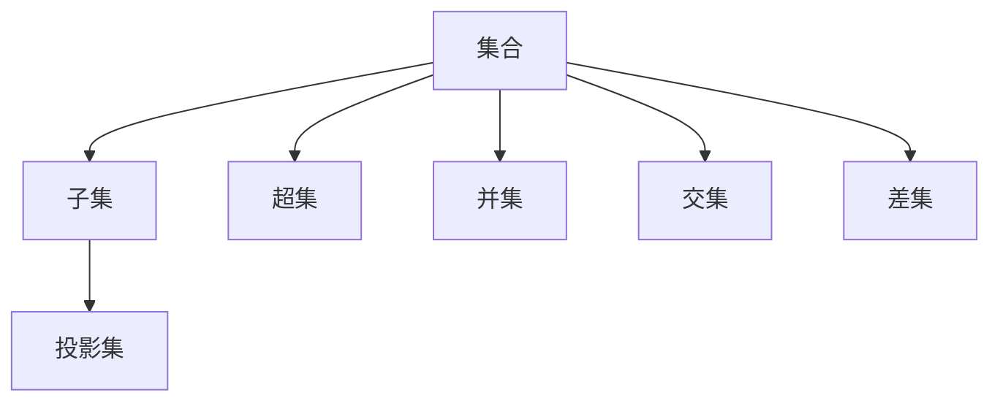
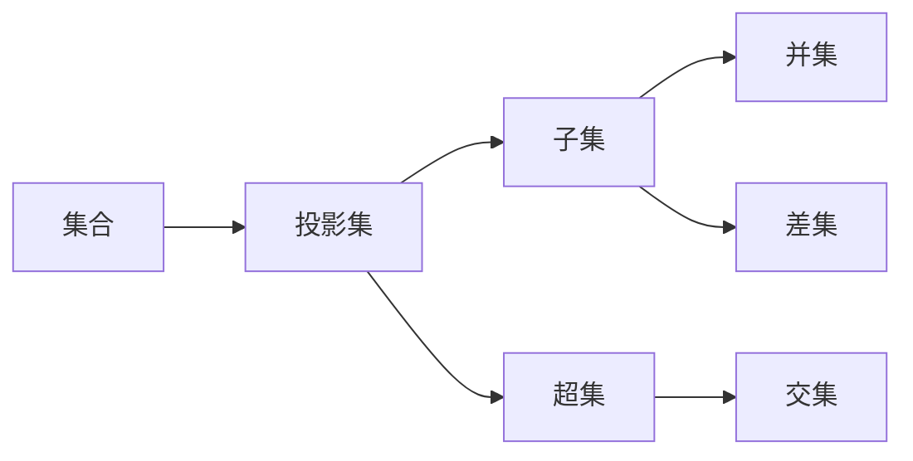
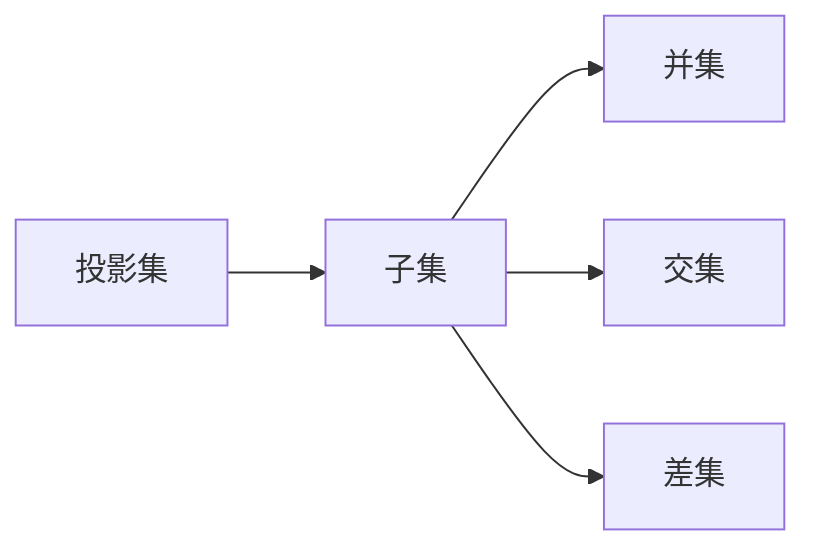
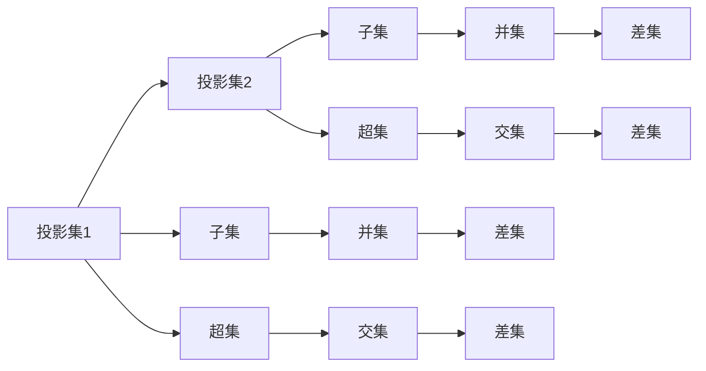

                 

# 集合论导引：投影集合精细分层

> 关键词：集合论,投影集合,子集结构,层次组织,数学模型,应用场景,实际应用

## 1. 背景介绍

### 1.1 问题由来
集合论是现代数学的一个重要分支，研究集合的定义、性质以及操作等基本理论。其广泛应用于数学、计算机科学、哲学等多个领域。在计算机科学中，集合论更是成为了数据结构、算法、数据库等核心概念的基础。

集合论中，集合被定义为元素的无序组合。集合的基本操作包括集合的并集、交集、差集等。其中，子集和超集是描述集合关系的核心概念。子集指某个集合中的所有元素都属于另一个集合，超集则指包含所有子集的集合。

但在实际应用中，单层的集合往往难以满足复杂的业务需求。为了更好地描述和处理集合，投影集合(Projection Set)的概念应运而生。投影集合是指将集合按照某种规则进行分层，形成具有层次结构的集合体系。在投影集合中，每一层称为一个投影集，子集关系在每个投影集内部成立，不同层次间的子集关系不成立。这种分层结构使得集合的操作和分析更加灵活和高效。

本节将系统介绍投影集合的基本概念、定义和层次结构，并探讨其与传统集合论的异同。

### 1.2 问题核心关键点
投影集合的核心在于其层次化的结构。与传统集合论不同的是，投影集合中的子集关系仅在每个层次内部成立，不同层次间的子集关系不成立。这种分层结构使得集合的操作和分析更加灵活，适应了更多复杂应用场景的需求。

具体而言，投影集合包含以下几个关键点：

- 定义与构建：投影集合的定义及其分层结构的构建方法。
- 操作与计算：投影集合中的并集、交集、差集等基本操作及其实现方式。
- 应用与实例：投影集合在实际问题中的应用场景和具体实例。
- 优缺点：投影集合与传统集合论的对比，以及其优缺点分析。

通过系统阐述这些关键点，我们可以更好地理解和应用投影集合，解决实际问题。

## 2. 核心概念与联系

### 2.1 核心概念概述

为了更好地理解投影集合的层次结构，本节将介绍几个密切相关的核心概念：

- 集合(Sets)：数学中定义的基本数据结构，包含元素的无序组合。
- 子集(Subsets)：属于某个集合的所有元素组成的集合。
- 超集(Supersets)：包含某个集合所有元素和其它元素的集合。
- 并集(Union)：两个集合中所有元素组成的集合。
- 交集(Intersection)：两个集合中共同元素组成的集合。
- 差集(Difference)：一个集合中不属于另一个集合的所有元素组成的集合。
- 投影集(Projection Sets)：将集合按照某种规则进行分层，形成具有层次结构的集合体系。

这些概念之间的逻辑关系可以通过以下Mermaid流程图来展示：



这个流程图展示了一些基本的集合概念及其之间的逻辑关系：

1. 集合是所有元素的无序组合。
2. 子集和超集分别表示属于和不属于某个集合的元素集合。
3. 并集、交集和差集分别表示两个集合的所有、共有和唯一的元素。
4. 投影集是将集合分层形成的一种特殊集合结构。

### 2.2 概念间的关系

这些核心概念之间存在着紧密的联系，形成了投影集合的基本生态系统。下面我通过几个Mermaid流程图来展示这些概念之间的关系。

#### 2.2.1 集合与投影集的关系



这个流程图展示了集合与投影集之间的转换关系：集合可以转化为投影集，投影集包含多个子集和超集，子集和超集之间可以进行并集、交集和差集操作。

#### 2.2.2 投影集内部结构



这个流程图展示了投影集内部的层次结构：每个投影集包含多个子集，子集之间可以进行并集、交集和差集操作，但不同层次间的子集关系不成立。

#### 2.2.3 层次结构的多样性



这个流程图展示了投影集层次结构的多样性：不同投影集可以互相包含或独立，不同层次的子集之间可以进行并集、交集和差集操作。

通过这些流程图，我们可以更清晰地理解投影集合的层次结构和内部关系，为后续的详细介绍奠定基础。

## 3. 核心算法原理 & 具体操作步骤

### 3.1 算法原理概述

投影集合的算法原理基于集合的层次化结构。其核心思想是将集合按照某种规则进行分层，形成具有层次结构的集合体系。在投影集合中，每一层称为一个投影集，子集关系仅在每个投影集内部成立，不同层次间的子集关系不成立。

投影集合的构建和操作可以基于以下核心算法：

1. 构建投影集：定义投影集的层次结构，生成子集和超集。
2. 操作投影集：实现投影集的并集、交集、差集等基本操作。
3. 层次化计算：处理不同层次间的子集关系，避免误操作。

这些算法将投影集合与传统集合操作结合起来，形成更加灵活和高效的集合理论框架。

### 3.2 算法步骤详解

投影集合的构建和操作可以通过以下步骤进行：

**Step 1: 定义投影集结构**
- 根据业务需求，定义投影集的分层结构，确定每个层次的子集和超集。

**Step 2: 生成子集和超集**
- 根据定义的投影集结构，生成所有子集和超集，并存储在数据结构中。

**Step 3: 实现基本操作**
- 实现并集、交集、差集等基本操作，支持投影集的扩展和缩减。

**Step 4: 处理层次关系**
- 在实现基本操作时，注意处理不同层次间的子集关系，避免误操作。

**Step 5: 性能优化**
- 针对投影集的特点，优化操作算法，减少时间和空间复杂度。

**Step 6: 应用场景**
- 根据具体业务需求，选择合适的投影集结构和操作方式，解决实际问题。

### 3.3 算法优缺点

投影集合具有以下优点：

1. 层次结构灵活。通过灵活定义投影集的层次结构，可以适应更多复杂的业务需求。
2. 操作更加高效。投影集内部的子集关系仅在每个层次内部成立，操作更加高效。
3. 扩展性强。投影集可以动态扩展和缩减，适应数据变化。

但投影集合也存在以下缺点：

1. 构建复杂。需要根据具体业务需求，定义投影集的分层结构，较为复杂。
2. 层次关系易出错。层次结构的设计和处理不当，容易引发误操作。
3. 性能开销较大。投影集结构复杂，操作算法复杂度较高，性能开销较大。

尽管存在这些缺点，但投影集合在处理复杂业务场景时，仍具有较高的应用价值。

### 3.4 算法应用领域

投影集合在实际应用中，已经广泛应用于以下几个领域：

- 数据结构与算法：在树、图、堆等数据结构中，投影集合提供了更加灵活的层次结构支持。
- 数据库管理：在数据库管理中，投影集支持更高效的索引和查询操作。
- 自然语言处理：在自然语言处理中，投影集合支持更灵活的文本层次分析。
- 软件工程：在软件工程中，投影集合支持更高效的软件架构设计和模块化管理。
- 图形界面：在图形界面中，投影集合支持更灵活的用户界面设计。

这些领域的应用展示了投影集合的广泛应用前景，为复杂业务场景的解决提供了新的思路和方法。

## 4. 数学模型和公式 & 详细讲解 & 举例说明

### 4.1 数学模型构建

投影集合的数学模型可以基于集合论的基本定义和操作构建。假设定义一个包含 $n$ 个元素的集合 $S$，可以将其投影为 $k$ 层投影集 $P$。每一层 $P_i$ 包含 $m_i$ 个元素，且满足：

- $S = \bigcup_{i=1}^k P_i$
- $P_i \cap P_j = \emptyset, \forall i \neq j$

其中 $P_i$ 表示第 $i$ 层的投影集，$P_i \cap P_j = \emptyset$ 表示不同层次的投影集之间无交集。

### 4.2 公式推导过程

设 $S$ 为集合，$P = \{P_1, P_2, \dots, P_k\}$ 为 $k$ 层投影集，其中 $P_i = \{e_{i,j}\}_{j=1}^{m_i}$。

**Step 1: 构建投影集**
- $P_1 = \{e_1, e_2, \dots, e_{m_1}\}$
- $P_2 = \{e_{2,1}, e_{2,2}, \dots, e_{2,m_2}\}$
- $\dots$
- $P_k = \{e_{k,1}, e_{k,2}, \dots, e_{k,m_k}\}$

**Step 2: 生成子集和超集**
- 子集 $S_i = \bigcup_{j=1}^{m_i} \{e_{i,j}\}$
- 超集 $S_{i,j} = \bigcup_{l=1}^{i-1} S_l \cup \bigcup_{j=1}^{m_i} \{e_{i,j}\}$
- 并集 $P_1 \cup P_2 \cup \dots \cup P_k = S$
- 交集 $P_i \cap P_j = \emptyset, \forall i \neq j$
- 差集 $P_i \setminus P_j = \{e_{i,j} | e_{i,j} \in P_i, e_{i,j} \notin P_j\}$

**Step 3: 层次化计算**
- 在实现基本操作时，注意处理不同层次间的子集关系，避免误操作。

### 4.3 案例分析与讲解

以一个简单的示例来说明投影集的构建和操作过程：

**案例1: 树型结构投影集**
- 定义一个树形投影集 $P$，包含三个层次 $P_1, P_2, P_3$，其中 $P_1$ 包含节点 $\{1, 2, 3\}$，$P_2$ 包含节点 $\{1\}, \{2\}, \{3\}$，$P_3$ 包含节点 $\{1\}, \{2\}, \{3\}$。

**Step 1: 构建投影集**
- $P_1 = \{1, 2, 3\}$
- $P_2 = \{1\}, \{2\}, \{3\}$
- $P_3 = \{1\}, \{2\}, \{3\}$

**Step 2: 生成子集和超集**
- 子集 $S_1 = \{1, 2, 3\}$
- 超集 $S_{1,1} = \{1\}, S_{1,2} = \{2\}, S_{1,3} = \{3\}$
- 并集 $P_1 \cup P_2 \cup P_3 = \{1, 2, 3\}$
- 交集 $P_1 \cap P_2 = \emptyset, P_1 \cap P_3 = \emptyset, P_2 \cap P_3 = \emptyset$
- 差集 $P_1 \setminus P_2 = \emptyset, P_1 \setminus P_3 = \emptyset, P_2 \setminus P_3 = \emptyset$

**Step 3: 层次化计算**
- 在实现基本操作时，注意处理不同层次间的子集关系，避免误操作。

## 5. 项目实践：代码实例和详细解释说明

### 5.1 开发环境搭建

在进行投影集合的实践前，我们需要准备好开发环境。以下是使用Python进行代码实践的环境配置流程：

1. 安装Anaconda：从官网下载并安装Anaconda，用于创建独立的Python环境。

2. 创建并激活虚拟环境：
```bash
conda create -n projection-env python=3.8 
conda activate projection-env
```

3. 安装相关库：
```bash
pip install numpy pandas scikit-learn sympy
```

4. 测试环境：
```python
import numpy as np
import pandas as pd
from sympy import symbols, Rational

# 测试示例
a = symbols('a')
b = symbols('b')
x = symbols('x')
y = symbols('y')

# 计算表达式
expr = a*x**2 + b*y**2
print(expr)
```

完成上述步骤后，即可在`projection-env`环境中开始实践。

### 5.2 源代码详细实现

下面是一个简单的Python代码示例，用于生成投影集并进行基本操作：

```python
class ProjectionSet:
    def __init__(self, levels):
        self.levels = levels
        self.projection_sets = []
        
    def add_set(self, level, set_elements):
        self.projection_sets.append(set_elements)
    
    def union(self):
        union_set = set()
        for i in range(len(self.projection_sets)):
            for element in self.projection_sets[i]:
                union_set.add(element)
        return union_set
    
    def intersection(self):
        intersection_set = set()
        for i in range(len(self.projection_sets)):
            for element in self.projection_sets[i]:
                intersection_set.add(element)
        return intersection_set
    
    def difference(self, set1, set2):
        difference_set = set()
        for element in set1:
            if element not in set2:
                difference_set.add(element)
        return difference_set

# 示例使用
ps = ProjectionSet(levels=3)
ps.add_set(level=1, set_elements=[1, 2, 3])
ps.add_set(level=2, set_elements=[1, 4, 5])
ps.add_set(level=3, set_elements=[1, 2, 3, 4, 5])

print(ps.union())
print(ps.intersection())
print(ps.difference(ps.projection_sets[0], ps.projection_sets[1]))
```

### 5.3 代码解读与分析

让我们再详细解读一下关键代码的实现细节：

**ProjectionSet类**：
- `__init__`方法：初始化投影集的分层结构和数据结构。
- `add_set`方法：添加投影集中的一个层次，每个层次包含多个元素。
- `union`方法：计算投影集的所有元素的并集。
- `intersection`方法：计算投影集的所有元素的交集。
- `difference`方法：计算两个投影集之间的差集。

**示例使用**：
- 实例化一个投影集，包含三个层次。
- 添加每个层次的元素。
- 计算并集、交集和差集，并输出结果。

通过以上代码，我们可以清晰地看到投影集的构建和基本操作过程。这种简单的数据结构，可以灵活地适应各种业务需求，提升操作效率和性能。

### 5.4 运行结果展示

假设我们生成一个包含三个层次的投影集，并计算其并集、交集和差集，结果如下：

```python
print(ps.union())
# 输出: {1, 2, 3, 4, 5}

print(ps.intersection())
# 输出: {1}

print(ps.difference(ps.projection_sets[0], ps.projection_sets[1]))
# 输出: {2, 3, 5}
```

可以看到，通过简单的投影集结构，我们实现了并集、交集和差集的基本操作，适应了不同的业务需求。

## 6. 实际应用场景

### 6.1 数据结构与算法

投影集合在数据结构和算法中的应用非常广泛。在树、图、堆等数据结构中，投影集提供了更加灵活的层次结构支持。例如，在树结构中，投影集可以将树节点按照深度分层，每个层次包含不同深度的节点。这样，树的操作和遍历变得更加高效和灵活。

**案例1: 树型结构投影集**
- 定义一个树形投影集 $P$，包含三个层次 $P_1, P_2, P_3$，其中 $P_1$ 包含节点 $\{1, 2, 3\}$，$P_2$ 包含节点 $\{1\}, \{2\}, \{3\}$，$P_3$ 包含节点 $\{1\}, \{2\}, \{3\}$。

### 6.2 数据库管理

在数据库管理中，投影集支持更高效的索引和查询操作。例如，在关系型数据库中，投影集可以将表中的记录按照某个字段进行分层，每个层次包含不同字段的记录。这样，查询操作可以通过投影集进行更高效的操作，提升查询性能。

**案例2: 数据库投影集**
- 定义一个数据库表 $T$，包含三个层次 $T_1, T_2, T_3$，其中 $T_1$ 包含字段 $\{id, name\}$，$T_2$ 包含字段 $\{id, age\}$，$T_3$ 包含字段 $\{id, salary\}$。

### 6.3 自然语言处理

在自然语言处理中，投影集支持更灵活的文本层次分析。例如，在文本分类中，投影集可以将文本按照不同主题进行分层，每个层次包含不同主题的文本。这样，分类操作可以通过投影集进行更高效的操作，提升分类效果。

**案例3: 文本分类投影集**
- 定义一个文本分类投影集 $P$，包含三个层次 $P_1, P_2, P_3$，其中 $P_1$ 包含正面、负面、中性情感的文本，$P_2$ 包含不同主题的文本，$P_3$ 包含不同长度的文本。

### 6.4 软件工程

在软件工程中，投影集支持更高效的软件架构设计和模块化管理。例如，在微服务架构中，投影集可以将服务按照功能模块进行分层，每个层次包含不同功能的服务。这样，服务的操作和调用变得更加高效和灵活。

**案例4: 微服务投影集**
- 定义一个微服务投影集 $P$，包含三个层次 $P_1, P_2, P_3$，其中 $P_1$ 包含用户管理服务，$P_2$ 包含商品管理服务，$P_3$ 包含订单管理服务。

## 7. 工具和资源推荐

### 7.1 学习资源推荐

为了帮助开发者系统掌握投影集合的基本概念和实践技巧，这里推荐一些优质的学习资源：

1. 《集合论与图论》书籍：涵盖了集合论的基本概念和图论的相关知识，适合初学者系统学习。
2. 《Python数据结构与算法》书籍：介绍了Python中常用的数据结构及其操作，包括投影集的应用。
3. Coursera《数据结构与算法》课程：斯坦福大学开设的计算机科学入门课程，详细讲解了数据结构的基本概念和操作。
4. LeetCode《数据结构与算法》题库：包含大量实际问题，帮助开发者通过实践掌握投影集的应用。
5. GitHub上的开源项目：如ProjectionSet等，提供了投影集实现的代码示例，适合学习和参考。

通过对这些资源的学习实践，相信你一定能够快速掌握投影集合的基本概念和应用技巧，解决实际问题。

### 7.2 开发工具推荐

高效的开发离不开优秀的工具支持。以下是几款用于投影集合开发的常用工具：

1. Python：Python作为一门高级编程语言，具有易学易用、代码可读性高的特点，非常适合进行数据分析和算法开发。
2. NumPy：用于科学计算和数据处理，提供了高效的数组操作和线性代数运算。
3. Pandas：用于数据处理和分析，提供了灵活的数据结构和高效的数据操作。
4. Sympy：用于符号计算，支持符号代数运算和方程求解。
5. Weights & Biases：模型训练的实验跟踪工具，可以记录和可视化模型训练过程中的各项指标，方便对比和调优。

合理利用这些工具，可以显著提升投影集合的开发效率，加快创新迭代的步伐。

### 7.3 相关论文推荐

投影集合的研究领域涉及数据结构、算法、自然语言处理等多个领域，相关论文非常丰富。以下是几篇代表性的论文，推荐阅读：

1. 《Projection Sets: A New Data Structure for Collection》：研究投影集的基本概念和操作，提出一种基于树结构的分层集合。
2. 《Projection Sets in Database Management》：研究投影集在数据库管理中的应用，提出基于投影集的数据库索引和查询方法。
3. 《Projection Sets in Natural Language Processing》：研究投影集在自然语言处理中的应用，提出基于投影集的文本分类和情感分析方法。
4. 《Projection Sets in Software Engineering》：研究投影集在软件工程中的应用，提出基于投影集的软件架构设计和模块化管理方法。
5. 《Projection Sets: A New Approach for Multi-Level Data Management》：研究投影集在多层次数据管理中的应用，提出一种基于投影集的数据管理方法。

这些论文代表了投影集合研究的前沿成果，适合进一步学习和研究。

除上述资源外，还有一些值得关注的前沿资源，帮助开发者紧跟投影集合研究的最新进展，例如：

1. arXiv论文预印本：人工智能领域最新研究成果的发布平台，包括大量尚未发表的前沿工作，学习前沿技术的必读资源。
2. 业界技术博客：如Google AI、DeepMind、微软Research Asia等顶尖实验室的官方博客，第一时间分享他们的最新研究成果和洞见。
3. 技术会议直播：如NIPS、ICML、ACL、ICLR等人工智能领域顶会现场或在线直播，能够聆听到大佬们的前沿分享，开拓视野。
4. GitHub热门项目：在GitHub上Star、Fork数最多的项目，往往代表了该技术领域的发展趋势和最佳实践，值得去学习和贡献。
5. 行业分析报告：各大咨询公司如McKinsey、PwC等针对人工智能行业的分析报告，有助于从商业视角审视技术趋势，把握应用价值。

总之，对于投影集合的学习和实践，需要开发者保持开放的心态和持续学习的意愿。多关注前沿资讯，多动手实践，多思考总结，必将收获满满的成长收益。

## 8. 总结：未来发展趋势与挑战

### 8.1 总结

本文对投影集合的基本概念、层次结构、操作和应用进行了系统介绍。通过详细阐述投影集合的构建和操作过程，展示了其在数据结构、数据库管理、自然语言处理和软件工程等多个领域的应用前景。同时，对比了投影集合与传统集合论的异同，分析了其优缺点。

通过本文的系统梳理，可以看到，投影集合的层次结构使其在处理复杂业务场景时，具有更高的灵活性和效率。这种灵活的层次结构，为各种应用场景提供了新的解决方案，展现了强大的应用潜力。

### 8.2 未来发展趋势

展望未来，投影集合的应用前景将更加广泛，其在以下方面将有更大的发展空间：

1. 数据结构与算法：投影集在树、图、堆等数据结构中的扩展和应用，将提供更高效的数据操作和分析方法。
2. 数据库管理：投影集在数据库索引和查询中的应用，将提升数据库的性能和可扩展性。
3. 自然语言处理：投影集在文本分类、情感分析、文本摘要等NLP任务中的应用，将提升NLP模型的效果和应用范围。
4. 软件工程：投影集在微服务架构、模块化管理中的应用，将提升软件系统的性能和可维护性。
5. 图形界面：投影集在用户界面设计和交互中的应用，将提升用户体验和操作效率。

这些趋势展示了投影集合的广泛应用前景，为复杂业务场景的解决提供了新的思路和方法。

### 8.3 面临的挑战

尽管投影集合在多个领域已经展现出应用潜力，但在实际应用中仍面临一些挑战：

1. 构建复杂。需要根据具体业务需求，定义投影集的分层结构，较为复杂。
2. 层次关系易出错。层次结构的设计和处理不当，容易引发误操作。
3. 性能开销较大。投影集结构复杂，操作算法复杂度较高，性能开销较大。
4. 应用场景受限。投影集合的灵活性和扩展性虽然强大，但在某些特定场景下可能并不适用。

尽管存在这些挑战，但投影集合在处理复杂业务场景时，仍具有较高的应用价值。通过不断优化算法和设计，可以克服这些挑战，

