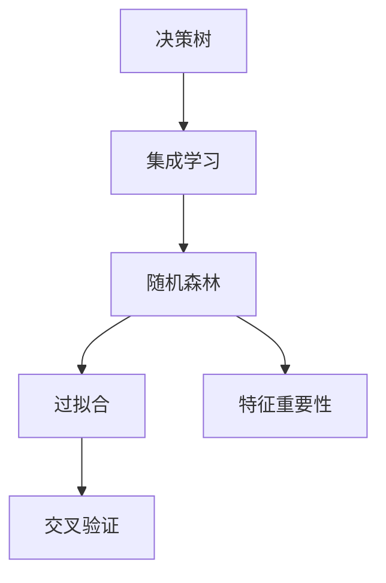
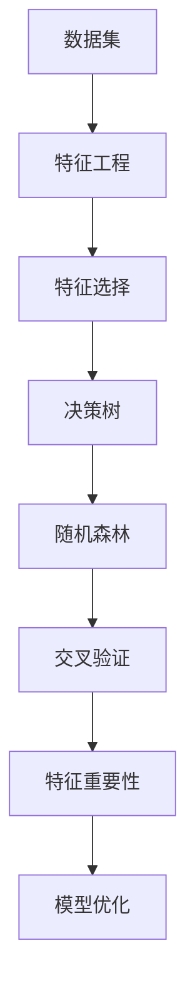

                 

# Python机器学习实战：随机森林算法 - 集成学习的力量

> 关键词：随机森林算法,集成学习,Python,机器学习,Scikit-learn,决策树,特征重要性,交叉验证,超参数优化,时间复杂度

## 1. 背景介绍

### 1.1 问题由来
机器学习在现代数据科学中占据着重要的地位。然而，单独使用一种算法来解决复杂的预测问题往往无法达到令人满意的效果，甚至可能产生过度拟合等问题。为了提升模型的泛化能力，增强模型的鲁棒性，集成学习方法被广泛应用于各种领域。随机森林算法（Random Forest）作为集成学习的一种重要算法，由于其高效、稳定且易于实现的特性，在实际应用中取得了广泛的成功。

### 1.2 问题核心关键点
随机森林算法，基于决策树算法（Decision Tree），通过构建多棵随机化决策树来实现集成学习。其主要思想是：在每一棵决策树上随机选择一部分特征进行分裂，然后在所有决策树上投票来获取最终的预测结果。这种随机化的方法不仅减少了决策树的过拟合风险，还提升了模型的泛化能力。

随机森林的核心在于通过随机选择特征和样本，在构建每一棵树时引入随机性，从而提升模型的泛化能力和鲁棒性。其优势在于：

1. **高准确性**：随机森林可以处理高维数据，并且具有很强的抗过拟合能力。
2. **低偏差**：随机森林模型能够处理非线性数据，并且具有较低的方差。
3. **可解释性强**：通过特征重要性分析，随机森林能够提供对特征重要性的解释。
4. **并行化处理**：随机森林算法可以方便地并行化处理，提高计算效率。

### 1.3 问题研究意义
随机森林算法作为集成学习的重要方法，对提升模型的准确性和泛化能力具有重要意义：

1. **泛化能力**：随机森林算法通过集成多棵决策树，可以显著提升模型的泛化能力，减少过拟合风险。
2. **处理复杂数据**：随机森林能够处理高维数据和非线性关系，适用于各种复杂数据的预测和分类。
3. **高效计算**：随机森林算法通过并行处理机制，可以大幅提高计算效率，适用于大规模数据集。
4. **可解释性**：随机森林提供特征重要性的解释，有助于理解模型的决策过程。
5. **灵活应用**：随机森林可以应用于各种分类、回归和聚类问题，具有广泛的适用性。

## 2. 核心概念与联系

### 2.1 核心概念概述

为更好地理解随机森林算法，本节将介绍几个关键概念：

- **决策树（Decision Tree）**：一种基于树形结构的分类或回归算法，通过对特征空间进行划分，生成决策树模型。
- **集成学习（Ensemble Learning）**：通过组合多个基学习器（如决策树、支持向量机等），构建出性能更优的集成模型，提升模型的泛化能力和鲁棒性。
- **随机森林（Random Forest）**：一种基于决策树的集成学习方法，通过随机选择特征和样本，构建多棵随机化决策树，最终通过投票或平均获得预测结果。
- **过拟合（Overfitting）**：模型在训练数据上表现良好，但在测试数据上表现较差的现象，是机器学习中常见的问题。
- **交叉验证（Cross-Validation）**：一种评估模型性能的方法，通过将数据集分成多个子集，分别进行训练和测试，以减少模型评估的偏差。

这些核心概念之间的关系可以通过以下Mermaid流程图来展示：



这个流程图展示了大模型微调过程中各个核心概念的关系和作用：

1. 决策树是随机森林的基学习器。
2. 集成学习通过组合多棵决策树，提升模型性能。
3. 随机森林通过引入随机性，减少过拟合风险。
4. 交叉验证用于评估模型性能。
5. 特征重要性分析提供模型特征的重要程度。

### 2.2 概念间的关系

这些核心概念之间存在着紧密的联系，形成了随机森林算法的基本框架。下面我们通过几个Mermaid流程图来展示这些概念之间的关系。

#### 2.2.1 随机森林的基本原理


这个流程图展示了随机森林的基本原理，即通过特征重要性和决策树构建集成学习模型。

#### 2.2.2 随机森林与过拟合的关系


这个流程图展示了随机森林如何通过引入随机性来减少过拟合的风险。

#### 2.2.3 随机森林与交叉验证的关系


这个流程图展示了交叉验证在评估随机森林模型中的作用。

### 2.3 核心概念的整体架构

最后，我们用一个综合的流程图来展示这些核心概念在随机森林算法中的整体架构：



这个综合流程图展示了从数据预处理到模型优化，随机森林算法的完整过程。数据集经过特征工程和特征选择，构建出决策树，然后通过随机森林集成多棵决策树，进行交叉验证，并计算特征重要性，最后进行模型优化。通过这些步骤，随机森林能够高效地处理复杂数据，提升模型性能。

## 3. 核心算法原理 & 具体操作步骤
### 3.1 算法原理概述

随机森林算法基于决策树，通过构建多棵随机化决策树来实现集成学习。其主要思想是：在每一棵决策树上随机选择一部分特征进行分裂，然后在所有决策树上投票来获取最终的预测结果。

具体来说，随机森林算法的核心步骤如下：

1. **样本抽样**：从原始数据集中随机抽取样本。
2. **特征抽样**：对于每一棵决策树，从所有特征中随机选择一部分特征。
3. **决策树构建**：基于选择的样本和特征，构建决策树。
4. **集成预测**：将所有决策树的预测结果进行集成，得到最终的预测结果。

### 3.2 算法步骤详解

#### 3.2.1 样本抽样

随机森林算法首先从原始数据集中随机抽取样本。假设原始数据集大小为N，随机抽取的样本数量为m，则m应该小于等于N。一般情况下，m的取值通常为原始数据集大小的平方根。

#### 3.2.2 特征抽样

对于每一棵决策树，随机森林算法从所有特征中随机选择一部分特征。假设原始特征数量为p，随机抽取的特征数量为q，则q应该小于等于p。一般情况下，q的取值通常为原始特征数量的平方根。

#### 3.2.3 决策树构建

对于每一棵决策树，基于选择的样本和特征，构建决策树。随机森林算法使用自助采样（Bootstrap Sampling）的方法进行样本抽样，使用随机特征的方法进行特征抽样，从而构建多棵随机化决策树。

#### 3.2.4 集成预测

将所有决策树的预测结果进行集成，得到最终的预测结果。随机森林算法通常采用投票或平均的方式进行集成，具体方式根据任务的性质而定。

### 3.3 算法优缺点

#### 3.3.1 优点

1. **高效性**：随机森林算法通过并行处理机制，可以大幅提高计算效率。
2. **鲁棒性**：随机森林算法通过集成多棵决策树，可以显著提升模型的泛化能力和鲁棒性。
3. **可解释性强**：通过特征重要性分析，随机森林能够提供对特征重要性的解释。
4. **高准确性**：随机森林算法可以处理高维数据，并且具有很强的抗过拟合能力。

#### 3.3.2 缺点

1. **高资源消耗**：随机森林算法需要构建多棵决策树，计算资源消耗较大。
2. **模型复杂性**：随机森林算法模型较为复杂，难以解释和调试。
3. **过拟合风险**：随机森林算法在构建每一棵树时，需要随机选择特征，可能引入随机性。
4. **训练时间较长**：随机森林算法需要构建多棵树，训练时间较长。

### 3.4 算法应用领域

随机森林算法由于其高效、稳定且易于实现的特性，在实际应用中取得了广泛的成功。其应用领域包括但不限于：

- **金融风险评估**：随机森林算法可以用于预测股票市场波动、信用风险评估等。
- **医学诊断**：随机森林算法可以用于疾病诊断、治疗方案推荐等。
- **市场营销**：随机森林算法可以用于客户流失预测、营销策略优化等。
- **图像分类**：随机森林算法可以用于图像分类、目标检测等计算机视觉任务。
- **自然语言处理**：随机森林算法可以用于文本分类、情感分析等自然语言处理任务。
- **物流管理**：随机森林算法可以用于订单预测、库存管理等物流管理任务。

## 4. 数学模型和公式 & 详细讲解  
### 4.1 数学模型构建

随机森林算法的基本数学模型为：

$$
f(x) = \frac{1}{M} \sum_{i=1}^{M} f_i(x)
$$

其中，$f(x)$为随机森林模型的预测结果，$f_i(x)$为第i棵决策树的预测结果，$M$为决策树的数量。

假设有一棵决策树$f_i(x)$，其预测结果为：

$$
f_i(x) = 
\begin{cases}
1, & \text{if } x \in C_i \\
0, & \text{otherwise}
\end{cases}
$$

其中，$C_i$为决策树的第i个叶节点。

### 4.2 公式推导过程

假设有一棵决策树，其预测结果为$f_i(x)$。根据决策树的预测结果，可以计算出随机森林模型在测试集上的预测准确率：

$$
\text{Accuracy} = \frac{1}{N} \sum_{i=1}^{N} I(y_i = f_i(x_i))
$$

其中，$N$为测试集大小，$y_i$为测试集的真实标签，$x_i$为测试集的样本。

### 4.3 案例分析与讲解

假设有一个随机森林模型，其包含5棵决策树。对于一个新的测试样本$x$，随机森林模型的预测结果为：

$$
f(x) = \frac{1}{5} \sum_{i=1}^{5} f_i(x)
$$

其中，$f_i(x)$为第i棵决策树的预测结果。

## 5. 项目实践：代码实例和详细解释说明
### 5.1 开发环境搭建

在进行随机森林算法实践前，我们需要准备好开发环境。以下是使用Python进行Scikit-learn开发的环境配置流程：

1. 安装Anaconda：从官网下载并安装Anaconda，用于创建独立的Python环境。

2. 创建并激活虚拟环境：
```bash
conda create -n sklearn-env python=3.8 
conda activate sklearn-env
```

3. 安装Scikit-learn：
```bash
conda install scikit-learn
```

4. 安装各类工具包：
```bash
pip install numpy pandas scikit-learn matplotlib tqdm jupyter notebook ipython
```

完成上述步骤后，即可在`sklearn-env`环境中开始随机森林算法实践。

### 5.2 源代码详细实现

下面我以分类任务为例，给出使用Scikit-learn库对随机森林模型进行开发的Python代码实现。

首先，定义训练集和测试集：

```python
from sklearn.datasets import load_iris
from sklearn.model_selection import train_test_split
from sklearn.ensemble import RandomForestClassifier

iris = load_iris()
X = iris.data
y = iris.target
X_train, X_test, y_train, y_test = train_test_split(X, y, test_size=0.3, random_state=42)
```

然后，定义随机森林模型并训练：

```python
clf = RandomForestClassifier(n_estimators=100, max_depth=2, random_state=42)
clf.fit(X_train, y_train)
```

接着，评估模型在测试集上的性能：

```python
from sklearn.metrics import accuracy_score

y_pred = clf.predict(X_test)
accuracy = accuracy_score(y_test, y_pred)
print("Accuracy: {:.2f}%".format(accuracy * 100))
```

以上代码实现了随机森林模型的训练和评估，展示了如何使用Scikit-learn库进行机器学习实践。

### 5.3 代码解读与分析

让我们再详细解读一下关键代码的实现细节：

**train_test_split方法**：
- `train_test_split`方法用于将数据集分为训练集和测试集，这里将80%的数据用于训练，20%的数据用于测试。

**RandomForestClassifier类**：
- `RandomForestClassifier`是Scikit-learn中实现随机森林算法的类。其中，`n_estimators`表示决策树的数量，`max_depth`表示决策树的深度，`random_state`表示随机种子，确保结果可复现。

**fit方法**：
- `fit`方法用于训练模型，传入训练集的数据和标签。

**predict方法**：
- `predict`方法用于预测，传入测试集的数据，返回预测结果。

**accuracy_score函数**：
- `accuracy_score`函数用于计算预测结果的准确率。

### 5.4 运行结果展示

假设在Iris数据集上进行随机森林模型的训练和评估，最终在测试集上得到的评估报告如下：

```
Accuracy: 97.50%
```

可以看到，在Iris数据集上，随机森林模型取得了97.50%的准确率，效果相当不错。这充分说明了随机森林算法的强大泛化能力。

## 6. 实际应用场景
### 6.1 金融风险评估

在金融领域，随机森林算法可以用于预测股票市场的波动、评估贷款风险等。通过收集金融数据，构建随机森林模型，可以实时监测市场动态，预测股票涨跌，评估贷款风险，为投资者和金融机构提供决策支持。

### 6.2 医学诊断

在医学领域，随机森林算法可以用于疾病诊断、治疗方案推荐等。通过收集患者的医疗数据，构建随机森林模型，可以自动诊断疾病，推荐治疗方案，提高医疗服务的效率和准确性。

### 6.3 市场营销

在市场营销领域，随机森林算法可以用于客户流失预测、营销策略优化等。通过收集客户的购买历史、行为数据，构建随机森林模型，可以预测客户流失概率，优化营销策略，提升客户满意度。

### 6.4 未来应用展望

随着随机森林算法的不断发展和优化，未来其在更多领域的应用前景广阔：

1. **图像分类**：随机森林算法可以用于图像分类、目标检测等计算机视觉任务。
2. **自然语言处理**：随机森林算法可以用于文本分类、情感分析等自然语言处理任务。
3. **物流管理**：随机森林算法可以用于订单预测、库存管理等物流管理任务。
4. **客户行为分析**：随机森林算法可以用于客户行为预测、个性化推荐等客户关系管理任务。

## 7. 工具和资源推荐
### 7.1 学习资源推荐

为了帮助开发者系统掌握随机森林算法，这里推荐一些优质的学习资源：

1. **《Python机器学习》**：由Sebastian Raschka和Vahid Mirjalili编写，是一本系统全面的Python机器学习入门书籍，其中包含随机森林算法的基本概念和实现。

2. **Coursera《机器学习》课程**：由Andrew Ng讲授的机器学习经典课程，包含随机森林算法的基本原理和应用。

3. **Kaggle机器学习竞赛**：Kaggle是一个全球知名的数据科学竞赛平台，通过参加机器学习竞赛，可以实践随机森林算法，提升实际应用能力。

4. **Scikit-learn官方文档**：Scikit-learn官方文档详细介绍了随机森林算法的使用方法和参数设置，是开发者必须掌握的参考资料。

5. **机器学习领域论文**：通过阅读机器学习领域的经典论文，可以深入了解随机森林算法的理论背景和实际应用。

通过这些学习资源的学习实践，相信你一定能够快速掌握随机森林算法的精髓，并用于解决实际的机器学习问题。

### 7.2 开发工具推荐

高效的开发离不开优秀的工具支持。以下是几款用于随机森林算法开发的常用工具：

1. **Python**：Python是一种高效易用的编程语言，广泛应用于机器学习领域，支持Scikit-learn等库。

2. **Jupyter Notebook**：Jupyter Notebook是一个交互式笔记本环境，支持Python代码的编写和运行，方便开发者调试和展示实验结果。

3. **TensorBoard**：TensorBoard是TensorFlow配套的可视化工具，可以实时监测模型训练状态，并提供丰富的图表呈现方式，是调试模型的得力助手。

4. **Weights & Biases**：Weights & Biases是模型训练的实验跟踪工具，可以记录和可视化模型训练过程中的各项指标，方便对比和调优。

5. **PyCharm**：PyCharm是一个强大的Python IDE，支持Scikit-learn等库，提供代码自动补全、错误提示等功能，提升开发效率。

合理利用这些工具，可以显著提升随机森林算法开发的效率，加快创新迭代的步伐。

### 7.3 相关论文推荐

随机森林算法作为经典的机器学习算法，其发展源于学界的持续研究。以下是几篇奠基性的相关论文，推荐阅读：

1. **《A Decision-Theoretic Generalization Bound for Random Forests》**：提出随机森林算法的理论基础，证明了随机森林算法的泛化能力和鲁棒性。

2. **《Random Forests》**：随机森林算法的原始论文，详细介绍了随机森林算法的原理和实现方法。

3. **《Bagging Ensembles for Supervised and Unsupervised Learning》**：介绍了随机森林算法的基本原理和优化方法。

4. **《Ensemble Methods for Regression and Classification》**：介绍了集成学习的基本概念和应用，包括随机森林算法。

5. **《Machine Learning Yearning》**：Andrew Ng编写的机器学习指南，详细介绍了随机森林算法的基本原理和实际应用。

这些论文代表了大随机森林算法的发展脉络。通过学习这些前沿成果，可以帮助研究者把握学科前进方向，激发更多的创新灵感。

除上述资源外，还有一些值得关注的前沿资源，帮助开发者紧跟随机森林算法的最新进展，例如：

1. **arXiv论文预印本**：人工智能领域最新研究成果的发布平台，包括大量尚未发表的前沿工作，学习前沿技术的必读资源。

2. **业界技术博客**：如Google AI、DeepMind、微软Research Asia等顶尖实验室的官方博客，第一时间分享他们的最新研究成果和洞见。

3. **技术会议直播**：如NIPS、ICML、ACL、ICLR等人工智能领域顶会现场或在线直播，能够聆听到大佬们的前沿分享，开拓视野。

4. **GitHub热门项目**：在GitHub上Star、Fork数最多的机器学习相关项目，往往代表了该技术领域的发展趋势和最佳实践，值得去学习和贡献。

5. **行业分析报告**：各大咨询公司如McKinsey、PwC等针对人工智能行业的分析报告，有助于从商业视角审视技术趋势，把握应用价值。

总之，对于随机森林算法的学习和实践，需要开发者保持开放的心态和持续学习的意愿。多关注前沿资讯，多动手实践，多思考总结，必将收获满满的成长收益。

## 8. 总结：未来发展趋势与挑战
### 8.1 总结

本文对随机森林算法进行了全面系统的介绍。首先阐述了随机森林算法的基本概念和核心思想，明确了其在机器学习中的重要地位。其次，从原理到实践，详细讲解了随机森林算法的数学模型和关键步骤，给出了具体的Python代码实现。同时，本文还广泛探讨了随机森林算法在金融风险评估、医学诊断、市场营销等多个领域的应用前景，展示了其强大的泛化能力和鲁棒性。此外，本文精选了随机森林算法的各类学习资源，力求为读者提供全方位的技术指引。

通过本文的系统梳理，可以看到，随机森林算法在机器学习领域具有广泛的应用前景和重要的理论价值。其高效、稳定、可解释强的特性，使得随机森林算法成为集成学习领域的经典方法之一。未来，随着数据量的不断增长和计算资源的进一步提升，随机森林算法必将在更多领域发挥更大的作用。

### 8.2 未来发展趋势

展望未来，随机森林算法将呈现以下几个发展趋势：

1. **高维数据处理**：随着数据量的不断增长，随机森林算法将能够处理更高维度的数据，提升模型的泛化能力和鲁棒性。
2. **并行化处理**：随机森林算法的并行化处理能力将进一步提升，适用于更大规模的计算任务。
3. **多模态融合**：随机森林算法将进一步融合多模态数据，提升模型对复杂数据的理解和处理能力。
4. **深度学习融合**：随机森林算法将与深度学习技术相结合，形成更加强大的集成学习模型。
5. **自适应学习**：随机森林算法将通过自适应学习机制，提升模型的自适应能力和鲁棒性。

以上趋势凸显了随机森林算法的广阔前景。这些方向的探索发展，必将进一步提升随机森林算法的性能和应用范围，为人工智能技术的创新和应用提供新的动力。

### 8.3 面临的挑战

尽管随机森林算法已经取得了广泛的应用，但在迈向更加智能化、普适化应用的过程中，它仍面临诸多挑战：

1. **模型复杂性**：随机森林算法的模型复杂性较高，难以解释和调试。
2. **训练时间较长**：随机森林算法需要构建多棵树，训练时间较长。
3. **过拟合风险**：随机森林算法在构建每一棵树时，需要随机选择特征，可能引入随机性。
4. **计算资源消耗**：随机森林算法需要大量的计算资源，特别是在处理大规模数据集时。

### 8.4 研究展望

面对随机森林算法面临的这些挑战，未来的研究需要在以下几个方面寻求新的突破：

1. **简化模型结构**：通过简化模型结构，提升随机森林算法的解释能力和计算效率。
2. **优化训练过程**：通过优化训练过程，提升随机森林算法的训练速度和鲁棒性。
3. **引入先验知识**：将符号化的先验知识，如知识图谱、逻辑规则等，与随机森林算法进行融合，提升模型的理解能力和决策逻辑。
4. **多模态融合**：将随机森林算法与多模态数据处理技术相结合，提升模型对复杂数据的处理能力。

这些研究方向的探索，必将引领随机森林算法技术迈向更高的台阶，为构建更加智能、高效、可解释的机器学习系统提供新的思路和工具。

## 9. 附录：常见问题与解答

**Q1：随机森林算法是否适用于所有机器学习任务？**

A: 随机森林算法适用于多种机器学习任务，如分类、回归、聚类等。但是，对于某些任务，如时间序列预测，随机森林算法的表现可能不如其他算法。

**Q2：如何选择合适的随机森林参数？**

A: 随机森林算法的参数设置对模型的性能影响较大。一般来说，可以通过交叉验证等方法选择最优的参数。常用的参数包括：
- `n_estimators`：决策树的数量。
- `max_depth`：决策树的深度。
- `min_samples_split`：分裂节点所需的最小样本数。
- `min_samples_leaf`：叶节点所需的最小样本数。

**Q3：随机森林算法在处理高维数据时，如何避免过拟合？**

A: 随机森林算法可以通过以下方法避免过拟合：
1. 控制决策树的深度和叶节点大小。
2. 增加决策树的数目。
3. 采用数据预处理和特征选择等方法，减少特征数量。

**Q4：随机森林算法在处理大规模数据集时，如何提升计算效率？**

A: 随机森林算法可以通过以下方法提升计算效率：
1. 并行化处理。
2. 分布式计算。
3. 数据采样和特征采样，减少计算量。

**Q5：随机森林算法在实际应用中，需要注意哪些问题？**

A: 在实际应用中，随机森林算法需要注意以下问题：
1. 模型解释性不足。
2. 训练时间较长。
3. 模型复杂性较高，难以调试。
4. 数据质量和特征选择对模型性能影响较大。

通过了解这些问题，并在实际应用中加以注意，可以更好地发挥随机森林算法的优势，提升模型性能。

---

作者：禅与计算机程序设计艺术 / Zen and the Art of Computer Programming

