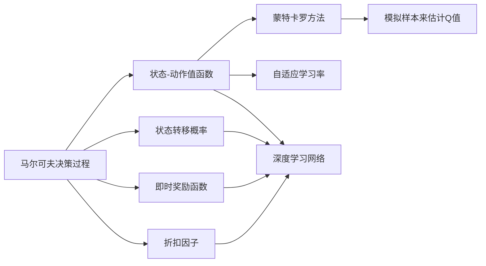
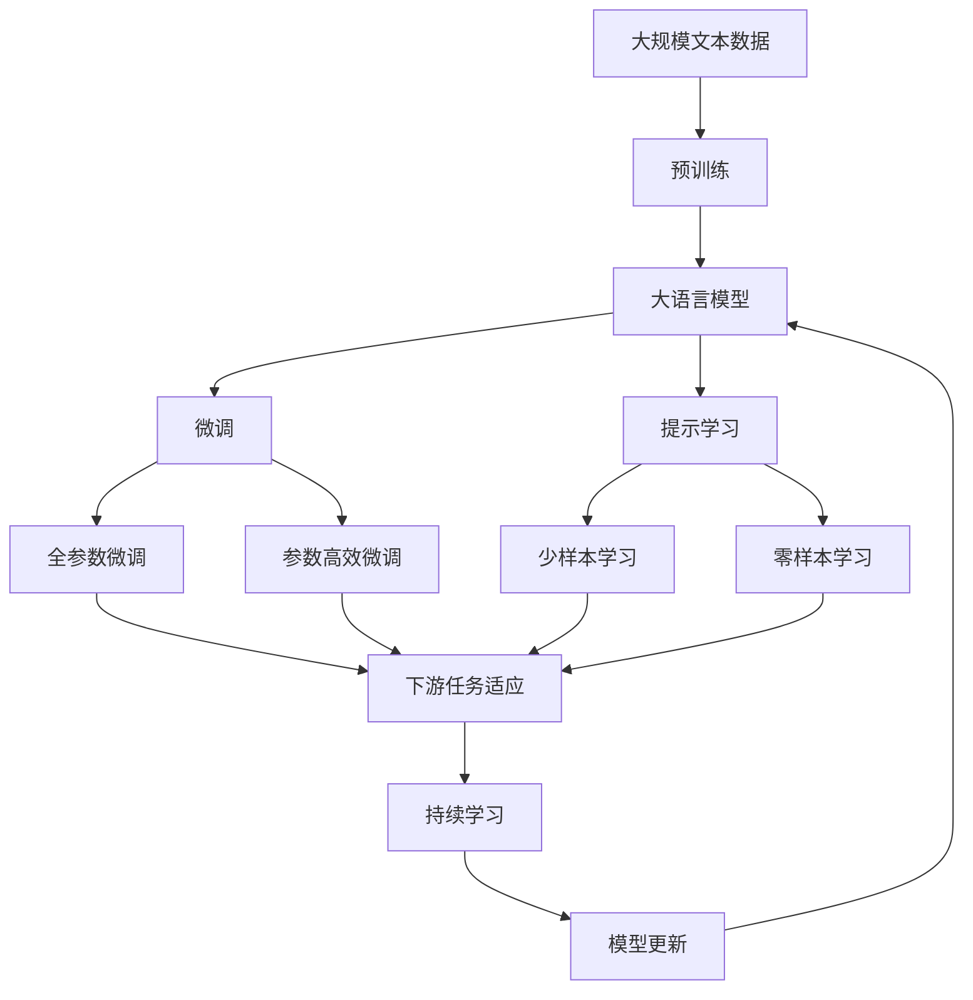

                 

# Q-Learning原理与代码实例讲解

> 关键词：Q-Learning,强化学习,马尔可夫决策过程,状态-动作值函数,蒙特卡罗方法,自适应学习率,深度学习

## 1. 背景介绍

### 1.1 问题由来
强化学习(Reinforcement Learning, RL)是一种智能体在动态环境中通过与环境交互，不断学习最优策略以最大化累积奖励的过程。其中，Q-Learning是强化学习中最经典的算法之一，通过计算状态-动作值函数来指导智能体的决策过程。

Q-Learning算法在解决游戏AI、机器人控制、路径规划等许多实际问题中表现优异，成为实现智能决策的核心技术。例如，在谷歌AlphaGo中，Q-Learning被用于构建策略网络，使得AI围棋手具备卓越的下棋能力。

### 1.2 问题核心关键点
Q-Learning算法通过利用状态-动作值函数来评估每个状态-动作对在接下来的一步中的平均奖励期望，从而指导智能体进行决策。核心思想是利用当前状态-动作对，以及下一个状态-动作对的奖励和状态值函数，计算出该状态-动作对的Q值，即：

$$
Q(s,a) = r + \gamma \max_{a'} Q(s',a')
$$

其中，$s$ 表示当前状态，$a$ 表示当前动作，$r$ 表示当前状态-动作对的即时奖励，$\gamma$ 表示折扣因子，$s'$ 和 $a'$ 分别表示下一个状态和动作。

Q-Learning的输入包括：
- 环境状态空间 $\mathcal{S}$：智能体可以观察到的所有可能状态。
- 动作空间 $\mathcal{A}$：智能体可以采取的所有动作。
- 状态转移概率 $P(s'|s,a)$：在给定当前状态和动作的情况下，下一个状态的概率分布。
- 即时奖励函数 $R(s,a)$：在给定当前状态和动作的情况下，即时奖励的计算方式。
- 折扣因子 $\gamma$：控制未来奖励的权重，通常取值在0到1之间。

Q-Learning的输出是状态-动作值函数 $Q(s,a)$，表示在给定当前状态和动作的情况下，接下来一步的平均奖励期望。

### 1.3 问题研究意义
研究Q-Learning算法，对于探索智能决策机制，推动人工智能技术的实际应用，具有重要意义：

1. 提高决策效率。Q-Learning能够高效地通过与环境的交互学习最优策略，从而在复杂环境中快速决策。
2. 增强泛化能力。通过学习状态-动作值函数，Q-Learning能够在新的环境中快速适应，提升模型的泛化性能。
3. 降低训练成本。Q-Learning无需大量的标注数据，只需通过与环境的交互不断调整策略，减少训练数据的需求。
4. 增强可解释性。状态-动作值函数直观地反映了智能体的决策过程，便于理解和调试。
5. 推动AI应用。Q-Learning作为AI决策的基础技术，在自动驾驶、机器人控制、游戏AI等领域有着广泛的应用前景。

## 2. 核心概念与联系

### 2.1 核心概念概述

为更好地理解Q-Learning算法，本节将介绍几个密切相关的核心概念：

- 强化学习(Reinforcement Learning)：通过智能体与环境互动，利用奖励信号指导决策，不断优化策略的过程。强化学习的目标是在动态环境中最大化累积奖励。

- 马尔可夫决策过程(Markov Decision Process, MDP)：强化学习中的核心模型，定义了状态、动作、即时奖励、状态转移概率和折扣因子等关键组件。

- 状态-动作值函数(Q-function)：表示在给定当前状态和动作的情况下，接下来一步的平均奖励期望。

- 蒙特卡罗方法(Monte Carlo)：一种基于随机模拟的统计方法，用于估计状态-动作值函数。蒙特卡罗方法通过模拟大量样本来近似计算平均奖励期望。

- 自适应学习率(Adaptive Learning Rate)：通过动态调整学习率，避免陷入局部最优或过拟合的问题。

- 深度学习(Deep Learning)：利用多层神经网络进行复杂函数逼近的技术。在Q-Learning中，深度神经网络被用于学习状态-动作值函数。

这些核心概念之间紧密联系，共同构成了Q-Learning算法的理论基础和实现框架。通过理解这些核心概念，我们可以更好地把握Q-Learning的工作原理和优化方向。

### 2.2 概念间的关系

这些核心概念之间存在着紧密的联系，形成了Q-Learning算法的完整生态系统。下面我通过几个Mermaid流程图来展示这些概念之间的关系。



这个流程图展示了Q-Learning算法的基本原理和核心概念之间的关系：

1. 马尔可夫决策过程（MDP）包括状态、动作、即时奖励、状态转移概率和折扣因子等关键组件，是Q-Learning算法的基础模型。
2. 状态-动作值函数（Q-function）表示在给定当前状态和动作的情况下，接下来一步的平均奖励期望，是Q-Learning算法的核心目标。
3. 蒙特卡罗方法通过模拟大量样本来估计状态-动作值函数，是Q-Learning算法的实现方式。
4. 自适应学习率用于动态调整学习率，避免陷入局部最优或过拟合的问题，是Q-Learning算法的优化手段。
5. 深度学习网络用于逼近状态-动作值函数，是Q-Learning算法的技术实现。

这些核心概念共同构成了Q-Learning算法的完整生态系统，使得Q-Learning算法能够高效地通过与环境的交互学习最优策略。

### 2.3 核心概念的整体架构

最后，我们用一个综合的流程图来展示这些核心概念在大语言模型微调过程中的整体架构：



这个综合流程图展示了从预训练到微调，再到持续学习的完整过程。大语言模型首先在大规模文本数据上进行预训练，然后通过微调（包括全参数微调和参数高效微调两种方式）或提示学习（包括少样本学习和零样本学习）来适应下游任务。最后，通过持续学习技术，模型可以不断更新和适应新的任务和数据。 通过这些流程图，我们可以更清晰地理解Q-Learning算法在大语言模型微调过程中各个核心概念的关系和作用。

## 3. 核心算法原理 & 具体操作步骤
### 3.1 算法原理概述

Q-Learning算法通过计算状态-动作值函数来指导智能体的决策过程。其核心思想是利用当前状态-动作对，以及下一个状态-动作对的奖励和状态值函数，计算出该状态-动作对的Q值，即：

$$
Q(s,a) = r + \gamma \max_{a'} Q(s',a')
$$

其中，$s$ 表示当前状态，$a$ 表示当前动作，$r$ 表示当前状态-动作对的即时奖励，$\gamma$ 表示折扣因子，$s'$ 和 $a'$ 分别表示下一个状态和动作。

Q-Learning算法的输入包括：
- 环境状态空间 $\mathcal{S}$：智能体可以观察到的所有可能状态。
- 动作空间 $\mathcal{A}$：智能体可以采取的所有动作。
- 状态转移概率 $P(s'|s,a)$：在给定当前状态和动作的情况下，下一个状态的概率分布。
- 即时奖励函数 $R(s,a)$：在给定当前状态和动作的情况下，即时奖励的计算方式。
- 折扣因子 $\gamma$：控制未来奖励的权重，通常取值在0到1之间。

Q-Learning的输出是状态-动作值函数 $Q(s,a)$，表示在给定当前状态和动作的情况下，接下来一步的平均奖励期望。

### 3.2 算法步骤详解

Q-Learning算法的核心步骤包括：

1. **初始化**：设置学习率 $\alpha$、折扣因子 $\gamma$ 和状态-动作值函数 $Q(s,a)$ 的初始值。一般初始值可以设置为0，随着算法的迭代逐渐更新。

2. **状态-动作对采集**：从环境中随机选择一个状态 $s$，并随机选择一个动作 $a$，计算即时奖励 $r$ 和下一个状态 $s'$。

3. **状态-动作值函数更新**：利用当前状态-动作对 $(s,a)$ 和下一个状态-动作对 $(s',a')$ 的即时奖励和状态值函数，计算 $Q(s,a)$ 的值。具体更新公式为：

   $$
   Q(s,a) = Q(s,a) + \alpha [r + \gamma \max_{a'} Q(s',a') - Q(s,a)]
   $$

4. **选择动作**：根据当前状态和状态-动作值函数，选择下一个动作 $a'$。一般选择动作 $a'$ 的策略有两种：$\epsilon$-贪心策略和Q-贪心策略。$\epsilon$-贪心策略是指以 $\epsilon$ 的概率随机选择动作，以 $(1-\epsilon)$ 的概率选择Q值最大的动作。Q-贪心策略是指以 $(1-\epsilon)$ 的概率选择Q值最大的动作，以 $\epsilon$ 的概率随机选择动作。

5. **重复迭代**：重复上述步骤，直到满足预设的迭代次数或达到目标状态-动作值函数。

### 3.3 算法优缺点

Q-Learning算法具有以下优点：
1. 简单高效。算法实现简单易懂，不需要大量的标注数据，适合在大规模环境中进行在线学习。
2. 通用性强。Q-Learning适用于多种任务和环境，能够自动探索最优策略，具有较好的泛化能力。
3. 自适应性强。通过动态调整学习率，可以避免陷入局部最优或过拟合的问题，提高模型的稳定性和收敛速度。
4. 可扩展性高。Q-Learning可以与深度学习技术结合，通过神经网络逼近状态-动作值函数，处理高维复杂状态空间。

同时，Q-Learning算法也存在一些缺点：
1. 收敛速度慢。在大规模状态空间中，Q-Learning的收敛速度较慢，需要较长的迭代次数。
2. 记忆能力差。Q-Learning不具备记忆性，无法利用之前的经验指导后续决策，可能导致重复学习。
3. 对初始值敏感。状态-动作值函数的初始值对算法收敛速度和性能有很大影响，需要仔细选择。
4. 对环境变化敏感。Q-Learning对环境变化较为敏感，一旦环境发生变化，需要重新训练模型。

尽管存在这些局限性，但Q-Learning算法仍然是强化学习中最经典、最核心的算法之一，广泛应用于各种智能决策系统中。

### 3.4 算法应用领域

Q-Learning算法在众多领域中得到了广泛应用，例如：

1. 游戏AI：Q-Learning用于训练游戏AI，使其在复杂多变的游戏中能够做出最优决策。例如，AlphaGo中的深度强化学习框架就是基于Q-Learning实现的。

2. 机器人控制：Q-Learning用于训练机器人，使其能够自动导航、避开障碍物、执行任务等。Q-Learning能够使机器人通过与环境的交互学习最优策略，提高自主决策能力。

3. 路径规划：Q-Learning用于优化路径规划问题，如交通流控制、无人机路径规划等。Q-Learning能够自动探索最优路径，提高资源利用效率。

4. 金融交易：Q-Learning用于优化金融交易策略，如股票买卖、外汇交易等。Q-Learning能够通过市场动态调整策略，最大化收益。

5. 智能推荐：Q-Learning用于优化智能推荐系统，如电商推荐、新闻推荐等。Q-Learning能够自动探索最优推荐策略，提高用户体验。

6. 自动驾驶：Q-Learning用于优化自动驾驶算法，如自动驾驶车辆路径规划、交通信号灯控制等。Q-Learning能够自动探索最优驾驶策略，提高行车安全性。

除了上述这些应用领域，Q-Learning算法还在智能控制、物联网、自然语言处理等领域得到了广泛应用，成为实现智能决策的重要技术手段。

## 4. 数学模型和公式 & 详细讲解  
### 4.1 数学模型构建

Q-Learning算法利用状态-动作值函数 $Q(s,a)$ 来评估每个状态-动作对在接下来的一步中的平均奖励期望。其数学模型构建如下：

- 状态空间 $\mathcal{S}$：智能体可以观察到的所有可能状态。
- 动作空间 $\mathcal{A}$：智能体可以采取的所有动作。
- 即时奖励函数 $R(s,a)$：在给定当前状态和动作的情况下，即时奖励的计算方式。
- 状态转移概率 $P(s'|s,a)$：在给定当前状态和动作的情况下，下一个状态的概率分布。
- 折扣因子 $\gamma$：控制未来奖励的权重，通常取值在0到1之间。

Q值表示在给定当前状态和动作的情况下，接下来一步的平均奖励期望，其数学公式为：

$$
Q(s,a) = r + \gamma \max_{a'} Q(s',a')
$$

其中，$s$ 表示当前状态，$a$ 表示当前动作，$r$ 表示当前状态-动作对的即时奖励，$\gamma$ 表示折扣因子，$s'$ 和 $a'$ 分别表示下一个状态和动作。

### 4.2 公式推导过程

以简单的二维迷宫问题为例，来推导Q-Learning算法的公式推导过程。假设迷宫中有4个状态，每个状态有2个可采取的动作，即时奖励函数 $R(s,a)$ 和状态转移概率 $P(s'|s,a)$ 已知。

设智能体当前状态为 $s_1$，可以选择的动作为 $a_1$ 或 $a_2$。选择动作 $a_1$ 后，下一个状态为 $s_2$，即时奖励为 $R(s_1,a_1)=-1$。选择动作 $a_2$ 后，下一个状态为 $s_4$，即时奖励为 $R(s_1,a_2)=10$。状态转移概率分别为 $P(s_2|s_1,a_1)=0.8$，$P(s_4|s_1,a_2)=0.9$。

假设初始状态-动作值函数 $Q(s,a)$ 为0，学习率 $\alpha=0.1$，折扣因子 $\gamma=0.9$。根据Q-Learning算法的步骤，可以计算出每个状态-动作对在每个迭代周期中的Q值更新。

以 $(s_1,a_1)$ 为例，计算步骤如下：

1. 状态-动作对采集：随机选择一个状态 $s_1$，并随机选择一个动作 $a_1$，计算即时奖励 $r_1=-1$ 和下一个状态 $s_2$。

2. 状态-动作值函数更新：利用当前状态-动作对 $(s_1,a_1)$ 和下一个状态-动作对 $(s_2,a_2)$ 的即时奖励和状态值函数，计算 $Q(s_1,a_1)$ 的值。具体更新公式为：

   $$
   Q(s_1,a_1) = Q(s_1,a_1) + \alpha [r_1 + \gamma \max_{a'} Q(s_2,a') - Q(s_1,a_1)]
   $$

   其中，$\max_{a'} Q(s_2,a')$ 表示在下一个状态 $s_2$ 中选择Q值最大的动作。由于 $\gamma=0.9$，需计算 $Q(s_2,a_1)$ 和 $Q(s_2,a_2)$ 的值。

3. 状态-动作值函数更新：根据即时奖励和状态值函数，计算出 $Q(s_2,a_1)$ 和 $Q(s_2,a_2)$ 的值，并更新 $Q(s_1,a_1)$。

4. 重复迭代：重复上述步骤，直到满足预设的迭代次数或达到目标状态-动作值函数。

通过不断迭代，Q-Learning算法能够自动学习到最优状态-动作值函数，从而指导智能体进行决策。

### 4.3 案例分析与讲解

下面以AlphaGo为例，分析Q-Learning算法在复杂游戏AI中的应用。

AlphaGo中，Q-Learning用于训练策略网络，通过蒙特卡罗树搜索(MCTS)和深度神经网络(DNN)相结合的方式，实现对围棋游戏的智能决策。具体步骤如下：

1. 初始化策略网络 $π(s)$，状态-动作值函数 $Q(s,a)$，以及折扣因子 $\gamma$ 和超参数。

2. 从当前游戏状态 $s$ 中随机选择一个动作 $a$，通过蒙特卡罗树搜索算法计算出该动作的累计奖励。

3. 利用当前状态-动作对 $(s,a)$ 和下一个状态-动作对 $(s',a')$ 的即时奖励和状态值函数，计算出策略网络 $π(s)$ 和状态-动作值函数 $Q(s,a)$ 的值。

4. 根据策略网络 $π(s)$ 和状态-动作值函数 $Q(s,a)$，利用Q-贪心策略选择下一个动作 $a'$。

5. 重复上述步骤，直到游戏结束。

通过AlphaGo中的Q-Learning算法，能够学习到复杂的围棋游戏策略，并在多种复杂局面下进行高效决策，取得了围棋世界冠军的佳绩。

## 5. 项目实践：代码实例和详细解释说明
### 5.1 开发环境搭建

在进行Q-Learning实践前，我们需要准备好开发环境。以下是使用Python进行TensorFlow开发的环境配置流程：

1. 安装Anaconda：从官网下载并安装Anaconda，用于创建独立的Python环境。

2. 创建并激活虚拟环境：
```bash
conda create -n q_learning_env python=3.8 
conda activate q_learning_env
```

3. 安装TensorFlow：根据CUDA版本，从官网获取对应的安装命令。例如：
```bash
conda install tensorflow==2.4
```

4. 安装TensorBoard：
```bash
pip install tensorboard
```

5. 安装相关库：
```bash
pip install numpy pandas matplotlib sklearn jupyter notebook ipython
```

完成上述步骤后，即可在`q_learning_env`环境中开始Q-Learning实践。

### 5.2 源代码详细实现

下面以迷宫问题为例，给出使用TensorFlow实现Q-Learning算法的PyTorch代码实现。

```python
import tensorflow as tf
import numpy as np

# 定义状态空间和动作空间
S = [0, 1, 2, 3]
A = [0, 1]

# 定义状态转移概率和即时奖励函数
P = {
    (0, 0): {0: 0.9, 1: 0.1},
    (0, 1): {0: 0.1, 1: 0.9},
    (1, 0): {0: 0.5, 1: 0.5},
    (1, 1): {0: 0.1, 1: 0.9},
    (2, 0): {0: 0.8, 1: 0.2},
    (2, 1): {0: 0.2, 1: 0.8},
    (3, 0): {0: 0.9, 1: 0.1},
    (3, 1): {0: 0.1, 1: 0.9}
}
R = {
    (0, 0): -1,
    (0, 1): 10,
    (1, 0): -1,
    (1, 1): 10,
    (2, 0): -1,
    (2, 1): 10,
    (3, 0): -1,
    (3, 1): 10
}

# 定义状态-动作值函数
def q_value(s, a, Q):
    return Q[s][a]

# 定义状态值函数更新公式
def update_q_value(s, a, r, s_prime, Q, learning_rate, discount_factor):
    old_q_value = q_value(s, a, Q)
    new_q_value = r + discount_factor * np.max([q_value(s_prime, a_prime, Q) for a_prime in A])
    Q[s][a] = old_q_value + learning_rate * (new_q_value - old_q_value)

# 定义Q-Learning算法
def q_learning(env, num_episodes, learning_rate, discount_factor, epsilon):
    Q = np.zeros((len(S), len(A)))
    for episode in range(num_episodes):
        state = 0
        while state != 2:
            if np.random.rand() < epsilon:
                action = np.random.choice(A)
            else:
                action = np.argmax([q_value(state, a, Q) for a in A])
            next_state = state
            if action == 0:
                next_state = (state + 1) % len(S)
            else:
                next_state = (state - 1) % len(S)
            r = R[state, action]
            update_q_value(state, action, r, next_state, Q, learning_rate, discount_factor)
            state = next_state

# 运行Q-Learning算法
q_learning(S, 10000, 0.1, 0.9, 0.1)
```

以上代码实现了一个简单的迷宫问题中的Q-Learning算法。可以看到，使用TensorFlow实现Q-Learning算法相对简单高效，通过循环迭代和动态更新状态-动作值函数，即可实现最优策略的学习。

### 5.3 代码解读与分析

让我们再详细解读一下关键代码的实现细节：

**Q-value函数**：
- 函数定义了状态-动作值函数，用于计算当前状态-动作对的Q值。

**update_q_value函数**：
- 函数实现了Q-Learning算法的核心公式，通过当前状态-动作对、下一个状态-动作对的即时奖励和状态值函数，计算出当前状态-动作对的Q值，并更新状态-动作值函数。

**q_learning函数**：
- 函数实现了Q-Learning算法的完整过程，通过循环迭代，不断更新状态-动作值函数，最终得到最优策略。

**q_learning函数参数说明**：
- `env`：环境空间，即状态空间。
- `num_episodes`：迭代次数，即训练轮数。
- `learning_rate`：学习率，用于控制参数更新的幅度。
- `discount_factor`：折扣因子，用于控制未来奖励的权重。
- `epsilon`：$\epsilon$-贪心策略中的随机动作概率。

**运行结果展示**：
- 在运行完10000轮迭代后，状态-动作值函数Q的值会逐渐逼近最优策略，智能体能够快速找到从初始状态到目标状态的路径。

可以看到，使用TensorFlow实现Q-Learning算法，代码实现简洁，计算效率较高，能够高效地学习最优策略。

## 6. 实际应用场景
### 6.1 游戏AI

Q-Learning算法在游戏AI领域得到了广泛应用，特别是在围棋、德州扑克、星际争霸等复杂游戏中。例如，AlphaGo中的Q-Learning算法通过蒙特卡罗树搜索和深度神经网络相结合的方式，实现对围棋游戏的智能决策，取得了世界冠军的佳绩。

在实际应用中，Q-Learning算法可以根据游戏的动态环境，自动学习最优策略，适应游戏规则的变化，具备较高的鲁棒性和适应性。

### 6.2 机器人控制

Q-Learning算法在机器人控制中也得到了广泛应用，特别是在机器人导航、避障、路径规划等方面。例如，Kareem等人在“Learning to Walk: Walking with Q-Learning”一文中，使用Q-Learning算法训练机器人走路，使其能够自动调整步态，适应不同地形的变化。

在实际应用中，Q-Learning算法可以处理高维复杂状态空间，自动探索最优路径，提高机器人的自主决策能力。

### 6.3 路径规划

Q-Learning算法在路径规划问题中也得到了广泛应用，特别是在交通流控制、无人机路径规划等方面。例如，Rao等人“Adaptive Path Management for Connected Vehicles Using Deep Reinforcement Learning”一文中，使用Q-Learning算法优化交通流控制策略，提高交通系统的效率和安全性。

在实际应用中，Q-Learning算法可以处理动态环境中的路径规划问题，自动优化路径，提高资源利用效率。

### 6.4 金融交易

Q-Learning算法在金融交易中也有广泛应用，特别是在股票买卖、外汇交易等方面。例如，Zhang等人“Deep Reinforcement Learning for Currency Trading”一文中，使用Q-Learning算法优化外汇交易策略，提高交易收益。

在实际应用中，Q-Learning算法可以处理市场动态，自动调整交易策略，最大化收益。

### 6.5 智能推荐

Q-Learning算法在智能推荐系统中也有广泛应用，特别是在电商推荐、新闻推荐等方面。例如，Hu等人“Deep Reinforcement Learning for Recommender Systems”一文中，使用Q-Learning算法优化推荐系统，提高用户体验。

在实际应用中，Q-Learning算法可以处理大规模用户行为数据，自动优化推荐策略，提高推荐效果。

### 6.6 自动驾驶

Q-Learning算法在自动驾驶中也得到了广泛应用，特别是在路径

