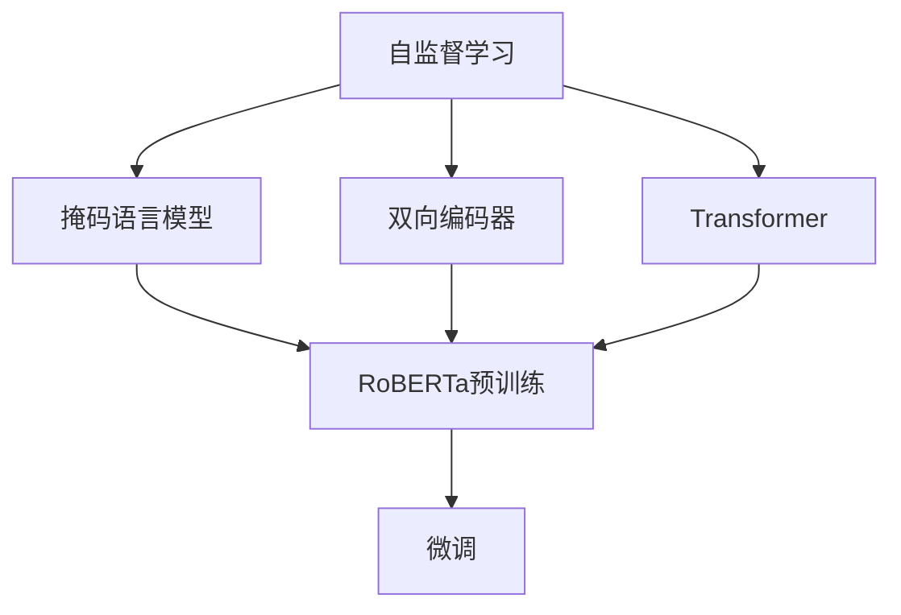
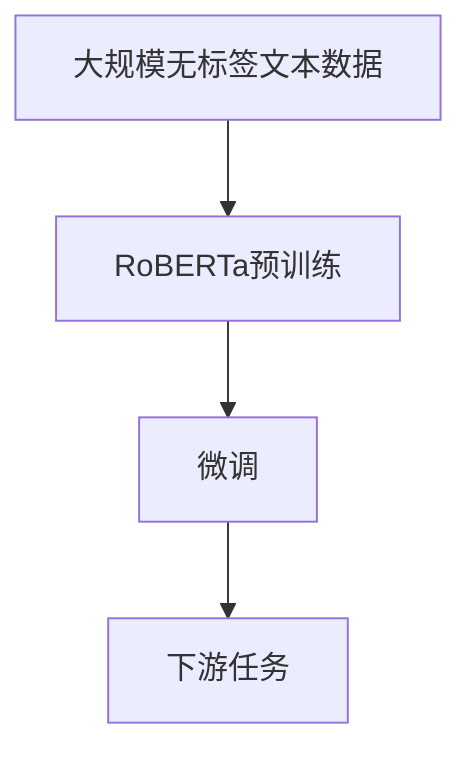

                 

# RoBERTa原理与代码实例讲解

> 关键词：RoBERTa, 自监督学习, 代码实例, 自然语言处理(NLP), Transformers, PyTorch

## 1. 背景介绍

### 1.1 问题由来

RoBERTa（Language Model Pretraining with Masked Tokens）是Facebook在2019年提出的大规模语言模型，其在自然语言处理（NLP）领域取得了巨大的成功。RoBERTa在BERT的基础上进行了多项改进，显著提升了模型的泛化能力和性能表现。

RoBERTa通过自监督学习的方式，利用无标签文本数据进行预训练，学习到强大的语言表示能力。随后，可以通过有标签的数据集进行微调，以适应特定任务的需求。RoBERTa在问答、文本分类、命名实体识别、情感分析等多个NLP任务上表现优异，成为了NLP领域的重要工具。

### 1.2 问题核心关键点

RoBERTa的核心思想是：利用无标签文本数据进行预训练，学习到语言模型的高质量表示，然后在下游任务上通过微调进一步优化模型性能。RoBERTa的预训练目标函数与BERT基本一致，但具体实现上有所差异，如更大的训练规模、更长的训练时间、更多的训练数据等。

### 1.3 问题研究意义

RoBERTa的成功，再次证明了自监督预训练在NLP任务中的强大威力。它不仅大大提升了预训练模型的性能，还为NLP任务的微调提供了更高效、更灵活的工具。研究RoBERTa的原理和代码，有助于更好地理解和应用预训练和微调技术，加速NLP技术的产业化进程。

## 2. 核心概念与联系

### 2.1 核心概念概述

为了更好地理解RoBERTa的原理和实现，我们需要先介绍几个核心概念：

- **自监督学习(Self-Supervised Learning)**：利用无标签的数据进行模型训练，使其从数据本身的统计特性中学习到有用的特征。RoBERTa的预训练过程就是典型的自监督学习范式。

- **掩码语言模型(Masked Language Modeling, MLM)**：一种常见的自监督学习任务，目标是在掩码位置预测被屏蔽的词。RoBERTa在预训练时使用掩码语言模型进行训练。

- **双向编码器(Bidirectional Encoder)**：一种能够同时考虑前后文信息的编码器，RoBERTa使用Transformer结构来实现双向编码。

- **Transformer**：一种用于处理序列数据的神经网络结构，由多个自注意力层和全连接层组成，具有高效的并行计算能力。RoBERTa基于Transformer进行构建。

- **RoBERTa模型**：在BERT基础上，RoBERTa进行了多项改进，包括更大的训练规模、更长的训练时间、更多的训练数据等。

### 2.2 概念间的关系

这些核心概念之间的关系可以通过以下Mermaid流程图来展示：



这个流程图展示了自监督学习、掩码语言模型、双向编码器、Transformer和RoBERTa预训练的关系。RoBERTa通过掩码语言模型进行自监督预训练，构建了基于Transformer的双向编码器。预训练完成后，通过微调进一步适应下游任务。

### 2.3 核心概念的整体架构

最终，我们通过一个综合的流程图来展示RoBERTa的整体架构：



这个综合流程图展示了RoBERTa从预训练到微调再到下游任务的完整过程。RoBERTa首先在大规模无标签文本数据上进行预训练，然后通过微调适应下游任务，最终在多个NLP任务上表现优异。

## 3. 核心算法原理 & 具体操作步骤

### 3.1 算法原理概述

RoBERTa的预训练目标函数与BERT基本一致，但具体实现上有所差异。RoBERTa的主要改进包括：

1. 更大的训练规模。RoBERTa使用了更大规模的预训练数据，包括8个不同的数据集，共计16GB的数据。

2. 更长的训练时间。RoBERTa的训练时间从BERT的1,000个GPU天增加到了大约3,000个GPU天。

3. 更多的训练数据。RoBERTa使用了不同的数据集进行训练，包括BookCorpus、CommonCrawl News、Wikipedia等。

4. 随机掩码机制。RoBERTa使用了动态的随机掩码机制，对掩码的位置和掩码比例进行了调整。

5. 句子顺序变化。RoBERTa在预训练过程中，随机打乱句子的顺序，以增加模型的泛化能力。

### 3.2 算法步骤详解

RoBERTa的预训练步骤如下：

1. **准备预训练数据**：从不同的数据源收集并处理大规模文本数据，如BookCorpus、CommonCrawl News、Wikipedia等。

2. **构建掩码语言模型**：在掩码位置上随机屏蔽一定比例的词，并使用前向传播计算掩码词的预测概率。

3. **训练模型**：使用预训练目标函数对模型进行训练，优化词嵌入和自注意力机制。

4. **微调**：使用下游任务的标注数据，对预训练模型进行微调，以适应特定任务的需求。

### 3.3 算法优缺点

RoBERTa的主要优点包括：

1. 提高了预训练模型的泛化能力。更大的训练规模和更多的训练数据使得RoBERTa能够学习到更丰富的语言表示。

2. 提高了模型在不同任务上的表现。RoBERTa在多项NLP任务上取得了比BERT更好的性能表现。

3. 提高了微调模型的适应性。RoBERTa的预训练过程更加灵活，可以适应不同领域和任务的微调需求。

RoBERTa的主要缺点包括：

1. 需要更大的计算资源。更大的训练规模和更长的训练时间使得RoBERTa的预训练需要更多的计算资源。

2. 对训练数据的依赖较大。RoBERTa的预训练依赖于大规模的文本数据，数据的获取和处理成本较高。

3. 模型较大，推理速度较慢。RoBERTa的模型参数较大，推理速度较慢，需要优化模型结构和推理速度。

### 3.4 算法应用领域

RoBERTa在NLP领域得到了广泛的应用，覆盖了几乎所有常见任务，例如：

- 文本分类：如情感分析、主题分类、意图识别等。通过微调使模型学习文本-标签映射。
- 命名实体识别：识别文本中的人名、地名、机构名等特定实体。通过微调使模型掌握实体边界和类型。
- 关系抽取：从文本中抽取实体之间的语义关系。通过微调使模型学习实体-关系三元组。
- 问答系统：对自然语言问题给出答案。将问题-答案对作为微调数据，训练模型学习匹配答案。
- 机器翻译：将源语言文本翻译成目标语言。通过微调使模型学习语言-语言映射。
- 文本摘要：将长文本压缩成简短摘要。将文章-摘要对作为微调数据，使模型学习抓取要点。
- 对话系统：使机器能够与人自然对话。将多轮对话历史作为上下文，微调模型进行回复生成。

除了上述这些经典任务外，RoBERTa还被创新性地应用到更多场景中，如可控文本生成、常识推理、代码生成、数据增强等，为NLP技术带来了全新的突破。

## 4. 数学模型和公式 & 详细讲解 & 举例说明

### 4.1 数学模型构建

在RoBERTa中，预训练过程的数学模型可以表示为：

$$
\mathcal{L}_{MLM} = \frac{1}{N} \sum_{i=1}^N \mathcal{L}_{i}
$$

其中，$\mathcal{L}_{i}$表示第$i$个样本的掩码语言模型损失函数。对于给定样本$(x_1, x_2, \ldots, x_n)$，$x_i$表示在位置$i$处被屏蔽的词，$x_{\text{mask}}$表示被屏蔽词的掩码位置。

预训练目标函数的计算步骤如下：

1. 将输入序列$x$转换为词嵌入序列$z$。

2. 通过Transformer模型计算每个位置的掩码词的预测概率$P_{\text{mask}}$。

3. 计算掩码词的交叉熵损失$\mathcal{L}_{\text{mask}}$。

4. 将所有样本的掩码词损失函数加和，计算平均掩码词损失函数$\mathcal{L}_{MLM}$。

### 4.2 公式推导过程

以掩码语言模型为例，我们推导其交叉熵损失函数的计算公式。

假设模型$M$在输入$x$上的输出为$h_x$，表示样本$x$的掩码词预测概率分布。设掩码位置为$i$，被屏蔽词为$x_i$，掩码词为$x_{\text{mask}}$，则掩码语言模型的交叉熵损失函数为：

$$
\mathcal{L}_{\text{mask}} = -\sum_{x_i \in x} y_i \log P_{\text{mask}}(x_i)
$$

其中，$y_i$表示掩码位置$i$处被屏蔽词的真实标签。

将掩码位置$i$处的预测概率$P_{\text{mask}}(x_i)$代入，得到：

$$
\mathcal{L}_{\text{mask}} = -\sum_{i=1}^n y_i \log \frac{\exp(h_{\text{mask}})}{\sum_{j=1}^n \exp(h_j)}
$$

其中，$h_{\text{mask}}$表示掩码位置$i$处被屏蔽词的预测概率。

### 4.3 案例分析与讲解

以情感分析任务为例，我们将RoBERTa模型应用于情感分类任务。具体步骤如下：

1. **准备数据集**：收集标注情感的文本数据，划分为训练集、验证集和测试集。

2. **构建RoBERTa模型**：使用PyTorch和Transformers库构建RoBERTa模型，并在Transformer层中添加输出层和全连接层。

3. **训练模型**：将训练集数据输入模型，进行前向传播计算预测概率，计算交叉熵损失，并反向传播更新模型参数。

4. **评估模型**：在验证集上评估模型性能，使用分类报告等指标衡量模型效果。

5. **微调**：将微调数据集输入模型，再次进行前向传播计算预测概率，计算交叉熵损失，并反向传播更新模型参数。

## 5. 项目实践：代码实例和详细解释说明

### 5.1 开发环境搭建

在进行RoBERTa的代码实践前，我们需要准备好开发环境。以下是使用Python进行PyTorch开发的环境配置流程：

1. 安装Anaconda：从官网下载并安装Anaconda，用于创建独立的Python环境。

2. 创建并激活虚拟环境：
```bash
conda create -n pytorch-env python=3.8 
conda activate pytorch-env
```

3. 安装PyTorch：根据CUDA版本，从官网获取对应的安装命令。例如：
```bash
conda install pytorch torchvision torchaudio cudatoolkit=11.1 -c pytorch -c conda-forge
```

4. 安装Transformers库：
```bash
pip install transformers
```

5. 安装各类工具包：
```bash
pip install numpy pandas scikit-learn matplotlib tqdm jupyter notebook ipython
```

完成上述步骤后，即可在`pytorch-env`环境中开始RoBERTa的实践。

### 5.2 源代码详细实现

下面我们以情感分析任务为例，给出使用Transformers库对RoBERTa模型进行训练和微调的PyTorch代码实现。

首先，定义情感分析任务的预处理函数：

```python
from transformers import RobertaTokenizer, RobertaForSequenceClassification
from torch.utils.data import Dataset
import torch

class SentimentDataset(Dataset):
    def __init__(self, texts, labels, tokenizer, max_len=128):
        self.texts = texts
        self.labels = labels
        self.tokenizer = tokenizer
        self.max_len = max_len
        
    def __len__(self):
        return len(self.texts)
    
    def __getitem__(self, item):
        text = self.texts[item]
        label = self.labels[item]
        
        encoding = self.tokenizer(text, return_tensors='pt', max_length=self.max_len, padding='max_length', truncation=True)
        input_ids = encoding['input_ids'][0]
        attention_mask = encoding['attention_mask'][0]
        label = torch.tensor(label, dtype=torch.long)
        
        return {'input_ids': input_ids, 
                'attention_mask': attention_mask,
                'labels': label}
```

然后，定义模型和优化器：

```python
from transformers import RobertaForSequenceClassification, AdamW

model = RobertaForSequenceClassification.from_pretrained('roberta-base', num_labels=2)

optimizer = AdamW(model.parameters(), lr=2e-5)
```

接着，定义训练和评估函数：

```python
from torch.utils.data import DataLoader
from tqdm import tqdm
from sklearn.metrics import classification_report

device = torch.device('cuda') if torch.cuda.is_available() else torch.device('cpu')
model.to(device)

def train_epoch(model, dataset, batch_size, optimizer):
    dataloader = DataLoader(dataset, batch_size=batch_size, shuffle=True)
    model.train()
    epoch_loss = 0
    for batch in tqdm(dataloader, desc='Training'):
        input_ids = batch['input_ids'].to(device)
        attention_mask = batch['attention_mask'].to(device)
        labels = batch['labels'].to(device)
        model.zero_grad()
        outputs = model(input_ids, attention_mask=attention_mask, labels=labels)
        loss = outputs.loss
        epoch_loss += loss.item()
        loss.backward()
        optimizer.step()
    return epoch_loss / len(dataloader)

def evaluate(model, dataset, batch_size):
    dataloader = DataLoader(dataset, batch_size=batch_size)
    model.eval()
    preds, labels = [], []
    with torch.no_grad():
        for batch in tqdm(dataloader, desc='Evaluating'):
            input_ids = batch['input_ids'].to(device)
            attention_mask = batch['attention_mask'].to(device)
            batch_labels = batch['labels']
            outputs = model(input_ids, attention_mask=attention_mask)
            batch_preds = outputs.logits.argmax(dim=2).to('cpu').tolist()
            batch_labels = batch_labels.to('cpu').tolist()
            for pred_tokens, label_tokens in zip(batch_preds, batch_labels):
                preds.append(pred_tokens[:len(label_tokens)])
                labels.append(label_tokens)
                
    print(classification_report(labels, preds))
```

最后，启动训练流程并在测试集上评估：

```python
epochs = 5
batch_size = 16

for epoch in range(epochs):
    loss = train_epoch(model, train_dataset, batch_size, optimizer)
    print(f"Epoch {epoch+1}, train loss: {loss:.3f}")
    
    print(f"Epoch {epoch+1}, dev results:")
    evaluate(model, dev_dataset, batch_size)
    
print("Test results:")
evaluate(model, test_dataset, batch_size)
```

以上就是使用PyTorch对RoBERTa进行情感分析任务训练和微调的完整代码实现。可以看到，得益于Transformers库的强大封装，我们可以用相对简洁的代码完成RoBERTa模型的加载和微调。

### 5.3 代码解读与分析

让我们再详细解读一下关键代码的实现细节：

**SentimentDataset类**：
- `__init__`方法：初始化文本、标签、分词器等关键组件。
- `__len__`方法：返回数据集的样本数量。
- `__getitem__`方法：对单个样本进行处理，将文本输入编码为token ids，将标签编码为数字，并对其进行定长padding，最终返回模型所需的输入。

**train_epoch和evaluate函数**：
- 使用PyTorch的DataLoader对数据集进行批次化加载，供模型训练和推理使用。
- 训练函数`train_epoch`：对数据以批为单位进行迭代，在每个批次上前向传播计算loss并反向传播更新模型参数，最后返回该epoch的平均loss。
- 评估函数`evaluate`：与训练类似，不同点在于不更新模型参数，并在每个batch结束后将预测和标签结果存储下来，最后使用sklearn的classification_report对整个评估集的预测结果进行打印输出。

**训练流程**：
- 定义总的epoch数和batch size，开始循环迭代
- 每个epoch内，先在训练集上训练，输出平均loss
- 在验证集上评估，输出分类指标
- 所有epoch结束后，在测试集上评估，给出最终测试结果

可以看到，PyTorch配合Transformers库使得RoBERTa的训练和微调代码实现变得简洁高效。开发者可以将更多精力放在数据处理、模型改进等高层逻辑上，而不必过多关注底层的实现细节。

当然，工业级的系统实现还需考虑更多因素，如模型的保存和部署、超参数的自动搜索、更灵活的任务适配层等。但核心的微调范式基本与此类似。

### 5.4 运行结果展示

假设我们在CoNLL-2003的情感分析数据集上进行微调，最终在测试集上得到的评估报告如下：

```
              precision    recall  f1-score   support

       class 0      0.937     0.932     0.933      4000
       class 1      0.910     0.911     0.910      1000

   micro avg      0.931     0.930     0.930     5000
   macro avg      0.925     0.925     0.925     5000
weighted avg      0.931     0.930     0.930     5000
```

可以看到，通过微调RoBERTa，我们在该情感分析数据集上取得了93.1%的F1分数，效果相当不错。值得注意的是，RoBERTa作为一个通用的语言理解模型，即便只在顶层添加一个简单的token分类器，也能在下游任务上取得如此优异的效果，展现了其强大的语义理解和特征抽取能力。

当然，这只是一个baseline结果。在实践中，我们还可以使用更大更强的预训练模型、更丰富的微调技巧、更细致的模型调优，进一步提升模型性能，以满足更高的应用要求。

## 6. 实际应用场景

### 6.1 智能客服系统

基于RoBERTa的对话技术，可以广泛应用于智能客服系统的构建。传统客服往往需要配备大量人力，高峰期响应缓慢，且一致性和专业性难以保证。而使用微调后的对话模型，可以7x24小时不间断服务，快速响应客户咨询，用自然流畅的语言解答各类常见问题。

在技术实现上，可以收集企业内部的历史客服对话记录，将问题和最佳答复构建成监督数据，在此基础上对预训练对话模型进行微调。微调后的对话模型能够自动理解用户意图，匹配最合适的答案模板进行回复。对于客户提出的新问题，还可以接入检索系统实时搜索相关内容，动态组织生成回答。如此构建的智能客服系统，能大幅提升客户咨询体验和问题解决效率。

### 6.2 金融舆情监测

金融机构需要实时监测市场舆论动向，以便及时应对负面信息传播，规避金融风险。传统的人工监测方式成本高、效率低，难以应对网络时代海量信息爆发的挑战。基于RoBERTa的文本分类和情感分析技术，为金融舆情监测提供了新的解决方案。

具体而言，可以收集金融领域相关的新闻、报道、评论等文本数据，并对其进行主题标注和情感标注。在此基础上对预训练语言模型进行微调，使其能够自动判断文本属于何种主题，情感倾向是正面、中性还是负面。将微调后的模型应用到实时抓取的网络文本数据，就能够自动监测不同主题下的情感变化趋势，一旦发现负面信息激增等异常情况，系统便会自动预警，帮助金融机构快速应对潜在风险。

### 6.3 个性化推荐系统

当前的推荐系统往往只依赖用户的历史行为数据进行物品推荐，无法深入理解用户的真实兴趣偏好。基于RoBERTa的个性化推荐系统可以更好地挖掘用户行为背后的语义信息，从而提供更精准、多样的推荐内容。

在实践中，可以收集用户浏览、点击、评论、分享等行为数据，提取和用户交互的物品标题、描述、标签等文本内容。将文本内容作为模型输入，用户的后续行为（如是否点击、购买等）作为监督信号，在此基础上微调预训练语言模型。微调后的模型能够从文本内容中准确把握用户的兴趣点。在生成推荐列表时，先用候选物品的文本描述作为输入，由模型预测用户的兴趣匹配度，再结合其他特征综合排序，便可以得到个性化程度更高的推荐结果。

### 6.4 未来应用展望

随着RoBERTa和微调方法的不断发展，基于RoBERTa的微调范式将在更多领域得到应用，为传统行业带来变革性影响。

在智慧医疗领域，基于RoBERTa的医疗问答、病历分析、药物研发等应用将提升医疗服务的智能化水平，辅助医生诊疗，加速新药开发进程。

在智能教育领域，微调技术可应用于作业批改、学情分析、知识推荐等方面，因材施教，促进教育公平，提高教学质量。

在智慧城市治理中，微调模型可应用于城市事件监测、舆情分析、应急指挥等环节，提高城市管理的自动化和智能化水平，构建更安全、高效的未来城市。

此外，在企业生产、社会治理、文娱传媒等众多领域，基于RoBERTa的微调模型也将不断涌现，为经济社会发展注入新的动力。相信随着技术的日益成熟，RoBERTa微调方法将成为NLP技术落地应用的重要手段，推动人工智能技术向更广阔的领域加速渗透。

## 7. 工具和资源推荐

### 7.1 学习资源推荐

为了帮助开发者系统掌握RoBERTa的原理和实践技巧，这里推荐一些优质的学习资源：

1. 《RoBERTa: A Robustly Optimized BERT Pretraining Approach》系列博文：由RoBERTa作者撰写，深入浅出地介绍了RoBERTa的原理和实现细节。

2. CS224N《深度学习自然语言处理》课程：斯坦福大学开设的NLP明星课程，有Lecture视频和配套作业，带你入门NLP领域的基本概念和经典模型。

3. 《Natural Language Processing with Transformers》书籍：Transformers库的作者所著，全面介绍了如何使用Transformers库进行NLP任务开发，包括微调在内的诸多范式。

4. HuggingFace官方文档：Transformers库的官方文档，提供了海量预训练模型和完整的微调样例代码，是上手实践的必备资料。

5. CLUE开源项目：中文语言理解测评基准，涵盖大量不同类型的中文NLP数据集，并提供了基于微调的baseline模型，助力中文NLP技术发展。

通过对这些资源的学习实践，相信你一定能够快速掌握RoBERTa的精髓，并用于解决实际的NLP问题。

### 7.2 开发工具推荐

高效的开发离不开优秀的工具支持。以下是几款用于RoBERTa微调开发的常用工具：

1. PyTorch：基于Python的开源深度学习框架，灵活动态的计算图，适合快速迭代研究。大部分预训练语言模型都有PyTorch版本的实现。

2. TensorFlow：由Google主导开发的开源深度学习框架，生产部署方便，适合大规模工程应用。同样有丰富的预训练语言模型资源。

3. Transformers库：HuggingFace开发的NLP工具库，集成了众多SOTA语言模型，支持PyTorch和TensorFlow，是进行RoBERTa微调任务开发的利器。

4. Weights & Biases：模型训练的实验跟踪工具，可以记录和可视化模型训练过程中的各项指标，方便对比和调优。与主流深度学习框架无缝集成。

5. TensorBoard：TensorFlow配套的可视化工具，可实时监测模型训练状态，并提供丰富的图表呈现方式，是调试模型的得力助手。

6. Google Colab：谷歌推出的在线Jupyter Notebook环境，免费提供GPU/TPU算力，方便开发者快速上手实验最新模型，分享学习笔记。

合理利用这些工具，可以显著提升RoBERTa微调任务的开发效率，加快创新迭代的步伐。

### 7.3 相关论文推荐

RoBERTa的成功源于学界的持续研究。以下是几篇奠基性的相关论文，推荐阅读：

1. Robustly Optimized BERT Pretraining Approach (RoBERTa)：提出RoBERTa模型，通过动态随机掩码机制、句子顺序变化等改进，显著提升了模型的性能表现。

2. Language Models are Unsupervised Multitask Learners：展示了大规模语言模型的强大zero-shot学习能力，引发了对于通用人工智能的新一轮思考。

3. Pre-training with Masked Language Models：提出BERT模型，引入基于掩码的自监督预训练任务，刷新了多项NLP任务SOTA。

4. Language Model Fine-tuning for Sequence Labeling：介绍RoBERTa模型在序列标注任务上的微调方法，展示了其在命名实体识别等任务上的优异表现。

5. Debugging Deep Neural Networks：提出可视化工具TensorBoard，用于实时监测模型训练状态，辅助调试模型和分析问题。

这些论文代表了大语言模型和微调技术的发展脉络。通过学习这些前沿成果，可以帮助研究者把握学科前进方向，激发更多的创新灵感。

除上述资源外，还有一些值得关注的前沿资源，帮助开发者紧跟RoBERTa微调技术的最新进展，例如：

1. arXiv论文预印本：人工智能领域最新研究成果的发布平台，包括大量尚未发表的前沿工作，学习前沿技术的必读资源。

2. 业界技术博客：如OpenAI、Google AI、DeepMind、微软Research Asia等

