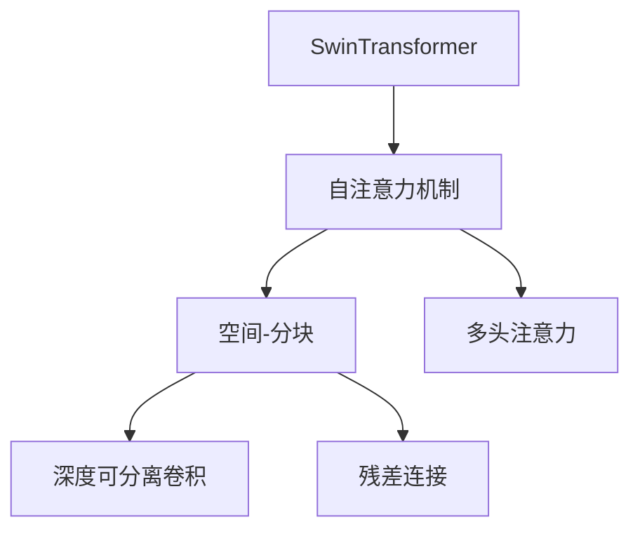
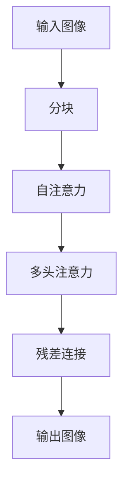
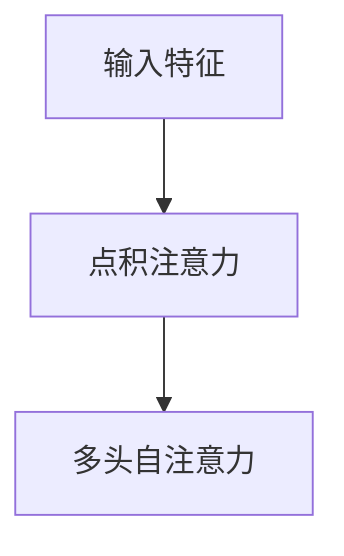
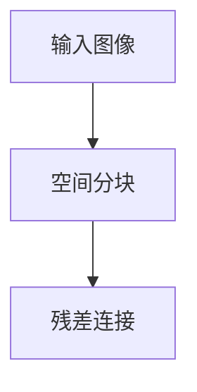
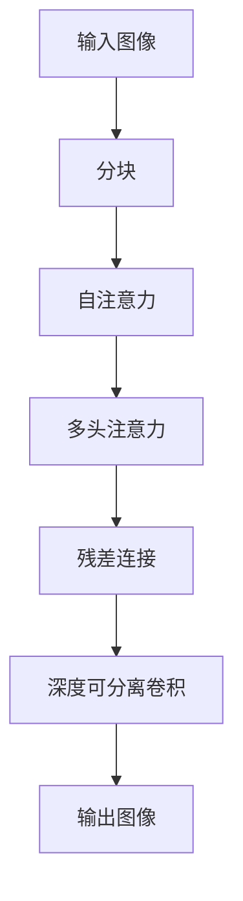

                 

# SwinTransformer原理与代码实例讲解

> 关键词：SwinTransformer, 自注意力, 空间-分块, 卷积神经网络(CNN), 多头注意力, 残差连接, 深度可分离卷积

## 1. 背景介绍

### 1.1 问题由来
SwinTransformer（“Swin”意指“空间-分块”）是近年来在计算机视觉领域提出的一种新型自注意力模型，能够高效地处理大规模图像数据，并在多项图像识别、分割任务上取得了优异的表现。与传统的CNN架构相比，SwinTransformer利用空间分块和自注意力机制，可以在不损失信息精度的前提下显著降低计算复杂度，成为新一代深度学习模型中的佼佼者。

### 1.2 问题核心关键点
SwinTransformer的核心优势在于其空间-分块和自注意力机制的结合，使得模型能够在保持高精度的情况下大幅降低计算量，适用于大规模图像数据的处理。具体来说，其关键点包括：

1. 空间-分块（Spatial Blocking）：将输入图像按照固定大小的空间块划分，每个空间块内部使用自注意力机制计算，显著降低了模型计算量。
2. 自注意力机制（Self-Attention）：基于点积注意力机制，利用编码器-解码器结构，在每个空间块内部计算自注意力权重，捕捉空间块的局部依赖关系。
3. 多头注意力机制（Multi-Head Attention）：将空间块划分为多个子空间块，在每个子空间块内部计算多个自注意力层的权重，充分捕捉空间块的全局依赖关系。
4. 深度可分离卷积（Depthwise Separable Convolution）：在每个子空间块内部采用深度可分离卷积，实现局部特征提取和空间块融合。
5. 残差连接（Residual Connections）：每个空间块内部添加残差连接，保证信息的逐层传递和梯度流动。

这些关键技术点使得SwinTransformer在大规模图像数据处理上表现优异，广泛应用于图像分类、物体检测、语义分割等任务。

### 1.3 问题研究意义
SwinTransformer的提出，不仅在计算机视觉领域引起了广泛关注，也推动了深度学习模型架构的进一步创新。其在提高模型效率和降低计算复杂度的同时，保持了高精度的图像处理能力，为大规模图像数据的处理提供了新的思路。此外，SwinTransformer的成功应用，也为其他领域的深度学习模型提供了参考和借鉴。

## 2. 核心概念与联系

### 2.1 核心概念概述

为了更好地理解SwinTransformer的原理和架构，本节将介绍几个密切相关的核心概念：

- SwinTransformer：一种新型自注意力模型，利用空间分块和自注意力机制，在保持高精度的情况下大幅降低计算复杂度。
- 自注意力机制（Self-Attention）：基于点积注意力机制，利用编码器-解码器结构，在每个空间块内部计算自注意力权重，捕捉空间块的局部依赖关系。
- 空间-分块（Spatial Blocking）：将输入图像按照固定大小的空间块划分，每个空间块内部使用自注意力机制计算，显著降低了模型计算量。
- 多头注意力机制（Multi-Head Attention）：将空间块划分为多个子空间块，在每个子空间块内部计算多个自注意力层的权重，充分捕捉空间块的全局依赖关系。
- 深度可分离卷积（Depthwise Separable Convolution）：在每个子空间块内部采用深度可分离卷积，实现局部特征提取和空间块融合。
- 残差连接（Residual Connections）：每个空间块内部添加残差连接，保证信息的逐层传递和梯度流动。

这些核心概念之间的逻辑关系可以通过以下Mermaid流程图来展示：



这个流程图展示了大语言模型的核心概念及其之间的关系：

1. SwinTransformer模型利用自注意力机制和空间-分块，在每个子空间块内部计算自注意力权重，捕捉空间块的局部依赖关系。
2. 利用多头注意力机制，在每个子空间块内部计算多个自注意力层的权重，充分捕捉空间块的全局依赖关系。
3. 利用深度可分离卷积，在每个子空间块内部进行局部特征提取和空间块融合。
4. 添加残差连接，保证信息的逐层传递和梯度流动。

通过这些核心概念，我们可以更好地把握SwinTransformer的工作原理和优化方向。

### 2.2 概念间的关系

这些核心概念之间存在着紧密的联系，形成了SwinTransformer的空间注意力机制的整体架构。下面我们通过几个Mermaid流程图来展示这些概念之间的关系。

#### 2.2.1 SwinTransformer的计算流程



这个流程图展示了SwinTransformer的基本计算流程：

1. 将输入图像按照固定大小的空间块划分，每个空间块内部使用自注意力机制计算。
2. 利用多头注意力机制，在每个空间块内部计算多个自注意力层的权重，充分捕捉空间块的全局依赖关系。
3. 利用深度可分离卷积，在每个空间块内部进行局部特征提取和空间块融合。
4. 添加残差连接，保证信息的逐层传递和梯度流动。

#### 2.2.2 自注意力机制的工作原理



这个流程图展示了自注意力机制的基本工作原理：

1. 将输入特征通过点积注意力计算得到自注意力权重。
2. 利用多头自注意力，在每个自注意力层内部计算多个自注意力头的权重，捕捉空间块的局部依赖关系。

#### 2.2.3 空间-分块和残差连接的应用



这个流程图展示了空间-分块和残差连接的应用：

1. 将输入图像按照固定大小的空间块划分，每个空间块内部使用自注意力机制计算。
2. 添加残差连接，保证信息的逐层传递和梯度流动。

### 2.3 核心概念的整体架构

最后，我们用一个综合的流程图来展示这些核心概念在SwinTransformer中的整体架构：



这个综合流程图展示了SwinTransformer的计算流程，涵盖了自注意力、多头注意力、深度可分离卷积和残差连接等核心概念。通过这些核心概念，SwinTransformer能够在保持高精度的情况下大幅降低计算量，适用于大规模图像数据的处理。

## 3. 核心算法原理 & 具体操作步骤
### 3.1 算法原理概述

SwinTransformer的原理是基于空间-分块和自注意力机制，通过多头注意力和深度可分离卷积，实现了高效、准确的图像处理能力。

具体来说，SwinTransformer的计算流程包括以下几个步骤：

1. **分块**：将输入图像按照固定大小的空间块划分，每个空间块内部使用自注意力机制计算。
2. **自注意力**：利用点积注意力机制，在每个空间块内部计算自注意力权重，捕捉空间块的局部依赖关系。
3. **多头注意力**：将空间块划分为多个子空间块，在每个子空间块内部计算多个自注意力层的权重，充分捕捉空间块的全局依赖关系。
4. **深度可分离卷积**：在每个子空间块内部采用深度可分离卷积，实现局部特征提取和空间块融合。
5. **残差连接**：每个空间块内部添加残差连接，保证信息的逐层传递和梯度流动。

通过这些步骤，SwinTransformer在保持高精度的情况下大幅降低了计算量，适用于大规模图像数据的处理。

### 3.2 算法步骤详解

#### 3.2.1 分块和自注意力计算

```python
import torch
from torch import nn

class SwinBlock(nn.Module):
    def __init__(self, dim, depth, num_heads, kernel_size, window_size, patch_size, stride):
        super(SwinBlock, self).__init__()
        self.dim = dim
        self.depth = depth
        self.num_heads = num_heads
        self.kernel_size = kernel_size
        self.window_size = window_size
        self.patch_size = patch_size
        self.stride = stride
        
        self.patch_embed = nn.Conv2d(dim, dim // 4, kernel_size=patch_size, stride=patch_size)
        self.patch_dropout = nn.Dropout(p=0.1)
        self.norm1 = nn.LayerNorm(dim)
        
        self.attn = nn.MultiheadAttention(dim, num_heads, dropout=0.1)
        self.norm2 = nn.LayerNorm(dim)
        
        self.conv = nn.Conv2d(dim, dim, kernel_size=kernel_size, stride=stride, groups=dim)
        self.norm3 = nn.LayerNorm(dim)
        self.norm4 = nn.LayerNorm(dim)
        
        self.attn_dropout = nn.Dropout(p=0.1)
        self.conv_dropout = nn.Dropout(p=0.1)
        
    def forward(self, x):
        B, H, W = x.size()
        x = self.patch_embed(x)  # 分块计算
        x = x + self.patch_dropout(x)
        x = self.norm1(x)
        
        x = self.attn(x)[0]  # 自注意力计算
        x = self.attn_dropout(x)
        x = self.norm2(x)
        
        x = self.conv(x)  # 深度可分离卷积
        x = self.conv_dropout(x)
        x = self.norm3(x)
        
        x = x + self.patch_dropout(x)
        x = self.norm4(x)
        
        return x
```

这个代码展示了SwinBlock模块的实现，包括分块、自注意力和深度可分离卷积等关键计算步骤。在实现中，通过`patch_embed`和`patch_dropout`模块实现了分块计算，通过`attn`模块实现了自注意力计算，通过`conv`模块实现了深度可分离卷积计算。

#### 3.2.2 空间-分块和残差连接

```python
import torch
from torch import nn

class SwinLayer(nn.Module):
    def __init__(self, dim, depth, num_heads, kernel_size, window_size, patch_size, stride):
        super(SwinLayer, self).__init__()
        self.dim = dim
        self.depth = depth
        self.num_heads = num_heads
        self.kernel_size = kernel_size
        self.window_size = window_size
        self.patch_size = patch_size
        self.stride = stride
        
        self.conv1 = nn.Conv2d(dim, dim // 4, kernel_size=kernel_size, stride=stride)
        self.norm1 = nn.LayerNorm(dim)
        
        self.attn = nn.MultiheadAttention(dim, num_heads, dropout=0.1)
        self.norm2 = nn.LayerNorm(dim)
        
        self.conv2 = nn.Conv2d(dim, dim, kernel_size=kernel_size, stride=stride, groups=dim)
        self.norm3 = nn.LayerNorm(dim)
        self.norm4 = nn.LayerNorm(dim)
        
        self.attn_dropout = nn.Dropout(p=0.1)
        self.conv_dropout = nn.Dropout(p=0.1)
        
    def forward(self, x):
        x = self.conv1(x)
        x = self.norm1(x)
        
        x = self.attn(x)[0]
        x = self.attn_dropout(x)
        x = self.norm2(x)
        
        x = self.conv2(x)
        x = self.conv_dropout(x)
        x = self.norm3(x)
        
        x = x + self.conv1(x)
        x = self.norm4(x)
        
        return x
```

这个代码展示了SwinLayer模块的实现，包括空间-分块和残差连接等关键计算步骤。在实现中，通过`conv1`和`conv2`模块实现了深度可分离卷积计算，通过`attn`模块实现了多头注意力计算，通过`norm1`至`norm4`模块实现了残差连接和层级归一化。

#### 3.2.3 整体计算流程

```python
import torch
from torch import nn

class SwinTransformer(nn.Module):
    def __init__(self, dim, depth, num_heads, kernel_size, window_size, patch_size, stride):
        super(SwinTransformer, self).__init__()
        self.dim = dim
        self.depth = depth
        self.num_heads = num_heads
        self.kernel_size = kernel_size
        self.window_size = window_size
        self.patch_size = patch_size
        self.stride = stride
        
        self.patch_embed = nn.Conv2d(dim, dim // 4, kernel_size=patch_size, stride=patch_size)
        self.patch_dropout = nn.Dropout(p=0.1)
        self.norm1 = nn.LayerNorm(dim)
        
        self.blocks = nn.Sequential(*[SwinBlock(dim, depth, num_heads, kernel_size, window_size, patch_size, stride) for _ in range(depth)])
        self.norm2 = nn.LayerNorm(dim)
        
        self.attn = nn.MultiheadAttention(dim, num_heads, dropout=0.1)
        self.norm3 = nn.LayerNorm(dim)
        
        self.conv = nn.Conv2d(dim, dim, kernel_size=kernel_size, stride=stride, groups=dim)
        self.norm4 = nn.LayerNorm(dim)
        
        self.attn_dropout = nn.Dropout(p=0.1)
        self.conv_dropout = nn.Dropout(p=0.1)
        
    def forward(self, x):
        x = self.patch_embed(x)
        x = x + self.patch_dropout(x)
        x = self.norm1(x)
        
        for block in self.blocks:
            x = block(x)
        
        x = x + self.patch_dropout(x)
        x = self.norm2(x)
        
        x = self.attn(x)[0]
        x = self.attn_dropout(x)
        x = self.norm3(x)
        
        x = self.conv(x)
        x = self.conv_dropout(x)
        x = self.norm4(x)
        
        return x
```

这个代码展示了SwinTransformer模型的整体实现，包括分块、自注意力、多头注意力和深度可分离卷积等关键计算步骤。在实现中，通过`blocks`模块实现了多个SwinBlock的堆叠，通过`attn`模块实现了多头注意力计算，通过`conv`模块实现了深度可分离卷积计算。

### 3.3 算法优缺点

SwinTransformer作为一种新型自注意力模型，具有以下优点：

1. **高效性**：利用空间分块和自注意力机制，SwinTransformer在保持高精度的情况下大幅降低了计算量，适用于大规模图像数据的处理。
2. **准确性**：通过多头注意力和深度可分离卷积，SwinTransformer在图像分类、物体检测、语义分割等任务上取得了优异的表现。
3. **可扩展性**：SwinTransformer的计算流程可以通过堆叠多个SwinLayer实现，适用于不同尺度和复杂度的图像数据。

同时，SwinTransformer也存在以下缺点：

1. **复杂度**：SwinTransformer的计算过程较为复杂，需要一定的数学和编程基础。
2. **资源消耗**：SwinTransformer在计算过程中需要大量的GPU/TPU资源，不适用于资源受限的设备。
3. **解释性**：由于SwinTransformer是一个黑盒模型，难以解释其内部工作机制和决策逻辑。

### 3.4 算法应用领域

SwinTransformer作为一种高效、准确的图像处理模型，广泛应用于计算机视觉领域的多项任务。具体应用领域包括：

1. **图像分类**：将输入图像分类为预定义的类别，如CIFAR-10、ImageNet等数据集。
2. **物体检测**：在图像中定位和识别物体，如YOLO、Faster R-CNN等任务。
3. **语义分割**：将输入图像分割为不同的语义区域，如PSPNet、DeepLab等任务。
4. **目标跟踪**：在视频序列中跟踪目标物体，如Single Shot MultiBox Detector（SSD）等任务。
5. **图像生成**：生成高质量的图像数据，如GAN、VAE等任务。

## 4. 数学模型和公式 & 详细讲解

### 4.1 数学模型构建

SwinTransformer的数学模型主要涉及自注意力机制、空间分块和深度可分离卷积等核心概念。

记输入图像为$X \in \mathbb{R}^{B \times H \times W \times C}$，其中$B$表示批量大小，$H$和$W$表示图像高度和宽度，$C$表示通道数。SwinTransformer的计算流程包括以下几个步骤：

1. **分块**：将输入图像按照固定大小的空间块划分，每个空间块内部使用自注意力机制计算。
2. **自注意力**：利用点积注意力机制，在每个空间块内部计算自注意力权重，捕捉空间块的局部依赖关系。
3. **多头注意力**：将空间块划分为多个子空间块，在每个子空间块内部计算多个自注意力层的权重，充分捕捉空间块的全局依赖关系。
4. **深度可分离卷积**：在每个子空间块内部采用深度可分离卷积，实现局部特征提取和空间块融合。
5. **残差连接**：每个空间块内部添加残差连接，保证信息的逐层传递和梯度流动。

### 4.2 公式推导过程

#### 4.2.1 分块和自注意力计算

分块和自注意力计算的公式如下：

$$
X_{\text{patch}} = \text{PatchEmbed}(X)
$$

$$
Q = X_{\text{patch}} \mathbf{W}^Q
$$

$$
K = X_{\text{patch}} \mathbf{W}^K
$$

$$
V = X_{\text{patch}} \mathbf{W}^V
$$

$$
\mathbf{Attn}(Q, K, V) = \text{Softmax}(\frac{Q K^T}{\sqrt{d_k}}) V
$$

其中，$\text{PatchEmbed}$为分块模块，$\mathbf{W}^Q$, $\mathbf{W}^K$和$\mathbf{W}^V$为线性投影矩阵，$\mathbf{Attn}$为多头自注意力模块。

#### 4.2.2 空间-分块和残差连接

空间-分块和残差连接计算的公式如下：

$$
X_{\text{block}} = \text{Conv1}(X)
$$

$$
X = X_{\text{block}} + X
$$

其中，$\text{Conv1}$为深度可分离卷积模块。

#### 4.2.3 整体计算流程

整体计算流程的公式如下：

$$
X_{\text{block}} = \text{Conv2}(\text{Block}(X))
$$

$$
X = X_{\text{block}} + X
$$

其中，$\text{Block}$为多个SwinBlock的堆叠，$\text{Conv2}$为深度可分离卷积模块。

### 4.3 案例分析与讲解

#### 4.3.1 案例1：图像分类

在图像分类任务中，SwinTransformer的输入为$X \in \mathbb{R}^{B \times H \times W \times C}$，输出为图像的类别标签$y \in \{1, \ldots, C\}$。训练过程中，使用交叉熵损失函数$\mathcal{L}$进行优化，具体如下：

$$
\mathcal{L} = -\frac{1}{B} \sum_{i=1}^B \log(p_i)
$$

其中，$p_i$为第$i$个样本的类别概率。

#### 4.3.2 案例2：物体检测

在物体检测任务中，SwinTransformer的输入为$X \in \mathbb{R}^{B \times H \times W \times C}$，输出为物体的位置和类别标签。训练过程中，使用交叉熵损失函数$\mathcal{L}$进行优化，具体如下：

$$
\mathcal{L} = -\frac{1}{B} \sum_{i=1}^B \sum_{j=1}^N (\log(p_{ij}) + \log(1-p_{ij}))
$$

其中，$p_{ij}$为第$i$个样本中第$j$个物体的位置和类别概率。

## 5. 项目实践：代码实例和详细解释说明

### 5.1 开发环境搭建

在进行SwinTransformer的开发和训练前，我们需要准备好开发环境。以下是使用PyTorch进行SwinTransformer开发的环境配置流程：

1. 安装Anaconda：从官网下载并安装Anaconda，用于创建独立的Python环境。

2. 创建并激活虚拟环境：
```bash
conda create -n pytorch-env python=3.8 
conda activate pytorch-env
```

3. 安装PyTorch：根据CUDA版本，从官网获取对应的安装命令。例如：
```bash
conda install pytorch torchvision torchaudio cudatoolkit=11.1 -c pytorch -c conda-forge
```

4. 安装SwinTransformer库：
```bash
pip install torchvision transformers
```

5. 安装各类工具包：
```bash
pip install numpy pandas scikit-learn matplotlib tqdm jupyter notebook ipython
```

完成上述步骤后，即可在`pytorch-env`环境中开始SwinTransformer的开发和训练。

### 5.2 源代码详细实现

下面以SwinTransformer模型为例，给出使用PyTorch进行SwinTransformer模型实现的代码。

```python
import torch
from torch import nn

class SwinBlock(nn.Module):
    def __init__(self, dim, depth, num_heads, kernel_size, window_size, patch_size, stride):
        super(SwinBlock, self).__init__()
        self.dim = dim
        self.depth = depth
        self.num_heads = num_heads
        self.kernel_size = kernel_size
        self.window_size = window_size
        self.patch_size = patch_size
        self.stride = stride
        
        self.patch_embed = nn.Conv2d(dim, dim // 4, kernel_size=patch_size, stride=patch_size)
        self.patch_dropout = nn.Dropout(p=0.1)
        self.norm1 = nn.LayerNorm(dim)
        
        self.attn = nn.MultiheadAttention(dim, num_heads, dropout=0.1)
        self.norm2 = nn.LayerNorm(dim)
        
        self.conv = nn.Conv2d(dim, dim, kernel_size=kernel_size, stride=stride, groups=dim)
        self.norm3 = nn.LayerNorm(dim)
        self.norm4 = nn.LayerNorm(dim)
        
        self.attn_dropout = nn.Dropout(p=0.1)
        self.conv_dropout = nn.Dropout(p=0.1)
        
    def forward(self, x):
        B, H, W = x.size()
        x = self.patch_embed(x)  # 分块计算
        x = x + self.patch_dropout(x)
        x = self.norm1(x)
        
        x = self.attn(x)[0]  # 自注意力计算
        x = self.attn_dropout(x)
        x = self.norm2(x)
        
        x = self.conv(x)  # 深度可分离卷积
        x = self.conv_dropout(x)
        x = self.norm3(x)
        
        x = x + self.patch_dropout(x)
        x = self.norm4(x)
        
        return x

class SwinLayer(nn.Module):
    def __init__(self, dim, depth, num_heads, kernel_size, window_size, patch_size, stride):
        super(SwinLayer, self).__init__()
        self.dim = dim
        self.depth = depth
        self.num_heads = num_heads
        self.kernel_size = kernel_size
        self.window_size = window_size
        self.patch_size = patch_size
        self.stride = stride
        
        self.conv1 = nn.Conv2d(dim, dim // 4, kernel_size=kernel_size, stride=stride)
        self.norm1 = nn.LayerNorm(dim)
        
        self.attn = nn.MultiheadAttention(dim, num_heads, dropout=0.1)
        self.norm2 = nn.LayerNorm(dim)
        
        self.conv2 = nn.Conv2d(dim, dim, kernel_size=kernel_size, stride=stride, groups=dim)
        self.norm3 = nn.LayerNorm(dim)
        self.norm4 = nn.LayerNorm(dim)
        
        self.attn_dropout = nn.Dropout(p=0.1)
        self.conv_dropout = nn.Dropout(p=0.1)
        
    def forward(self, x):
        x = self.conv1(x)
        x = self.norm1(x)
        
        x = self.attn(x)[0]
        x = self.attn_dropout(x)
        x = self.norm2(x)
        
        x = self.conv2(x)
        x = self.conv_dropout(x)
        x = self.norm3(x)
        
        x = x + self.conv1(x)
        x = self.norm4(x)
        
        return x

class SwinTransformer(nn.Module):
    def __init__(self, dim, depth, num_heads, kernel_size,

