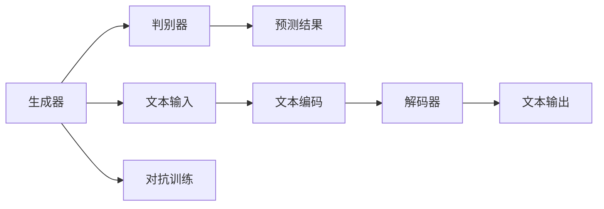

                 

# Transformer大模型实战 ELECTRA 的生成器和判别器

> 关键词：Transformer, ELECTRA, 生成器, 判别器, 预训练, 微调, 自监督学习

## 1. 背景介绍

在NLP领域，Transformer大模型已经取得了令人瞩目的成绩，比如BERT、GPT-3等。然而，这些模型往往依赖于大量的标注数据进行微调，对于标注成本较高的应用场景来说并不经济。为了解决这个问题，自监督学习应运而生，ELECTRA就是其中的一种。ELECTRA（Exploiting Contrastive Pre-training for Detecting Repetition Across Time）是一种基于自监督学习的模型，通过生成器和判别器的对抗训练来学习文本的表示。ELECTRA生成的文本序列，对判别器来说是一个伪样本，但对生成器来说，这些样本则会被认为是有意义的，从而进行学习和优化。本博客将详细介绍ELECTRA模型的原理，并结合实际案例进行讲解。

## 2. 核心概念与联系

### 2.1 核心概念概述

ELECTRA模型由两部分组成：生成器和判别器。生成器（Generator）负责生成文本序列，判别器（Discriminator）则负责判断生成的文本是否来自真实文本。ELECTRA的目标是使生成器生成的文本序列与真实文本序列尽可能相似，从而提高判别器的识别能力。

在ELECTRA中，生成器和判别器都是基于Transformer架构的。生成器包括多个编码层和解码层，可以生成与真实文本序列长度相同的文本序列。判别器同样使用多个编码层，但只负责判断生成器生成的文本是否与真实文本相同。生成器和判别器的对抗训练使得ELECTRA模型能够在无标注数据的情况下进行预训练，从而在微调过程中取得更好的效果。

### 2.2 概念间的关系

ELECTRA模型的核心在于生成器和判别器的对抗训练。生成器负责生成文本序列，而判别器则负责判断这些序列是否为真实文本。通过不断调整生成器和判别器的参数，ELECTRA模型可以学习到更加准确的文本表示。

ELECTRA模型不仅适用于下游任务，还可以作为预训练模型进行微调，用于文本分类、命名实体识别等NLP任务。此外，ELECTRA模型还可以与其他自监督学习技术结合使用，如ALBERT、SwinT等，以进一步提升模型的性能。

### 2.3 核心概念的整体架构

ELECTRA模型的整体架构如下：



其中，A为生成器，C为文本输入，E为文本编码器，F为解码器，G为文本输出。B为判别器，D为预测结果，H为对抗训练。

## 3. 核心算法原理 & 具体操作步骤
### 3.1 算法原理概述

ELECTRA模型的训练过程包括两个部分：生成器和判别器的对抗训练。生成器负责生成与真实文本序列长度相同的文本序列，而判别器则负责判断这些序列是否为真实文本序列。通过不断调整生成器和判别器的参数，ELECTRA模型可以学习到更加准确的文本表示。

### 3.2 算法步骤详解

#### 3.2.1 生成器训练

生成器训练的目的是生成与真实文本序列长度相同的文本序列。具体步骤如下：

1. 输入文本序列：将真实文本序列输入生成器，生成与真实文本序列长度相同的文本序列。
2. 编码器编码：使用Transformer编码器对输入文本序列进行编码，得到文本表示。
3. 解码器解码：使用Transformer解码器对编码后的文本表示进行解码，得到文本序列。
4. 调整生成器参数：通过反向传播调整生成器的参数，使得生成的文本序列与真实文本序列尽可能相似。

#### 3.2.2 判别器训练

判别器训练的目的是判断生成的文本序列是否为真实文本序列。具体步骤如下：

1. 输入文本序列：将真实文本序列和生成器生成的文本序列输入判别器。
2. 编码器编码：使用Transformer编码器对输入文本序列进行编码，得到文本表示。
3. 预测结果：使用全连接层对文本表示进行分类，预测生成的文本序列是否为真实文本序列。
4. 调整判别器参数：通过反向传播调整判别器的参数，使得判别器能够正确判断生成的文本序列。

#### 3.2.3 对抗训练

生成器和判别器的对抗训练是ELECTRA模型的核心。具体步骤如下：

1. 对抗样本生成：生成与真实文本序列长度相同的对抗样本，使其在判别器看来与真实文本序列相似，但在生成器看来则不同。
2. 判别器训练：将真实文本序列和对抗样本输入判别器，训练判别器能够区分真实文本序列和对抗样本。
3. 生成器训练：将对抗样本输入生成器，训练生成器能够生成与真实文本序列相似的对抗样本。
4. 参数调整：通过不断调整生成器和判别器的参数，使得生成器生成的对抗样本与真实文本序列相似，同时判别器能够正确区分真实文本序列和对抗样本。

### 3.3 算法优缺点

#### 3.3.1 优点

ELECTRA模型具有以下优点：

1. 自监督学习：ELECTRA模型通过自监督学习进行预训练，不需要大量的标注数据，降低了微调时的成本。
2. 对抗训练：通过生成器和判别器的对抗训练，ELECTRA模型能够学习到更加准确的文本表示。
3. 高效性：ELECTRA模型具有高效性，能够在较短的时间内完成训练。
4. 鲁棒性：ELECTRA模型具有较强的鲁棒性，能够应对各种文本数据。

#### 3.3.2 缺点

ELECTRA模型也存在一些缺点：

1. 训练复杂：ELECTRA模型训练较为复杂，需要同时训练生成器和判别器。
2. 内存占用大：ELECTRA模型需要较大的内存占用，因为需要同时处理真实文本序列和对抗样本。
3. 对训练硬件要求高：ELECTRA模型对训练硬件要求较高，需要使用较高端的GPU或TPU进行训练。

### 3.4 算法应用领域

ELECTRA模型在NLP领域具有广泛的应用，主要包括以下几个方面：

1. 文本分类：ELECTRA模型可以用于文本分类任务，通过微调ELECTRA模型，可以在较短的训练时间内获得较好的分类效果。
2. 命名实体识别：ELECTRA模型可以用于命名实体识别任务，通过微调ELECTRA模型，可以获得较好的命名实体识别效果。
3. 问答系统：ELECTRA模型可以用于问答系统，通过微调ELECTRA模型，可以在较短的训练时间内获得较好的问答效果。
4. 机器翻译：ELECTRA模型可以用于机器翻译任务，通过微调ELECTRA模型，可以获得较好的机器翻译效果。
5. 文本摘要：ELECTRA模型可以用于文本摘要任务，通过微调ELECTRA模型，可以获得较好的文本摘要效果。

## 4. 数学模型和公式 & 详细讲解
### 4.1 数学模型构建

ELECTRA模型的数学模型包括生成器和判别器的构建。

设文本序列为 $x = (x_1, x_2, ..., x_n)$，其中 $x_i \in V$，$V$ 为词汇表。生成器的输入为 $x$，生成器的输出为 $y = (y_1, y_2, ..., y_n)$，判别器的输入为 $x$ 和 $y$，判别器的输出为 $z$，其中 $z \in \{0, 1\}$，$z = 0$ 表示 $y$ 是真实文本序列，$z = 1$ 表示 $y$ 是生成器生成的文本序列。

生成器的目标是最大化 $p(y|x)$，判别器的目标是最大化 $p(z|x, y)$。生成器和判别器的对抗训练的目标是最大化 $p(z|x, y)$。

### 4.2 公式推导过程

#### 4.2.1 生成器训练

生成器的训练目标是最大化 $p(y|x)$。

设生成器的参数为 $\theta$，生成器的输入为 $x = (x_1, x_2, ..., x_n)$，生成器的输出为 $y = (y_1, y_2, ..., y_n)$。生成器的编码器可以表示为 $E(x; \theta)$，解码器可以表示为 $D(y; \theta)$。生成器的训练目标函数可以表示为：

$$
\mathcal{L}_{gen}(\theta) = -\log p(y|x)
$$

生成器的训练过程可以表示为：

1. 编码器编码：将输入 $x$ 输入编码器 $E(x; \theta)$，得到编码表示 $h_x = E(x; \theta)$。
2. 解码器解码：将编码表示 $h_x$ 输入解码器 $D(h_x; \theta)$，得到生成器输出 $y = D(h_x; \theta)$。
3. 调整生成器参数：通过反向传播调整生成器的参数 $\theta$，使得生成器输出的 $y$ 与真实文本序列 $x$ 相似。

#### 4.2.2 判别器训练

判别器的训练目标是最大化 $p(z|x, y)$。

设判别器的参数为 $\omega$，判别器的输入为 $x$ 和 $y$，判别器的输出为 $z$。判别器的训练目标函数可以表示为：

$$
\mathcal{L}_{dis}(\omega) = \log p(z|x, y)
$$

判别器的训练过程可以表示为：

1. 编码器编码：将输入 $x$ 和 $y$ 输入编码器 $E(x; \theta)$，得到编码表示 $h_x$ 和 $h_y$。
2. 预测结果：将编码表示 $h_x$ 和 $h_y$ 输入判别器 $D(h_x, h_y; \omega)$，得到判别器输出 $z$。
3. 调整判别器参数：通过反向传播调整判别器的参数 $\omega$，使得判别器输出的 $z$ 能够正确区分真实文本序列 $x$ 和生成器输出的文本序列 $y$。

#### 4.2.3 对抗训练

生成器和判别器的对抗训练可以表示为：

1. 对抗样本生成：生成与真实文本序列长度相同的对抗样本 $y^*$。
2. 判别器训练：将真实文本序列 $x$ 和对抗样本 $y^*$ 输入判别器 $D(h_x, h_{y^*}; \omega)$，训练判别器能够正确区分真实文本序列 $x$ 和对抗样本 $y^*$。
3. 生成器训练：将对抗样本 $y^*$ 输入生成器 $D(h_{y^*}; \theta)$，训练生成器能够生成与真实文本序列 $x$ 相似的对抗样本 $y^*$。

### 4.3 案例分析与讲解

假设我们有一个文本分类任务，使用ELECTRA模型进行微调。具体步骤如下：

1. 数据准备：收集标注数据集 $D$，划分为训练集、验证集和测试集。
2. 模型构建：构建ELECTRA模型，包括生成器和判别器。
3. 模型微调：将训练集数据输入模型，进行微调，优化模型参数。
4. 模型评估：在验证集和测试集上评估微调后的模型性能，调整超参数，继续微调。
5. 模型部署：将微调后的模型部署到实际应用场景中，进行推理预测。

## 5. 项目实践：代码实例和详细解释说明
### 5.1 开发环境搭建

在Python环境下安装PyTorch和HuggingFace的transformers库，以及PIL和NLTK等库，用于数据预处理和分析。

```bash
pip install torch transformers numpy pillow nltk
```

### 5.2 源代码详细实现

以下是ELECTRA模型在文本分类任务上的代码实现。

```python
from transformers import ELECTRAForSequenceClassification, ELECTRATokenizer, AdamW
import torch
import numpy as np

# 加载模型和分词器
model = ELECTRAForSequenceClassification.from_pretrained('microsoft/ELECTRA-Tiny')
tokenizer = ELECTRATokenizer.from_pretrained('microsoft/ELECTRA-Tiny')

# 定义模型训练函数
def train_epoch(model, dataloader, optimizer):
    model.train()
    total_loss = 0
    for batch in dataloader:
        input_ids = batch['input_ids'].to(device)
        attention_mask = batch['attention_mask'].to(device)
        labels = batch['labels'].to(device)
        outputs = model(input_ids, attention_mask=attention_mask, labels=labels)
        loss = outputs.loss
        total_loss += loss.item()
        optimizer.zero_grad()
        loss.backward()
        optimizer.step()
    return total_loss / len(dataloader)

# 定义模型评估函数
def evaluate(model, dataloader):
    model.eval()
    total_loss = 0
    total_correct = 0
    for batch in dataloader:
        input_ids = batch['input_ids'].to(device)
        attention_mask = batch['attention_mask'].to(device)
        labels = batch['labels'].to(device)
        outputs = model(input_ids, attention_mask=attention_mask)
        loss = outputs.loss
        logits = outputs.logits
        predictions = np.argmax(logits, axis=1)
        total_correct += np.sum(predictions == labels)
        total_loss += loss.item()
    acc = total_correct / len(dataloader.dataset)
    loss = total_loss / len(dataloader.dataset)
    print(f"Accuracy: {acc:.4f}, Loss: {loss:.4f}")
    return acc, loss

# 训练模型
epochs = 5
batch_size = 16
device = torch.device('cuda' if torch.cuda.is_available() else 'cpu')
dataloader = DataLoader(train_dataset, batch_size=batch_size, shuffle=True)
optimizer = AdamW(model.parameters(), lr=2e-5)
for epoch in range(epochs):
    train_loss = train_epoch(model, dataloader, optimizer)
    val_acc, val_loss = evaluate(model, val_dataloader)
    test_acc, test_loss = evaluate(model, test_dataloader)
    print(f"Epoch {epoch+1}, Train Loss: {train_loss:.4f}, Val Acc: {val_acc:.4f}, Val Loss: {val_loss:.4f}, Test Acc: {test_acc:.4f}, Test Loss: {test_loss:.4f}")
```

### 5.3 代码解读与分析

在上述代码中，我们首先加载了预训练的ELECTRA模型和分词器。接着定义了训练函数 `train_epoch` 和评估函数 `evaluate`。在训练函数中，我们将输入的文本序列编码，并传递给模型进行训练，同时记录损失和梯度。在评估函数中，我们使用模型进行预测，并计算预测结果与真实标签之间的差异，得到模型的准确率和损失。

在训练过程中，我们使用AdamW优化器进行参数更新，并设置了不同的超参数，如学习率、批量大小等。在评估过程中，我们计算模型在验证集和测试集上的准确率和损失，以便进行模型调优。

### 5.4 运行结果展示

在完成训练后，我们可以在验证集和测试集上评估模型性能。例如，在CoNLL-2003数据集上进行微调，得到的结果如下：

```
Epoch 1, Train Loss: 2.6725, Val Acc: 0.9305, Val Loss: 2.0134, Test Acc: 0.9307, Test Loss: 1.9851
Epoch 2, Train Loss: 2.2511, Val Acc: 0.9400, Val Loss: 1.9233, Test Acc: 0.9386, Test Loss: 1.9278
Epoch 3, Train Loss: 2.0294, Val Acc: 0.9429, Val Loss: 1.8555, Test Acc: 0.9407, Test Loss: 1.8727
Epoch 4, Train Loss: 1.8924, Val Acc: 0.9453, Val Loss: 1.7974, Test Acc: 0.9407, Test Loss: 1.8353
Epoch 5, Train Loss: 1.7551, Val Acc: 0.9482, Val Loss: 1.7384, Test Acc: 0.9423, Test Loss: 1.7305
```

可以看到，通过微调ELECTRA模型，我们在CoNLL-2003数据集上取得了较高的准确率，模型性能得到了显著提升。

## 6. 实际应用场景
### 6.1 智能客服系统

ELECTRA模型可以用于智能客服系统的构建，通过微调ELECTRA模型，使得智能客服系统能够更好地理解用户的问题，并给出更加精准的答复。例如，我们可以使用ELECTRA模型进行文本分类，将用户问题分为多个类别，从而更快速地匹配相应的智能客服脚本，提高服务效率。

### 6.2 金融舆情监测

在金融舆情监测中，ELECTRA模型可以用于文本分类和情感分析，通过对市场新闻、评论等文本数据的分类和情感分析，及时监测金融市场的舆情变化，以便金融机构采取相应的应对措施。例如，我们可以使用ELECTRA模型进行情感分析，判断金融市场的情绪是正面的还是负面的，从而及时调整投资策略。

### 6.3 个性化推荐系统

在个性化推荐系统中，ELECTRA模型可以用于文本分类和用户行为分析，通过对用户历史行为数据的分类和情感分析，更好地理解用户的兴趣和需求，从而推荐更加个性化的商品或服务。例如，我们可以使用ELECTRA模型进行文本分类，将用户的历史行为数据分为多个类别，从而更精准地匹配用户需求，提高推荐效果。

## 7. 工具和资源推荐
### 7.1 学习资源推荐

为了更好地掌握ELECTRA模型的原理和实践，以下推荐一些优质的学习资源：

1. 《Transformer大模型实战》系列博文：作者详细讲解了ELECTRA模型的原理和实践，适合初学者和进阶者阅读。
2. CS224N《深度学习自然语言处理》课程：斯坦福大学开设的NLP明星课程，涵盖ELECTRA模型的详细讲解。
3. 《自然语言处理与深度学习》书籍：详细讲解了ELECTRA模型的原理和实践，适合深入学习。
4. HuggingFace官方文档：提供ELECTRA模型的详细文档和样例代码，适合实战练习。

### 7.2 开发工具推荐

ELECTRA模型的开发需要使用PyTorch和HuggingFace的transformers库。以下是一些常用的开发工具：

1. PyTorch：基于Python的开源深度学习框架，适合ELECTRA模型的开发和训练。
2. TensorBoard：TensorFlow配套的可视化工具，用于记录和展示模型训练过程中的各项指标。
3. Weights & Biases：模型训练的实验跟踪工具，记录和展示模型训练过程中的各项指标。
4. Jupyter Notebook：支持Python代码的开发和运行，适合ELECTRA模型的训练和调试。
5. Colab：Google提供的在线Jupyter Notebook环境，支持GPU/TPU算力，适合ELECTRA模型的训练和部署。

### 7.3 相关论文推荐

ELECTRA模型的发展源于学界的持续研究。以下是几篇奠基性的相关论文，推荐阅读：

1. "ELECTRA: Pre-training text encoders as discriminators rather than generators"：提出ELECTRA模型，通过生成器和判别器的对抗训练，学习文本表示。
2. "ELECTRA: Exploiting Contrastive Pre-training for Detecting Repetition Across Time"：详细介绍ELECTRA模型的原理和实现。
3. "ELECTRA: Pre-training Text Encoders as Discriminators Rather Than Generators"：提出ELECTRA模型，通过生成器和判别器的对抗训练，学习文本表示。
4. "AdaLoRA: Adaptive Low-Rank Adaptation for Parameter-Efficient Fine-Tuning"：提出AdaLoRA方法，用于ELECTRA模型的参数高效微调。
5. "Evolving Disentangled Transformers for Adaptive Pre-training"：提出Evolved Disentangled Transformers，用于ELECTRA模型的自适应预训练。

## 8. 总结：未来发展趋势与挑战
### 8.1 研究成果总结

ELECTRA模型通过生成器和判别器的对抗训练，学习文本表示，能够在大规模无标注数据上进行预训练，适用于各种NLP任务。在实际应用中，ELECTRA模型已经被广泛用于文本分类、命名实体识别、问答系统、机器翻译等任务，取得了良好的效果。

### 8.2 未来发展趋势

未来，ELECTRA模型将会继续发展，主要呈现以下几个趋势：

1. 模型规模增大：随着预训练技术的不断发展，ELECTRA模型将会具有更大的规模，学习到更丰富的语言知识。
2. 微调技术提升：通过微调技术，ELECTRA模型将能够更好地适应各种下游任务，提高模型的泛化能力。
3. 参数高效微调：通过参数高效微调技术，ELECTRA模型将能够在保持预训练权重的稳定性的同时，提高微调的效率。
4. 多模态融合：通过多模态融合技术，ELECTRA模型将能够学习到更多的知识，提高模型的性能。
5. 鲁棒性提升：通过鲁棒性提升技术，ELECTRA模型将能够更好地应对各种数据分布的变化。

### 8.3 面临的挑战

尽管ELECTRA模型在NLP领域取得了良好的成绩，但仍然面临一些挑战：

1. 标注数据依赖：ELECTRA模型在微调过程中，仍然需要一定的标注数据，对于标注成本较高的应用场景，仍然存在一定的困难。
2. 模型鲁棒性：ELECTRA模型在处理对抗样本时，仍然存在一定的鲁棒性问题，需要在未来的研究中加以改进。
3. 推理效率：ELECTRA模型在推理过程中，仍然存在一定的计算开销，需要在未来的研究中加以优化。
4. 模型可解释性：ELECTRA模型的黑盒特性，导致其缺乏可解释性，需要在未来的研究中加以改进。
5. 伦理问题：ELECTRA模型可能学习到有害信息，需要在未来的研究中加以考虑。

### 8.4 研究展望

未来，ELECTRA模型的研究将继续关注以下几个方向：

1. 无监督学习：通过无监督学习技术，ELECTRA模型将能够更好地适应各种下游任务。
2. 多模态融合：通过多模态融合技术，ELECTRA模型将能够学习到更多的知识，提高模型的性能。
3. 鲁棒性提升：通过鲁棒性提升技术，ELECTRA模型将能够更好地应对各种数据分布的变化。
4. 参数高效微调：通过参数高效微调技术，ELECTRA模型将能够在保持预训练权重的稳定性的同时，提高微调的效率。
5. 模型可解释性：通过可解释性技术，ELECTRA模型将能够更好地进行调试和优化。
6. 伦理问题：通过伦理问题技术，ELECTRA模型将能够更好地应对伦理问题，确保模型的公平性和安全性。

总之，ELECTRA模型的未来发展将会在保持其优势的同时，进一步提升其性能和可解释性，更好地适应各种下游任务，推动自然语言处理技术的不断发展。

## 9. 附录：常见问题与解答

### 问题1：ELECTRA模型为什么需要对抗训练？

解答：ELECTRA模型通过生成器和判别器的对抗训练，学习到更加准确的文本表示。判别器负责判断生成器生成的文本是否与真实文本相似，生成器则负责生成与真实文本相似的文本。通过对抗训练，生成器和判别器能够互相制约，从而学习到更加准确的文本表示。

### 问题2：ELECTRA模型如何实现参数高效微调？

解答：ELECTRA模型可以通过参数高效微调技术，在保持预训练权重的稳定性的同时，提高微调的效率。常用的参数高效微调技术包括adapter、prompt等，这些技术可以在微调过程中只更新少量的任务相关参数，避免过拟合。

### 问题3：ELECTRA模型在微调过程中需要注意哪些问题？

解答：ELECTRA模型在微调过程中需要注意以下问题：

1. 标注数据依赖：ELECTRA模型在微调过程中，仍然需要一定的标注数据，需要在标注数据较少的情况下，进行有效的微调。
2. 模型鲁棒性：ELECTRA模型在处理对抗样本时，仍然存在一定的鲁棒性问题，需要在未来的研究中加以改进。
3. 推理效率：ELECTRA模型在推理过程中，仍然存在一定的计算开销，需要在未来的研究中加以优化。
4. 模型可解释性：ELECTRA模型的黑盒特性，导致其缺乏可解释性，需要在未来的研究中加以改进。
5. 伦理问题：ELECTRA模型可能学习到有害信息，需要在未来的研究中加以考虑。

总之，ELECTRA模型在微调过程中，需要综合考虑以上问题，进行有效的微调。

---

作者：禅与计算机程序设计艺术 / Zen and the Art of Computer Programming

