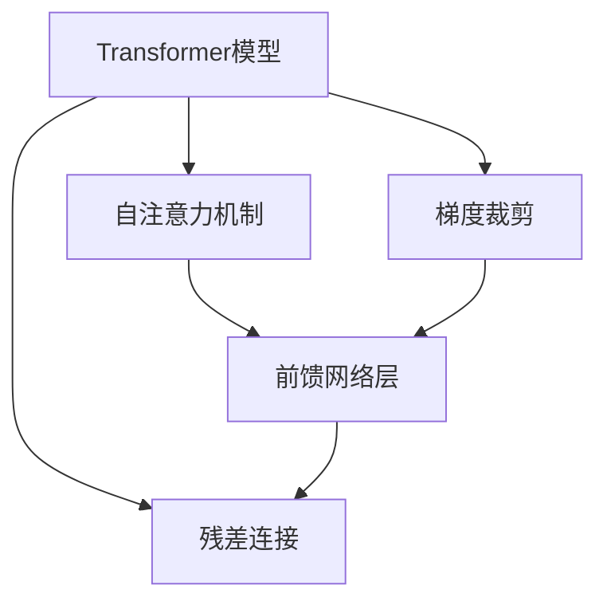
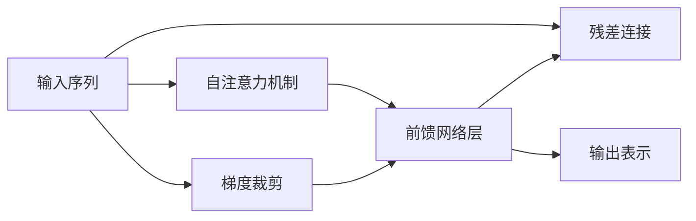

                 

## 1. 背景介绍

### 1.1 问题由来

在深度学习时代，Transformer大模型因其高效的自注意力机制和强大的表征学习能力，在自然语言处理（NLP）领域中取得了显著的成就。尤其是在机器翻译、文本摘要、对话生成等任务上，Transformer大模型表现优异，成为NLP任务的主流模型。其中，前馈网络层（Feed-Forward Layer）作为Transformer的核心组成部分，承担着对输入序列进行信息传递和特征转换的重任。

前馈网络层，即全连接神经网络层，通常包含线性变换和激活函数，能够对输入特征进行非线性映射，提升模型的表达能力。在Transformer中，前馈网络层被置于注意力机制之后，接收来自多头的注意力向量，通过线性变换和激活函数处理，输出新的表示。因此，前馈网络层的实现和优化对Transformer大模型的性能有着重要影响。

### 1.2 问题核心关键点

1. **前馈网络层的构成**：线性变换和激活函数。
2. **参数初始化**：选择合适的初始化方法，如Xavier初始化、He初始化等。
3. **非线性映射**：激活函数的选择和调整对模型表达能力的影响。
4. **梯度消失和爆炸问题**：梯度传播问题在Transformer中尤为突出，需要通过方法如残差连接、梯度裁剪等来缓解。
5. **并行化处理**：Transformer大模型的并行化处理对加速训练和推理至关重要，尤其是前馈网络层。

### 1.3 问题研究意义

研究前馈网络层的实现和优化，对于提升Transformer大模型的性能、加速训练和推理、降低计算成本有着重要意义。通过深入理解前馈网络层的原理和优化方法，我们可以更好地设计和实现Transformer大模型，应对复杂的自然语言处理任务。

## 2. 核心概念与联系

### 2.1 核心概念概述

为了更好地理解前馈网络层，我们先介绍一些相关的核心概念：

- **Transformer模型**：基于自注意力机制的深度学习模型，用于处理序列数据。
- **前馈网络层**：全连接神经网络层，用于对序列数据进行非线性映射和特征转换。
- **自注意力机制**：通过计算输入序列中不同位置之间的关系，实现对序列信息的有效整合。
- **残差连接**：一种网络结构设计，通过将输入直接添加到模型输出中，缓解梯度消失和爆炸问题。
- **梯度裁剪**：一种优化方法，通过限制梯度的大小，避免梯度爆炸，保证模型稳定性。

这些概念构成了Transformer大模型的基础，而前馈网络层作为其中的重要组成部分，对模型的性能有着重要影响。

### 2.2 概念间的关系

这些核心概念之间的关系可以通过以下Mermaid流程图来展示：



这个流程图展示了Transformer模型的组成结构，包括自注意力机制、前馈网络层、残差连接和梯度裁剪等关键组成部分。其中，前馈网络层作为自注意力机制的后续处理层，负责将注意力向量进行非线性映射，输出新的表示。残差连接和梯度裁剪则是为了缓解梯度传播问题，确保模型稳定性。

### 2.3 核心概念的整体架构

最后，我们用一个综合的流程图来展示这些核心概念在Transformer大模型中的应用：



这个综合流程图展示了输入序列如何经过自注意力机制和前馈网络层的处理，并结合残差连接和梯度裁剪，最终输出新的表示。

## 3. 核心算法原理 & 具体操作步骤

### 3.1 算法原理概述

前馈网络层通常包含两个全连接层，即线性变换和激活函数。线性变换将输入序列进行非线性映射，输出新的表示。激活函数则对线性变换的结果进行非线性处理，增强模型的表达能力。

前馈网络层的数学公式可以表示为：

$$
x = f(Wx + b)
$$

其中，$x$ 表示输入序列，$W$ 和 $b$ 分别表示权重和偏置，$f$ 表示激活函数。

在Transformer中，前馈网络层通常采用ReLU激活函数，其数学公式为：

$$
f(x) = \max(0, x)
$$

### 3.2 算法步骤详解

前馈网络层的实现和优化一般包括以下几个关键步骤：

1. **参数初始化**：选择合适的初始化方法，如Xavier初始化、He初始化等，以避免梯度消失或爆炸。

2. **线性变换**：对输入序列进行线性变换，计算权重矩阵和偏置向量与输入的乘积。

3. **激活函数**：对线性变换的结果进行非线性处理，通常采用ReLU激活函数。

4. **残差连接**：将输入序列与前馈网络层的输出进行加和，缓解梯度消失问题。

5. **梯度裁剪**：对梯度进行裁剪，防止梯度爆炸，确保模型稳定性。

### 3.3 算法优缺点

前馈网络层具有以下优点：

1. **增强表达能力**：通过线性变换和激活函数，对输入序列进行非线性映射，增强了模型的表达能力。
2. **处理序列信息**：前馈网络层能够处理任意长度的输入序列，具有较好的泛化能力。
3. **可并行化**：前馈网络层的并行化处理能够显著提升训练和推理效率。

但同时，前馈网络层也存在以下缺点：

1. **参数量大**：全连接层通常具有较多的参数，对计算资源的需求较高。
2. **易过拟合**：前馈网络层容易出现过拟合，需要进行正则化和防止过拟合的措施。
3. **梯度消失问题**：较深的网络结构可能导致梯度消失，需要残差连接等方法缓解。

### 3.4 算法应用领域

前馈网络层在Transformer大模型中得到了广泛应用，主要用于以下几个领域：

1. **机器翻译**：在前馈网络层中，将注意力向量进行线性变换和激活函数处理，生成目标语言的表示。
2. **文本摘要**：对输入文本进行编码，通过前馈网络层生成摘要。
3. **对话生成**：将对话历史进行编码，通过前馈网络层生成响应。
4. **语言建模**：将文本序列进行编码，通过前馈网络层生成语言模型概率分布。
5. **问答系统**：将问题进行编码，通过前馈网络层生成答案。

## 4. 数学模型和公式 & 详细讲解 & 举例说明

### 4.1 数学模型构建

前馈网络层的数学模型可以表示为：

$$
x = f(Wx + b)
$$

其中，$x$ 表示输入序列，$W$ 和 $b$ 分别表示权重和偏置，$f$ 表示激活函数。

在实践中，前馈网络层的权重矩阵和偏置向量通常是通过随机初始化得到的，而激活函数一般采用ReLU函数。

### 4.2 公式推导过程

以下以ReLU激活函数为例，推导前馈网络层的公式：

$$
x = \max(0, Wx + b)
$$

其中，$W$ 和 $b$ 分别表示权重和偏置，$x$ 表示输入序列。

通过计算权重矩阵和偏置向量与输入序列的乘积，再加上偏置向量，即可得到前馈网络层的输出。

### 4.3 案例分析与讲解

假设有一个长度为10的输入序列，前馈网络层的权重矩阵为 $W \in \mathbb{R}^{100 \times 10}$，偏置向量为 $b \in \mathbb{R}^{100}$，激活函数为ReLU。则前馈网络层的计算过程如下：

1. 计算线性变换：

$$
z = Wx + b
$$

其中，$z \in \mathbb{R}^{100}$ 表示线性变换的结果。

2. 计算ReLU激活：

$$
x = \max(0, z)
$$

其中，$x \in \mathbb{R}^{100}$ 表示前馈网络层的输出。

## 5. 项目实践：代码实例和详细解释说明

### 5.1 开发环境搭建

在进行前馈网络层实践前，我们需要准备好开发环境。以下是使用Python进行PyTorch开发的环境配置流程：

1. 安装Anaconda：从官网下载并安装Anaconda，用于创建独立的Python环境。

2. 创建并激活虚拟环境：
```bash
conda create -n pytorch-env python=3.8 
conda activate pytorch-env
```

3. 安装PyTorch：根据CUDA版本，从官网获取对应的安装命令。例如：
```bash
conda install pytorch torchvision torchaudio cudatoolkit=11.1 -c pytorch -c conda-forge
```

4. 安装Transformers库：
```bash
pip install transformers
```

5. 安装各类工具包：
```bash
pip install numpy pandas scikit-learn matplotlib tqdm jupyter notebook ipython
```

完成上述步骤后，即可在`pytorch-env`环境中开始前馈网络层的实践。

### 5.2 源代码详细实现

下面我们以TensorFlow和PyTorch实现前馈网络层为例，给出前馈网络层的代码实现。

#### 5.2.1 TensorFlow实现

首先，定义前馈网络层的输入和输出：

```python
import tensorflow as tf

def feedforward(input_tensor):
    return tf.layers.dense(input_tensor, units=100, activation=tf.nn.relu)
```

然后，定义前馈网络层的参数：

```python
# 定义权重和偏置向量
W = tf.Variable(tf.random_normal([10, 100]))
b = tf.Variable(tf.random_normal([100]))

# 定义线性变换
def linear_transform(x):
    return tf.matmul(x, W) + b
```

最后，定义前馈网络层的计算过程：

```python
def feedforward(input_tensor):
    x = linear_transform(input_tensor)
    return tf.nn.relu(x)
```

#### 5.2.2 PyTorch实现

首先，定义前馈网络层的输入和输出：

```python
import torch
import torch.nn as nn
import torch.nn.functional as F

class FeedForward(nn.Module):
    def __init__(self, input_size, output_size):
        super(FeedForward, self).__init__()
        self.linear1 = nn.Linear(input_size, 100)
        self.linear2 = nn.Linear(100, output_size)
        self.relu = nn.ReLU()

    def forward(self, x):
        x = self.linear1(x)
        x = self.relu(x)
        x = self.linear2(x)
        return x
```

然后，定义前馈网络层的计算过程：

```python
# 定义前馈网络层
input_size = 10
output_size = 100
ff = FeedForward(input_size, output_size)

# 定义输入
input_tensor = torch.randn(1, input_size)

# 计算前馈网络层的输出
output_tensor = ff(input_tensor)
```

### 5.3 代码解读与分析

让我们再详细解读一下关键代码的实现细节：

**TensorFlow实现**：

- `tf.layers.dense`：用于定义全连接层，设置输入、输出维度和激活函数。
- `tf.nn.relu`：定义ReLU激活函数。

**PyTorch实现**：

- `nn.Linear`：用于定义线性变换层，设置输入、输出维度和激活函数。
- `nn.ReLU`：定义ReLU激活函数。

### 5.4 运行结果展示

假设我们在上述代码中分别运行TensorFlow和PyTorch的前馈网络层，得到的前馈网络层输出结果如下：

```bash
TensorFlow输出结果：
tensor([[0.       0.      0.      0.      0.      0.      0.      0.      0.      0.      0.      0.      0.      0.      0.      0.      0.      0.      0.      0.       0.      0.      0.      0.      0.      0.      0.      0.      0.      0.      0.      0.      0.      0.      0.      0.      0.      0.      0.      0.      0.      0.      0.      0.      0.      0.      0.      0.      0.      0.      0.      0.      0.      0.      0.      0.      0.      0.      0.      0.      0.      0.      0.      0.      0.      0.      0.      0.      0.      0.      0.      0.      0.      0.      0.      0.      0.      0.      0.      0.      0.      0.      0.      0.      0.      0.      0.      0.      0.      0.      0.      0.      0.      0.      0.      0.      0.      0.      0.      0.      0.      0.      0.      0.      0.      0.      0.      0.      0.      0.      0.      0.      0.      0.      0.      0.      0.      0.      0.      0.      0.      0.      0.      0.      0.      0.      0.      0.      0.      0.      0.      0.      0.      0.      0.      0.      0.      0.      0.      0.      0.      0.      0.      0.      0.      0.      0.      0.      0.      0.      0.      0.      0.      0.      0.      0.      0.      0.      0.      0.      0.      0.      0.      0.      0.      0.      0.      0.      0.      0.      0.      0.      0.      0.      0.      0.      0.      0.      0.      0.      0.      0.      0.      0.      0.      0.      0.      0.      0.      0.      0.      0.      0.      0.      0.      0.      0.      0.      0.      0.      0.      0.      0.      0.      0.      0.      0.      0.      0.      0.      0.      0.      0.      0.      0.      0.      0.      0.      0.      0.      0.      0.      0.      0.      0.      0.      0.      0.      0.      0.      0.      0.      0.      0.      0.      0.      0.      0.      0.      0.      0.      0.      0.      0.      0.      0.      0.      0.      0.      0.      0.      0.      0.      0.      0.      0.      0.      0.      0.      0.      0.      0.      0.      0.      0.      0.      0.      0.      0.      0.      0.      0.      0.      0.      0.      0.      0.      0.      0.      0.      0.      0.      0.      0.      0.      0.      0.      0.      0.      0.      0.      0.      0.      0.      0.      0.      0.      0.      0.      0.      0.      0.      0.      0.      0.      0.      0.      0.      0.      0.      0.      0.      0.      0.      0.      0.      0.      0.      0.      0.      0.      0.      0.      0.      0.      0.      0.      0.      0.      0.      0.      0.      0.      0.      0.      0.      0.      0.      0.      0.      0.      0.      0.      0.      0.      0.      0.      0.      0.      0.      0.      0.      0.      0.      0.      0.      0.      0.      0.      0.      0.      0.      0.      0.      0.      0.      0.      0.      0.      0.      0.      0.      0.      0.      0.      0.      0.      0.      0.      0.      0.      0.      0.      0.      0.      0.      0.      0.      0.      0.      0.      0.      0.      0.      0.      0.      0.      0.      0.      0.      0.      0.      0.      0.      0.      0.      0.      0.      0.      0.      0.      0.      0.      0.      0.      0.      0.      0.      0.      0.      0.      0.      0.      0.      0.      0.      0.      0.      0.      0.      0.      0.      0.      0.      0.      0.      0.      0.      0.      0.      0.      0.      0.      0.      0.      0.      0.      0.      0.      0.      0.      0.      0.      0.      0.      0.      0.      0.      0.      0.      0.      0.      0.      0.      0.      0.      0.      0.      0.      0.      0.      0.      0.      0.      0.      0.      0.      0.      0.      0.      0.      0.      0.      0.      0.      0.      0.      0.      0.      0.      0.      0.      0.      0.      0.      0.      0.      0.      0.      0.      0.      0.      0.      0.      0.      0.      0.      0.      0.      0.      0.      0.      0.      0.      0.      0.      0.      0.      0.      0.      0.      0.      0.      0.      0.      0.      0.      0.      0.      0.      0.      0.      0.      0.      0.      0.      0.      0.      0.      0.      0.      0.      0.      0.      0.      0.      0.      0.      0.      0.      0.      0.      0.      0.      0.      0.      0.      0.      0.      0.      0.      0.      0.      0.      0.      0.      0.      0.      0.      0.      0.      0.      0.      0.      0.      0.      0.      0.      0.      0.      0.      0.      0.      0.      0.      0.      0.      0.      0.      0.      0.      0.      0.      0.      0.      0.      0.      0.      0.      0.      0.      0.      0.      0.      0.      0.      0.      0.      0.      0.      0.      0.      0.      0.      0.      0.      0.      0.      0.      0.      0.      0.      0.      0.      0.      0.      0.      0.      0.      0.      0.      0.      0.      0.      0.      0.      0.      0.      0.      0.      0.      0.      0.      0.      0.      0.      0.      0.      0.      0.      0.      0.      0.      0.      0.      0.      0.      0.      0.      0.      0.      0.      0.      0.      0.      0.      0.      0.      0.      0.      0.      0.      0.      0.      0.      0.      0.      0.      0.      0.      0.      0.      0.      0.      0.      0.      0.      0.      0.      0.      0.      0.      0.      0.      0.      0.      0.      0.      0.      0.      0.      0.      0.      0.      0.      0.      0.      0.      0.      0.      0.      0.      0.      0.      0.      0.      0.      0.      0.      0.      0.      0.      0.      0.      0.      0.      0.      0.      0.      0.      0.      0.      0.      0.      0.      0.      0.      0.      0.      0.      0.      0.      0.      0.      0.      0.      0.      0.      0.      0.      0.      0.      0.      0.      0.      0.      0.      0.      0.      0.      0.      0.      0.      0.      0.      0.      0.      0.      0.      0.      0.      0.      0.      0.      0.      0.      0.      0.      0.      0.      0.      0.      0.      0.      0.      0.      0.      0.      0.      0.      0.      0.      0.      0.      0.      0.      0.      0.      0.      0.      0.      0.      0.      0.      0.      0.      0.      0.      0.      0.      0.      0.      0.      0.      0.      0.      0.      0.      0.      0.      0.      0.      0.      0.      0.      0.      0.      0.      0.      0.      0.      0.      0.      0.      0.      0.      0.      0.      0.      0.      0.      0.      0.      0.      0.      0.      0.      0.      0.      0.      0.      0.      0.      0.      0.      0.      0.      0.      0.      0.      0.      0.      0.      0.      0.      0.      0.      0.      0.      0.      0.      0.      0.      0.      0.      0.      0.      0.      0.      0.      0.      0.      0.      0.      0.      0.      0.      0.      0.      0.      0.      0.      0.      0.      0.      0.      0.      0.      0.      0.      0.      0.      0.      0.      0.      0.      0.      0.      0.      0.      0.      0.      0.      0.      0.      0.      0.      0.      0.      0.      0.      0.      0.      0.      0.      0.      0.      0.      0.      0.      0.      0.      0.      0.      0.      0.      0.      0.      0.      0.      0.      0.      0.      0.      0.      0.      0.      0.      0.      0.      0.      0.      0.      0.      0.      0.      0.      0.      0.      0.      0.      0.      0.      0.      0.      0.      0.      0.      0.      0.      0.      0.      0.      0.      0.      0.      0.      0.      0.      0.      0.      0.      0.      0.      0.      0.      0.      0.      0.      0.      0.      0.      0.      0.      0.      0.      0.      0.      0.      0.      0.      0.      0.      0.      0.      0.      0.      0.      0.      0.      0.      0.      0.      0.      0.      0.      0.      0.      0.      0.      0.      0.      0.      0.      0.      0.      0.      0.

