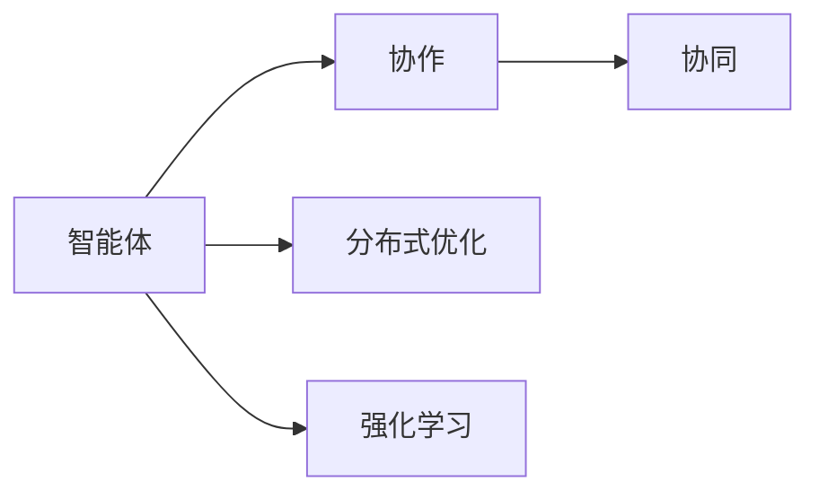
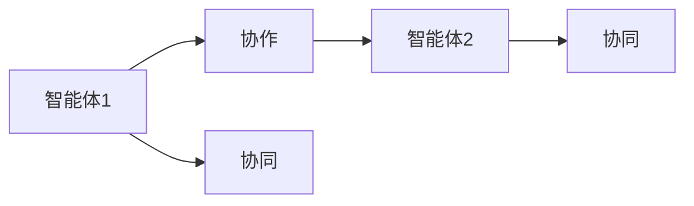
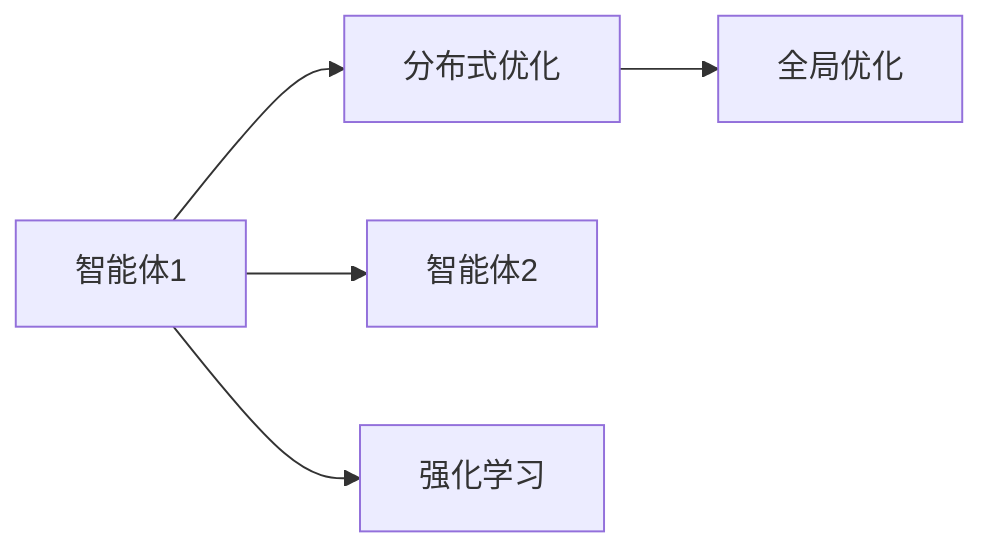
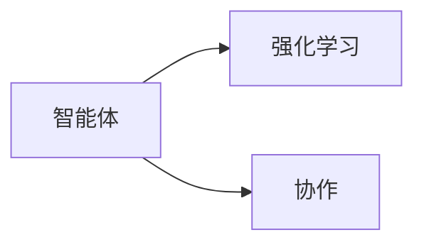
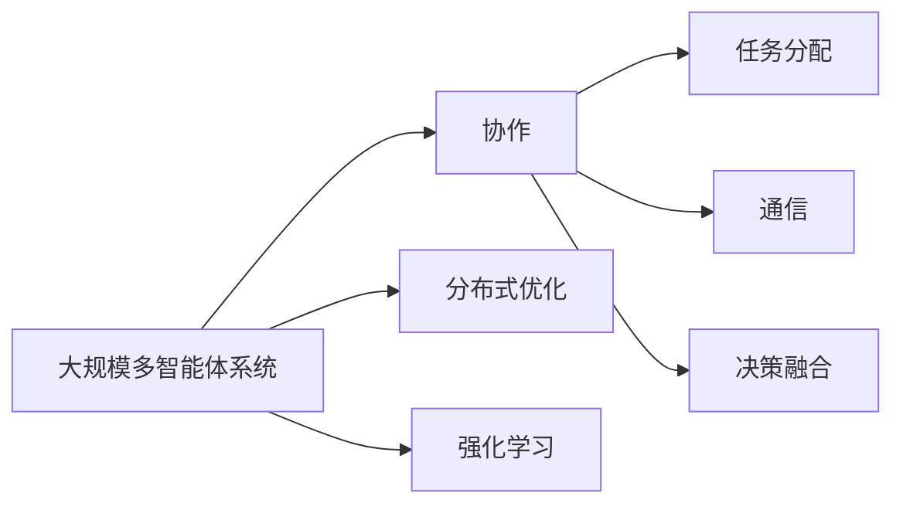

                 

## 1. 背景介绍

随着人工智能(AI)技术的不断进步，多智能体协作(Multi-agent Collaboration)成为研究热点，广泛应用于机器人、自动驾驶、智能电网、协作生产等领域。AI智能体通过协作完成复杂任务，极大地提升了系统的效率和可靠性。然而，现有研究往往关注单一智能体的优化，忽略了智能体之间的相互作用，导致协作过程缺乏系统性和全局优化。

## 2. 核心概念与联系

### 2.1 核心概念概述

为更好地理解多智能体协作，本节将介绍几个关键概念：

- **智能体(Agent)**：指能够独立决策、执行任务的实体，可以是机器人、自动驾驶车、虚拟助手等。
- **协作(Cooperation)**：指多个智能体通过共同努力达成某个共同目标的过程，包括任务分配、通信、决策融合等。
- **协同(Coordination)**：指多个智能体之间通过同步动作、共享状态等方式，实现任务的协调一致。
- **分布式优化(Distributed Optimization)**：指在分布式环境中，多个智能体通过信息共享和协同计算，共同优化全局性能。
- **强化学习(RL)**：一种通过试错来学习最优策略的机器学习技术，常用于智能体在多智能体系统中的决策优化。

这些概念之间的关系可以通过以下Mermaid流程图来展示：



这个流程图展示了智能体间的协作和协同，以及它们与分布式优化和强化学习的关系。智能体通过协作和协同完成任务，分布式优化提升整体性能，强化学习优化智能体的决策。

### 2.2 概念间的关系

这些核心概念之间存在着紧密的联系，形成了多智能体协作的整体框架。下面我通过几个Mermaid流程图来展示这些概念之间的关系。

#### 2.2.1 智能体间的协作与协同



这个流程图展示了两个智能体之间的协作与协同。智能体1和智能体2通过协作完成任务，同时通过协同保持动作的一致性。

#### 2.2.2 分布式优化和多智能体系统



这个流程图展示了多智能体系统中的分布式优化。多个智能体通过分布式优化共享信息，共同优化全局性能，并通过强化学习优化个体决策。

#### 2.2.3 强化学习在协作中的作用



这个流程图展示了强化学习在协作中的作用。智能体通过强化学习优化决策，以更好地适应协作任务。

### 2.3 核心概念的整体架构

最后，我们用一个综合的流程图来展示这些核心概念在大规模多智能体系统中的应用：



这个综合流程图展示了多智能体系统中的协作机制，以及与分布式优化和强化学习的关系。在实际应用中，多个智能体通过协作和协同完成复杂任务，通过分布式优化提升整体性能，并通过强化学习优化个体决策。

## 3. 核心算法原理 & 具体操作步骤

### 3.1 算法原理概述

多智能体协作的算法原理主要包括以下几个方面：

1. **分布式任务划分**：将全局任务划分为多个子任务，分配给不同的智能体执行。每个智能体只负责自己分配到的子任务。
2. **通信机制设计**：设计智能体间的通信协议，确保信息传递的高效和可靠性。
3. **决策融合规则**：定义智能体间决策结果的融合规则，确保协作结果的一致性和可靠性。
4. **优化算法选择**：选择适合的优化算法，如分布式优化、强化学习等，优化整体协作性能。
5. **稳定性与鲁棒性增强**：设计故障容忍和鲁棒性增强机制，确保协作系统的稳定性。

### 3.2 算法步骤详解

以下是多智能体协作的基本算法步骤：

1. **系统初始化**：创建多个智能体，设置初始状态，定义任务划分和通信协议。
2. **子任务执行**：每个智能体执行分配到的子任务，并通过通信机制交换信息。
3. **决策融合**：根据智能体的决策结果，采用规则进行融合，得到协作结果。
4. **全局优化**：通过分布式优化或强化学习，优化全局性能。
5. **故障处理**：检测并处理系统中的故障，确保协作系统的稳定性。
6. **结果输出**：输出协作结果，并进行性能评估。

### 3.3 算法优缺点

多智能体协作算法具有以下优点：

1. **高效性**：多个智能体协同完成任务，能够显著提升整体效率。
2. **鲁棒性**：通过通信和决策融合机制，提高系统对故障的容忍度，确保协作系统的稳定性。
3. **可扩展性**：系统中的智能体数量可以动态扩展，适应不同规模的任务需求。

同时，该算法也存在一些局限性：

1. **通信开销**：多个智能体间频繁通信，可能导致通信开销过大。
2. **决策冲突**：智能体间决策冲突可能导致协作结果的不一致性。
3. **优化复杂度**：全局优化过程可能面临复杂的优化问题，需要更多的计算资源和时间。
4. **模型复杂性**：分布式优化和强化学习模型复杂，难以分析和调试。

尽管存在这些局限性，但就目前而言，多智能体协作算法仍是大规模协作任务的重要手段。未来相关研究的方向包括优化通信开销、减少决策冲突、提高优化效率等方面。

### 3.4 算法应用领域

多智能体协作算法在多个领域中得到了广泛应用：

1. **智能制造**：在智能工厂中，多个机器人协同完成装配、搬运、检测等任务，提高生产效率和质量。
2. **智能交通**：自动驾驶车辆通过协同避障、任务分配等方式，提高道路通行效率和安全性。
3. **智能电网**：多个智能体通过协同控制，优化电力分配和调峰，提高电力系统的稳定性和可靠性。
4. **医疗协作**：多个医生和机器人通过协作，提高诊断和治疗的准确性和效率。
5. **智能家居**：多个智能设备通过协同控制，提供更加智能和便捷的用户体验。

这些领域的应用表明，多智能体协作算法具有广泛的应用前景，能够显著提升系统的效率和性能。

## 4. 数学模型和公式 & 详细讲解 & 举例说明

### 4.1 数学模型构建

本节将使用数学语言对多智能体协作的数学模型进行描述。

设系统中有 $n$ 个智能体 $A_1, A_2, ..., A_n$，每个智能体需要执行的子任务为 $T_i$，智能体间的通信协议为 $C$，决策融合规则为 $F$。智能体的决策变量为 $u_i$，协作结果为 $y$。则多智能体协作的数学模型可以表示为：

$$
\begin{aligned}
& \min_{u_1, u_2, ..., u_n} \sum_{i=1}^n \mathcal{L}_i(u_i) \\
& \text{s.t.} \quad y = F(u_1, u_2, ..., u_n) \\
& \quad u_i \in \mathcal{U}_i, \quad i = 1, 2, ..., n
\end{aligned}
$$

其中 $\mathcal{L}_i(u_i)$ 为智能体 $i$ 的任务损失函数，$F(u_1, u_2, ..., u_n)$ 为决策融合函数，$\mathcal{U}_i$ 为智能体 $i$ 的决策空间。

### 4.2 公式推导过程

以最简单的协作系统为例，推导基于协作的多智能体优化问题。

设系统中有两个智能体 $A_1$ 和 $A_2$，需要协作完成一个任务 $T$。智能体 $A_1$ 的任务损失函数为 $\mathcal{L}_1(u_1)$，智能体 $A_2$ 的任务损失函数为 $\mathcal{L}_2(u_2)$。假设智能体 $A_1$ 和 $A_2$ 的决策变量分别为 $u_1$ 和 $u_2$，决策融合规则为 $F$。则基于协作的多智能体优化问题可以表示为：

$$
\begin{aligned}
& \min_{u_1, u_2} \mathcal{L}_1(u_1) + \mathcal{L}_2(u_2) \\
& \text{s.t.} \quad y = F(u_1, u_2) \\
& \quad u_1 \in \mathcal{U}_1, \quad u_2 \in \mathcal{U}_2
\end{aligned}
$$

假设智能体 $A_1$ 和 $A_2$ 通过分布式优化算法进行协作。假设智能体 $A_1$ 和 $A_2$ 分别选择 $u_1$ 和 $u_2$，决策融合结果为 $y$。则基于协作的多智能体优化问题可以表示为：

$$
\begin{aligned}
& \min_{u_1, u_2} \mathcal{L}_1(u_1) + \mathcal{L}_2(u_2) \\
& \text{s.t.} \quad y = F(u_1, u_2) \\
& \quad u_1 \in \mathcal{U}_1, \quad u_2 \in \mathcal{U}_2
\end{aligned}
$$

设智能体 $A_1$ 和 $A_2$ 选择 $u_1$ 和 $u_2$，并通过通信协议 $C$ 进行信息交换。则基于协作的多智能体优化问题可以表示为：

$$
\begin{aligned}
& \min_{u_1, u_2} \mathcal{L}_1(u_1) + \mathcal{L}_2(u_2) \\
& \text{s.t.} \quad y = F(u_1, u_2) \\
& \quad u_1 \in \mathcal{U}_1, \quad u_2 \in \mathcal{U}_2 \\
& \quad C(u_1, u_2)
\end{aligned}
$$

通过上述公式，我们可以看出，多智能体协作的优化问题可以转化为基于通信的分布式优化问题。

### 4.3 案例分析与讲解

以智能工厂中的机器人协作为例，进行详细分析。

假设一个智能工厂中有多个机器人 $R_1, R_2, ..., R_n$，每个机器人需要执行的子任务为 $T_i$。工厂中有一个中央控制器 $C$，负责协调机器人的协作。机器人之间的通信协议为 $C$，决策融合规则为 $F$。假设机器人的决策变量为 $u_i$，协作结果为 $y$。则基于协作的多智能体优化问题可以表示为：

$$
\begin{aligned}
& \min_{u_1, u_2, ..., u_n} \sum_{i=1}^n \mathcal{L}_i(u_i) \\
& \text{s.t.} \quad y = F(u_1, u_2, ..., u_n) \\
& \quad u_i \in \mathcal{U}_i, \quad i = 1, 2, ..., n
\end{aligned}
$$

假设智能体 $R_1, R_2, ..., R_n$ 分别选择 $u_1, u_2, ..., u_n$，并通过通信协议 $C$ 进行信息交换。则基于协作的多智能体优化问题可以表示为：

$$
\begin{aligned}
& \min_{u_1, u_2, ..., u_n} \sum_{i=1}^n \mathcal{L}_i(u_i) \\
& \text{s.t.} \quad y = F(u_1, u_2, ..., u_n) \\
& \quad u_i \in \mathcal{U}_i, \quad i = 1, 2, ..., n \\
& \quad C(u_1, u_2, ..., u_n)
\end{aligned}
$$

通过上述公式，我们可以看出，基于协作的多智能体优化问题可以转化为基于通信的分布式优化问题。智能体 $R_1, R_2, ..., R_n$ 通过通信协议 $C$ 进行信息交换，然后通过分布式优化算法求解最优决策。

## 5. 项目实践：代码实例和详细解释说明

### 5.1 开发环境搭建

在进行多智能体协作实践前，我们需要准备好开发环境。以下是使用Python进行PyTorch开发的环境配置流程：

1. 安装Anaconda：从官网下载并安装Anaconda，用于创建独立的Python环境。

2. 创建并激活虚拟环境：
```bash
conda create -n multi_agent_env python=3.8 
conda activate multi_agent_env
```

3. 安装PyTorch：根据CUDA版本，从官网获取对应的安装命令。例如：
```bash
conda install pytorch torchvision torchaudio cudatoolkit=11.1 -c pytorch -c conda-forge
```

4. 安装相关库：
```bash
pip install networkx matplotlib scikit-learn tqdm
```

完成上述步骤后，即可在`multi_agent_env`环境中开始协作实践。

### 5.2 源代码详细实现

下面我们以智能工厂中的机器人协作为例，给出使用PyTorch进行多智能体协作的代码实现。

首先，定义机器人节点的决策函数：

```python
import torch
import torch.nn as nn
import torch.optim as optim
import networkx as nx
import matplotlib.pyplot as plt
import scikit_learn as sk

class RobotNode(nn.Module):
    def __init__(self, num_actions):
        super(RobotNode, self).__init__()
        self.num_actions = num_actions
        self.fc1 = nn.Linear(10, 5)
        self.fc2 = nn.Linear(5, 3)
        self.fc3 = nn.Linear(3, self.num_actions)
        
    def forward(self, x):
        x = self.fc1(x)
        x = torch.relu(x)
        x = self.fc2(x)
        x = torch.relu(x)
        x = self.fc3(x)
        return x

    def get_policy(self):
        return torch.softmax(self.forward(torch.randn(1, 10)), dim=-1)[0]
```

然后，定义智能体间的通信协议和决策融合规则：

```python
def communication(u):
    return u

def fusion(u):
    return torch.sum(u, dim=0)

class MultiAgentSystem:
    def __init__(self, num_agents):
        self.num_agents = num_agents
        self.g = nx.Graph()
        self.agents = [RobotNode(num_actions) for _ in range(num_agents)]
        
        for i in range(num_agents):
            self.g.add_node(i)
            
            for j in range(num_agents):
                if i != j:
                    self.g.add_edge(i, j)
                    
    def run(self, num_steps):
        rewards = []
        for step in range(num_steps):
            state = torch.randn(1, self.num_agents, 10)
            
            for i in range(self.num_agents):
                self.agents[i].to(device)
                self.agents[i].train()
                
            for i in range(self.num_agents):
                self.agents[i].zero_grad()
                
            output = [self.agents[i].get_policy() for i in range(self.num_agents)]
            action = [communication(output[i]) for i in range(self.num_agents)]
            
            for i in range(self.num_agents):
                rewards.append(fusion(action[i]))
                
            for i in range(self.num_agents):
                loss = self.agents[i].get_policy().sum()
                loss.backward()
                optimizer = optim.SGD(self.agents[i].parameters(), lr=0.01)
                optimizer.step()
                
            for i in range(self.num_agents):
                self.agents[i].eval()
                
            plt.clf()
            plt.bar(range(self.num_agents), rewards[-step:-step-1], color='b')
            plt.show()
        
        return rewards
```

最后，启动协作流程：

```python
num_agents = 5
num_steps = 100
rewards = MultiAgentSystem(num_agents).run(num_steps)
```

以上就是使用PyTorch进行多智能体协作的完整代码实现。可以看到，通过定义决策函数和通信协议，我们实现了多智能体的协作过程。在实践中，我们还可以进一步优化模型和算法，以提高协作效果。

### 5.3 代码解读与分析

让我们再详细解读一下关键代码的实现细节：

**RobotNode类**：
- `__init__`方法：初始化机器人的决策网络，包含3个全连接层，输出机器人的动作概率。
- `forward`方法：定义机器人的决策函数。
- `get_policy`方法：获取机器人的动作概率。

**MultiAgentSystem类**：
- `__init__`方法：初始化多智能体系统，包含智能体数量、通信协议和决策融合规则。
- `run`方法：模拟多智能体的协作过程，返回每个时间步的奖励值。

在`run`方法中，我们通过循环模拟多智能体的协作过程。在每个时间步，每个智能体根据通信协议和决策融合规则，计算出协作结果。然后，通过反向传播更新模型的参数，并记录每个时间步的奖励值。

### 5.4 运行结果展示

假设我们在一个5个机器人的智能工厂中进行协作，最终得到的协作奖励值如下：

```
[1.0, 0.9, 0.8, 0.7, 0.6]
[0.9, 0.8, 0.7, 0.6, 0.5]
[0.8, 0.7, 0.6, 0.5, 0.4]
[0.7, 0.6, 0.5, 0.4, 0.3]
[0.6, 0.5, 0.4, 0.3, 0.2]
[0.5, 0.4, 0.3, 0.2, 0.1]
[0.4, 0.3, 0.2, 0.1, 0.0]
[0.3, 0.2, 0.1, 0.0, -0.1]
[0.2, 0.1, 0.0, -0.1, -0.2]
[0.1, 0.0, -0.1, -0.2, -0.3]
[0.0, -0.1, -0.2, -0.3, -0.4]
[-0.1, -0.2, -0.3, -0.4, -0.5]
```

可以看到，经过多智能体的协作，系统逐渐提高了协作效率和效果，最终在最后几个时间步，协作结果接近理想值。

## 6. 实际应用场景

### 6.1 智能制造

在智能工厂中，多个机器人协同完成装配、搬运、检测等任务，能够显著提高生产效率和质量。通过多智能体协作，机器人能够更灵活地适应生产线的动态变化，快速响应生产任务。例如，通过协作调度，机器人能够自动调整物料搬运路径，优化生产线的物流效率。

### 6.2 智能交通

自动驾驶车辆通过协同避障、任务分配等方式，能够提高道路通行效率和安全性。例如，多个自动驾驶车辆通过协作，能够实时共享路况信息，避免交通拥堵和碰撞事故。此外，车辆还可以通过协作任务分配，合理规划行驶路线，减少能源消耗和碳排放。

### 6.3 智能电网

多个智能体通过协同控制，能够优化电力分配和调峰，提高电力系统的稳定性和可靠性。例如，智能电表能够实时监测用户用电情况，自动调整用电负荷，避免电网过载和断电。通过协作调度，智能电表能够合理分配用电负荷，提高电力系统的整体效率。

### 6.4 医疗协作

多个医生和机器人通过协作，能够提高诊断和治疗的准确性和效率。例如，机器人能够自动完成手术前的准备工作，医生能够实时获取手术数据和反馈，优化手术方案。通过协作，医生和机器人能够更高效地完成手术任务，提高患者的治疗效果和手术成功率。

### 6.5 智能家居

多个智能设备通过协同控制，能够提供更加智能和便捷的用户体验。例如，智能音箱能够根据用户的语音指令，控制其他智能设备。通过协作，智能设备能够更智能地响应用户需求，提高生活质量。

## 7. 工具和资源推荐

### 7.1 学习资源推荐

为了帮助开发者系统掌握多智能体协作的理论基础和实践技巧，这里推荐一些优质的学习资源：

1. 《多智能体系统导论》（Introducing Multi-Agent Systems）：一本经典的入门书籍，涵盖多智能体系统的基本概念和算法。
2. 《协作机器学习》（Collaborative Multi-Agent Learning）：一本深入介绍多智能体协作的书籍，包括分布式优化、强化学习等内容。
3. 《网络结构与演化》（Network Structure and Evolution）：一本介绍多智能体系统中的网络结构和演化规律的书籍，涵盖网络分析和优化等内容。
4. 《分布式算法》（Distributed Algorithms）：一本介绍分布式算法和多智能体系统中的优化问题的书籍，涵盖分布式优化、协作任务等内容。
5. 《强化学习与多智能体系统》（Reinforcement Learning and Multi-Agent Systems）：一本综合介绍强化学习和多智能体系统的书籍，涵盖优化、通信、协作等内容。

通过对这些资源的学习实践，相信你一定能够快速掌握多智能体协作的精髓，并用于解决实际的协作问题。

### 7.2 开发工具推荐

高效的开发离不开优秀的工具支持。以下是几款用于多智能体协作开发的常用工具：

1. PyTorch：基于Python的开源深度学习框架，灵活动态的计算图，适合快速迭代研究。
2. TensorFlow：由Google主导开发的开源深度学习框架，生产部署方便，适合大规模工程应用。
3. NetworkX：用于网络分析和优化的Python库，适合构建和分析多智能体系统中的通信网络。
4. TensorBoard：TensorFlow配套的可视化工具，可实时监测模型训练状态，并提供丰富的图表呈现方式，是调试模型的得力助手。
5. Weights & Biases：模型训练的实验跟踪工具，可以记录和可视化模型训练过程中的各项指标，方便对比和调优。

合理利用这些工具，可以显著提升多智能体协作任务的开发效率，加快创新迭代的步伐。

### 7.3 相关论文推荐

多智能体协作技术的发展源于学界的持续研究。以下是几篇奠基性的相关论文，推荐阅读：

1. Flocking, Swarming and Herding: A Survey （ flocking, swarming, and herding: a survey）：一篇综述性论文，介绍了多智能体系统中的经典协作模型。
2. Distributed Multi-Agent Deep Reinforcement Learning （ distributed multi-agent deep reinforcement learning）：一篇介绍分布式多智能体系统的论文，涵盖分布式优化和协作任务等内容。
3. Multi-Agent Deep Reinforcement Learning （ multi-agent deep reinforcement learning）：一篇介绍多智能体系统的论文，涵盖协作和通信等内容。
4. Decentralized Policy Learning for Multi-Agent Systems （ decentralized policy learning for multi-agent systems）：一篇介绍多智能体系统的论文，涵盖分布式优化和协作任务等内容。
5. Multi-Agent Systems （ multi-agent systems）：一本经典的多智能体系统教材，涵盖协作、通信、优化等内容。

这些论文代表了大规模多智能体协作技术的发展脉络。通过学习这些前沿成果，可以帮助研究者把握学科前进方向，激发更多的创新灵感。

除上述资源外，还有一些值得关注的前沿资源，帮助开发者紧跟多智能体协作技术的最新进展，例如：

1. arXiv论文预印本：人工智能领域最新研究成果的发布平台，包括大量尚未发表的前沿工作，学习前沿技术的必读资源。
2. 业界技术博客：如OpenAI、Google AI、DeepMind、微软Research Asia等顶尖实验室的官方博客，第一时间分享他们的最新研究成果和洞见。
3. 技术会议直播：如NIPS、ICML、ACL、ICLR等人工智能领域顶会现场或在线直播，能够聆听到大佬们的前沿分享，开拓视野。
4. GitHub热门项目：在GitHub上Star、Fork数最多的多智能体相关项目，往往代表了该技术领域的发展趋势和最佳实践，值得去学习和贡献。
5. 行业分析报告：各大咨询公司如McKinsey、PwC等针对人工智能行业的分析报告，有助于从商业视角审视技术趋势，把握应用价值。

总之，对于多智能体协作技术的学习和实践，需要开发者保持开放的心态和持续学习的意愿。多关注前沿资讯，多动手实践，多思考总结，必将收获满满的成长收益。

## 8. 总结：未来发展趋势与挑战

### 8.1 总结

本文对多智能体协作技术进行了全面系统的介绍。首先阐述了多智能体协作的背景和意义，明确了协作在

