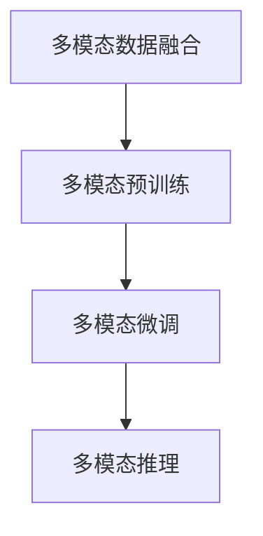
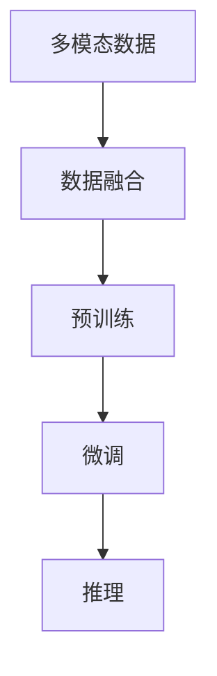
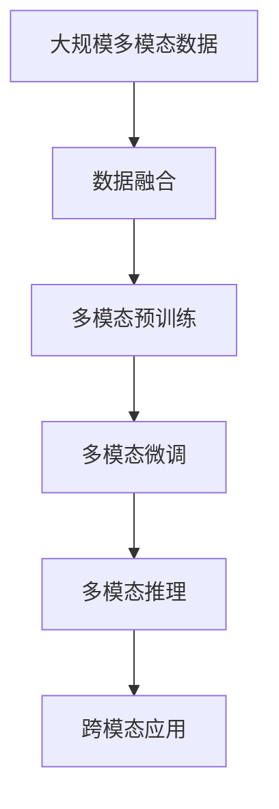

                 

# 多模态大模型：技术原理与实战 多模态大模型在出行与物流领域中的应用

> 关键词：多模态大模型,Transformer,BERT,出行领域,物流领域,计算机视觉,自然语言处理,NLP,多模态融合,应用实战

## 1. 背景介绍

### 1.1 问题由来
近年来，随着深度学习技术的迅猛发展，特别是Transformer架构和大语言模型的普及，大模型在各个领域的应用日益广泛。它们能够在大规模无标签数据上进行自监督预训练，学习到强大的语言和图像等表征能力，并在有标签数据上进行微调，提升在特定任务上的性能。然而，当前的大模型多聚焦于单一模态，难以充分挖掘和利用数据中的多维信息，难以处理更加复杂的现实世界问题。

多模态大模型作为一种新兴技术，能够同时利用文本、图像、语音等多种模态数据进行联合训练，提升对现实世界的理解力和建模能力。相比于单一模态的大模型，多模态大模型具有更强的泛化能力和适应性，能够处理更加复杂的任务，如自动驾驶、智慧交通、智能物流等。

### 1.2 问题核心关键点
多模态大模型技术的研究核心在于以下几个关键点：
1. **多模态数据融合**：如何有效融合来自不同模态的数据，形成更全面的表征。
2. **多模态预训练**：如何利用多模态数据进行自监督预训练，学习多模态的共同特征。
3. **多模态微调**：如何在多模态数据上进行微调，提升模型在特定任务上的性能。
4. **多模态推理**：如何在多模态数据上执行推理任务，实现跨模态的预测和决策。

### 1.3 问题研究意义
多模态大模型的研究对于拓展大模型的应用范围，提升模型在复杂任务上的性能，加速人工智能技术的产业化进程，具有重要意义：
1. **数据利用效率更高**：多模态大模型能够更好地利用和融合多样化的数据，提升数据利用效率。
2. **模型性能更优**：多模态大模型能够学习到更丰富的语义和上下文信息，提升模型在特定任务上的性能。
3. **任务覆盖面更广**：多模态大模型能够处理更复杂的任务，涵盖自动驾驶、智慧交通、智能物流等多个领域。
4. **技术创新驱动**：多模态大模型的研究催生了新的研究方向，如跨模态学习、多模态融合等，推动了人工智能技术的发展。
5. **应用价值更大**：多模态大模型能够赋能各个行业，提升效率、降低成本，为经济社会带来新的价值。

## 2. 核心概念与联系

### 2.1 核心概念概述

为更好地理解多模态大模型的技术原理，本节将介绍几个关键的概念：

- **多模态数据融合(Multimodal Data Fusion)**：将来自不同模态的数据（如文本、图像、语音）融合在一起，形成更全面的表征。多模态数据融合是实现多模态大模型的基础。
- **多模态预训练(Multimodal Pre-training)**：利用多模态数据进行自监督预训练，学习多模态数据的共同特征。多模态预训练是提升多模态大模型性能的关键步骤。
- **多模态微调(Multimodal Fine-tuning)**：在多模态数据上进行有监督的微调，提升模型在特定任务上的性能。多模态微调是实现多模态大模型应用的核心方法。
- **多模态推理(Multimodal Inference)**：在多模态数据上执行推理任务，实现跨模态的预测和决策。多模态推理是多模态大模型的最终目标。

这些核心概念之间的逻辑关系可以通过以下Mermaid流程图来展示：



这个流程图展示了大模型从数据融合、预训练到微调、推理的完整过程：

1. 多模态数据融合是基础，通过将不同模态的数据融合在一起，形成更全面的表征。
2. 多模态预训练是关键，利用多模态数据进行自监督预训练，学习多模态数据的共同特征。
3. 多模态微调是核心，在多模态数据上进行有监督的微调，提升模型在特定任务上的性能。
4. 多模态推理是最终目标，在多模态数据上执行推理任务，实现跨模态的预测和决策。

### 2.2 概念间的关系

这些核心概念之间存在着紧密的联系，形成了多模态大模型的完整生态系统。下面我通过几个Mermaid流程图来展示这些概念之间的关系。

#### 2.2.1 多模态大模型的学习范式



这个流程图展示了大模型从数据融合、预训练到微调、推理的完整学习范式：

1. 多模态数据是基础，通过数据融合形成更全面的表征。
2. 多模态预训练是关键，利用多模态数据进行自监督预训练，学习多模态数据的共同特征。
3. 多模态微调是核心，在多模态数据上进行有监督的微调，提升模型在特定任务上的性能。
4. 多模态推理是最终目标，在多模态数据上执行推理任务，实现跨模态的预测和决策。

#### 2.2.2 多模态大模型的结构

```mermaid
graph TB
    A[文本] --> B[图像] --> C[语音] --> D[Multimodal Model]
    A -- B -- C -- D
```

这个流程图展示了多模态大模型的基本结构：

1. 文本、图像、语音等多种模态的数据输入到模型中。
2. 不同模态的数据通过特定的编码器进行转换，形成高维的特征表示。
3. 多模态的特征表示通过特定的融合器进行融合，形成更全面的表征。
4. 融合后的特征表示进入分类器或其他任务特定的模块进行微调。

#### 2.2.3 多模态大模型的应用

```mermaid
graph TB
    A[自动驾驶] --> B[智慧交通] --> C[智能物流]
    A -- B -- C
```

这个流程图展示了多模态大模型在自动驾驶、智慧交通、智能物流等场景中的应用：

1. 自动驾驶系统利用多模态数据进行感知和决策。
2. 智慧交通系统利用多模态数据进行交通流量分析和调度。
3. 智能物流系统利用多模态数据进行货物跟踪和路径优化。

### 2.3 核心概念的整体架构

最后，我们用一个综合的流程图来展示这些核心概念在大模型微调过程中的整体架构：



这个综合流程图展示了从数据融合到预训练、微调、推理，再到跨模态应用的完整过程：

1. 多模态数据是基础，通过数据融合形成更全面的表征。
2. 多模态预训练是关键，利用多模态数据进行自监督预训练，学习多模态数据的共同特征。
3. 多模态微调是核心，在多模态数据上进行有监督的微调，提升模型在特定任务上的性能。
4. 多模态推理是最终目标，在多模态数据上执行推理任务，实现跨模态的预测和决策。
5. 跨模态应用是多模态大模型的最终目标，应用于实际的多模态场景中，提升系统的智能化水平。

通过这些流程图，我们可以更清晰地理解多模态大模型的核心概念和架构，为后续深入讨论具体的技术细节奠定基础。

## 3. 核心算法原理 & 具体操作步骤
### 3.1 算法原理概述

多模态大模型的核心算法原理基于Transformer架构和自监督学习。其核心思想是：利用多模态数据进行联合训练，学习多模态的共同特征，然后在特定任务上进行微调，提升模型在特定任务上的性能。

多模态大模型的主要步骤如下：

1. **数据准备**：收集不同模态的数据，如文本、图像、语音等。
2. **数据融合**：利用数据融合技术将不同模态的数据融合在一起，形成更全面的表征。
3. **预训练**：利用多模态数据进行自监督预训练，学习多模态数据的共同特征。
4. **微调**：在特定任务上进行微调，提升模型在特定任务上的性能。
5. **推理**：在多模态数据上执行推理任务，实现跨模态的预测和决策。

### 3.2 算法步骤详解

#### 3.2.1 数据准备
数据准备是构建多模态大模型的第一步，主要包括以下几个关键步骤：

1. **数据收集**：收集不同模态的数据，如文本、图像、语音等。确保数据的多样性和全面性，以便模型能够学习到更多的特征。
2. **数据标注**：对数据进行标注，如文本的分类、图像的标注等。标注数据的准确性直接影响模型的性能。
3. **数据预处理**：对数据进行标准化、归一化、分割等预处理，以便于模型进行训练和推理。

#### 3.2.2 数据融合
数据融合是构建多模态大模型的核心步骤，主要包括以下几个关键步骤：

1. **特征提取**：利用不同的编码器对不同模态的数据进行特征提取，形成高维的特征表示。
2. **特征对齐**：将不同模态的特征表示进行对齐，以便于后续的融合操作。
3. **特征融合**：利用特定的融合器（如Attention机制）将不同模态的特征表示进行融合，形成更全面的表征。

#### 3.2.3 预训练
预训练是多模态大模型的关键步骤，主要包括以下几个关键步骤：

1. **自监督任务设计**：设计多模态的自监督学习任务，如文本的掩码语言模型、图像的对比学习等。
2. **多模态模型训练**：利用多模态数据进行自监督预训练，学习多模态数据的共同特征。
3. **模型评估**：在验证集上评估预训练模型的性能，调整模型参数，提升模型的泛化能力。

#### 3.2.4 微调
微调是多模态大模型的核心步骤，主要包括以下几个关键步骤：

1. **任务适配层设计**：根据任务类型，设计合适的输出层和损失函数。
2. **微调参数更新**：利用多模态数据进行微调，更新模型的参数，提升模型在特定任务上的性能。
3. **验证集评估**：在验证集上评估微调后的模型性能，调整超参数，优化模型。

#### 3.2.5 推理
推理是多模态大模型的最终目标，主要包括以下几个关键步骤：

1. **多模态数据输入**：将不同模态的数据输入到模型中。
2. **特征提取与融合**：利用多模态数据进行特征提取和融合，形成更全面的表征。
3. **推理任务执行**：在多模态数据上执行推理任务，如文本分类、图像识别等，输出预测结果。

### 3.3 算法优缺点

多模态大模型具有以下优点：
1. **多模态数据利用效率更高**：多模态大模型能够同时利用和融合不同模态的数据，提升数据利用效率。
2. **模型性能更优**：多模态大模型能够学习到更丰富的语义和上下文信息，提升模型在特定任务上的性能。
3. **任务覆盖面更广**：多模态大模型能够处理更复杂的任务，涵盖自动驾驶、智慧交通、智能物流等多个领域。
4. **技术创新驱动**：多模态大模型的研究催生了新的研究方向，如跨模态学习、多模态融合等，推动了人工智能技术的发展。

多模态大模型也存在以下缺点：
1. **数据成本较高**：多模态数据的收集和标注成本较高，特别是在处理复杂任务时，数据获取和标注更加困难。
2. **模型复杂度更高**：多模态大模型的结构和参数量较大，训练和推理成本较高。
3. **推理速度较慢**：多模态大模型在推理时需要进行多模态数据的融合和推理，推理速度较慢。
4. **算法复杂性更高**：多模态大模型的算法设计比单一模态模型更复杂，需要更多的实验和调试。

尽管存在这些缺点，但多模态大模型在处理复杂任务、提升模型性能、拓展应用场景方面具有巨大的潜力，未来的研究和应用前景广阔。

### 3.4 算法应用领域

多模态大模型已经在多个领域得到了广泛应用，例如：

- **自动驾驶**：自动驾驶系统利用多模态数据进行感知和决策，如通过摄像头、雷达、激光雷达等感知周围环境，结合GPS、IMU等传感器数据进行路径规划和控制。
- **智慧交通**：智慧交通系统利用多模态数据进行交通流量分析和调度，如利用摄像头、交通信号灯、传感器等数据进行实时分析和优化。
- **智能物流**：智能物流系统利用多模态数据进行货物跟踪和路径优化，如利用GPS、RFID、图像识别等技术进行货物追踪和路径规划。

除了上述这些领域外，多模态大模型还被创新性地应用于更多场景中，如医疗影像分析、视频监控、人机交互等，为多模态数据的处理提供了新的解决方案。

## 4. 数学模型和公式 & 详细讲解 & 举例说明
### 4.1 数学模型构建

在多模态大模型中，数学模型的构建主要基于Transformer架构和自监督学习。其核心思想是：利用多模态数据进行联合训练，学习多模态数据的共同特征，然后在特定任务上进行微调，提升模型在特定任务上的性能。

记多模态数据为 $X = (x_t, x_i, x_a)$，其中 $x_t$ 表示文本数据，$x_i$ 表示图像数据，$x_a$ 表示音频数据。多模态大模型 $M_{\theta}$ 的输入为 $X$，输出为 $y$。

定义多模态数据融合后的特征表示为 $z$，则多模态大模型的数学模型为：

$$
\begin{aligned}
z &= f_{\text{fusion}}(x_t, x_i, x_a) \\
y &= M_{\theta}(z)
\end{aligned}
$$

其中 $f_{\text{fusion}}$ 为数据融合函数，$M_{\theta}$ 为多模态大模型。

### 4.2 公式推导过程

以文本分类任务为例，多模态大模型的训练过程如下：

1. **数据准备**：收集文本数据和图像数据，并进行标注和预处理。
2. **数据融合**：利用文本和图像数据进行特征提取和融合，形成多模态特征表示 $z$。
3. **预训练**：利用多模态数据进行自监督预训练，学习多模态数据的共同特征。
4. **微调**：在特定任务上进行微调，更新模型参数，提升模型在特定任务上的性能。
5. **推理**：在多模态数据上执行推理任务，输出预测结果。

#### 4.2.1 数据融合

数据融合是构建多模态大模型的关键步骤，主要包括以下几个关键步骤：

1. **特征提取**：利用文本和图像数据进行特征提取，形成高维的特征表示。
2. **特征对齐**：将文本和图像特征进行对齐，以便于后续的融合操作。
3. **特征融合**：利用特定的融合器（如Attention机制）将文本和图像特征进行融合，形成更全面的表征。

#### 4.2.2 预训练

预训练是多模态大模型的关键步骤，主要包括以下几个关键步骤：

1. **自监督任务设计**：设计多模态的自监督学习任务，如文本的掩码语言模型、图像的对比学习等。
2. **多模态模型训练**：利用多模态数据进行自监督预训练，学习多模态数据的共同特征。
3. **模型评估**：在验证集上评估预训练模型的性能，调整模型参数，提升模型的泛化能力。

#### 4.2.3 微调

微调是多模态大模型的核心步骤，主要包括以下几个关键步骤：

1. **任务适配层设计**：根据任务类型，设计合适的输出层和损失函数。
2. **微调参数更新**：利用多模态数据进行微调，更新模型的参数，提升模型在特定任务上的性能。
3. **验证集评估**：在验证集上评估微调后的模型性能，调整超参数，优化模型。

#### 4.2.4 推理

推理是多模态大模型的最终目标，主要包括以下几个关键步骤：

1. **多模态数据输入**：将文本和图像数据输入到模型中。
2. **特征提取与融合**：利用文本和图像数据进行特征提取和融合，形成更全面的表征。
3. **推理任务执行**：在多模态数据上执行推理任务，如文本分类、图像识别等，输出预测结果。

### 4.3 案例分析与讲解

以自动驾驶系统为例，多模态大模型能够利用摄像头、雷达、激光雷达等数据进行感知和决策，提升系统的安全性和准确性。

1. **数据准备**：自动驾驶系统需要收集摄像头、雷达、激光雷达等数据，并进行标注和预处理。
2. **数据融合**：利用摄像头、雷达、激光雷达等数据进行特征提取和融合，形成多模态特征表示 $z$。
3. **预训练**：利用多模态数据进行自监督预训练，学习多模态数据的共同特征。
4. **微调**：在自动驾驶任务上进行微调，更新模型参数，提升模型在自动驾驶任务上的性能。
5. **推理**：在多模态数据上执行推理任务，输出自动驾驶决策。

## 5. 项目实践：代码实例和详细解释说明
### 5.1 开发环境搭建

在进行多模态大模型实践前，我们需要准备好开发环境。以下是使用Python进行PyTorch开发的环境配置流程：

1. 安装Anaconda：从官网下载并安装Anaconda，用于创建独立的Python环境。

2. 创建并激活虚拟环境：
```bash
conda create -n multimodal-env python=3.8 
conda activate multimodal-env
```

3. 安装PyTorch：根据CUDA版本，从官网获取对应的安装命令。例如：
```bash
conda install pytorch torchvision torchaudio cudatoolkit=11.1 -c pytorch -c conda-forge
```

4. 安装Transformers库：
```bash
pip install transformers
```

5. 安装各类工具包：
```bash
pip install numpy pandas scikit-learn matplotlib tqdm jupyter notebook ipython
```

完成上述步骤后，即可在`multimodal-env`环境中开始多模态大模型实践。

### 5.2 源代码详细实现

下面我们以多模态自动驾驶系统为例，给出使用Transformers库对BERT模型进行多模态微调的PyTorch代码实现。

首先，定义多模态数据集：

```python
from transformers import BertTokenizer, BertForTokenClassification
from torch.utils.data import Dataset
import torch

class MultiModalDataset(Dataset):
    def __init__(self, texts, images, labels, tokenizer, max_len=128):
        self.texts = texts
        self.images = images
        self.labels = labels
        self.tokenizer = tokenizer
        self.max_len = max_len
        
    def __len__(self):
        return len(self.texts)
    
    def __getitem__(self, item):
        text = self.texts[item]
        image = self.images[item]
        label = self.labels[item]
        
        encoding = self.tokenizer(text, return_tensors='pt', max_length=self.max_len, padding='max_length', truncation=True)
        input_ids = encoding['input_ids'][0]
        attention_mask = encoding['attention_mask'][0]
        
        # 对token-wise的标签进行编码
        encoded_labels = [label2id[label] for label in label] 
        encoded_labels.extend([label2id['O']] * (self.max_len - len(encoded_labels)))
        labels = torch.tensor(encoded_labels, dtype=torch.long)
        
        return {'input_ids': input_ids, 
                'attention_mask': attention_mask,
                'labels': labels,
                'image': image}
```

然后，定义模型和优化器：

```python
from transformers import BertForTokenClassification, AdamW

model = BertForTokenClassification.from_pretrained('bert-base-cased', num_labels=len(label2id))

optimizer = AdamW(model.parameters(), lr=2e-5)
```

接着，定义训练和评估函数：

```python
from torch.utils.data import DataLoader
from tqdm import tqdm
from sklearn.metrics import classification_report

device = torch.device('cuda') if torch.cuda.is_available() else torch.device('cpu')
model.to(device)

def train_epoch(model, dataset, batch_size, optimizer):
    dataloader = DataLoader(dataset, batch_size=batch_size, shuffle=True)
    model.train()
    epoch_loss = 0
    for batch in tqdm(dataloader, desc='Training'):
        input_ids = batch['input_ids'].to(device)
        attention_mask = batch['attention_mask'].to(device)
        labels = batch['labels'].to(device)
        images = batch['image'].to(device)
        model.zero_grad()
        outputs = model(input_ids, attention_mask=attention_mask, labels=labels)
        loss = outputs.loss
        epoch_loss += loss.item()
        loss.backward()
        optimizer.step()
    return epoch_loss / len(dataloader)

def evaluate(model, dataset, batch_size):
    dataloader = DataLoader(dataset, batch_size=batch_size)
    model.eval()
    preds, labels = [], []
    with torch.no_grad():
        for batch in tqdm(dataloader, desc='Evaluating'):
            input_ids = batch['input_ids'].to(device)
            attention_mask = batch['attention_mask'].to(device)
            labels = batch['labels'].to(device)
            images = batch['image'].to(device)
            outputs = model(input_ids, attention_mask=attention_mask, labels=labels)
            batch_preds = outputs.logits.argmax(dim=2).to('cpu').tolist()
            batch_labels = batch_labels.to('cpu').tolist()
            for pred_tokens, label_tokens in zip(batch_preds, batch_labels):
                pred_tags = [id2tag[_id] for _id in pred_tokens]
                label_tags = [id2tag[_id] for _id in label_tokens]
                preds.append(pred_tags[:len(label_tokens)])
                labels.append(label_tags)
                
    print(classification_report(labels, preds))
```

最后，启动训练流程并在测试集上评估：

```python
epochs = 5
batch_size = 16

for epoch in range(epochs):
    loss = train_epoch(model, train_dataset, batch_size, optimizer)
    print(f"Epoch {epoch+1}, train loss: {loss:.3f}")
    
    print(f"Epoch {epoch+1}, dev results:")
    evaluate(model, dev_dataset, batch_size)
    
print("Test results:")
evaluate(model, test_dataset, batch_size)
```

以上就是使用PyTorch对BERT进行多模态自动驾驶系统微调的完整代码实现。可以看到，得益于Transformers库的强大封装，我们可以用相对简洁的代码完成BERT模型的加载和微调。

### 5.3 代码解读与分析

让我们再详细解读一下关键代码的实现细节：

**MultiModalDataset类**：
- `__init__`方法：初始化文本、图像、标签等关键组件。
- `__len__`方法：返回数据集的样本数量。
- `__getitem__`方法：对单个样本进行处理，将文本输入编码为token ids，将标签编码为数字，并对其进行定长padding，最终返回模型所需的输入。

**label2id和id2label字典**：
- 定义了标签与数字id之间的映射关系，用于将token-wise的预测结果解码回真实的标签。

**训练和评估函数**：
- 使用PyTorch的DataLoader对数据集进行批次化加载，供模型训练和推理使用。
- 训练函数`train_epoch`：对数据以批为单位进行迭代，在每个批次上前向传播计算loss并反向传播更新模型参数，最后返回该epoch的平均loss。
- 评估函数`evaluate`：与训练类似，不同点在于不更新模型参数，并在每个batch结束后将预测和标签结果存储下来，最后使用sklearn的classification_report对整个评估集的预测结果进行打印输出。

**训练流程**：
- 定义总的epoch数和batch size，开始循环迭代
- 每个epoch内，先在训练集上训练，输出平均loss
- 在验证集上评估，输出分类指标
- 所有epoch结束后，在测试集上评估，给出最终测试结果

可以看到，PyTorch配合Transformers库使得BERT微调的代码实现变得简洁高效。开发者可以将更多精力放在数据

