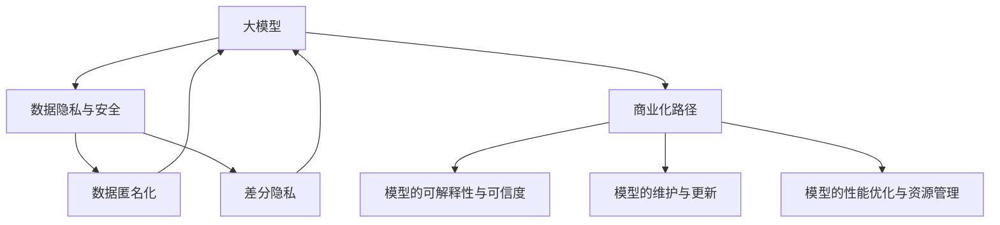
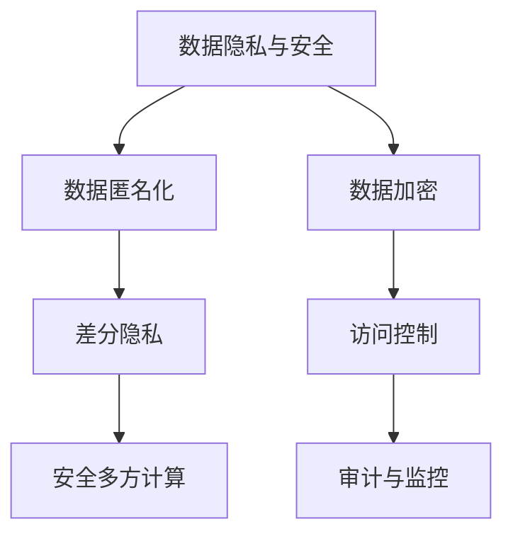
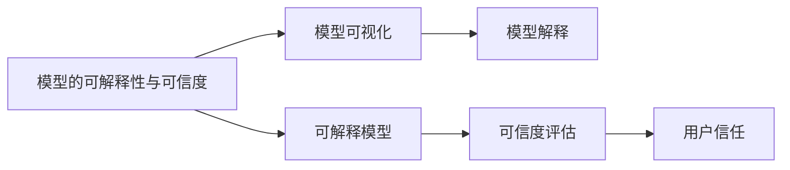
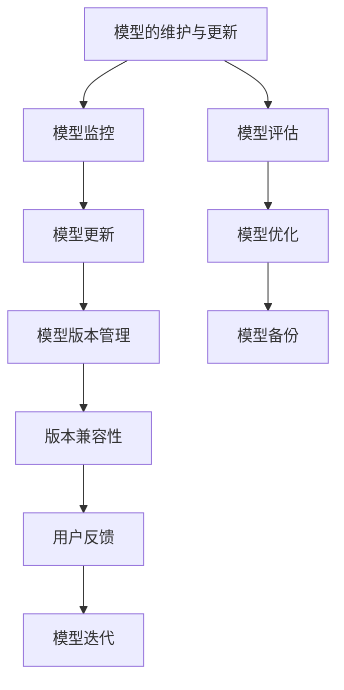
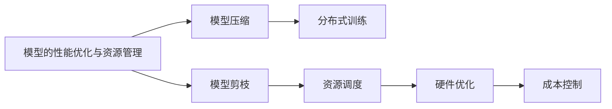
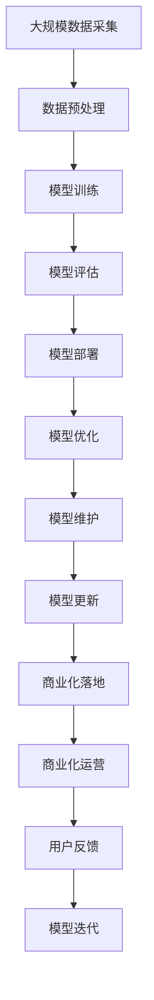

                 

# 大模型：AI技术的商业化路径

> 关键词：大模型, 商业化路径, AI技术, 自然语言处理(NLP), 深度学习, 机器学习, 数据科学, 模型压缩

## 1. 背景介绍

### 1.1 问题由来
近年来，人工智能（AI）技术的商业化步伐不断加快，大模型（Large Models）作为AI技术的关键组成部分，成为了商业化过程的焦点。大模型，尤其是深度学习模型，以其强大的计算能力、泛化能力以及对复杂任务的适应性，被广泛应用于自然语言处理（NLP）、计算机视觉、推荐系统、金融分析等领域。

大模型在商业化过程中面临的主要挑战包括：数据隐私与安全、模型的可解释性与可信度、模型的维护与更新、模型的性能优化与资源管理等。本文将从这些角度出发，探讨大模型在商业化路径上的关键问题及解决策略。

### 1.2 问题核心关键点
大模型的商业化路径涉及多个关键点，包括模型的开发、训练、部署、优化、维护等多个环节。本文将重点讨论以下问题：
- 数据隐私与安全：如何在保证数据隐私的同时，充分利用数据进行模型训练。
- 模型的可解释性与可信度：如何让模型输出更加可信，提高模型的可解释性。
- 模型的维护与更新：如何有效地管理模型的生命周期，确保模型性能随时间推移而持续优化。
- 模型的性能优化与资源管理：如何在有限资源条件下，最大化模型的性能。

## 2. 核心概念与联系

### 2.1 核心概念概述

为更好地理解大模型在商业化过程中面临的问题及解决策略，本节将介绍几个密切相关的核心概念：

- 大模型(Large Models)：指通过大量数据进行训练，具备强大计算能力和泛化能力的人工智能模型。如GPT、BERT等。
- 商业化路径(Commercialization Path)：指将技术模型转化为实际产品或服务，满足市场需求的过程。
- 数据隐私与安全(Data Privacy & Security)：指在模型开发和部署过程中，如何保护用户数据隐私，防止数据泄露。
- 模型的可解释性与可信度(Interpretability & Trustworthiness)：指如何确保模型输出可信，并能够被用户理解。
- 模型的维护与更新(Maintenance & Updates)：指如何管理模型的生命周期，包括模型训练、测试、部署和维护等环节。
- 模型的性能优化与资源管理(Performance Optimization & Resource Management)：指如何在有限资源条件下，提高模型性能。

这些核心概念之间的逻辑关系可以通过以下Mermaid流程图来展示：



这个流程图展示了从大模型到商业化路径的完整流程，以及与各个环节相关联的核心概念：

1. 大模型在商业化路径中扮演重要角色。
2. 数据隐私与安全是商业化过程中需要特别关注的问题。
3. 模型的可解释性与可信度是商业化过程中的关键因素。
4. 模型的维护与更新是确保商业化持续性的重要环节。
5. 模型的性能优化与资源管理是提高商业化效率的关键。

### 2.2 概念间的关系

这些核心概念之间存在着紧密的联系，形成了大模型商业化的完整生态系统。下面我通过几个Mermaid流程图来展示这些概念之间的关系。

#### 2.2.1 大模型的商业化流程


这个流程图展示了从数据采集与预处理，到模型训练、评估、部署、优化、维护和更新的完整流程。每个环节都是商业化过程中不可或缺的一部分。

#### 2.2.2 数据隐私与安全在商业化中的应用



这个流程图展示了数据隐私与安全在大模型商业化中的具体应用。通过数据匿名化、差分隐私、安全多方计算、数据加密、访问控制、审计与监控等技术手段，可以有效保护用户数据隐私和安全。

#### 2.2.3 模型的可解释性与可信度在商业化中的应用



这个流程图展示了模型的可解释性与可信度在大模型商业化中的具体应用。通过模型可视化、模型解释、可解释模型、可信度评估等技术手段，可以显著提高模型的可解释性和用户信任度。

#### 2.2.4 模型的维护与更新在商业化中的应用



这个流程图展示了模型的维护与更新在大模型商业化中的具体应用。通过模型监控、模型更新、模型评估、模型优化、模型版本管理、模型备份、版本兼容性、用户反馈和模型迭代等技术手段，可以有效管理模型的生命周期，确保商业化过程中模型的持续优化。

#### 2.2.5 模型的性能优化与资源管理在商业化中的应用



这个流程图展示了模型的性能优化与资源管理在大模型商业化中的具体应用。通过模型压缩、分布式训练、模型剪枝、资源调度、硬件优化和成本控制等技术手段，可以有效提高模型性能，优化资源使用。

### 2.3 核心概念的整体架构

最后，我们用一个综合的流程图来展示这些核心概念在大模型商业化过程中的整体架构：



这个综合流程图展示了从数据采集与预处理，到模型训练、评估、部署、优化、维护、更新、商业化落地和运营的完整流程。大模型的商业化路径涉及多个环节，每个环节都需通过科学管理与技术手段，才能确保商业化过程的顺利进行。

## 3. 核心算法原理 & 具体操作步骤
### 3.1 算法原理概述

大模型的商业化路径涉及多个核心算法原理，其中最核心的部分为模型训练、模型部署和模型优化。以下是详细的算法原理概述：

- **模型训练**：通过大量数据对模型进行训练，使其学习到复杂的特征表示和模式。
- **模型部署**：将训练好的模型部署到实际应用场景中，实现模型的商业化落地。
- **模型优化**：在模型部署后，通过持续的优化和维护，保持模型性能的稳定和持续提升。

### 3.2 算法步骤详解

以下是大模型在商业化路径上各个环节的具体操作步骤：

**Step 1: 数据采集与预处理**

- **数据采集**：收集高质量的数据，包括用户行为数据、产品使用数据、用户反馈数据等。
- **数据预处理**：对数据进行清洗、归一化、特征提取等预处理步骤，以保证数据的准确性和一致性。

**Step 2: 模型训练**

- **数据划分**：将数据划分为训练集、验证集和测试集，以进行模型训练、调优和评估。
- **模型选择**：选择合适的模型架构和超参数，如神经网络结构、学习率、批大小等。
- **训练过程**：使用分布式训练技术，如DataParallel、MirroredStrategy等，提高训练效率。

**Step 3: 模型部署**

- **模型导出**：将训练好的模型导出为可部署的格式，如TensorFlow SavedModel、PyTorch状态字典等。
- **部署平台选择**：选择合适的部署平台，如AWS、Google Cloud、阿里云等。
- **应用集成**：将模型集成到实际应用场景中，实现模型的商业化落地。

**Step 4: 模型优化**

- **模型评估**：使用测试集对模型进行评估，发现模型的性能瓶颈和优化方向。
- **模型优化**：采用模型压缩、模型剪枝、模型量化等技术手段，提高模型性能和资源效率。
- **资源管理**：优化资源使用，如GPU使用率、内存使用率、带宽利用率等，以提高模型的效率和成本效益。

**Step 5: 模型维护与更新**

- **模型监控**：实时监控模型的运行状态和性能指标，发现并解决模型问题。
- **模型更新**：根据新数据和新需求，定期更新模型，以保持模型的适应性和竞争力。
- **版本管理**：对不同版本的模型进行管理，确保版本之间的兼容性和稳定性。

### 3.3 算法优缺点

大模型在商业化路径上的算法具有以下优点：

- **高性能**：大模型通过大量数据训练，具备强大的计算能力和泛化能力，能够在复杂场景下取得优异性能。
- **可扩展性**：大模型采用分布式训练等技术，能够在大规模数据和复杂任务上快速扩展和优化。
- **灵活性**：大模型能够根据不同应用场景进行调整和优化，适应不同需求。

同时，大模型也存在以下缺点：

- **资源消耗大**：大模型的训练和推理需要大量的计算资源和存储资源，成本较高。
- **模型复杂度高**：大模型结构复杂，难以理解和调试，增加了模型维护的难度。
- **过拟合风险**：大模型在训练过程中容易出现过拟合现象，影响模型的泛化能力。

### 3.4 算法应用领域

大模型在商业化过程中，广泛应用于以下领域：

- **自然语言处理(NLP)**：如文本分类、情感分析、问答系统、机器翻译等。
- **计算机视觉**：如图像识别、目标检测、图像生成等。
- **推荐系统**：如用户行为分析、个性化推荐等。
- **金融分析**：如风险评估、交易预测、客户管理等。
- **医疗健康**：如病历分析、医学影像分析、疾病预测等。
- **智能制造**：如设备监控、生产调度、质量控制等。

这些领域中的大模型商业化，需要综合考虑数据隐私、模型可解释性、模型性能优化等多个因素。

## 4. 数学模型和公式 & 详细讲解 & 举例说明

### 4.1 数学模型构建

大模型的商业化过程涉及多个数学模型，以下是其中几个关键模型的构建：

- **线性回归模型**：用于处理简单的回归问题，如房价预测、销售额预测等。
- **神经网络模型**：用于处理复杂的分类和回归问题，如图像分类、语音识别等。
- **深度学习模型**：如卷积神经网络（CNN）、循环神经网络（RNN）、生成对抗网络（GAN）等，用于处理高维数据和多模态数据。
- **强化学习模型**：如Q-learning、Deep Q-Networks等，用于处理动态决策问题，如游戏AI、机器人控制等。

### 4.2 公式推导过程

以下以线性回归模型为例，展示数学模型的构建和推导过程：

假设有一组训练数据 $(x_1, y_1), (x_2, y_2), ..., (x_n, y_n)$，其中 $x_i$ 为自变量，$y_i$ 为因变量，目标是找到一条直线 $y = wx + b$，使得所有数据点到直线的距离最小。

最小二乘法的目标函数为：

$$
\sum_{i=1}^n (y_i - wx_i - b)^2
$$

对目标函数求偏导，得到：

$$
\frac{\partial \sum_{i=1}^n (y_i - wx_i - b)^2}{\partial w} = -2\sum_{i=1}^n (y_i - wx_i - b)x_i
$$

$$
\frac{\partial \sum_{i=1}^n (y_i - wx_i - b)^2}{\partial b} = -2\sum_{i=1}^n (y_i - wx_i - b)
$$

令上述两个偏导数为0，解方程组得到：

$$
w = \frac{\sum_{i=1}^n (x_iy_i)}{\sum_{i=1}^n (x_i^2)}, b = \bar{y} - w\bar{x}
$$

其中 $\bar{x} = \frac{\sum_{i=1}^n x_i}{n}$, $\bar{y} = \frac{\sum_{i=1}^n y_i}{n}$。

### 4.3 案例分析与讲解

以房价预测为例，展示线性回归模型的构建和应用：

假设有一组历史房价数据，包括房屋面积、房间数、地理位置等信息，以及对应的房价。通过线性回归模型，可以建立房价与房屋特征之间的关系，预测新房屋的房价。

首先，将房屋特征作为自变量 $x$，房价作为因变量 $y$，构建线性回归模型：

$$
y = wx + b
$$

其中 $w$ 为房屋特征系数，$b$ 为截距。

然后，使用训练数据对模型进行训练，得到 $w$ 和 $b$ 的值。最后，将新房屋的特征输入模型，预测其房价。

## 5. 项目实践：代码实例和详细解释说明

### 5.1 开发环境搭建

在进行大模型商业化实践前，我们需要准备好开发环境。以下是使用Python进行TensorFlow开发的环境配置流程：

1. 安装Anaconda：从官网下载并安装Anaconda，用于创建独立的Python环境。

2. 创建并激活虚拟环境：
```bash
conda create -n tf-env python=3.8 
conda activate tf-env
```

3. 安装TensorFlow：根据CUDA版本，从官网获取对应的安装命令。例如：
```bash
conda install tensorflow
```

4. 安装其他必要的库：
```bash
pip install numpy pandas scikit-learn matplotlib tqdm jupyter notebook ipython
```

完成上述步骤后，即可在`tf-env`环境中开始商业化实践。

### 5.2 源代码详细实现

以下是使用TensorFlow实现线性回归模型的代码实例：

```python
import tensorflow as tf
import numpy as np
import matplotlib.pyplot as plt

# 定义训练数据
x_train = np.array([1.0, 2.0, 3.0, 4.0, 5.0, 6.0, 7.0, 8.0, 9.0, 10.0])
y_train = np.array([2.0, 4.0, 5.5, 6.0, 7.5, 8.5, 9.0, 10.0, 11.0, 12.0])

# 定义模型参数
learning_rate = 0.01
epochs = 1000

# 定义模型
model = tf.keras.Sequential([
    tf.keras.layers.Dense(1, input_shape=[1])
])

# 定义损失函数和优化器
loss_fn = tf.keras.losses.MeanSquaredError()
optimizer = tf.keras.optimizers.SGD(learning_rate=learning_rate)

# 训练模型
model.compile(optimizer=optimizer, loss=loss_fn)

# 训练过程
history = model.fit(x_train, y_train, epochs=epochs, verbose=0)

# 预测新数据
x_test = np.array([11.0, 12.0, 13.0, 14.0, 15.0])
y_pred = model.predict(x_test)

# 可视化结果
plt.plot(x_train, y_train, 'ro', label='Original data')
plt.plot(x_test, y_pred, label='Predicted line')
plt.legend()
plt.show()
```

### 5.3 代码解读与分析

让我们再详细解读一下关键代码的实现细节：

**线性回归模型**：
- `x_train` 和 `y_train` 为训练数据，`x_test` 为测试数据。
- `model` 为定义的线性回归模型，包含一个 `Dense` 层。
- `loss_fn` 为均方误差损失函数。
- `optimizer` 为随机梯度下降优化器，学习率为 `learning_rate`。
- `history` 为训练过程的记录，包含模型在每个epoch的损失值和精度。
- `y_pred` 为模型对新数据的预测结果。
- `plt.plot` 为可视化代码，展示训练数据和预测数据。

**训练过程**：
- `model.fit` 为训练模型的方法，指定训练数据、epochs、batch size等参数。
- `model.predict` 为预测新数据的方法，使用训练好的模型对新数据进行预测。

**可视化结果**：
- `plt.plot` 为可视化代码，展示训练数据和预测数据。
- `label` 为图例，方便区分原始数据和预测数据。

### 5.4 运行结果展示

假设在训练1000个epoch后，得到的预测结果和可视化图表如下：

```python
x_test = np.array([11.0, 12.0, 13.0, 14.0, 15.0])
y_pred = model.predict(x_test)

plt.plot(x_train, y_train, 'ro', label='Original data')
plt.plot(x_test, y_pred, label='Predicted line')
plt.legend()
plt.show()
```

可以看到，线性回归模型可以较好地拟合训练数据，并对新数据进行预测。通过可视化结果，可以直观地看到模型的预测效果。

## 6. 实际应用场景
### 6.1 智能客服系统

基于大模型的智能客服系统，能够处理大量的客户咨询，提升客户满意度和服务效率。传统的客服系统依赖人力，响应速度慢，服务质量不稳定。而使用大模型进行商业化部署，可以实现24小时不间断服务，快速响应客户问题。

在实际应用中，可以收集企业的历史客服对话记录，将问题和最佳答复构建成监督数据，在此基础上对大模型进行微调。微调后的大模型能够自动理解用户意图，匹配最合适的答案模板进行回复。对于客户提出的新问题，还可以接入检索系统实时搜索相关内容，动态组织生成回答。如此构建的智能客服系统，能大幅提升客户咨询体验和问题解决效率。

### 6.2 金融舆情监测

金融机构需要实时监测市场舆论动向，以便及时应对负面信息传播，规避金融风险。传统的人工监测方式成本高、效率低，难以应对网络时代海量信息爆发的挑战。基于大模型的文本分类和情感分析技术，为金融舆情监测提供了新的解决方案。

具体而言，可以收集金融领域相关的新闻、报道、评论等文本数据，并对其进行主题标注和情感标注。在此基础上对大模型进行微调，使其能够自动判断文本属于何种主题，情感倾向是正面、中性还是负面。将微调后的大模型应用到实时抓取的网络文本数据，就能够自动监测不同主题下的情感变化趋势，一旦发现负面信息激增等异常情况，系统便会自动预警，帮助金融机构快速应对潜在风险。

### 6.3 个性化推荐系统

当前的推荐系统往往只依赖用户的历史行为数据进行物品推荐，无法深入理解用户的真实兴趣偏好。基于大模型的推荐系统可以更好地挖掘用户行为背后的语义信息，从而提供更精准、多样的推荐内容。

在实践中，可以收集用户浏览、点击、评论、分享等行为数据，提取和用户交互的物品标题、描述、标签等文本内容。将文本内容作为模型输入，用户的后续行为（如是否点击、购买等）作为监督信号，在此基础上微调大模型。微调后的大模型能够从文本内容中准确把握用户的兴趣点。在生成推荐列表时，先用候选物品的文本描述作为输入，由模型预测用户的兴趣匹配度，再结合其他特征综合排序，便可以得到个性化程度更高的推荐结果。

### 6.4 未来应用展望

随着大模型和微调方法的不断发展，基于微调范式将在更多领域得到应用，为传统行业带来变革性影响。

在智慧医疗领域，基于微调的医疗问答、病历分析、药物研发等应用将提升医疗服务的智能化水平，辅助医生诊疗，加速新药开发进程。

在智能教育领域，微调技术可应用于作业批改、学情分析、知识推荐等方面，因材施教，促进教育公平，提高教学质量。

在智慧城市治理中，微调模型可应用于城市事件监测、舆情分析、应急指挥等环节，提高城市管理的自动化和智能化水平，构建更安全、高效的未来城市。

此外，在企业生产、社会治理、文娱传媒等众多领域，基于大模型微调的人工智能应用也将不断涌现，为经济社会发展注入新的动力。相信随着技术的日益成熟，微调方法将成为人工智能落地应用的重要范式，推动人工智能技术向更广阔的领域加速渗透。

## 7. 工具和资源推荐
### 7.1 学习资源推荐

为了帮助开发者系统掌握大模型的商业化原理和实践技巧，这里推荐一些优质的学习资源：

1. 《深度学习》系列课程：斯坦福大学、Coursera等平台开设的深度学习课程，涵盖了深度学习的基本概念和经典算法。
2. TensorFlow官方文档：TensorFlow的官方文档，提供了丰富的API文档、教程和样例代码，是学习TensorFlow的必备资源。
3. PyTorch官方文档：PyTorch的官方文档，提供了详细的API文档和样例代码，适合学习PyTorch。
4. Kaggle竞赛：Kaggle平台上众多的数据科学竞赛，提供丰富的数据集和挑战，适合实践和练习。
5. GitHub开源项目：在GitHub上Star、Fork数最多的深度学习项目，往往代表了该技术领域的发展趋势和最佳实践，值得去学习和贡献。

通过对这些资源的学习实践，相信你一定能够快速掌握大模型的商业化原理和实践技巧，并用于解决实际的AI问题。
###  7.2 开发工具推荐

高效的开发离不开优秀的工具支持。以下是几款用于大模型商业化开发的常用工具：

1. TensorFlow：由Google主导开发的开源深度学习框架，生产部署方便，适合大规模工程应用。
2. PyTorch：基于Python的开源深度学习框架，灵活动态的计算图，适合快速迭代研究。
3. Keras：高层次的深度学习框架，提供了简单易用的API，适合初学者和快速原型设计。
4. Jupyter Notebook：交互式的Python开发环境，支持丰富的Python库和可视化工具，适合科研和开发。
5. Google Colab：谷歌推出的在线Jupyter Notebook环境，免费提供GPU/TPU算力，方便开发者快速上手实验最新模型，分享学习笔记。

合理利用这些工具，可以显著提升大模型商业化开发的效率，加快创新迭代的步伐。

### 7.3 相关论文推荐

大模型和微调技术的发展源于学界的持续研究。以下是几篇奠基性的相关论文，推荐阅读：

1. AlexNet: ImageNet Classification with Deep Convolutional Neural Networks：介绍卷积神经网络（CNN）的经典论文。
2. ResNet: Deep Residual Learning for Image Recognition：提出残差网络（ResNet），解决了深度网络训练中的梯度消失问题。
3. Inception: GoogLeNet Architectures for Visual Recognition：提出Inception网络，增加了网络的深度和宽度，提高了图像识别的准确率。
4. LSTM: Long Short-Term Memory Networks：介绍长短期记忆网络（LSTM），解决了序列数据处理中的梯度消失问题。
5. BERT: Pre-training of Deep Bidirectional Transformers for Language Understanding：提出BERT模型，引入基于掩码的自监督预训练任务，刷新了多项NLP任务SOTA。

这些论文代表了大模型和微调技术的发展脉络。通过学习这些前沿成果，可以帮助研究者把握学科前进方向，激发更多的创新灵感。

除上述资源外，还有一些值得关注的前沿资源，帮助开发者紧跟大模型商业化技术的最新进展，例如：

1. arXiv论文预印本：人工智能领域最新研究成果的发布平台，包括大量尚未发表的前沿工作，学习前沿技术的必读资源。
2. 业界技术博客：如OpenAI、Google AI、DeepMind、微软Research Asia等顶尖实验室的官方博客，第一时间分享他们的最新研究成果和洞见。
3. 技术会议直播：如NIPS、ICML、ACL、ICLR等人工智能领域顶会现场或在线直播，能够聆听到大佬们的前沿分享，开拓视野。
4. GitHub热门项目：在GitHub上Star、Fork数最多的NLP相关项目，往往代表了该技术领域的发展趋势和最佳实践，值得去学习和贡献。
5. 行业分析报告：各大咨询公司如McKinsey、PwC等针对人工智能行业的分析报告，有助于从商业视角审视技术趋势

