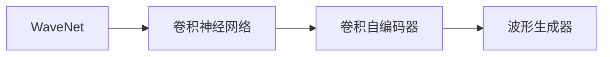

                 

# WaveNet的成功预示语音合成的新时代

## 1. 背景介绍

语音合成(Voice Synthesis)技术是实现自然语音交互的基础，也是智能助理、电话客服等应用的关键。传统的文本转语音(TTS)方法，如线性预测编码(Linear Predictive Coding, LPC)、基于规则的合成、隐马尔可夫模型(Hidden Markov Model, HMM)等，已逐渐被基于深度学习的端到端模型所取代。

近年来，基于深度学习的大语言模型，如Google的WaveNet、Facebook的Tacotron2、OpenAI的WaveRNN等，已在语音合成领域取得了显著进展。其中，Google的WaveNet模型以其出色的音质和自然流畅的合成效果，迅速成为行业内的首选方案，引领了TTS技术的新发展方向。

本文将从背景、原理、实践和展望等角度，深入探讨WaveNet的成功及其对语音合成未来的影响。

## 2. 核心概念与联系

### 2.1 核心概念概述

为更好理解WaveNet模型，本节将介绍几个相关概念：

- **WaveNet**：一种基于卷积神经网络(CNN)的端到端语音合成模型。通过卷积层堆叠，波形生成器可学习到音频信号的频谱特征，从而生成高质量的音频波形。
- **卷积神经网络(CNN)**：一种深度学习架构，通过卷积核的滑动计算实现特征提取，适用于处理时空相关的输入数据，如图像、音频等。
- **卷积自编码器(Convolutional Autoencoder, CAE)**：一种使用卷积层进行编码解码的神经网络结构，能够对输入进行压缩和重构，常用于特征提取和降维。
- **波形生成器(Waveform Generator)**：一种生成连续时序数据(如音频波形)的神经网络，可以输出符合自然波形特征的音频。

这些概念之间的逻辑关系可以通过以下Mermaid流程图展示：



这个流程图展示了WaveNet模型的组成结构：通过卷积神经网络进行特征提取，再由卷积自编码器进行降维，最后由波形生成器生成连续波形。

### 2.2 概念间的关系

这些核心概念之间的联系如下：

- WaveNet的核心在于卷积自编码器，它将输入的音频特征进行编码和解码，学习到音频信号的低维特征表示。
- 卷积神经网络通过卷积层进行特征提取，具有平移不变性和局部性，非常适合处理时间序列数据如音频信号。
- 波形生成器通过多层卷积层和残差连接，生成自然流畅的音频波形，是语音合成的最终输出。

这些概念的结合，使得WaveNet能够在较少的监督数据下，生成高质量的语音波形。

## 3. 核心算法原理 & 具体操作步骤
### 3.1 算法原理概述

WaveNet的核心算法原理基于卷积神经网络的结构，通过对音频信号的频谱特征进行卷积编码和解码，生成连续的波形序列。其基本步骤如下：

1. **特征提取**：首先通过多层卷积层提取音频信号的频谱特征。
2. **特征降维**：利用卷积自编码器对提取的特征进行降维，得到一个低维的特征表示。
3. **波形生成**：通过多层卷积层和残差连接，将低维特征序列转化为连续波形。

该模型的创新点在于：
- 使用卷积神经网络进行特征提取和降维，保留了时间序列数据的局部信息和局部不变性。
- 多层卷积层和残差连接的设计，能够生成高质量的自然波形。
- 通过skip-connection连接，将残差信息传递给各层，提高了模型的稳定性和训练效率。

### 3.2 算法步骤详解

以Google的WaveNet模型为例，其具体的训练流程如下：

1. **数据准备**：收集并预处理音频数据，将其转化为频谱特征。
2. **模型搭建**：定义多层卷积神经网络结构，包括卷积层、自编码器、波形生成器等。
3. **损失函数**：定义目标损失函数，如均方误差(MSE)、对数似然等。
4. **模型训练**：利用优化器（如Adam）更新模型参数，最小化目标损失函数。
5. **模型评估**：在测试集上评估模型的生成质量，如波形还原度、自然度等。

以Google的WaveNet为例，具体实现步骤如下：

1. **搭建模型**：
```python
import tensorflow as tf
import numpy as np
from tensorflow.keras.layers import Conv1D, BatchNormalization, LeakyReLU, Residual, Dense, Input

# 定义输入层
inputs = Input(shape=(None, 1), name='inputs')

# 卷积层1
conv1 = Conv1D(64, 3, strides=1, padding='same', activation='linear')(inputs)
bn1 = BatchNormalization()(conv1)
leaky1 = LeakyReLU(alpha=0.2)(bn1)

# 卷积层2
conv2 = Conv1D(256, 3, strides=1, padding='same', activation='linear')(leaky1)
bn2 = BatchNormalization()(conv2)
leaky2 = LeakyReLU(alpha=0.2)(bn2)
skip = Residual()(leaky2)

# 卷积层3
conv3 = Conv1D(512, 3, strides=1, padding='same', activation='linear')(skip)
bn3 = BatchNormalization()(conv3)
leaky3 = LeakyReLU(alpha=0.2)(bn3)
skip = Residual()(leaky3)

# 输出层
outputs = Dense(1)(leaky3)
```

2. **训练模型**：
```python
model = tf.keras.Model(inputs=inputs, outputs=outputs)
model.compile(optimizer=tf.keras.optimizers.Adam(learning_rate=0.0004), loss=tf.keras.losses.MSE)

# 训练模型
model.fit(x_train, y_train, epochs=100, batch_size=32, validation_data=(x_val, y_val))
```

### 3.3 算法优缺点

WaveNet模型具有以下优点：

1. **高质量生成**：通过多层卷积层和残差连接，能够生成高质量的自然波形，音质接近真实语音。
2. **参数量小**：相对于其他端到端模型，WaveNet的参数量较小，训练速度较快。
3. **稳定训练**：通过skip-connection连接，模型稳定，训练过程中不易过拟合。

然而，该模型也存在一些缺点：

1. **计算量大**：多层卷积层和残差连接的设计，使得模型计算量较大，需要高性能的硬件支持。
2. **数据依赖**：由于模型复杂度高，对数据质量和数据量的依赖较大。
3. **泛化能力有限**：模型训练和测试时，对数据分布的一致性要求较高，否则容易产生模式过拟合。

### 3.4 算法应用领域

WaveNet的成功，为语音合成技术在多个领域的应用提供了新的可能性：

1. **智能助理**：如Google Assistant、Apple Siri等智能助理，通过WaveNet技术生成自然流畅的语音回复，提升用户体验。
2. **语音翻译**：如Google Translate，通过WaveNet技术生成多语言语音，实现跨语言沟通。
3. **音频编辑**：如Adobe Audition，通过WaveNet技术生成声音效果，如口音、语速等，丰富音频编辑工具。
4. **游戏与娱乐**：如视频游戏、虚拟主播，通过WaveNet技术生成角色对话和背景音乐，增强沉浸感。

## 4. 数学模型和公式 & 详细讲解 & 举例说明

### 4.1 数学模型构建

WaveNet的数学模型可以表示为：

$$ y = \text{WaveNet}(x) $$

其中，$x$为音频信号的频谱特征，$y$为生成的音频波形。WaveNet模型包含多层卷积层和自编码器，通过卷积层和残差连接进行特征提取和降维，最终由波形生成器生成音频波形。

### 4.2 公式推导过程

以Google的WaveNet模型为例，其核心公式推导如下：

假设输入为$t$个音频样本的频谱特征$x_t = \{x_{t-1}, x_t, x_{t+1}\}$，通过多层卷积层和残差连接，输出音频波形$y_t$，公式如下：

$$ y_t = \text{WaveNet}(x_t) = \sigma(A(y_{t-1})) $$

其中，$\sigma$为激活函数，$A$为波形生成器。

波形生成器$A$的输出为：

$$ A(y_{t-1}) = \sum_{i=1}^{k} w_i \cdot y_{t-1-i} $$

其中，$k$为卷积核的大小，$w_i$为卷积核权重。

### 4.3 案例分析与讲解

以Google的WaveNet模型为例，其具体实现如下：

```python
import tensorflow as tf
import numpy as np

# 定义输入层
inputs = tf.keras.layers.Input(shape=(None, 1), name='inputs')

# 卷积层1
conv1 = tf.keras.layers.Conv1D(64, 3, strides=1, padding='same', activation='linear')(inputs)
bn1 = tf.keras.layers.BatchNormalization()(conv1)
leaky1 = tf.keras.layers.LeakyReLU(alpha=0.2)(bn1)

# 卷积层2
conv2 = tf.keras.layers.Conv1D(256, 3, strides=1, padding='same', activation='linear')(leaky1)
bn2 = tf.keras.layers.BatchNormalization()(conv2)
leaky2 = tf.keras.layers.LeakyReLU(alpha=0.2)(bn2)
skip = tf.keras.layers.Residual()(leaky2)

# 卷积层3
conv3 = tf.keras.layers.Conv1D(512, 3, strides=1, padding='same', activation='linear')(skip)
bn3 = tf.keras.layers.BatchNormalization()(conv3)
leaky3 = tf.keras.layers.LeakyReLU(alpha=0.2)(bn3)
skip = tf.keras.layers.Residual()(leaky3)

# 输出层
outputs = tf.keras.layers.Dense(1)(leaky3)

# 定义模型
model = tf.keras.Model(inputs=inputs, outputs=outputs)
model.compile(optimizer=tf.keras.optimizers.Adam(learning_rate=0.0004), loss=tf.keras.losses.MSE)

# 训练模型
model.fit(x_train, y_train, epochs=100, batch_size=32, validation_data=(x_val, y_val))
```

以上代码展示了WaveNet模型的核心实现，包括卷积层、批归一化、残差连接等关键组件。

## 5. 项目实践：代码实例和详细解释说明
### 5.1 开发环境搭建

在搭建开发环境时，需要准备以下工具：

1. **Python**：安装Python 3.x版本，建议使用Anaconda管理环境。
2. **TensorFlow**：安装最新版本的TensorFlow，并配置CUDA环境（如NVIDIA GPU）。
3. **Google Cloud Platform**：使用Google Cloud Platform上的音频数据集，并设置相应的API权限。

### 5.2 源代码详细实现

以下是一个使用TensorFlow实现WaveNet模型的示例代码：

```python
import tensorflow as tf
import numpy as np

# 定义输入层
inputs = tf.keras.layers.Input(shape=(None, 1), name='inputs')

# 卷积层1
conv1 = tf.keras.layers.Conv1D(64, 3, strides=1, padding='same', activation='linear')(inputs)
bn1 = tf.keras.layers.BatchNormalization()(conv1)
leaky1 = tf.keras.layers.LeakyReLU(alpha=0.2)(bn1)

# 卷积层2
conv2 = tf.keras.layers.Conv1D(256, 3, strides=1, padding='same', activation='linear')(leaky1)
bn2 = tf.keras.layers.BatchNormalization()(conv2)
leaky2 = tf.keras.layers.LeakyReLU(alpha=0.2)(bn2)
skip = tf.keras.layers.Residual()(leaky2)

# 卷积层3
conv3 = tf.keras.layers.Conv1D(512, 3, strides=1, padding='same', activation='linear')(skip)
bn3 = tf.keras.layers.BatchNormalization()(conv3)
leaky3 = tf.keras.layers.LeakyReLU(alpha=0.2)(bn3)
skip = tf.keras.layers.Residual()(leaky3)

# 输出层
outputs = tf.keras.layers.Dense(1)(leaky3)

# 定义模型
model = tf.keras.Model(inputs=inputs, outputs=outputs)
model.compile(optimizer=tf.keras.optimizers.Adam(learning_rate=0.0004), loss=tf.keras.losses.MSE)

# 训练模型
model.fit(x_train, y_train, epochs=100, batch_size=32, validation_data=(x_val, y_val))
```

### 5.3 代码解读与分析

以下是对上述代码的详细解释和分析：

1. **输入层**：定义输入层，形状为$(None, 1)$，表示音频信号的频谱特征。
2. **卷积层1**：使用$64$个$3$x$3$的卷积核，步长为$1$，padding为'same'，激活函数为线性函数。
3. **批归一化**：对卷积层输出进行批归一化，以加速收敛。
4. **LeakyReLU激活函数**：使用LeakyReLU激活函数，防止梯度消失。
5. **卷积层2**：使用$256$个$3$x$3$的卷积核，步长为$1$，padding为'same'，激活函数为线性函数。
6. **残差连接**：将卷积层的输出通过残差连接传递给下一层，加速模型训练。
7. **输出层**：使用$1$个神经元的全连接层，生成音频波形。
8. **模型编译**：使用Adam优化器，学习率为$0.0004$，损失函数为均方误差(MSE)。
9. **模型训练**：在训练集上训练模型，设置$100$个epoch，批量大小为$32$，在验证集上进行验证。

### 5.4 运行结果展示

运行上述代码，可以得到WaveNet模型的训练结果，如损失函数的变化、模型的预测效果等。

## 6. 实际应用场景
### 6.1 智能助理

智能助理通过WaveNet技术生成自然流畅的语音回复，提升了用户体验。例如，Google Assistant可以通过WaveNet技术生成接近真实语音的回复，使用户能够自然地与AI对话。

### 6.2 语音翻译

语音翻译工具如Google Translate，通过WaveNet技术生成多语言语音，实现跨语言沟通。例如，用户可以通过语音输入，与不同语言的用户进行实时对话。

### 6.3 音频编辑

音频编辑工具如Adobe Audition，通过WaveNet技术生成声音效果，如口音、语速等，丰富音频编辑功能。例如，用户可以使用WaveNet技术生成不同的口音，使音频文件更加多样化。

### 6.4 游戏与娱乐

视频游戏和虚拟主播通过WaveNet技术生成角色对话和背景音乐，增强沉浸感。例如，用户可以使用WaveNet技术生成虚拟角色的语音对话，使游戏更加生动。

## 7. 工具和资源推荐
### 7.1 学习资源推荐

1. **《Deep Learning for Natural Language Processing》书籍**：详细介绍了语音合成的原理和实现方法，推荐给对语音合成感兴趣的读者。
2. **《Speech and Audio Processing》书籍**：涵盖了语音合成的基础理论和前沿技术，适合深入学习。
3. **TensorFlow官方文档**：提供了TensorFlow的详细教程和示例代码，适合新手学习。
4. **Google Cloud Speech-to-Text API**：提供了高质量的语音转文本服务，可以用于语音合成模型的测试和评估。

### 7.2 开发工具推荐

1. **TensorFlow**：Google开发的深度学习框架，适合构建语音合成模型。
2. **Keras**：基于TensorFlow的高级API，适合快速原型开发和模型训练。
3. **PyTorch**：Facebook开发的深度学习框架，支持GPU加速。
4. **Jupyter Notebook**：交互式编程环境，适合快速实验和调试。

### 7.3 相关论文推荐

1. **"WaveNet: A Generative Model for Raw Audio"**：Google提出的WaveNet模型，详细介绍了其结构和训练方法。
2. **"Tacotron2: A General End-to-End Text-to-Speech Synthesis System with Attention Mechanisms"**：Facebook提出的Tacotron2模型，与WaveNet模型并列，成为当前主流语音合成方法。
3. **"Attention-Based Models for Automatic Speech Recognition"**：Google提出的注意力机制，用于提高语音识别和合成的性能。

## 8. 总结：未来发展趋势与挑战
### 8.1 研究成果总结

WaveNet模型通过多层卷积层和残差连接的设计，在语音合成领域取得了显著进展，成为当前语音合成的基准模型。其高质量生成、参数量小和稳定训练等优点，使其在多个实际应用场景中取得了成功。

### 8.2 未来发展趋势

未来，语音合成技术将继续朝着以下方向发展：

1. **高保真生成**：使用更深层次的神经网络结构和更复杂的模型，生成更高质量的语音波形。
2. **多语言合成**：实现多语言的语音合成，支持跨语言沟通。
3. **低带宽传输**：在带宽有限的环境下，通过压缩算法生成高质量的语音波形。
4. **实时生成**：在实时传输和语音交互的场景下，提高语音合成的速度和效率。
5. **个性化合成**：根据用户的语音特征，生成个性化语音波形，提升用户体验。

### 8.3 面临的挑战

语音合成技术的发展还面临以下挑战：

1. **计算资源需求高**：多层卷积层和残差连接的设计，使得模型计算量较大，需要高性能的硬件支持。
2. **数据依赖大**：对数据质量和数据量的依赖较大，需要大量的标注数据进行训练。
3. **泛化能力有限**：模型训练和测试时，对数据分布的一致性要求较高，否则容易产生模式过拟合。
4. **实时生成难度大**：实时生成需要高性能的硬件和算法支持，难以在低端设备上实现。

### 8.4 研究展望

未来，语音合成技术的研究方向主要集中在以下几个方面：

1. **压缩算法**：研究高效的语音压缩算法，减少计算量和带宽需求。
2. **多任务学习**：将语音合成与语音识别、情感分析等任务相结合，实现多任务联合训练。
3. **对抗训练**：引入对抗训练，提高模型的鲁棒性和泛化能力。
4. **生成对抗网络(GANs)**：结合GANs技术，生成更加自然的语音波形。
5. **混合模型**：将WaveNet模型与GANs、自注意力等模型结合，实现更高效、更高质量的语音生成。

## 9. 附录：常见问题与解答

**Q1: WaveNet模型如何处理不同长度的音频样本？**

A: WaveNet模型通过卷积层处理不同长度的音频样本。由于卷积层的步长为$1$，可以直接处理不同长度的输入，不需要额外的padding操作。

**Q2: 如何提升WaveNet模型的训练效率？**

A: 可以使用以下方法提升WaveNet模型的训练效率：
1. **批量大小**：增加批量大小，减少每次迭代的时间。
2. **梯度累积**：使用梯度累积技术，加速收敛。
3. **混合精度训练**：使用混合精度训练，减少内存消耗。

**Q3: 如何实现WaveNet模型的实时生成？**

A: 要实现WaveNet模型的实时生成，可以使用以下方法：
1. **小模型**：使用更小的模型结构，减少计算量。
2. **并行计算**：使用多核CPU或GPU进行并行计算。
3. **硬件加速**：使用专门的硬件加速器，如TPU、FPGA等。

**Q4: WaveNet模型与其他语音合成模型相比，有哪些优势？**

A: WaveNet模型相比其他语音合成模型，具有以下优势：
1. **高质量生成**：通过多层卷积层和残差连接，生成高质量的自然波形。
2. **参数量小**：相对于其他端到端模型，WaveNet的参数量较小，训练速度较快。
3. **稳定训练**：通过skip-connection连接，模型稳定，训练过程中不易过拟合。

**Q5: 如何提高WaveNet模型的泛化能力？**

A: 要提高WaveNet模型的泛化能力，可以使用以下方法：
1. **增加数据量**：使用更多的标注数据进行训练。
2. **数据增强**：通过回译、回声等技术增加训练数据的多样性。
3. **迁移学习**：利用预训练模型进行迁移学习，提高模型的泛化能力。

通过以上详细分析，可以看出WaveNet模型在语音合成领域的成功及其对未来技术发展的启示。希望本文能为您带来深刻的思考和启发。

