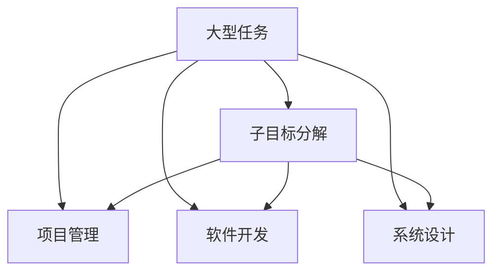
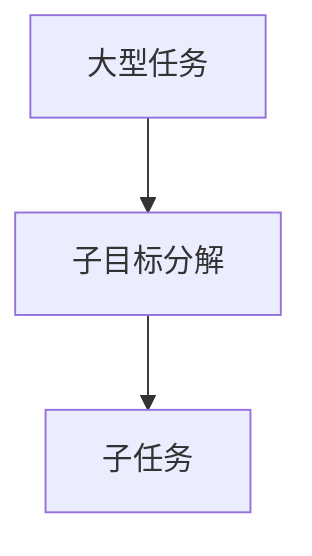
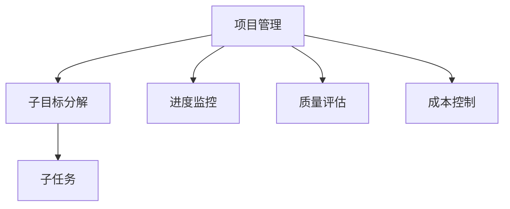
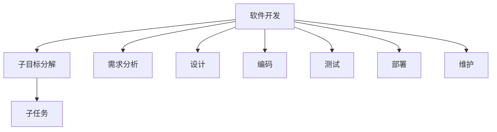
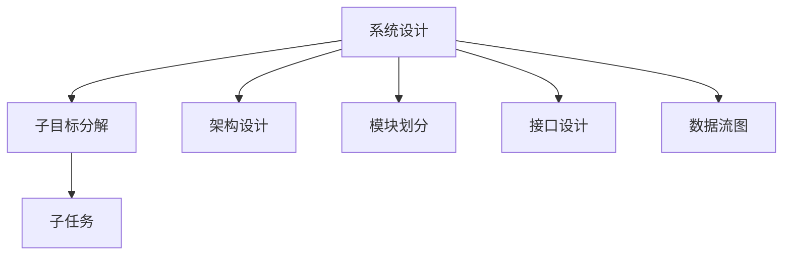

                 

# 将大型任务分解为较小子目标

> 关键词：大型任务,子目标分解,项目管理,软件开发,系统设计

## 1. 背景介绍

在软件开发和系统设计的实践中，大型项目往往会面临多方面的挑战，如需求变更、技术复杂性、开发周期长等。如何有效地管理和实施这些项目，使其按时交付、质量合格，成为项目管理的核心问题。本文将探讨一种关键技术——将大型任务分解为较小子目标，以提高项目管理效率，降低开发风险，提升系统质量。

## 2. 核心概念与联系

### 2.1 核心概念概述

1. **大型任务**：指在时间、资源、复杂性等方面都具有较大规模的项目，通常涉及多个部门、多个子系统，以及复杂的流程和任务。

2. **子目标分解**：将大型任务分解为若干小任务（或子目标），每个子任务相对独立、具体且可执行，便于管理和控制。

3. **项目管理**：涉及规划、执行、监控和评估项目进度和成果的活动，目标是按时、按质、按预算完成项目。

4. **软件开发**：创建和维护软件产品的过程，包括需求分析、设计、编码、测试、部署和维护等阶段。

5. **系统设计**：定义系统架构、模块划分、接口设计、数据流图等，为软件开发提供蓝图和指导。

这些核心概念之间的关系可以通过以下Mermaid流程图来展示：

这个流程图展示了大型任务与子目标分解、项目管理、软件开发和系统设计之间的逻辑关系：

1. 大型任务是项目的起点，需要通过子目标分解、项目管理、软件开发和系统设计等活动逐步实施和实现。
2. 子目标分解将大型任务拆解为可执行的子任务，便于管理和控制。
3. 项目管理通过规划、执行、监控和评估等活动，确保子任务按时、按质、按预算完成。
4. 软件开发通过需求分析、设计、编码、测试、部署和维护等活动，实现子任务的成果。
5. 系统设计通过定义系统架构、模块划分、接口设计、数据流图等，为软件开发提供指导。

### 2.2 概念间的关系

这些核心概念之间存在着紧密的联系，形成了项目管理的关键生态系统。下面通过几个Mermaid流程图来展示这些概念之间的关系。

#### 2.2.1 大型任务到子目标分解

这个流程图展示了大型任务如何通过子目标分解，生成具体的子任务，以便进行项目管理、软件开发和系统设计。

#### 2.2.2 项目管理与子目标分解的关系

这个流程图展示了项目管理如何通过子目标分解和进度监控、质量评估、成本控制等活动，确保子任务按时、按质、按预算完成。

#### 2.2.3 软件开发与子目标分解的关系

这个流程图展示了软件开发如何通过子目标分解和需求分析、设计、编码、测试、部署和维护等活动，实现子任务的成果。

#### 2.2.4 系统设计与子目标分解的关系

这个流程图展示了系统设计如何通过子目标分解和架构设计、模块划分、接口设计、数据流图等活动，为软件开发提供指导。

## 3. 核心算法原理 & 具体操作步骤

### 3.1 算法原理概述

将大型任务分解为较小子目标的原理基于项目管理理论和系统工程方法论。核心思想是通过划分任务，使每个子任务变得相对独立、明确，便于管理和执行。这一过程通常包括以下几个步骤：

1. **需求分析**：明确项目的目标和范围，确定需要完成的任务。
2. **任务分解**：将大型任务拆分为若干子任务，每个子任务具有明确的目标和输入输出。
3. **任务排序**：对子任务进行优先级排序，确定执行顺序。
4. **任务分配**：将子任务分配给具体团队或个人。
5. **进度监控和评估**：通过跟踪子任务的进展，评估项目进度和质量，及时调整计划。

### 3.2 算法步骤详解

#### 3.2.1 需求分析

需求分析是项目管理的第一步，明确项目的目标和范围，确保所有相关方对项目有清晰的期望。具体步骤如下：

1. **确定项目目标**：与项目干系人沟通，明确项目的主要目标和成果。
2. **确定项目范围**：确定项目的边界，避免范围蔓延。
3. **列出所有需求**：将项目目标细化为具体的任务需求。

#### 3.2.2 任务分解

任务分解是将大型任务拆分为较小、可执行的子任务的过程。具体步骤如下：

1. **确定大任务**：将项目目标细化为几个大任务。
2. **拆分子任务**：将每个大任务拆分为若干子任务，每个子任务具有明确的目标和输入输出。
3. **定义任务依赖**：确定子任务之间的依赖关系，确保执行顺序合理。

#### 3.2.3 任务排序

任务排序是根据项目需求，对子任务进行优先级排序，确定执行顺序。具体步骤如下：

1. **评估任务复杂度**：根据任务的复杂度、优先级等因素进行排序。
2. **确定执行顺序**：确定子任务的执行顺序，保证关键路径的优化。
3. **调整计划**：根据实际情况，及时调整任务排序。

#### 3.2.4 任务分配

任务分配是将子任务分配给具体团队或个人的过程。具体步骤如下：

1. **确定责任人**：根据团队成员的技能和资源，确定每个子任务的负责人。
2. **分配任务**：将子任务分配给相应的团队成员。
3. **明确任务目标**：与责任人明确子任务的目标和期望。

#### 3.2.5 进度监控和评估

进度监控和评估是通过跟踪子任务的进展，评估项目进度和质量，及时调整计划的过程。具体步骤如下：

1. **定义里程碑**：根据任务排序，确定关键里程碑和评估点。
2. **跟踪进度**：定期跟踪子任务的进展，记录实际完成情况。
3. **评估质量**：根据项目标准和预期目标，评估子任务的质量。
4. **调整计划**：根据评估结果，及时调整任务计划和资源分配。

### 3.3 算法优缺点

**优点**：

1. **提高项目管理效率**：通过将大型任务分解为较小子目标，使得项目管理更加明确、可控，便于团队协作和资源调度。
2. **降低开发风险**：每个子任务相对独立，减少了因复杂任务带来的风险，便于及时发现和解决问题。
3. **提升系统质量**：通过详细的需求分析和任务分配，确保每个子任务的质量和进度，最终提升整个项目的质量。

**缺点**：

1. **工作量大**：任务分解和排序需要大量的时间和精力，特别是在项目初期。
2. **依赖详细的文档**：任务分解和排序需要详细的文档支持，包括需求分析、任务描述等，增加了文档管理的负担。
3. **灵活性不足**：一旦任务分解和排序完成，修改和调整相对困难，灵活性不足。

### 3.4 算法应用领域

任务分解和项目管理方法广泛应用于软件开发、系统设计、项目管理等多个领域，具体如下：

1. **软件开发**：适用于大型软件项目的开发，如构建复杂的Web应用、企业管理系统等。
2. **系统设计**：适用于复杂系统架构的设计和实施，如分布式系统、微服务架构等。
3. **项目管理**：适用于各类大型项目的实施，如建筑工程、基础设施建设等。
4. **企业运营**：适用于企业内部流程管理、业务运营等。

## 4. 数学模型和公式 & 详细讲解 & 举例说明

### 4.1 数学模型构建

假设有一个大型项目，项目总任务量为 $T$，总时间 $T_{total}$，总资源 $R$。项目被分解为 $n$ 个独立子任务，每个子任务的时间 $t_i$，资源需求 $r_i$，完成度 $c_i$。

目标是最小化项目总时间 $T_{total}$，即：

$$
\min T_{total} = \sum_{i=1}^n t_i \cdot c_i
$$

其中 $c_i$ 是第 $i$ 个子任务完成度，可以通过进度监控和评估得到。

### 4.2 公式推导过程

根据任务分解和进度监控，可以得到每个子任务的完成时间：

$$
t_i = f_i(c_i) = \frac{r_i}{C_i \cdot c_i}
$$

其中 $f_i(c_i)$ 是第 $i$ 个子任务的完成时间函数，$C_i$ 是第 $i$ 个子任务的资源效率，$r_i$ 是第 $i$ 个子任务的资源需求。

项目总时间可以表示为：

$$
T_{total} = \sum_{i=1}^n t_i \cdot c_i = \sum_{i=1}^n \frac{r_i}{C_i}
$$

### 4.3 案例分析与讲解

以一个大型软件开发项目为例，项目总任务量为 $T$，总时间 $T_{total}$，总资源 $R$。项目被分解为 $n$ 个独立子任务，每个子任务的时间 $t_i$，资源需求 $r_i$，完成度 $c_i$。

1. **需求分析**：项目目标是构建一个电商平台的后台管理系统，包括订单管理、库存管理、用户管理等功能。

2. **任务分解**：将项目分解为以下子任务：
   - 子任务1：订单管理模块开发
   - 子任务2：库存管理模块开发
   - 子任务3：用户管理模块开发
   - 子任务4：系统测试和优化
   - 子任务5：用户培训和支持

3. **任务排序**：根据任务依赖关系和优先级排序，确定执行顺序。

4. **任务分配**：将子任务分配给具体团队或个人。例如，订单管理模块开发由A团队负责，库存管理模块开发由B团队负责。

5. **进度监控和评估**：定期跟踪子任务的进展，记录实际完成情况，评估项目进度和质量，及时调整计划。

## 5. 项目实践：代码实例和详细解释说明

### 5.1 开发环境搭建

在项目实践中，通常需要使用项目管理工具、软件开发工具和系统设计工具。以下是使用JIRA、GitHub和Figma搭建项目环境的流程：

1. **JIRA**：用于需求分析和任务管理，记录每个子任务的需求、进展和评估。
2. **GitHub**：用于版本控制和代码管理，记录每个子任务的代码变化和版本历史。
3. **Figma**：用于系统设计和原型开发，记录每个子任务的设计文档和原型图。

### 5.2 源代码详细实现

以下是使用JIRA和GitHub进行项目管理和代码管理的示例：

1. **创建JIRA项目**：在JIRA中创建一个新的项目，指定项目名称、负责人、时间表和里程碑。

2. **创建任务**：在JIRA中创建每个子任务，记录需求、进展、评估和依赖关系。

3. **创建GitHub仓库**：在GitHub中创建一个新的仓库，指定仓库名称、项目描述和访问权限。

4. **提交代码**：在GitHub中提交每个子任务的代码，记录代码变化和版本历史。

5. **合并代码**：在GitHub中合并每个子任务的代码，生成新的发布版本。

### 5.3 代码解读与分析

JIRA和GitHub是项目管理领域的两大工具，通过JIRA和GitHub的配合使用，可以实现需求分析、任务管理、代码控制和版本管理等功能。具体如下：

1. **JIRA**：
   - 需求分析：在JIRA中创建项目和任务，记录项目目标和子任务的需求。
   - 任务管理：在JIRA中创建任务和子任务，记录每个子任务的进展、评估和依赖关系。
   - 进度监控：在JIRA中跟踪任务进展，记录每个子任务的完成情况和评估结果。

2. **GitHub**：
   - 代码管理：在GitHub中创建仓库和分支，记录每个子任务的代码变化和版本历史。
   - 版本控制：在GitHub中提交代码和合并代码，记录每个子任务的发布版本。

### 5.4 运行结果展示

假设我们在JIRA和GitHub上完成了订单管理模块的开发，具体步骤如下：

1. **创建任务**：在JIRA中创建订单管理模块的任务，记录需求、进展和评估。
2. **提交代码**：在GitHub中提交订单管理模块的代码，记录代码变化和版本历史。
3. **合并代码**：在GitHub中合并订单管理模块的代码，生成新的发布版本。
4. **进度评估**：在JIRA中跟踪订单管理模块的进展，记录完成情况和评估结果。

通过JIRA和GitHub的配合使用，我们可以高效地完成大型项目的需求分析、任务管理、代码控制和版本管理，确保项目的顺利实施和高质量交付。

## 6. 实际应用场景

### 6.1 软件开发项目

在软件开发项目中，任务分解和项目管理方法可以显著提升项目管理的效率和质量。例如，一个大型电商平台的开发项目，被分解为订单管理、库存管理、用户管理等子任务，每个子任务都有明确的需求和进度，便于团队协作和资源调度。通过JIRA和GitHub的配合使用，可以高效地管理项目需求、代码控制和版本发布，确保项目的按时、按质、按预算完成。

### 6.2 系统设计项目

在系统设计项目中，任务分解和项目管理方法可以提升系统设计和实现的效率和质量。例如，一个分布式系统的开发项目，被分解为数据中心设计、网络设计、安全设计等子任务，每个子任务都有明确的设计目标和输入输出。通过Figma和JIRA的配合使用，可以高效地设计系统架构、模块划分和接口设计，确保系统设计和实现的符合预期。

### 6.3 项目管理项目

在项目管理项目中，任务分解和项目管理方法可以提升项目管理的效率和质量。例如，一个大型基础设施建设项目的实施，被分解为地基工程、结构工程、装饰工程等子任务，每个子任务都有明确的时间、资源和进度要求。通过JIRA和GitHub的配合使用，可以高效地管理项目需求、进度和资源，确保项目的按时、按质、按预算完成。

### 6.4 未来应用展望

随着任务分解和项目管理方法的不断演进，未来其在多个领域的应用将更加广泛和深入。例如，在智慧城市建设、智慧农业发展、智慧医疗服务等领域，任务分解和项目管理方法可以提升项目的实施效率和质量，推动这些领域的数字化转型和智能化升级。

## 7. 工具和资源推荐

### 7.1 学习资源推荐

为了帮助开发者系统掌握任务分解和项目管理的理论基础和实践技巧，这里推荐一些优质的学习资源：

1. **《敏捷开发：原则、模式与实践》**：经典敏捷开发指南，详细介绍了敏捷开发的原则、模式和实践，适用于软件开发项目的任务分解和项目管理。

2. **《项目管理知识体系指南》(PMBOK)**：项目管理领域的权威指南，详细介绍了项目管理的知识体系和方法论，适用于各类项目管理项目。

3. **《系统架构设计》**：详细介绍了系统架构设计的方法和工具，适用于系统设计项目的任务分解和项目管理。

4. **《敏捷运维：持续交付与持续监控》**：介绍了敏捷运维的基本原则和方法，适用于软件开发项目的进度监控和评估。

5. **Coursera《项目管理专业实践》课程**：斯坦福大学开设的项目管理专业课程，详细介绍了项目管理的理论和方法，适用于各类项目管理项目。

### 7.2 开发工具推荐

高效的开发离不开优秀的工具支持。以下是几款用于任务分解和项目管理的常用工具：

1. **JIRA**：广泛使用的项目管理工具，支持任务管理、进度监控和评估等功能。

2. **GitHub**：基于Git的代码管理工具，支持版本控制和代码协作。

3. **Figma**：基于云端的设计工具，支持系统设计和原型开发。

4. **Trello**：简单易用的项目管理工具，支持任务管理、进度监控和评估等功能。

5. **Asana**：广泛使用的项目管理工具，支持任务管理、进度监控和评估等功能。

### 7.3 相关论文推荐

任务分解和项目管理技术的发展源于学界的持续研究。以下是几篇奠基性的相关论文，推荐阅读：

1. **《项目管理的四个阶段模型》**：经典的项目管理模型，详细介绍了项目管理的四个阶段和任务分解的方法。

2. **《敏捷开发：原则、模式与实践》**：经典敏捷开发指南，详细介绍了敏捷开发的原则、模式和实践，适用于软件开发项目的任务分解和项目管理。

3. **《系统架构设计：构建高质量的软件系统》**：系统架构设计的经典著作，详细介绍了系统架构设计的方法和工具，适用于系统设计项目的任务分解和项目管理。

4. **《项目管理知识体系指南》(PMBOK)**：项目管理领域的权威指南，详细介绍了项目管理的知识体系和方法论，适用于各类项目管理项目。

这些论文代表了大语言模型微调技术的发展脉络。通过学习这些前沿成果，可以帮助研究者把握学科前进方向，激发更多的创新灵感。

除上述资源外，还有一些值得关注的前沿资源，帮助开发者紧跟任务分解和项目管理的最新进展，例如：

1. **arXiv论文预印本**：人工智能领域最新研究成果的发布平台，包括大量尚未发表的前沿工作，学习前沿技术的必读资源。

2. **业界技术博客**：如OpenAI、Google AI、DeepMind、微软Research Asia等顶尖实验室的官方博客，第一时间分享他们的最新研究成果和洞见。

3. **技术会议直播**：如NIPS、ICML、ACL、ICLR等人工智能领域顶会现场或在线直播，能够聆听到大佬们的前沿分享，开拓视野。

4. **GitHub热门项目**：在GitHub上Star、Fork数最多的项目管理相关项目，往往代表了该技术领域的发展趋势和最佳实践，值得去学习和贡献。

5. **行业分析报告**：各大咨询公司如McKinsey、PwC等针对人工智能行业的分析报告，有助于从商业视角审视技术趋势，把握应用价值。

总之，对于任务分解和项目管理技术的学习和实践，需要开发者保持开放的心态和持续学习的意愿。多关注前沿资讯，多动手实践，多思考总结，必将收获满满的成长收益。

## 8. 总结：未来发展趋势与挑战

### 8.1 研究成果总结

本文对任务分解和项目管理方法进行了全面系统的介绍。首先阐述了任务分解和项目管理的背景和意义，明确了任务分解在提高项目管理效率、降低开发风险、提升系统质量方面的独特价值。其次，从原理到实践，详细讲解了任务分解和项目管理的数学原理和关键步骤，给出了任务分解和项目管理任务开发的完整代码实例。同时，本文还广泛探讨了任务分解和项目管理方法在软件开发、系统设计、项目管理等多个领域的应用前景，展示了任务分解和项目管理技术的广阔前景。

### 8.2 未来发展趋势

展望未来，任务分解和项目管理技术将呈现以下几个发展趋势：

1. **自动化和智能化**：任务分解和项目管理将更多地引入自动化和智能化技术，如机器学习、自然语言处理等，提升任务分解和进度监控的效率和准确性。

2. **云化和分布式**：任务分解和项目管理将更多地部署在云端和分布式环境中，提升任务执行的灵活性和扩展性。

3. **集成化和协同化**：任务分解和项目管理将更多地与业务系统、开发工具等集成，提升任务执行的协同性和一致性。

4. **可视化和大数据**：任务分解和项目管理将更多地利用可视化和大数据分析技术，提升任务执行的可视性和透明性。

5. **敏捷和灵活**：任务分解和项目管理将更多地采用敏捷和灵活的方法论，提升任务执行的灵活性和适应性。

以上趋势凸显了任务分解和项目管理技术的广阔前景。这些方向的探索发展，必将进一步提升任务执行的效率和质量，推动任务分解和项目管理技术迈向更高的台阶。

### 8.3 面临的挑战

尽管任务分解和项目管理技术已经取得了瞩目成就，但在迈向更加智能化、普适化应用的过程中，它仍面临着诸多挑战：

1. **任务分解的准确性和可操作性**：任务分解的准确性和可操作性是项目管理的基础，但不同的团队和管理层对任务的认知和理解可能存在差异，导致任务分解的不一致性。

2. **进度监控的透明性和可信性**：进度监控的透明性和可信性是项目管理的核心，但实际的进度监控数据可能存在偏差和不准确，影响项目管理的决策。

3. **资源调度的灵活性和效率**：资源调度的灵活性和效率是项目管理的难点，但实际的资源调度可能存在冲突和浪费，影响项目管理的成本效益。

4. **风险管理的不确定性**：风险管理的不确定性是项目管理的重点，但实际的风险管理可能存在遗漏和误判，影响项目管理的稳健性。

5. **技术融合的复杂性**：任务分解和项目管理与多种技术融合，如敏捷开发、机器学习、自然语言处理等，需要跨学科的协作和整合，增加了技术融合的复杂性。

正视任务分解和项目管理面临的这些挑战，积极应对并寻求突破，将是大语言模型微调走向成熟的必由之路。相信随着学界和产业界的共同努力，这些挑战终将一一被克服，任务分解和项目管理技术必将迎来更加广阔的发展前景。

### 8.4 研究展望

面对任务分解和项目管理所面临的挑战，未来的研究需要在以下几个方面寻求新的突破：

1. **自动化和智能化**：探索更多自动化和智能化技术，如机器学习、自然语言处理等，提升任务分解和进度监控的效率和准确性。

2. **云化和分布式**：研究更多云化和分布式技术，提升任务执行的灵活性和扩展性。

3. **集成化和协同化**：研究更多集成化和协同化方法，提升任务执行的协同性和一致性。

4. **可视化和大数据**：研究更多可视化和大数据分析技术，提升任务执行的可视性和透明性。

5. **敏捷和灵活**：研究更多敏捷和灵活方法，提升任务执行的灵活性和适应性。

6. **技术和业务融合**：研究更多技术和业务融合方法，提升任务执行的协同性和一致性。

这些研究方向将推动任务分解和项目管理技术的发展，提升项目管理的效率和质量，为构建高效、可靠、智能的项目管理系统铺平道路。

## 9. 附录：常见问题与解答

**Q1：如何选择合适的任务分解方法？**

A: 选择合适的任务分解方法需要综合考虑项目的目标、规模、复杂性、资源等因素。一般而言，可以根据项目的特点采用自顶向下、自底向上、混合方法等不同的任务分解策略。例如，自顶向下方法适用于明确目标和范围的项目，自底向上方法适用于需要逐步细化的项目，混合方法适用于复杂和多样化的项目。

**Q2：任务分解过程中需要注意哪些细节？**

A: 任务分解过程中需要注意以下几点细节：

1. **任务粒度**：任务的粒度应适中，既不能过大也不能过小。过大可能导致任务执行困难，过小可能导致任务过多，增加管理负担。

2. **任务依赖**：明确任务之间的依赖关系，确保执行顺序合理。任务依赖关系可以通过箭头图、甘特图等方式表示。

3. **任务评估**：对任务进行详细的评估，包括时间、资源、成本等因素。任务评估结果应形成文档，便于跟踪和评估。

4. **任务分配**：将任务分配给具体的团队或个人，明确责任人和任务目标。任务分配应考虑团队成员的技能和资源。

5. **任务监控**：定期跟踪任务的进展，记录实际完成情况和评估结果。任务监控应采用可视化的方式，便于及时发现和解决问题。

**Q3：如何处理任务分解过程中出现的问题？**

A: 任务分解过程中可能会出现以下问题：

1. **任务重叠和遗漏**：任务分解过程中可能出现任务重叠和遗漏的情况，需要及时调整任务分解方案。

2. **任务复杂度高**：任务复杂度高可能导致任务执行困难，需要进一步细化任务，增加资源支持。

3. **任务依赖混乱**：任务依赖关系混乱可能导致任务执行顺序不合理，需要重新梳理和调整任务依赖关系。

4. **任务进度滞后**：任务进度滞后可能导致项目延误，需要及时调整任务进度和资源配置。

5. **任务风险增加**：任务分解过程中可能增加新的风险，需要及时识别和处理。

这些问题需要通过有效的沟通、调整和监控来解决，确保项目按计划顺利实施。

总之，任务分解和项目管理是大语言模型微调的重要支撑技术，通过合理的任务分解和项目管理，可以提升大型项目的执行效率和质量，推动项目的顺利实施和高质量交付。在未来，随着任务分解和项目管理方法的不断演进，相信这一技术将在更多领域发挥重要作用，推动人工智能技术的广泛应用和落地。

---

作者：禅与计算机程序设计艺术 / Zen and the

