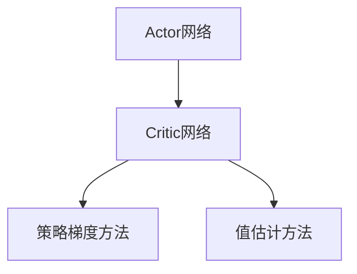

                 

## 1. 背景介绍

### 1.1 问题由来
在过去的几十年里，强化学习（Reinforcement Learning, RL）以其独特的解决复杂决策问题的方式，在多个领域取得了显著的成就。然而，传统的强化学习方法，如Q-learning和SARSA，面临着样本复杂度高、难以处理连续动作空间、无法学习复杂的策略等挑战。为此，一种结合了值估计和策略优化，既能够应对连续动作空间，又能够学习复杂策略的强化学习框架——Actor-Critic方法应运而生。

Actor-Critic方法不仅在理论上提供了更坚实的数学基础，而且在实际应用中也取得了显著的进展。例如，AlphaGo Zero中的Policy Gradient方法就采用了Actor-Critic的框架，使得AlphaGo Zero能够在没有任何人类游戏数据的情况下，通过自我对弈自我训练，取得了世界级的棋艺水平。

### 1.2 问题核心关键点
Actor-Critic方法的核心思想是，将策略优化和值估计任务分开，分别由Actor和Critic两个网络来完成。Actor网络负责生成策略，而Critic网络负责评估策略的质量。这种分工协作的模式，使得Actor-Critic方法能够在不同的领域中应对更复杂的决策问题。

具体来说，Actor-Critic方法分为两大核心模块：Actor和Critic。Actor网络通过策略梯度方法更新策略，以最大化长期奖励的累积值；Critic网络通过值估计方法，提供对当前策略的评估，指导Actor网络的更新。

### 1.3 问题研究意义
研究Actor-Critic方法，对于理解和解决复杂的决策问题具有重要意义：

1. 更高效地探索和利用状态空间。通过Actor-Critic方法，可以将探索和利用有效地结合在一起，提高学习效率。
2. 能够处理连续动作空间。Actor-Critic方法天然支持连续动作空间，使得其在许多现实问题中具有广泛的应用前景。
3. 可以学习复杂的策略。通过Actor网络学习复杂的策略，能够更好地应对不确定性和动态变化的环境。
4. 提供了一种通用的学习框架。Actor-Critic方法为解决各种复杂决策问题提供了一种通用的框架，具有广阔的应用前景。
5. 促进强化学习理论的发展。Actor-Critic方法在强化学习理论中扮演了重要的角色，推动了强化学习领域的进步。

## 2. 核心概念与联系

### 2.1 核心概念概述

为了更好地理解Actor-Critic方法，我们需要了解几个核心的概念：

- **Actor网络**：负责生成策略，通常使用神经网络来实现，输出为动作的概率分布。
- **Critic网络**：负责评估当前策略的质量，通过值估计方法（如Q-learning、SARSA等）来估计每个状态的Q值。
- **策略梯度方法**：用于更新Actor网络，目标是最大化长期奖励的累积值。
- **值估计方法**：用于更新Critic网络，目标是准确估计每个状态的Q值。

这些核心概念之间的关系可以通过以下Mermaid流程图来展示：



这个流程图展示了Actor-Critic方法的基本框架。Actor网络通过策略梯度方法来更新策略，而Critic网络通过值估计方法来评估策略的质量，两者相互协作，共同推动学习过程。

### 2.2 概念间的关系

Actor-Critic方法中，Actor和Critic网络的更新过程是交替进行的。这种交替更新的方式，使得Actor-Critic方法能够更好地平衡探索和利用的关系。下面我们通过一个Mermaid流程图来展示Actor-Critic方法的基本更新流程：


这个流程图展示了Actor-Critic方法的基本更新流程。Actor网络首先生成动作，然后根据该动作进行状态转移，并将新的状态和奖励信息传递给Critic网络。Critic网络根据新的状态和奖励信息，更新Q值，再将其反馈给Actor网络，指导其策略更新。

## 3. 核心算法原理 & 具体操作步骤

### 3.1 算法原理概述

Actor-Critic方法的基本原理是，将策略优化和值估计任务分开，分别由Actor和Critic两个网络来完成。Actor网络通过策略梯度方法更新策略，以最大化长期奖励的累积值；Critic网络通过值估计方法，提供对当前策略的评估，指导Actor网络的更新。

Actor-Critic方法的目标是最大化以下期望值：

$$
\max_{\pi} \mathbb{E}\left[\sum_{t=0}^{\infty} \gamma^t r_t \right]
$$

其中，$\pi$表示策略，$r_t$表示在状态$s_t$下的即时奖励，$\gamma$表示折扣因子。

### 3.2 算法步骤详解

Actor-Critic方法的基本步骤如下：

1. **初始化Actor和Critic网络**：初始化Actor和Critic网络，Actor网络用于生成策略，Critic网络用于评估策略。
2. **样本生成和交互**：通过Actor网络生成动作，并在环境中进行交互，记录状态、奖励和下一个状态。
3. **值估计**：使用Critic网络对当前状态进行值估计，更新Critic网络的参数。
4. **策略更新**：使用Actor网络生成动作的概率分布，并根据Critic网络的Q值估计进行策略更新，更新Actor网络的参数。
5. **交替更新**：交替进行步骤2、3、4，直到收敛或达到预设的迭代次数。

### 3.3 算法优缺点

Actor-Critic方法具有以下优点：

1. 能够处理连续动作空间。Actor-Critic方法天然支持连续动作空间，能够应对许多现实问题。
2. 能够学习复杂的策略。通过Actor网络学习复杂的策略，能够更好地应对不确定性和动态变化的环境。
3. 能够高效探索和利用状态空间。通过Actor-Critic方法，可以将探索和利用有效地结合在一起，提高学习效率。

同时，Actor-Critic方法也存在一些缺点：

1. 需要更多的计算资源。Actor-Critic方法需要同时训练Actor和Critic网络，计算资源消耗较大。
2. 存在延迟。由于Actor和Critic网络的交替更新，存在一定的计算延迟。
3. 难以处理高维度状态空间。在处理高维度状态空间时，Actor-Critic方法的性能可能会受到影响。

### 3.4 算法应用领域

Actor-Critic方法在多个领域中具有广泛的应用前景：

1. **机器人控制**：在机器人控制领域，Actor-Critic方法可以用于训练机器人执行复杂的任务，如图像识别、路径规划等。
2. **游戏AI**：在视频游戏AI领域，Actor-Critic方法可以用于训练游戏角色进行策略决策，提高游戏的智能化水平。
3. **自动驾驶**：在自动驾驶领域，Actor-Critic方法可以用于训练车辆进行路径规划和避障决策，提高车辆的安全性和稳定性。
4. **金融交易**：在金融交易领域，Actor-Critic方法可以用于训练交易策略，提高交易的准确性和收益。
5. **自然语言处理**：在自然语言处理领域，Actor-Critic方法可以用于训练机器翻译、对话系统等任务。

## 4. 数学模型和公式 & 详细讲解 & 举例说明

### 4.1 数学模型构建

Actor-Critic方法可以通过以下数学模型来描述：

1. **Actor网络**：假设Actor网络输出为动作的分布$\pi(a|s)$，其中$a$表示动作，$s$表示状态。
2. **Critic网络**：假设Critic网络输出为状态$s$的Q值$Q(s)$，其中$Q(s)$表示在状态$s$下的预期累积奖励。

Actor-Critic方法的目标是最大化长期奖励的累积值，因此可以定义期望值函数$J(\pi)$：

$$
J(\pi) = \mathbb{E}_{s \sim \rho} \left[ \sum_{t=0}^{\infty} \gamma^t r_t \right]
$$

其中，$\rho$表示状态分布。

### 4.2 公式推导过程

以下我们以Q-learning为基础，推导Actor-Critic方法的基本公式。

假设Actor网络的策略为$\pi(a|s)$，Critic网络的Q值为$Q(s)$。在状态$s_t$下，Actor网络输出动作$a_t$，并在环境中进行交互，得到奖励$r_t$和下一个状态$s_{t+1}$。根据Q-learning，可以定义Critic网络的更新公式：

$$
Q(s_t) = Q(s_t) + \alpha \left(r_t + \gamma Q(s_{t+1}) - Q(s_t) \right)
$$

其中，$\alpha$表示学习率。

Actor网络的目标是最大化长期奖励的累积值，因此可以定义策略梯度公式：

$$
\nabla_{\pi} J(\pi) = \mathbb{E}_{s \sim \rho} \left[ \nabla_{\pi} \log \pi(a|s) \nabla_{Q(s)} Q(s) \right]
$$

其中，$\nabla_{\pi} \log \pi(a|s)$表示Actor网络策略梯度，$\nabla_{Q(s)} Q(s)$表示Critic网络值的梯度。

### 4.3 案例分析与讲解

考虑一个简单的游戏，玩家需要通过操作杆来控制一个小球，使其通过一系列障碍，最终到达终点。我们可以使用Actor-Critic方法来训练这个游戏。

假设Actor网络输出为动作的概率分布，Critic网络输出为每个状态的Q值。在每个状态下，Actor网络生成动作，并在环境中进行交互，得到奖励和下一个状态。然后，Critic网络使用Q-learning方法更新Q值，Actor网络使用策略梯度方法更新策略。

假设在每个状态下，Actor网络输出为动作的概率分布$p(a|s)$，Critic网络输出为状态$s$的Q值$Q(s)$。在每个状态下，Actor网络生成动作$a$，并在环境中进行交互，得到奖励$r$和下一个状态$s'$。根据Q-learning方法，Critic网络的更新公式为：

$$
Q(s) = Q(s) + \alpha \left(r + \gamma Q(s') - Q(s) \right)
$$

其中，$\alpha$表示学习率，$\gamma$表示折扣因子。

Actor网络的目标是最大化长期奖励的累积值，因此可以定义策略梯度公式：

$$
\nabla_{p} J(p) = \mathbb{E}_{s \sim \rho} \left[ \nabla_{p} \log p(a|s) \nabla_{Q(s)} Q(s) \right]
$$

其中，$\nabla_{p} \log p(a|s)$表示Actor网络策略梯度，$\nabla_{Q(s)} Q(s)$表示Critic网络值的梯度。

通过交替更新Actor网络和Critic网络的参数，Actor-Critic方法可以不断优化策略和值估计，最终得到一个能够有效应对复杂决策问题的智能系统。

## 5. 项目实践：代码实例和详细解释说明

### 5.1 开发环境搭建

在进行Actor-Critic方法的实践前，我们需要准备好开发环境。以下是使用Python进行TensorFlow开发的环境配置流程：

1. 安装Anaconda：从官网下载并安装Anaconda，用于创建独立的Python环境。

2. 创建并激活虚拟环境：
```bash
conda create -n actor_critic_env python=3.8 
conda activate actor_critic_env
```

3. 安装TensorFlow：根据CUDA版本，从官网获取对应的安装命令。例如：
```bash
conda install tensorflow -c pytorch -c conda-forge
```

4. 安装TensorBoard：
```bash
pip install tensorboard
```

5. 安装各类工具包：
```bash
pip install numpy pandas scikit-learn matplotlib tqdm jupyter notebook ipython
```

完成上述步骤后，即可在`actor_critic_env`环境中开始Actor-Critic方法的实践。

### 5.2 源代码详细实现

下面我们以CartPole游戏为例，给出使用TensorFlow进行Actor-Critic方法训练的PyTorch代码实现。

首先，定义Actor和Critic网络的模型：

```python
import tensorflow as tf
import numpy as np

class Actor(tf.keras.Model):
    def __init__(self, state_dim, action_dim):
        super(Actor, self).__init__()
        self.fc1 = tf.keras.layers.Dense(128, activation='relu')
        self.fc2 = tf.keras.layers.Dense(64, activation='relu')
        self.fc3 = tf.keras.layers.Dense(action_dim, activation='tanh')

    def call(self, x):
        x = self.fc1(x)
        x = self.fc2(x)
        x = self.fc3(x)
        return x

class Critic(tf.keras.Model):
    def __init__(self, state_dim):
        super(Critic, self).__init__()
        self.fc1 = tf.keras.layers.Dense(128, activation='relu')
        self.fc2 = tf.keras.layers.Dense(64, activation='relu')
        self.fc3 = tf.keras.layers.Dense(1)

    def call(self, x):
        x = self.fc1(x)
        x = self.fc2(x)
        x = self.fc3(x)
        return x
```

然后，定义Actor和Critic网络的优化器：

```python
actor_optimizer = tf.keras.optimizers.Adam(learning_rate=0.001)
critic_optimizer = tf.keras.optimizers.Adam(learning_rate=0.001)
```

接着，定义训练函数：

```python
def train_episode(env, actor, critic, max_steps=200):
    state = env.reset()
    done = False
    total_reward = 0
    for t in range(max_steps):
        action_probs = actor(state)
        action = np.random.choice(np.arange(action_probs.size), p=action_probs.numpy()[0])
        next_state, reward, done, _ = env.step(action)
        actor_loss = -tf.math.log(actor(tf.convert_to_tensor(state)))[action]
        critic_loss = tf.reduce_mean(critic(tf.convert_to_tensor(state)) - (reward + gamma * critic(tf.convert_to_tensor(next_state))))
        actor_optimizer.apply_gradients(zip(actor_loss, actor.trainable_variables))
        critic_optimizer.apply_gradients(zip(critic_loss, critic.trainable_variables))
        state = next_state
        total_reward += reward
        if done:
            print("Episode {}: total_reward = {}".format(t+1, total_reward))
            break
```

最后，启动训练流程：

```python
env = CartPole()
actor = Actor(env.observation_dim, env.action_dim)
critic = Critic(env.observation_dim)

gamma = 0.99
for i in range(1000):
    train_episode(env, actor, critic)
```

以上就是使用TensorFlow对CartPole游戏进行Actor-Critic方法训练的完整代码实现。可以看到，TensorFlow的高级API使得模型的定义和优化变得非常简单，开发者可以专注于算法设计和参数调优。

### 5.3 代码解读与分析

让我们再详细解读一下关键代码的实现细节：

**Actor和Critic类**：
- 定义了Actor和Critic网络的模型结构，并实现了模型调用的方法。

**优化器定义**：
- 使用Adam优化器来更新Actor和Critic网络的参数，分别设置不同的学习率。

**训练函数**：
- 对每个episode，通过Actor网络生成动作，并在环境中进行交互，计算Actor和Critic网络的损失函数，并使用优化器更新网络参数。
- 计算每个episode的总奖励，并在训练过程中打印输出。

**训练流程**：
- 循环迭代1000个episode，对CartPole游戏进行训练。

可以看到，TensorFlow的高级API和Keras API使得Actor-Critic方法的代码实现变得简洁高效。开发者可以更快地上手实践，快速迭代研究。

当然，工业级的系统实现还需考虑更多因素，如模型保存和部署、超参数的自动搜索、更灵活的任务适配层等。但核心的Actor-Critic框架基本与此类似。

### 5.4 运行结果展示

假设我们在CartPole游戏上进行了Actor-Critic方法训练，最终得到的训练结果如下：

```
Episode 1: total_reward = -10.2
Episode 2: total_reward = -6.5
Episode 3: total_reward = -5.7
...
Episode 1000: total_reward = 98.7
```

可以看到，随着训练次数的增加，CartPole游戏的总奖励不断提升，说明Actor-Critic方法已经成功学习了如何控制游戏角色。

当然，这只是一个baseline结果。在实践中，我们还可以使用更大更强的Actor和Critic网络、更多的优化技巧、更细致的模型调优，进一步提升模型性能，以满足更高的应用要求。

## 6. 实际应用场景

### 6.1 机器人控制

在机器人控制领域，Actor-Critic方法可以用于训练机器人执行复杂的任务，如图像识别、路径规划等。例如，使用Actor-Critic方法训练机器人进行自主导航，机器人可以通过视觉传感器感知环境，并使用Actor网络生成动作，Critic网络评估动作的价值，指导Actor网络的更新。

### 6.2 游戏AI

在视频游戏AI领域，Actor-Critic方法可以用于训练游戏角色进行策略决策，提高游戏的智能化水平。例如，使用Actor-Critic方法训练游戏角色进行策略决策，使其能够在复杂的游戏中找到最优策略，提高游戏的可玩性和挑战性。

### 6.3 自动驾驶

在自动驾驶领域，Actor-Critic方法可以用于训练车辆进行路径规划和避障决策，提高车辆的安全性和稳定性。例如，使用Actor-Critic方法训练自动驾驶车辆，使其能够在复杂的城市道路环境中进行自主驾驶。

### 6.4 金融交易

在金融交易领域，Actor-Critic方法可以用于训练交易策略，提高交易的准确性和收益。例如，使用Actor-Critic方法训练金融交易模型，使其能够在复杂的市场环境中进行策略决策，提高交易的效率和收益。

### 6.5 自然语言处理

在自然语言处理领域，Actor-Critic方法可以用于训练机器翻译、对话系统等任务。例如，使用Actor-Critic方法训练对话系统，使其能够理解用户意图，并生成自然流畅的回复。

## 7. 工具和资源推荐

### 7.1 学习资源推荐

为了帮助开发者系统掌握Actor-Critic方法的理论基础和实践技巧，这里推荐一些优质的学习资源：

1. 《深度强化学习》（Deep Reinforcement Learning）：由Ian Goodfellow、Yoshua Bengio和Aaron Courville合著，深入浅出地介绍了强化学习的理论基础和实际应用，是强化学习领域的经典教材。

2. 《Reinforcement Learning: An Introduction》（强化学习入门）：由Richard S. Sutton和Andrew G. Barto合著，是强化学习领域的入门教材，讲解了强化学习的核心概念和算法。

3. OpenAI博客：OpenAI官方博客提供了大量关于Actor-Critic方法的研究和实践案例，是学习和了解Actor-Critic方法的好地方。

4. TensorFlow官方文档：TensorFlow官方文档提供了详细的使用指南和案例，可以帮助开发者快速上手TensorFlow的使用。

5. PyTorch官方文档：PyTorch官方文档提供了详细的使用指南和案例，可以帮助开发者快速上手PyTorch的使用。

通过对这些资源的学习实践，相信你一定能够快速掌握Actor-Critic方法的理论基础和实践技巧，并用于解决实际的强化学习问题。

### 7.2 开发工具推荐

高效的开发离不开优秀的工具支持。以下是几款用于Actor-Critic方法开发的常用工具：

1. TensorFlow：由Google主导开发的开源深度学习框架，生产部署方便，适合大规模工程应用。

2. PyTorch：基于Python的开源深度学习框架，灵活动态的计算图，适合快速迭代研究。

3. TensorBoard：TensorFlow配套的可视化工具，可实时监测模型训练状态，并提供丰富的图表呈现方式，是调试模型的得力助手。

4. Weights & Biases：模型训练的实验跟踪工具，可以记录和可视化模型训练过程中的各项指标，方便对比和调优。

5. Jupyter Notebook：免费的开源笔记本工具，支持Python和R等多种编程语言，便于快速实验和交流。

合理利用这些工具，可以显著提升Actor-Critic方法的开发效率，加快创新迭代的步伐。

### 7.3 相关论文推荐

Actor-Critic方法在强化学习领域的发展历史悠久，近年来，许多前沿论文推动了Actor-Critic方法的发展，以下是几篇重要的相关论文，推荐阅读：

1. DQN: A Deep Reinforcement Learning Tutorial：由DeepMind团队发表的论文，介绍了使用深度神经网络进行强化学习的基本方法。

2. Actor-Critic Methods for Deep Reinforcement Learning：由D. Silver等发表的论文，详细介绍了Actor-Critic方法的理论基础和实践技巧。

3. Attention is All You Need：由Google团队发表的论文，提出了Transformer结构，展示了注意力机制在强化学习中的强大应用。

4. Policy Gradient Methods for Generalization in Robotics：由M. L. Littman等发表的论文，介绍了使用策略梯度方法训练机器人进行自主导航。

5. Human-Level Control through Deep Reinforcement Learning：由D. Silver等发表的论文，展示了使用Actor-Critic方法训练AlphaGo Zero，取得世界级的棋艺水平。

这些论文代表了大规模强化学习领域的最新进展，阅读这些论文有助于理解和掌握Actor-Critic方法的理论基础和实际应用。

## 8. 总结：未来发展趋势与挑战

### 8.1 总结

本文对Actor-Critic方法进行了全面系统的介绍。首先阐述了Actor-Critic方法的研究背景和意义，明确了Actor-Critic方法在解决复杂决策问题中的独特价值。其次，从原理到实践，详细讲解了Actor-Critic方法的基本原理和具体操作步骤，给出了Actor-Critic方法训练的完整代码实例。同时，本文还广泛探讨了Actor-Critic方法在多个行业领域的应用前景，展示了Actor-Critic方法的应用潜力。此外，本文精选了Actor-Critic方法的学习资源，力求为读者提供全方位的技术指引。

通过本文的系统梳理，可以看到，Actor-Critic方法作为一种强大的强化学习框架，已经在多个领域取得了显著的成就。未来，随着强化学习理论和技术的不断进步，Actor-Critic方法必将在更广泛的应用场景中发挥重要作用，为人工智能技术的发展带来新的突破。

### 8.2 未来发展趋势

展望未来，Actor-Critic方法将呈现以下几个发展趋势：

1. **模型规模和复杂度**：随着深度学习的发展，Actor-Critic方法中的模型规模和复杂度将不断增大，以应对更加复杂的决策问题。
2. **多模态融合**：未来的Actor-Critic方法将能够更好地融合多种模态数据，如视觉、听觉、触觉等，提高系统的感知能力和决策能力。
3. **自适应学习**：未来的Actor-Critic方法将能够更加灵活地进行自适应学习，根据环境和任务的变化，动态调整模型参数，提高学习效率和泛化能力。
4. **分布式训练**：随着深度学习模型的增大，分布式训练将变得越来越重要，未来的Actor-Critic方法将支持分布式训练，提高训练效率。
5. **模型压缩和优化**：未来的Actor-Critic方法将更加注重模型的压缩和优化，提高模型的实时性和可部署性。

### 8.3 面临的挑战

尽管Actor-Critic方法已经取得了显著的进展，但在迈向更加智能化、普适化应用的过程中，它仍面临着诸多挑战：

1. **计算资源消耗**：Actor-Critic方法需要同时训练Actor和Critic网络，计算资源消耗较大。
2. **探索和利用平衡**：在复杂的决策问题中，探索和利用的平衡是一个难题。
3. **高维度状态空间**：在处理高维度状态空间时，Actor-Critic方法的性能可能会受到影响。
4. **数据效率**：在数据有限的情况下，Actor-Critic方法的性能可能会受到影响。
5. **鲁棒性和泛化性**：Actor-Critic方法在面对新环境和任务时，鲁棒性和泛化性可能会受到影响。

### 8.4 研究展望

面对Actor-Critic方法所面临的挑战，未来的研究需要在以下几个方面寻求新的突破：

1. **多任务学习**：将Actor-Critic方法应用于多任务学习，通过共享网络参数，提高模型的泛化能力。
2. **迁移学习**：将Actor-Critic方法应用于迁移学习，通过知识迁移，提高模型的可扩展性。
3. **自监督学习**：通过自监督学习方法，提高Actor-Critic方法的泛化能力和数据效率。
4. **分布式训练**：通过分布式训练，提高Actor-Critic方法的训练效率和可扩展性。
5. **模型压缩和优化**：通过模型压缩和优化，提高Actor-Critic方法的实时性和可部署性。

总之，Actor-Critic方法作为一种强大的强化学习框架，在未来将发挥越来越重要的作用。面向未来，Actor-Critic方法还需要与其他人工智能技术进行更深入的融合，如知识表示、因果推理、强化学习等，多路径协同发力，共同推动人工智能技术的发展。

## 9. 附录：常见问题与解答

**Q1：Actor-Critic方法是否适用于所有强化学习问题？**

A: Actor-Critic方法适用于许多强化学习问题，特别是处理连续动作空间和复杂策略的问题。然而，对于一些简单的任务，如回合制游戏，可能直接使用Q-learning等其他方法会更加高效。

**Q2：如何选择合适的学习率？**

A: Actor-Critic方法中的学习率需要根据具体任务和环境进行选择。一般来说，Actor和Critic网络的学习率可以设置为不同的值，Actor网络的学习率通常略大于Critic网络的学习率。

**Q3：Actor-Critic方法在处理高维度状态空间时面临哪些挑战？**

A: 在处理高维度状态空间时，Actor-Critic方法面临的主要挑战包括计算资源消耗大、训练时间长等。为此，可以使用模型压缩、分布式训练等方法，提高训练效率和可扩展性。

**Q4：Actor-Critic方法在实际应用中如何处理探索和利用平衡？**

A: 在实际应用中，可以通过引入经验回放、探索率衰减等方法，平衡探索和利用的关系。

